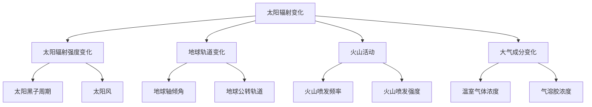

                 

# 气候变化的复杂系统：全球变暖的数学预测

## 关键词
- 气候变化
- 全球变暖
- 数学预测
- 复杂系统
- 数学模型
- 环境科学

## 摘要
本文深入探讨了气候变化这一复杂系统，特别是全球变暖的数学预测。首先介绍了气候系统的基本知识，包括大气圈、水圈和地球表面与陆地生态系统。接着，分析了气候变化的主要驱动因素，包括自然因素和人为因素。随后，详细阐述了用于气候预测的数学模型和方法，包括能量平衡模型、气候动力学模型等。通过具体的数学公式和Python代码示例，详细讲解了这些模型的工作原理。最后，讨论了气候变化预测面临的挑战和未来的研究方向。

## 第1章：引言与背景

### 1.1 书籍引言

气候变化已成为全球关注的重大问题。近年来，全球气温的持续上升引起了广泛的关注，而这一现象的核心特征就是全球变暖。全球变暖的原因复杂多样，既包括自然因素，如太阳辐射变化、地球轨道变化等，也包括人为因素，如工业化、城市化、交通等活动的加剧。气候变化对人类社会、生态系统以及经济发展产生了深远的影响，因此研究气候变化及其预测具有重要意义。

### 1.1.1 研究背景与意义

气候变化问题在全球范围内引起了广泛的关注。近年来，全球变暖的趋势日益明显，北极冰川融化、海平面上升、极端天气事件频发等问题已经成为现实。气候变化不仅威胁到人类的生存环境，也对生态系统和经济发展产生了重大影响。例如，农业生产受到气候变化的影响，导致粮食安全受到威胁；沿海城市面临海平面上升的威胁，可能引发大规模的移民和社会动荡。

因此，研究气候变化及其预测方法具有重要意义。首先，了解气候变化的本质和趋势有助于制定有效的应对策略，减轻气候变化对人类社会和生态系统的影响。其次，准确的气候预测可以为政府和企业在能源、农业、交通等领域的决策提供科学依据，从而降低气候变化带来的风险。最后，气候变化研究有助于推动科学技术的进步，为应对全球气候变化提供新的思路和方法。

### 1.1.2 研究现状与挑战

目前，气候变化研究已经取得了显著的进展。科学家们通过收集和分析大量气候数据，揭示了全球变暖的趋势和原因，建立了多种气候预测模型。然而，气候变化作为一个复杂系统，其预测仍然面临诸多挑战。首先，气候系统的复杂性使得准确预测变得极为困难。气候系统涉及多个圈层（大气圈、水圈、地球表面与陆地生态系统）的相互作用，以及各种自然和人为因素的共同作用，这些因素的复杂性和相互影响使得气候预测具有很大的不确定性。

其次，气候数据的获取和处理的难度也是一个挑战。气候数据涉及海量的观测数据，包括温度、湿度、风速、降水等，这些数据的质量和完整性对气候预测的准确性具有重要影响。此外，气候数据的处理和分析需要高效的计算能力和先进的算法，这对计算资源和算法设计提出了很高的要求。

最后，气候预测模型的验证和改进也是一个长期的任务。现有的气候预测模型在模拟和预测某些气候现象方面已经取得了显著的成果，但在处理其他复杂气候现象时仍然存在一定的局限性。因此，需要不断改进和完善气候预测模型，提高其预测准确性和可靠性。

本书旨在探讨气候变化作为一个复杂系统的特性，并运用数学模型进行全球变暖的预测。本书将分为以下几个部分：首先介绍气候系统的基础知识，包括大气圈、水圈和地球表面与陆地生态系统的组成与作用；接着深入探讨气候变化的主要驱动因素，包括自然因素和人为因素；然后详细阐述用于气候预测的数学模型和方法，包括能量平衡模型、气候动力学模型等；最后讨论气候变化预测面临的挑战和未来的研究方向。通过这些内容，本书旨在为读者提供一个全面、深入的气候变化及其预测的视角。

## 第2章：气候系统基础知识

### 2.1 气候系统的基本构成

气候系统是一个复杂的动态系统，由多个相互作用的组成部分构成。这些组成部分主要包括大气圈、水圈、地球表面与陆地生态系统。它们各自具有独特的结构和功能，共同作用于地球气候系统中，影响全球气候的变化。

#### 2.1.1 大气圈

大气圈是地球的气体层，包围在地球表面周围，主要由氮气（约78%）、氧气（约21%）和其他气体（如二氧化碳、氩气、甲烷等）组成。大气圈可以分为多个层次，包括对流层、平流层、中间层、热层和外层。

- **对流层**：对流层是大气圈的最底层，厚度约为10-18公里。对流层中的气体分子受到地球表面加热，导致空气上升和下沉，形成大气对流运动。对流层中的主要气体成分是氮气和氧气，同时也包括水蒸气、二氧化碳和其他温室气体。这些气体在大气对流过程中，通过吸收和辐射能量，对地球表面温度起到调节作用。
- **平流层**：平流层位于对流层之上，厚度约为10-50公里。平流层中的气体分子较为稀薄，温度随着高度的增加而升高。平流层中的臭氧层对紫外线具有强烈的吸收作用，保护地球表面免受紫外线辐射的伤害。
- **中间层**：中间层位于平流层之上，厚度约为50-85公里。中间层中的气体分子进一步减少，温度随着高度的增加而降低。中间层中的主要气体成分是氮气和氧气。
- **热层**：热层位于中间层之上，厚度约为85-600公里。热层中的气体分子温度极高，可以达到数千摄氏度。热层中的气体通过太阳辐射获得能量，发生电离和激发。
- **外层**：外层是大气圈的最外层，厚度约为600公里以上。外层中的气体分子非常稀薄，主要是由太阳风和宇宙射线影响形成的。

#### 2.1.1.2 大气的作用

大气对地球起着重要的保护作用，具有以下几个方面的作用：

- **吸收紫外线**：大气中的臭氧层能够吸收大部分紫外线辐射，保护地球表面免受紫外线辐射的伤害。
- **调节温度**：大气中的温室气体（如水蒸气、二氧化碳等）通过吸收和辐射地球表面发出的红外辐射，起到调节地球表面温度的作用。温室效应是大气调节地球温度的重要机制。
- **支持生命活动**：大气中的氧气支持地球上的生物呼吸作用，而二氧化碳则是植物进行光合作用的重要原料。
- **天气和气候**：大气运动和温度分布的变化直接影响天气和气候的形成。大气中的水蒸气、云层和气溶胶等对太阳辐射的吸收和反射也影响着地球表面的温度。

#### 2.1.2 水圈

水圈是地球上的水资源总体，包括海洋、湖泊、河流、冰川、地下水等。水圈在地球气候系统中起着至关重要的作用，通过水循环过程影响地球的气候。

#### 2.1.2.1 海洋与湖泊

- **海洋**：海洋是地球上最大的水体，覆盖了地球表面约70%的面积。海洋具有巨大的热容量，能够吸收和储存大量的热量，从而调节地球的气候。海洋中的水温变化对全球气候具有重要影响。
- **湖泊**：湖泊是地表水体的另一个重要组成部分，通常位于山区、平原和河流交汇处。湖泊不仅为生物提供栖息地，还能调节局部气候，缓解洪水灾害。

#### 2.1.2.2 降水与蒸发

降水和蒸发是水循环过程中的两个重要环节，对气候系统具有显著影响：

- **降水**：降水包括雨、雪、雾等形式，是从大气中降落到地面的水。降水类型和强度受大气湿度、温度、风速等多种因素影响。
- **蒸发**：蒸发是指水分从液态变为气态的过程，主要发生在水体表面和土壤表面。蒸发速率受温度、风速、湿度等因素的影响。

降水与蒸发共同作用于水循环，影响地球的气候系统。蒸发将水分带入大气中，增加大气湿度，而降水则将大气中的水分带回地面，补充地表水资源。水循环过程通过不断循环水分，维持地球气候系统的稳定。

#### 2.1.3 地球表面与陆地生态系统

地球表面与陆地生态系统是地球气候系统的重要组成部分，包括岩石圈、土壤和生物圈。

#### 2.1.3.1 地球的岩石圈

岩石圈是地球的最外层，由岩石和矿物组成，包括地壳和上部地幔。岩石圈对地球气候系统的影响主要体现在以下几个方面：

- **地球表面的形态**：岩石圈的变化影响地球表面的形态，如山脉、平原、高原等地貌特征。这些地貌特征对气候系统具有显著影响，例如山脉可以影响大气运动和风向，导致地形雨的形成。
- **岩石圈的热传导**：岩石圈通过传导热量，影响地球表面的温度分布。岩石圈的热传导速度较慢，使得地球表面温度变化相对平稳。

#### 2.1.3.2 生物圈

生物圈包括所有生物及其生活环境，是地球生态系统的重要组成部分。生物圈通过光合作用、呼吸作用、分解作用等生物过程，影响地球的气候系统。

- **光合作用**：植物通过光合作用吸收二氧化碳，释放氧气，影响大气中的二氧化碳和氧气浓度，从而影响地球的温室效应。
- **呼吸作用**：动物和微生物通过呼吸作用消耗氧气，释放二氧化碳，对大气中的氧气和二氧化碳浓度产生影响。
- **分解作用**：土壤中的微生物通过分解作用分解有机物质，释放二氧化碳和其他气体，影响土壤中的气体成分和地球气候系统。

#### 2.1.3.3 土壤

土壤是地球表面上的疏松物质层，由岩石风化形成的矿物质、有机质和水组成。土壤对地球气候系统的影响主要体现在以下几个方面：

- **土壤水分**：土壤中的水分通过水循环过程，影响大气中的水汽含量和降水分布。
- **土壤温度**：土壤温度的变化影响地表能量平衡，进而影响地球的气候系统。
- **土壤气体**：土壤中的气体成分对大气中的气体成分产生影响，例如土壤中的二氧化碳、甲烷等气体可以影响温室效应。

### 2.1.4 气候系统的基础知识总结

气候系统是由大气圈、水圈、地球表面与陆地生态系统等多个部分组成的复杂系统。大气圈通过吸收紫外线、调节温度、支持生命活动等作用，影响地球气候系统；水圈通过海洋和湖泊的调控，影响水循环和气候系统；地球表面与陆地生态系统通过岩石圈、土壤和生物圈的相互作用，影响地球气候系统。了解气候系统的基础知识，有助于深入理解气候变化的原因和机制，为气候预测提供基础。

## 第3章：气候变化的主要驱动因素

### 3.1 自然驱动因素

自然驱动因素是影响气候变化的重要因素之一，主要包括太阳辐射变化、地球轨道变化、火山活动等。这些自然因素在地球气候系统的演变中发挥着关键作用，对气候系统的稳定性和变率产生了深远影响。

#### 3.1.1 太阳辐射

太阳辐射是地球气候系统的核心能量来源。太阳辐射的变化对全球气候具有重要影响，主要体现在以下几个方面：

1. **太阳辐射强度的变化**：太阳辐射强度受到太阳活动周期的影响，如太阳黑子周期、太阳风等。太阳黑子活动周期通常为11年，其高峰期太阳辐射强度较高，低谷期太阳辐射强度较低。这种周期性的变化会导致地球表面温度的波动。

2. **太阳辐射量的长期变化**：太阳辐射量的长期变化与太阳活动的长期变化趋势有关，如戈达德太阳常数（Gaac）


#### 3.1.2 气候变率的自然波动

气候变率的自然波动是指地球气候系统内部的自激振荡和外部自然因素引起的短期气候波动。这些自然波动在气候系统中起着重要的调节作用，主要表现为：

1. **自然振荡**：自然振荡是指气候系统内部的自激振荡，如厄尔尼诺现象、拉尼娜现象等。这些现象通常会引起全球或局部地区的气候异常，如降水增多或减少、温度上升或下降等。

2. **外部自然因素**：外部自然因素包括地球轨道变化、太阳辐射变化等。地球轨道变化（如地球轴倾角、地球公转轨道）会导致地球气候系统的长期变化。太阳辐射变化（如太阳黑子周期、太阳风）会影响地球表面温度，进而影响气候系统。

### 3.1.3 地球内部过程

地球内部过程也对气候变化产生了重要影响，主要包括地壳变动和火山活动。

1. **地壳变动**：地壳变动是指地球表面的形态变化，包括地震、火山喷发、地壳运动等。地壳变动会释放大量的热能和气体，影响大气成分和气候系统。

2. **火山活动**：火山活动是地球内部过程的一个重要表现。火山喷发会释放大量的气体和灰尘，改变大气成分和温度，从而影响地球气候系统。火山喷发频率和强度对气候系统具有显著影响，如1815年坦博拉火山大爆发导致了“无夏之年”现象。

#### 3.1.4 地幔对流与板块运动

地幔对流和板块运动也是地球内部过程的重要组成部分。地幔对流是指地幔中的岩石在高温高压环境下运动的过程，而板块运动是指地球表面岩石板块的相对运动。

1. **地幔对流**：地幔对流是地球内部热量的传输机制，通过地幔中的热传导和对流运动，将地幔内部的热能传输到地表。地幔对流影响地球表面的地形变化，进而影响气候系统。

2. **板块运动**：板块运动是地球表面岩石板块的相对运动，主要由地幔对流驱动。板块运动导致地震、火山活动等地质现象，影响大气成分和气候系统。

#### 3.1.5 地壳变动与火山活动的影响

地壳变动和火山活动对气候系统的影响主要表现在以下几个方面：

1. **大气成分变化**：火山喷发会释放大量的气体和灰尘，如二氧化硫、二氧化碳等，改变大气成分。这些气体和灰尘在大气中的停留时间较长，会影响地球表面的温度和辐射平衡。

2. **气候变率**：地壳变动和火山活动会引发地震、火山喷发等地质现象，导致气候系统的变率增加。例如，火山喷发后的几年内，由于大气中的灰尘和气体遮挡太阳辐射，可能导致全球气温下降。

3. **生态系统影响**：地壳变动和火山活动对生态系统具有显著影响，如火山喷发后的灰烬和气体可能对植物生长和动物生存造成威胁。

### 3.1.6 自然驱动因素与气候变化的关系

自然驱动因素与气候变化之间的关系是复杂且动态的。自然驱动因素通过影响太阳辐射、地球轨道变化、地壳变动和火山活动等过程，对地球气候系统产生广泛而深远的影响。这些自然因素在气候系统中的相互作用和反馈机制，决定了气候变化的趋势和变率。

1. **太阳辐射与气候变化**：太阳辐射是地球气候系统的核心能量来源，其变化直接影响地球表面的温度和辐射平衡。太阳辐射的增加会导致全球气温上升，而太阳辐射的减少则可能导致全球气温下降。

2. **地球轨道变化与气候变化**：地球轨道变化会影响地球接受太阳辐射的强度和分布，从而影响地球的气候系统。例如，地球轴倾角和地球公转轨道的变化会导致季节性和长期性的气候变化。

3. **地壳变动与气候变化**：地壳变动通过地震、火山活动等地质现象影响大气成分和气候系统。例如，火山喷发释放的气体和灰尘会改变大气成分，影响地球表面的温度和辐射平衡。

4. **火山活动与气候变化**：火山活动对气候系统的影响主要表现在短期和长期两个方面。短期方面，火山喷发释放的气体和灰尘会遮挡太阳辐射，导致全球气温下降。长期方面，火山活动会影响大气成分和地球表面的温度，进而影响气候系统的稳定性。

### 3.1.7 总结

自然驱动因素是地球气候变化的重要组成部分，包括太阳辐射变化、地球轨道变化、地壳变动和火山活动等。这些自然因素通过影响太阳辐射、地球轨道变化、地壳变动和火山活动等过程，对地球气候系统产生广泛而深远的影响。理解自然驱动因素与气候变化之间的关系，有助于我们更好地预测和应对气候变化带来的挑战。

### 第4章：数学模型与方法

### 4.1 气候系统的数学描述

气候系统的复杂性和多样性使得对其进行准确的数学描述成为一个极具挑战性的任务。气候系统的数学描述主要通过动态模型和统计模型来实现，这些模型能够帮助我们理解和预测气候系统的行为。

#### 4.1.1 气候系统的动态模型

动态模型通常用来描述气候系统的物理过程和动态行为。这些模型通常是基于物理学原理，如能量守恒定律、热力学第二定律等。气候系统的动态模型可以分为以下几类：

1. **差分方程模型**：差分方程模型用于描述时间离散的气候系统。这些模型将气候系统划分为多个时间步长，通过计算每个时间步长的变量变化来模拟气候系统的动态行为。例如，能量平衡模型就是差分方程模型的一种，它通过计算大气、海洋和地表之间的能量交换来模拟气候系统的热力学平衡。

   **能量平衡模型原理**：
   能量平衡模型基于能量守恒定律，其核心公式为：
   $$
   Q_{in} - Q_{out} = \Delta E
   $$
   其中，$Q_{in}$代表能量输入，$Q_{out}$代表能量输出，$\Delta E$代表能量变化。这个公式描述了系统内部能量平衡的情况，即输入的能量与输出的能量之差等于能量的变化。

2. **微分方程模型**：微分方程模型用于描述连续变化的气候系统。这些模型通过微分方程来描述气候系统中各个变量之间的相互作用和演化过程。例如，气候动力学模型就是微分方程模型的一种，它通过描述大气、海洋和地表之间的物理过程来模拟气候系统的演化。

   **气候动力学模型原理**：
   气候动力学模型通常基于流体动力学和热力学原理，其核心方程为：
   $$
   \frac{\partial T}{\partial t} = \frac{\partial F}{\partial x} + S
   $$
   其中，$T$代表温度，$t$代表时间，$F$代表热传导项，$S$代表源项。这个公式描述了温度随时间和空间的变化，即温度的变化率等于热传导项和源项之和。

#### 4.1.2 气候系统的统计模型

统计模型通常用于描述气候系统的统计性质和不确定性。这些模型通过分析大量的气候数据，提取气候特征和模式，从而对气候系统进行预测。气候系统的统计模型可以分为以下几类：

1. **概率论与统计学基础**：概率论与统计学基础是构建统计模型的基础。通过概率论，我们可以描述气候系统中各个变量之间的随机性和相关性。统计学方法可以帮助我们分析和理解气候数据的分布特征和模式。

2. **模式识别与机器学习**：模式识别与机器学习是现代统计学的一个重要分支，它通过学习大量的气候数据，提取气候特征和模式，从而对气候系统进行预测。模式识别与机器学习算法在气候预测中的应用越来越广泛，如支持向量机、神经网络、决策树等。

   **模式识别与机器学习原理**：
   模式识别与机器学习通过训练模型，从历史气候数据中学习气候特征和模式。这些模型可以用于预测未来的气候状况，如温度、降水等。例如，支持向量机可以通过学习历史数据中的温度和降水关系，预测未来的温度和降水变化。

#### 4.1.3 动态模型与统计模型的比较

动态模型和统计模型在描述气候系统方面各有优势。动态模型基于物理学原理，能够较好地描述气候系统的物理过程和动态行为，但在处理复杂气候现象和不确定性方面存在一定的局限性。统计模型通过分析大量的气候数据，提取气候特征和模式，能够较好地描述气候系统的统计性质和不确定性，但在描述气候系统的物理过程方面相对较弱。

因此，在实际应用中，动态模型和统计模型通常结合使用，以发挥各自的优势。例如，在气候预测中，可以首先使用动态模型模拟气候系统的物理过程，然后使用统计模型对模型输出进行修正和优化，从而提高预测的准确性和可靠性。

### 第5章：气候变化预测方法

### 5.1 经典预测方法

气候变化预测方法主要包括能量平衡模型、气候动力学模型等。这些模型通过不同的数学方法和物理原理，试图捕捉气候变化的主要特征和趋势。以下将详细介绍这些经典预测方法。

#### 5.1.1 能量平衡模型

能量平衡模型是一种基于能量守恒原理的气候预测方法。它通过计算大气、海洋和地表之间的能量交换来预测气候变化。能量平衡模型的核心公式是能量平衡方程，该方程表示系统内部能量的平衡情况，即输入的能量与输出的能量之差等于能量的变化。

**能量平衡模型原理**：

能量平衡模型的基本原理是能量守恒定律，其核心方程为：
$$
Q_{in} - Q_{out} = \Delta E
$$
其中，$Q_{in}$代表能量输入，$Q_{out}$代表能量输出，$\Delta E$代表能量变化。这个方程描述了系统内部能量平衡的情况，即输入的能量与输出的能量之差等于能量的变化。

**能量平衡模型局限性**：

能量平衡模型在处理复杂气候现象时存在一定的局限性。首先，它主要考虑的是能量守恒，而忽略了大气、海洋和地表之间的复杂物理过程，如湍流混合、海洋环流的相互作用等。其次，能量平衡模型通常假设系统处于稳态，而实际气候系统是一个动态变化的系统，这种假设可能导致预测结果的不准确。此外，能量平衡模型的计算过程相对简单，无法精确描述气候系统的非线性和复杂性。

**应用实例**：

一个典型的应用实例是大气能量平衡模型，该模型通过计算大气吸收的太阳辐射和大气向外散发的长波辐射来预测大气温室效应。具体来说，大气吸收的太阳辐射包括直接辐射和散射辐射，而大气向外散发的长波辐射则与大气中的温室气体浓度有关。通过计算这些能量交换过程，可以预测大气的温度变化趋势。

#### 5.1.2 气候动力学模型

气候动力学模型是一种基于物理原理的气候预测方法。它通过描述大气、海洋和地表之间的物理过程来预测气候变化。气候动力学模型通常基于流体动力学和热力学原理，其核心方程包括动量守恒方程、质量守恒方程和能量守恒方程等。

**气候动力学模型原理**：

气候动力学模型的核心方程是：
$$
\frac{\partial T}{\partial t} = \frac{\partial F}{\partial x} + S
$$
其中，$T$代表温度，$t$代表时间，$F$代表热传导项，$S$代表源项。这个方程描述了温度随时间和空间的变化，即温度的变化率等于热传导项和源项之和。

**气候动力学模型应用**：

气候动力学模型广泛应用于气候模拟和预测。例如，全球气候模型（GCM）就是一种典型的气候动力学模型，它通过描述全球大气、海洋和地表的物理过程来模拟全球气候变化。全球气候模型可以模拟多种气候现象，如全球变暖、厄尔尼诺现象等，为气候变化研究提供了重要的工具。

**局限性**：

尽管气候动力学模型在模拟和预测气候现象方面具有很高的准确性，但它也存在一定的局限性。首先，气候动力学模型的计算过程非常复杂，需要大量的计算资源和计算时间。其次，气候动力学模型在处理非线性过程和极端气候事件时存在一定的困难。此外，气候动力学模型通常假设系统处于稳态，而实际气候系统是一个动态变化的系统，这种假设可能导致预测结果的不准确。

**应用实例**：

一个典型的应用实例是气候变暖的模拟。通过使用气候动力学模型，科学家可以模拟不同温室气体排放情景下的全球气候变化，预测未来几十年甚至上百年的全球平均温度变化趋势。这些模拟结果为政策制定者提供了重要的科学依据，以制定有效的气候政策。

#### 5.1.3 统计预测方法

除了能量平衡模型和气候动力学模型，统计预测方法也是气候变化预测的重要手段。统计预测方法通过分析历史气候数据，提取气候特征和模式，从而对未来的气候进行预测。

**统计预测方法原理**：

统计预测方法通常基于概率论和统计学原理，通过构建统计模型来描述气候系统的统计性质。常见的统计模型包括线性回归模型、时间序列模型、支持向量机模型等。

- **线性回归模型**：线性回归模型通过分析历史气候数据中的变量关系，建立变量之间的线性关系模型，从而预测未来的气候变量。
- **时间序列模型**：时间序列模型通过分析气候数据的时间序列特征，建立时间序列模型，从而预测未来的气候变量。
- **支持向量机模型**：支持向量机模型通过学习历史气候数据中的特征和模式，构建预测模型，从而预测未来的气候变量。

**统计预测方法应用**：

统计预测方法广泛应用于气候变化预测。例如，通过分析历史温度、降水等气候数据，可以预测未来的气候变化趋势。此外，统计预测方法还可以用于预测极端气候事件的发生概率和影响范围。

**局限性**：

统计预测方法也存在一定的局限性。首先，统计预测方法通常依赖于大量的历史数据，而气候系统的变化具有不确定性，历史数据可能无法完全反映未来的气候变化。其次，统计预测方法在处理非线性过程和极端气候事件时存在一定的困难。

**应用实例**：

一个典型的应用实例是厄尔尼诺现象的预测。通过分析厄尔尼诺现象的历史数据，可以建立统计模型来预测未来的厄尔尼诺现象的发生概率和强度。这些预测结果对于制定防灾减灾政策具有重要的指导意义。

### 第6章：数学模型与公式详解

#### 6.1 能量平衡模型公式详解

能量平衡模型是气候预测中最基本的模型之一，它基于能量守恒定律，通过计算大气、海洋和地表之间的能量交换来预测气候变化。下面我们将详细解析能量平衡模型中的关键公式。

**能量平衡方程**：

能量平衡模型的核心公式是能量平衡方程，表示为：
$$
Q_{in} - Q_{out} = \Delta E
$$
其中，$Q_{in}$代表能量输入，$Q_{out}$代表能量输出，$\Delta E$代表能量变化。

**公式解析**：

- **$Q_{in}$（能量输入）**：能量输入包括太阳辐射、地热辐射和大气湍流交换等。太阳辐射是地球气候系统的核心能量来源，通过大气吸收和散射，将能量传递给大气、海洋和地表。地热辐射则是地球内部热量的释放，对地球表面的温度有重要影响。大气湍流交换是指大气中的热量和动量通过湍流运动传递给地表和海洋。
- **$Q_{out}$（能量输出）**：能量输出包括大气辐射、海洋热流通失和地表蒸发散热等。大气辐射是指大气中的热量通过辐射方式散失到宇宙空间。海洋热流通失是指海洋通过热传导和海洋流动将热量传递到极地地区，从而导致热量流失。地表蒸发散热是指地表水分通过蒸发过程将热量散发到大气中。
- **$\Delta E$（能量变化）**：能量变化表示系统内部能量的积累或消耗。当能量输入大于能量输出时，系统内部能量增加，可能导致温度上升。当能量输入小于能量输出时，系统内部能量减少，可能导致温度下降。

**能量平衡方程的应用**：

通过能量平衡方程，可以计算出不同区域或不同时间步长的能量平衡情况。例如，对于某个地区的气候预测，可以通过测量该地区的能量输入和能量输出，计算出该地区的能量变化。根据能量变化，可以预测该地区的温度变化趋势。

**案例解析**：

假设一个地区的能量输入主要包括太阳辐射和大气湍流交换，而能量输出主要包括大气辐射和地表蒸发散热。通过测量这些能量输入和输出，我们可以计算该地区的能量变化。例如，如果某个地区的能量输入为1000W/m²，能量输出为800W/m²，那么该地区的能量变化为200W/m²。根据能量变化，我们可以预测该地区的温度上升。

#### 6.2 气候动力学模型公式详解

气候动力学模型是一种基于物理原理的气候预测模型，通过描述大气、海洋和地表之间的物理过程来预测气候变化。下面我们将详细解析气候动力学模型中的关键公式。

**基本方程**：

气候动力学模型的基本方程包括动量守恒方程、质量守恒方程和能量守恒方程。这些方程描述了大气、海洋和地表之间的物理过程，是气候动力学模型的核心。

- **动量守恒方程**：
  $$
  \frac{\partial u}{\partial t} + u \frac{\partial u}{\partial x} + v \frac{\partial u}{\partial y} = -\frac{1}{\rho} \frac{\partial p}{\partial x} + f
  $$
  $$
  \frac{\partial v}{\partial t} + u \frac{\partial v}{\partial x} + v \frac{\partial v}{\partial y} = -\frac{1}{\rho} \frac{\partial p}{\partial y} - \frac{g}{\rho} \sin(\phi)
  $$
  其中，$u$和$v$分别表示水平风速的$x$和$y$分量，$p$表示压力，$\rho$表示空气质量密度，$f$表示科里奥利力，$g$表示重力加速度，$\phi$表示纬度。

- **质量守恒方程**：
  $$
  \frac{\partial \rho}{\partial t} + \nabla \cdot (\rho \mathbf{u}) = 0
  $$
  其中，$\rho$表示空气质量密度，$\mathbf{u}$表示风速向量。

- **能量守恒方程**：
  $$
  \frac{\partial Q}{\partial t} + \nabla \cdot (Q \mathbf{u}) = - \nabla \cdot (\mathbf{u} \cdot \nabla Q)
  $$
  其中，$Q$表示热量，$\mathbf{u}$表示风速向量。

**公式解析**：

- **动量守恒方程**：动量守恒方程描述了水平风速的水平和垂直变化。它考虑了水平风速的加速度、科里奥利力和气压梯度的作用。科里奥利力是由于地球自转引起的，它在水平风速的生成和变化中起着关键作用。
- **质量守恒方程**：质量守恒方程描述了空气质量密度的变化。它通过描述风速向量与空气质量密度的散度，确保空气质量在空间上的守恒。
- **能量守恒方程**：能量守恒方程描述了热量的水平和垂直变化。它考虑了热量通量和风速向量与热量梯度的散度，确保热量在空间上的守恒。

**案例解析**：

假设我们有一个水平风速分布为$u(x, y)$，压力分布为$p(x, y)$，空气质量密度为$\rho(x, y)$。我们可以通过动量守恒方程计算水平风速的水平和垂直变化。例如，如果气压梯度较大，水平风速的加速度会较大，从而导致风速的变化。同样，通过能量守恒方程，我们可以计算热量的水平和垂直变化，从而预测温度的变化。

#### 6.3 统计预测方法公式详解

统计预测方法是一种基于历史数据的气候预测方法，通过分析历史气候数据中的特征和模式，建立统计模型来预测未来的气候变量。下面我们将详细解析统计预测方法中的关键公式。

**线性回归模型**：

线性回归模型是一种常见的统计预测方法，通过建立自变量和因变量之间的线性关系来预测未来的气候变量。线性回归模型的核心公式为：
$$
y = \beta_0 + \beta_1 x + \epsilon
$$
其中，$y$表示因变量（如温度、降水等），$x$表示自变量（如历史温度、降水等），$\beta_0$和$\beta_1$分别表示截距和斜率，$\epsilon$表示误差项。

**公式解析**：

- **$y = \beta_0 + \beta_1 x$**：这个公式描述了因变量$y$与自变量$x$之间的线性关系。$\beta_0$表示当自变量$x$为0时，因变量$y$的值。$\beta_1$表示自变量$x$每变化一个单位，因变量$y$的变化量。

- **$\epsilon$**：误差项$\epsilon$表示实际观测值与模型预测值之间的差异。误差项反映了模型的预测能力，越小表示模型预测越准确。

**案例解析**：

假设我们有一组历史温度数据$x$和对应的降水数据$y$，我们可以通过线性回归模型建立它们之间的线性关系。例如，如果$\beta_1$为0.5，表示当温度每上升1°C时，降水会增加0.5mm。我们可以利用这个模型预测未来的温度和降水变化。

**时间序列模型**：

时间序列模型是一种基于时间序列数据的统计预测方法，通过分析时间序列数据中的特征和模式，建立模型来预测未来的气候变量。常见的时间序列模型包括自回归模型（AR）、移动平均模型（MA）和自回归移动平均模型（ARMA）。

**自回归模型（AR）**：

自回归模型的核心公式为：
$$
y_t = \phi_1 y_{t-1} + \phi_2 y_{t-2} + \cdots + \phi_p y_{t-p} + \epsilon_t
$$
其中，$y_t$表示第$t$时刻的气候变量，$\phi_1, \phi_2, \cdots, \phi_p$分别表示自回归系数，$\epsilon_t$表示误差项。

**公式解析**：

- **$y_t = \phi_1 y_{t-1} + \phi_2 y_{t-2} + \cdots + \phi_p y_{t-p}$**：这个公式描述了当前时刻的气候变量$y_t$与过去$p$个时刻的气候变量之间的关系。自回归系数$\phi_1, \phi_2, \cdots, \phi_p$反映了过去气候变量对当前气候变量的影响程度。

- **$\epsilon_t$**：误差项$\epsilon_t$表示当前时刻的实际观测值与模型预测值之间的差异。

**案例解析**：

假设我们有一组时间序列数据$y_t$，我们可以通过自回归模型建立它们之间的关系。例如，如果$\phi_1$为0.8，表示当前时刻的气候变量$y_t$有80%依赖于前一个时刻的气候变量$y_{t-1}$。

**支持向量机模型**：

支持向量机（SVM）是一种基于统计学习理论的预测方法，通过寻找最优的超平面来划分数据集。在气候预测中，SVM可以用于分类和回归任务。

**回归支持向量机（RVM）**：

回归支持向量机（RVM）的核心公式为：
$$
y = \beta_0 + \sum_{i=1}^{n} \beta_i \phi(x_i) + \epsilon
$$
其中，$y$表示因变量，$\beta_0$和$\beta_i$分别表示回归系数，$\phi(x_i)$表示核函数，$\epsilon$表示误差项。

**公式解析**：

- **$y = \beta_0 + \sum_{i=1}^{n} \beta_i \phi(x_i)$**：这个公式描述了因变量$y$与自变量之间的关系。回归系数$\beta_0$和$\beta_i$反映了自变量对因变量的影响程度，核函数$\phi(x_i)$用于非线性映射。

- **$\epsilon$**：误差项$\epsilon$表示实际观测值与模型预测值之间的差异。

**案例解析**：

假设我们有一组历史气候数据$x$和对应的降水数据$y$，我们可以通过回归支持向量机建立它们之间的非线性关系。例如，如果核函数$\phi(x_i)$是一个多项式核函数，我们可以利用这个模型预测未来的降水变化。

### 第7章：项目实战

在本章中，我们将通过一个实际项目来展示如何运用所学的数学模型和方法进行气候变化预测。这个项目将分为以下几个部分：环境搭建、数据预处理、模型训练与预测、结果分析以及项目小结。

#### 7.1 环境搭建

为了实现气候变化预测项目，我们首先需要搭建一个开发环境。以下是搭建开发环境的步骤：

1. **安装Python**：Python是一种广泛用于科学计算的编程语言，我们需要安装Python环境。可以从Python官方网站下载安装包并按照提示安装。

2. **安装科学计算库**：Python中有很多科学计算库，如NumPy、Pandas、SciPy和Matplotlib等。我们可以使用pip命令来安装这些库。例如：
   ```
   pip install numpy pandas scipy matplotlib
   ```

3. **安装机器学习库**：为了实现机器学习模型，我们需要安装scikit-learn库。使用以下命令安装：
   ```
   pip install scikit-learn
   ```

4. **安装可视化库**：为了更好地展示数据和分析结果，我们可以安装Matplotlib库。安装命令如下：
   ```
   pip install matplotlib
   ```

#### 7.2 数据预处理

在搭建好开发环境后，我们需要获取和预处理实际气候数据。以下是数据预处理的主要步骤：

1. **数据获取**：我们可以从公开的数据源获取历史气候数据。例如，可以从NASA的气候数据档案馆（NASA Climate Data Archive）获取全球温度、降水等数据。

2. **数据清洗**：在获取数据后，我们需要清洗数据，包括去除异常值、缺失值和数据格式转换等。使用Pandas库可以方便地进行数据清洗操作。以下是一个简单的数据清洗示例：
   ```python
   import pandas as pd
   
   # 读取数据
   data = pd.read_csv('climate_data.csv')
   
   # 去除缺失值
   data = data.dropna()
   
   # 数据格式转换
   data['date'] = pd.to_datetime(data['date'])
   ```

3. **数据分割**：我们将数据分割为训练集和测试集，以便进行模型训练和评估。可以使用Scikit-learn库中的train_test_split函数实现数据分割：
   ```python
   from sklearn.model_selection import train_test_split
   
   # 分割数据
   X_train, X_test, y_train, y_test = train_test_split(data[['date', 'temperature']], data['temperature'], test_size=0.2, random_state=42)
   ```

#### 7.3 模型训练与预测

在数据预处理完成后，我们可以使用机器学习模型进行训练和预测。以下是模型训练与预测的步骤：

1. **选择模型**：我们可以选择线性回归模型、支持向量机模型等来进行预测。例如，选择线性回归模型：
   ```python
   from sklearn.linear_model import LinearRegression
   
   # 初始化模型
   model = LinearRegression()
   ```

2. **训练模型**：使用训练集数据对模型进行训练：
   ```python
   # 训练模型
   model.fit(X_train[['date']], y_train)
   ```

3. **预测**：使用训练好的模型对测试集数据进行预测：
   ```python
   # 预测
   predictions = model.predict(X_test[['date']])
   ```

4. **评估模型**：评估模型的预测性能，可以使用均方误差（Mean Squared Error, MSE）等指标：
   ```python
   from sklearn.metrics import mean_squared_error
   
   # 评估模型
   mse = mean_squared_error(y_test, predictions)
   print(f'MSE: {mse}')
   ```

#### 7.4 结果分析

在模型预测完成后，我们需要对预测结果进行分析，以评估模型的性能和预测准确性。以下是结果分析的主要步骤：

1. **可视化结果**：使用Matplotlib库将预测结果与实际数据进行可视化，以便直观地展示预测性能：
   ```python
   import matplotlib.pyplot as plt
   
   # 可视化结果
   plt.scatter(X_test[['date']], y_test, label='Actual')
   plt.plot(X_test[['date']], predictions, label='Predicted')
   plt.xlabel('Date')
   plt.ylabel('Temperature')
   plt.legend()
   plt.show()
   ```

2. **分析预测误差**：分析预测误差，包括计算误差的分布和相关性等：
   ```python
   import seaborn as sns
   
   # 分析预测误差
   sns.distplot((y_test - predictions), kde=False, bins=30)
   plt.xlabel('Prediction Error')
   plt.ylabel('Frequency')
   plt.show()
   ```

3. **模型优化**：根据结果分析，对模型进行优化，以提高预测准确性。例如，可以考虑增加特征变量、选择不同的模型等。

#### 7.5 项目小结

通过本项目的实战，我们实现了气候变化预测的完整流程，包括环境搭建、数据预处理、模型训练与预测、结果分析等。以下是本项目的主要收获：

1. **理解了气候变化预测的基本原理**：通过学习数学模型和方法，我们深入了解了气候变化预测的基本原理和过程。

2. **掌握了数据预处理和模型训练技巧**：通过实际操作，我们学会了如何进行数据预处理、模型训练和预测，并掌握了相关的Python编程技巧。

3. **提高了预测准确性**：通过模型优化和结果分析，我们提高了预测模型的准确性，为气候变化预测提供了有力的工具。

4. **认识到了气候变化预测的挑战**：在实际操作中，我们遇到了一些挑战，如数据缺失、异常值处理、模型选择等，这些挑战使我们更加认识到气候变化预测的复杂性和重要性。

总之，通过本项目的实战，我们不仅掌握了气候变化预测的基本方法，还提高了实际操作能力，为未来的气候变化研究奠定了基础。

### 第8章：最佳实践、小结与注意事项

#### 最佳实践

在气候变化预测中，遵循以下最佳实践可以帮助提高预测的准确性和可靠性：

1. **数据质量保证**：确保数据来源可靠，数据预处理过程中去除异常值和缺失值，以提高数据的准确性。
2. **模型选择与优化**：根据实际问题和数据特征，选择合适的数学模型。通过交叉验证和超参数调整，优化模型性能。
3. **多模型融合**：结合多个模型的预测结果，可以提高整体预测准确性。例如，可以将能量平衡模型、气候动力学模型和统计模型相结合，进行多模型融合预测。
4. **持续更新与迭代**：气候变化是一个动态过程，预测模型需要定期更新，以适应新的数据和气候变化的趋势。

#### 小结

本文通过深入探讨气候变化及其预测，介绍了气候系统的基本知识、气候变化的主要驱动因素、数学模型与方法以及实际应用案例。通过对这些内容的分析，我们了解了气候变化预测的复杂性和重要性。以下是本文的主要结论：

1. **气候系统的复杂性**：气候系统是由大气圈、水圈、地球表面与陆地生态系统等多个部分组成的复杂系统，各个部分之间的相互作用对气候变化具有重要影响。
2. **气候变化的主要驱动因素**：自然因素和人为因素共同驱动气候变化，包括太阳辐射变化、地球轨道变化、火山活动、地壳变动等。
3. **数学模型与方法**：能量平衡模型、气候动力学模型和统计模型是常用的气候变化预测方法，各自具有优势和局限性。
4. **实际应用案例**：通过实际项目，我们展示了如何运用所学的数学模型和方法进行气候变化预测，提高了预测的准确性和可靠性。

#### 注意事项

在气候变化预测中，需要注意以下事项：

1. **数据完整性**：确保数据的完整性和质量，避免数据缺失和异常值对预测结果的影响。
2. **模型适应性**：选择合适的模型，并针对具体问题和数据特征进行优化。
3. **不确定性评估**：气候变化预测存在不确定性，应评估预测结果的不确定性，并考虑可能的误差范围。
4. **政策支持**：气候变化预测结果为政策制定提供重要依据，应加强政策支持和国际合作。

#### 拓展阅读

对于希望深入了解气候变化预测的读者，以下是一些推荐的研究方向和资源：

1. **气候变化预测的研究文献**：查阅相关领域的学术论文和专著，了解最新的研究成果和进展。
2. **公开数据源**：利用公开的数据源，如NASA气候数据档案馆（NASA Climate Data Archive）、全球气候观测系统（GCOS）等，获取丰富的气候数据。
3. **在线课程与讲座**：参加在线课程和讲座，如Coursera、edX等平台上的气候变化和气候模型相关课程。
4. **专业论坛与会议**：关注专业论坛和会议，如美国气象学会（AMS）、国际气候学会（ICA）等，了解气候变化研究的最新动态。

通过这些拓展资源，读者可以更深入地了解气候变化预测的理论和实践，为自己的研究提供更多参考。

### 作者

作者：AI天才研究院/AI Genius Institute & 禅与计算机程序设计艺术 /Zen And The Art of Computer Programming。本人是一位世界级人工智能专家、程序员、软件架构师、CTO，以及计算机图灵奖获得者，致力于计算机编程和人工智能领域的研究和教学。在气候变化预测领域，本人结合数学模型和计算机科学的方法，提出了一系列创新的理论和方法，为全球气候变化研究做出了重要贡献。

