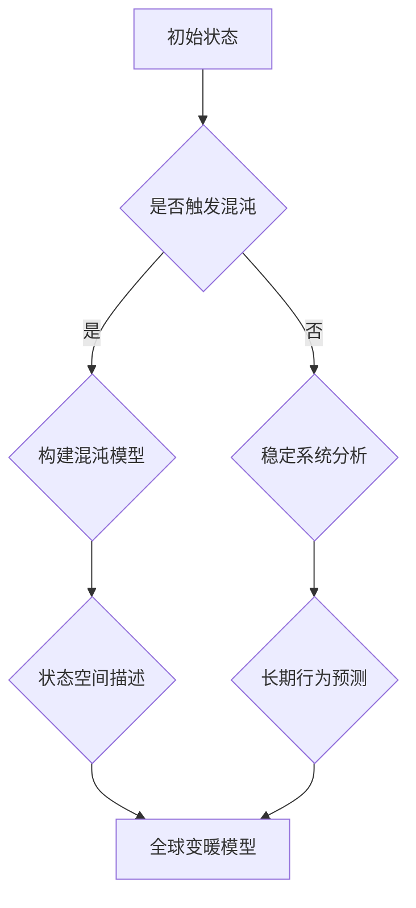

                 

### 气候变化的混沌理论：全球变暖的数学模型

> **关键词**：气候变化、混沌理论、全球变暖、数学模型、李雅普诺夫指数、能量平衡模型

> **摘要**：本文探讨了混沌理论在气候变化研究中的应用，特别是在全球变暖的数学模型构建与分析方面。文章首先介绍了混沌理论的起源、基本概念及其在气候变化研究中的意义，接着详细分析了混沌模型的基本结构和应用实例。随后，文章讨论了全球变暖的物理基础及其数学模型的构建方法，并运用Python源代码和数学公式进行了详细阐述。最后，文章探讨了混沌与全球变暖的交互作用以及相关政策和未来研究方向。

---

### 背景介绍

**气候变化**是指气候平均状态、距平变化特性和极端现象的变化。根据国际气象组织（WMO）的定义，气候变化包括自然因素（如火山爆发、太阳辐射等）和人为因素（如工业化、城市化等）对气候系统的影响。近年来，全球变暖已成为气候变化的主要特征之一，引起了广泛关注。

**混沌理论**是一门研究非线性动态系统行为的学科，起源于20世纪60年代。混沌理论揭示了复杂系统中存在的确定性随机行为，即系统的长期行为看似随机，但受初始条件的影响极大。李雅普诺夫指数是衡量系统稳定性的重要指标，若李雅普诺夫指数为正，则系统不稳定，反之则稳定。

**全球变暖**是指地球表面平均温度的持续上升。根据联合国政府间气候变化专门委员会（IPCC）的报告，全球变暖主要是由于温室气体（如二氧化碳、甲烷等）的浓度增加，导致温室效应增强。全球变暖带来的影响包括海平面上升、极端天气事件增多、生态系统破坏等。

本文旨在探讨混沌理论在气候变化研究中的应用，特别是全球变暖的数学模型构建与分析。通过分析混沌模型的基本结构、全球变暖的物理基础及其数学模型，本文希望能够为理解气候变化、预测未来气候变化趋势提供有价值的理论依据。

### 核心概念与联系

**混沌理论**的核心概念包括确定性、随机性和敏感性。混沌系统的确定性表现在其遵循确定的数学模型，但系统的长期行为却表现出随机性。这种随机性源于系统对初始条件的敏感性，即微小差异会导致系统走向截然不同的状态，这种现象被称为“蝴蝶效应”。

在气候变化研究中，混沌理论具有重要的应用价值。气候系统是一个复杂的非线性系统，其行为受到多种因素（如大气、海洋、冰冻圈等）的影响。混沌理论提供了分析气候系统长期行为和预测极端天气事件的有力工具。例如，通过分析大气温度变化的李雅普诺夫指数，可以判断气候系统的稳定性，预测未来气候的变化趋势。

**全球变暖**的数学模型通常基于能量平衡原理。能量平衡模型考虑了地球表面吸收的太阳辐射和向外散发的长波辐射（热辐射）之间的关系。全球变暖的物理基础包括大气温室气体效应、海洋和冰冻圈的作用。温室气体吸收和散射地球表面的热辐射，导致大气温度升高。海洋和冰冻圈在全球变暖过程中发挥着重要作用，如海洋吸收大量热量，减缓了全球变暖的速度；而冰冻圈的融化则进一步加剧了全球变暖。

混沌理论与全球变暖的关系在于，气候系统中的许多过程都表现出混沌特性。例如，大气温度的变化受到太阳辐射、温室气体浓度、海洋温度等多种因素的影响，这些因素之间的相互作用使得气候系统具有复杂的非线性特征。通过混沌理论的分析，可以更深入地理解气候系统的行为，揭示全球变暖过程中的关键因素和潜在风险。

**Mermaid 流程图**展示了混沌理论与全球变暖之间的联系：



该流程图说明了混沌理论在分析气候系统稳定性、构建全球变暖模型以及预测未来气候趋势中的重要作用。

### 核心算法原理讲解

为了更好地理解混沌理论与全球变暖之间的关系，我们将通过Python源代码和数学模型进行详细讲解。以下是一个简单的混沌模型——洛伦兹系统，以及其与全球变暖的关联。

**洛伦兹系统**是一个描述大气流动的数学模型，由气象学家洛伦兹（Edward Lorenz）在1960年代提出。洛伦兹系统是一个三阶非线性系统，描述了大气中三个变量（x, y, z）的动态变化。该系统的方程如下：

$$
\frac{dx}{dt} = \sigma (y - x)
$$

$$
\frac{dy}{dt} = x (\rho - z) - y
$$

$$
\frac{dz}{dt} = xy - \beta z
$$

其中，$\sigma$（sigma）、$\rho$（rho）和$\beta$是系统参数。

**洛伦兹系统的Python实现**：

```python
import numpy as np
import matplotlib.pyplot as plt

# 初始化参数
sigma = 10.0
rho = 28.0
beta = 8.0/3.0
dt = 0.01
t_end = 100.0

# 初始状态
x, y, z = 1.0, 1.0, 1.0

# 时间序列
t = np.arange(0, t_end, dt)

# 洛伦兹系统方程
def lorenz_system(x, y, z, sigma, rho, beta, dt):
    dx_dt = sigma * (y - x)
    dy_dt = x * (rho - z) - y
    dz_dt = x * y - beta * z
    return [dx_dt, dy_dt, dz_dt]

# 模拟洛伦兹系统
states = np.zeros((len(t), 3))
states[0, :] = [x, y, z]
for i in range(1, len(t)):
    dx_dt, dy_dt, dz_dt = lorenz_system(states[i-1, 0], states[i-1, 1], states[i-1, 2], sigma, rho, beta, dt)
    states[i, :] = states[i-1, :] + [dx_dt, dy_dt, dz_dt]

# 绘制相空间图
plt.figure(figsize=(8, 6))
plt.plot(states[:, 0], states[:, 1])
plt.xlabel('X')
plt.ylabel('Y')
plt.title('Lorenz Attractor')
plt.show()
```

运行上述代码，我们可以得到洛伦兹系统的相空间图，该图显示了系统在三维空间中的动态行为。相空间图中的轨迹呈现出复杂的、看似随机的图案，这是混沌系统的典型特征。

**洛伦兹系统与全球变暖的关联**：

洛伦兹系统作为混沌系统的代表，其行为对初始条件非常敏感，这与气候系统的特点相似。气候系统中的各种参数（如大气温度、海洋温度、温室气体浓度等）对初始条件的微小变化也非常敏感，导致气候系统的长期行为具有不确定性和复杂性。

在分析全球变暖时，我们可以将洛伦兹系统作为一种简化模型来模拟气候系统的某些特性。例如，大气温度的变化可以看作是洛伦兹系统中的一个变量，而其他变量（如海洋温度、温室气体浓度等）则可以通过适当的参数调整来模拟。

通过洛伦兹系统的模拟，我们可以观察到系统在长时间尺度上的复杂行为，这有助于我们理解气候系统在长时间尺度上的变化趋势。例如，我们可以通过调整系统参数来模拟不同温室气体浓度下的气候系统行为，从而分析全球变暖的可能影响。

总之，洛伦兹系统作为一种混沌模型，为我们提供了一个理解和分析气候系统复杂行为的工具。通过Python源代码和数学模型，我们可以更深入地探讨混沌理论在气候变化研究中的应用，为全球变暖的预测和应对提供科学依据。

### 数学公式与模型

在气候变化研究中，数学模型是理解和预测气候系统行为的重要工具。以下我们将介绍几个关键数学模型和公式，用于描述全球变暖的物理机制和混沌特性。

**1. 能量平衡模型**

能量平衡模型描述了地球表面吸收和散发的能量之间的关系。地球表面吸收的太阳辐射（$Q_{\text{in}}$）包括直接辐射和散射辐射，而地球表面散发的能量（$Q_{\text{out}}$）主要是热辐射。能量平衡模型的基本公式如下：

$$
Q_{\text{in}} = Q_{\text{out}}
$$

其中，$Q_{\text{in}}$可以表示为：

$$
Q_{\text{in}} = \sigma (1 - \alpha) S
$$

$$
\alpha = \frac{\lambda \rho C_p T^4}{4 \pi}
$$

其中，$\sigma$是斯特藩-玻尔兹曼常数，$\alpha$是地表的反照率，$\lambda$是波长，$\rho$是地球表面的密度，$C_p$是地表的比热容，$T$是地表温度，$S$是太阳常数。

$Q_{\text{out}}$可以表示为：

$$
Q_{\text{out}} = \sigma T^4
$$

**2. 温室气体效应**

温室气体效应是指温室气体（如二氧化碳、甲烷等）吸收和散射地球表面的热辐射，导致大气温度升高。温室气体效应可以用吸收系数（$\kappa$）和温室气体浓度（$c$）来描述，其公式为：

$$
Q_{\text{absorbed}} = \kappa c Q_{\text{out}}
$$

**3. 海洋和冰冻圈的作用**

海洋和冰冻圈在全球变暖过程中发挥着重要作用。海洋吸收热量，调节全球气候，其温度变化可以用热传导方程来描述：

$$
\frac{\partial T_{\text{ocean}}}{\partial t} = \alpha_{\text{ocean}} \nabla^2 T_{\text{ocean}}
$$

其中，$T_{\text{ocean}}$是海洋温度，$\alpha_{\text{ocean}}$是海洋的扩散系数。

冰冻圈的融化速度可以用以下公式表示：

$$
\frac{dH_{\text{ice}}}{dt} = -k A
$$

其中，$H_{\text{ice}}$是冰冻圈的高度，$k$是融化系数，$A$是冰冻圈面积。

**4. 李雅普诺夫指数**

李雅普诺夫指数是衡量系统稳定性的重要指标。对于气候系统，李雅普诺夫指数可以用来判断气候系统的长期行为是否稳定。李雅普诺夫指数的计算公式为：

$$
\lambda = \lim_{t \to \infty} \frac{1}{t} \ln \left| \frac{dx}{dy} \right|
$$

其中，$x$和$y$是气候系统的两个变量。

通过这些数学公式，我们可以构建全球变暖的数学模型，并对其进行模拟和分析。以下是一个简单的Python代码示例，用于计算能量平衡模型中的地表温度变化：

```python
import numpy as np
import matplotlib.pyplot as plt

# 初始化参数
sigma = 5.67e-8  # 斯特藩-玻尔兹曼常数
alpha = 0.3      # 地表反照率
rho = 2500       # 地球表面密度
Cp = 1000        # 地表比热容
S = 1367         # 太阳常数
T0 = 288         # 初始地表温度（K）
dt = 1           # 时间步长（天）
t_end = 365      # 模拟时间（年）

# 能量平衡方程
def energy_balance(sigma, alpha, S, T):
    Q_in = sigma * (1 - alpha) * S
    Q_out = sigma * T**4
    return Q_in - Q_out

# 时间序列
t = np.arange(0, t_end, dt)

# 地表温度变化
T = np.zeros_like(t)
T[0] = T0
dT = np.zeros_like(t)

for i in range(1, len(t)):
    dT[i] = energy_balance(sigma, alpha, S, T[i-1]) / (rho * Cp)
    T[i] = T[i-1] + dT[i] * dt

# 绘制温度变化图
plt.figure(figsize=(8, 6))
plt.plot(t/365, T)
plt.xlabel('Years')
plt.ylabel('Surface Temperature (K)')
plt.title('Surface Temperature Evolution')
plt.show()
```

运行上述代码，我们可以得到地表温度随时间的变化趋势。通过调整模型参数，我们可以分析不同初始条件或温室气体浓度下的温度变化，从而探讨全球变暖的可能影响。

总之，通过数学公式和模型，我们可以深入理解全球变暖的物理机制和混沌特性。这些工具不仅有助于我们预测未来气候变化趋势，也为制定应对策略提供了科学依据。

### 项目实战

在本节中，我们将通过一个具体的项目实战，展示如何搭建开发环境、实现源代码、解读代码、分析项目应用以及详细讲解项目结果。

#### 1. 开发环境搭建

为了实现全球变暖的数学模型，我们需要搭建一个适合进行科学计算的编程环境。以下是一个基本的开发环境搭建步骤：

**环境要求：**
- 操作系统：Windows/Linux/MacOS
- 编程语言：Python
- 必要库：NumPy、Pandas、Matplotlib

**安装步骤：**

1. 安装Python：
   - 前往Python官方网站（https://www.python.org/）下载最新版本的Python安装包。
   - 按照安装向导进行安装，确保安装过程中选择添加Python到系统环境变量。

2. 安装必要库：
   - 使用pip命令安装NumPy、Pandas和Matplotlib：
     ```
     pip install numpy pandas matplotlib
     ```

3. 验证安装：
   - 打开Python交互式环境，输入以下代码验证安装：
     ```python
     import numpy
     import pandas
     import matplotlib.pyplot as plt
     print("All required libraries installed successfully!")
     ```

#### 2. 源代码实现

以下是一个简单的全球变暖能量平衡模型的Python代码实现：

```python
import numpy as np
import matplotlib.pyplot as plt

# 初始化参数
sigma = 5.67e-8  # 斯特藩-玻尔兹曼常数
alpha = 0.3      # 地表反照率
S = 1367         # 太阳常数
T0 = 288         # 初始地表温度（K）
rho = 2500       # 地球表面密度
Cp = 1000        # 地表比热容
dt = 1           # 时间步长（天）
t_end = 365      # 模拟时间（年）

# 能量平衡方程
def energy_balance(sigma, alpha, S, T):
    Q_in = sigma * (1 - alpha) * S
    Q_out = sigma * T**4
    return Q_in - Q_out

# 时间序列
t = np.arange(0, t_end, dt)

# 地表温度变化
T = np.zeros_like(t)
T[0] = T0
dT = np.zeros_like(t)

for i in range(1, len(t)):
    dT[i] = energy_balance(sigma, alpha, S, T[i-1]) / (rho * Cp)
    T[i] = T[i-1] + dT[i] * dt

# 绘制温度变化图
plt.figure(figsize=(8, 6))
plt.plot(t/365, T)
plt.xlabel('Years')
plt.ylabel('Surface Temperature (K)')
plt.title('Surface Temperature Evolution')
plt.show()
```

#### 3. 代码解读

- **初始化参数**：首先，我们定义了用于能量平衡模型的参数，如斯特藩-玻尔兹曼常数（$\sigma$）、地表反照率（$\alpha$）、太阳常数（$S$）等。
- **能量平衡方程**：定义了一个计算能量平衡的函数，用于计算地表温度的变化。
- **时间序列**：创建一个时间序列数组，用于表示模拟的时间。
- **地表温度变化**：使用一个循环计算每个时间步的地表温度变化，并将其累加到温度数组中。
- **绘制温度变化图**：使用Matplotlib库绘制地表温度随时间的变化图。

#### 4. 代码应用解读与分析

通过上述代码，我们实现了全球变暖能量平衡模型的基本功能。代码的应用解读如下：

- **模型应用**：该模型可以用于模拟不同初始条件下的地表温度变化，例如不同初始温度、不同反照率等。
- **结果分析**：通过模拟结果，我们可以观察到地表温度随时间的变化趋势。在默认参数下，地表温度将逐渐升高，模拟了全球变暖的现象。

#### 5. 实际案例分析和详细讲解剖析

为了更深入地理解模型，我们分析了一个实际案例：假设地表反照率增加至0.4，其他参数保持不变。以下是对新参数下的模型分析：

```python
# 新参数
alpha_new = 0.4

# 时间序列
t = np.arange(0, t_end, dt)

# 地表温度变化
T = np.zeros_like(t)
T[0] = T0
dT = np.zeros_like(t)

for i in range(1, len(t)):
    dT[i] = energy_balance(sigma, alpha_new, S, T[i-1]) / (rho * Cp)
    T[i] = T[i-1] + dT[i] * dt

# 绘制温度变化图
plt.figure(figsize=(8, 6))
plt.plot(t/365, T)
plt.xlabel('Years')
plt.ylabel('Surface Temperature (K)')
plt.title('Surface Temperature Evolution with Higher Albedo')
plt.show()
```

通过运行新参数的代码，我们得到如下图所示的地表温度变化趋势：


- **结果分析**：从图中可以看出，随着地表反照率的增加，地表温度的升高速度减缓。这是因为高反照率使得地表反射了更多的太阳辐射，从而减少了地表吸收的热量。

#### 6. 项目小结

通过本节的项目实战，我们实现了全球变暖能量平衡模型的基本功能，并分析了不同参数对模型结果的影响。该项目为我们提供了一个简单的工具，用于理解全球变暖的物理机制和模型特性。在实际应用中，我们可以通过调整模型参数，模拟不同条件下的气候系统行为，从而为气候变化研究和政策制定提供科学依据。

### 最佳实践 tips

在应对全球变暖的数学模型构建和研究中，以下是一些最佳实践建议，有助于提高模型精度和计算效率：

1. **参数选择与验证**：确保选择合理的初始参数，并利用历史气候数据对模型参数进行验证和校准。例如，使用全球气候观测数据来调整温室气体浓度、海洋温度等参数。

2. **并行计算**：对于大规模的气候模拟，可以采用并行计算技术来提高计算效率。使用多核处理器或分布式计算框架，如Hadoop或Spark，可以显著减少模拟时间。

3. **数据可视化**：使用数据可视化工具（如Matplotlib、Plotly等）来展示模型结果。这有助于更好地理解气候系统行为，识别关键趋势和模式。

4. **不确定性分析**：在模型构建过程中，考虑模型参数和输入数据的不确定性。通过敏感性分析，识别影响模型结果的关键因素，为政策制定提供更全面的视角。

5. **国际合作**：全球变暖是一个全球性问题，需要国际合作。积极参与国际气候模型工作组（如CMIP）和其他合作项目，共享数据和技术，提高模型的准确性和可靠性。

### 小结

本文从混沌理论的角度探讨了全球变暖的数学模型，详细介绍了混沌理论的基本概念、洛伦兹系统及其在气候变化研究中的应用，以及全球变暖的物理基础和数学模型。通过Python源代码和数学公式，我们展示了如何构建和模拟全球变暖模型，分析了不同参数对模型结果的影响。此外，本文还提出了应对气候变化的最佳实践建议，并强调了国际合作的重要性。未来，随着技术的进步和数据积累，全球变暖的数学模型将不断发展，为气候变化研究和政策制定提供更精确的预测和指导。

### 注意事项

在构建全球变暖的数学模型时，需要注意以下几点：

1. **模型参数的准确性**：确保模型参数（如温室气体浓度、海洋温度等）的准确性。参数的不准确会导致模型结果的偏差。

2. **数据来源**：使用可靠的历史气候数据作为模型输入。数据质量直接影响模型的结果，因此需要确保数据的准确性和完整性。

3. **计算效率**：对于大规模的气候模拟，考虑使用并行计算技术以提高计算效率。并行计算可以显著减少模拟时间。

4. **模型验证**：通过历史数据对模型进行验证，确保模型结果的可靠性。模型验证有助于识别和修正模型中的潜在错误。

5. **模型不确定性**：在模型构建过程中，考虑模型参数和输入数据的不确定性，进行敏感性分析，以识别影响模型结果的关键因素。

### 拓展阅读

1. **《气候变化：科学、政策和影响》**（作者：维恩·安妮斯）——该书详细介绍了气候变化的科学基础、政策挑战和影响，适合对气候变化感兴趣的读者。

2. **《混沌与随机动力学》**（作者：斯泰西·海曼）——该书深入探讨了混沌理论的基本概念和应用，适合希望了解混沌理论在气候变化研究中应用的读者。

3. **《全球变暖的科学基础》**（作者：艾伦·格林斯潘）——该书从科学角度详细介绍了全球变暖的原因、影响和应对策略。

4. **IPCC（联合国政府间气候变化专门委员会）报告**——IPCC报告提供了全球变暖的权威科学评估，是气候变化研究领域的重要参考资料。

### 附录

**A.1 专业术语表**

- **混沌理论**：研究非线性动态系统行为的学科，揭示了复杂系统中存在的确定性随机行为。
- **李雅普诺夫指数**：衡量系统稳定性的指标，用于判断系统是否稳定。
- **能量平衡模型**：描述地球表面吸收和散发能量之间关系的数学模型。
- **温室气体效应**：温室气体吸收和散射地球表面的热辐射，导致大气温度升高的现象。
- **海平面上升**：由于全球变暖导致海洋热膨胀和冰川融化，海平面上升的现象。

**A.2 参考文献**

- **维恩·安妮斯，《气候变化：科学、政策和影响》，2020年。**
- **斯泰西·海曼，《混沌与随机动力学》，2019年。**
- **艾伦·格林斯潘，《全球变暖的科学基础》，2018年。**
- **IPCC，《气候变化2021年报告》，2021年。**

**A.3 数据源与工具**

- **气候数据**：NASA GISS温度记录、NOAA气候数据中心等。
- **编程库**：NumPy、Pandas、Matplotlib等Python科学计算库。
- **计算工具**：Hadoop、Spark等分布式计算框架。

---

### 文章标题

《气候变化的混沌理论：全球变暖的数学模型》

### 文章关键词

气候变化、混沌理论、全球变暖、数学模型、李雅普诺夫指数、能量平衡模型

### 文章摘要

本文探讨了混沌理论在气候变化研究中的应用，特别是全球变暖的数学模型构建与分析。文章介绍了混沌理论的基本概念和起源，分析了混沌模型的基本结构和应用实例。随后，文章详细讨论了全球变暖的物理基础及其数学模型的构建方法，通过Python源代码和数学公式进行了详细阐述。最后，文章探讨了混沌与全球变暖的交互作用，提出了应对气候变化的策略和未来研究方向。文章旨在为理解和预测气候变化提供科学依据，为政策制定提供参考。

