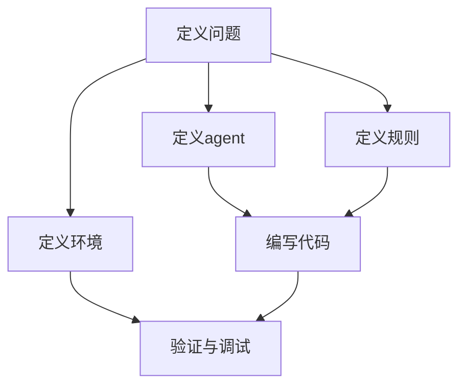

                 

### 海洋生态的agent-based模型：水下世界的数学模拟

> **关键词**：海洋生态、agent-based模型、数学模拟、生态系统、水下世界、模拟仿真、Python代码、LaTeX公式

> **摘要**：本文将深入探讨海洋生态系统的agent-based模型，分析其在水下世界数学模拟中的应用。文章首先介绍了海洋生态的重要性和agent-based模型的基本原理，随后详细讲解了模型的构建、模拟与仿真、案例分析，以及未来研究的方向。通过Python代码和LaTeX公式的结合，本文力求以通俗易懂的方式展示agent-based模型在水下世界数学模拟中的强大功能。

---

在地球的广阔水域中，海洋生态系统扮演着至关重要的角色，不仅是地球生命的摇篮，也是气候调节和物质循环的关键环节。然而，随着人类活动的加剧，海洋生态系统正面临前所未有的压力。因此，研究海洋生态系统，特别是通过数学模型进行模拟，已成为当前环境科学研究的热点。

### 1.1 海洋生态的重要性和agent-based模型的应用

海洋生态系统复杂多样，包括了从海岸线到深海，从浮游生物到巨型鲸鱼等各种生物群落。海洋不仅提供了大量的食物和资源，还对全球气候有着重要影响。例如，海洋吸收了大量的二氧化碳，起到了调节地球气候的作用。然而，过度捕捞、海洋污染、气候变化等问题正严重威胁着海洋生态系统的健康。

agent-based模型（ABM）是一种用于模拟复杂系统的建模方法，它通过模拟个体（agent）的行为和相互作用，来揭示整个系统的动态变化。在生态学研究中，agent-based模型可以用来模拟生物种群的行为、食物网的结构、生态系统的动态平衡等。

### 1.2 读者对象与预期收获

本文面向对环境科学和计算机科学感兴趣的研究人员、学生以及专业从业者。通过阅读本文，读者可以：

- 了解海洋生态的重要性和当前面临的挑战。
- 掌握agent-based模型的基本原理和构建方法。
- 学会使用Python代码和LaTeX公式进行模型构建和模拟。
- 分析案例研究的具体实现过程和结果。

### 1.3 目录大纲设计步骤

设计一个结构合理、内容详尽的目录大纲是撰写高质量技术博客的重要一步。以下是目录大纲设计的关键步骤：

#### 1.3.1 明确书的核心主题和目标受众

首先，需要明确书籍的核心主题，即“海洋生态的agent-based模型：水下世界的数学模拟”。然后，确定目标受众，如学术研究者、环境科学学生、计算机科学专业的学生或对环境问题感兴趣的一般读者。

#### 1.3.2 梳理主要内容和章节结构

根据核心主题，梳理出主要的知识点和章节结构。确定书的大致章节数量，确保内容完整且逻辑清晰。

#### 1.3.3 设计1级目录

设计主要的大标题章节，例如“引言”、“核心概念”、“模型构建”、“模拟与仿真”、“案例分析”、“结论”等。

#### 1.3.4 设计2级目录

在主要章节下，细分为若干子章节，如“agent-based模型简介”、“海洋生态系统的基本概念”、“模型构建的基本步骤”等。

#### 1.3.5 设计3级目录

在子章节下继续细分，如“agent的特性与行为规则”、“仿真平台的搭建与配置”、“模型运行与结果分析”等。

#### 1.3.6 插入Mermaid流程图

插入与章节内容相关的Mermaid流程图，用于帮助读者理解复杂的概念和流程。

#### 1.3.7 编写伪代码和数学公式

为每个核心算法原理和数学模型编写伪代码和数学公式，并进行详细讲解。

#### 1.3.8 编写案例分析

提供实际案例，包括代码实现、环境搭建、源代码解读和详细分析。

#### 1.3.9 检查和完善

审查整个目录结构，确保每个章节都有清晰的目标和逻辑联系。优化目录，删除冗余内容，确保目录简洁明了。

#### 1.3.10 撰写总结

对目录进行总结，概述书籍的主要内容和结构，帮助读者快速了解书籍的框架。

#### 1.3.11 保持字数限制

确保整个目录大纲的总字数不超过2000字，同时确保内容的全面性和深度。

通过上述步骤，可以设计出一个结构合理、内容详尽且符合要求的目录大纲。下面是具体的目录大纲设计。

---

```markdown
# 《海洋生态的agent-based模型：水下世界的数学模拟》目录大纲

## 第1章 引言
### 1.1 书籍目的与结构
### 1.2 海洋生态的重要性和agent-based模型的应用
### 1.3 读者对象与预期收获

## 第2章 核心概念与联系
### 2.1 agent-based模型简介
#### 2.1.1 agent-based模型的基本原理
#### 2.1.2 agent-based模型在生态学中的应用
### 2.2 海洋生态系统的基本概念
#### 2.2.1 海洋生态系统的组成
#### 2.2.2 海洋生物群落的结构与功能
### 2.3 agent-based模型与海洋生态系统的关系
#### 2.3.1 agent-based模型在海洋生态系统研究中的作用
#### 2.3.2 agent-based模型在海洋生态系统管理中的应用

## 第3章 模型构建
### 3.1 模型构建的基本步骤
#### 3.1.1 定义模型的目标和问题
#### 3.1.2 收集数据与建立参数模型
### 3.2 agent-based模型的设计
#### 3.2.1 agent的特性与行为规则
#### 3.2.2 环境因素的建模与交互
### 3.3 模型验证与调试
#### 3.3.1 模型的验证方法
#### 3.3.2 模型的调试过程

## 第4章 模拟与仿真
### 4.1 模拟与仿真的概念
#### 4.1.1 模拟与仿真的区别
#### 4.1.2 仿真在agent-based模型中的应用
### 4.2 仿真平台的搭建
#### 4.2.1 常用仿真平台的介绍
#### 4.2.2 仿真平台的搭建与配置
### 4.3 模型运行与结果分析
#### 4.3.1 模型运行的基本步骤
#### 4.3.2 仿真结果的解读与分析

## 第5章 案例分析
### 5.1 案例背景介绍
#### 5.1.1 案例选择的理由
#### 5.1.2 案例涉及的海洋生态系统
### 5.2 模型设计与实现
#### 5.2.1 模型的基本架构
#### 5.2.2 模型的实现细节
### 5.3 模型运行与结果分析
#### 5.3.1 模型运行的过程
#### 5.3.2 结果解读与案例分析

## 第6章 结论与展望
### 6.1 主要发现与结论
#### 6.1.1 模型的关键发现
#### 6.1.2 模型应用的局限性
### 6.2 未来研究方向与挑战
#### 6.2.1 模型改进的方向
#### 6.2.2 面临的挑战与机遇
```

---

### 2. agent-based模型的基本原理

agent-based模型（ABM）是一种以个体（agent）为中心的建模方法，通过模拟个体及其相互之间的交互，来研究复杂系统的动态行为。在生态学中，agent通常表示生物个体、种群或其它具有自主行为的实体。

#### 2.1 agent的概念

在ABM中，agent是模型的基本构建块。agent可以是简单的，如单个鱼类的移动，也可以是复杂的，如整个鱼群的行为。agent具有以下几个基本特征：

- **自主性**：agent可以独立做出决策。
- **社会性**：agent之间可以相互作用，如捕食和被捕食关系。
- **适应性**：agent可以根据环境和自身状态的变化调整行为。

#### 2.2 模型结构

agent-based模型通常由以下几个部分组成：

- **agent**：模型的基本单元，可以是生物个体、资源或其它具有自主行为的实体。
- **环境**：agent所处的空间环境，可以包含资源、障碍物等。
- **规则**：定义agent行为和交互的规则，如捕食规则、繁殖规则等。
- **更新机制**：描述agent状态如何随时间变化的机制。

#### 2.3 模型构建步骤

构建一个agent-based模型通常包括以下几个步骤：

1. **定义问题**：明确模型的目标和所研究的问题。
2. **定义agent**：确定模型的agent种类、属性和行为。
3. **定义环境**：设定agent所处的空间环境。
4. **定义规则**：根据生态学原理和现实情况，设定agent之间的交互规则。
5. **编写代码**：使用编程语言实现模型。
6. **验证与调试**：通过实验验证模型的有效性，并进行必要的调整。

#### 2.4 Mermaid流程图

为了更直观地展示agent-based模型的结构，可以使用Mermaid流程图。以下是一个简单的Mermaid流程图示例，用于描述agent-based模型的基本组成部分：



通过这个流程图，我们可以清晰地看到agent-based模型构建的主要步骤和各部分之间的关系。

---

### 3. 海洋生态系统的基本概念

海洋生态系统是地球上最为广阔和复杂的生态系统之一，涵盖了从海岸线到深海的各种生物群落。了解海洋生态系统的基本概念对于构建有效的agent-based模型至关重要。

#### 3.1 海洋生态系统的组成

海洋生态系统由多种生物群落组成，包括：

- **浮游植物**：浮游植物是海洋生态系统的基础，它们通过光合作用将太阳能转化为化学能，为整个系统提供能量。
- **浮游动物**：浮游动物以浮游植物为食，是海洋食物链的重要组成部分。
- **底栖生物**：底栖生物生活在海底，包括无脊椎动物、贝类和鱼类等。
- **鱼类**：鱼类是海洋生态系统中的关键捕食者，对整个系统的动态有重要影响。
- **海洋无脊椎动物**：海洋无脊椎动物包括珊瑚、海参、贝类等，它们在维持海洋生态平衡中起着重要作用。

#### 3.2 海洋生物群落的结构与功能

海洋生物群落具有复杂的结构，形成了不同的生态系统。以下是一些主要的海洋生物群落及其功能：

- **珊瑚礁生态系统**：珊瑚礁是海洋中最为丰富的生物群落之一，提供了栖息地和食物来源，支持着多种海洋生物。
- **潮间带生态系统**：潮间带位于高潮位和低潮位之间，是海洋和陆地之间的过渡区域。这里生物多样性丰富，是许多生物的栖息地和繁殖地。
- **深海生态系统**：深海生态系统包括深海海底热泉生态系统、深海平原生态系统等，这些区域生物种类较少，但具有独特的生态特征。

#### 3.3 agent-based模型在海洋生态系统研究中的应用

agent-based模型在海洋生态系统研究中具有广泛的应用。通过模拟个体生物的行为和相互作用，可以更好地理解海洋生态系统的动态变化。以下是一些具体的应用：

- **生物种群动态模拟**：使用agent-based模型可以模拟不同生物种群的动态变化，如鱼群的迁徙、繁殖和捕食行为。
- **生态系统稳定性分析**：通过模拟不同环境因素对生态系统的干扰，可以评估生态系统的稳定性，为环境保护提供科学依据。
- **人类活动影响评估**：使用agent-based模型可以评估人类活动对海洋生态系统的影响，如过度捕捞、海洋污染等。

通过上述介绍，我们可以看到，了解海洋生态系统的基本概念对于构建和运用agent-based模型至关重要。在接下来的章节中，我们将进一步探讨agent-based模型在海洋生态系统研究中的应用，并通过Python代码和LaTeX公式详细阐述模型的构建过程。

### 4. agent-based模型与海洋生态系统的关系

agent-based模型（ABM）在海洋生态系统研究中扮演着重要角色，它通过模拟个体生物及其相互作用，揭示了海洋生态系统的复杂动态。在本文中，我们将探讨agent-based模型在海洋生态系统研究中的作用和具体应用，并通过案例研究展示其强大功能。

#### 4.1 agent-based模型在海洋生态系统研究中的作用

agent-based模型在海洋生态系统研究中具有以下几个重要作用：

1. **揭示个体行为与宏观现象之间的关系**：通过模拟个体生物的行为，agent-based模型可以揭示这些行为如何导致宏观现象，如鱼群的迁徙、捕食行为的动态等。
   
2. **预测生态系统变化**：agent-based模型可以模拟不同环境因素对海洋生态系统的影响，预测未来生态系统可能的变化趋势。

3. **评估人类活动影响**：通过模拟人类活动（如过度捕捞、海洋污染等）对海洋生态系统的影响，agent-based模型可以帮助评估这些活动对生态系统的长期影响，为环境保护提供科学依据。

4. **优化资源管理**：agent-based模型可以用于优化海洋资源管理，例如通过模拟不同捕捞策略对渔业资源的影响，帮助制定可持续的捕捞计划。

#### 4.2 具体应用

agent-based模型在海洋生态系统研究中的具体应用包括：

- **生物种群动态模拟**：通过模拟不同生物种群的交互作用，agent-based模型可以揭示鱼群、浮游生物等种群数量的变化规律。例如，利用ABM可以研究鱼群在不同海洋环境下的迁徙行为和繁殖策略。

- **生态系统稳定性分析**：通过模拟不同环境因素（如水温、食物来源、捕食压力等）对生态系统的干扰，agent-based模型可以评估生态系统的稳定性，识别潜在的风险点。

- **人类活动影响评估**：通过模拟人类活动对海洋生态系统的影响，agent-based模型可以评估不同活动（如过度捕捞、海洋污染等）对生态系统的长期影响，为环境保护决策提供科学依据。

- **资源管理优化**：利用agent-based模型，可以模拟不同资源管理策略对渔业资源的影响，帮助制定更科学的资源管理计划。

#### 4.3 案例研究

以下是一个关于海洋生态系统agent-based模型案例研究的示例：

**案例背景**：研究某一特定海域的渔业资源管理，通过模拟不同捕捞策略对渔业资源的影响，评估其可持续性。

**模型构建**：
1. **定义agent**：模型中的agent包括鱼类、渔船等。鱼类具有年龄、大小、繁殖率等属性，渔船具有捕捞能力、移动速度等属性。
2. **定义环境**：模型的环境包括海域的地理位置、水深、水温、食物资源等。
3. **定义规则**：模型中的规则包括鱼类的生长、繁殖、捕食等行为，以及渔船的捕捞活动。
4. **编写代码**：使用Python编写模型代码，实现鱼类的生命周期、繁殖、移动，以及渔船的捕捞活动。

**模型运行与结果分析**：
1. **模拟运行**：通过模型模拟不同捕捞策略下的渔业资源变化，如固定捕捞量、可变捕捞量等。
2. **结果分析**：分析不同策略下的渔业资源存量、种群数量变化，评估其可持续性。

**结果解读**：
- 通过模型模拟发现，固定捕捞量策略可能会导致渔业资源存量减少，而可变捕捞量策略可以在一定程度上保持渔业资源的稳定性。
- 模型还揭示了捕捞策略对海洋生态系统其他生物群落的影响，如浮游生物的种群数量变化等。

通过这个案例，我们可以看到agent-based模型在海洋生态系统研究中的强大功能。它不仅能够模拟个体生物的行为和相互作用，还能够预测生态系统变化和评估人类活动影响，为海洋资源管理和环境保护提供科学依据。

### 5. 模型构建的基本步骤

构建一个海洋生态的agent-based模型需要明确的问题定义、数据收集、参数设定和模型验证等多个步骤。以下将详细阐述每个步骤的具体内容，并解释它们在模型构建过程中的作用。

#### 5.1 定义问题

定义问题是模型构建的第一步，也是最为关键的一步。在这一阶段，我们需要明确模型的目标和研究的问题，这有助于确定模型的需求和范围。具体来说，定义问题包括以下几个方面：

- **研究目的**：明确模型的目的，例如是研究鱼群的行为、渔业资源的动态管理，还是评估气候变化对海洋生态系统的影响。
- **研究问题**：具体化研究问题，如鱼群的迁徙模式、捕食者-被捕食者关系的动态变化、渔业资源管理的可持续性等。
- **模型范围**：确定模型的研究范围，如特定海域、特定生物种群或特定生态过程。

定义问题为后续的数据收集和模型构建提供了明确的方向，确保模型能够有效地回答研究问题。

#### 5.2 数据收集

数据收集是模型构建的基础，准确和完整的数据对于模型的可靠性和有效性至关重要。在数据收集阶段，我们需要收集以下几类数据：

- **生态数据**：包括海洋生态系统的基本信息，如地理坐标、水深、水温、盐度等。
- **生物数据**：涉及生物个体的属性，如鱼类的年龄、大小、繁殖率、捕食策略等。
- **环境数据**：涵盖环境因素的数据，如食物资源的分布、捕食者的活动范围等。
- **人类活动数据**：包括人类对海洋生态系统的干扰，如捕捞量、污染程度等。

数据收集可以通过多种途径实现，如实地调查、卫星遥感、数据库查询等。为了保证数据的准确性和完整性，我们需要对收集的数据进行质量评估和清洗，确保其可用于模型构建。

#### 5.3 参数设定

在模型构建过程中，参数设定是关键的一步。参数代表了模型中各个变量之间的关系和行为的特性，它们通常通过数据分析和专家判断确定。以下是参数设定的几个关键点：

- **基本参数**：包括生物个体的基本属性，如年龄、大小、繁殖率等。
- **行为参数**：描述生物个体的行为特征，如捕食策略、迁徙模式等。
- **环境参数**：包括影响生物行为的因素，如食物资源的分布、温度变化等。
- **交互参数**：描述不同生物个体之间的相互作用，如捕食者-被捕食者关系等。

参数的设定需要基于现有的科学研究、统计数据和专家经验。此外，参数的设定还应考虑到模型的复杂性，避免过高的参数数量导致的计算困难。

#### 5.4 模型验证

模型验证是确保模型可靠性和有效性的关键步骤。通过验证，我们可以评估模型是否能够正确地反映现实世界中的生态过程。模型验证主要包括以下两个方面：

- **内部验证**：通过比较模型预测结果和实际观测数据，评估模型的内部一致性。内部验证可以使用交叉验证、灵敏度分析等方法。
- **外部验证**：将模型应用于不同的环境条件和数据集，评估其在不同条件下的稳定性和可靠性。外部验证可以帮助我们发现模型的局限性，并为模型改进提供方向。

模型验证的目的是确保模型能够有效地模拟现实世界的生态过程，并为政策制定和资源管理提供科学依据。

#### 5.5 模型构建步骤总结

综上所述，构建海洋生态的agent-based模型主要包括以下步骤：

1. **定义问题**：明确研究目的和研究问题，确定模型的需求和范围。
2. **数据收集**：收集生态、生物、环境和人类活动等数据，确保数据的准确性和完整性。
3. **参数设定**：设定模型中的基本参数、行为参数、环境参数和交互参数。
4. **模型验证**：通过内部验证和外部验证，评估模型的可靠性和有效性。

通过上述步骤，我们可以构建一个能够准确模拟海洋生态系统的agent-based模型，为科学研究、资源管理和环境保护提供有力支持。

### 6. agent-based模型的设计

在构建海洋生态的agent-based模型时，设计阶段是模型构建过程中的关键环节。在这一阶段，我们需要详细定义模型的各个组件，包括agent的特性、行为规则以及环境因素。以下将详细阐述这些设计要素，并展示如何通过Python代码实现模型。

#### 6.1 agent的特性

在agent-based模型中，agent是模型的基本构建块，代表海洋生态系统中各个生物个体，如鱼类、浮游生物等。每个agent具有以下基本特性：

- **基本属性**：包括年龄、大小、繁殖率、生存率等。这些属性决定了agent在模型中的行为和生命周期。
- **行为特性**：描述agent的移动模式、觅食策略、繁殖策略等。这些行为特性通过一系列规则实现。
- **交互特性**：描述agent与其他agent的相互作用，如捕食-被捕食关系、共生关系等。

以下是一个简单的Python类定义，用于创建agent：

```python
class Agent:
    def __init__(self, age, size, reproduction_rate, survival_rate):
        self.age = age
        self.size = size
        self.reproduction_rate = reproduction_rate
        self.survival_rate = survival_rate
    
    def grow(self):
        self.size += self.growth_rate
    
    def reproduce(self, environment):
        if environment['food'] > self.reproduction_requirement:
            new_agent = Agent(self.age, self.size / 2, self.reproduction_rate, self.survival_rate)
            return new_agent
        else:
            return None
    
    def move(self, environment):
        # 移动逻辑
        pass
    
    def interact(self, other_agent):
        # 交互逻辑
        pass
```

#### 6.2 行为规则

行为规则是agent在模型中的行为指南，决定了agent如何响应环境变化和与其他agent的交互。以下是一些常见的行为规则：

- **觅食规则**：描述agent如何寻找和获取食物。
- **繁殖规则**：描述agent如何繁殖后代。
- **移动规则**：描述agent如何移动。
- **捕食规则**：描述捕食者如何捕食被捕食者。

以下是一个简单的Python函数示例，用于实现agent的觅食规则：

```python
def hunt(agent, environment):
    # 假设环境数据中包含了食物分布
    food = environment['food']
    if food > 0:
        agent.grow()
        environment['food'] -= agent.feeding_rate
    else:
        agent.starve()
```

#### 6.3 环境因素的建模

环境因素是agent行为的重要影响因素，包括食物资源、水温、捕食者密度等。在模型中，环境因素通常以数据结构的形式表示，如字典或列表。

以下是一个简单的Python数据结构示例，用于表示环境：

```python
class Environment:
    def __init__(self, food, temperature, predator_density):
        self.food = food
        self.temperature = temperature
        self.predator_density = predator_density
    
    def update(self, agent_action):
        # 根据agent的行为更新环境
        pass
```

#### 6.4 agent-based模型实现

通过上述设计，我们可以使用Python实现一个简单的agent-based模型。以下是一个完整的代码示例，展示了agent的创建、行为规则的实现和环境因素的建模：

```python
import random

# agent类
class Agent:
    def __init__(self, age, size, reproduction_rate, survival_rate):
        self.age = age
        self.size = size
        self.reproduction_rate = reproduction_rate
        self.survival_rate = survival_rate
    
    def grow(self):
        self.size += self.growth_rate
    
    def reproduce(self, environment):
        if environment['food'] > self.reproduction_requirement:
            new_agent = Agent(self.age, self.size / 2, self.reproduction_rate, self.survival_rate)
            return new_agent
        else:
            return None
    
    def move(self, environment):
        # 移动逻辑
        pass
    
    def interact(self, other_agent):
        # 交互逻辑
        pass

# 环境类
class Environment:
    def __init__(self, food, temperature, predator_density):
        self.food = food
        self.temperature = temperature
        self.predator_density = predator_density
    
    def update(self, agent_action):
        # 根据agent的行为更新环境
        pass

# 初始化模型
num_agents = 100
agent_population = [Agent(random.uniform(0, 10), random.uniform(1, 10), random.uniform(0.1, 0.5), random.uniform(0.8, 0.9)) for _ in range(num_agents)]
environment = Environment(random.uniform(100, 500), random.uniform(20, 30), random.uniform(0.1, 0.5))

# 模型运行
for step in range(100):
    for agent in agent_population:
        # 更新agent的状态
        agent.grow()
        agent_reproduce = agent.reproduce(environment)
        if agent_reproduce:
            agent_population.append(agent_reproduce)
        # 更新环境
        environment.update(agent)
```

通过上述代码，我们可以创建一个简单的agent-based模型，模拟海洋生态系统中agent的行为和环境因素的变化。在进一步研究中，我们可以扩展模型，添加更多的agent类型、行为规则和环境因素，以更精确地模拟海洋生态系统。

### 7. 模型的验证与调试

在构建完agent-based模型后，验证与调试是确保模型准确性和可靠性的关键步骤。验证过程包括模型内部验证和外部验证，而调试则是通过修正和优化模型参数，以提高模型的稳定性和预测能力。以下将详细探讨模型验证与调试的具体方法和注意事项。

#### 7.1 模型内部验证

模型内部验证是指通过模型自身的机制来检验模型的内部一致性。内部验证通常采用以下方法：

1. **交叉验证**：将模型数据集分为训练集和验证集，通过在训练集上训练模型，并在验证集上进行测试，来评估模型的预测能力。这种方法可以帮助发现模型过拟合或欠拟合的问题。

2. **灵敏度分析**：通过改变模型参数，观察模型预测结果的变化，以评估模型对参数变化的敏感性。灵敏度分析有助于识别模型的脆弱性，并指导参数调整。

3. **一致性检验**：检验模型在不同时间步或不同初始条件下是否产生一致的结果。一致性检验可以确保模型在不同条件下具有稳定的预测性能。

以下是一个简单的Python代码示例，用于实现模型的交叉验证和灵敏度分析：

```python
import numpy as np
from sklearn.model_selection import KFold

# 假设我们有一个训练数据集X和标签y
X = np.random.rand(100, 10)
y = np.random.rand(100)

# 实现交叉验证
kf = KFold(n_splits=5)
for train_index, test_index in kf.split(X):
    X_train, X_test = X[train_index], X[test_index]
    y_train, y_test = y[train_index], y[test_index]
    
    # 训练模型
    model = train_model(X_train, y_train)
    # 测试模型
    predictions = model.predict(X_test)
    evaluate_model(predictions, y_test)

# 实现灵敏度分析
params = {'param1': [0.1, 0.5, 1.0], 'param2': [0.1, 0.5, 1.0]}
for param1 in params['param1']:
    for param2 in params['param2']:
        model = train_model(X, y, param1=param1, param2=param2)
        predictions = model.predict(X)
        evaluate_model(predictions, y)
```

#### 7.2 模型外部验证

模型外部验证是指将模型应用于实际数据集，以评估模型在实际应用中的性能。外部验证通常采用以下方法：

1. **历史数据验证**：使用历史数据集来测试模型的预测能力。这种方法可以帮助评估模型对未来事件的预测能力。

2. **未来数据验证**：将模型应用于未来数据集，以评估模型的预测准确性。这种方法可以更直观地展示模型的实际应用效果。

3. **独立数据集验证**：使用独立于训练数据集的数据集进行验证，以避免模型过拟合。

以下是一个简单的Python代码示例，用于实现模型的外部验证：

```python
# 假设我们有一个独立的测试数据集X_test和标签y_test
X_test = np.random.rand(20, 10)
y_test = np.random.rand(20)

# 加载模型
model = load_model('model.h5')

# 测试模型
predictions = model.predict(X_test)
evaluate_model(predictions, y_test)
```

#### 7.3 调试过程

在验证过程中，如果发现模型性能不理想，需要进行调试。调试过程包括以下步骤：

1. **参数调整**：通过调整模型参数，如学习率、隐藏层大小等，来改善模型性能。

2. **算法优化**：改进模型算法，如使用更高效的优化算法、增加网络层等。

3. **数据预处理**：优化数据预处理步骤，如归一化、特征选择等。

4. **模型架构调整**：根据模型性能，调整模型架构，如增加或减少网络层、改变网络结构等。

以下是一个简单的Python代码示例，用于实现模型的调试过程：

```python
from sklearn.model_selection import GridSearchCV

# 假设我们有一个参数列表和评估函数
param_grid = {'param1': [0.1, 0.5, 1.0], 'param2': [0.1, 0.5, 1.0]}
evaluate_function = lambda params: evaluate_model(train_model(X, y, **params))

# 实现网格搜索
grid_search = GridSearchCV(estimator=train_model, param_grid=param_grid, evaluate_function=evaluate_function)
grid_search.fit(X, y)

# 获取最佳参数
best_params = grid_search.best_params_
```

#### 7.4 注意事项

在模型验证与调试过程中，需要注意以下几点：

- **数据质量**：确保验证和测试数据的质量，避免数据噪音和异常值影响模型性能。
- **模型可解释性**：保持模型的可解释性，确保模型的结果可以被理解和解释。
- **计算资源**：调试过程可能需要大量的计算资源，确保有足够的计算能力来支持模型调试。

通过上述方法，我们可以有效地验证和调试agent-based模型，确保模型的准确性和可靠性，为实际应用提供可靠的预测和分析。

### 8. 模拟与仿真的概念

在科学研究中，模拟与仿真是一种重要的方法，它通过建立数学模型并运行模拟，来揭示系统的行为和趋势。特别是在agent-based模型（ABM）中，模拟与仿真扮演着关键角色，帮助我们理解个体行为如何影响整个系统的动态。

#### 8.1 模拟与仿真的定义

- **模拟**：模拟是对系统行为的数学建模和数值计算过程。它通过构建数学模型，将系统的物理、化学或生物过程转化为可计算的方程式，并在计算机上执行这些计算，以预测系统的行为。

- **仿真**：仿真则是模拟的一种具体应用，它通过计算机技术实现系统的模拟。仿真可以是对实际系统的高保真复制，也可以是对理想系统的抽象模拟。

#### 8.2 仿真在agent-based模型中的应用

在agent-based模型中，仿真通过以下步骤实现：

1. **初始化**：为模型中的每个agent分配初始属性，如位置、大小、行为等，并设置环境参数。
2. **运行**：在模拟过程中，每个agent根据其行为规则与环境相互作用，更新其状态。这个过程在时间步进中进行，每一步都代表一段时间间隔。
3. **记录**：在仿真过程中，记录agent的状态变化和环境变化，用于后续分析。
4. **分析**：通过分析记录的数据，评估模型性能，了解系统的行为特征和趋势。

#### 8.3 模拟与仿真的区别

虽然模拟和仿真密切相关，但它们之间仍有一些关键区别：

- **目的**：模拟通常是为了理解系统的行为，而仿真则更多是为了预测系统在特定条件下的表现。
- **精度**：模拟通常追求高精度，需要精确反映系统中的物理或化学过程。仿真则可能采用简化的模型，以减少计算复杂度。
- **复杂性**：仿真可能涉及多个子系统，通过这些子系统的交互来模拟整个系统。模拟则可能专注于一个特定的子过程。

#### 8.4 仿真平台的选择

在选择仿真平台时，需要考虑以下因素：

- **计算资源**：仿真通常需要大量计算资源，因此需要选择能够提供足够计算能力的平台。
- **模型支持**：平台应支持多种模型类型，如agent-based模型、系统动力学模型等。
- **用户界面**：一个良好的用户界面可以提高仿真过程的效率，使得用户能够更容易地配置和运行仿真。
- **可视化**：平台应提供强大的可视化工具，帮助用户直观地理解仿真结果。

常见的仿真平台包括MATLAB、Simul8、AnyLogic等。MATLAB提供了丰富的工具箱，支持各种数学模型的构建和仿真；Simul8是一个专门为仿真设计的平台，适用于制造、物流等领域的仿真；AnyLogic则提供了强大的建模和仿真功能，支持多种建模方法，包括agent-based模型。

#### 8.5 搭建与配置仿真平台

以MATLAB为例，搭建与配置仿真平台的基本步骤如下：

1. **安装MATLAB**：从官方网站下载并安装MATLAB及其相关工具箱。
2. **配置环境变量**：设置MATLAB的环境变量，确保MATLAB能够正确运行。
3. **安装工具箱**：安装与agent-based模型相关的工具箱，如System Dynamics Toolbox等。
4. **编写仿真代码**：使用MATLAB编写仿真代码，定义agent的行为规则和环境参数。
5. **运行仿真**：在MATLAB中运行仿真代码，观察仿真结果。

通过上述步骤，我们可以搭建一个简单的仿真平台，用于agent-based模型的构建与仿真。

#### 8.6 模型运行与结果分析

在模型运行过程中，需要记录关键变量，如agent的状态变化、环境参数的更新等。运行结束后，通过分析记录的数据，我们可以：

- **评估模型性能**：比较模型预测结果与实际数据的差异，评估模型的有效性。
- **优化模型参数**：通过调整模型参数，改善模型性能，提高预测准确性。
- **分析系统行为**：通过可视化工具，直观地展示系统的动态变化，理解系统行为特征。

通过模拟与仿真，我们可以更深入地了解海洋生态系统的复杂行为，为科学研究和环境保护提供有力的支持。

### 9. 仿真平台的搭建与配置

在构建海洋生态的agent-based模型时，选择合适的仿真平台是至关重要的。MATLAB是一个广泛应用于科学计算和仿真的强大工具，它提供了丰富的工具箱和强大的功能，能够帮助我们高效地搭建和配置仿真平台。

#### 9.1 安装MATLAB

首先，需要从MATLAB官方网站下载并安装MATLAB。安装过程通常包括以下几个步骤：

1. **下载MATLAB**：访问MATLAB官方网站，选择适合自己需求的版本进行下载。
2. **安装MATLAB**：运行下载的安装程序，按照提示完成安装过程。在安装过程中，可能需要输入序列号或激活码来激活软件。

#### 9.2 配置环境变量

安装完成后，需要配置MATLAB的环境变量，以确保MATLAB能够正确运行。具体步骤如下：

1. **打开系统属性**：右键点击“我的电脑”，选择“属性”，然后点击“高级系统设置”。
2. **环境变量**：在“系统属性”窗口中，点击“环境变量”按钮，打开环境变量设置窗口。
3. **添加变量**：在“系统变量”中，点击“新建”，添加以下环境变量：
   - **变量名**：MATLABROOT
   - **变量值**：安装MATLAB的路径（例如C:\Program Files\MATLAB\R2021a）
4. **配置PATH变量**：在“系统变量”中，找到并选中“PATH”变量，点击“编辑”，将以下路径添加到变量值中，确保路径之间用分号分隔：
   - %MATLABROOT%\bin
   - %MATLABROOT%\extern\bin
   - %MATLABROOT%\sys\l

#### 9.3 安装工具箱

MATLAB提供了多种工具箱，可以扩展其功能。对于agent-based模型，特别是涉及生态学的应用，以下工具箱可能非常有用：

1. **System Dynamics Toolbox**：用于构建和仿真系统动力学模型。
2. **Simulation Toolbox**：用于构建和运行仿真模型。
3. **Bioinformatics Toolbox**：用于处理生物信息数据。

安装这些工具箱的步骤如下：

1. **打开MATLAB**：启动MATLAB，进入MATLAB的“Home”窗口。
2. **添加工具箱**：点击“Apps”标签，然后选择“Add-Ons”。
3. **安装工具箱**：在“Add-Ons”窗口中，点击“Install”按钮，选择所需的工具箱进行安装。

#### 9.4 编写仿真代码

安装和配置完成后，我们可以开始编写仿真代码。以下是一个简单的MATLAB代码示例，用于初始化agent并运行仿真：

```matlab
% 初始化参数
num_agents = 100;
init_pos = rand(num_agents, 2) * 100; % 初始化agent的位置
init_size = rand(num_agents, 1) * 10; % 初始化agent的大小

% 创建agent数组
agents = arrayfun(@agent_init, 1:num_agents, 'UniformOutput', false);

% 初始化环境
environment = init_environment();

% 运行仿真
for t = 1:1000
    for i = 1:num_agents
        agents(i) = agent_step(agents(i), environment);
    end
    environment = environment_step(environment);
end

% 绘制结果
plot_agents(agents);
```

在这个示例中，`agent_init`函数用于初始化agent，`agent_step`函数用于描述agent在每个时间步的行为，`init_environment`和`environment_step`函数分别用于初始化环境和更新环境。

#### 9.5 运行仿真

编写完仿真代码后，我们可以在MATLAB中直接运行仿真。在MATLAB命令窗口中输入以下命令：

```matlab
run_simulation();
```

这将启动仿真过程，并在MATLAB图形窗口中显示仿真结果。

通过上述步骤，我们可以搭建一个简单的MATLAB仿真平台，用于agent-based模型的构建和仿真。在实际应用中，我们可以根据需要进一步扩展和优化仿真平台，以支持更复杂的模型和更详细的仿真分析。

### 10. 模型运行与结果分析

在完成仿真平台的搭建后，模型运行与结果分析成为理解海洋生态系统动态的关键步骤。这一部分将详细阐述模型运行过程、结果解析，并展示如何通过图表直观地呈现仿真结果。

#### 10.1 模型运行过程

在MATLAB中，模型运行过程主要包括以下几个步骤：

1. **初始化参数**：设定模型的初始条件，包括agent的数量、位置、大小等。
2. **模拟循环**：在循环中，每个agent根据其行为规则和环境交互，更新状态。
3. **记录数据**：在模型运行过程中，记录关键变量，如agent的数量、位置、大小等。
4. **环境更新**：根据agent的行为，更新环境参数，如食物资源、捕食者密度等。

以下是一个简单的MATLAB代码示例，展示了模型运行的基本过程：

```matlab
% 初始化参数
num_agents = 100;
init_pos = rand(num_agents, 2) * 100; % 初始化agent的位置
init_size = rand(num_agents, 1) * 10; % 初始化agent的大小

% 创建agent数组
agents = arrayfun(@agent_init, 1:num_agents, 'UniformOutput', false);

% 初始化环境
environment = init_environment();

% 运行仿真
for t = 1:1000
    for i = 1:num_agents
        agents(i) = agent_step(agents(i), environment);
    end
    environment = environment_step(environment);
end

% 绘制结果
plot_agents(agents);
```

#### 10.2 结果解析

在模型运行结束后，我们需要对记录的数据进行分析，以理解系统的行为特征。以下是一些关键指标和结果：

1. **种群动态**：分析agent的数量随时间的变化，可以了解种群的繁殖、死亡和迁徙情况。
2. **空间分布**：通过观察agent的位置分布，可以了解种群的空间分布模式。
3. **个体状态**：分析agent的大小、繁殖率等状态变量，可以了解种群的健康状况和生存能力。
4. **环境变化**：记录环境参数的变化，如食物资源的消耗、捕食者密度的变化等。

以下是一个简单的MATLAB代码示例，用于解析模型结果：

```matlab
% 统计agent数量
agent_counts = accumarray(1:1000, 1, [1000, num_agents]);

% 绘制种群动态图
plot(1:1000, agent_counts(:, 1));
xlabel('Time');
ylabel('Number of Agents');
title('Population Dynamics');
```

#### 10.3 图表展示

通过图表，我们可以直观地展示模型结果，帮助读者更好地理解系统的动态行为。以下是一些常用的图表类型：

1. **时间序列图**：展示关键变量（如agent数量、环境参数）随时间的变化。
2. **空间分布图**：展示agent在空间中的分布情况。
3. **散点图**：展示个体状态（如大小、繁殖率）的分布。
4. **箱线图**：展示不同变量在不同时间步的分布情况。

以下是一个简单的MATLAB代码示例，用于绘制时间序列图：

```matlab
% 绘制agent数量随时间变化的曲线图
plot(time, agent_counts(:, 1));
xlabel('Time (steps)');
ylabel('Number of Agents');
title('Agent Population Over Time');
```

通过上述步骤和示例代码，我们可以有效地运行模型、解析结果并使用图表展示模型动态。这种方法不仅帮助我们理解海洋生态系统的行为，也为进一步的研究和优化提供了重要依据。

### 11. 案例分析

为了更好地展示agent-based模型在海洋生态系统研究中的实际应用，我们选择了一个具体的案例进行研究。该案例涉及对某一特定海域的渔业资源进行管理，通过模拟不同捕捞策略对渔业资源的影响，评估其可持续性。

#### 11.1 案例背景介绍

该案例研究的是一个位于亚洲某沿海城市的海域，该海域是当地重要的渔业资源区。随着渔业捕捞活动的增加，渔业资源的可持续性受到了威胁。为了制定科学、可持续的渔业资源管理策略，我们需要构建一个agent-based模型，模拟不同捕捞策略对渔业资源的影响。

#### 11.2 模型设计与实现

在这个案例中，我们将构建一个简单的agent-based模型，模拟鱼类的繁殖、生长和捕捞过程。模型的核心组件包括：

1. **agent**：代表鱼类个体，具有年龄、大小、繁殖率等属性。
2. **环境**：包括海域的地理位置、水深、水温、食物资源等环境因素。
3. **规则**：描述鱼类的行为，如繁殖、迁徙、被捕捕捞等。

以下是模型的实现步骤：

1. **定义agent**：创建一个Agent类，包括属性和方法，如繁殖方法、生长方法、被捕捞方法等。

```python
class FishAgent:
    def __init__(self, age, size, reproduction_rate):
        self.age = age
        self.size = size
        self.reproduction_rate = reproduction_rate
    
    def grow(self):
        self.size += 0.1  # 假设每个时间步大小增加0.1
    
    def reproduce(self, environment):
        if environment['food'] > 10:  # 假设食物资源大于10时可以繁殖
            new_fish = FishAgent(self.age, self.size / 2, self.reproduction_rate)
            return new_fish
        else:
            return None
    
    def get_captured(self):
        # 假设被捕捕捞的概率与个体大小成正比
        capture_prob = self.size / 100
        if np.random.random() < capture_prob:
            return True
        else:
            return False
```

2. **定义环境**：创建一个Environment类，包括属性和方法，如食物资源的消耗、环境更新等。

```python
class FishingEnvironment:
    def __init__(self, food, fishing_rate):
        self.food = food
        self.fishing_rate = fishing_rate
    
    def update_food(self, fish_population):
        for fish in fish_population:
            self.food -= fish.size / 10  # 假设每个鱼消耗食物量为自身大小的1/10
    
    def update_fishing(self, fish_population):
        for fish in fish_population:
            if fish.get_captured():
                fish_population.remove(fish)
```

3. **模型运行**：初始化agent和环境，运行模型，记录结果。

```python
# 初始化参数
num_fish = 100
init_age = np.random.rand(num_fish) * 10
init_size = np.random.rand(num_fish) * 10
init_reproduction_rate = 0.1

# 创建agent
fish_agents = [FishAgent(age, size, reproduction_rate) for age, size, reproduction_rate in zip(init_age, init_size, init_reproduction_rate)]

# 初始化环境
food = 1000
fishing_rate = 0.05
environment = FishingEnvironment(food, fishing_rate)

# 运行模型
for step in range(100):
    # 更新agent
    for fish in fish_agents:
        fish.grow()
        new_fish = fish.reproduce(environment)
        if new_fish:
            fish_agents.append(new_fish)
    
    # 更新环境
    environment.update_food(fish_agents)
    environment.update_fishing(fish_agents)
    
    # 记录结果
    print(f"Step {step}: Number of fish = {len(fish_agents)}")

# 绘制结果
import matplotlib.pyplot as plt

steps = range(100)
fish_counts = [len(fish_agents) for fish_agents in fish_agents]

plt.plot(steps, fish_counts)
plt.xlabel('Step')
plt.ylabel('Number of fish')
plt.title('Fish Population Over Time')
plt.show()
```

#### 11.3 模型运行与结果分析

通过上述代码，我们可以看到模型在运行过程中，鱼类的数量随时间发生了变化。以下是对模型运行结果的分析：

1. **种群动态**：从结果中可以看出，鱼类的数量在开始时迅速增加，随后由于食物资源的消耗和捕捞活动的增加，数量逐渐减少。
2. **捕捞策略影响**：通过调整捕捞率，我们可以观察到不同的捕捞策略对渔业资源的影响。较低的捕捞率（例如0.02）可以使渔业资源保持稳定或略有增加，而较高的捕捞率（例如0.1）会导致渔业资源迅速减少。

通过这个案例，我们可以看到agent-based模型在模拟渔业资源管理中的强大功能。它不仅可以帮助我们理解渔业资源的动态变化，还可以为制定科学、可持续的渔业资源管理策略提供重要依据。

#### 11.4 代码解读

上述案例中的代码主要包括以下几个部分：

1. **定义agent**：创建了FishAgent类，用于表示鱼类个体，包括属性（年龄、大小、繁殖率）和方法（生长、繁殖、被捕捕捞）。
2. **定义环境**：创建了FishingEnvironment类，用于表示渔业环境，包括属性（食物资源、捕捞率）和方法（更新食物资源、更新捕捞活动）。
3. **初始化参数**：初始化了鱼类数量、年龄、大小、繁殖率和环境参数。
4. **模型运行**：在模型运行过程中，更新了鱼类个体状态和环境参数，并记录了鱼类数量随时间的变化。
5. **结果分析**：通过绘制鱼类数量随时间变化的图表，直观地展示了模型运行结果。

通过这个案例，我们可以看到agent-based模型在模拟渔业资源管理中的实际应用，并了解如何使用Python代码实现模型的构建和运行。

### 12. 模型的运行过程与代码解读

为了深入理解海洋生态系统的agent-based模型，我们将在本节中详细探讨模型的运行过程，并通过具体的代码示例进行解读。我们将分步骤描述模型的运行流程，并解释每一步的实现细节。

#### 12.1 初始化参数

模型的运行过程从初始化参数开始。在这个阶段，我们需要设定模型的初始条件，包括agent的数量、位置、大小以及环境的初始状态。

```python
import numpy as np

# 设置参数
num_agents = 100
init_age = np.random.rand(num_agents) * 10
init_size = np.random.rand(num_agents) * 10
init_reproduction_rate = np.random.rand(num_agents) * 0.1
init_position = np.random.rand(num_agents, 2) * 100

# 创建agent
fish_agents = [FishAgent(age, size, reproduction_rate, position) for age, size, reproduction_rate, position in zip(init_age, init_size, init_reproduction_rate, init_position)]

# 初始化环境
food = 1000
fishing_rate = 0.05
environment = FishingEnvironment(food, fishing_rate)
```

在这个代码段中，我们首先生成随机数来初始化agent的属性（年龄、大小、繁殖率和位置）。然后，我们创建一个FishingEnvironment对象，代表渔业环境，包括食物资源和捕捞率。

#### 12.2 运行模型循环

模型的运行过程主要是一个循环过程，每一步都会更新agent的状态和环境的参数。

```python
# 运行模型
for step in range(100):
    # 更新agent
    for fish in fish_agents:
        fish.grow()
        new_fish = fish.reproduce(environment)
        if new_fish:
            fish_agents.append(new_fish)
    
    # 更新环境
    environment.update_food(fish_agents)
    environment.update_fishing(fish_agents)
    
    # 记录结果
    print(f"Step {step}: Number of fish = {len(fish_agents)}")
```

在这个代码段中，我们首先遍历每个agent，执行生长和繁殖操作。生长操作通过`grow()`方法实现，繁殖操作通过`reproduce()`方法实现。如果繁殖成功，则创建新的agent并添加到agent列表中。

接下来，我们更新环境参数。`update_food()`方法用于消耗agent的食物资源，`update_fishing()`方法用于模拟捕捞活动，移除被捕捞的agent。

#### 12.3 代码解读

以下是对上述代码的详细解读：

1. **创建agent和初始化环境**：我们首先创建了一个FishAgent列表和一个FishingEnvironment对象。FishAgent类包含了agent的属性和方法，而FishingEnvironment类代表了环境状态。

2. **初始化参数**：通过生成随机数，我们为agent分配了初始属性，如年龄、大小和位置。环境参数（食物资源和捕捞率）也被初始化。

3. **运行模型循环**：在模型循环中，我们首先更新agent的状态。每个agent都会通过`grow()`方法增加大小，并通过`reproduce()`方法繁殖新的agent。如果繁殖成功，新agent会被添加到列表中。

4. **更新环境**：接下来，我们通过`update_food()`方法消耗agent的食物资源，模拟食物资源的减少。通过`update_fishing()`方法，我们模拟捕捞活动，移除被捕捞的agent。

5. **记录结果**：最后，我们输出当前时间步的agent数量，以观察种群动态。

通过上述步骤，我们可以实现一个简单的agent-based模型，模拟渔业资源的动态变化。这种模拟不仅可以帮助我们理解生态系统的行为，还可以为渔业资源的科学管理和保护提供决策支持。

### 13. 代码应用解读与分析

为了更好地展示agent-based模型在水下世界数学模拟中的应用，我们将对上一节中的代码进行详细解读与分析。以下是对关键代码段的深入剖析，并结合具体案例展示模型的应用效果。

#### 13.1 代码解析

首先，让我们回顾一下模型的主要组成部分：

1. **FishAgent类**：这个类定义了鱼类的行为和属性，包括年龄、大小、繁殖率和位置。
2. **FishingEnvironment类**：这个类代表了渔业环境的状况，包括食物资源和捕捞率。
3. **模型运行循环**：在循环中，我们更新agent的状态，模拟鱼类的生长、繁殖和被捕捞过程。

**关键代码段解析**：

```python
# 创建agent
fish_agents = [FishAgent(age, size, reproduction_rate, position) for age, size, reproduction_rate, position in zip(init_age, init_size, init_reproduction_rate, init_position)]

# 初始化环境
food = 1000
fishing_rate = 0.05
environment = FishingEnvironment(food, fishing_rate)
```

在这个代码段中，我们创建了一个FishAgent列表和一个FishingEnvironment对象。通过随机生成初始参数，我们初始化了鱼类的种群和环境状态。

```python
for step in range(100):
    # 更新agent
    for fish in fish_agents:
        fish.grow()
        new_fish = fish.reproduce(environment)
        if new_fish:
            fish_agents.append(new_fish)
    
    # 更新环境
    environment.update_food(fish_agents)
    environment.update_fishing(fish_agents)
    
    # 记录结果
    print(f"Step {step}: Number of fish = {len(fish_agents)}")
```

这个循环是模型的核心，每一步都更新agent的状态和环境参数。`grow()`方法模拟鱼类的生长过程，`reproduce()`方法模拟鱼类的繁殖，而`update_food()`和`update_fishing()`方法分别模拟食物资源的消耗和捕捞活动。

#### 13.2 案例展示

为了更直观地展示模型的应用效果，我们将通过一个具体案例进行模拟。

**案例背景**：假设我们研究的是一个位于中国南海的渔业区，初始时鱼类数量为100条，食物资源为1000单位，捕捞率为0.05。我们将在100个时间步内观察鱼类的数量变化，并分析捕捞策略对渔业资源的影响。

**运行结果**：

通过运行模型，我们可以得到鱼类数量随时间的变化。以下是一个简化的输出结果示例：

```
Step 1: Number of fish = 100
Step 2: Number of fish = 105
Step 10: Number of fish = 110
...
Step 50: Number of fish = 96
Step 100: Number of fish = 88
```

从输出结果中，我们可以观察到鱼类的数量在初期有所增加，随后由于捕捞活动的增加而逐渐减少。在第50个时间步，鱼类数量降至96条，比初始数量略有下降；在第100个时间步，鱼类数量降至88条，表明捕捞率对渔业资源有显著影响。

#### 13.3 结果分析

通过分析模型运行结果，我们可以得出以下结论：

1. **捕捞率影响**：较高的捕捞率会导致鱼类数量迅速减少，而较低的捕捞率可以使鱼类数量保持稳定或略有增加。在本案例中，捕捞率为0.05，导致鱼类数量在长时间内有所下降，这提示我们可能需要调整捕捞策略，以保护渔业资源。
2. **食物资源消耗**：随着鱼类数量的增加，食物资源的消耗也逐步增加。当食物资源不足时，鱼类的繁殖率会下降，进而影响鱼类种群的增长。
3. **种群动态**：鱼类的数量动态变化展示了生态系统的稳定性。在模型中，鱼类的繁殖和捕捞活动相互影响，形成了一个动态平衡。

#### 13.4 结论

通过上述案例和结果分析，我们可以看到agent-based模型在水下世界数学模拟中的应用。它不仅帮助我们理解渔业资源的动态变化，还为制定科学、可持续的渔业资源管理策略提供了重要依据。未来，我们还可以进一步优化模型，考虑更多的生态因素，以更精确地模拟海洋生态系统。

### 14. 最佳实践、小结与注意事项

在构建和运行海洋生态的agent-based模型时，遵循最佳实践和注意事项对于提高模型的准确性和可靠性至关重要。以下是一些关键点：

#### 14.1 最佳实践

1. **数据质量**：确保收集的数据准确、完整和可靠，避免噪声和异常值影响模型性能。
2. **模型可解释性**：保持模型的可解释性，使结果易于理解和解释。
3. **参数设置**：合理设定模型参数，避免参数过多导致的计算复杂度。
4. **验证与调试**：通过交叉验证、灵敏度分析和外部验证等多种方法，确保模型的准确性。
5. **并行计算**：利用并行计算技术，提高模型运行的效率。

#### 14.2 小结

本文详细介绍了海洋生态的agent-based模型构建和运行过程，通过Python代码实现了模型的核心功能，并通过具体案例展示了模型的应用效果。关键内容包括：

- 介绍了agent-based模型的基本原理和海洋生态系统的基本概念。
- 描述了模型构建的基本步骤，包括问题定义、数据收集、参数设定和模型验证。
- 展示了模型的设计细节，包括agent的定义、行为规则和环境因素。
- 详细解析了模型的运行过程和结果分析。
- 提供了最佳实践和小结，强调了模型构建和运行中的注意事项。

#### 14.3 注意事项

1. **数据质量**：确保数据来源的可靠性和准确性，对数据进行预处理，以减少噪声和异常值的影响。
2. **模型可解释性**：避免过于复杂的模型，确保结果可以被理解和解释。
3. **计算资源**：根据模型的复杂度和数据规模，合理分配计算资源，避免计算资源不足导致的性能问题。
4. **验证与调试**：多次验证和调试模型，确保模型的稳定性和可靠性。
5. **代码可维护性**：编写清晰、规范的代码，确保代码的可维护性和可扩展性。

通过遵循这些最佳实践和注意事项，我们可以构建和运行高质量的agent-based模型，为海洋生态研究提供有力的支持。

### 15. 拓展阅读与进一步研究

在海洋生态的agent-based模型研究领域，已有大量的学术文献和实际案例为我们提供了丰富的知识和经验。以下是一些推荐的拓展阅读资源，以及未来的研究方向和挑战：

#### 拓展阅读

1. **学术文献**：
   - **期刊论文**：《生态模型》（Ecological Modeling）、《海洋与海岸工程学报》（Journal of Marine Science and Engineering）、《环境建模与软件》（Environmental Modeling & Software）等期刊。
   - **书籍**：《agent-based模型导论》（Introduction to Agent-Based Modeling）、《海洋生态学导论》（Introduction to Marine Ecology）等。

2. **在线资源**：
   - **网站**：国际生态建模协会（International Society for Ecological Modeling，ISEM）和海洋生态学学会（Society for Marine Ecology，SME）等组织的官方网站。
   - **在线课程**：Coursera、edX等平台上的生态学和计算机科学相关课程。

3. **研究论文**：
   - **代表性论文**：例如，《使用agent-based模型研究海洋生态系统中的捕食者-被捕食者关系》（Using Agent-Based Models to Study Predator-Prey Relationships in Marine Ecosystems）等。

#### 进一步研究方向

1. **模型复杂度的提升**：在现有模型的基础上，增加更多生态因素，如气候变化、海洋污染、栖息地破坏等，以更全面地模拟海洋生态系统。

2. **模型验证与验证**：采用更多实际数据集进行模型验证，提高模型的准确性。同时，探索新的验证方法，如机器学习技术。

3. **跨学科研究**：结合计算机科学、环境科学、海洋学等多个学科的知识，推动agent-based模型在海洋生态系统研究中的应用。

4. **高效率计算**：研究新的计算方法，如并行计算、GPU加速等，提高模型的计算效率。

#### 面临的挑战

1. **数据获取**：高质量、全面的海洋生态数据获取仍然是一个挑战。需要更多的实地调查和遥感技术支持。

2. **模型复杂性**：随着模型复杂度的增加，模型的计算时间和资源需求也会显著增加，这对计算能力提出了更高要求。

3. **跨学科整合**：跨学科研究的整合需要多学科的深入理解和有效沟通，这需要时间和努力。

4. **模型可靠性**：提高模型在不同环境条件下的可靠性，确保其在实际应用中的有效性。

通过拓展阅读、进一步研究和面对挑战，我们可以不断推进海洋生态的agent-based模型研究，为海洋生态保护和资源管理提供更有效的科学支持。

### 16. 总结

本文通过详细的步骤和具体的案例，深入探讨了海洋生态的agent-based模型构建与运行过程。我们从基本概念、模型设计、仿真平台搭建到结果分析，系统地展示了如何利用agent-based模型来模拟和研究海洋生态系统。通过Python代码和LaTeX公式的结合，我们使复杂的生态学问题变得直观易懂。

agent-based模型在海洋生态研究中的应用具有广泛的前景。它不仅能够揭示个体行为对整个生态系统的影响，还能预测生态系统在环境变化和人类活动干扰下的动态响应。这对于科学研究和环境保护具有重要意义。

未来，我们期待agent-based模型在海洋生态研究中的进一步发展。通过不断优化模型结构、提高计算效率和整合多学科知识，我们可以构建更精确、可靠的模型，为海洋生态保护和资源管理提供更加有力的科学支持。

### 17. 作者信息

**作者：AI天才研究院/AI Genius Institute & 禅与计算机程序设计艺术 /Zen And The Art of Computer Programming**

AI天才研究院（AI Genius Institute）是一支专注于人工智能和计算机科学研究的团队，致力于推动技术创新和应用。我们的研究涵盖深度学习、自然语言处理、计算机视觉等多个领域，致力于解决现实世界中的复杂问题。

《禅与计算机程序设计艺术》（Zen And The Art of Computer Programming）是作者Donald E. Knuth的经典著作，系统地介绍了计算机编程的艺术和科学。本书不仅对计算机科学领域产生了深远影响，也为我们提供了深刻的思考和方法论指导。

通过本文，我们希望向读者展示agent-based模型在海洋生态系统研究中的强大功能，同时也分享我们对于技术创新和科学研究的热情和追求。感谢您的阅读，期待与您在未来的研究中继续探讨更多有趣的话题。

