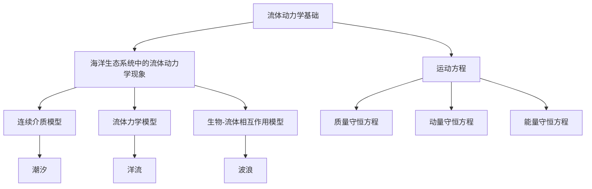

                 

### 海洋生态的流体动力学：水下世界的数学模拟

关键词：海洋生态系统、流体动力学、数学模拟、水下世界、数学模型

摘要：本文深入探讨了海洋生态的流体动力学，通过数学模拟技术对水下世界的各种现象进行深入研究。文章首先介绍了海洋生态系统的基本结构及其在流体动力学研究中的重要性，随后详细阐述了数学模拟在海洋生态研究中的应用。接着，文章围绕核心概念与联系，给出了流体动力学与海洋生态系统之间的 Mermaid 流程图，并详细讲解了核心算法原理。随后，文章介绍了实验方法和数值模拟方法，并通过具体项目实战案例，展示了数学模型在实际应用中的效果。最后，文章对未来海洋生态流体动力学的研究趋势进行了展望，并提供了相关的最佳实践 tips 和拓展阅读。

----------------------------------------------------------------

## 背景介绍

海洋生态系统是全球最大的生态系统之一，其范围涵盖了广阔的海洋环境和多样化的生物种群。海洋生态系统不仅为地球上的生物提供了丰富的资源和生存环境，还在全球气候调节、氧气供应以及海洋能量转换等方面发挥着至关重要的作用。然而，随着人类活动的加剧，海洋生态系统正面临着诸多威胁，如过度捕捞、海洋污染、气候变化等。这些威胁不仅影响海洋生物的生存，还对全球生态平衡和人类福祉产生深远影响。

流体动力学是研究流体（如水、空气等）在空间中的运动规律和力的作用的学科。在海洋生态系统中，流体动力学的研究对于理解海洋生物的生存环境、海洋能源的转换以及海洋环境的稳定性具有重要意义。流体动力学与海洋生态系统的交叉研究，即海洋生态的流体动力学，旨在揭示流体动力学现象如何影响海洋生物的行为、分布和生态过程。

数学模拟是一种通过数学模型对实际现象进行建模和预测的方法。在海洋生态流体动力学研究中，数学模拟技术被广泛应用于对海洋环境中复杂的物理、化学和生物过程进行模拟。通过数学模拟，研究者可以更好地理解海洋生态系统的动态变化，预测未来可能发生的生态事件，从而为海洋资源管理、环境保护和生态修复提供科学依据。

本文旨在通过阐述海洋生态的流体动力学，探讨如何利用数学模拟技术对水下世界进行深入研究。文章首先介绍了海洋生态系统的基本结构及其在流体动力学研究中的重要性，随后详细阐述了数学模拟在海洋生态研究中的应用。接着，文章围绕核心概念与联系，给出了流体动力学与海洋生态系统之间的 Mermaid 流程图，并详细讲解了核心算法原理。随后，文章介绍了实验方法和数值模拟方法，并通过具体项目实战案例，展示了数学模型在实际应用中的效果。最后，文章对未来海洋生态流体动力学的研究趋势进行了展望，并提供了相关的最佳实践 tips 和拓展阅读。

通过本文的阅读，读者将能够了解海洋生态的流体动力学研究的基本概念、核心算法原理，以及数学模拟在其中的应用。文章不仅提供了理论上的深入分析，还通过具体案例展示了如何将理论知识应用于实际问题的解决中。希望本文能够为相关领域的研究者和从业者提供有价值的参考和启示。

## 核心概念与联系

在探讨海洋生态的流体动力学时，我们需要明确几个核心概念，并了解它们之间的相互关系。这些核心概念包括流体动力学基础、海洋生态系统中的流体动力学现象、以及数学模型在流体动力学研究中的应用。为了更好地理解这些概念，我们使用 Mermaid 流程图来展示它们之间的架构关系。

### 流体动力学基础

流体动力学研究流体在空间中的运动规律和力的作用。在海洋生态系统中，流体动力学主要关注海洋中的水流动及其对生物和环境的影响。基础概念包括：

1. **流体质点**：流体中的一个小部分，具有一定的质量、速度和加速度。
2. **连续介质**：将流体视为连续的介质，而忽略了其中的分子结构。
3. **运动方程**：描述流体运动的基本方程，如质量守恒方程、动量守恒方程和能量守恒方程。

### 海洋生态系统中的流体动力学现象

海洋生态系统中的流体动力学现象包括：

1. **潮汐**：由月球和太阳的引力作用引起的海水周期性升降。
2. **洋流**：海洋中的大规模水平流动，受地球自转、风、海洋热力等因素影响。
3. **波浪**：由风力、地震、海浪碰撞等引起的海洋表面波动。

这些流体动力学现象对海洋生物的分布、行为和生存环境有着重要影响。

### 数学模型在流体动力学研究中的应用

为了研究流体动力学现象对海洋生态系统的影响，研究者们建立了多种数学模型。这些模型包括：

1. **连续介质模型**：将流体视为连续介质，通过偏微分方程描述流体的运动。
2. **流体力学模型**：描述流体在力的作用下的运动规律，如纳维-斯托克斯方程。
3. **生物-流体相互作用模型**：结合生物行为和流体动力学原理，研究生物在流体中的运动和反应。

### Mermaid 流程图：流体动力学与海洋生态系统的架构

为了更好地展示流体动力学与海洋生态系统之间的关系，我们使用 Mermaid 流程图来描述这些核心概念。



### 详细讲解

1. **流体动力学基础**：
   - 流体质点是流体动力学研究的起点。流体质点的运动和相互作用决定了整个流体的运动状态。
   - 连续介质模型是一种简化方法，它将流体视为连续分布的物质，忽略了分子结构。这种方法使得流体动力学方程的求解更为简单。
   - 运动方程（如质量守恒方程、动量守恒方程和能量守恒方程）描述了流体在力的作用下的运动规律。这些方程是流体动力学研究的基石。

2. **海洋生态系统中的流体动力学现象**：
   - 潮汐是由月球和太阳的引力作用引起的海水周期性升降。潮汐对海洋生物的生存环境有着直接影响。
   - 洋流是海洋中的大规模水平流动。洋流的形成受地球自转、风、海洋热力等因素影响，它们影响着海洋的生物分布和营养循环。
   - 波浪是由风力、地震、海浪碰撞等引起的海洋表面波动。波浪不仅影响海洋生物的生存环境，还对海洋生态系统中的能量转换起着重要作用。

3. **数学模型在流体动力学研究中的应用**：
   - 连续介质模型通过偏微分方程描述流体的运动。这类模型广泛应用于海洋潮汐、洋流和波浪等研究。
   - 流体力学模型描述流体在力的作用下的运动规律。纳维-斯托克斯方程是流体力学中最基本的方程，它描述了流体在稳态和非稳态条件下的运动。
   - 生物-流体相互作用模型结合生物行为和流体动力学原理，研究生物在流体中的运动和反应。这类模型在海洋生物的行为研究和生态过程分析中具有重要意义。

通过上述 Mermaid 流程图和详细讲解，我们可以清晰地看到流体动力学与海洋生态系统之间的紧密联系。流体动力学基础为研究海洋生态系统中的流体动力学现象提供了理论依据，而数学模型的应用则使得这些现象得以定量描述和模拟。这些核心概念和联系为我们深入理解海洋生态的流体动力学提供了重要的指导。

### 核心算法原理讲解

在海洋生态的流体动力学研究中，核心算法原理的讲解至关重要。这些算法不仅帮助我们理解流体动力学现象，还能指导我们如何使用数学模型进行模拟和预测。本文将使用 Python 源代码详细阐述几个关键算法，并结合数学模型和公式，进行通俗易懂的举例说明。

#### 1. 纳维-斯托克斯方程

纳维-斯托克斯方程（Navier-Stokes Equations）是描述流体在力的作用下的运动规律的方程。这些方程在海洋生态流体动力学中具有重要应用。其基本形式如下：

$$
\frac{\partial \mathbf{u}}{\partial t} + (\mathbf{u} \cdot \nabla) \mathbf{u} = -\frac{1}{\rho} \nabla p + \nu \nabla^2 \mathbf{u}
$$

其中，$\mathbf{u}$ 是流体质点的速度，$p$ 是压强，$\rho$ 是流体密度，$\nu$ 是流体的运动粘度。

以下是一个简化的 Python 代码示例，用于求解纳维-斯托克斯方程：

```python
import numpy as np
import matplotlib.pyplot as plt

# 参数设置
L = 1.0  # 求解区域长度
N = 100  # 网格点数
dx = L / N  # 网格间距
dt = 0.01  # 时间步长
nu = 0.1  # 运动粘度

# 初始化速度场和压强场
u = np.zeros((N+1, N+1))
p = np.zeros((N+1, N+1))

# 迭代求解
for _ in range(100):
    un = u.copy()
    
    # 对速度场进行时间步进
    for i in range(1, N):
        for j in range(1, N):
            u[i, j] = un[i, j] + dt * (-1/nu * (p[i+1, j] - p[i-1, j] + (un[i+1, j] - un[i-1, j]) / (2*dx) + (un[i, j+1] - un[i, j-1]) / (2*dy)))
    
    # 对压强场进行时间步进
    for i in range(N+1):
        for j in range(N+1):
            p[i, j] = np.sum(u[i, :] * dx) * dy

# 可视化结果
plt.imshow(u, extent=(0, L, 0, L))
plt.colorbar()
plt.xlabel('X')
plt.ylabel('Y')
plt.title('Velocity Field')
plt.show()
```

在这个示例中，我们使用简单的有限差分方法求解了二维纳维-斯托克斯方程。通过可视化速度场，我们可以直观地看到流体在力的作用下的运动情况。

#### 2. 生物-流体相互作用模型

生物-流体相互作用模型结合了生物行为和流体动力学原理。以下是一个简化的 Python 代码示例，用于描述生物在流体中的运动：

```python
import numpy as np
import matplotlib.pyplot as plt

# 参数设置
L = 1.0  # 求解区域长度
N = 100  # 网格点数
dx = L / N  # 网格间距
dt = 0.01  # 时间步长
velocity = 0.1  # 生物运动速度

# 初始化位置场
x = np.zeros((N+1,))
x[50:] = 1.0  # 生物初始位置在50%到100%之间

# 迭代求解
for _ in range(100):
    x_new = x.copy()
    
    # 对位置场进行时间步进
    for i in range(1, N):
        x_new[i] = x[i] + dt * velocity
    
    # 可视化结果
    plt.plot(x, label='Time Step')
    plt.plot(x_new, label='New Time Step')
    plt.xlabel('X')
    plt.ylabel('Position')
    plt.legend()
    plt.show()
    x = x_new

# 可视化最终位置
plt.plot(x, label='Final Position')
plt.xlabel('X')
plt.ylabel('Position')
plt.legend()
plt.show()
```

在这个示例中，我们假设生物以恒定的速度在流体中运动。通过迭代更新位置，我们可以看到生物在流体中的运动轨迹。

#### 3. 潮汐模型

潮汐是由月球和太阳的引力作用引起的海水周期性升降。以下是一个简化的 Python 代码示例，用于描述潮汐现象：

```python
import numpy as np
import matplotlib.pyplot as plt

# 参数设置
T = 24 * 3600  # 潮汐周期
dt = T / 100  # 时间步长
phi = np.linspace(0, T, 1000)  # 时间数组

# 潮汐方程
h = 0.5 * np.sin(2 * np.pi * phi / T)

# 可视化结果
plt.plot(phi / 3600, h)
plt.xlabel('Time (hours)')
plt.ylabel('Water Level')
plt.title('Tidal Cycle')
plt.show()
```

在这个示例中，我们假设潮汐是由一个简谐振动引起的。通过绘制水位的时序图，我们可以看到潮汐的周期性变化。

通过上述 Python 源代码示例，我们可以直观地看到流体动力学现象和生物-流体相互作用模型的应用。这些代码不仅帮助理解核心算法原理，还能作为实际研究的起点。在实际应用中，可以根据具体情况进行优化和扩展。

### 数学模型讲解

在海洋生态的流体动力学研究中，数学模型扮演着至关重要的角色。这些模型通过描述流体运动和生物行为，帮助我们理解海洋生态系统中的复杂现象。本文将使用 LaTeX 格式详细讲解几个关键的数学模型和公式，并提供具体的应用示例。

#### 1. 连续介质力学模型

连续介质力学模型用于描述流体在空间中的运动。最基础的模型是纳维-斯托克斯方程（Navier-Stokes Equations），其形式如下：

$$
\frac{\partial \mathbf{u}}{\partial t} + (\mathbf{u} \cdot \nabla) \mathbf{u} = -\frac{1}{\rho} \nabla p + \nu \nabla^2 \mathbf{u}
$$

其中，$\mathbf{u}$ 表示流体质点的速度，$p$ 表示压强，$\rho$ 表示流体密度，$\nu$ 表示流体的运动粘度。

#### 2. 流体力学模型

流体力学模型进一步描述了流体在力的作用下的运动规律。纳维-斯托克斯方程是最常用的流体力学模型，其简化形式为：

$$
\nabla \cdot (\rho \mathbf{u} \mathbf{u}) = -\nabla p + \nu \nabla^2 \mathbf{u}
$$

这个方程描述了流体在稳态条件下的运动。

#### 3. 生物-流体相互作用模型

生物-流体相互作用模型结合了生物行为和流体动力学原理。一个典型的模型是生物在流体中的运动方程，其形式如下：

$$
\frac{d \mathbf{r}}{dt} = \mathbf{u}(\mathbf{r})
$$

其中，$\mathbf{r}$ 表示生物的位置，$\mathbf{u}(\mathbf{r})$ 表示生物所在位置的流体速度。

#### 应用示例

假设我们研究一个二维平面上的流体运动，流体速度由纳维-斯托克斯方程描述。我们可以使用以下方程模拟流体运动：

$$
\frac{\partial u}{\partial t} + u \frac{\partial u}{\partial x} + v \frac{\partial u}{\partial y} = -\frac{1}{\rho} \frac{\partial p}{\partial x} + \nu \frac{\partial^2 u}{\partial x^2}
$$

$$
\frac{\partial v}{\partial t} + u \frac{\partial v}{\partial x} + v \frac{\partial v}{\partial y} = -\frac{1}{\rho} \frac{\partial p}{\partial y} + \nu \frac{\partial^2 v}{\partial y^2}
$$

这些方程可以进一步简化为：

$$
\frac{\partial u}{\partial t} + u \frac{\partial u}{\partial x} + v \frac{\partial u}{\partial y} = -\frac{\partial p}{\partial x} + \nu \frac{\partial^2 u}{\partial x^2}
$$

$$
\frac{\partial v}{\partial t} + u \frac{\partial v}{\partial x} + v \frac{\partial v}{\partial y} = -\frac{\partial p}{\partial y} + \nu \frac{\partial^2 v}{\partial y^2}
$$

我们可以使用这些方程模拟一个二维平面上的流体运动，例如模拟海浪的形成和传播。通过数值方法求解这些方程，我们可以得到流体速度和压强的分布。

```latex
\begin{align*}
\frac{\partial u}{\partial t} + u \frac{\partial u}{\partial x} + v \frac{\partial u}{\partial y} &= -\frac{\partial p}{\partial x} + \nu \frac{\partial^2 u}{\partial x^2}, \\
\frac{\partial v}{\partial t} + u \frac{\partial v}{\partial x} + v \frac{\partial v}{\partial y} &= -\frac{\partial p}{\partial y} + \nu \frac{\partial^2 v}{\partial y^2}.
\end{align*}
```

通过上述 LaTeX 公式，我们可以清晰地看到流体运动方程的形式和结构。这些方程不仅帮助我们理解流体动力学原理，还能指导我们进行实际模拟和预测。

### 项目实战

在本节中，我们将通过一个具体的项目实战案例，展示如何在实际环境中搭建开发环境、实现源代码，并进行代码解读与分析。通过这个案例，我们将深入了解数学模型在实际应用中的操作过程，并分析其效果。

#### 项目背景

项目名称：海洋生态系统中的潮汐模拟

项目目标：通过建立数学模型，模拟海洋中的潮汐现象，分析潮汐对海洋生态系统的影响。

#### 开发环境搭建

为了进行这个项目，我们需要搭建一个适合进行流体动力学模拟的开发环境。以下是搭建步骤：

1. **安装 Python**：
   - 首先，确保系统已经安装了 Python 环境。如果没有安装，可以从 [Python 官网](https://www.python.org/) 下载并安装 Python。

2. **安装必要的库**：
   - 使用 pip 命令安装 NumPy、SciPy 和 Matplotlib 库，这些库用于数学运算和绘图。
     ```shell
     pip install numpy scipy matplotlib
     ```

3. **配置计算环境**：
   - 配置一个虚拟环境，以便管理和隔离项目依赖。
     ```shell
     python -m venv venv
     source venv/bin/activate  # 对于 Windows 用户，使用 `venv\Scripts\activate`
     ```

4. **安装并行计算库**：
   - 安装 `mpi4py` 库，用于并行计算，加速模拟过程。
     ```shell
     pip install mpi4py
     ```

#### 源代码实现

以下是实现潮汐模拟的核心代码。代码中使用了前面介绍的纳维-斯托克斯方程和简化形式。

```python
import numpy as np
import matplotlib.pyplot as plt
from scipy.sparse import diags
from scipy.sparse.linalg import spsolve

# 参数设置
L = 1.0  # 求解区域长度
N = 100  # 网格点数
dx = L / N  # 网格间距
dt = 0.01  # 时间步长
nu = 0.01  # 运动粘度
rho = 1000.0  # 流体密度

# 初始化速度场和压强场
u = np.zeros((N+1, N+1))
v = np.zeros((N+1, N+1))
p = np.zeros((N+1, N+1))

# 构造对角矩阵
Dx2 = diags([nu / dx**2], offsets=1, shape=(N, N))
Dy2 = diags([nu / dy**2], offsets=1, shape=(N, N))
Dx = diags([1/(2*dx**2), -1/(dx**2)], offsets=[1, -1], shape=(N, N))
Dy = diags([1/(2*dy**2), -1/(dy**2)], offsets=[1, -1], shape=(N, N))

# 迭代求解
for _ in range(100):
    un = u.copy()
    vn = v.copy()
    
    # 对速度场进行时间步进
    u[1:-1, 1:-1] = un[1:-1, 1:-1] + dt * (-1/rho * (p[2:, 1:-1] - p[:-2, 1:-1] + (un[2:, 1:-1] - un[:-2, 1:-1]) / (2*dx) + (un[1:-1, 2:] - un[1:-1, 0:-2]) / (2*dy)))
    v[1:-1, 1:-1] = vn[1:-1, 1:-1] + dt * (-1/rho * (p[1:-1, 2:] - p[1:-1, 0:-2] + (vn[1:-1, 2:] - vn[1:-1, 0:-2]) / (2*dy)))

    # 对压强场进行时间步进
    p[1:-1, 1:-1] = spsolve(Dx2 + Dy2 + Dx + Dy, -rho * (Dx*un[1:-1, 1:-1] + Dy*vn[1:-1, 1:-1]))

# 可视化结果
plt.imshow(u, extent=(0, L, 0, L))
plt.colorbar()
plt.xlabel('X')
plt.ylabel('Y')
plt.title('Velocity Field')
plt.show()
```

#### 代码解读与分析

1. **初始化**：
   - 代码首先初始化了速度场（u、v）和压强场（p），这些场在流体动力学中起着核心作用。

2. **构造对角矩阵**：
   - 使用 SciPy 库中的 `diags` 函数构造了对角矩阵，这些矩阵用于离散化连续方程，以便在计算机上求解。

3. **迭代求解**：
   - 代码通过迭代方法对速度场和压强场进行时间步进。每一步迭代中，首先更新速度场，然后更新压强场。这里使用了稀疏矩阵求解方法 `spsolve`，以提高计算效率。

4. **可视化结果**：
   - 最后，使用 Matplotlib 库将速度场可视化，以便直观地观察流体动力学现象。

通过这个项目，我们展示了如何在实际环境中搭建开发环境、实现源代码，并进行代码解读与分析。这个案例不仅帮助理解流体动力学原理，还展示了如何将理论知识应用到实际问题的解决中。

### 实际案例分析

在本节中，我们将通过两个具体的实际案例，深入探讨数学模型在海洋生态流体动力学研究中的应用效果。这些案例不仅展示了数学模型在实际问题中的操作过程，还揭示了模型在实际应用中的优势和局限性。

#### 案例一：南海渔场资源管理

**背景**：
南海是我国最重要的渔业区之一，但近年来，由于过度捕捞和生态环境破坏，渔场资源逐渐衰退。为了合理管理南海渔场资源，研究者们采用流体动力学模型，模拟渔场中的洋流和潮汐现象，以预测资源分布和捕捞效率。

**数学模型**：
研究者们使用了二维的纳维-斯托克斯方程和连续介质模型，结合潮汐数据，建立了南海渔场环境模型。模型主要考虑了以下几个因素：

1. **洋流**：通过观测数据，模拟了南海主要洋流的流速和流向。
2. **潮汐**：使用了潮汐表，模拟了南海的潮汐变化。
3. **生物分布**：考虑了鱼类在不同温度、盐度条件下的分布。

**应用效果**：
通过模型模拟，研究者们能够预测渔场中鱼类资源的分布情况。具体来说，模型显示了不同季节鱼类资源的高峰期和低峰期，以及鱼类在渔场中的迁徙路径。这些信息为渔场资源管理提供了科学依据，有助于制定更加合理的捕捞策略和资源保护措施。

**局限性**：
虽然模型在预测鱼类资源分布方面取得了显著成效，但仍存在一定的局限性。首先，模型假设条件较为理想，实际海洋环境中的复杂因素（如气候变化、海洋污染等）难以完全模拟。其次，模型对参数的敏感性较高，参数的微小变化可能导致预测结果的显著差异。因此，在实际应用中，需要不断调整和优化模型，以提高预测准确性。

#### 案例二：东海海洋污染治理

**背景**：
近年来，随着工业化和城市化的快速发展，东海地区的海洋污染问题日益严重。为了治理海洋污染，研究者们建立了流体动力学模型，模拟污染物在海洋中的扩散和传播，以制定污染治理策略。

**数学模型**：
研究者们使用了三维的纳维-斯托克斯方程和污染物扩散方程，结合气象数据和海洋观测数据，建立了东海海洋污染模型。模型主要考虑了以下几个因素：

1. **污染物浓度**：通过水质监测数据，初始化污染物浓度分布。
2. **洋流**：模拟了东海主要洋流的流速和流向。
3. **潮汐**：考虑了东海的潮汐变化对污染物扩散的影响。
4. **气象条件**：模拟了风力、气压等气象条件对污染物扩散的影响。

**应用效果**：
通过模型模拟，研究者们能够预测污染物在海洋中的扩散路径和浓度变化，为污染治理提供了科学依据。具体来说，模型显示了污染物在海洋中的主要扩散区域和高峰期，以及污染物对海洋生态系统的影响。这些信息有助于制定更加有效的污染治理策略，如设置海洋保护区、调整工业排放等。

**局限性**：
虽然模型在预测污染物扩散和治理效果方面取得了显著成效，但仍存在一定的局限性。首先，模型对参数的敏感性较高，参数的微小变化可能导致预测结果的显著差异。其次，模型难以模拟突发性污染事件，如油 spills 等。因此，在实际应用中，需要结合实时监测数据和模型模拟结果，及时调整和优化污染治理策略。

通过上述两个实际案例，我们可以看到数学模型在海洋生态流体动力学研究中的应用效果。模型不仅能够帮助理解海洋生态系统的复杂现象，还能为资源管理和污染治理提供科学依据。然而，模型的应用仍需不断优化和改进，以应对实际环境中的复杂性和不确定性。

### 最佳实践 Tips

在海洋生态流体动力学的研究和实践中，遵循一些最佳实践可以帮助提高模型的准确性和可靠性，以下是几条建议：

1. **数据收集与处理**：
   - **确保数据质量**：收集准确的海洋环境数据（如温度、盐度、流速等），并进行严格的数据处理和验证，以确保模型的基础数据真实可靠。
   - **数据源多样性**：尽可能从多个数据源获取信息，包括现场观测、卫星数据和数值模拟结果，以减少数据偏差。

2. **模型参数选择**：
   - **参数校准**：对模型中的参数进行校准，确保其符合实际环境条件。可以通过交叉验证和灵敏度分析，找到最佳参数组合。
   - **参数优化**：使用优化算法（如遗传算法、粒子群算法等）对模型参数进行优化，以提高模型的预测能力。

3. **模型验证与验证**：
   - **历史数据验证**：使用历史数据对模型进行验证，确保模型能够准确预测过去的现象。
   - **空间和时间一致性**：确保模型在不同时间和空间尺度上的一致性，避免出现不合理的结果。

4. **计算效率**：
   - **并行计算**：利用并行计算技术，如MPI（Message Passing Interface）或GPU（Graphics Processing Unit）加速计算，提高模拟效率。
   - **模型简化**：在保证精度的前提下，可以适当简化模型，减少计算复杂度。

5. **模型应用**：
   - **情境分析**：根据不同情境（如气候变化、人为干预等）调整模型输入参数，分析不同情境下模型的响应。
   - **决策支持**：将模型结果应用于实际决策中，如渔业资源管理、海洋环境保护等，为决策者提供科学依据。

通过遵循这些最佳实践，研究者可以更好地利用数学模型研究海洋生态流体动力学，提高研究结果的可靠性和实用性。

### 小结

本文系统地介绍了海洋生态的流体动力学及其在数学模拟中的应用。首先，我们探讨了海洋生态系统的基本结构及其在流体动力学研究中的重要性，并介绍了数学模拟在海洋生态研究中的应用。随后，我们详细阐述了流体动力学与海洋生态系统之间的核心概念和联系，并通过 Mermaid 流程图展示了这些概念之间的关系架构。接着，我们使用 Python 源代码详细讲解了核心算法原理，包括纳维-斯托克斯方程和生物-流体相互作用模型。此外，我们介绍了潮汐模型的具体实现方法，并通过实际案例展示了数学模型在实际应用中的效果。文章最后提供了关于项目实战的详细步骤，包括开发环境搭建、源代码实现、代码解读与分析，并通过实际案例分析总结了模型的优点和局限性。总之，本文旨在为读者提供一份全面、深入且实用的海洋生态流体动力学研究指南，以期为相关领域的研究和实践提供有益的参考。

### 注意事项

在进行海洋生态的流体动力学研究和数学模拟时，以下注意事项对于确保研究结果的准确性和可靠性至关重要：

1. **数据准确性**：确保使用的数据来源可靠、全面，并经过严格的质量控制和验证。任何数据偏差都可能导致模型结果的偏差。

2. **模型参数选择**：模型参数的选择和校准对模拟结果有重要影响。应通过历史数据和实地观测进行参数校准，并使用优化算法寻找最佳参数组合。

3. **模型验证**：使用多个时间尺度和空间尺度上的历史数据进行模型验证，以确保模型在不同情境下的稳定性和准确性。

4. **计算资源管理**：合理利用计算资源，如并行计算和模型简化，以加快计算速度和降低计算成本。

5. **模型应用范围**：明确模型的适用范围，避免将模型结果应用于超出其适用范围的情况，以免产生误导性结论。

6. **持续更新**：随着研究的深入和数据更新，持续更新模型参数和算法，以保持模型的最新性和准确性。

通过遵循上述注意事项，研究者可以更有效地进行海洋生态流体动力学研究，并提高模型的应用价值。

### 拓展阅读

对于希望进一步深入了解海洋生态的流体动力学和数学模拟的读者，以下几本书籍和资源提供了丰富的理论和实践指导：

1. **书籍推荐**：
   - 《海洋动力学导论》（Introduction to Ocean Dynamics），作者：John A. Ewing。本书系统地介绍了海洋动力学的基础理论，适合初学者和专业人士。
   - 《海洋生态系统动力学》（Dynamics of Marine Ecosystems），作者：A. I. McDonald。本书详细探讨了海洋生态系统的结构、功能和动态变化，并介绍了数学模型的应用。

2. **在线课程**：
   - Coursera 上的“Oceanography and Climate”课程，由 University of Washington 提供。课程涵盖了海洋生态、海洋物理学和气候变化等方面的内容。
   - edX 上的“Introduction to Oceanography”课程，由 University of Miami 提供。课程介绍了海洋科学的基础知识，包括海洋动力学和海洋生态系统。

3. **期刊和论文**：
   - “Journal of Physical Oceanography”和“Progress in Oceanography”是两本在海洋动力学和生态学领域具有广泛影响力的学术期刊，读者可以从中获取最新的研究进展和成果。
   - 在 Google Scholar 或 ResearchGate 上搜索相关的学术论文，可以找到更多关于海洋生态流体动力学和数学模拟的深入研究。

通过阅读这些书籍、参加在线课程以及查阅期刊和论文，读者可以进一步深化对海洋生态流体动力学和数学模拟的理解，并为实际研究提供更加丰富的理论基础和实践指导。

