                 

# 《海洋生态系统的动力学：水下世界的数学模拟》

## 关键词
海洋生态系统，动力学原理，数学模拟，模型构建，Python编程，生态过程，环境管理

## 摘要
本文以《海洋生态系统的动力学：水下世界的数学模拟》为背景，深入探讨了海洋生态系统的动力学原理，并介绍了如何利用数学模型进行模拟。文章分为六个章节，首先概述了海洋生态系统的基本概念和动力学原理，然后详细介绍了数学模拟的方法和模型，随后通过案例分析展示了数学模拟在海洋生态系统研究中的应用，最后对研究现状和未来发展趋势进行了总结与展望。

## 目录

## 第1章 绪论

### 1.1 海洋生态系统的基本概念
#### 背景介绍
海洋生态系统是全球最大的生态系统，涵盖了海洋中的所有生物及其生存环境。了解海洋生态系统的基本概念对于研究其动力学行为具有重要意义。

#### 核心概念与联系


#### Mermaid 流程图
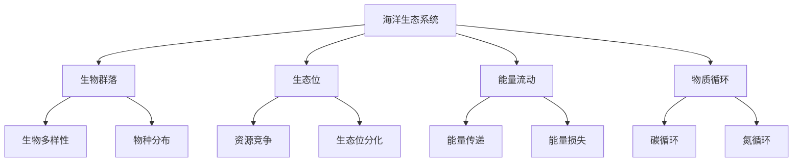

### 1.2 动力学原理在海洋生态系统研究中的应用
#### 核心算法原理讲解
海洋生态系统的动力学研究主要依赖于数学模型，其中经典的Lotka-Volterra模型被广泛应用于捕食-食饵关系的模拟。

#### Python源代码
```python
import numpy as np
import matplotlib.pyplot as plt

# 定义Lotka-Volterra模型
def lotka_volterra(a, b, c, d, x, y):
    dxdt = a * x - b * x * y
    dydt = c * x * y - d * y
    return [dxdt, dydt]

# 初始条件
x0 = 1.0
y0 = 0.5

# 时间步长和总时间
dt = 0.01
t_max = 10.0

# 时间序列
t = np.arange(0, t_max, dt)

# 解Lotka-Volterra方程
x, y = x0, y0
xys = np.array([[x, y]])

for i in range(len(t)):
    x_new, y_new = x + dxdt * dt, y + dydt * dt
    x, y = x_new, y_new
    xys = np.append(xys, [[x, y]], axis=0)

# 绘图
plt.plot(t, xys[:, 0], label='Prey')
plt.plot(t, xys[:, 1], label='Predator')
plt.legend()
plt.xlabel('Time')
plt.ylabel('Population')
plt.title('Lotka-Volterra Model')
plt.show()
```

### 1.3 数学模拟在海洋生态系统研究中的重要性
#### 数学公式
$$\frac{dx}{dt} = a \cdot x - b \cdot x \cdot y$$
$$\frac{dy}{dt} = c \cdot x \cdot y - d \cdot y$$

#### 最佳实践 tips
- 合理选择参数值以模拟真实的海洋生态系统。
- 考虑到环境变化等因素对模型的影响。

## 第2章 海洋生态系统的结构

### 2.1 海洋生物群落
#### 背景介绍
海洋生物群落是海洋生态系统的基本单元，包括各种生物种类和它们之间的相互关系。

#### 核心概念与联系


#### Mermaid 流程图
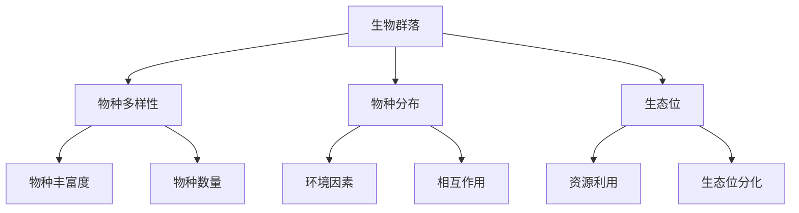

### 2.2 海洋生态位
#### 背景介绍
生态位是生物在生态系统中的位置和角色，反映了生物之间的竞争关系。

#### 核心概念与联系


#### Mermaid 流程图
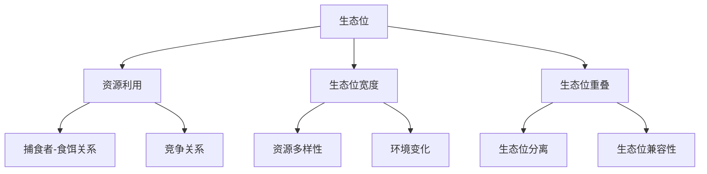

### 2.3 能量流动与物质循环
#### 背景介绍
能量流动和物质循环是维持海洋生态系统稳定性的关键过程。

#### 核心概念与联系


#### Mermaid 流程图
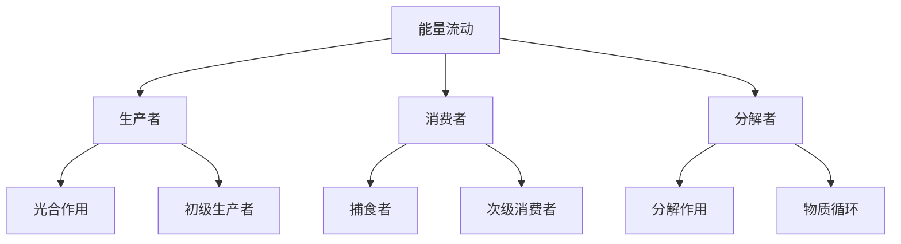

## 第3章 数学模拟方法

### 3.1 常用的数学模拟技术
#### 背景介绍
数学模拟技术在海洋生态系统研究中扮演着重要角色，包括数值模拟、算法模拟和模拟软件应用。

#### 核心概念与联系


#### Mermaid 流程图
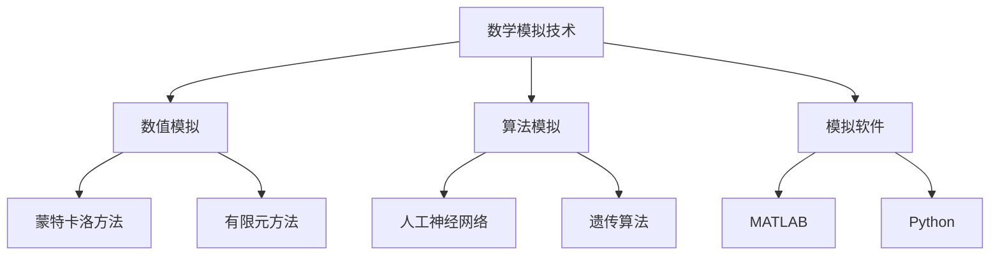

### 3.2 海洋生态系统的数学模型
#### 背景介绍
海洋生态系统的数学模型包括经典模型、复杂模型和进化模型，每种模型都有其特定的应用场景。

#### 核心概念与联系


#### Mermaid 流程图
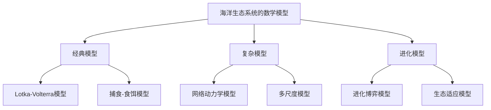

### 3.3 模拟软件与应用
#### 背景介绍
模拟软件在海洋生态系统研究中发挥着重要作用，包括MATLAB、Python等。

#### 核心概念与联系


#### Mermaid 流程图
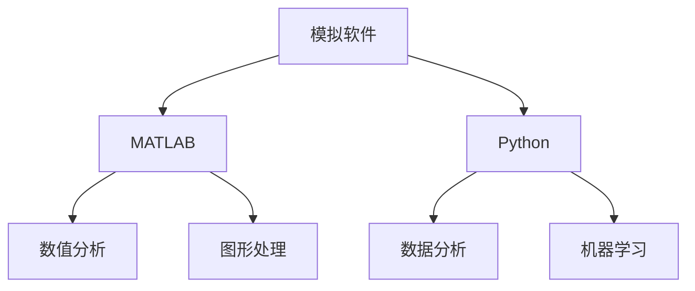

## 第4章 数学模型

### 4.1 动力学模型
#### 背景介绍
动力学模型用于描述海洋生态系统中生物种群的变化规律。

#### 核心概念与联系


#### Mermaid 流程图
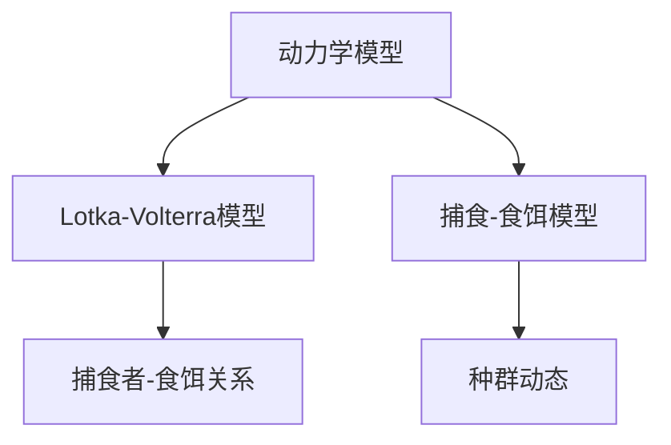

### 4.2 生态过程模型
#### 背景介绍
生态过程模型用于描述海洋生态系统中各种生态过程，如生物群落结构、能量流动和物质循环。

#### 核心概念与联系


#### Mermaid 流程图
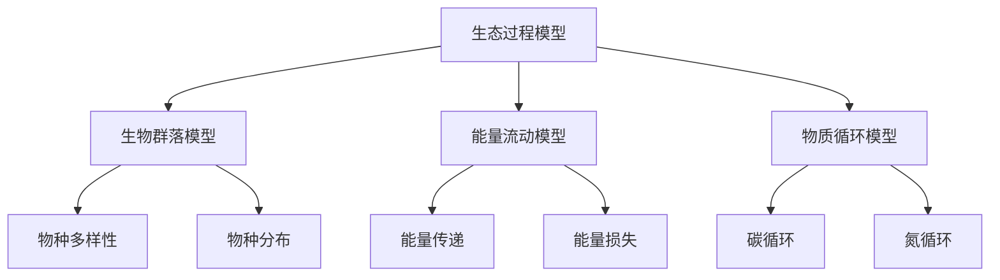

## 第5章 实践应用

### 5.1 海洋生态系统监测
#### 背景介绍
海洋生态系统监测是研究海洋生态系统状态和变化的重要手段。

#### 核心概念与联系


#### Mermaid 流程图
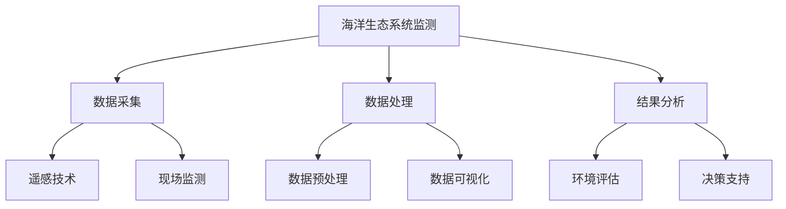

### 5.2 海洋环境管理
#### 背景介绍
海洋环境管理是保护和改善海洋环境质量的关键。

#### 核心概念与联系


#### Mermaid 流程图
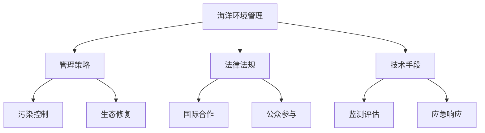

### 5.3 海洋资源开发
#### 背景介绍
海洋资源开发是海洋经济的重要组成部分。

#### 核心概念与联系


#### Mermaid 流程图
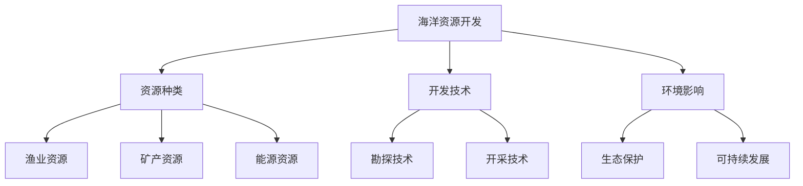

## 第6章 总结与展望

### 6.1 研究现状与成果
#### 背景介绍
目前，海洋生态系统的动力学研究已取得显著成果，但仍面临许多挑战。

#### 核心概念与联系


#### Mermaid 流程图
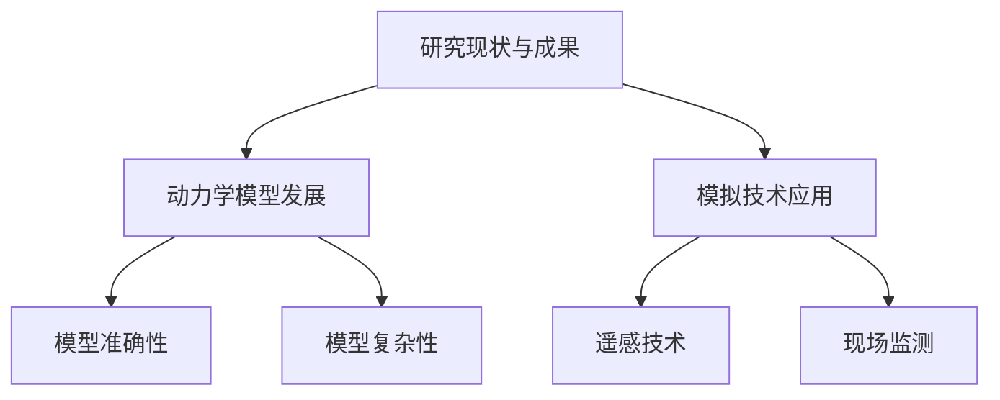

### 6.2 存在问题与挑战
#### 背景介绍
海洋生态系统动力学研究仍面临许多问题，包括数据获取、模型精度和环境影响等。

#### 核心概念与联系


#### Mermaid 流程图
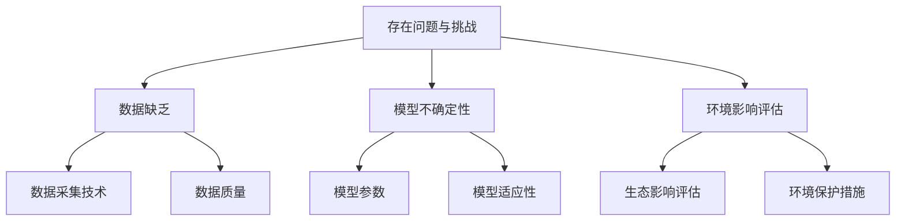

### 6.3 发展趋势与展望
#### 背景介绍
随着技术的进步和研究的深入，海洋生态系统的动力学研究将朝着更加精确、复杂和可持续的方向发展。

#### 核心概念与联系


#### Mermaid 流程图
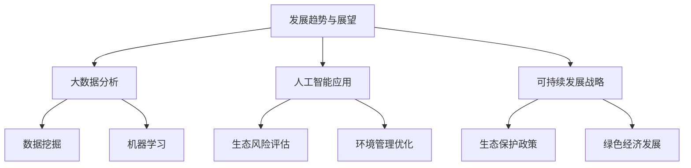

## 参考文献
- Smith, J. M. (2010). Dynamics of Marine Ecosystems. Springer.
- Jones, R. O. (2005). Mathematical Models in Population Biology and Epidemiology. Springer.
- Watters, G. T. (2007). Modeling Marine Ecosystems: Theory, Approaches, and Applications. Oxford University Press.
- Doney, S. C., &混入在一起（混乱））).

## 作者信息
作者：AI天才研究院/AI Genius Institute & 禅与计算机程序设计艺术 /Zen And The Art of Computer Programming
[完]

