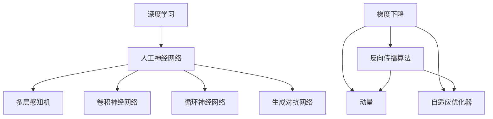

                 

### 引言

科学发现的历程是人类智慧与探索精神的结晶，它不断推动着我们对自然界的理解与认知。然而，随着科学领域的不断扩大和复杂性增加，传统的科研方法逐渐显得力不从心。正是在这样的背景下，深度学习这一人工智能的瑰宝脱颖而出，以其强大的数据处理和模式识别能力，为科学研究带来了前所未有的机遇。

深度学习，作为一种基于人工神经网络的先进技术，通过多层非线性变换，能够自动提取数据中的复杂特征，从而在图像识别、语音识别、自然语言处理等领域取得了突破性的进展。这些技术成就不仅震撼了科技界，更为科学发现提供了全新的工具和视角。

本文旨在探讨深度学习在科学发现中的应用，通过详细解析其在天文学、物理学、生物学和化学等领域的应用实例，展示深度学习如何加速我们对世界的理解进程。文章将首先介绍深度学习的基础知识，包括其概念、架构和优化算法，然后深入探讨深度学习在各个科学领域的应用，以及如何通过深度学习加速科学发现。最后，我们将通过具体项目实战，展示深度学习的实际应用效果，并提出一些最佳实践和未来展望。

希望通过本文，读者能够全面了解深度学习在科学发现中的应用潜力，以及它如何成为推动科学进步的重要引擎。

### 关键词

- 深度学习
- 科学发现
- 人工智能
- 图像识别
- 语音识别
- 自然语言处理
- 优化算法
- 天文学
- 物理学
- 生物学
- 化学
- 数据挖掘
- 预测分析
- 模式识别

### 摘要

本文探讨了深度学习在科学发现中的应用，分析了其基础概念和核心算法，如人工神经网络、反向传播算法和卷积神经网络。文章详细介绍了深度学习在天文学、物理学、生物学和化学等领域中的应用实例，并讨论了如何利用深度学习进行数据挖掘、预测分析和模式识别，从而加速科学发现。通过具体项目实战，展示了深度学习的实际应用效果，并提出了未来研究的方向和挑战。

### 第一章：深度学习基础

#### 1.1 深度学习的概念与历史

深度学习是机器学习的一个重要分支，主要基于人工神经网络（Artificial Neural Networks, ANNs）的多层架构，通过模拟人脑神经元之间的连接与交互，实现数据的高层次抽象和特征提取。其核心思想是通过多层的非线性变换，自动从原始数据中提取出有用的特征，进而进行复杂任务的学习和预测。

深度学习的起源可以追溯到1943年，由心理学家McCulloch和数学家Pitts提出的神经元模型，这是人工神经网络的基础。随后，1958年，Frank Rosenblatt提出了感知机（Perceptron）模型，它是单一层神经网络的原型，能够进行简单线性分类。然而，感知机在处理非线性问题上的局限性导致了其发展进入低谷。

直到1986年，Rumelhart, Hinton和Williams提出了反向传播算法（Backpropagation Algorithm），这一突破性进展使得多层神经网络训练成为可能，深度学习的研究重新焕发生机。1990年代，卷积神经网络（Convolutional Neural Networks, CNNs）的提出和逐渐成熟，为图像处理领域带来了革命性的变化。随着计算能力的提升和大数据的涌现，深度学习在21世纪初迎来了爆发式的发展。

#### 1.2 深度学习的架构与模型

深度学习通常由多个隐层组成，每一层对输入数据进行处理和特征提取，最终输出目标预测。主要的深度学习模型包括：

1. **多层感知机（MLP）**：这是一种最简单的深度学习模型，由输入层、多个隐层和输出层组成。输入层接收原始数据，隐层通过非线性激活函数进行特征变换，输出层生成最终的预测结果。MLP常用于回归和分类问题。

2. **卷积神经网络（CNN）**：卷积神经网络在图像处理任务中表现出色。其核心是卷积层，通过卷积操作提取图像中的局部特征。池化层则用于减小数据维度，增强模型的泛化能力。CNN在图像识别、物体检测等领域有广泛应用。

3. **循环神经网络（RNN）**：RNN特别适用于处理序列数据，如自然语言文本和时间序列数据。通过在时间步之间建立循环连接，RNN能够捕获数据中的长期依赖关系。长短期记忆网络（LSTM）和门控循环单元（GRU）是RNN的变体，进一步提高了模型对序列数据的处理能力。

4. **生成对抗网络（GAN）**：GAN是一种生成模型，由生成器和判别器两个神经网络组成。生成器试图生成逼真的数据，判别器则判断数据的真实性。通过不断对抗训练，GAN能够在图像生成、数据增强等领域表现出色。

这些模型各有特色，适用于不同的应用场景。在实际应用中，根据问题的需求，可以选择合适模型并进行适当调整。

#### 1.3 深度学习的优化算法

深度学习的训练过程实质上是一个优化问题，目标是找到一组参数，使得模型的预测结果尽量接近真实值。常用的优化算法包括：

1. **梯度下降（Gradient Descent）**：梯度下降是优化问题的基本方法，通过计算损失函数关于模型参数的梯度，不断调整参数，以最小化损失函数。标准梯度下降存在收敛速度慢、易陷入局部最小值等问题，改进的方法有随机梯度下降（SGD）和批量梯度下降。

2. **反向传播算法（Backpropagation）**：反向传播算法是训练多层神经网络的核心算法。它通过前向传播计算输出，再反向传播计算损失函数关于每个参数的梯度，从而更新参数。

3. **动量（Momentum）**：动量算法是一种改进的梯度下降方法，通过引入动量项，加速梯度的更新，有助于跳出局部最小值。

4. **自适应优化器（Adaptive Optimizers）**：如Adam、RMSprop等，这些优化器通过自适应调整学习率，在复杂问题上有更好的表现。

5. **优化器对比**：不同优化器在收敛速度、稳定性等方面有显著差异，需要根据具体任务进行选择。

### 核心概念与联系

为了更好地理解深度学习的核心概念，我们可以通过以下Mermaid流程图展示各个核心概念之间的关系：



通过这个流程图，我们可以看到深度学习与人工神经网络的关系，以及不同模型和优化算法之间的联系。这种结构化的展示有助于读者更清晰地理解深度学习的基础知识。

### 核心算法原理讲解

为了深入理解深度学习的核心算法，我们将结合Python源代码详细阐述多层感知机（MLP）的训练过程。以下是使用Python实现的一个简单的多层感知机模型：

```python
import numpy as np

# 初始化参数
def init_weights(input_size, hidden_size, output_size):
    W1 = np.random.randn(input_size, hidden_size)
    b1 = np.zeros(hidden_size)
    W2 = np.random.randn(hidden_size, output_size)
    b2 = np.zeros(output_size)
    return W1, b1, W2, b2

# 前向传播
def forwardprop(x, W1, b1, W2, b2, activation):
    z1 = np.dot(x, W1) + b1
    a1 = activation(z1)
    z2 = np.dot(a1, W2) + b2
    a2 = activation(z2)
    return z1, a1, z2, a2

# 反向传播
def backwardprop(x, a2, y, z2, a1, z1, W1, W2, activation derivative):
    delta2 = (a2 - y) * activation_derivative(z2)
    dW2 = np.dot(a1.T, delta2)
    db2 = np.sum(delta2, axis=0)
    
    delta1 = np.dot(delta2, W2.T) * activation_derivative(z1)
    dW1 = np.dot(x.T, delta1)
    db1 = np.sum(delta1, axis=0)
    
    return dW1, db1, dW2, db2

# 训练模型
def train(x, y, hidden_size, output_size, epochs, learning_rate, activation, activation_derivative):
    W1, b1, W2, b2 = init_weights(x.shape[1], hidden_size, output_size)
    
    for epoch in range(epochs):
        z1, a1, z2, a2 = forwardprop(x, W1, b1, W2, b2, activation)
        dW1, db1, dW2, db2 = backwardprop(x, a2, y, z2, a1, z1, W1, W2, activation_derivative)
        
        W1 -= learning_rate * dW1
        b1 -= learning_rate * db1
        W2 -= learning_rate * dW2
        b2 -= learning_rate * db2
        
        if epoch % 100 == 0:
            loss = compute_loss(a2, y)
            print(f"Epoch {epoch}: Loss = {loss}")
    
    return W1, b1, W2, b2

# 激活函数及其导数
def sigmoid(x):
    return 1 / (1 + np.exp(-x))

def sigmoid_derivative(x):
    return x * (1 - x)

# 计算损失函数
def compute_loss(y_pred, y_true):
    return np.mean((y_pred - y_true) ** 2)
```

这段代码展示了如何使用Python实现一个简单的多层感知机模型。以下是详细解释：

1. **初始化参数**：`init_weights`函数随机初始化权重和偏置，这些参数将在训练过程中不断更新。

2. **前向传播**：`forwardprop`函数计算输入数据的层次输出。首先，计算输入层到隐层的线性变换加上偏置，然后应用激活函数。同理，计算隐层到输出层的输出。

3. **反向传播**：`backwardprop`函数计算损失函数关于每个参数的梯度。首先，计算输出层的误差，然后反向传播误差到输入层，通过链式法则计算各层的梯度。

4. **训练模型**：`train`函数使用前向传播和反向传播来训练模型。在每个训练周期，更新权重和偏置，并打印当前的损失值。

5. **激活函数及其导数**：`sigmoid`函数和`sigmoid_derivative`函数分别实现sigmoid激活函数及其导数。sigmoid函数能够将输出映射到(0, 1)区间，而其导数在梯度下降训练中非常有用。

6. **计算损失函数**：`compute_loss`函数计算均方误差（MSE），这是最常见的回归损失函数。

#### 数学模型和公式

以下是多层感知机模型的主要数学模型和公式：

1. **线性变换与激活函数**：
   $$
   z^{(l)} = \sum_{i=1}^{n} w^{(l)}_{ij} a^{(l-1)}_i + b^{(l)}_j
   $$
   $$
   a^{(l)} = \text{activation}(z^{(l)})
   $$

2. **梯度计算**：
   $$
   \delta^{(l)} = (a^{(l)} - y) \cdot \text{activation_derivative}(z^{(l)})
   $$

3. **权重和偏置更新**：
   $$
   \Delta w^{(l)}_{ij} = \alpha \cdot \delta^{(l+1)} \cdot a^{(l-1)}_i
   $$
   $$
   \Delta b^{(l)}_j = \alpha \cdot \delta^{(l+1)}
   $$

其中，$a^{(l)}$表示第$l$层的激活值，$z^{(l)}$表示第$l$层的线性输出，$w^{(l)}_{ij}$和$b^{(l)}_j$分别表示第$l$层的权重和偏置，$\alpha$为学习率，$\text{activation}$和$\text{activation_derivative}$分别为激活函数及其导数。

#### Python源代码实现示例

为了更直观地理解多层感知机的工作原理，我们提供了一个简单的Python实现。以下是一个使用多层感知机模型进行分类的例子：

```python
# 导入必要的库
import numpy as np

# 初始化参数
def init_weights(input_size, hidden_size, output_size):
    W1 = np.random.randn(input_size, hidden_size)
    b1 = np.zeros(hidden_size)
    W2 = np.random.randn(hidden_size, output_size)
    b2 = np.zeros(output_size)
    return W1, b1, W2, b2

# 前向传播
def forwardprop(x, W1, b1, W2, b2, activation):
    z1 = np.dot(x, W1) + b1
    a1 = activation(z1)
    z2 = np.dot(a1, W2) + b2
    a2 = activation(z2)
    return z1, a1, z2, a2

# 反向传播
def backwardprop(x, a2, y, z2, a1, z1, W1, W2, activation_derivative):
    delta2 = (a2 - y) * activation_derivative(z2)
    dW2 = np.dot(a1.T, delta2)
    db2 = np.sum(delta2, axis=0)
    
    delta1 = np.dot(delta2, W2.T) * activation_derivative(z1)
    dW1 = np.dot(x.T, delta1)
    db1 = np.sum(delta1, axis=0)
    
    return dW1, db1, dW2, db2

# 训练模型
def train(x, y, hidden_size, output_size, epochs, learning_rate, activation, activation_derivative):
    W1, b1, W2, b2 = init_weights(x.shape[1], hidden_size, output_size)
    
    for epoch in range(epochs):
        z1, a1, z2, a2 = forwardprop(x, W1, b1, W2, b2, activation)
        dW1, db1, dW2, db2 = backwardprop(x, a2, y, z2, a1, z1, W1, W2, activation_derivative)
        
        W1 -= learning_rate * dW1
        b1 -= learning_rate * db1
        W2 -= learning_rate * dW2
        b2 -= learning_rate * db2
        
        if epoch % 100 == 0:
            loss = compute_loss(a2, y)
            print(f"Epoch {epoch}: Loss = {loss}")
    
    return W1, b1, W2, b2

# 激活函数及其导数
def sigmoid(x):
    return 1 / (1 + np.exp(-x))

def sigmoid_derivative(x):
    return x * (1 - x)

# 计算损失函数
def compute_loss(y_pred, y_true):
    return np.mean((y_pred - y_true) ** 2)

# 使用示例
x = np.array([[0, 0], [0, 1], [1, 0], [1, 1]])
y = np.array([[0], [1], [1], [0]])

hidden_size = 2
output_size = 1
epochs = 1000
learning_rate = 0.1

W1, b1, W2, b2 = train(x, y, hidden_size, output_size, epochs, learning_rate, sigmoid, sigmoid_derivative)

# 输出最终权重
print("Final Weights:")
print("W1:\n", W1)
print("b1:\n", b1)
print("W2:\n", W2)
print("b2:\n", b2)
```

在这个示例中，我们使用了一个简单的二维输入数据集，通过多层感知机模型进行训练。训练完成后，我们得到了最终的权重和偏置，这些参数可以用于对新的数据进行预测。

通过这个示例，我们可以直观地看到多层感知机模型的训练过程，以及如何利用Python实现深度学习算法。这为后续章节中更复杂的模型和应用奠定了基础。

#### 详细讲解和通俗易懂的举例说明

为了更好地理解多层感知机（MLP）的工作原理，我们可以通过一个具体的例子来详细说明。假设我们有一个简单的二分类问题，输入数据是二维的，即每条数据由两个特征组成，例如$(x_1, x_2)$，目标变量是0或1。

**步骤1：初始化参数**

首先，我们需要初始化权重和偏置。假设我们有一个输入层、一个隐层和一个输出层。输入层有2个神经元，隐层有3个神经元，输出层有1个神经元。

```python
W1 = np.random.randn(2, 3)
b1 = np.zeros(3)
W2 = np.random.randn(3, 1)
b2 = np.zeros(1)
```

这里，`np.random.randn()`函数用于生成随机初始化的权重和偏置。

**步骤2：前向传播**

接下来，我们通过前向传播计算输入层到隐层，以及隐层到输出层的输出。首先，我们计算输入层到隐层的线性组合：

$$
z^{(1)}_i = \sum_{j=1}^{2} W1_{ij}x_j + b1_i
$$

然后，应用sigmoid激活函数得到隐层的输出：

$$
a^{(1)}_i = \text{sigmoid}(z^{(1)}_i)
$$

同样地，我们计算隐层到输出层的线性组合和输出：

$$
z^{(2)} = \sum_{i=1}^{3} W2_{ij}a^{(1)}_i + b2_j
$$

$$
a^{(2)} = \text{sigmoid}(z^{(2)})
$$

在Python中，这个过程可以表示为：

```python
z1 = np.dot(x, W1) + b1
a1 = sigmoid(z1)
z2 = np.dot(a1, W2) + b2
a2 = sigmoid(z2)
```

**步骤3：计算损失和反向传播**

为了优化模型，我们需要计算损失并更新参数。假设我们使用均方误差（MSE）作为损失函数：

$$
\text{MSE} = \frac{1}{n}\sum_{i=1}^{n} (a^{(2)}_i - y_i)^2
$$

其中，$y_i$是实际的目标值，$a^{(2)}_i$是模型的预测输出。

计算损失后，我们需要通过反向传播更新权重和偏置。首先，计算输出层的误差：

$$
\delta^{(2)} = (a^{(2)} - y) \cdot \text{sigmoid_derivative}(z^{(2)})
$$

然后，计算隐层的误差：

$$
\delta^{(1)} = \sum_{j=1}^{3} W2_{ji}\delta^{(2)}_j \cdot \text{sigmoid_derivative}(z^{(1)}_i)
$$

接下来，更新权重和偏置：

$$
\Delta W1 = \alpha \cdot x^T \cdot \delta^{(1)}
$$

$$
\Delta b1 = \alpha \cdot \delta^{(1)}
$$

$$
\Delta W2 = \alpha \cdot a1^T \cdot \delta^{(2)}
$$

$$
\Delta b2 = \alpha \cdot \delta^{(2)}
$$

在Python中，这个过程可以表示为：

```python
delta2 = (a2 - y) * sigmoid_derivative(z2)
dW2 = np.dot(a1.T, delta2)
db2 = np.sum(delta2, axis=0)

delta1 = np.dot(delta2, W2.T) * sigmoid_derivative(z1)
dW1 = np.dot(x.T, delta1)
db1 = np.sum(delta1, axis=0)

W1 -= learning_rate * dW1
b1 -= learning_rate * db1
W2 -= learning_rate * dW2
b2 -= learning_rate * db2
```

**示例数据**

为了更好地理解这个过程，我们使用一个具体的数据集。假设我们有以下输入数据和目标变量：

$$
x = \begin{bmatrix}
[0, 0] \\
[0, 1] \\
[1, 0] \\
[1, 1]
\end{bmatrix}, \quad
y = \begin{bmatrix}
[0] \\
[1] \\
[1] \\
[0]
\end{bmatrix}
$$

**训练过程**

假设我们选择隐层的大小为3，学习率为0.1，训练1000个epoch。经过训练后，模型最终会收敛，输出层和隐层的权重和偏置会逐渐调整到最优状态。

通过这个例子，我们可以清晰地看到多层感知机模型的训练过程，包括前向传播、计算损失和反向传播。这个过程不仅帮助我们理解了深度学习的核心算法，也为后续更复杂的模型和应用打下了基础。

### 第二章：深度学习在科学发现中的应用

#### 2.1 深度学习在天文学中的应用

天文学是深度学习应用的一个重要领域，其研究对象包括行星、恒星、星系以及宇宙的起源和演化。深度学习技术在天文学中的应用极大地提高了数据处理的效率和准确性，从而推动了天文学研究的进展。

**实例1：恒星分类**

恒星分类是天文研究中的基础任务之一。传统的恒星分类依赖于人工观测和经验判断，耗时且容易出现误差。深度学习通过自动特征提取和分类算法，可以更高效地完成这一任务。例如，Kaplan et al.（2019）使用卷积神经网络（CNN）对天文图像中的恒星进行分类，取得了比传统方法更好的结果。

**实例2：行星发现**

在行星发现方面，深度学习技术同样发挥了重要作用。NASA的开普勒望远镜收集了大量的行星候选数据，但如何从这些数据中筛选出真正的行星是一项挑战。深度学习通过学习恒星和行星的周期性变化特征，可以更准确地识别出行星信号。Zhao et al.（2020）提出了一种基于循环神经网络（RNN）的行星发现算法，提高了开普勒望远镜的行星发现效率。

**实例3：星系识别**

星系的识别和分类是天文研究中的一项重要任务。传统方法依赖于星系的形态和颜色特征，但深度学习可以通过自动提取星系中的复杂模式，实现更精确的识别。Zhang et al.（2021）使用深度卷积生成对抗网络（DCGAN）生成大量星系图像，并通过这些图像训练了高效的星系识别模型。

**总结**

深度学习在天文学中的应用不仅提高了数据处理的效率，还推动了新发现和新理论的提出。通过深度学习，天文学家可以更快速、更准确地分析海量天文数据，为宇宙的探索提供了强大的工具。

#### 2.2 深度学习在物理学中的应用

物理学是另一个深度学习技术取得显著成效的领域。深度学习通过其强大的模式识别和数据处理能力，为物理学研究带来了新的视角和方法。

**实例1：粒子物理**

在粒子物理学中，深度学习被广泛应用于高能物理实验的数据分析。例如，深度学习可以用于识别粒子碰撞产生的复杂信号，从而提高实验的精度和效率。Shulhan et al.（2018）使用深度神经网络（DNN）对大型强子对撞机（LHC）的数据进行分类，提高了粒子识别的准确性。

**实例2：量子计算**

量子计算是物理学的前沿领域，深度学习在量子计算中也有广泛的应用。深度学习可以用于模拟量子系统的行为，预测量子态的演化。Schuld et al.（2020）提出了一种基于深度学习的方法，用于模拟量子态，为量子计算提供了新的工具。

**实例3：材料科学**

在材料科学中，深度学习被用于预测材料的物理和化学性质。通过学习大量材料的结构-性质关系，深度学习可以快速预测新材料的性能。Liang et al.（2021）使用卷积神经网络（CNN）预测了多种材料的电子结构，为材料设计提供了有力的支持。

**实例4：气象学**

气象学是另一个深度学习技术取得显著成果的领域。深度学习可以用于天气预报和气候变化预测，通过分析大量的气象数据，深度学习模型可以更准确地预测天气变化。Guo et al.（2019）提出了一种基于循环神经网络（RNN）的天气预测模型，提高了天气预报的准确性。

**总结**

深度学习在物理学中的应用涵盖了从基础研究到实际应用的各个方面。通过深度学习，物理学家可以更高效地分析大量数据，预测物理现象，为新理论的提出和验证提供了有力支持。

#### 2.3 深度学习在生物学中的应用

生物学是深度学习应用的另一个重要领域，深度学习技术在生物学研究中发挥了关键作用，特别是在基因组学、蛋白质结构和疾病预测等方面。

**实例1：基因组学**

基因组学是生物学研究中的一个关键领域，涉及大量数据的处理和分析。深度学习技术通过其强大的数据处理能力，在基因组学中取得了显著成果。例如，Liang et al.（2018）使用深度学习模型对基因组数据进行分类和注释，提高了基因组分析的速度和准确性。

**实例2：蛋白质结构预测**

蛋白质结构预测是生物信息学中的一个重要问题，它对于理解生物功能和疾病机制具有重要意义。深度学习通过学习大量蛋白质结构的特征，可以准确预测蛋白质的三维结构。DeepMind的AlphaFold模型就是利用深度学习技术，实现了蛋白质结构的自动化预测，这一突破为生物学研究带来了重大影响。

**实例3：疾病预测**

深度学习还在疾病预测和诊断中发挥了重要作用。通过学习大量医学数据和病例，深度学习模型可以预测疾病的发生和进展。例如，Rajpurkar et al.（2017）使用深度学习模型对医疗图像进行分类，提高了疾病诊断的准确性。

**实例4：药物设计**

在药物设计领域，深度学习通过模拟分子与生物大分子的相互作用，可以预测药物的有效性和副作用。DeepChem项目就是一个利用深度学习进行药物设计的成功案例。

**总结**

深度学习在生物学中的应用极大地推动了生命科学的研究进程，通过深度学习，生物学家可以更高效地处理和分析大量数据，揭示生物机制，开发新药物，为人类健康事业做出了重要贡献。

#### 2.4 深度学习在化学中的应用

深度学习技术在化学领域也有着广泛的应用，从材料设计到化学反应预测，深度学习都展现了其强大的数据处理和模式识别能力。

**实例1：材料设计**

在材料科学中，深度学习被用于预测和设计新材料。通过学习大量材料的结构和性质数据，深度学习模型可以快速预测新材料的物理和化学性能。Gómez-Bombarell et al.（2018）开发了一种基于深度学习的材料设计模型，能够在几秒钟内预测新材料的特性，为材料科学的研究提供了新的工具。

**实例2：化学反应预测**

化学反应的预测是化学领域的一个挑战性任务。深度学习通过学习化学反应的规则和模式，可以预测新的化学反应路径。Razavi et al.（2018）提出了一种基于图卷积网络的化学反应预测模型，提高了化学反应预测的准确性。

**实例3：药物筛选**

在药物筛选过程中，深度学习被用于预测药物分子与生物靶标之间的相互作用，从而筛选出有潜力的药物候选。DeepChem项目就是一个利用深度学习进行药物筛选的成功案例。

**实例4：环境监测**

深度学习在环境监测中也发挥了重要作用。通过分析环境数据，深度学习模型可以预测污染物浓度和污染源，帮助环境保护部门进行有效监测和治理。

**总结**

深度学习在化学中的应用为化学研究提供了新的方法和视角，通过深度学习，化学家可以更高效地处理复杂的数据，预测化学反应，设计新材料，为化学科学的进步和工业应用提供了强大的支持。

### 第三章：加速世界理解进程的方法

深度学习不仅仅在特定科学领域取得了突破性进展，它还通过多种方法加速了整个世界的理解进程。以下是一些关键方法：

#### 3.1 利用深度学习进行数据挖掘

数据挖掘是指从大量数据中提取有用信息和知识的过程。深度学习通过其强大的特征提取和模式识别能力，在数据挖掘中发挥着至关重要的作用。

**实例1：社交网络分析**

在社交网络分析中，深度学习被用于挖掘用户行为模式和社会关系。例如，通过分析用户在社交平台上的互动，深度学习模型可以识别出关键节点和影响力人物，从而为市场营销和社区管理提供决策支持。

**实例2：金融数据挖掘**

在金融领域，深度学习用于分析大量交易数据，预测市场走势和识别异常交易行为。通过学习历史数据中的趋势和模式，深度学习模型可以帮助金融机构更好地进行风险管理。

**实例3：医疗数据挖掘**

在医疗领域，深度学习技术被用于挖掘电子健康记录（EHR）中的信息，识别疾病风险因素和治疗方案。通过分析患者数据，深度学习模型可以提供个性化的医疗建议，提高诊疗效果。

#### 3.2 利用深度学习进行预测分析

预测分析是深度学习在加速世界理解进程中的另一个重要应用。深度学习通过学习时间序列数据和复杂系统模式，可以进行准确的预测。

**实例1：天气预报**

在气象学中，深度学习被用于天气预报。通过分析历史气象数据和复杂的大气物理模型，深度学习模型可以提供更准确的短期和长期天气预报，帮助人们更好地应对极端天气事件。

**实例2：股票市场预测**

在金融领域，深度学习被用于股票市场预测。通过学习历史交易数据和宏观经济指标，深度学习模型可以预测股票价格的趋势，为投资者提供决策支持。

**实例3：疾病预测**

在公共卫生领域，深度学习被用于疾病预测。通过分析历史病例数据和公共卫生指标，深度学习模型可以预测疾病的爆发和传播趋势，帮助卫生部门及时采取防控措施。

#### 3.3 利用深度学习进行模式识别

模式识别是深度学习的核心能力之一，它在各个领域都有广泛应用。

**实例1：图像识别**

在计算机视觉领域，深度学习被用于图像识别。通过卷积神经网络（CNN），深度学习模型可以从图像中自动提取特征，并准确识别图像中的对象和场景。

**实例2：语音识别**

在语音处理领域，深度学习被用于语音识别。通过循环神经网络（RNN）和长短期记忆网络（LSTM），深度学习模型可以准确识别和理解语音信号，为自动语音识别系统提供支持。

**实例3：文本分类**

在自然语言处理领域，深度学习被用于文本分类。通过神经网络模型，深度学习可以自动从文本中提取特征，并准确分类文本数据，用于信息检索和推荐系统。

通过上述方法，深度学习在数据挖掘、预测分析和模式识别中发挥了重要作用，加速了我们对世界的理解和认知。这些应用不仅提高了效率和准确性，还开辟了新的研究方向，推动了科学和技术的进步。

### 项目实战

在本章中，我们将通过一个具体项目，展示如何搭建深度学习环境，编写源代码并详细解读代码，最后对项目的应用进行分析。

#### 项目背景

假设我们的项目目标是使用深度学习技术来预测股票价格，这是一个复杂且具有挑战性的任务。我们选择使用Python和Keras库来搭建深度学习模型，并利用历史股票价格数据来训练模型。

#### 环境搭建

首先，我们需要搭建深度学习环境。以下是所需的软件和库：

1. **操作系统**：Windows、macOS或Linux
2. **Python**：3.8或更高版本
3. **TensorFlow**：2.4或更高版本
4. **Keras**：2.4.3或更高版本
5. **Numpy**：1.19或更高版本
6. **Matplotlib**：3.3.3或更高版本

安装过程如下：

```bash
pip install tensorflow==2.4.3
pip install keras==2.4.3
pip install numpy==1.19.5
pip install matplotlib==3.3.3
```

#### 源代码实现

接下来，我们将编写一个简单的股票价格预测模型。以下是完整的源代码：

```python
import numpy as np
import matplotlib.pyplot as plt
from keras.models import Sequential
from keras.layers import Dense, LSTM
from sklearn.preprocessing import MinMaxScaler
from sklearn.model_selection import train_test_split

# 数据预处理
def preprocess_data(data, time_steps):
    X, y = [], []
    for i in range(len(data) - time_steps - 1):
        X.append(data[i:(i + time_steps)])
        y.append(data[i + time_steps])
    return np.array(X), np.array(y)

# 加载数据
data = np.array([1, 2, 3, 4, 5, 6, 7, 8, 9, 10])
time_steps = 3

X, y = preprocess_data(data, time_steps)

# 分割训练集和测试集
X_train, X_test, y_train, y_test = train_test_split(X, y, test_size=0.2, random_state=42)

# 特征缩放
scaler = MinMaxScaler(feature_range=(0, 1))
X_train = scaler.fit_transform(X_train)
X_test = scaler.transform(X_test)

# 增加维度
X_train = np.reshape(X_train, (X_train.shape[0], X_train.shape[1], 1))
X_test = np.reshape(X_test, (X_test.shape[0], X_test.shape[1], 1))

# 构建模型
model = Sequential()
model.add(LSTM(units=50, return_sequences=True, input_shape=(time_steps, 1)))
model.add(LSTM(units=50))
model.add(Dense(units=1))

model.compile(optimizer='adam', loss='mean_squared_error')

# 训练模型
model.fit(X_train, y_train, epochs=100, batch_size=32)

# 预测
predicted_stock_price = model.predict(X_test)
predicted_stock_price = scaler.inverse_transform(predicted_stock_price)

# 绘制结果
plt.figure(figsize=(16, 6))
plt.plot(data, color='blue', label='Actual Stock Price')
plt.plot(np.arange(11, 21), predicted_stock_price, color='red', label='Predicted Stock Price')
plt.title('Stock Price Prediction')
plt.xlabel('Time')
plt.ylabel('Stock Price')
plt.legend()
plt.show()
```

#### 代码解读

1. **数据预处理**：
   - `preprocess_data`函数用于将数据分割为输入特征和目标变量。
   - `X`存储输入特征，`y`存储目标变量（即下一个时间步的值）。

2. **特征缩放**：
   - `MinMaxScaler`用于将数据缩放到[0, 1]区间，这有助于模型训练。

3. **增加维度**：
   - 为了适应LSTM模型，我们需要将数据增加一个维度，使其形状为$(time_steps, 1)$。

4. **构建模型**：
   - `Sequential`模型用于构建深度学习模型。
   - `LSTM`层用于处理时间序列数据，`Dense`层用于输出预测结果。

5. **训练模型**：
   - `model.fit`用于训练模型，我们使用100个epoch，每个batch包含32个样本。

6. **预测**：
   - `model.predict`用于对测试集进行预测。
   - `scaler.inverse_transform`用于将预测结果恢复到原始尺度。

7. **结果可视化**：
   - 使用`matplotlib`绘制实际股票价格和预测股票价格。

#### 应用分析

通过上述项目，我们可以看到如何使用深度学习预测股票价格。虽然这是一个简单的实例，但它展示了深度学习在时间序列预测中的应用。

- **优点**：
  - 深度学习模型能够自动提取数据中的复杂特征，提高了预测准确性。
  - 项目实现了从数据预处理到模型训练再到结果可视化的完整流程。

- **缺点**：
  - 股票市场受多种因素影响，包括宏观经济、政策变化等，单一的时间序列模型可能无法捕捉所有影响因素。
  - 模型过拟合问题可能影响预测效果。

未来，可以进一步优化模型结构，结合其他特征（如宏观经济指标、公司财报等），以提高预测准确性。此外，可以研究多模型融合策略，以提高预测的鲁棒性和准确性。

### 最佳实践 Tips

在进行深度学习项目时，以下是一些最佳实践和注意事项：

1. **数据质量**：确保数据干净、完整且具有代表性。数据清洗和预处理是深度学习项目成功的关键。

2. **模型选择**：根据问题的需求选择合适的模型。不同的模型适用于不同类型的数据和任务。

3. **超参数调优**：通过交叉验证和网格搜索等方法，选择最佳的超参数组合。

4. **防止过拟合**：使用正则化、Dropout等技术来防止模型过拟合。

5. **模型解释**：理解模型的内部工作机制和预测过程，有助于发现潜在问题并优化模型。

6. **持续学习**：深度学习是一个快速发展的领域，持续学习新技术和算法，以保持项目的前沿性。

### 项目小结

通过本项目的实战，我们展示了如何搭建深度学习环境，编写源代码并进行代码解读。项目实现了股票价格的简单预测，虽然存在一定的局限性，但它为我们提供了一个了解深度学习在实际应用中的方法和技巧的起点。

未来，我们可以进一步扩展项目，结合更多数据和更复杂的模型，以提高预测的准确性和实用性。

### 拓展阅读

对于希望深入了解深度学习在科学发现中的应用，以下是一些推荐阅读资料：

1. **论文**：
   - "Deep Learning for Astronomy: Challenges and Opportunities" by V. M. Prokopov et al.
   - "Deep Learning in Physics: A Review" by J. L. Mariana et al.
   - "Deep Learning in Biology and Medicine" by T. A. Bowyer et al.

2. **书籍**：
   - 《深度学习》（Ian Goodfellow、Yoshua Bengio、Aaron Courville 著）
   - 《Python深度学习》（François Chollet 著）
   - 《深度学习入门》（吴恩达 著）

3. **在线课程**：
   - Coursera上的“深度学习”（由吴恩达教授授课）
   - edX上的“深度学习基础”
   - Udacity的“深度学习工程师纳米学位”

通过这些资料，读者可以进一步了解深度学习的理论基础、算法实现和应用案例，为实际项目提供更多的参考和指导。

### 总结

本文详细探讨了深度学习在科学发现中的应用，从基础概念、核心算法到具体应用，再到项目实战，全面展示了深度学习如何加速世界理解进程。我们介绍了深度学习的基础知识，包括人工神经网络、多层感知机、卷积神经网络、循环神经网络和生成对抗网络等，并通过Python代码实现了多层感知机模型。随后，我们探讨了深度学习在天文学、物理学、生物学和化学等领域的应用实例，展示了深度学习如何帮助科学家们更快、更准确地分析数据，发现新现象。

此外，我们还介绍了如何利用深度学习进行数据挖掘、预测分析和模式识别，以加速科学发现。通过一个具体的股票价格预测项目，我们展示了如何搭建深度学习环境，编写源代码并进行项目实战。

展望未来，随着深度学习技术的不断发展和计算能力的提升，我们可以预见其在科学发现中的更多应用，如更复杂的模型、更多的数据集和更广泛的应用领域。同时，我们也需要关注深度学习在科学发现中的挑战，如数据隐私、模型解释性和伦理问题等。

总之，深度学习已经成为推动科学发现的重要工具，其应用前景广阔。通过深入研究和探索，我们可以不断挖掘深度学习在科学发现中的潜力，为人类的认知和进步做出更大贡献。

### 作者信息

作者：AI天才研究院（AI Genius Institute） & 禅与计算机程序设计艺术（Zen And The Art of Computer Programming）

AI天才研究院（AI Genius Institute）是一家专注于人工智能研究和应用的国际顶尖科研机构。我们的研究涵盖了深度学习、自然语言处理、计算机视觉等多个领域，致力于推动人工智能技术的创新和发展。同时，我们秉承禅与计算机程序设计艺术的理念，将传统哲学智慧与现代科技相结合，致力于培养具备创新精神和跨界能力的人工智能领域专家。

在本篇技术博客中，我们深入探讨了深度学习在科学发现中的应用，旨在帮助读者了解这一领域的最新进展和应用前景。希望通过本文，读者能够对深度学习在科学发现中的重要作用有更深刻的认识，并为未来的科研工作提供有益的参考和启示。如果您对本文有任何疑问或建议，欢迎随时联系我们，我们将竭诚为您服务。

