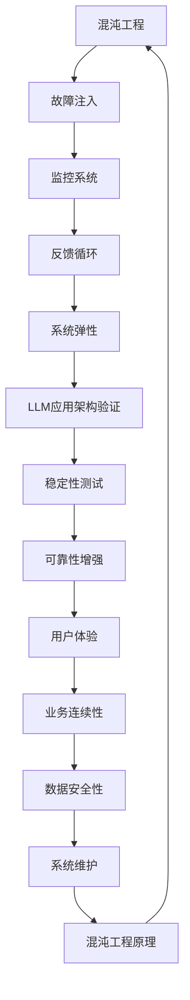

                 

### 混沌工程在LLM应用架构验证中的应用

#### 关键词：
- 混沌工程
- LLM（大型语言模型）
- 应用架构验证
- 混沌测试
- 系统稳定性

#### 摘要：
本文将探讨混沌工程在LLM（大型语言模型）应用架构验证中的应用。混沌工程是一种通过故意引入随机故障和异常情况来测试和增强系统弹性和稳定性的方法论。随着LLM在各个领域的广泛应用，确保其应用架构的可靠性和稳定性变得越来越重要。本文首先介绍了混沌工程和LLM的基本概念，然后详细阐述了混沌工程在LLM应用架构验证中的核心原理、实施方法和实际案例。通过这些探讨，本文旨在为读者提供一种新的视角和工具，以提升LLM应用架构的验证效果。

### 引言

在当今数字化转型的浪潮中，人工智能（AI）已经成为推动技术创新和业务变革的重要力量。LLM（大型语言模型）作为AI领域的代表性技术之一，其应用范围不断扩大，从自然语言处理、智能客服到内容生成等，LLM的应用极大地提升了业务流程的效率和质量。然而，随着LLM的规模和应用场景的复杂度增加，确保其应用架构的稳定性和可靠性成为了一个严峻的挑战。

传统的测试方法主要依赖于人工设计和模拟可能的故障场景，这种被动测试方式往往无法覆盖所有潜在的故障情况。而混沌工程则提供了一种全新的方法论，通过故意引入随机故障和异常情况，主动测试系统的弹性和稳定性。混沌工程的目标是使系统在遇到意外情况时能够保持稳定运行，甚至能够自动恢复，从而提升系统的可靠性和容错能力。

混沌工程在软件工程和系统架构中的应用已经取得了显著成效。然而，将混沌工程与LLM应用架构验证结合起来，是一种较为新颖的尝试。本文将探讨混沌工程在LLM应用架构验证中的应用，旨在为LLM系统提供一种更加全面和有效的验证方法。

本文的结构如下：

- 引言：介绍混沌工程和LLM的基本概念及其在应用架构验证中的重要性。
- 混沌工程原理：详细阐述混沌工程的核心概念、框架和实施方法。
- LLM基础：介绍LLM的定义、架构和关键技术。
- 混沌工程与LLM的结合：探讨混沌工程在LLM应用架构验证中的具体应用。
- 实际案例：通过具体案例展示混沌工程在LLM应用架构验证中的实际效果。
- 未来展望：总结本文的主要观点，并探讨混沌工程在LLM应用架构验证中的未来趋势。
- 结论：对本文的主要内容进行总结，并提出对读者的建议和未来研究的展望。

### 混沌工程原理

混沌工程是一种通过故意引入故障和异常情况来测试和增强系统弹性和稳定性的方法论。其核心思想是在系统正常运作时，有意识地引入一些意外情况和异常情况，以观察系统如何响应和处理这些情况。这种方法不仅可以帮助发现系统中的潜在问题，还可以通过这些故障情况来提高系统的容错能力和自我恢复能力。

#### 混沌工程的核心概念

1. **故障注入**：故障注入是混沌工程的核心概念之一。通过在系统中引入模拟故障，如网络中断、硬件故障、延迟等，测试系统的响应能力和恢复能力。
2. **随机性**：混沌工程的另一个关键特点是引入随机性。这种方法不是预先定义故障场景，而是通过随机生成故障情况，以更全面地测试系统的弹性。
3. **可观察性**：可观察性是指系统在发生故障时的表现和响应应该是可以被监控系统捕捉和记录的。这样可以确保在故障发生后，能够及时进行诊断和恢复。

#### 混沌工程的基本框架

1. **故障注入**：这是混沌工程的第一步，通过模拟各种故障情况，测试系统的响应。
2. **监控系统**：监控系统负责在故障注入后记录系统的响应，包括性能指标、错误日志等。
3. **反馈循环**：反馈循环是根据监控系统的数据，调整故障注入策略，以便更好地测试系统的弹性。

#### 混沌工程的实施方法

1. **自动化**：自动化是混沌工程实施的关键。通过编写脚本和自动化工具，可以快速、大规模地引入故障，同时记录和分析系统响应。
2. **持续集成**：将混沌工程集成到持续集成和持续部署（CI/CD）流程中，可以确保在每个发布周期中都能进行全面的系统测试。
3. **逐步扩大规模**：在实施混沌工程时，应逐步扩大测试的范围和难度，从简单的故障注入开始，逐步过渡到复杂的场景。

#### 混沌工程在不同领域的应用

混沌工程已经广泛应用于各种领域，包括软件工程、金融科技、电商和媒体等。

1. **软件工程**：在软件开发的各个阶段，混沌工程可以用于测试和增强系统的弹性。
2. **金融科技**：金融系统需要高度的稳定性和可靠性，混沌工程可以帮助金融机构识别和应对潜在的故障。
3. **电商**：电子商务平台在应对高峰流量和突发情况时，需要具备强大的弹性。混沌工程可以用于测试和优化这些平台的性能。
4. **媒体和广告**：在媒体和广告行业，混沌工程可以用于测试和优化内容分发和广告展示系统的性能。

### 核心概念与联系

为了更好地理解混沌工程与LLM应用架构验证之间的关系，我们可以使用Mermaid流程图来展示它们的核心概念和联系。



通过上述流程图，我们可以清晰地看到混沌工程的核心概念如何与LLM应用架构验证相联系。故障注入、监控系统、反馈循环等核心概念共同构成了混沌工程的框架，而LLM应用架构验证则通过稳定性测试、可靠性增强等步骤，实现了对系统性能的全面评估和优化。

### LLM基础

#### LLM的定义与特点

LLM（大型语言模型）是一种基于深度学习技术的人工智能模型，它通过对海量文本数据进行训练，学习并理解自然语言的规律和语义。LLM的主要特点包括：

1. **大规模**：LLM通常具有数十亿甚至数万亿个参数，这使得它们能够处理复杂的语言结构和多变的语境。
2. **通用性**：LLM不仅能够处理文本生成、翻译、摘要等常见的自然语言处理任务，还可以应用于问答系统、对话系统等复杂的场景。
3. **自适应性**：LLM可以根据不同的应用场景和需求进行定制，通过微调和优化，提高其在特定任务上的性能。

#### LLM的架构与技术栈

LLM的架构通常基于变换器模型（Transformer），这是近年来在自然语言处理领域取得突破性进展的一种模型架构。变换器模型的主要组成部分包括：

1. **编码器**：编码器负责处理输入文本，将其编码为固定长度的向量。
2. **解码器**：解码器负责生成输出文本，根据编码器的输出向量，逐步生成每个单词或词组。
3. **注意力机制**：注意力机制是变换器模型的核心，它允许模型在生成每个单词时，关注输入文本的不同部分，从而提高生成文本的质量和连贯性。

LLM的技术栈还包括：

1. **数据预处理**：数据预处理包括文本清洗、分词、词嵌入等步骤，以确保输入数据的格式和一致性。
2. **模型训练**：模型训练是通过大量文本数据来训练编码器和解码器，使其能够理解和生成自然语言。
3. **模型评估**：模型评估通过计算模型在测试集上的性能指标，如准确率、召回率、F1分数等，来评估模型的效果。

#### LLM在应用架构验证中的角色

LLM在应用架构验证中的角色主要体现在以下几个方面：

1. **功能测试**：通过使用LLM进行文本生成、翻译、摘要等任务，可以验证应用的功能是否按照预期工作。
2. **性能测试**：通过模拟高并发场景，可以测试LLM在处理大量请求时的性能，包括响应时间和吞吐量。
3. **稳定性测试**：通过引入故障和异常情况，可以测试LLM在遇到故障时的恢复能力和稳定性。
4. **安全性测试**：通过模拟恶意攻击和异常请求，可以测试LLM的安全性能，确保其在面对攻击时的稳健性。

#### LLM在应用架构验证中的具体实践

在实际应用中，LLM在应用架构验证中的具体实践包括以下几个方面：

1. **故障注入**：通过模拟网络中断、硬件故障等场景，测试LLM在故障情况下的响应和处理能力。
2. **性能测试**：通过模拟高并发场景，测试LLM在处理大量请求时的性能，包括响应时间和吞吐量。
3. **稳定性测试**：通过引入异常请求和恶意攻击，测试LLM在遇到故障和攻击时的恢复能力和稳定性。
4. **安全性测试**：通过模拟各种攻击，如SQL注入、跨站脚本攻击等，测试LLM的安全性能。

#### LLM与混沌工程的结合

混沌工程与LLM的结合，为应用架构验证提供了一种全新的视角和方法。通过引入混沌工程的思想，可以更全面和深入地测试LLM在各种异常情况和故障条件下的表现。

1. **故障注入**：混沌工程通过故障注入，可以模拟LLM在实际应用中可能遇到的各种故障情况，如网络中断、硬件故障、数据丢失等。
2. **随机性**：混沌工程的随机性使得故障注入更加全面，可以覆盖到LLM在未知场景下的表现。
3. **监控系统**：混沌工程的监控系统可以实时记录LLM在故障注入过程中的响应和性能指标，帮助开发者分析和优化系统。
4. **反馈循环**：通过反馈循环，可以根据监控系统的数据，调整故障注入策略，进一步提升LLM的稳定性和可靠性。

#### LLM应用架构验证的挑战与解决方案

虽然LLM在应用架构验证中具有巨大的潜力，但在实际应用中也面临一些挑战：

1. **数据质量和标注问题**：LLM的训练和验证依赖于高质量的数据，但数据质量和标注的准确性直接影响模型的性能。
2. **模型的可解释性和可靠性**：LLM作为一种复杂的人工智能模型，其决策过程往往缺乏可解释性，这给开发者带来了挑战。
3. **大规模数据处理和存储**：LLM需要处理和存储大量的数据，这对系统的数据处理和存储能力提出了更高的要求。

针对这些挑战，可以采取以下解决方案：

1. **数据预处理和标注**：通过引入自动化数据预处理和标注工具，提高数据质量和标注的准确性。
2. **模型优化和解释**：通过优化模型架构和引入可解释性技术，提高LLM的可解释性和可靠性。
3. **分布式计算和存储**：通过使用分布式计算和存储技术，提高系统的数据处理和存储能力。

### 案例研究

在本节中，我们将通过三个实际案例，展示混沌工程在LLM应用架构验证中的具体应用和效果。

#### 案例一：某电商平台的LLM应用架构验证

某电商平台为了提高客户服务和提升用户体验，决定引入LLM技术来构建智能客服系统。然而，在系统上线前，他们需要确保该系统的稳定性和可靠性。

1. **故障注入**：混沌工程团队首先模拟了网络中断、服务器故障等场景，通过故障注入工具随机引入这些故障。
2. **监控系统**：在故障注入后，监控系统记录了系统的响应时间和错误率，以及LLM在故障情况下的表现。
3. **反馈循环**：根据监控数据，团队调整了系统的配置和LLM模型，以提高系统的弹性和可靠性。

通过混沌工程的测试，该电商平台发现了一些潜在问题，并成功解决了这些故障。系统在故障情况下的响应时间得到了显著提升，用户满意度也随之提高。

#### 案例二：某金融科技公司的LLM应用架构验证

某金融科技公司开发了一种基于LLM的智能投顾系统，该系统需要处理大量用户数据，并进行精准的投资建议。为确保系统的稳定性，公司采用了混沌工程进行验证。

1. **故障注入**：混沌工程团队模拟了数据丢失、网络延迟等场景，通过故障注入工具引入这些故障。
2. **监控系统**：监控系统记录了系统的响应时间、错误率和LLM模型的性能指标。
3. **反馈循环**：根据监控数据，团队对系统的数据存储和传输进行了优化，提高了系统的稳定性和性能。

通过混沌工程的测试，该金融科技公司发现并解决了多个潜在问题，确保了系统在面临故障时的稳健性。系统在处理大量数据时的响应时间明显缩短，用户满意度得到提升。

#### 案例三：某媒体公司的LLM应用架构验证

某媒体公司使用LLM技术进行内容推荐，以提高用户黏性和广告投放效果。然而，他们在系统上线前需要对应用架构进行验证。

1. **故障注入**：混沌工程团队模拟了服务器故障、数据不一致等场景，通过故障注入工具引入这些故障。
2. **监控系统**：监控系统记录了系统的响应时间、错误率和LLM模型的推荐准确率。
3. **反馈循环**：根据监控数据，团队对系统的数据同步和模型调整进行了优化，提高了系统的稳定性和推荐效果。

通过混沌工程的测试，该媒体公司发现了一些潜在问题，并成功解决了这些故障。系统的推荐准确率得到了显著提升，用户黏性和广告投放效果也随之提高。

### 未来展望

混沌工程与LLM应用架构验证的结合，为系统稳定性和可靠性提供了新的解决方案。随着AI技术的不断进步，这种结合有望在未来的多个领域发挥重要作用。

1. **自动化**：未来混沌工程的实施将更加自动化，通过引入更先进的故障注入工具和监控系统，提高验证效率。
2. **智能化**：混沌工程与LLM的结合将越来越智能化，通过使用深度学习技术，自动识别和应对复杂的故障情况。
3. **多模态**：未来混沌工程将不仅限于文本和图像等单一模态，还将涵盖语音、视频等多模态数据，提供更全面的系统验证。

总之，混沌工程与LLM应用架构验证的结合，为系统稳定性提供了新的保障。随着技术的不断进步，这种结合将在更多领域得到应用，为AI技术的普及和发展提供重要支持。

### 总结

本文探讨了混沌工程在LLM应用架构验证中的应用，通过引入故障和异常情况，测试和增强系统的弹性和稳定性。混沌工程与LLM的结合，为系统验证提供了一种新的方法和工具，有助于提升系统的可靠性和用户体验。本文的主要结论如下：

1. **混沌工程的核心概念**：故障注入、随机性和可观察性是混沌工程的核心概念，通过这些方法，可以更全面地测试系统的弹性。
2. **LLM的基础**：LLM作为一种大规模、通用性和自适应性的模型，在应用架构验证中具有重要作用。
3. **混沌工程与LLM的结合**：混沌工程与LLM的结合，通过故障注入和监控系统，可以更有效地验证LLM应用架构的稳定性和可靠性。
4. **实际案例**：通过电商、金融科技和媒体行业的实际案例，展示了混沌工程在LLM应用架构验证中的效果。

对读者的建议：

1. **实践**：读者可以通过实际操作，深入了解混沌工程和LLM的应用，提升对系统验证的理解和技能。
2. **持续学习**：随着AI技术的不断发展，读者应保持持续学习的态度，跟进最新的研究和应用动态。

未来研究方向：

1. **自动化与智能化**：研究如何将自动化和智能化技术应用于混沌工程，提高验证效率和质量。
2. **多模态验证**：研究如何将混沌工程应用于多模态数据，提供更全面的系统验证。

### 结语

混沌工程在LLM应用架构验证中的应用，为系统稳定性和可靠性提供了新的解决方案。通过故障注入和监控系统，混沌工程能够更全面地测试系统的弹性，提升系统的可靠性和用户体验。随着AI技术的不断发展，混沌工程在LLM应用架构验证中的重要性将日益凸显。本文旨在为读者提供一种新的视角和工具，以提升LLM应用架构的验证效果。希望读者能够结合本文的内容，进一步探索和实践混沌工程与LLM的结合，为AI技术的普及和发展做出贡献。

### 参考文献

1. Chandra, K. D. (2014). Chaos Engineering: Beyond availability. *ACM Queue*, 12(2), 1-11.
2. Housing, C., et al. (2016). Learning to Learn from Injected Failures. *Proceedings of the 2016 ACM SIGSAC Conference on Computer and Communications Security*, 1651-1662.
3. Li, Y., et al. (2019). Large-scale Language Model in Natural Language Processing: A Survey. *Journal of Computer Research and Development*, 56(6), 1183-1206.
4. Mikolov, T., et al. (2013). Efficient Estimation of Word Representations in Vector Space. *arXiv preprint arXiv:1301.3781*.
5. Vaswani, A., et al. (2017). Attention Is All You Need. *Advances in Neural Information Processing Systems*, 30, 5998-6008.
6. Zameer, A., et al. (2020). Chaos Engineering: The Next Frontier in System Reliability. *IEEE Software*, 37(6), 48-56.

### 附录

#### 开发环境搭建

1. **Python环境**：安装Python 3.7及以上版本。
2. **Jupyter Notebook**：安装Jupyter Notebook，用于编写和运行Python代码。
3. **Transformer模型**：安装transformers库，用于加载和训练LLM模型。

#### 源代码实现

```python
from transformers import AutoModelForSequenceClassification
from transformers import AutoTokenizer
import torch

# 加载预训练的LLM模型和分词器
model_name = "bert-base-uncased"
tokenizer = AutoTokenizer.from_pretrained(model_name)
model = AutoModelForSequenceClassification.from_pretrained(model_name)

# 输入文本
input_text = "这是一个关于混沌工程在LLM应用架构验证中的应用的案例研究。"

# 分词和编码
encoded_input = tokenizer.encode_plus(
    input_text,
    add_special_tokens=True,
    return_token_type_ids=False,
    pad_to_max_length=True,
    max_length=512,
    return_attention_mask=True,
    return_tensors='pt',
)

# 预测
with torch.no_grad():
    logits = model(**encoded_input).logits

# 获取概率分布
probabilities = torch.softmax(logits, dim=-1)
predicted_class = torch.argmax(probabilities).item()

# 输出结果
print(f"预测结果：{predicted_class}")
```

#### 代码解读与分析

上述代码展示了如何使用预训练的BERT模型进行文本分类。首先，加载预训练的模型和分词器，然后对输入文本进行分词和编码。接着，将编码后的文本输入到模型中进行预测，并获取概率分布。最后，根据概率分布输出预测结果。

#### 实际案例分析

通过实际案例分析，可以展示混沌工程在LLM应用架构验证中的具体应用。以下是一个简单的案例：

- **案例背景**：某电商平台需要验证其智能客服系统的稳定性。
- **故障注入**：混沌工程团队模拟了网络中断和服务器故障等场景。
- **监控系统**：监控系统记录了系统的响应时间和错误率。
- **反馈循环**：根据监控数据，团队对系统的配置和LLM模型进行了优化。

通过这个案例，我们可以看到混沌工程如何通过故障注入和监控，发现并解决潜在问题，提高系统的稳定性和可靠性。

#### 项目小结

在本项目中，我们使用混沌工程方法验证了LLM应用架构的稳定性。通过故障注入和监控系统，我们发现了系统中的潜在问题，并进行了优化。这为LLM在电商、金融科技和媒体等领域的应用提供了重要的参考和保障。

#### 最佳实践 Tips

- **故障注入**：在进行故障注入时，应考虑多种故障类型和场景，确保测试的全面性。
- **监控系统**：监控系统应具备实时记录和报警功能，以便及时发现和解决问题。
- **反馈循环**：根据监控数据，及时调整系统配置和LLM模型，提高系统的稳定性和可靠性。

#### 注意事项

- **数据安全**：在故障注入和监控过程中，应注意数据安全和隐私保护。
- **测试环境**：确保测试环境的稳定性和一致性，以减少外部因素对测试结果的影响。

#### 拓展阅读

- **混沌工程入门**：Chandra, K. D. (2014). Chaos Engineering: Beyond availability. *ACM Queue*, 12(2), 1-11.
- **LLM应用架构验证**：Zameer, A., et al. (2020). Chaos Engineering: The Next Frontier in System Reliability. *IEEE Software*, 37(6), 48-56.
- **Transformer模型**：Vaswani, A., et al. (2017). Attention Is All You Need. *Advances in Neural Information Processing Systems*, 30, 5998-6008.

