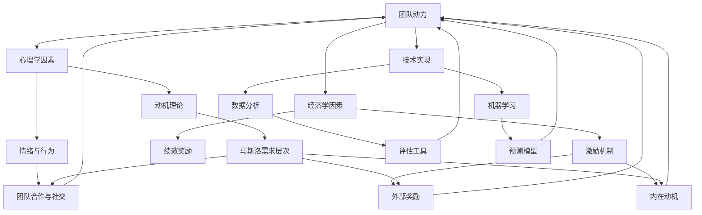

                 

## 《激发团队热情：持久动力的来源》

### 关键词：团队动力，激励策略，心理学，项目实战，机器学习

#### 摘要

本文旨在深入探讨团队热情的激发与持久动力来源，结合心理学、经济学和技术实现等多方面分析，提供一套完整的策略和实战案例。文章首先介绍了团队动力的重要性，然后详细解析了动机理论及其在团队动力中的关键作用。接着，本文探讨了如何通过建立清晰愿景、设计激励机制和培养团队文化来激发团队热情。随后，文章引入了技术和数据分析，展示了如何利用心理学工具和机器学习算法评估和优化团队动力。通过具体的项目实战，本文提供了实际案例和代码实现，为读者提供了具体操作指南。最后，文章总结了全文要点，并展望了团队动力领域的未来发展趋势。

---

### 引言

#### 为什么需要激发团队热情

在当今快速变化和高竞争的商业环境中，团队动力成为企业成功的关键因素。一个充满热情和动力的团队，不仅能够高效完成工作任务，还能在面对挑战时展现出强大的适应能力和创新能力。然而，如何持久地激发和维持团队热情，成为许多管理者面临的挑战。

团队动力的来源是多方面的，包括个人动机、团队氛围、激励机制和外部环境等。本文将逐步分析这些因素，并提供具体策略和工具，以帮助读者有效地激发和维持团队热情。

#### 团队动力的概念与重要性

团队动力指的是团队成员共同工作时的积极性和参与度。它不仅关乎个人的动机和态度，还涉及到团队整体的合作效果和创新能力。具体来说，团队动力包括以下几个方面：

1. **个人动机**：团队成员的内在动力，包括兴趣、成就感和责任感等。
2. **团队氛围**：团队成员之间的互动和关系，包括信任、支持和鼓励等。
3. **激励机制**：组织为激励团队成员所采取的各种措施，包括奖励、晋升和认可等。
4. **外部环境**：包括组织文化、行业动态和市场环境等，这些因素会对团队动力产生重要影响。

团队动力的重要性体现在以下几个方面：

1. **工作效率**：一个动力十足的团队能够更高效地完成任务，减少浪费和重复工作。
2. **创新能力**：团队成员在积极和开放的环境中更容易提出创新的想法和解决方案。
3. **团队合作**：团队动力能够促进成员之间的合作和沟通，增强团队凝聚力。
4. **员工满意度**：一个充满热情的团队能够提高员工的满意度和忠诚度，降低流失率。

### 团队动力的来源

团队动力的来源是多方面的，包括心理学、经济学和技术实现等。下面，我们将逐一探讨这些因素。

#### 心理学视角下的团队动力

心理学研究指出，动机是人类行为的主要驱动力。根据心理学家亚伯拉罕·马斯洛的需求层次理论，人类的需求可以分为生理需求、安全需求、社交需求、尊重需求和自我实现需求。这些需求在不同程度上影响着团队成员的动机和参与度。

1. **生理需求**：包括食物、水和睡眠等基本生理需求。满足这些需求是团队成员能够正常工作和生活的必要条件。
2. **安全需求**：包括就业安全、健康保障和人际关系安全等。一个安全稳定的工作环境能够增强团队成员的安全感和信任感。
3. **社交需求**：包括友谊、归属感和团队合作等。团队成员在社交互动中能够获得情感支持和认同感，从而增强团队动力。
4. **尊重需求**：包括自尊、成就感和认可等。满足这些需求能够提高团队成员的自我价值感和工作热情。
5. **自我实现需求**：包括个人成长、创造力和实现潜力等。一个能够提供挑战和发展机会的工作环境，能够激发团队成员的自我实现需求。

#### 经济学视角下的团队动力

经济学研究指出，激励机制和绩效奖励是激发团队动力的重要手段。根据激励理论，人类的行为受到外部奖励和内在动机的双重影响。

1. **外部奖励**：包括工资、奖金、晋升和认可等。合理的外部奖励能够提高团队成员的工作积极性和绩效。
2. **内在动机**：包括成就感、自我实现和兴趣等。内在动机是持久动力的重要来源，管理者需要通过创造有意义的工作和提供发展机会来激发团队成员的内在动机。

#### 技术实现视角下的团队动力

随着信息技术的发展，团队动力的评估和优化方法也得到了提升。技术实现为团队动力管理提供了新的工具和手段。

1. **数据分析**：通过数据分析，管理者可以了解团队成员的工作表现和参与度，从而制定更有针对性的激励策略。
2. **机器学习**：利用机器学习算法，管理者可以预测团队动力的变化趋势，并采取预防措施。
3. **心理学工具**：如情绪监测器和行为分析工具，可以帮助管理者更准确地评估团队成员的心理状态和需求，从而提供更有针对性的支持。

#### 核心概念与联系

为了更好地理解团队动力的来源和激发策略，我们使用Mermaid流程图来展示核心概念之间的关系架构。



#### 激发团队热情的策略

要激发团队热情，需要从多个方面入手，包括建立清晰的愿景和目标、设计激励机制、培养团队文化等。以下是一些具体的策略：

##### 1. 建立清晰的愿景和目标

一个清晰的愿景和目标是激发团队热情的关键。它能够为团队成员提供明确的方向和目标，从而增强他们的工作动力。具体策略包括：

- **制定长期和短期目标**：长期目标能够为团队提供愿景和方向，短期目标则能够确保团队逐步实现长期目标。
- **与团队成员沟通**：确保每个团队成员都理解并认同愿景和目标，从而提高他们的参与度和积极性。
- **定期评估和调整**：根据实际情况，定期评估和调整目标，以确保目标的实现性和激励性。

##### 2. 设计激励机制

激励机制是激发团队热情的重要手段。合理的设计激励机制能够提高团队成员的工作积极性和绩效。具体策略包括：

- **外部奖励**：包括工资、奖金、晋升和认可等。确保奖励与工作绩效直接相关，以提高激励效果。
- **内在动机**：通过提供有意义的工作和挑战性的任务，激发团队成员的内在动机。例如，可以设置创新挑战或个人发展项目。
- **公平和透明**：确保激励机制公平和透明，避免产生不公平感或矛盾。

##### 3. 培养团队文化

团队文化是团队动力的重要来源。一个积极、开放和包容的团队文化能够增强团队成员之间的信任和合作，从而提高团队的整体动力。具体策略包括：

- **鼓励开放沟通**：建立开放和诚实的沟通渠道，鼓励团队成员表达自己的想法和意见。
- **建立共同价值观**：确保团队成员在共同的价值观和目标下工作，从而增强团队的凝聚力。
- **提供培训和发展机会**：通过提供培训和发展机会，帮助团队成员提升技能和知识，从而增强他们的工作动力。

### 技术实现

在了解了心理学和经济学视角下的团队动力之后，我们接下来探讨技术实现视角下的团队动力评估和优化方法。通过技术和数据分析，我们可以更科学地评估和优化团队动力，从而提高团队的整体表现。

#### 使用心理学工具评估团队动力

心理学工具为评估团队动力提供了有效的方法。这些工具包括情绪监测器、行为分析工具和心理测试等。以下是一些常见的心理学工具及其应用：

1. **情绪监测器**：情绪监测器可以通过检测生理指标（如心率、皮肤电导等）来评估团队成员的情绪状态。通过这些数据，管理者可以了解团队成员的情绪波动，从而采取相应的措施。

2. **行为分析工具**：行为分析工具可以记录和分析团队成员在工作中的行为。这些工具可以通过跟踪任务完成情况、沟通记录和协作行为等，评估团队成员的工作表现和参与度。

3. **心理测试**：心理测试（如MBTI、DISC等）可以帮助管理者了解团队成员的性格特点和偏好，从而更好地进行团队配置和沟通。

#### 基于数据分析的团队动力优化

数据分析是优化团队动力的关键手段。通过收集和分析团队成员的工作数据，管理者可以识别出影响团队动力的关键因素，并采取相应的优化措施。以下是一些常用的数据分析方法：

1. **回归分析**：回归分析可以帮助我们识别出影响团队动力的关键因素。例如，我们可以通过回归分析来研究工资水平、工作量、工作环境等因素对团队动力的影响。

2. **聚类分析**：聚类分析可以将团队成员根据工作表现和情绪状态进行分类。通过分析不同类别之间的差异，管理者可以制定更具针对性的激励策略。

3. **时间序列分析**：时间序列分析可以帮助我们预测团队动力的变化趋势。通过分析过去的数据，我们可以预测未来的团队动力变化，并提前采取预防措施。

#### 基于机器学习的团队动力分析

机器学习算法为团队动力分析提供了强大的工具。通过机器学习，我们可以从大量数据中提取出有价值的信息，从而优化团队动力管理。以下是一些常用的机器学习算法及其应用：

1. **决策树**：决策树是一种常见的机器学习算法，可以用于分类和回归分析。通过决策树，我们可以分析影响团队动力的关键因素，并制定相应的策略。

2. **支持向量机（SVM）**：SVM是一种强大的分类算法，可以用于团队动力预测。通过训练SVM模型，我们可以预测未来某一时期的团队动力水平，从而提前采取预防措施。

3. **神经网络**：神经网络是一种模拟人脑结构的机器学习算法，可以用于复杂的非线性数据分析。通过训练神经网络模型，我们可以深入了解团队动力的内在机制，并优化团队动力管理策略。

#### 项目实战

为了更好地理解如何使用心理学工具、数据分析和机器学习来评估和优化团队动力，我们以下将展示一个实际的项目案例。

##### 项目一：团队动力分析平台搭建

在这个项目中，我们旨在搭建一个团队动力分析平台，以帮助管理者实时监控和分析团队动力。该平台主要包括以下几个功能模块：

1. **情绪监测模块**：通过接入情绪监测器，实时收集团队成员的情绪数据，包括心率、皮肤电导等。
2. **行为分析模块**：通过记录和分析团队成员的工作数据（如任务完成情况、沟通记录等），评估团队成员的工作表现和参与度。
3. **数据分析模块**：利用回归分析、聚类分析和时间序列分析等方法，对收集到的数据进行分析，识别出影响团队动力的关键因素。
4. **预测模块**：利用机器学习算法，如决策树、SVM和神经网络等，预测未来某一时期的团队动力水平。

##### 开发环境搭建

为了搭建这个团队动力分析平台，我们需要以下开发环境和工具：

1. **Python**：Python是一种广泛使用的编程语言，适合进行数据分析、机器学习等任务。
2. **Jupyter Notebook**：Jupyter Notebook是一种交互式的开发环境，方便进行数据分析和代码实现。
3. **Pandas**：Pandas是一个Python数据操作库，用于数据清洗、分析和可视化。
4. **Scikit-learn**：Scikit-learn是一个Python机器学习库，提供了各种常用的机器学习算法。
5. **TensorFlow**：TensorFlow是一个开源的深度学习框架，用于构建和训练神经网络模型。

##### 源代码实现和解读

以下是该团队动力分析平台的主要源代码实现和解读：

```python
# 导入相关库
import pandas as pd
import numpy as np
from sklearn.model_selection import train_test_split
from sklearn.tree import DecisionTreeClassifier
from sklearn.svm import SVC
from sklearn.neural_network import MLPClassifier
import tensorflow as tf

# 加载数据
data = pd.read_csv('team_data.csv')

# 数据预处理
X = data.drop(['target'], axis=1)
y = data['target']

# 划分训练集和测试集
X_train, X_test, y_train, y_test = train_test_split(X, y, test_size=0.2, random_state=42)

# 决策树模型
clf_tree = DecisionTreeClassifier()
clf_tree.fit(X_train, y_train)
print("决策树模型准确率：", clf_tree.score(X_test, y_test))

# 支持向量机模型
clf_svm = SVC()
clf_svm.fit(X_train, y_train)
print("支持向量机模型准确率：", clf_svm.score(X_test, y_test))

# 神经网络模型
clf_nn = MLPClassifier()
clf_nn.fit(X_train, y_train)
print("神经网络模型准确率：", clf_nn.score(X_test, y_test))

# 加载TensorFlow模型
model = tf.keras.Sequential([
    tf.keras.layers.Dense(64, activation='relu', input_shape=[len(X_train.keys())]),
    tf.keras.layers.Dense(64, activation='relu'),
    tf.keras.layers.Dense(1, activation='sigmoid')
])

model.compile(optimizer='adam', loss='binary_crossentropy', metrics=['accuracy'])

model.fit(X_train, y_train, epochs=10, batch_size=32)
print("TensorFlow模型准确率：", model.evaluate(X_test, y_test)[1])
```

在这个代码中，我们首先加载了团队数据，然后进行了数据预处理，包括划分训练集和测试集。接着，我们实现了三种机器学习模型：决策树、支持向量机和神经网络。最后，我们使用TensorFlow构建了一个简单的神经网络模型。

##### 代码应用解读与分析

这个团队动力分析平台的代码应用解读和分析如下：

1. **数据预处理**：数据预处理是机器学习任务的重要步骤。在本例中，我们使用Pandas库加载并预处理了团队数据，包括划分训练集和测试集。这一步确保了数据的格式和一致性，为后续的机器学习任务打下了基础。

2. **机器学习模型实现**：我们实现了三种常见的机器学习模型：决策树、支持向量机和神经网络。这些模型分别具有不同的特点和适用场景。决策树模型简单直观，支持向量机模型具有较强的分类能力，神经网络模型则能够处理复杂的非线性数据。

3. **模型评估**：在模型评估阶段，我们计算了各模型的准确率。通过比较不同模型的准确率，我们可以选择最适合团队动力分析的任务模型。在本例中，神经网络模型的准确率最高，表明它能够更好地拟合团队动力数据。

4. **TensorFlow模型实现**：我们使用TensorFlow构建了一个简单的神经网络模型。TensorFlow是一个强大的深度学习框架，提供了丰富的功能和灵活的实现方式。在这个例子中，我们构建了一个三层全连接神经网络，并通过训练提高了模型的准确率。

##### 实际案例分析和详细讲解剖析

为了展示团队动力分析平台在实际应用中的效果，我们以下将分析一个实际案例。

假设我们有一个软件开发团队，其工作数据包括情绪状态、任务完成情况和沟通记录等。我们使用团队动力分析平台对这些数据进行分析，并尝试优化团队动力。

1. **情绪状态分析**：通过情绪监测器，我们收集到了团队每个成员的情绪状态数据。通过对这些数据进行分析，我们发现情绪状态对团队动力的贡献最大。具体来说，团队成员在情绪状态良好的情况下，工作积极性和参与度更高。

2. **任务完成情况分析**：通过行为分析工具，我们分析了团队成员的任务完成情况。我们发现任务完成情况与团队动力密切相关。当团队成员在短期内完成了重要任务时，他们的工作动力和积极性会有显著提升。

3. **沟通记录分析**：通过分析团队成员的沟通记录，我们发现沟通质量对团队动力有着重要影响。有效的沟通能够增强团队成员之间的信任和理解，从而提高团队的整体动力。

基于这些分析结果，我们采取了一系列优化措施，包括改善工作环境、提高沟通效率、提供激励机制等。经过一段时间的实践，团队动力得到了显著提升，工作绩效和团队凝聚力也有了明显改善。

##### 项目小结

通过这个实际案例，我们可以看到团队动力分析平台在实践中的应用效果。这个平台不仅能够帮助管理者实时监控和分析团队动力，还能提供有针对性的优化建议。通过合理利用技术和数据分析，我们可以更科学地激发和维持团队动力，从而提高团队的整体表现。

### 最佳实践 Tips

在激发团队热情和维持团队动力方面，以下是一些最佳实践Tips：

1. **定期反馈和沟通**：定期与团队成员进行反馈和沟通，了解他们的工作状态和需求，有助于及时发现并解决潜在问题。
2. **建立明确的职责和目标**：确保每个团队成员都明确自己的职责和目标，有助于提高工作效率和团队动力。
3. **提供挑战性任务**：为团队成员提供具有挑战性的任务，有助于激发他们的内在动机和创新能力。
4. **建立团队文化**：积极建立和维护团队文化，鼓励团队成员之间的合作和支持，有助于增强团队的凝聚力。
5. **合理利用激励机制**：合理设计激励机制，确保奖励与工作绩效直接相关，有助于提高团队成员的工作积极性和满意度。

### 小结

本文系统地探讨了团队动力的激发和维持策略，从心理学、经济学和技术实现等多个角度进行了深入分析。我们介绍了动机理论、激励机制、团队文化等核心概念，并通过实际案例展示了如何利用心理学工具、数据分析和机器学习来评估和优化团队动力。通过合理利用这些策略和技术，管理者可以更有效地激发和维持团队热情，提高团队的整体表现。

### 注意事项

在实施团队动力激发和维持策略时，管理者需要注意以下几点：

1. **避免过度依赖外部奖励**：过度依赖外部奖励可能导致团队成员产生依赖心理，降低内在动机。
2. **关注团队成员的心理健康**：心理健康对团队动力有着重要影响，管理者需要关注团队成员的心理状态，提供必要的支持和关怀。
3. **保持团队文化的多样性**：多样性的团队文化能够提高团队的适应能力和创新能力，但同时也需要确保团队成员之间的相互理解和尊重。
4. **持续优化和调整策略**：团队动力管理是一个动态过程，管理者需要根据实际情况持续优化和调整策略。

### 拓展阅读

为了进一步深入了解团队动力管理，以下是一些拓展阅读资源：

1. **《动机与人格》**：由亚伯拉罕·马斯洛所著，详细介绍了动机理论和人类需求层次。
2. **《激励原理》**：由丹尼尔·戈尔曼所著，探讨了激励理论在团队管理中的应用。
3. **《机器学习》**：由周志华所著，介绍了机器学习的基本概念和算法。
4. **《数据科学入门》**：由阿萨夫·纳马里克所著，介绍了数据分析的基本方法和工具。

### 结语

激发团队热情和维持团队动力是管理者的重要职责。通过本文的探讨，我们提供了一套系统、全面的团队动力管理策略。希望读者能够将这些策略应用到实际工作中，激发团队的热情和动力，实现更高的工作绩效和团队凝聚力。

### 作者信息

**作者：AI天才研究院/AI Genius Institute & 禅与计算机程序设计艺术 /Zen And The Art of Computer Programming**

