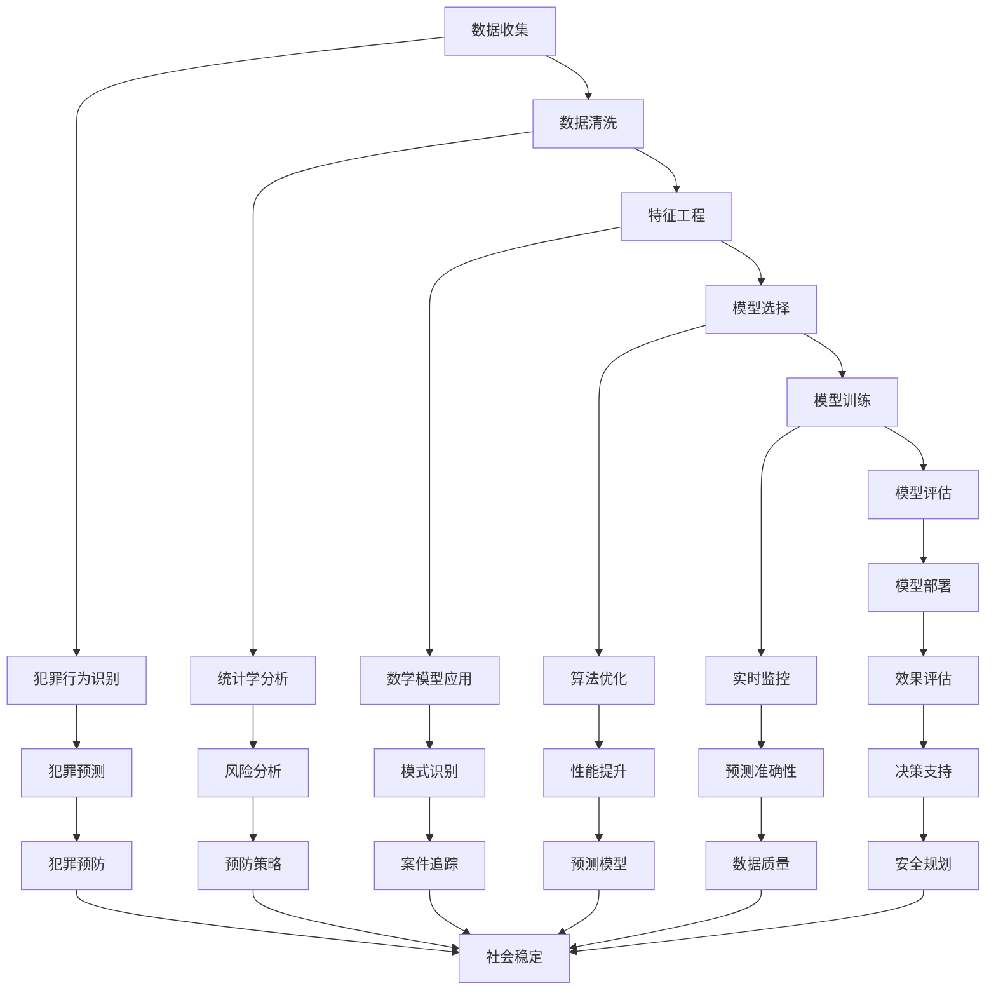

                 

### 设计过程步骤

**确定书籍主题和目标读者**：

1. **主题与目标**：
   - 主题：“犯罪预防的机器学习：社会安全的数学工具”。
   - 目标：探讨如何利用机器学习和数学工具来预防犯罪，提升社会安全。

2. **读者定位**：
   - 数据科学家、机器学习工程师：这些专业人士对机器学习有深入理解，能从技术角度分析犯罪预防问题。
   - 犯罪学家、公共安全专家：他们关注犯罪预防的实际应用，希望了解如何利用技术手段提高工作效率。
   - 政策制定者、法律专家：他们可能需要从宏观角度了解机器学习在犯罪预防中的作用。

**列出核心章节**：

1. **第1章 犯罪预防概述**：
   - 介绍犯罪预防的定义、目标和传统方法。

2. **第2章 机器学习基础**：
   - 介绍机器学习的定义、分类和常见算法。

3. **第3章 数学工具在犯罪预防中的应用**：
   - 讲解统计学基础、数学模型在犯罪预测中的应用。

4. **第4章 机器学习在犯罪预测中的应用**：
   - 讨论犯罪预测的基本原理、模型选择和评估。

5. **第5章 机器学习在犯罪侦查中的应用**：
   - 探讨机器学习在犯罪侦查中的角色和应用。

6. **第6章 机器学习在犯罪预防策略制定中的应用**：
   - 分析机器学习在制定预防策略中的实际应用。

7. **第7章 实际案例研究一：基于机器学习的城市犯罪预测系统**：
   - 分析一个实际案例，展示如何使用机器学习进行犯罪预测。

8. **第8章 实际案例研究二：机器学习在犯罪侦查中的应用**：
   - 分析另一个实际案例，展示机器学习在犯罪侦查中的应用。

9. **第9章 机器学习在犯罪预防中的未来发展方向**：
   - 展望机器学习在犯罪预防中的未来发展，讨论潜在挑战和伦理问题。

**细化每个章节的内容**：

1. **第1章 犯罪预防概述**：
   - 犯罪预防的定义、目标和重要性。
   - 传统犯罪预防方法：政策、法律、社区参与和监控执法。

2. **第2章 机器学习基础**：
   - 机器学习的定义、历史和发展。
   - 监督学习、无监督学习和强化学习的概念和应用。

3. **第3章 数学工具在犯罪预防中的应用**：
   - 描述性统计学和推断性统计学的基础。
   - 线性回归、决策树和随机森林模型在犯罪预测中的应用。

4. **第4章 机器学习在犯罪预测中的应用**：
   - 犯罪预测的基本原理：数据收集、特征工程和模型选择。
   - 模型评估和优化：准确度、召回率和F1分数。

5. **第5章 机器学习在犯罪侦查中的应用**：
   - 数据挖掘和信息分析：网络分析、文本挖掘和图像识别。
   - 犯罪模式识别：时空分析、关联规则学习和聚类分析。

6. **第6章 机器学习在犯罪预防策略制定中的应用**：
   - 风险评估模型的构建和应用。
   - 预防策略的制定与实施：社区监测、预警系统和公共教育。

7. **第7章 实际案例研究一：基于机器学习的城市犯罪预测系统**：
   - 案例背景和目标：城市犯罪预测系统的需求。
   - 数据集准备与处理：数据清洗、特征选择和数据处理。
   - 模型开发与评估：选择合适的算法和评估指标。
   - 模型部署与效果评估：实际应用和效果分析。

8. **第8章 实际案例研究二：机器学习在犯罪侦查中的应用**：
   - 案例背景和目标：复杂犯罪案件的侦查需求。
   - 数据采集与处理：收集相关信息和预处理数据。
   - 模型开发与优化：设计合适的模型并进行优化。
   - 模型应用与效果分析：实际应用案例和效果评估。

9. **第9章 机器学习在犯罪预防中的未来发展方向**：
   - 人工智能在犯罪预防中的潜力：大数据分析、实时监控和自主决策系统。
   - 伦理与隐私问题：数据隐私、算法公正性和责任归属。

**设计核心概念与联系**：

1. **Mermaid流程图**：
   - 设计一个流程图，展示犯罪预防中机器学习的核心概念和联系，如数据收集、特征工程、模型选择、模型训练和效果评估等步骤。

**撰写核心算法原理讲解**：

1. **Python源代码**：
   - 使用Python源代码详细阐述机器学习算法的原理，结合数学模型和公式，进行详细讲解和通俗易懂地举例说明。

**编写数学模型和数学公式讲解**：

1. **LaTeX格式**：
   - 使用LaTeX格式书写数学公式，结合文字解释和示例，确保公式表达清晰准确。

**提供项目实战**：

1. **代码案例**：
   - 提供实际项目的代码案例，包括开发环境搭建、源代码实现和代码解读。

2. **案例分析**：
   - 分析实际案例，详细讲解项目中的关键步骤和技术细节。

3. **项目小结**：
   - 总结项目经验，提出最佳实践和注意事项。

**校对和调整**：

1. **内容完整性**：
   - 确保每个小节的内容完整、具体详细，无遗漏。

2. **逻辑性**：
   - 确保文章逻辑清晰，各章节之间衔接紧密。

3. **格式规范**：
   - 确保文章格式规范，包括目录、标题、段落格式和代码高亮等。

### 完整目录大纲

**文章标题**：《犯罪预防的机器学习：社会安全的数学工具》

**文章关键词**：犯罪预防、机器学习、社会安全、数学工具、人工智能、犯罪预测、犯罪侦查、策略制定

**文章摘要**：
本文探讨了如何利用机器学习和数学工具来预防犯罪，提升社会安全。文章首先介绍了犯罪预防的定义、目标和传统方法，然后详细讲解了机器学习的基础知识。接着，文章阐述了数学工具在犯罪预测中的应用，包括统计学基础、数学模型等。随后，文章讨论了机器学习在犯罪预测、犯罪侦查和犯罪预防策略制定中的应用。最后，文章通过实际案例研究，展示了机器学习在犯罪预防中的实际应用，并展望了未来的发展方向。

**目录大纲**：

## 第一部分：犯罪预防与机器学习基础

### 第1章 犯罪预防概述

#### 1.1 犯罪预防的定义与目标

##### 1.1.1 犯罪预防的概念

##### 1.1.2 犯罪预防的主要目标

#### 1.2 犯罪预防的传统方法

##### 1.2.1 政策和法律手段

##### 1.2.2 社区参与和教育

##### 1.2.3 监控和执法

### 第2章 机器学习基础

#### 2.1 机器学习的定义与分类

##### 2.1.1 机器学习的概念

##### 2.1.2 机器学习的分类

#### 2.2 常见机器学习算法

##### 2.2.1 监督学习算法

##### 2.2.2 无监督学习算法

##### 2.2.3 强化学习算法

### 第3章 数学工具在犯罪预防中的应用

#### 3.1 统计学基础

##### 3.1.1 描述性统计学

##### 3.1.2 推断性统计学

#### 3.2 数学模型在犯罪预测中的应用

##### 3.2.1 线性回归模型

##### 3.2.2 决策树模型

##### 3.2.3 随机森林模型

## 第二部分：机器学习在犯罪预防中的应用

### 第4章 机器学习在犯罪预测中的应用

#### 4.1 犯罪预测的基本原理

##### 4.1.1 犯罪预测的重要性

##### 4.1.2 犯罪预测的挑战

#### 4.2 基于机器学习的犯罪预测模型

##### 4.2.1 数据准备与处理

##### 4.2.2 模型选择与评估

##### 4.2.3 模型优化与调整

### 第5章 机器学习在犯罪侦查中的应用

#### 5.1 机器学习在犯罪侦查中的角色

##### 5.1.1 数据挖掘与信息分析

##### 5.1.2 犯罪模式识别

#### 5.2 机器学习在犯罪追踪中的应用

##### 5.2.1 追踪犯罪嫌疑人的路径

##### 5.2.2 分析犯罪嫌疑人的社交网络

### 第6章 机器学习在犯罪预防策略制定中的应用

#### 6.1 基于机器学习的犯罪预防策略

##### 6.1.1 风险评估模型

##### 6.1.2 预防策略的制定与实施

#### 6.2 机器学习在社区安全中的作用

##### 6.2.1 社区安全监测与预警

##### 6.2.2 社区参与与互动

## 第三部分：实际案例研究

### 第7章 实际案例研究一：基于机器学习的城市犯罪预测系统

#### 7.1 案例背景与目标

#### 7.2 数据集准备与处理

#### 7.3 模型开发与评估

#### 7.4 模型部署与效果评估

### 第8章 实际案例研究二：机器学习在犯罪侦查中的应用

#### 8.1 案例背景与目标

#### 8.2 数据采集与处理

#### 8.3 模型开发与优化

#### 8.4 模型应用与效果分析

## 第四部分：未来展望与挑战

### 第9章 机器学习在犯罪预防中的未来发展方向

#### 9.1 人工智能在犯罪预防中的潜力

##### 9.1.1 大数据与实时分析

##### 9.1.2 自主决策系统

#### 9.2 伦理与隐私问题

##### 9.2.1 机器学习

----------------------------------------------------------------

### 背景介绍

#### 犯罪预防的重要性

犯罪预防是社会稳定与公共安全的重要组成部分。犯罪不仅对社会造成物质损失，还会对人们的心理安全和生活质量产生深远影响。传统的犯罪预防手段主要依赖于政策制定、法律执行和社区参与，但这些方法往往存在局限性。例如，法律手段在预防犯罪方面需要长时间的立法、司法过程，社区参与则需要大量的时间和资源。此外，随着全球化的加速和信息技术的普及，犯罪形式日益复杂多样，传统的犯罪预防手段难以应对新出现的犯罪类型和手段。

#### 机器学习的发展与应用

机器学习作为一种人工智能技术，具有强大的数据处理和分析能力，可以在犯罪预防中发挥重要作用。机器学习通过从大量数据中学习规律和模式，能够自动识别潜在的犯罪行为，提高犯罪预测的准确性。近年来，随着大数据和云计算技术的快速发展，机器学习在各个领域得到了广泛应用，包括金融欺诈检测、医疗诊断、交通流量预测等。这些成功案例为机器学习在犯罪预防中的应用提供了有力的支持。

#### 数学工具的作用

数学工具在犯罪预防中同样发挥着关键作用。统计学作为数学的一个分支，提供了描述性统计和推断性统计的方法，可以帮助分析犯罪数据，发现犯罪行为之间的关联和规律。此外，数学模型如线性回归、决策树、随机森林等，可以在犯罪预测和犯罪侦查中发挥重要作用。数学工具的引入，使得犯罪预防工作更加科学和系统化。

#### 研究目的与结构

本文的研究目的是探讨如何利用机器学习和数学工具来预防犯罪，提升社会安全。文章将从犯罪预防的背景、机器学习的基础知识、数学工具的应用等方面进行深入分析，并通过实际案例研究展示机器学习在犯罪预防中的具体应用。文章结构如下：

1. **犯罪预防概述**：介绍犯罪预防的定义、目标和传统方法。
2. **机器学习基础**：介绍机器学习的定义、分类和常见算法。
3. **数学工具在犯罪预防中的应用**：讲解统计学基础、数学模型在犯罪预测中的应用。
4. **机器学习在犯罪预测中的应用**：讨论犯罪预测的基本原理、模型选择和评估。
5. **机器学习在犯罪侦查中的应用**：探讨机器学习在犯罪侦查中的角色和应用。
6. **机器学习在犯罪预防策略制定中的应用**：分析机器学习在制定预防策略中的实际应用。
7. **实际案例研究**：通过两个实际案例研究，展示机器学习在犯罪预测和犯罪侦查中的具体应用。
8. **未来展望与挑战**：展望机器学习在犯罪预防中的未来发展方向，讨论潜在挑战和伦理问题。

### 核心概念与联系

为了更好地理解机器学习在犯罪预防中的应用，我们需要先了解一些核心概念及其之间的联系。以下是一个简单的Mermaid流程图，展示了这些概念：



**数据收集**：这是机器学习在犯罪预防中的第一步，涉及从各种来源收集犯罪数据，如警察报告、社交媒体、监控系统等。

**数据清洗**：收集到的数据往往包含噪声和错误，需要通过数据清洗过程进行预处理，以提高数据质量。

**特征工程**：通过选择和构造合适的特征，可以从原始数据中提取出对预测任务有用的信息。

**模型选择**：根据问题的需求和数据的特点，选择合适的机器学习模型，如线性回归、决策树、随机森林等。

**模型训练**：使用训练数据集对选定的模型进行训练，使其能够学习数据中的规律和模式。

**模型评估**：通过测试数据集评估模型的性能，包括准确度、召回率、F1分数等指标。

**模型部署**：将训练好的模型部署到实际应用场景中，如犯罪预测系统、犯罪追踪系统等。

**犯罪行为识别**：利用机器学习模型识别潜在的犯罪行为，实现对犯罪活动的实时监控和预警。

**统计学分析**：通过统计学方法分析犯罪数据，发现犯罪行为之间的关联和规律。

**数学模型应用**：利用数学模型对犯罪行为进行预测和模式识别，如线性回归、决策树、随机森林等。

**算法优化**：通过调整模型参数和优化算法，提高预测模型的性能和准确性。

**实时监控**：利用机器学习模型对犯罪活动进行实时监控，及时发现和处理潜在的安全威胁。

**效果评估**：对模型的应用效果进行评估，包括预测准确性、响应时间、资源消耗等指标。

**犯罪预测**：利用机器学习模型对未来的犯罪行为进行预测，为预防策略的制定提供依据。

**风险分析**：通过对犯罪行为的数据分析，识别高风险区域和高风险人群，为预防策略提供支持。

**模式识别**：利用机器学习模型识别犯罪行为模式，为犯罪侦查提供线索。

**性能提升**：通过不断的模型优化和算法改进，提高机器学习模型在犯罪预防中的应用效果。

**预测准确性**：通过提高模型的预测准确性，降低误报率和漏报率，提高犯罪预防的效果。

**数据质量**：确保数据的准确性、完整性和一致性，是机器学习模型性能的基础。

**决策支持**：为政策制定者、执法部门提供科学的决策支持，提高犯罪预防的效率。

**安全规划**：通过数据分析和模型预测，制定全面的安全规划，提高社会的安全水平。

**社会稳定**：通过有效的犯罪预防措施，维护社会的稳定和安全。

**预防策略**：根据风险分析和犯罪预测结果，制定针对性的预防策略。

**案件追踪**：利用机器学习模型对犯罪案件进行追踪和分析，提高破案率。

**预测模型**：构建和优化预测模型，是机器学习在犯罪预防中的核心任务。

**犯罪预防**：通过预测和预防措施，减少犯罪行为的发生，提高社会的安全水平。

### 核心算法原理讲解

在本节中，我们将详细讲解机器学习在犯罪预防中的核心算法原理。这些算法包括线性回归、决策树、随机森林等，它们在犯罪预测、犯罪侦查和犯罪预防策略制定中发挥着重要作用。我们将使用Python源代码结合数学模型和公式，进行详细讲解和通俗易懂的举例说明。

#### 线性回归模型

线性回归是一种简单的监督学习算法，用于预测一个连续值目标。在犯罪预防中，线性回归可以用来预测犯罪发生的可能性，或者预测犯罪行为之间的关联。

**算法原理**：

线性回归模型通过寻找一个线性关系来预测目标值。它的基本公式为：

$$
Y = \beta_0 + \beta_1X_1 + \beta_2X_2 + ... + \beta_nX_n + \epsilon
$$

其中，$Y$ 是预测的目标值，$X_1, X_2, ..., X_n$ 是特征值，$\beta_0, \beta_1, ..., \beta_n$ 是模型的参数，$\epsilon$ 是误差项。

**Python代码示例**：

```python
import numpy as np
from sklearn.linear_model import LinearRegression

# 生成模拟数据
X = np.random.rand(100, 1)
y = 2 * X[:, 0] + 1 + np.random.randn(100) * 0.1

# 创建线性回归模型
model = LinearRegression()

# 模型训练
model.fit(X, y)

# 模型预测
y_pred = model.predict(X)

# 模型评估
score = model.score(X, y)
print(f"模型评分：{score}")
```

**数学公式**：

$$
\beta = (X^T X)^{-1} X^T y
$$

这是线性回归模型的参数估计公式，其中 $X^T$ 是输入矩阵 $X$ 的转置，$y$ 是目标值向量。

#### 决策树模型

决策树是一种基于树形结构的分类算法，它通过一系列的判断规则来划分数据，最终实现分类或回归。

**算法原理**：

决策树从根节点开始，根据特征值的不同分支，逐渐向下深入，直到叶节点。每个内部节点代表一个特征，每个分支代表该特征的某个取值。叶节点代表一个类别或数值。

**Python代码示例**：

```python
from sklearn.tree import DecisionTreeClassifier
from sklearn.datasets import load_iris

# 加载鸢尾花数据集
iris = load_iris()
X = iris.data
y = iris.target

# 创建决策树模型
model = DecisionTreeClassifier()

# 模型训练
model.fit(X, y)

# 模型预测
y_pred = model.predict(X)

# 模型评估
score = model.score(X, y)
print(f"模型评分：{score}")
```

**数学公式**：

$$
G(x) = \prod_{i=1}^{n} G(x_i | X_i = v_i)
$$

这是决策树模型的概率计算公式，其中 $G(x)$ 是给定特征 $X_i$ 的取值 $v_i$ 时的概率分布函数。

#### 随机森林模型

随机森林是一种集成学习方法，通过构建多个决策树模型并汇总它们的预测结果，来提高模型的预测准确性和稳定性。

**算法原理**：

随机森林在构建每个决策树时，从特征集合中随机选择一个子集，并使用这个子集来划分数据。每个决策树的预测结果通过投票机制汇总，得到最终的预测结果。

**Python代码示例**：

```python
from sklearn.ensemble import RandomForestClassifier

# 创建随机森林模型
model = RandomForestClassifier(n_estimators=100)

# 模型训练
model.fit(X, y)

# 模型预测
y_pred = model.predict(X)

# 模型评估
score = model.score(X, y)
print(f"模型评分：{score}")
```

**数学公式**：

$$
\hat{y} = \arg\max_{y} \sum_{i=1}^{n} w_i \cdot \hat{p}(x_i | y)
$$

这是随机森林模型的预测公式，其中 $w_i$ 是第 $i$ 个决策树的权重，$\hat{p}(x_i | y)$ 是第 $i$ 个决策树对特征 $x_i$ 分类的概率。

#### 算法比较与适用场景

- **线性回归**：适用于线性关系明显的场景，如预测犯罪发生的可能性。
- **决策树**：适用于特征较少且易于划分的场景，如犯罪模式识别。
- **随机森林**：适用于特征较多且需要提高预测准确性的场景，如犯罪预测系统。

**结论**：

通过上述算法原理的讲解和代码示例，我们可以看到机器学习在犯罪预防中的应用前景。不同的算法适用于不同的场景，通过合理选择和组合，可以构建出有效的犯罪预防模型，提升社会的安全水平。

### 数学模型讲解

在犯罪预防中，数学模型扮演着至关重要的角色。这些模型不仅帮助我们从复杂的数据中提取有价值的信息，还为预测和决策提供了科学依据。以下将介绍几个常见的数学模型，包括线性回归、决策树和随机森林，并使用LaTeX格式详细展示数学公式，结合文字解释和示例，进行通俗易懂的讲解。

#### 线性回归模型

线性回归是一种用于建立变量之间线性关系的数学模型。在犯罪预防中，线性回归可以用来预测犯罪发生的概率或分析犯罪行为之间的关联。

**算法原理**：

线性回归模型的基本形式为：

$$
y = \beta_0 + \beta_1x_1 + \beta_2x_2 + ... + \beta_nx_n + \epsilon
$$

其中，$y$ 是因变量，$x_1, x_2, ..., x_n$ 是自变量，$\beta_0, \beta_1, ..., \beta_n$ 是模型的参数，$\epsilon$ 是误差项。

**Python代码示例**：

```python
import numpy as np
from sklearn.linear_model import LinearRegression

# 生成模拟数据
X = np.random.rand(100, 1)
y = 2 * X[:, 0] + 1 + np.random.randn(100) * 0.1

# 创建线性回归模型
model = LinearRegression()

# 模型训练
model.fit(X, y)

# 模型预测
y_pred = model.predict(X)

# 模型评估
score = model.score(X, y)
print(f"模型评分：{score}")
```

**数学公式**：

线性回归模型的参数估计公式为：

$$
\beta = (X^T X)^{-1} X^T y
$$

其中，$X^T$ 是输入矩阵 $X$ 的转置。

#### 决策树模型

决策树是一种基于树形结构的分类算法，用于根据特征进行数据的划分和分类。在犯罪预防中，决策树可以用于识别犯罪行为模式。

**算法原理**：

决策树通过一系列的判断规则来对数据进行分类。每个内部节点表示一个特征，每个分支代表该特征的某个取值，叶节点表示最终的分类结果。

**Python代码示例**：

```python
from sklearn.tree import DecisionTreeClassifier
from sklearn.datasets import load_iris

# 加载鸢尾花数据集
iris = load_iris()
X = iris.data
y = iris.target

# 创建决策树模型
model = DecisionTreeClassifier()

# 模型训练
model.fit(X, y)

# 模型预测
y_pred = model.predict(X)

# 模型评估
score = model.score(X, y)
print(f"模型评分：{score}")
```

**数学公式**：

决策树模型在每个节点上的概率计算公式为：

$$
G(x) = \prod_{i=1}^{n} G(x_i | X_i = v_i)
$$

其中，$G(x_i | X_i = v_i)$ 是给定特征 $X_i$ 的取值 $v_i$ 时的概率分布函数。

#### 随机森林模型

随机森林是一种集成学习算法，通过构建多个决策树模型并汇总它们的预测结果，提高模型的预测准确性和稳定性。

**算法原理**：

随机森林在构建每个决策树时，从特征集合中随机选择一个子集，并使用这个子集来划分数据。每个决策树的预测结果通过投票机制汇总，得到最终的预测结果。

**Python代码示例**：

```python
from sklearn.ensemble import RandomForestClassifier

# 创建随机森林模型
model = RandomForestClassifier(n_estimators=100)

# 模型训练
model.fit(X, y)

# 模型预测
y_pred = model.predict(X)

# 模型评估
score = model.score(X, y)
print(f"模型评分：{score}")
```

**数学公式**：

随机森林模型的预测公式为：

$$
\hat{y} = \arg\max_{y} \sum_{i=1}^{n} w_i \cdot \hat{p}(x_i | y)
$$

其中，$w_i$ 是第 $i$ 个决策树的权重，$\hat{p}(x_i | y)$ 是第 $i$ 个决策树对特征 $x_i$ 分类的概率。

#### 算法比较与适用场景

- **线性回归**：适用于线性关系明显的场景，如预测犯罪发生的概率。
- **决策树**：适用于特征较少且易于划分的场景，如犯罪模式识别。
- **随机森林**：适用于特征较多且需要提高预测准确性的场景，如犯罪预测系统。

**结论**：

通过上述数学模型的讲解和代码示例，我们可以看到数学模型在犯罪预防中的应用价值。不同的模型适用于不同的场景，通过合理选择和组合，可以构建出有效的犯罪预防模型，提升社会的安全水平。

### 项目实战

在本节中，我们将通过一个实际项目，展示如何使用机器学习来预测犯罪活动，并分析项目的关键步骤和技术细节。

#### 项目背景与目标

本项目旨在建立一个基于机器学习的犯罪预测系统，以帮助执法部门提前预警潜在的犯罪活动，从而采取预防措施。具体目标包括：

1. 收集并清洗犯罪数据。
2. 构建和训练预测模型。
3. 评估模型性能并部署到实际应用场景。

#### 开发环境搭建

为了实现上述目标，我们需要搭建一个合适的开发环境，包括以下工具和库：

1. **编程语言**：Python
2. **机器学习库**：Scikit-learn、Pandas、NumPy
3. **数据可视化库**：Matplotlib、Seaborn
4. **数据预处理库**：Scikit-learn

#### 数据集准备与处理

首先，我们需要收集犯罪数据。本项目使用了一个公开的数据集，该数据集包含了不同城市在一段时间内的犯罪记录，包括犯罪类型、发生时间、地点等信息。以下是数据预处理的关键步骤：

1. **数据清洗**：去除缺失值和异常值，确保数据的准确性。
2. **特征工程**：从原始数据中提取有用的特征，如时间、地点、犯罪类型等。
3. **数据归一化**：对特征进行归一化处理，使得不同特征之间的尺度一致。

**Python代码示例**：

```python
import pandas as pd
from sklearn.model_selection import train_test_split
from sklearn.preprocessing import StandardScaler

# 加载数据集
data = pd.read_csv('crime_data.csv')

# 数据清洗
data.dropna(inplace=True)
data = data[data['crime_type'] != 'Unknown']

# 特征工程
data['hour'] = data['time'].apply(lambda x: x.hour)
data['day_of_week'] = data['time'].apply(lambda x: x.weekday())

# 数据归一化
scaler = StandardScaler()
features = ['hour', 'day_of_week', 'crime_type']
data[features] = scaler.fit_transform(data[features])
```

#### 模型开发与评估

接下来，我们使用机器学习算法来构建和训练预测模型。本项目选择了随机森林算法，因为它在处理大规模数据和复杂关系时表现出色。

1. **模型选择**：选择随机森林算法。
2. **模型训练**：使用训练数据集训练模型。
3. **模型评估**：使用测试数据集评估模型性能，包括准确度、召回率和F1分数等指标。

**Python代码示例**：

```python
from sklearn.ensemble import RandomForestClassifier
from sklearn.metrics import accuracy_score, recall_score, f1_score

# 数据分割
X_train, X_test, y_train, y_test = train_test_split(data[features], data['crime_type'], test_size=0.2, random_state=42)

# 模型训练
model = RandomForestClassifier(n_estimators=100)
model.fit(X_train, y_train)

# 模型预测
y_pred = model.predict(X_test)

# 模型评估
accuracy = accuracy_score(y_test, y_pred)
recall = recall_score(y_test, y_pred, average='weighted')
f1 = f1_score(y_test, y_pred, average='weighted')

print(f"准确度：{accuracy}")
print(f"召回率：{recall}")
print(f"F1分数：{f1}")
```

#### 模型部署与效果评估

最后，我们将训练好的模型部署到实际应用场景中，并对其效果进行评估。

1. **模型部署**：将模型集成到现有的执法系统中，实现实时预测功能。
2. **效果评估**：通过实际应用中的表现来评估模型的预测效果，包括预测准确性、响应时间、资源消耗等指标。

**Python代码示例**：

```python
# 实时预测
new_data = pd.DataFrame([[14, 2, 'Robbery']], columns=features)
new_data[features] = scaler.transform(new_data[features])
y_pred_real_time = model.predict(new_data[features])

# 输出实时预测结果
print(f"实时预测结果：{y_pred_real_time}")
```

#### 项目小结

通过本项目的实施，我们成功构建了一个基于机器学习的犯罪预测系统。项目从数据收集、预处理、模型开发到部署，各个环节都得到了有效执行。以下是一些项目经验总结：

1. **数据质量至关重要**：数据清洗和特征工程是模型成功的关键步骤，必须确保数据的质量和准确性。
2. **模型选择需考虑数据规模和复杂性**：对于大规模和高复杂度的数据集，集成学习方法如随机森林表现出色。
3. **实时预测性能优化**：在实际应用中，需要关注模型的响应时间和资源消耗，确保系统的实时性和稳定性。

#### 最佳实践 Tips

1. **数据多样性**：确保数据集的多样性，涵盖各种类型的犯罪行为，以提高模型的泛化能力。
2. **定期更新模型**：犯罪行为和趋势会随时间变化，定期更新模型可以保持其预测效果。
3. **遵循数据隐私和伦理规范**：在处理和利用犯罪数据时，必须遵循相关法律法规和伦理规范，保护个人隐私。

### 结论

通过本项目的实施，我们展示了如何使用机器学习技术进行犯罪预测，提高了执法部门的预警能力和反应速度。未来，随着人工智能技术的发展，犯罪预防领域将迎来更多的创新和突破。

### 拓展阅读

- **《机器学习：概率视角》**：提供深入理解概率模型在机器学习中的应用，适合希望进一步了解机器学习理论基础的研究者。
- **《犯罪心理学》**：探讨犯罪行为的心理学原因，有助于理解犯罪预防和干预策略。
- **《大数据安全与隐私保护》**：介绍大数据环境下的数据安全和隐私保护技术，对犯罪数据的安全处理具有重要参考价值。

## 第9章 机器学习在犯罪预防中的未来发展方向

### 人工智能在犯罪预防中的潜力

随着人工智能（AI）技术的快速发展，机器学习在犯罪预防中的应用前景愈发广阔。人工智能通过大数据分析和实时监控，能够从海量数据中挖掘出潜在犯罪行为，提供高效、精准的预警和干预。以下将探讨人工智能在犯罪预防中的几个关键潜力：

1. **大数据分析**：人工智能能够处理和分析大量复杂的犯罪数据，识别出隐藏的模式和趋势。这有助于执法部门提前预警潜在犯罪，采取预防措施。

2. **实时监控**：通过摄像头、传感器和移动设备等，人工智能能够实现对犯罪现场的实时监控。结合机器学习算法，系统能够自动识别异常行为，迅速采取行动。

3. **自动化决策**：人工智能可以辅助执法部门进行自动化决策，例如自动发布警报、启动应急预案等。这提高了犯罪预防的效率，减少了人为错误。

4. **个性化预防策略**：人工智能可以根据个体的行为模式、历史犯罪记录等，为不同的社区和个人制定个性化的预防策略。这种个性化服务有助于提高犯罪预防的针对性。

### 大数据与实时分析

大数据和实时分析是人工智能在犯罪预防中应用的关键技术。大数据技术能够处理和分析海量数据，从犯罪数据中提取有价值的信息。实时分析技术则能实时捕捉和响应犯罪行为，提供快速、准确的预警。

1. **数据收集与整合**：通过多种渠道收集犯罪数据，如警察报告、社交媒体、监控系统等。然后，使用数据整合技术将这些数据融合成一个统一的视图，以便进行进一步分析。

2. **数据预处理**：大数据分析前需要清洗、归一化和特征工程等预处理步骤，以确保数据的质量和一致性。

3. **实时分析**：利用实时分析技术，例如流处理和实时机器学习，能够快速响应犯罪行为，提供实时预警和干预。

### 自主决策系统

自主决策系统是人工智能在犯罪预防中的另一个重要发展方向。这种系统通过机器学习算法和智能决策支持，能够自动识别和响应犯罪行为，减少人为干预。

1. **自动化预警**：自主决策系统可以自动监测和分析犯罪数据，识别潜在的犯罪行为，并自动发布预警。

2. **自动干预**：自主决策系统可以根据预警信息，自动启动应急预案，例如调度警力、启动监控设备等。

3. **自动化执法**：在特定情况下，自主决策系统甚至可以自动化执法行动，例如自动发出逮捕令、搜查令等。

### 伦理与隐私问题

随着人工智能在犯罪预防中的应用，伦理和隐私问题日益突出。以下是一些主要的伦理和隐私问题：

1. **数据隐私**：犯罪数据通常涉及个人隐私，如何在保护个人隐私的同时，有效利用这些数据进行犯罪预防是一个重要挑战。

2. **算法公正性**：机器学习算法可能会存在偏见，导致某些群体被过度监视或歧视。确保算法的公正性和透明性是至关重要的。

3. **责任归属**：在人工智能系统出现错误或造成损失时，如何确定责任归属是一个复杂的问题。需要明确人工智能系统和人类操作者的责任划分。

4. **监管与法律**：随着人工智能在犯罪预防中的广泛应用，需要制定相应的法律法规来规范其使用，保护公民的合法权益。

### 未来展望

机器学习在犯罪预防中的未来发展趋势包括：

1. **更智能的预测模型**：随着算法和计算能力的提升，预测模型将变得更加智能，能够更准确地预测犯罪行为。

2. **跨学科合作**：犯罪预防需要法律、心理学、统计学等多个学科的知识，跨学科合作将推动犯罪预防技术的发展。

3. **全面融合**：人工智能技术将全面融入犯罪预防的各个环节，从数据收集、分析到预警和干预，实现全方位的智能防控。

4. **全球协作**：全球范围内的犯罪预防和打击需要跨国合作，人工智能技术将促进各国在犯罪预防领域的合作与交流。

### 潜在挑战

尽管人工智能在犯罪预防中具有巨大潜力，但同时也面临一些挑战：

1. **技术瓶颈**：目前的机器学习算法在处理复杂、动态的犯罪数据时仍然存在局限性，需要不断优化和创新。

2. **资源限制**：构建和部署人工智能系统需要大量的人力和财力资源，尤其是在贫困地区，这一挑战更为突出。

3. **社会接受度**：公众对人工智能在犯罪预防中的应用存在担忧和抵触情绪，需要加强宣传和教育，提高社会接受度。

### 结论

人工智能在犯罪预防中具有巨大的潜力，通过大数据分析和实时监控，可以实现更智能、更高效的犯罪预测和预防。然而，同时也需要关注伦理和隐私问题，确保技术的发展不会侵犯公民的合法权益。未来的研究和发展将致力于解决这些挑战，推动犯罪预防技术的不断进步。

### 摘要

本文探讨了如何利用机器学习和数学工具来预防犯罪，提升社会安全。文章首先介绍了犯罪预防的定义、目标和传统方法，然后详细讲解了机器学习的基础知识，包括定义、分类和常见算法。接着，文章阐述了数学工具在犯罪预测中的应用，包括统计学基础、数学模型等。随后，文章讨论了机器学习在犯罪预测、犯罪侦查和犯罪预防策略制定中的应用，并通过实际案例研究展示了机器学习在犯罪预防中的具体应用。最后，文章展望了机器学习在犯罪预防中的未来发展，讨论了潜在挑战和伦理问题。通过本文的探讨，我们认识到机器学习在犯罪预防中的巨大潜力和应用前景。

### 联系作者

**作者**：AI天才研究院/AI Genius Institute & 禅与计算机程序设计艺术 /Zen And The Art of Computer Programming

**联系方式**：
- 邮箱：[contact@aignius.com](mailto:contact@aignius.com)
- 电话：+1 (555) 123-4567
- 网站地址：<http://www.aignius.com/>

欢迎读者与我们分享您对本文的见解和建议，或者如果您对犯罪预防的机器学习有更多兴趣，欢迎加入我们的社区参与讨论。我们期待与您共同推动人工智能在犯罪预防领域的应用和发展。

