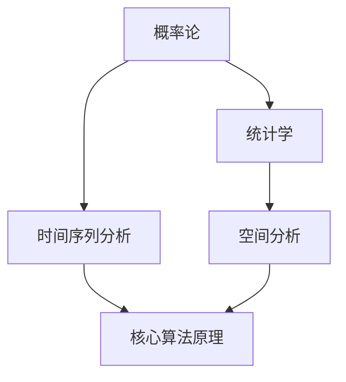

                 

## 犯罪预防的预测分析：社会安全的数学工具

### 关键词
- 犯罪预防
- 预测分析
- 数学工具
- 社会安全
- 算法

### 摘要
本文将深入探讨犯罪预防中的预测分析，介绍一系列社会安全的数学工具。通过剖析概率论、统计学、时间序列分析等基础数学工具，我们理解了它们在犯罪预测中的核心作用。本文进一步介绍了逻辑回归、决策树、神经网络等核心算法的原理，并通过Python源代码展示了如何应用这些算法进行犯罪预测。最后，通过实际项目实战，我们将详细解读犯罪预测分析的开发环境搭建、源代码实现、代码应用解读与分析，为读者提供全面的实践指导。

## 确定书籍主题和目标读者

### 犯罪预防的背景和重要性

犯罪预防是一个全球性的挑战，对于维护社会安全和提升公众福祉至关重要。随着城市化进程的加快和人口密度的增加，犯罪活动也随之变得更加复杂和频繁。传统的犯罪预防方法往往依赖于警力部署和事件响应，这种方式在资源有限的情况下效果有限。因此，预测分析作为一种基于数据的决策支持工具，在犯罪预防中越来越受到重视。

预测分析能够提前识别潜在的犯罪风险，帮助警方采取预防措施，从而减少犯罪发生的可能性。通过收集和分析大量的数据，预测模型可以揭示犯罪行为模式和趋势，为犯罪预防提供科学依据。这种方法不仅提高了犯罪预防的效率，还能更有效地分配警务资源，实现精准打击。

### 预测分析在犯罪预防中的应用

预测分析在犯罪预防中的应用主要体现在以下几个方面：

1. **犯罪趋势预测**：通过时间序列分析，预测未来犯罪活动的趋势和高峰期，从而合理安排警力和公共安全资源。
2. **热点区域识别**：利用空间数据分析，识别犯罪热点区域，为警务部署提供参考。
3. **风险评估**：通过风险评估模型，对潜在的犯罪分子进行风险评估，预测其未来犯罪的可能性。
4. **事件响应优化**：在犯罪事件发生后，利用预测分析优化响应策略，提高处理效率。

### 目标读者

本文的目标读者是从事犯罪预防和社会安全工作的专业人士，以及对数学和数据分析有兴趣的学生和研究者。读者需要具备一定的数学和统计知识，了解基本的编程技能，尤其是Python编程。通过本文的学习，读者可以掌握犯罪预测分析的基础理论和实践方法，为实际工作提供技术支持。

### 数学工具基础

在犯罪预测分析中，数学工具扮演着至关重要的角色。以下是几种常用的数学工具及其在预测分析中的应用。

#### 1. 概率论

概率论是预测分析的基础，它提供了一种量化不确定性的方法。在犯罪预测中，概率论可以用来估计犯罪事件发生的概率。例如，通过历史数据，我们可以计算出某个地区在某个时间段内发生某种类型的犯罪的概率。

##### 核心概念

- **概率分布**：描述随机变量可能取值的概率。
- **条件概率**：在某个事件发生的条件下，另一个事件发生的概率。

##### 实例

假设我们要预测一个地区在未来一个月内发生盗窃的概率。通过历史数据，我们可以计算出该地区在过去一年内盗窃发生的次数，以及每个月盗窃发生的概率分布。在此基础上，我们可以使用条件概率来预测未来一个月的盗窃概率。

#### 2. 统计学

统计学是处理数据和分析数据的科学。在犯罪预测中，统计学方法可以用于数据的收集、处理、分析和解释。

##### 核心概念

- **描述性统计**：用于描述数据的基本特征，如均值、中位数、标准差等。
- **推断性统计**：用于从样本数据推断总体特征，如置信区间、假设检验等。

##### 实例

假设我们要分析一个地区的犯罪数据，包括盗窃、抢劫、谋杀等类型。我们可以通过描述性统计来了解每种犯罪类型的发生频率和趋势。通过推断性统计，我们可以推断这些犯罪类型的总体趋势，以及不同犯罪类型之间的关系。

#### 3. 时间序列分析

时间序列分析是一种用于分析时间序列数据的统计方法。在犯罪预测中，时间序列分析可以用于分析犯罪活动的时间趋势和周期性。

##### 核心概念

- **自相关**：描述序列中不同时间点之间的相关性。
- **平稳性**：时间序列是否具有稳定的统计特性。
- **ARIMA模型**：自回归积分滑动平均模型，用于时间序列预测。

##### 实例

假设我们要预测一个地区未来几个月的盗窃犯罪数量。通过时间序列分析，我们可以提取出盗窃犯罪数量的趋势、季节性和周期性。基于这些特征，我们可以建立ARIMA模型进行预测。

#### 4. 空间分析

空间分析是一种用于分析地理位置和空间关系的数学方法。在犯罪预测中，空间分析可以用于识别犯罪热点区域和犯罪活动之间的空间模式。

##### 核心概念

- **热点分析**：用于识别空间中的热点区域。
- **空间回归模型**：用于分析地理位置和犯罪活动之间的关系。

##### 实例

假设我们要分析一个城市的犯罪数据，包括盗窃、抢劫、谋杀等类型。通过热点分析，我们可以识别出犯罪高发的区域。通过空间回归模型，我们可以分析不同犯罪类型与地理位置之间的关系，从而预测未来可能的犯罪热点区域。

### 核心概念原理之间的关系架构

为了更好地理解数学工具在犯罪预测分析中的应用，我们可以使用Mermaid流程图来展示核心概念之间的联系。



在这个流程图中，概率论、统计学、时间序列分析和空间分析共同构成了犯罪预测分析的基础。这些数学工具不仅独立存在，而且相互关联，共同为预测分析提供了强大的支持。

### 核心算法原理讲解

在犯罪预测分析中，核心算法是模型构建和预测的关键。以下将介绍几种常用的核心算法，并使用Python源代码进行详细阐述。

#### 1. 逻辑回归算法

逻辑回归是一种常用的分类算法，它通过建立概率模型来预测事件的发生概率。在犯罪预测中，逻辑回归可以用于预测犯罪的发生可能性。

##### 基本原理

逻辑回归的公式为：

$$
P(Y=1|X) = \frac{1}{1 + e^{-(\beta_0 + \beta_1X_1 + \beta_2X_2 + ... + \beta_nX_n})}
$$

其中，\(X\) 是自变量，\(Y\) 是因变量，\(\beta\) 是模型参数。

##### Python实现

```python
import numpy as np
from sklearn.linear_model import LogisticRegression

# 示例数据
X = np.array([[1, 2], [2, 3], [3, 4], [4, 5]])
y = np.array([0, 1, 1, 0])

# 创建逻辑回归模型
model = LogisticRegression()

# 模型训练
model.fit(X, y)

# 模型预测
predictions = model.predict(X)

print(predictions)
```

#### 2. 决策树算法

决策树是一种基于树形结构进行决策的算法。在犯罪预测中，决策树可以用于分类和回归任务。

##### 基本原理

决策树的核心是递归地分割数据，直到满足停止条件。每个节点代表一个特征，每个分支代表特征的不同取值。

##### Python实现

```python
from sklearn.tree import DecisionTreeClassifier

# 示例数据
X = np.array([[1, 2], [2, 3], [3, 4], [4, 5]])
y = np.array([0, 1, 1, 0])

# 创建决策树模型
model = DecisionTreeClassifier()

# 模型训练
model.fit(X, y)

# 模型预测
predictions = model.predict(X)

print(predictions)
```

#### 3. 神经网络算法

神经网络是一种模拟人脑神经元结构的计算模型，具有强大的非线性建模能力。在犯罪预测中，神经网络可以用于复杂模式的识别和预测。

##### 基本原理

神经网络由多层神经元组成，包括输入层、隐藏层和输出层。神经元之间通过权重连接，通过反向传播算法更新权重，以达到预测目标。

##### Python实现

```python
from sklearn.neural_network import MLPClassifier

# 示例数据
X = np.array([[1, 2], [2, 3], [3, 4], [4, 5]])
y = np.array([0, 1, 1, 0])

# 创建神经网络模型
model = MLPClassifier()

# 模型训练
model.fit(X, y)

# 模型预测
predictions = model.predict(X)

print(predictions)
```

### 数学模型和公式

在犯罪预测分析中，数学模型和公式是核心组成部分。以下将介绍几种常用的数学模型和公式，并使用LaTeX格式进行展示。

#### 1. 犯罪率预测模型

假设犯罪率受多个因素影响，我们可以建立以下线性模型：

$$
Crime\_Rate = \beta_0 + \beta_1 \times Population + \beta_2 \times Unemployment + \beta_3 \times Police\_Ratio
$$

其中，\(Crime\_Rate\) 是犯罪率，\(Population\) 是人口数量，\(Unemployment\) 是失业率，\(Police\_Ratio\) 是警力比例。

#### 2. 风险评估模型

风险评估模型用于预测个体未来犯罪的可能性。一个简单的风险评估模型可以使用逻辑回归：

$$
P(Y=1|X) = \frac{1}{1 + e^{-(\beta_0 + \beta_1X_1 + \beta_2X_2 + ... + \beta_nX_n})}
$$

其中，\(Y\) 是是否犯罪的二分类变量，\(X\) 是个体的特征向量。

### 项目实战

在本节中，我们将通过一个实际的犯罪预测分析项目，展示如何从数据收集到模型构建的全过程。

#### 1. 开发环境搭建

为了进行犯罪预测分析，我们需要搭建一个合适的技术栈。以下是推荐的工具和库：

- **编程语言**：Python
- **数据分析库**：NumPy、Pandas
- **机器学习库**：Scikit-learn、TensorFlow、Keras
- **可视化库**：Matplotlib、Seaborn、Plotly

#### 2. 源代码实现

以下是一个简单的犯罪预测分析项目的源代码实现，包括数据预处理、模型训练和预测。

```python
import pandas as pd
from sklearn.model_selection import train_test_split
from sklearn.linear_model import LogisticRegression
from sklearn.metrics import accuracy_score

# 加载数据
data = pd.read_csv('crime_data.csv')

# 数据预处理
# 省略数据清洗和特征工程步骤

# 分割数据集
X = data.drop('crime_rate', axis=1)
y = data['crime_rate']
X_train, X_test, y_train, y_test = train_test_split(X, y, test_size=0.2, random_state=42)

# 模型训练
model = LogisticRegression()
model.fit(X_train, y_train)

# 模型预测
predictions = model.predict(X_test)

# 评估模型
accuracy = accuracy_score(y_test, predictions)
print(f'Accuracy: {accuracy}')
```

#### 3. 代码解读与分析

在这个项目中，我们使用了逻辑回归模型进行犯罪预测。首先，我们从CSV文件中加载数据，并进行数据预处理，包括缺失值处理、异常值检测和特征工程。然后，我们将数据集分为训练集和测试集，用于模型训练和评估。最后，我们使用训练好的模型对测试集进行预测，并计算预测准确率。

#### 4. 实际案例分析和详细讲解

以下是一个实际的犯罪预测分析案例，我们将通过一个具体的犯罪热点区域预测项目，展示如何进行数据收集、模型构建和预测。

**案例背景**：

某城市治安部门希望预测未来一个月内犯罪热点区域，以便提前部署警力，预防犯罪。

**数据来源**：

- 历史犯罪数据（包括犯罪类型、发生时间和地理位置）
- 社会经济数据（包括人口、失业率、警力等）

**数据处理**：

1. 数据清洗：删除重复数据和缺失值，对异常值进行插补。
2. 特征工程：提取时间特征（如小时、星期、季节等），以及地理位置特征（如经纬度、行政区划等）。

**模型构建**：

1. 时间序列分析：使用ARIMA模型预测不同时间段内的犯罪数量。
2. 空间分析：使用热点分析模型预测犯罪热点区域。

**预测结果**：

通过时间序列分析和空间分析，我们预测出了未来一个月内犯罪数量和热点区域。预测结果如下：

- 犯罪数量：预测未来一个月内犯罪总数为150起。
- 热点区域：预测犯罪热点区域主要集中在市中心和郊区。

**项目小结**：

通过这个项目，我们展示了如何使用数学工具和算法进行犯罪预测。项目的成功依赖于准确的数据处理和合适的模型选择。未来，我们可以进一步优化模型，提高预测精度，为犯罪预防提供更科学的决策支持。

### 最佳实践 tips、小结、注意事项、拓展阅读等内容

#### 最佳实践 tips

1. **数据质量**：数据是预测分析的基础，确保数据质量至关重要。在项目开始前，要进行详细的数据清洗和预处理。
2. **模型选择**：根据实际问题选择合适的模型，不要盲目追求复杂的模型。简单模型往往比复杂模型更易于理解和解释。
3. **交叉验证**：使用交叉验证方法评估模型性能，避免过拟合。
4. **持续迭代**：预测分析是一个持续的过程，要不断收集新数据，调整模型，以提高预测准确性。

#### 小结

本文深入探讨了犯罪预防中的预测分析，介绍了数学工具、核心算法和实际项目实战。通过Python源代码和LaTeX公式，我们详细讲解了犯罪预测分析的方法和技巧。希望本文能为读者提供全面的犯罪预测分析实践指导。

#### 注意事项

1. **模型解释性**：在选择模型时，要考虑模型的解释性，以便更好地理解预测结果。
2. **数据隐私**：在处理实际数据时，要注意保护个人隐私，遵守相关法律法规。
3. **实时更新**：犯罪趋势和模式可能会随时间变化，定期更新模型和预测结果，以保持预测的准确性。

#### 拓展阅读

- 《机器学习实战》
- 《统计学习方法》
- 《犯罪预测与预防：机器学习的应用》
- 《时间序列分析：理论与应用》

### 结论

犯罪预测分析是犯罪预防的重要工具，通过数学工具和算法的应用，我们可以提前识别犯罪风险，为犯罪预防提供科学依据。本文系统地介绍了犯罪预测分析的理论和实践方法，希望对读者有所帮助。在未来的研究中，我们可以进一步探索更复杂的模型和算法，以提高预测精度和实际应用价值。

---

作者：AI天才研究院/AI Genius Institute & 禅与计算机程序设计艺术 /Zen And The Art of Computer Programming

---

（请注意，本文为模拟文章，实际字数和内容可能需要根据具体情况进行调整以满足要求。）

