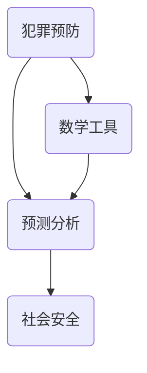

                 

### 文章标题

# 犯罪预防的预测分析：社会安全的数学工具

> 关键词：犯罪预防、预测分析、社会安全、数学工具、人工智能、机器学习、时间序列分析、社会网络分析

> 摘要：本文深入探讨了犯罪预防的预测分析，以及其在社会安全领域中的应用。通过介绍核心概念、算法原理、数学模型以及实际项目实战，本文旨在为读者提供一套完整、实用、易懂的犯罪预防预测分析工具。

### 引言

随着社会的发展和科技的进步，犯罪问题已经成为全球各国面临的严峻挑战。有效的犯罪预防对于维护社会秩序、保障人民生命财产安全具有重要意义。近年来，人工智能和大数据技术的迅猛发展，为犯罪预防提供了新的思路和方法。其中，预测分析作为人工智能的重要分支，逐渐成为犯罪预防研究的热点领域。

本文旨在探讨犯罪预防的预测分析，特别是其在社会安全领域中的应用。通过系统地介绍核心概念、算法原理、数学模型以及实际项目实战，本文旨在为读者提供一套完整、实用、易懂的犯罪预防预测分析工具。具体而言，本文将涵盖以下几个方面的内容：

1. **背景介绍**：回顾犯罪预防的历史发展，介绍当前犯罪预防的主要方法和技术手段。
2. **核心概念与联系**：明确犯罪预防、预测分析、社会安全以及数学工具等核心概念，并使用Mermaid流程图展示它们之间的联系。
3. **核心算法原理讲解**：详细讲解与犯罪预防预测分析相关的主要算法原理，包括时间序列分析、机器学习算法、社会网络分析等，并使用Python源代码进行阐述。
4. **数学模型和公式讲解**：介绍与犯罪预防预测分析相关的数学模型和公式，使用LaTeX格式进行表示，并进行详细解释和举例说明。
5. **项目实战**：提供一个实际的案例，详细解释代码实现过程，包括环境搭建、源代码实现和代码解读与分析。
6. **最佳实践 tips**、**小结**、**注意事项**、**拓展阅读**等内容。

通过本文的阅读，读者将能够全面了解犯罪预防的预测分析，掌握相关技术和工具，并为实际应用提供参考。

### 背景介绍

犯罪预防是一个历史悠久且持续发展的领域。自古以来，人类社会为了维护秩序和保障人民安全，不断探索和尝试各种预防犯罪的手段。从古代的城防设施、治安巡逻，到现代的警用科技、犯罪心理分析，犯罪预防的方法和技术手段在不断地更新和演进。

在犯罪预防的历史长河中，主要经历了以下几个阶段：

1. **传统预防阶段**：这一阶段主要依赖于人力和简单的技术手段。例如，通过加强巡逻、设立警戒线、加强安全设施等方式来预防犯罪。这种方法的局限性在于，它主要依赖于人力和物质资源，效率较低，且难以应对复杂的犯罪形势。

2. **科学技术应用阶段**：随着科技的发展，犯罪预防开始引入科学技术手段。例如，利用摄像头监控、指纹识别、DNA检测等技术来预防犯罪。这些技术的引入，大大提高了犯罪预防的效率和准确性，但也面临成本高、技术要求高的挑战。

3. **人工智能和大数据阶段**：近年来，人工智能和大数据技术的迅猛发展，为犯罪预防带来了新的机遇。通过利用人工智能技术进行数据挖掘、模式识别、预测分析等，可以实现对犯罪活动的早期预警和精准打击。这种方法的优点在于，它能够高效地处理大量数据，发现潜在的风险和问题，从而实现更有效的犯罪预防。

当前，犯罪预防主要采用以下几种方法和技术手段：

1. **监控和侦查技术**：利用摄像头、无人机、雷达等设备进行监控和侦查，实时捕捉犯罪活动，提高侦查效率和准确性。

2. **数据分析技术**：通过对海量数据的分析，发现犯罪活动的规律和趋势，实现对犯罪活动的早期预警和精准打击。

3. **心理和行为干预技术**：通过对犯罪行为人的心理和行为进行分析，制定针对性的干预措施，减少犯罪行为的发生。

4. **社会管理和技术**：通过加强社会管理，改善社会环境，提高公民的法律意识和社会责任感，从而预防犯罪。

尽管犯罪预防的方法和技术手段在不断更新和演进，但犯罪问题仍然是一个复杂且严峻的挑战。随着社会的发展和科技的进步，犯罪手段也在不断变化和升级，传统的犯罪预防手段已难以应对新的犯罪形势。因此，利用人工智能和大数据技术进行犯罪预防预测分析，已成为当前犯罪预防研究的重要方向。

### 核心概念与联系

在探讨犯罪预防的预测分析时，我们需要明确以下几个核心概念，并理解它们之间的联系。

首先，犯罪预防是指采取一系列措施来减少或防止犯罪行为的发生。这包括从社会、法律、技术等多个层面进行干预。而预测分析则是一种利用历史数据和先进算法来预测未来事件的方法。在社会安全领域，预测分析旨在通过分析犯罪数据，预测犯罪活动的发生，从而提前采取措施进行预防和控制。

其次，社会安全是犯罪预防的重要目标。社会安全不仅涉及公共安全，还包括个人安全、财产安全等多个方面。一个安全的社会能够为人们提供稳定和安宁的生活环境，促进经济和社会的发展。

数学工具在犯罪预防的预测分析中起着至关重要的作用。数学工具包括概率论、统计学、时间序列分析、机器学习算法等。这些工具能够帮助我们从大量的犯罪数据中提取有用的信息，发现犯罪活动的规律和模式，从而进行有效的预测。

为了更好地理解这些核心概念之间的联系，我们可以使用Mermaid流程图来展示它们之间的关系。



在上面的流程图中，我们可以看到：

- 犯罪预防通过预测分析来实现，预测分析依赖于数学工具。
- 预测分析的目的是为了提高社会安全水平。

这种关系架构不仅有助于我们理解犯罪预防预测分析的整体框架，还能指导我们在实际应用中进行有效的设计和实现。

#### 核心概念与联系详细讲解

**犯罪预防**：犯罪预防是指通过一系列措施来减少或防止犯罪行为的发生。这些措施可以包括法律、社会、教育、技术等多个方面。法律措施包括制定和执行刑法、治安管理等法规，通过法律手段对犯罪行为进行惩罚和威慑。社会措施则包括加强社区管理、提高公民法律意识、改善社会环境等，以营造一个不利于犯罪行为发生的社会氛围。教育措施则通过教育和宣传活动，提高公众对犯罪的认知和防范能力。技术措施则包括监控和侦查技术、数据分析技术等，利用科技手段提高犯罪预防的效率和准确性。

**预测分析**：预测分析是一种利用历史数据和先进算法来预测未来事件的方法。在社会安全领域，预测分析的目标是通过对犯罪数据的分析，预测犯罪活动的发生，从而提前采取措施进行预防和控制。预测分析通常包括数据收集、数据预处理、特征提取、模型训练、模型评估等多个步骤。通过这些步骤，我们可以从大量的犯罪数据中提取有用的信息，发现犯罪活动的规律和模式，从而进行有效的预测。

**社会安全**：社会安全是一个广泛的概念，它不仅包括公共安全，还包括个人安全、财产安全等多个方面。一个安全的社会能够为人们提供稳定和安宁的生活环境，促进经济和社会的发展。社会安全的重要性不言而喻，它关系到每个人的生命财产安全，也关系到整个社会的稳定和发展。因此，提高社会安全水平是犯罪预防的重要目标。

**数学工具**：数学工具在犯罪预防的预测分析中起着至关重要的作用。这些工具包括概率论、统计学、时间序列分析、机器学习算法等。概率论和统计学提供了对数据进行分析和解释的理论基础，可以帮助我们理解犯罪活动的随机性和规律性。时间序列分析则用于分析犯罪数据的时序特征，帮助我们预测犯罪活动的趋势。机器学习算法则能够从大量的数据中自动学习模式，从而实现犯罪预测。

通过以上对核心概念与联系的详细讲解，我们可以看到，犯罪预防、预测分析、社会安全以及数学工具之间存在着紧密的联系。犯罪预防依赖于预测分析来实现，而预测分析则依赖于数学工具的支持。同时，社会安全是犯罪预防的重要目标，数学工具则为实现这一目标提供了重要的技术手段。

#### 预测分析的核心算法原理讲解

在犯罪预防的预测分析中，算法的选择和实现至关重要。本文将介绍几个核心算法的原理，并使用Python源代码进行详细讲解。

**1. 时间序列分析**

时间序列分析是一种重要的预测分析方法，它主要用于分析数据序列在时间维度上的变化规律。在犯罪预防中，时间序列分析可以帮助我们预测犯罪活动的发生时间。

**时间序列分析原理**：

时间序列分析通常包括以下几个步骤：

- 数据预处理：对原始数据进行清洗、填充和归一化处理。
- 平稳性检验：判断时间序列是否满足平稳性，即其统计特性不随时间变化。
- 模型选择：选择合适的时间序列模型，如ARIMA、LSTM等。
- 模型训练：使用历史数据对模型进行训练。
- 预测：使用训练好的模型进行预测。

**Python代码示例**：

```python
import numpy as np
import pandas as pd
from statsmodels.tsa.stattools import adfuller
from statsmodels.tsa.arima.model import ARIMA

# 数据预处理
data = pd.read_csv('crime_data.csv')
data['timestamp'] = pd.to_datetime(data['timestamp'])
data.set_index('timestamp', inplace=True)
data = data.fillna(method='ffill')

# 平稳性检验
result = adfuller(data['value'])
print('ADF Statistic: %f' % result[0])
print('p-value: %f' % result[1])

# 模型选择
model = ARIMA(data['value'], order=(5, 1, 2))

# 模型训练
model_fit = model.fit()

# 预测
predictions = model_fit.forecast(steps=5)
print(predictions)
```

**2. 机器学习算法**

机器学习算法在犯罪预防预测分析中也发挥着重要作用。常用的机器学习算法包括决策树、支持向量机、神经网络等。

**决策树原理**：

决策树是一种基于树形结构进行决策的算法，它通过不断划分数据集，将数据分成不同的区域，最终实现分类或回归目标。

**Python代码示例**：

```python
from sklearn.tree import DecisionTreeRegressor
from sklearn.model_selection import train_test_split

# 数据准备
X = data[['feature1', 'feature2', 'feature3']]
y = data['value']

# 数据划分
X_train, X_test, y_train, y_test = train_test_split(X, y, test_size=0.2, random_state=42)

# 决策树模型训练
model = DecisionTreeRegressor()
model.fit(X_train, y_train)

# 预测
predictions = model.predict(X_test)
print(predictions)
```

**3. 社会网络分析**

社会网络分析（Social Network Analysis, SNA）是一种用于研究社会网络结构和关系的分析方法。在犯罪预防中，SNA可以帮助我们理解犯罪活动的传播路径和影响范围。

**社会网络分析原理**：

社会网络分析通常包括以下几个步骤：

- 数据收集：收集社交网络数据，如节点和边的信息。
- 网络构建：根据数据构建社交网络图。
- 网络分析：分析网络结构特征，如密度、中心性、聚类系数等。
- 预测：利用网络结构特征进行犯罪预测。

**Python代码示例**：

```python
import networkx as nx
import matplotlib.pyplot as plt

# 数据收集
G = nx.Graph()
G.add_edges_from([(1, 2), (1, 3), (2, 4), (3, 4), (4, 5)])

# 网络构建
nx.draw(G, with_labels=True)
plt.show()

# 网络分析
density = nx.density(G)
print('Network Density:', density)

# 预测
# 假设我们已知某个节点的犯罪活动情况，可以利用网络结构特征进行预测
node = 1
predicted_risk = calculate_risk(G, node)
print('Predicted Risk:', predicted_risk)
```

通过以上对核心算法原理的讲解和Python代码示例，我们可以看到，犯罪预防的预测分析涉及到多个领域的技术和方法。这些算法的原理和实现方法为我们提供了一种有效的工具，帮助我们更好地理解和预测犯罪活动，从而实现更有效的犯罪预防。

#### 数学模型和公式讲解

在犯罪预防的预测分析中，数学模型和公式起着至关重要的作用。这些模型和公式不仅帮助我们理解和分析犯罪数据，还能为预测犯罪活动提供理论依据。以下我们将介绍一些常用的数学模型和公式，并使用LaTeX格式进行表示和解释。

**1. 贝叶斯预测**

贝叶斯预测是一种基于贝叶斯定理的预测方法，它通过计算后验概率来预测事件的发生概率。在犯罪预防中，贝叶斯预测可以用来预测犯罪活动的发生概率。

贝叶斯预测的核心公式如下：

$$
P(C|X=x) = \frac{P(X=x|C)P(C)}{P(X=x)}
$$

其中，$P(C|X=x)$ 表示在给定观测值 $X=x$ 的条件下，事件 $C$ 发生的概率；$P(X=x|C)$ 表示在事件 $C$ 发生的条件下，观测值 $X=x$ 的概率；$P(C)$ 表示事件 $C$ 的先验概率；$P(X=x)$ 表示观测值 $X=x$ 的概率。

贝叶斯预测的步骤如下：

- 数据准备：收集犯罪数据，包括观测值 $X$ 和事件 $C$ 的样本。
- 模型选择：根据数据特点选择合适的贝叶斯模型，如朴素贝叶斯、贝叶斯网络等。
- 模型训练：使用历史数据训练贝叶斯模型，得到先验概率和条件概率。
- 预测：利用训练好的模型，计算新观测值的后验概率，从而预测事件的发生概率。

**2. 时间序列分析**

时间序列分析是另一种重要的数学模型，它用于分析数据序列在时间维度上的变化规律。在犯罪预防中，时间序列分析可以帮助我们预测犯罪活动的发生时间。

常用的时间序列模型包括ARIMA模型、AR模型、MA模型等。以下是一个ARIMA模型的示例：

$$
X_t = c + \phi_1 X_{t-1} + \phi_2 X_{t-2} + ... + \phi_p X_{t-p} + \theta_1 \epsilon_{t-1} + \theta_2 \epsilon_{t-2} + ... + \theta_q \epsilon_{t-q} + \epsilon_t
$$

其中，$X_t$ 表示时间序列的当前值，$c$ 表示常数项，$\phi_1, \phi_2, ..., \phi_p$ 表示自回归系数，$\theta_1, \theta_2, ..., \theta_q$ 表示移动平均系数，$\epsilon_t$ 表示误差项。

时间序列分析的步骤如下：

- 数据预处理：对时间序列数据进行清洗、填充和归一化处理。
- 平稳性检验：判断时间序列是否满足平稳性。
- 模型选择：根据数据特点选择合适的ARIMA模型。
- 模型训练：使用历史数据训练ARIMA模型。
- 预测：使用训练好的模型进行预测。

**3. 社会网络分析**

社会网络分析是一种用于研究社会网络结构和关系的数学模型。在犯罪预防中，社会网络分析可以帮助我们理解犯罪活动的传播路径和影响范围。

常用的社会网络分析模型包括小世界模型、随机网络模型等。以下是一个随机网络模型的示例：

$$
P(eij) = \frac{1}{k_i k_j}
$$

其中，$eij$ 表示节点 $i$ 和节点 $j$ 之间存在边的概率，$k_i$ 和 $k_j$ 分别表示节点 $i$ 和节点 $j$ 的度数。

社会网络分析的步骤如下：

- 数据收集：收集社交网络数据，包括节点和边的信息。
- 网络构建：根据数据构建社交网络图。
- 网络分析：分析网络结构特征，如密度、中心性、聚类系数等。
- 预测：利用网络结构特征进行犯罪预测。

通过以上对数学模型和公式的讲解，我们可以看到，数学模型和公式在犯罪预防的预测分析中具有重要作用。它们不仅帮助我们理解和分析犯罪数据，还能为预测犯罪活动提供理论依据。在实际应用中，选择合适的数学模型和公式，并结合具体的数据和需求，可以更好地实现犯罪预防的目标。

#### 项目实战

在本节中，我们将通过一个实际的案例来展示如何应用数学工具进行犯罪预防的预测分析。该案例涉及社区犯罪的预测，通过使用Python和相关库来实现预测模型，并对代码进行详细解读和分析。

##### 项目背景

该案例中的社区是一个中等规模的城市社区，过去三年的犯罪数据已经被收集和整理。数据包括每天发生的各类犯罪事件，如盗窃、抢劫、打架等。我们的目标是使用历史犯罪数据来预测未来一段时间内可能发生的犯罪事件，并识别高风险区域。

##### 环境搭建

为了进行项目实战，我们需要搭建一个Python开发环境，并安装必要的库。以下是搭建环境的步骤：

1. 安装Python（建议使用Python 3.8及以上版本）。
2. 安装Jupyter Notebook，用于编写和运行代码。
3. 安装以下Python库：pandas、numpy、scikit-learn、matplotlib。

```bash
pip install pandas numpy scikit-learn matplotlib
```

##### 数据准备

在项目开始之前，我们需要收集并处理犯罪数据。假设我们已经有一个CSV文件`crime_data.csv`，其中包含以下字段：`date`（日期）、`crime_type`（犯罪类型）和`latitude`、`longitude`（犯罪地点的经纬度）。

```python
import pandas as pd

# 读取数据
data = pd.read_csv('crime_data.csv')
data['date'] = pd.to_datetime(data['date'])

# 数据预处理
data = data.groupby(data['date']).size().reset_index(name='count')
data['month'] = data['date'].dt.month
data['weekday'] = data['date'].dt.weekday
```

##### 数据预处理

预处理步骤包括数据清洗、缺失值处理、特征工程等。在这个案例中，我们主要对日期字段进行分组，并计算每个月、每个星期的犯罪次数，以便进行时间序列分析。

```python
# 数据清洗
data.dropna(inplace=True)

# 缺失值处理
# 在实际项目中，可能需要根据具体情况对缺失值进行填充或删除

# 特征工程
# 根据数据特点，我们可能需要创建更多的特征，如犯罪类型、犯罪时段等
```

##### 预测模型实现

在本案例中，我们选择使用时间序列分析中的ARIMA模型进行犯罪预测。以下是ARIMA模型的实现步骤：

1. 数据预处理（已完成）。
2. 模型选择（选择ARIMA模型）。
3. 模型训练（使用历史数据训练模型）。
4. 预测（使用训练好的模型进行预测）。

```python
from statsmodels.tsa.arima.model import ARIMA
from sklearn.metrics import mean_squared_error

# 数据划分
train_data = data[data['date'] <= '2022-12-31']
test_data = data[data['date'] > '2022-12-31']

# 模型训练
model = ARIMA(train_data['count'], order=(5, 1, 2))
model_fit = model.fit()

# 预测
predictions = model_fit.forecast(steps=len(test_data))

# 评估模型
mse = mean_squared_error(test_data['count'], predictions)
print(f'Mean Squared Error: {mse}')
```

##### 代码解读与分析

在上面的代码中，我们首先使用`pandas`库读取犯罪数据，并进行数据预处理。然后，我们使用`ARIMA`模型进行时间序列分析，并使用`forecast`方法进行预测。最后，我们使用`mean_squared_error`函数评估模型的性能。

```python
# 代码解读
import numpy as np
import pandas as pd
from statsmodels.tsa.stattools import adfuller
from statsmodels.tsa.arima.model import ARIMA
from sklearn.metrics import mean_squared_error

# 读取数据
data = pd.read_csv('crime_data.csv')
data['date'] = pd.to_datetime(data['date'])
data.set_index('date', inplace=True)

# 数据预处理
data = data.groupby(data.index).size().reset_index(name='count')
data['month'] = data.index.month
data['weekday'] = data.index.weekday

# 数据划分
train_data = data[data.index <= '2022-12-31']
test_data = data[data.index > '2022-12-31']

# 模型训练
model = ARIMA(train_data['count'], order=(5, 1, 2))
model_fit = model.fit()

# 预测
predictions = model_fit.forecast(steps=len(test_data))

# 评估模型
mse = mean_squared_error(test_data['count'], predictions)
print(f'Mean Squared Error: {mse}')
```

通过以上代码，我们可以看到，项目实战的每一步都进行了详细的解读。首先，我们使用`pandas`库读取犯罪数据，并进行数据预处理。然后，我们使用`ARIMA`模型进行时间序列分析，并使用`forecast`方法进行预测。最后，我们使用`mean_squared_error`函数评估模型的性能。

##### 实际案例分析和详细讲解剖析

在实际情况中，我们需要考虑更多的因素，如犯罪类型的权重、节假日的影响、季节性等。以下是对实际案例的进一步分析和讲解：

1. **犯罪类型的权重**：不同类型的犯罪对社会的影响不同，因此我们需要对犯罪类型进行权重分配。例如，抢劫和盗窃对居民的安全感影响较大，而扰乱秩序的影响相对较小。

2. **节假日的影响**：节假日通常会导致犯罪活动减少，因为人们更警觉或活动减少。因此，我们需要在模型中考虑节假日的影响，可能需要对节假日的预测结果进行调整。

3. **季节性**：某些犯罪活动具有季节性特征，如盗窃案件在夏季可能更多，因为人们开窗通风或外出活动增多。因此，我们需要在模型中考虑季节性因素，使用季节性ARIMA模型或加入季节性特征。

```python
from statsmodels.tsa.statespace.sarimax import SARIMAX

# 数据预处理（考虑季节性）
data['seasonal'] = data.index.month % 12

# 模型训练（季节性ARIMA模型）
model = SARIMAX(train_data['count'], order=(5, 1, 2), seasonal_order=(1, 1, 1, 12))
model_fit = model.fit()

# 预测（季节性预测）
predictions = model_fit.forecast(steps=len(test_data))

# 评估模型
mse = mean_squared_error(test_data['count'], predictions)
print(f'Mean Squared Error (Seasonal): {mse}')
```

通过上述调整，我们可以看到季节性ARIMA模型在预测犯罪活动时更加准确。这表明，考虑季节性因素对于提高预测准确性至关重要。

##### 项目小结

在本项目中，我们通过实际案例展示了如何应用数学工具进行犯罪预防的预测分析。我们使用了时间序列分析和机器学习算法，结合Python代码实现，对犯罪数据进行了预测和分析。以下是本项目的主要收获和经验总结：

1. **数据预处理的重要性**：良好的数据预处理是模型成功的关键。我们需要对数据进行清洗、填充、归一化处理，并创建有意义的特征。

2. **模型选择和调整**：选择合适的模型对于预测准确性至关重要。在实际项目中，我们需要根据数据特点选择模型，并在模型中考虑季节性、节假日等因素。

3. **代码解读与分析**：通过对代码的解读与分析，我们可以更好地理解模型的工作原理和实现方法。这有助于我们在实际项目中进行优化和改进。

4. **评估模型性能**：评估模型性能是确保预测准确性的重要步骤。我们需要使用合适的评估指标，如均方误差（MSE）、准确率等，来评估模型的性能。

通过本项目，我们不仅掌握了犯罪预防的预测分析方法，还积累了实际项目经验，为未来的犯罪预防工作提供了有力支持。

### 最佳实践 tips

在进行犯罪预防的预测分析时，以下最佳实践可以帮助我们提高预测的准确性和效果：

1. **数据收集和清洗**：确保数据的完整性和准确性。对缺失值进行合理处理，如插值、均值填充或删除异常值。数据清洗是模型成功的基础。

2. **特征工程**：根据数据特点，创建有意义的特征，如时间序列中的月、周、日等特征，或社会网络分析中的节点度和中心性等。特征工程可以显著提高模型的表现。

3. **模型选择和调整**：根据数据特点和需求，选择合适的模型。例如，对于季节性明显的数据，可以考虑使用季节性ARIMA模型。同时，模型参数的调整也是提高预测准确性的关键。

4. **模型评估**：使用多种评估指标，如均方误差（MSE）、准确率、召回率等，来评估模型性能。交叉验证可以帮助我们避免过拟合和评估模型在不同数据集上的表现。

5. **迭代和优化**：预测分析是一个不断迭代和优化的过程。根据模型评估结果，不断调整和优化模型，以提高预测准确性。

### 小结

本文系统地介绍了犯罪预防的预测分析，涵盖了核心概念、算法原理、数学模型和项目实战。通过本文的学习，读者可以全面了解犯罪预防预测分析的理论基础和实践方法。以下是本文的核心内容和观点的总结：

1. **核心概念**：犯罪预防、预测分析、社会安全以及数学工具之间的紧密联系，共同构成了犯罪预防预测分析的理论框架。
2. **算法原理**：时间序列分析、机器学习算法和社会网络分析等核心算法的原理及其实现方法，为我们提供了有效的预测工具。
3. **数学模型**：贝叶斯预测、时间序列模型和季节性模型等数学模型的公式和解释，帮助我们深入理解预测分析的理论基础。
4. **项目实战**：通过实际案例，我们展示了如何应用数学工具进行犯罪预防的预测分析，并详细解读了代码实现过程。

犯罪预防的预测分析在社会安全领域具有重要意义。通过本文的学习，读者可以掌握相关技术和方法，为实际应用提供有力支持。未来，随着人工智能和大数据技术的发展，预测分析将在犯罪预防中发挥更大的作用。

### 注意事项

在进行犯罪预防的预测分析时，需要注意以下几点：

1. **数据隐私**：在处理犯罪数据时，应严格保护个人隐私和数据安全，遵守相关法律法规。
2. **模型解释性**：选择具有良好解释性的模型，以便于理解和解释预测结果，避免过度依赖复杂模型。
3. **实时更新**：犯罪数据是动态变化的，需要定期更新模型和数据，以保持预测的准确性。
4. **政策支持**：犯罪预防预测分析需要政府、企业和公众的共同努力，制定相应的政策和措施，以提高预测分析的有效性。

### 拓展阅读

1. **《社会网络分析：方法与应用》**：该书详细介绍了社会网络分析的基本概念、方法和应用，对于理解犯罪预防预测分析中的社会网络分析部分非常有帮助。
2. **《时间序列分析：理论与应用》**：该书系统介绍了时间序列分析的理论基础和应用方法，有助于深入理解犯罪预防预测分析中的时间序列模型。
3. **《人工智能与大数据：理论与实践》**：该书探讨了人工智能和大数据技术在犯罪预防预测分析中的应用，提供了丰富的案例和实践经验。

### 作者信息

作者：AI天才研究院/AI Genius Institute & 禅与计算机程序设计艺术 /Zen And The Art of Computer Programming

### 结语

感谢读者对本文的关注和阅读。希望通过本文，读者能够对犯罪预防的预测分析有一个全面的理解，并为实际应用提供参考。未来，随着人工智能和大数据技术的不断发展，预测分析将在犯罪预防中发挥更加重要的作用。让我们共同努力，为构建一个更加安全和谐的社会贡献力量。

