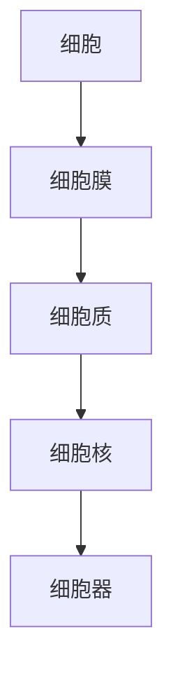

                 

# 生物学视角下的世界可理解性

## 引言与背景

### 1.1 人类认知的起源与演化

人类认知的起源可以追溯到数百万年前的非洲，那时我们的祖先开始使用工具，并通过语言交流信息。随着时间的推移，人类的大脑逐渐演化出更高级的认知能力，如抽象思维、语言能力和逻辑推理。这些认知能力使人类能够更好地适应环境，并逐渐发展出复杂的社会结构和文化。

认知科学与生物学有着密切的联系。研究表明，人类大脑的许多特征，如神经网络的复杂性、大脑皮层的厚度和灰质密度，都与生物学的演化过程密切相关。例如，人类大脑的发达程度与我们对复杂环境的适应能力直接相关，这种适应能力在漫长的进化过程中得到了强化。

### 1.2 生物学与世界观的关系

生物学不仅影响人类的认知能力，还深刻地影响了我们对世界的理解。从宏观的生态系统到微观的细胞结构，生物学为我们提供了理解自然界的工具。例如，达尔文的进化论揭示了物种的起源和演变过程，使我们能够理解生物多样性的形成和生态系统的运作机制。

生物学与哲学、科学和宗教等领域也有着紧密的联系。哲学探讨存在和意识的本质，科学则通过实证方法研究自然界，而宗教则试图解释宇宙的起源和人类的存在。生物学为这些领域提供了新的视角，帮助我们更好地理解自然界的规律和人类在宇宙中的地位。

### 1.3 生物学视角下的世界可理解性

生物学视角下的世界可理解性意味着我们将生物学原理应用于对自然界的理解和解释。这种视角使我们能够从生物学的角度审视自然界的复杂现象，如物种进化、生态系统动态和生物多样性。

生物学视角下的世界可理解性具有以下几个特点：

1. **整体性**：生物学强调生物体与环境的相互作用，以及生物体内各个部分之间的协同作用。这种整体性观念有助于我们理解自然界的复杂性和多样性。

2. **演化性**：生物学视角下的世界是一个不断演化的世界。物种的进化、生态系统的演变以及生物多样性的形成都是自然界中的基本过程。这种演化观念使我们能够更好地理解自然界的动态变化。

3. **适应性**：生物学视角下的世界是一个适应性的世界。生物体通过演化适应环境，从而在自然界中生存和繁衍。这种适应性观念有助于我们理解生物体如何适应不同的环境和条件。

4. **复杂性**：生物学视角下的世界是一个复杂的世界。生物体内的生物化学反应、生态系统中的物种相互作用以及自然界的演化过程都具有高度复杂性。这种复杂性观念使我们能够更好地理解自然界的多样性和动态变化。

## 第二部分：生物学基础概念

### 2.1 细胞：生命的基本单位

细胞是生命的基本单位，是所有生物体的基本结构。细胞具有以下基本特征：

- **结构**：细胞由细胞膜、细胞质、细胞核和其他细胞器组成。细胞膜是细胞的保护层，控制物质进出细胞。细胞质是细胞内的液态环境，包含各种细胞器。细胞核是细胞的控制中心，包含遗传信息。

- **功能**：细胞通过代谢活动维持生命。代谢活动包括能量产生、物质合成、分解和转运。细胞器如线粒体负责能量产生，内质网负责蛋白质合成，高尔基体负责蛋白质加工和转运。

- **繁殖**：细胞通过分裂产生新的细胞。细胞分裂分为有丝分裂和无丝分裂，分别用于生长和修复组织。

### 2.2 遗传学：基因与遗传信息的传递

遗传学是研究遗传现象和遗传信息的科学。基因是遗传信息的基本单位，由DNA序列编码。基因在生物体中控制特定性状的表达。

- **基因结构**：基因由DNA序列组成，包括编码区、启动子和调控元件。编码区负责编码蛋白质，启动子负责启动基因转录，调控元件负责调控基因表达。

- **遗传规律**：遗传学的基本规律包括孟德尔的遗传规律（基因的分离和自由组合）和现代遗传学的规律（DNA序列的变异、基因突变和基因重组）。

- **遗传信息的传递**：遗传信息通过DNA复制传递给下一代。DNA复制过程中，DNA双链分离，每条链作为模板合成新的互补链。这种半保留复制机制保证了遗传信息的准确传递。

### 2.3 进化论：物种的起源与演变

进化论是研究物种起源和演变的科学。进化论的基本原理包括自然选择、遗传变异和物种隔离。

- **自然选择**：自然选择是生物体适应环境的过程。适应环境的生物体有更高的生存和繁衍机会，从而传递有利的遗传特征。不适应环境的生物体则生存和繁衍机会较低。

- **遗传变异**：遗传变异是物种进化的基础。遗传变异可以通过基因突变、基因重组和染色体变异等途径产生。这些变异提供了新的遗传特征，为自然选择提供了原材料。

- **物种隔离**：物种隔离是物种分化为不同物种的过程。物种隔离可以通过地理隔离、生殖隔离和生态隔离等途径实现。地理隔离使不同种群在地理上隔离，从而减少基因交流。生殖隔离使不同种群无法繁殖后代，从而形成新的物种。

## 第三部分：生物学视角下的自然界

### 3.1 生物多样性与生态平衡

生物多样性是指生物体在基因、物种和生态系统层次上的多样性。生物多样性是生态系统稳定性和功能性的关键。

- **生物多样性层次**：生物多样性包括基因多样性、物种多样性和生态系统多样性。基因多样性是物种多样性的基础，物种多样性是生态系统多样性的组成部分。

- **生态平衡**：生态平衡是指生态系统中各种生物体之间相互作用的平衡状态。生态平衡对维持生态系统功能至关重要。生态平衡可以通过生物共生、食物链和物质循环等机制实现。

### 3.2 动物行为学：本能与学习

动物行为学是研究动物行为的原因和机制的科学。动物行为可以分为本能行为和学习行为。

- **本能行为**：本能行为是动物出生时就具备的行为，如觅食、筑巢、繁殖和防御。本能行为由遗传程序决定，不受个体学习经历的影响。

- **学习行为**：学习行为是动物在成长过程中通过经验和学习获得的行为。学习行为可以通过条件反射、观察学习和记忆等机制实现。学习行为使动物能够适应环境变化，提高生存能力。

### 3.3 生态系统：生物与环境的关系

生态系统是生物体与其环境相互作用的系统。生态系统包括生物群落、生物圈和生物地球化学循环。

- **生物群落**：生物群落是指生活在同一地区、相互依存的多种生物群体。生物群落包括植物、动物和微生物等生物体。

- **生物圈**：生物圈是指地球上所有生物体和其生存环境的总称。生物圈包括陆地、海洋和大气等环境。

- **生物地球化学循环**：生物地球化学循环是指生物体和环境中的物质循环。生物地球化学循环包括碳循环、氮循环、水循环和硫循环等。

### 结论

生物学视角下的世界可理解性为我们提供了理解自然界的强大工具。通过生物学的基础概念和原理，我们可以更好地理解物种的起源和演变、生态系统的动态变化和生物多样性的形成。生物学视角下的世界可理解性使我们能够从更深层次上认识自然界的复杂性和多样性，为解决环境和生物多样性保护等全球性挑战提供了新的思路。

### 附录

#### A.1 生物学基础概念 Mermaid 流程图



#### A.2 核心算法原理伪代码示例

```python
# 遗传算法伪代码
def genetic_algorithm():
    # 初始化种群
    population = initialize_population()
    while not convergence():
        # 选择操作
        selected_individuals = selection(population)
        # 交叉操作
        offspring = crossover(selected_individuals)
        # 变异操作
        mutated_offspring = mutation(offspring)
        # 更新种群
        population = mutated_offspring
    return best_individual(population)
```

#### A.3 数学模型与公式说明

- **基因频率**：基因频率是指在种群中某一基因占所有等位基因的比例。公式为：
  $$ f = \frac{N_A}{N_A + N_a} $$
  其中，$N_A$ 是某一基因的等位基因数量，$N_a$ 是另一基因的等位基因数量。

- **自然选择**：自然选择是指生物体适应环境的过程。自然选择的公式为：
  $$ d = f_1 - f_2 $$
  其中，$d$ 是生物体的适应度，$f_1$ 是适应环境的生物体的基因频率，$f_2$ 是不适应环境的生物体的基因频率。

#### A.4 生物学技术在应用中的案例与分析

**案例 1：基因编辑技术在医学中的应用**

基因编辑技术如 CRISPR-Cas9 可以精确地修改人类基因组。基因编辑技术可以用于治疗遗传性疾病，如囊性纤维化、β地中海贫血等。通过去除或替换致病基因，基因编辑技术可以恢复正常的基因功能，从而治疗疾病。

**案例 2：生物技术在农业中的应用**

生物技术在农业中的应用包括基因编辑、转基因技术和生物农药等。基因编辑技术可以用于培育抗病虫害的农作物，提高农作物的产量和品质。转基因技术可以用于培育具有特定功能的农作物，如耐旱、耐盐、抗虫等。

**案例 3：生物技术在环境保护中的应用**

生物技术在环境保护中的应用包括生物修复、生物降解和生物农药等。生物修复技术利用微生物或植物去除环境污染物质，如重金属、有机污染物等。生物降解技术利用微生物分解环境中的有机污染物，降低环境污染。

### 拓展阅读

- Mayr, E. (1982). The Growth of Biological Thought: Diversity, Evolution, and Inheritance. Harvard University Press.
- Wilson, E. O. (1998). Consilience: The Unity of Knowledge. Knopf.
- Pigliucci, M. (2007). Nonsense on Stilts: How to Tell Science from Bunk. University of Chicago Press.
- Hennig, B. (1966). Phylogenetic Systematics. University of California Press.

### 作者信息

作者：AI天才研究院/AI Genius Institute & 禅与计算机程序设计艺术 /Zen And The Art of Computer Programming

### 注意事项

- 本文仅为学术探讨，不代表任何商业或政治立场。
- 如有引用，请注明出处。
- 欢迎读者留言交流，共同探讨生物学视角下的世界可理解性。

