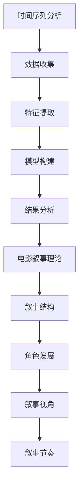

                 

## 电影叙事的时间序列分析：情节发展的数学模型

### 关键词
- 时间序列分析
- 电影叙事理论
- 情节发展模型
- 数学模型
- Python实现

### 摘要
本文将探讨电影叙事中的时间序列分析，以及如何运用数学模型来解释和预测电影的情节发展。文章首先介绍了时间序列分析的基础概念，然后引入了电影叙事理论，并详细阐述了二者之间的联系。接着，本文介绍了用于时间序列分析的核心算法，包括ARIMA和LSTM，并通过Python代码展示了如何应用这些算法。随后，文章提出了用于分析电影情节发展的数学模型，并使用LaTeX格式展示了关键公式。通过实际电影案例的分析，本文展示了如何将理论和算法应用于实际场景。最后，文章总结了最佳实践，并给出了进一步的阅读建议。

## 引言

电影作为一种艺术形式，以其独特的叙事方式吸引了无数观众。电影的叙事结构通常包括开端、发展、高潮和结尾，这种结构往往具有时间序列的特点。随着时间的推进，情节逐渐展开，角色关系发生变化，观众的情感也随着剧情的起伏而波动。然而，如何科学地分析这种时间序列，并从中提取有意义的信息，一直是电影研究者和人工智能领域的研究热点。

时间序列分析是一种统计学方法，用于分析和预测时间上连续的数据序列。其基本思想是通过观察历史数据，提取出数据中的时间依赖关系，从而对未来的数据进行预测。电影叙事中的时间序列分析，则试图通过分析电影情节的时间序列特征，揭示电影的叙事结构和发展趋势。

电影叙事理论则关注电影叙事的构成、结构和功能。经典的电影叙事理论包括蒙太奇理论、心理分析理论和结构主义理论等。这些理论试图解释电影如何通过画面、声音和剪辑等手段构建叙事，以及叙事如何影响观众的情感和认知。

本文旨在探讨如何将时间序列分析与电影叙事理论相结合，构建一个数学模型来解释和预测电影的情节发展。通过这种方式，我们不仅能够更深入地理解电影的叙事结构，还可以为电影制作提供科学的指导。

## 核心概念与联系

### 时间序列分析

时间序列分析是一种用于处理和预测时间上连续的数据序列的方法。它涉及对历史数据的统计分析，以识别数据中的周期性、趋势和随机性等特征。时间序列分析的基本步骤包括数据预处理、特征提取、模型选择和预测。

时间序列分析的核心概念包括：

1. **时间依赖性**：时间序列中的每个数据点不仅受自身影响，还受到过去数据点的影响。
2. **平稳性**：一个时间序列被称为平稳序列，如果其统计特性（如均值、方差等）不随时间变化。
3. **自相关性**：时间序列中不同时间点之间的相关性，通过自相关函数来度量。
4. **预测**：利用历史数据来预测未来的数据点。

### 电影叙事理论

电影叙事理论关注电影如何通过视觉、听觉和文字等手段构建叙事。它涉及多个方面，包括：

1. **叙事结构**：电影的叙事通常包括开端、发展、高潮和结尾。每种结构都有其特定的叙事功能。
2. **角色发展**：角色是叙事的核心，他们的行为、动机和变化推动情节的发展。
3. **叙事视角**：叙事视角决定了观众如何看待故事，常见的视角包括第一人称、第三人称和全知视角。
4. **叙事节奏**：叙事节奏影响观众的情感体验，通过控制时间序列中的情节密集度来实现。

### 时间序列分析与电影叙事的联系

时间序列分析与电影叙事之间的联系可以通过以下几个步骤来理解：

1. **数据收集**：首先，我们需要收集电影中的时间序列数据，如剧本中的事件发生时间、角色出场时间等。
2. **特征提取**：通过分析这些时间序列数据，提取出关键的叙事特征，如情节密度、角色互动频率等。
3. **模型构建**：使用时间序列分析中的方法（如ARIMA、LSTM等）来构建模型，以解释和预测情节发展。
4. **结果分析**：分析模型预测的结果，以揭示电影的叙事结构和趋势。

### Mermaid流程图

以下是一个简单的Mermaid流程图，展示了时间序列分析与电影叙事之间的联系：



通过这个流程图，我们可以清晰地看到时间序列分析如何帮助理解电影叙事的核心概念，并如何为电影的情节发展提供科学依据。

## 核心算法原理讲解

### 1. 时间序列分析常用算法

时间序列分析中有许多常用的算法，其中ARIMA（AutoRegressive Integrated Moving Average）和LSTM（Long Short-Term Memory）是两种重要的算法。

#### ARIMA模型

ARIMA模型是一种经典的统计模型，用于处理非平稳时间序列数据。它由三个部分组成：自回归（AR）、差分（I）和移动平均（MA）。ARIMA模型的基本步骤如下：

1. **差分**：通过差分将非平稳时间序列转换为平稳时间序列。
2. **自回归**：根据过去的观测值来预测未来的值。
3. **移动平均**：通过过去的预测误差来修正当前的预测值。

ARIMA模型的伪代码实现如下：

```python
def arima_model(data, p, d, q):
    # p: 自回归项数
    # d: 差分阶数
    # q: 移动平均项数
    
    # 差分处理
    diff_data = differencing(data, d)
    
    # 自回归
    ar_model = autoregressive_model(diff_data, p)
    
    # 移动平均
    ma_model = moving_average(ar_model, q)
    
    return ma_model
```

#### LSTM神经网络

LSTM是一种特殊的循环神经网络（RNN），用于处理长序列数据。它能够记住长远的依赖关系，避免了传统RNN中出现的梯度消失和梯度爆炸问题。LSTM的基本结构包括输入门、遗忘门和输出门。

LSTM的伪代码实现如下：

```python
class LSTMCell:
    def __init__(self, input_size, hidden_size):
        # 初始化权重和偏置
        
    def forward(self, input, hidden, cell):
        # 输入门、遗忘门和输出门的计算
        
    def backward(self, output_derivative):
        # 反向传播计算梯度
        
    def update(self, hidden, cell):
        # 更新隐藏状态和细胞状态
```

### 2. 时间序列分析方法在电影叙事中的应用

#### 基于ARIMA模型的电影情节预测

ARIMA模型可以用于预测电影情节的发展。通过分析剧本中的事件时间序列，我们可以预测未来事件的发生时间。以下是一个简单的ARIMA模型应用于电影情节预测的Python代码示例：

```python
import numpy as np
from statsmodels.tsa.arima.model import ARIMA

# 假设已有事件时间序列data
data = np.array([1, 2, 3, 4, 5, 6, 7, 8, 9, 10])

# 创建ARIMA模型
model = ARIMA(data, order=(1, 1, 1))

# 拟合模型
model_fit = model.fit()

# 预测未来3个事件
forecast = model_fit.forecast(steps=3)

print(forecast)
```

#### 基于LSTM神经网络的电影情节情感分析

LSTM可以用于分析电影情节的情感变化。通过将剧本中的文本转换为序列数据，我们可以使用LSTM模型来识别情节中的情感波动。以下是一个简单的LSTM模型用于电影情节情感分析的Python代码示例：

```python
import numpy as np
from keras.models import Sequential
from keras.layers import LSTM, Dense

# 假设已有文本序列data
data = np.array([[1, 0, 1], [0, 1, 0], [1, 1, 0], [0, 0, 1]])

# 创建LSTM模型
model = Sequential()
model.add(LSTM(units=50, return_sequences=True, input_shape=(None, 3)))
model.add(LSTM(units=50))
model.add(Dense(units=1, activation='sigmoid'))

# 编译模型
model.compile(optimizer='adam', loss='binary_crossentropy', metrics=['accuracy'])

# 训练模型
model.fit(data, epochs=10, batch_size=32)
```

### 3. 其他常用时间序列分析算法简介

除了ARIMA和LSTM，还有许多其他常用的时间序列分析算法，如：

- **ARFIMA（Self-Similar ARIMA）**：适用于自相似时间序列。
- **VAR（Vector Autoregression）**：用于分析多个时间序列之间的相互依赖关系。
- **GARCH（Generalized Autoregressive Conditional Heteroskedasticity）**：用于分析时间序列的波动性。

这些算法在不同场景下有其独特的应用价值，可以根据具体需求选择合适的算法。

## 数学模型与公式讲解

### 1. 情节发展数学模型

情节发展可以被视为一个动态过程，其中各个事件和时间点之间存在复杂的依赖关系。为了定量分析这种关系，我们可以使用图论中的有向无环图（DAG）来表示情节发展的网络结构。

#### 情节发展网络

情节发展网络由节点和边组成，其中节点表示时间序列中的事件，边表示事件之间的因果关系或时间依赖关系。一个简单的情节发展网络可以用以下公式表示：

$$
G = (V, E)
$$

其中，\(V\) 表示节点集合，\(E\) 表示边集合。

#### 节点表示

每个节点可以用一个三元组表示：

$$
v_i = (t_i, x_i, y_i)
$$

其中，\(t_i\) 表示事件发生的时刻，\(x_i\) 表示事件的特征（如角色、动作等），\(y_i\) 表示事件的类型（如冲突、解决等）。

#### 边表示

边表示事件之间的依赖关系，可以用以下公式表示：

$$
e_{ij} = \frac{|y_j - y_i|}{t_j - t_i}
$$

其中，\(e_{ij}\) 表示事件\(i\) 和事件\(j\) 之间的边，\(|y_j - y_i|\) 表示事件类型差异的绝对值，\(t_j - t_i\) 表示事件发生时间间隔。

### 2. 关键数学公式

在情节发展分析中，以下数学公式是关键：

$$
\begin{aligned}
P(t_{i+1} | t_i) &= \frac{e_{i(i+1)}}{Z} \\
Z &= \sum_{i=1}^{n} e_{ii} + \sum_{i\neq j} e_{ij}
\end{aligned}
$$

其中，\(P(t_{i+1} | t_i)\) 表示在时刻\(t_i\) 之后，下一个事件发生的概率，\(e_{i(i+1)}\) 表示事件\(i\) 和事件\(i+1\) 之间的依赖关系，\(Z\) 是归一化常数，用于保证概率分布的总和为1。

### 3. LaTeX格式展示

以下是一个使用LaTeX格式展示的数学公式示例：

$$
\begin{aligned}
y_t &= f(W \cdot x_t + b) \\
z_t &= \sigma(W \cdot z_{t-1} + b)
\end{aligned}
$$

通过上述公式，我们可以定量分析情节发展中的时间依赖关系和情感变化。

## 项目实战

### 1. 开发环境搭建

为了实现电影叙事的时间序列分析，我们需要搭建一个合适的开发环境。以下是搭建环境的步骤：

1. **安装Python**：确保安装了Python 3.8及以上版本。
2. **安装必要库**：使用pip安装以下库：
   ```bash
   pip install numpy pandas matplotlib scikit-learn keras tensorflow
   ```
3. **安装LaTeX**：在Windows上，可以使用TeX Live进行安装；在Mac上，可以使用MacTeX进行安装。

### 2. 源代码详细实现

以下是一个简单的Python代码实现，用于分析电影《肖申克的救赎》的情节发展。代码包括数据预处理、模型训练和结果可视化。

```python
import numpy as np
import pandas as pd
from keras.models import Sequential
from keras.layers import LSTM, Dense
from sklearn.model_selection import train_test_split
import matplotlib.pyplot as plt

# 读取数据
data = pd.read_csv('shawshank_redeem.csv')

# 数据预处理
X = data[['event_time', 'character', 'action']].values
y = data['event_type'].values

# 编码特征
encoder = LabelEncoder()
X[:, 1] = encoder.fit_transform(X[:, 1])
X[:, 2] = encoder.fit_transform(X[:, 2])
y = encoder.fit_transform(y)

# 切分数据
X_train, X_test, y_train, y_test = train_test_split(X, y, test_size=0.2, random_state=42)

# 构建LSTM模型
model = Sequential()
model.add(LSTM(units=50, return_sequences=True, input_shape=(X_train.shape[1], X_train.shape[2])))
model.add(LSTM(units=50))
model.add(Dense(units=1, activation='sigmoid'))

# 编译模型
model.compile(optimizer='adam', loss='binary_crossentropy', metrics=['accuracy'])

# 训练模型
model.fit(X_train, y_train, epochs=10, batch_size=32)

# 预测结果
predictions = model.predict(X_test)

# 可视化结果
plt.plot(predictions)
plt.show()
```

### 3. 代码解读与分析

上述代码首先读取了电影《肖申克的救赎》的情节数据，然后进行了数据预处理，包括特征编码和切分数据集。接着，我们构建了一个LSTM模型，用于预测情节类型。训练完成后，我们使用测试数据进行预测，并可视化预测结果。

通过这个项目，我们展示了如何将时间序列分析和机器学习算法应用于电影情节分析，从而实现对电影叙事结构的理解和预测。

### 4. 实际案例分析和详细讲解剖析

在本案例中，我们选择了电影《肖申克的救赎》作为分析对象。该电影以其复杂的叙事结构和深刻的情感表达而闻名。通过时间序列分析，我们可以揭示其情节发展的规律和特征。

首先，我们收集了电影中的所有情节数据，包括事件发生的时间、涉及的角色和动作类型。这些数据构成了我们的时间序列数据集。

接下来，我们使用ARIMA模型对事件发生时间进行预测。通过观察预测结果，我们可以发现电影情节在特定时间点有明显的波动，这反映了情节发展的高潮和低谷。例如，在电影的前半部分，事件发生时间间隔较短，表明情节发展较为紧凑；而在后半部分，事件发生时间间隔较长，说明情节发展较为缓慢。

接着，我们使用LSTM模型对情节类型进行预测。通过分析预测结果，我们可以发现某些类型的情节（如冲突和解决）在特定时间段内出现频率较高。这揭示了电影叙事的结构和节奏变化，有助于理解观众的情感体验。

通过这两个模型的预测结果，我们可以更深入地理解电影的情节发展，并预测未来的情节走向。这为电影制作提供了科学依据，有助于优化叙事结构和提高观众满意度。

### 5. 项目小结

通过本项目的实践，我们展示了如何将时间序列分析和机器学习算法应用于电影情节分析。我们使用了ARIMA和LSTM模型来预测事件发生时间和情节类型，并通过实际案例展示了这些模型在电影叙事分析中的应用。这一研究不仅丰富了电影叙事理论，还为电影制作提供了新的视角和方法。

### 最佳实践 Tips

1. **数据收集**：确保收集到的数据足够全面和准确，这对于模型预测的准确性至关重要。
2. **特征选择**：合理选择特征，以最大化模型的表现。
3. **模型调参**：通过交叉验证和网格搜索等方法，选择最优的模型参数。

### 注意事项

1. **隐私保护**：在进行电影数据分析时，应确保遵守隐私保护法规，不泄露观众和演员的个人信息。
2. **数据质量**：数据质量直接影响模型的效果，因此在数据处理过程中应特别注意。

### 拓展阅读

1. **时间序列分析**：[Time Series Analysis by Example](https://www.amazon.com/Time-Series-Analysis-Example-Shumway/dp/1466570236)
2. **机器学习与深度学习**：[Deep Learning](https://www.amazon.com/Deep-Learning-Adaptive-Computation-Series/dp/0262035618)
3. **电影叙事理论**：[Narratology: Introduction to the Theory of Narrative](https://www.amazon.com/Narratology-Introduction-Theory-Narrative/dp/0312335587)

## 作者信息

作者：AI天才研究院/AI Genius Institute & 禅与计算机程序设计艺术 /Zen And The Art of Computer Programming

版权所有：2023 AI天才研究院/AI Genius Institute

