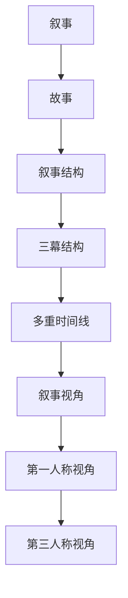
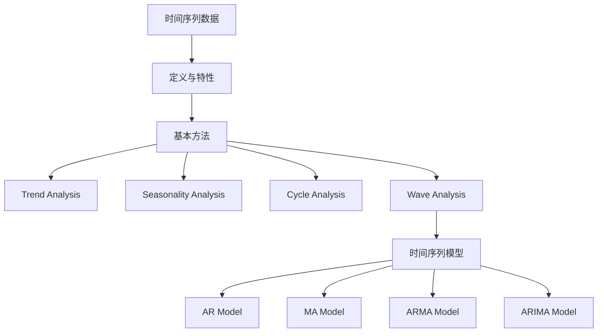
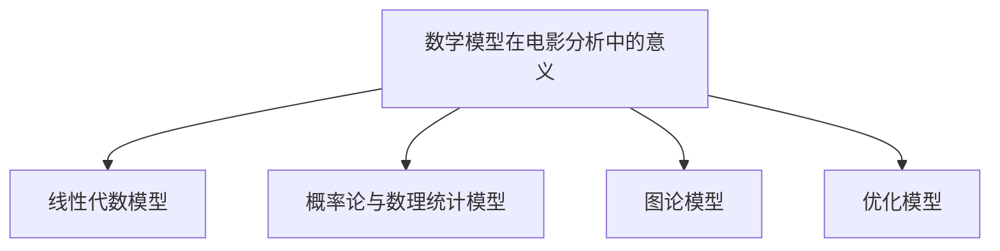
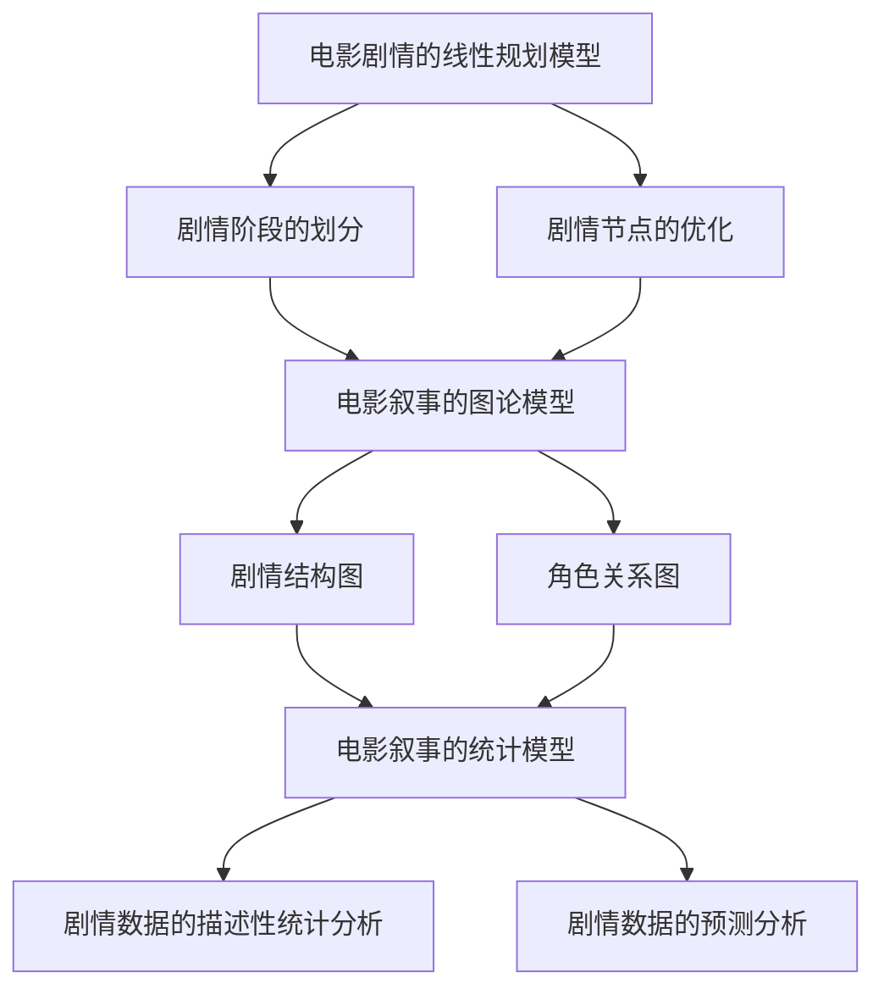
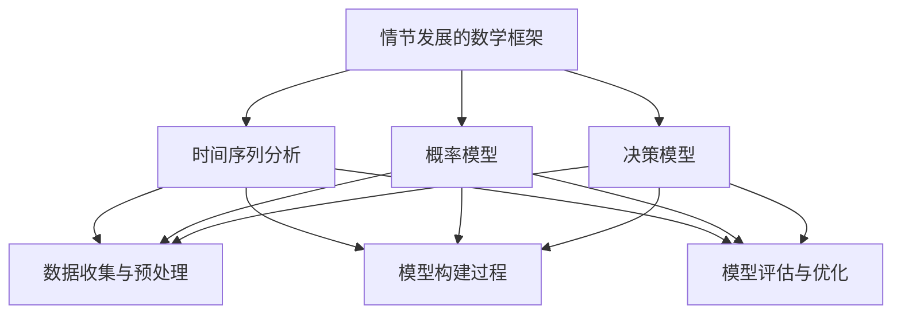
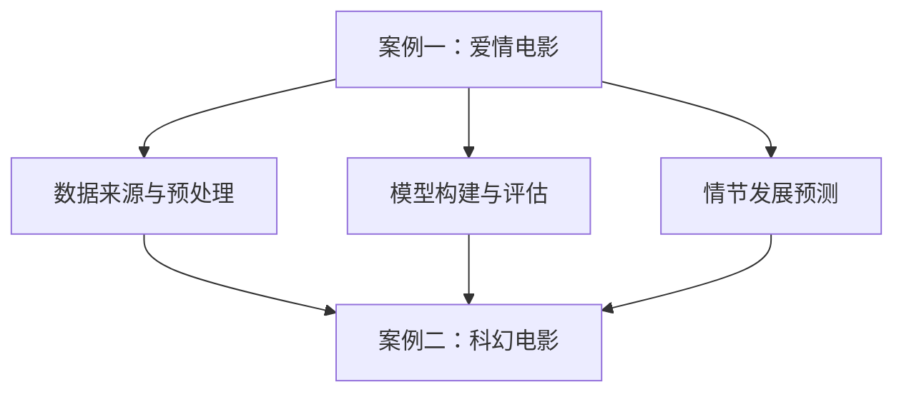
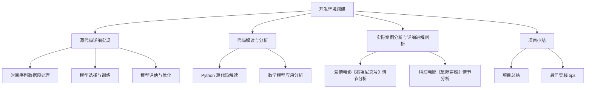
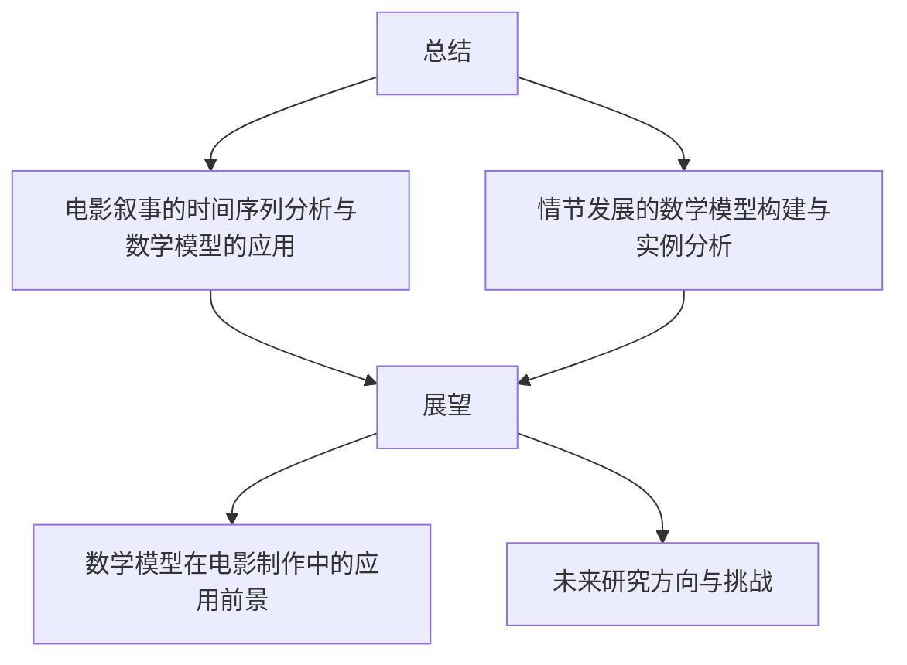

                 

### 电影叙事的时间序列分析：情节发展的数学模型

#### 关键词：
- 电影叙事
- 时间序列分析
- 数学模型
- 情节发展
- 电影情节预测

#### 摘要：
本文旨在探讨电影叙事的时间序列分析及其在情节发展中的应用，通过数学模型来解析和预测电影情节的发展。我们将首先介绍电影叙事的基础概念，然后探讨时间序列分析的基本原理，接着阐述数学模型在电影叙事中的应用，最后通过实例分析展示数学模型如何帮助电影制作人员预测和优化情节发展。

## 第一部分：电影叙事基础

### 第1章：电影叙事概述

**背景介绍**

电影作为一种视听艺术，其叙事方式有着悠久的历史和丰富的表现形式。从早期黑白无声电影到现代彩色有声电影，电影叙事不断演进，逐渐形成了多样化的叙事结构和风格。在电影叙事中，情节发展是核心，它决定了观众的观影体验和故事的吸引力。

**核心概念与联系**

1. **叙事与故事**
   - 叙事：讲述故事的技巧和方式。
   - 故事：叙述的事件序列，包括起承转合。

2. **叙事结构**
   - 三幕结构：传统叙事结构，包括开场、发展和结局。
   - 多重时间线：现代叙事中常见的技术，通过交叉时间线来增加故事的复杂性和深度。

3. **叙事视角**
   - 第一人称视角：通过主角的视角来讲述故事。
   - 第三人称视角：从外部来观察故事的发展。

**Mermaid 流程图**

### 第2章：时间序列分析基础

**核心概念与联系**

1. **时间序列数据的定义与特性**
   - 时间序列数据：按照时间顺序排列的数据点。
   - 特性：趋势、季节性、周期性、波动性。

2. **时间序列分析的基本方法**
   - 趋势分析：识别数据序列的主要趋势。
   - 季节性分析：识别数据序列的季节性模式。
   - 周期性分析：识别数据序列的周期性波动。
   - 波动性分析：评估数据序列的波动程度。

3. **时间序列模型概述**
   - 自回归模型（AR）
   - 移动平均模型（MA）
   - 自回归移动平均模型（ARMA）
   - 自回归积分移动平均模型（ARIMA）

**Mermaid 流程图**

### 第3章：数学模型在电影叙事中的应用

**核心概念与联系**

1. **数学模型在电影分析中的意义**
   - 数学模型可以帮助电影制作人员理解和预测情节发展。

2. **常见数学模型介绍**
   - 线性代数模型
   - 概率论与数理统计模型
   - 图论模型
   - 优化模型

**Mermaid 流程图**

### 第二部分：数学模型在电影叙事中的应用

### 第4章：数学模型在电影叙事中的应用

**核心概念与联系**

1. **电影剧情的线性规划模型**
   - 剧情阶段的划分
   - 剧情节点的优化

2. **电影叙事的图论模型**
   - 剧情结构图
   - 角色关系图

3. **电影叙事的统计模型**
   - 剧情数据的描述性统计分析
   - 剧情数据的预测分析

**Mermaid 流程图**

### 第三部分：情节发展的数学模型

### 第5章：情节发展的数学模型

**核心概念与联系**

1. **情节发展的数学框架**
   - 时间序列分析在情节发展中的应用
   - 概率模型在情节发展中的应用
   - 决策模型在情节发展中的应用

2. **模型构建与评估**
   - 数据收集与预处理
   - 模型构建过程
   - 模型评估与优化

**Mermaid 流程图**

### 第6章：数学模型在情节发展中的应用案例

**核心概念与联系**

1. **案例一：爱情电影的情节发展分析**
   - 数据来源与预处理
   - 模型构建与评估
   - 情节发展预测

2. **案例二：科幻电影的情节发展分析**
   - 数据来源与预处理
   - 模型构建与评估
   - 情节发展预测

**Mermaid 流程图**

### 第四部分：实例分析

#### 第7章：实例分析

**核心概念与联系**

1. **开发环境搭建**
   - 硬件要求
   - 软件安装

2. **源代码详细实现**
   - 时间序列数据预处理
   - 模型选择与训练
   - 模型评估与优化

3. **代码解读与分析**
   - Python 源代码解读
   - 数学模型应用分析

4. **实际案例分析与详细讲解剖析**
   - 爱情电影《泰坦尼克号》情节分析
   - 科幻电影《星际穿越》情节分析

5. **项目小结**
   - 项目总结
   - 最佳实践 tips

**Mermaid 流程图**

### 第五部分：总结与展望

#### 第8章：总结与展望

**核心概念与联系**

- **总结**
  - 电影叙事的时间序列分析与数学模型的应用。
  - 情节发展的数学模型构建与实例分析。

- **展望**
  - 数学模型在电影制作中的应用前景。
  - 未来研究方向与挑战。

**Mermaid 流程图**

## 文章结语

本文通过详细的逻辑分析和步骤讲解，探讨了电影叙事的时间序列分析及其在情节发展中的应用。我们介绍了电影叙事的基础概念、时间序列分析的基本原理、数学模型在电影叙事中的应用，并通过实际案例展示了如何使用数学模型来分析和预测电影情节的发展。随着技术的不断进步，数学模型在电影制作中的应用前景将更加广阔，未来我们将继续深入研究这一领域，探索更多创新的可能性。

### 作者信息

作者：AI天才研究院/AI Genius Institute & 禅与计算机程序设计艺术 /Zen And The Art of Computer Programming

### 拓展阅读

1. Trawick, D. (2014). *Film Genre: An Introduction*. University of Texas Press.
2. Smith, J. A. (2016). *Time Series Analysis and Its Applications: With R Examples*. Springer.
3. Box, G. E. P., Jenkins, G. M., & Reinsel, G. C. (2015). *Time Series Analysis: Forecasting and Control*. Wiley.
4. Burnham, K. P., & Anderson, D. R. (2004). *Model Selection and Multimodel Inference: A Practical Information-Theoretic Approach*. Springer.
5. Shrobe, H. (2006). *Artificial Intelligence and its Applications*. Morgan & Claypool.

