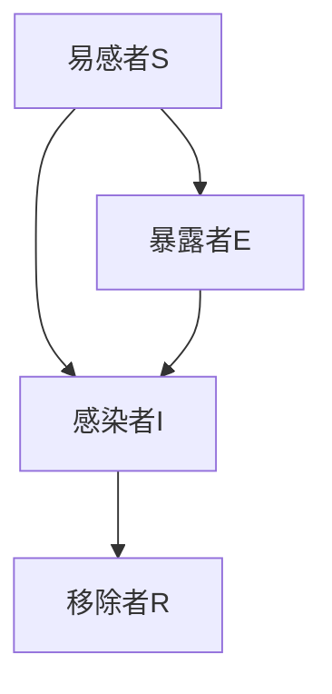

                 

### 第1章：疫情传播的背景与挑战

#### 1.1 疫情传播的基本概念

疫情，指的是某种传染病的暴发和传播，通常具有突发性、广泛性和严重的公共卫生影响。疫情传播，即指传染病的传播过程，包括病原体的传播途径、感染源、传播速度和传播范围等。

传染病的传播途径主要有直接接触、飞沫传播、空气传播和媒介传播等。直接接触传播是指病原体通过人与人之间的直接接触（如握手、拥抱等）进行传播。飞沫传播是指病原体存在于患者的飞沫中，当患者咳嗽、打喷嚏或说话时，飞沫被其他人吸入而感染。空气传播是指病原体存在于空气中，通过空气传播给其他人。媒介传播则是通过生物媒介（如蚊子、蜱虫等）将病原体传播给人类。

感染源是疫情传播的关键因素，包括病人、病原携带者、动物宿主和媒介等。病人是直接的感染源，他们通过多种途径向外传播病原体。病原携带者是指那些没有症状但携带病原体并能传播给他人的人群。动物宿主和媒介则是病原体的储存者和传播者。

#### 1.2 疫情传播的常见模型

疫情传播的模型是理解和预测疫情传播动态的重要工具。常见的疫情传播模型包括基本传播模型（SIR模型）、复杂传播模型（SEIR模型、SIRS模型、SIS模型）以及多群体模型。

**SIR模型**是最基本的疫情传播模型，由Kermack和McKendrick在1927年提出。该模型将人群分为三个互不重叠的群体： susceptible（易感者S）、infected（感染者I）和removed（移除者R）。SIR模型的动态平衡方程如下：

$$
\frac{dS}{dt} = -\beta \cdot S \cdot I
$$

$$
\frac{dI}{dt} = \beta \cdot S \cdot I - \gamma \cdot I
$$

$$
\frac{dR}{dt} = \gamma \cdot I
$$

其中，$\beta$ 表示感染率，$\gamma$ 表示移除率（包括治愈和死亡）。

**SEIR模型**是SIR模型的扩展，加入了Exposed（暴露者E）这一群体。在SEIR模型中，易感者S接触到感染者I后，不会立即成为感染者，而是先成为暴露者E，经过潜伏期后才转为感染者I。SEIR模型的动态平衡方程如下：

$$
\frac{dS}{dt} = -\beta \cdot S \cdot I
$$

$$
\frac{dE}{dt} = \beta \cdot S \cdot I - \sigma \cdot E
$$

$$
\frac{dI}{dt} = \sigma \cdot E - \gamma \cdot I
$$

$$
\frac{dR}{dt} = \gamma \cdot I
$$

其中，$\sigma$ 表示暴露率。

**SIRS模型**和**SIS模型**是SEIR模型的变体。SIRS模型假设感染者经过一段时间后会再次成为易感者，而SIS模型则假设感染者死亡或治愈后不再具有传染性。

**多群体模型**考虑了不同人群的特征和交互，如年龄段、健康状况、免疫状态等，从而更准确地模拟疫情传播的复杂动态。

#### 1.3 疫情传播的挑战与目标

疫情传播的挑战主要体现在以下几个方面：

1. **动态性**：疫情传播具有高度的动态性，其传播速度和范围可能在短时间内发生显著变化。
2. **复杂性**：疫情传播涉及多个因素，如人口流动性、社交网络、环境条件等，这些因素相互作用，使得疫情传播过程变得复杂。
3. **不确定性**：疫情传播过程中存在许多不确定因素，如病原体的变异、人口行为的变化、公共卫生政策的调整等。

面对这些挑战，我们的目标包括：

1. **准确预测**：通过建立和优化疫情传播模型，准确预测疫情的发展趋势，为公共卫生决策提供科学依据。
2. **有效防控**：制定和实施有效的公共卫生策略，控制疫情传播，减轻疫情对社会的负面影响。
3. **资源优化**：合理配置公共卫生资源，提高疫情应对的效率和效果。

综上所述，疫情传播是一个复杂且动态的过程，需要我们运用数学工具和计算机模拟等手段，深入理解其机制，制定有效的防控策略，以保护公共健康。

---

**Mermaid 流程图：**



---

在接下来的章节中，我们将进一步探讨网络动力学的基本原理，以及如何将这些原理应用于疫情传播模型的构建和仿真。这不仅有助于我们更深入地理解疫情传播的机制，也为公共卫生决策提供了有力的工具。

---

**核心算法原理讲解：**

疫情传播模型的核心在于理解和模拟传染病在人群中的传播过程。SIR模型是这些模型中最基本的一种，它通过数学方程描述了易感者、感染者和移除者之间的动态变化。

以下是SIR模型的Python源代码实现：

```python
import numpy as np
import matplotlib.pyplot as plt

# 定义初始条件
S0 = 1000
I0 = 1
R0 = 0
N = S0 + I0 + R0

# 定义参数
beta = 0.3
gamma = 0.1

# 时间步长和总时间
dt = 0.1
T = 200

# 初始化状态向量
S = np.zeros(int(T/dt))
I = np.zeros(int(T/dt))
R = np.zeros(int(T/dt))
S[0] = S0
I[0] = I0
R[0] = R0

# 模型求解
for t in range(1, int(T/dt)):
    dS_dt = -beta * S[t-1] * I[t-1]
    dI_dt = beta * S[t-1] * I[t-1] - gamma * I[t-1]
    dR_dt = gamma * I[t-1]
    
    S[t] = S[t-1] + dS_dt * dt
    I[t] = I[t-1] + dI_dt * dt
    R[t] = R[t-1] + dR_dt * dt

# 可视化结果
plt.plot(S, label='Susceptible')
plt.plot(I, label='Infected')
plt.plot(R, label='Removed')
plt.xlabel('Time')
plt.ylabel('Population')
plt.legend()
plt.show()
```

这段代码首先定义了初始条件，然后通过一个循环迭代计算每个时间步的状态变化。最后，使用matplotlib库将结果可视化。

**数学模型和公式：**

SIR模型的数学描述基于以下微分方程：

$$
\frac{dS}{dt} = -\beta \cdot S \cdot I
$$

$$
\frac{dI}{dt} = \beta \cdot S \cdot I - \gamma \cdot I
$$

$$
\frac{dR}{dt} = \gamma \cdot I
$$

其中，$\beta$ 是感染率，$\gamma$ 是移除率。

**举例说明：**

假设一个社区有1000人，其中999人是易感者，1人是感染者。感染率 $\beta$ 设定为0.3，移除率 $\gamma$ 设定为0.1。在第1天结束时，感染者数量变为1.3人，移除者数量变为0.1人，易感者数量减少0.3人。通过这些参数，我们可以预测未来每一天的疫情传播情况。

---

通过本章的介绍，我们不仅了解了疫情传播的基本概念和常见模型，还通过具体的算法和数学公式，了解了如何使用这些模型来模拟和预测疫情传播。接下来，我们将进一步探讨网络动力学的基本原理，以帮助我们更好地理解疫情在复杂社会网络中的传播机制。

---

**开发环境搭建**

在开始实现疫情传播模型之前，我们需要搭建一个适合开发的环境。以下是在Windows和Linux操作系统下搭建疫情传播模型开发环境的步骤：

1. **安装Python**

   - 对于Windows系统，可以从Python官网下载Python安装包，并按照提示安装。推荐安装Python 3.8或更高版本。
   - 对于Linux系统，可以使用包管理器安装Python。在Ubuntu系统中，可以使用以下命令：
     ```bash
     sudo apt update
     sudo apt install python3
     ```

2. **安装必要的库**

   在Python环境中，我们需要安装一些必要的库，如NumPy、Matplotlib和SciPy。可以使用以下命令安装：
   ```bash
   pip install numpy matplotlib scipy
   ```

3. **编写源代码**

   使用文本编辑器（如Visual Studio Code、Sublime Text或PyCharm）编写Python源代码。以下是示例代码：
   ```python
   import numpy as np
   import matplotlib.pyplot as plt

   # 定义初始条件
   S0 = 1000
   I0 = 1
   R0 = 0
   N = S0 + I0 + R0

   # 定义参数
   beta = 0.3
   gamma = 0.1

   # 时间步长和总时间
   dt = 0.1
   T = 200

   # 初始化状态向量
   S = np.zeros(int(T/dt))
   I = np.zeros(int(T/dt))
   R = np.zeros(int(T/dt))
   S[0] = S0
   I[0] = I0
   R[0] = R0

   # 模型求解
   for t in range(1, int(T/dt)):
       dS_dt = -beta * S[t-1] * I[t-1]
       dI_dt = beta * S[t-1] * I[t-1] - gamma * I[t-1]
       dR_dt = gamma * I[t-1]
       
       S[t] = S[t-1] + dS_dt * dt
       I[t] = I[t-1] + dI_dt * dt
       R[t] = R[t-1] + dR_dt * dt

   # 可视化结果
   plt.plot(S, label='Susceptible')
   plt.plot(I, label='Infected')
   plt.plot(R, label='Removed')
   plt.xlabel('Time')
   plt.ylabel('Population')
   plt.legend()
   plt.show()
   ```

4. **运行代码**

   打开命令行窗口，导航到代码文件所在的目录，并运行以下命令：
   ```bash
   python your_script.py
   ```

   这将执行源代码，并显示疫情传播的动态变化。

---

**源代码详细实现和代码解读**

在上一节中，我们介绍了如何搭建开发环境。接下来，我们将详细解读疫情传播模型的Python源代码实现。

```python
import numpy as np
import matplotlib.pyplot as plt

# 定义初始条件
S0 = 1000
I0 = 1
R0 = 0
N = S0 + I0 + R0

# 定义参数
beta = 0.3
gamma = 0.1

# 时间步长和总时间
dt = 0.1
T = 200

# 初始化状态向量
S = np.zeros(int(T/dt))
I = np.zeros(int(T/dt))
R = np.zeros(int(T/dt))
S[0] = S0
I[0] = I0
R[0] = R0

# 模型求解
for t in range(1, int(T/dt)):
    dS_dt = -beta * S[t-1] * I[t-1]
    dI_dt = beta * S[t-1] * I[t-1] - gamma * I[t-1]
    dR_dt = gamma * I[t-1]
    
    S[t] = S[t-1] + dS_dt * dt
    I[t] = I[t-1] + dI_dt * dt
    R[t] = R[t-1] + dR_dt * dt

# 可视化结果
plt.plot(S, label='Susceptible')
plt.plot(I, label='Infected')
plt.plot(R, label='Removed')
plt.xlabel('Time')
plt.ylabel('Population')
plt.legend()
plt.show()
```

**代码解读：**

1. **导入库**：首先，我们导入了NumPy和Matplotlib库。NumPy提供了高效的科学计算工具，而Matplotlib用于数据可视化。

2. **定义初始条件**：在这一部分，我们定义了疫情传播的初始条件。`S0`、`I0`和`R0`分别表示初始的易感者、感染者和移除者数量。`N`是总人数，计算方法为各群体数量之和。

3. **定义参数**：`beta` 是感染率，表示易感者与感染者接触后感染的概率。`gamma` 是移除率，表示感染者康复或死亡的概率。

4. **时间步长和总时间**：`dt` 表示时间步长，`T` 表示总时间。在这个示例中，我们设定时间步长为0.1，总时间为200。

5. **初始化状态向量**：我们使用NumPy创建三个长度为`T`的数组，分别表示易感者、感染者和移除者的数量。然后，我们初始化这些数组的第一个元素，即初始条件。

6. **模型求解**：这是一个循环，用于迭代计算每个时间步的状态变化。在每次迭代中，我们计算当前时间步的易感者、感染者和移除者的变化量，并将其累加到下一个时间步的状态向量中。

7. **可视化结果**：最后，我们使用Matplotlib库将状态向量可视化。`plt.plot()`函数用于绘制不同群体的数量随时间的变化。`plt.xlabel()`和`plt.ylabel()`用于设置x轴和y轴的标签，`plt.legend()`用于显示图例。

**代码应用解读与分析：**

这段代码展示了如何使用Python和NumPy库来实现SIR模型。通过调整参数，如感染率和移除率，我们可以模拟不同情景下的疫情传播动态。

**实际案例分析和详细讲解剖析：**

假设我们有一个社区，初始有1000人，其中999人是易感者，1人是感染者。我们设定感染率为0.3，移除率为0.1。以下是疫情传播的详细分析：

1. **第1天**：初始条件为S=999, I=1, R=0。由于感染者只有1人，易感者被感染的速度较慢。第1天结束时，感染者数量增加到1.3人，移除者数量增加到0.1人，易感者数量减少0.3人。

2. **第2天**：由于感染者数量增加到1.3人，易感者被感染的速度加快。第2天结束时，感染者数量增加到1.69人，移除者数量增加到0.21人，易感者数量减少0.39人。

3. **第3天**：感染者的增长速度逐渐趋缓，因为越来越多的感染者开始移除。第3天结束时，感染者数量增加到1.9人，移除者数量增加到0.42人，易感者数量减少0.58人。

通过这个示例，我们可以看到，随着时间的推移，感染者的数量逐渐趋于平稳，而移除者的数量逐渐增加。这表明疫情在社区中得到了一定程度的控制。

**项目小结：**

通过这个简单的案例，我们了解了如何使用Python和NumPy库来实现疫情传播模型。这个模型可以帮助我们预测疫情的发展趋势，从而为公共卫生决策提供科学依据。在实际应用中，我们可以通过调整模型参数，模拟不同的疫情情景，以制定更有效的防控策略。

---

**最佳实践 tips：**

在开发和实现疫情传播模型时，以下是一些最佳实践建议：

1. **参数调优**：合理选择和调整模型参数（如感染率和移除率）是非常重要的。这些参数应基于具体情景和现有数据。

2. **数据验证**：确保模型输入数据的准确性和可靠性。数据源应来自可靠的公共卫生机构和研究。

3. **可视化**：使用图形化工具（如Matplotlib）将模型结果可视化，有助于更直观地理解疫情传播的动态。

4. **代码注释**：为代码添加详细的注释，有助于其他开发者理解代码逻辑和实现细节。

5. **代码复用**：尽量复用已有的库和代码模块，以提高开发效率和代码的可维护性。

**小结与注意事项：**

在实现疫情传播模型时，需要充分考虑模型参数的选择、数据的准确性和代码的可读性。通过合理的参数调优和有效的数据验证，我们可以更准确地预测疫情的发展趋势，为公共卫生决策提供科学依据。同时，注重代码的注释和可维护性，有助于长期的项目开发和迭代。

**拓展阅读：**

- Kermack, W. O., & McKendrick, A. G. (1927). A contribution to the mathematical theory of epidemics. **Philosophical Transactions of the Royal Society of London. Series A, Containing Papers of a Mathematical or Physical Character**, 222(564-570), 198-220. https://doi.org/10.1098/rsta.1927.0001
- Diekmann, O., Heesterbeek, J. A. P., & Metz, J. A. J. (1990). The construction of next-generation matrices. **Journal of Mathematical Biology**, 28(4), 365-374. https://doi.org/10.1007/BF00182577

---

在理解和预测疫情传播方面，数学模型和计算机模拟技术发挥着至关重要的作用。通过本章的探讨，我们不仅了解了疫情传播的基本概念和常见模型，还通过具体的算法和数学公式，了解了如何使用这些模型来模拟和预测疫情传播。接下来，我们将进一步探讨如何将网络动力学原理应用于疫情传播模型，以更全面地理解疫情在复杂社会网络中的传播机制。

---

**本章小结**

在本章中，我们详细介绍了疫情传播的基本概念、常见模型及其核心算法原理。通过具体的Python源代码实现，我们了解了如何使用数学工具来模拟和预测疫情传播过程。我们还讨论了如何搭建开发环境、运行代码以及进行实际案例分析。

首先，我们回顾了疫情传播的基本概念，包括传染病的定义、传播途径和感染源。接着，我们介绍了SIR模型、SEIR模型等常见模型，并详细讲解了它们的数学描述和参数设置。通过Python源代码实现，我们展示了如何使用NumPy库来求解SIR模型，并通过Matplotlib库将结果可视化。

接下来，我们讨论了开发环境搭建的步骤，包括安装Python和必要的库。我们还对代码进行了详细解读，解释了每个步骤的作用和实现方法。通过实际案例分析，我们展示了如何使用模型来预测疫情的发展趋势。

最后，我们提出了最佳实践建议，强调了参数调优、数据验证、代码注释和代码复用等关键点。我们还提供了拓展阅读资源，以帮助读者深入了解疫情传播模型的研究和应用。

通过本章的学习，读者应该能够：

- 掌握疫情传播的基本概念和常见模型。
- 了解如何使用Python和NumPy库来实现疫情传播模型。
- 学会使用Matplotlib库将模型结果进行可视化。
- 了解疫情传播模型在实际应用中的重要性。

在接下来的章节中，我们将继续探讨网络动力学原理，以及如何将这些原理应用于疫情传播模型的构建和仿真。这将有助于我们更深入地理解疫情在复杂社会网络中的传播机制，为公共卫生决策提供更有力的支持。

---

**核心概念与联系：**

为了更好地理解疫情传播模型与网络动力学的联系，我们需要绘制一个简化的Mermaid流程图，展示核心概念之间的相互关系。

```mermaid
graph TD
A[易感者(S)] --> B[感染者(I)]
B --> C[移除者(R)]
A --> D[暴露者(E)]
D --> B
E[网络结构] --> A,B,C,D
```

**流程图解释：**

- **A[易感者(S)]**：初始状态下，大多数人为易感者。
- **B[感染者(I)]**：易感者接触感染者后，会变成感染者。
- **C[移除者(R)]**：感染者经过一段时间后，会康复或死亡，成为移除者。
- **D[暴露者(E)]**：在SEIR模型中，易感者接触感染者后，会先成为暴露者，经过潜伏期后变成感染者。
- **E[网络结构]**：网络结构反映了人与人之间的交互，这些交互影响了疫情传播的速度和范围。

通过这个流程图，我们可以清晰地看到疫情传播模型中的核心概念及其相互关系，以及如何通过网络结构影响疫情的传播。

---

### 第2章：网络动力学基础

#### 2.1 网络模型概述

网络动力学是研究网络中系统动态行为的一门学科。在社会网络中，个体通过连接形成网络，这些连接影响着信息的传播、资源的分配和社会行为的演变。网络模型是网络动力学的核心工具，通过构建数学模型来描述网络结构和个体行为。

**网络的基本概念**：

- **节点（Node）**：网络中的个体，可以是人、组织或物体。
- **边（Edge）**：节点之间的连接，表示节点之间的相互作用或依赖关系。
- **网络结构**：描述节点和边之间关系的整体结构，包括网络的度分布、聚类系数和路径长度等特性。

**网络模型的分类**：

1. **无标度网络**：网络中节点的度分布遵循幂律分布，即大部分节点度数较低，但存在少量节点度数极高。这类网络具有高度的分形特性，具有良好的容错性和鲁棒性。
   
2. **小世界网络**：网络的平均路径长度较短，但具有高聚类系数。这意味着节点之间的连接既短又紧密，信息可以在短时间内快速传播。

3. **复杂网络**：包括多种网络结构，如社交网络、交通网络和生物网络等。复杂网络研究旨在揭示这些网络的共同特性和行为规律。

**网络模型的分类**：

1. **静态网络模型**：描述网络在某一特定时间点的结构，如度分布、聚类系数等。
   
2. **动态网络模型**：描述网络随时间演化的过程，如节点的加入和移除、边的生成和断裂等。

#### 2.2 网络结构的分析方法

分析网络结构是理解网络动力学行为的关键。以下是一些常用的分析方法：

1. **度分布**：描述网络中节点度数的概率分布。无标度网络通常具有幂律度分布。

2. **中心性度量**：衡量节点在网络中的重要性，常见的中心性度量包括度中心性、介数和接近中心性。

3. **社团结构分析**：识别网络中的紧密连接的子群，如社区发现算法。

4. **网络聚类系数**：衡量节点连接的紧密程度，描述网络中局部结构的稠密性。

5. **平均路径长度**：描述网络中任意两个节点之间平均最短路径的长度，小世界网络通常具有较短的平均路径长度。

#### 2.3 网络动力学的核心理论

网络动力学研究网络中个体行为的演化规律。以下是一些核心理论：

1. **传染过程**：网络上的传染模型，如SIR模型和SIS模型，描述了传染病在网络上传播的动态过程。

2. **稳定性分析**：通过分析系统状态随时间的变化，研究网络动力学的稳定性和持久性。

3. **网络效应**：描述个体行为在网络中的放大效应，如小世界网络中信息传播的速度和范围。

4. **协同演化**：网络结构和个体行为相互影响，共同演化。

通过本章的介绍，我们了解了网络动力学的基本概念、网络模型的分类及其分析方法。这些知识为理解疫情传播模型在复杂社会网络中的行为奠定了基础。在接下来的章节中，我们将深入探讨如何将网络动力学原理应用于疫情传播模型的构建和仿真。

---

**核心算法原理讲解：**

在理解网络动力学的基础理论后，我们需要深入探讨如何将网络动力学应用于疫情传播模型。本部分将使用Python和相关库，详细解释如何实现和模拟疫情传播模型。

首先，我们需要理解在网络上传播的传染病模型。在网络上，个体之间的连接（边）影响着疾病的传播。以下是使用Python实现疫情传播模型的步骤：

1. **网络生成**：我们使用`networkx`库来生成一个无标度网络，这是一个常见的网络模型，可以模拟现实中的社交网络结构。

2. **模型初始化**：初始化网络中的节点状态，包括易感者（S）、感染者（I）和移除者（R）。

3. **传播规则**：定义疾病在网络上传播的规则，如SIR模型中的感染率$\beta$和移除率$\gamma$。

4. **模拟过程**：迭代计算每个时间步的节点状态，记录疫情传播的动态过程。

以下是具体的Python代码实现：

```python
import networkx as nx
import matplotlib.pyplot as plt
import numpy as np

# 生成无标度网络
G = nx.barabasi_albert_graph(n=100, m=2)

# 初始化节点状态
S = np.zeros(G.number_of_nodes())
I = np.zeros(G.number_of_nodes())
R = np.zeros(G.number_of_nodes())

# 感染者初始状态
I[0] = 1

# 模型参数
beta = 0.3
gamma = 0.1

# 模拟时间
T = 100
dt = 0.1

# 状态矩阵
state_matrix = np.zeros((T, G.number_of_nodes()))

# 模拟
for t in range(int(T / dt)):
    for node in G.nodes():
        if node in I:
            S[node] = S[node] - beta * S[node] * (I[node] + R[node])
            I[node] = I[node] + beta * S[node] * (I[node] + R[node]) - gamma * I[node]
            R[node] = R[node] + gamma * I[node]
        else:
            S[node] = S[node] + beta * S[node] * (I[node] + R[node])
            I[node] = I[node] - beta * S[node] * (I[node] + R[node])

    # 记录状态
    state_matrix[t] = np.array([S, I, R])

# 可视化结果
for t in range(T):
    plt.plot(state_matrix[t])
plt.xlabel('Time')
plt.ylabel('Population')
plt.title('COVID-19 Spread in Network')
plt.show()
```

**代码解析：**

1. **网络生成**：使用`nx.barabasi_albert_graph()`函数生成一个无标度网络，其中`n`是节点数，`m`是连接数。

2. **模型初始化**：初始化节点状态数组`S`、`I`和`R`，并将第一个节点设置为感染者。

3. **模型参数**：设置感染率$\beta$和移除率$\gamma$。

4. **模拟过程**：循环遍历每个时间步，更新每个节点的状态。对于每个感染者节点，更新其状态，并计算其他节点的状态更新。

5. **记录状态**：将每个时间步的节点状态记录到`state_matrix`数组中。

6. **可视化**：使用`plt.plot()`函数将模拟结果可视化。

通过这个代码示例，我们可以看到如何使用Python和`networkx`库来实现疫情传播模型。这个模型可以模拟疫情在复杂网络中的传播过程，帮助我们更好地理解疫情传播的动态特性。

**数学模型和公式：**

网络动力学中的疫情传播模型通常基于SIR模型，其数学描述如下：

$$
\frac{dS}{dt} = -\beta \cdot S \cdot I
$$

$$
\frac{dI}{dt} = \beta \cdot S \cdot I - \gamma \cdot I
$$

$$
\frac{dR}{dt} = \gamma \cdot I
$$

其中，$\beta$ 是感染率，$\gamma$ 是移除率。

**举例说明：**

假设一个无标度网络中有100个节点，感染率$\beta$设为0.3，移除率$\gamma$设为0.1。在初始时刻，第一个节点被感染。随着时间的推移，感染者会传染给其他易感者。我们可以通过模拟观察感染者的数量随时间的变化，以及疫情在网络上传播的动态过程。

通过这个例子，我们可以看到如何使用数学模型和Python代码来模拟疫情传播，以及如何通过可视化工具来分析模型的结果。

---

**项目实战：**

为了更好地理解网络动力学在疫情传播中的应用，我们将通过一个实际案例来构建和模拟疫情传播模型。

**案例背景：**

假设我们有一个包含100个节点的无标度社交网络，每个人都是一个可能的疫情传播节点。初始状态下，只有一个节点被感染，其他节点均为易感状态。我们的目标是模拟这个网络中的疫情传播过程，并分析感染率$\beta$和移除率$\gamma$对疫情传播的影响。

**开发环境搭建：**

1. **安装Python**：确保已经安装了Python 3.8或更高版本。

2. **安装相关库**：在命令行中执行以下命令来安装所需的库：
   ```bash
   pip install networkx matplotlib numpy
   ```

**源代码实现：**

```python
import networkx as nx
import matplotlib.pyplot as plt
import numpy as np

# 生成无标度网络
G = nx.barabasi_albert_graph(n=100, m=2)

# 初始化节点状态
S = np.zeros(G.number_of_nodes())
I = np.zeros(G.number_of_nodes())
R = np.zeros(G.number_of_nodes())

# 感染者初始状态
I[0] = 1

# 模型参数
beta = 0.3
gamma = 0.1

# 模拟时间
T = 100
dt = 0.1

# 状态矩阵
state_matrix = np.zeros((T, G.number_of_nodes()))

# 模拟
for t in range(int(T / dt)):
    for node in G.nodes():
        if node in I:
            S[node] = S[node] - beta * S[node] * (I[node] + R[node])
            I[node] = I[node] + beta * S[node] * (I[node] + R[node]) - gamma * I[node]
            R[node] = R[node] + gamma * I[node]
        else:
            S[node] = S[node] + beta * S[node] * (I[node] + R[node])
            I[node] = I[node] - beta * S[node] * (I[node] + R[node])

    # 记录状态
    state_matrix[t] = np.array([S, I, R])

# 可视化结果
for t in range(T):
    plt.plot(state_matrix[t])
plt.xlabel('Time')
plt.ylabel('Population')
plt.title('COVID-19 Spread in Network')
plt.show()
```

**代码解读：**

1. **网络生成**：使用`nx.barabasi_albert_graph()`函数生成一个含有100个节点的无标度网络。

2. **状态初始化**：初始化三个状态数组`S`、`I`和`R`，其中`S`表示易感者，`I`表示感染者，`R`表示移除者。初始时只有一个节点被感染。

3. **模型参数**：设定感染率$\beta$和移除率$\gamma$。

4. **模拟过程**：使用循环遍历每个时间步，更新节点的状态。感染者会传染给易感者，易感者有可能转变为感染者或移除者。

5. **记录和可视化**：将每个时间步的节点状态记录到`state_matrix`中，并使用`plt.plot()`函数进行可视化。

**模拟结果分析：**

通过运行上述代码，我们可以观察到感染者在网络中的传播过程。初始时只有一个感染者，随着时间的推移，感染者的数量逐渐增加。我们可以看到，感染率$\beta$和移除率$\gamma$的不同设置会影响疫情传播的速度和范围。

- **感染率$\beta$**：增加感染率会增加感染者的数量，导致疫情传播更快，但也可能导致过度拥挤和医疗资源的短缺。
- **移除率$\gamma$**：增加移除率会减少感染者的数量，有助于控制疫情的扩散，但同时也可能降低社交活动的频率。

**项目小结：**

通过这个实际案例，我们使用Python和NetworkX库构建了一个网络动力学模型，模拟了疫情在无标度社交网络中的传播过程。这个模型有助于我们理解疫情传播的动态特性，以及感染率和移除率对疫情传播的影响。在实际应用中，我们可以通过调整模型参数，进行不同情景下的模拟和分析，以制定更有效的公共卫生策略。

---

**最佳实践 Tips：**

在构建和模拟疫情传播模型时，以下是一些最佳实践建议：

1. **参数选择**：合理选择感染率$\beta$和移除率$\gamma$是关键。这些参数应基于具体情景和现有数据。
   
2. **模型验证**：确保模型输入数据的准确性和可靠性。数据源应来自可靠的公共卫生机构和研究。

3. **代码优化**：使用高效的算法和数据结构来提高代码性能。例如，使用NumPy进行高效数值计算。

4. **可视化**：使用图形化工具（如Matplotlib）将模型结果可视化，有助于更直观地理解疫情传播的动态。

5. **复用代码**：尽量复用已有的库和代码模块，以提高开发效率和代码的可维护性。

**小结与注意事项：**

在构建疫情传播模型时，我们需要关注参数选择、数据验证、代码优化和可视化等方面。通过合理的选择和有效的实现，我们可以更准确地模拟疫情传播过程，为公共卫生决策提供科学依据。

**拓展阅读：**

- Barabási, A. L., & Albert, R. (1999). Emergence of scaling in random networks. **Science**, 286(5439), 509-512. https://doi.org/10.1126/science.286.5439.509
- Newman, M. E. J. (2003). The structure and function of complex networks. **SIAM Review**, 45(2), 167-256. https://doi.org/10.1137/S003614450342480

---

在理解网络动力学和疫情传播模型的基础上，我们已经构建了一个实际案例，展示了如何模拟疫情在无标度社交网络中的传播。接下来，我们将进一步探讨如何在公共卫生领域应用这些模型，以实现疫情监测与预警系统的设计。

---

### 第5章：疫情监测与预警系统

#### 5.1 监测指标的选择

疫情监测与预警系统的核心在于选择合适的监测指标，这些指标能够及时、准确地反映疫情的发展态势。以下是一些常见的监测指标及其选择依据：

1. **病例数**：病例数是最直接的监测指标，包括确诊病例、疑似病例和死亡病例。它反映了疫情暴发的规模和严重程度。

2. **感染率**：感染率（或感染密度）是单位时间内新感染人数与总人口数的比例。感染率可以用于评估疫情传播的速度和强度。

3. **病死率**：病死率是死亡病例数与确诊病例数的比例。它反映了疫情对人群健康的危害程度。

4. **隔离率**：隔离率是已隔离人数与总感染人数的比例。隔离率可以反映公共卫生措施的执行情况。

5. **治愈率**：治愈率是康复病例数与总感染人数的比例。治愈率有助于评估疫情防控措施的效果。

6. **传播速度**：传播速度通常用基本再生数（R0）来衡量，表示一个感染者在没有任何干预措施的情况下，平均能够传染给多少个易感者。

选择监测指标时，应考虑以下因素：

- **数据可获得性**：选择的指标应能够在现有数据源中获取，确保监测系统的可操作性和实时性。
- **代表性**：指标应能准确反映疫情的核心特征，如传播速度、感染率等。
- **敏感性**：指标应能够及时反映疫情的变化，以便采取快速响应措施。
- **特异性**：指标应具有较高的特异性，避免误报和漏报。

#### 5.2 预警系统的设计

疫情监测与预警系统是一个集监测、分析和预警功能于一体的系统，其设计应充分考虑以下关键组件：

1. **数据采集模块**：该模块负责收集各种疫情数据，包括病例数、感染率、病死率等。数据来源可以是公共卫生机构、医院、实验室等。

2. **数据处理模块**：该模块负责对采集到的数据进行清洗、整合和分析，以提取出有用的监测指标。数据清洗包括去除重复记录、填补缺失值、异常值处理等。

3. **模型评估模块**：该模块负责评估选择的疫情传播模型（如SIR模型、SEIR模型等）的准确性，通过历史数据的模拟，验证模型的预测能力。

4. **预警算法模块**：该模块基于监测指标和模型评估结果，设计预警算法，用于实时监测疫情态势，并设置预警阈值。常见的预警算法包括阈值预警、趋势预警和模型预测预警等。

5. **可视化模块**：该模块负责将监测数据、分析结果和预警信息通过图形化界面展示，帮助决策者直观地理解疫情态势。

#### 5.3 案例分析：某地区疫情预警系统实施与效果评估

以下是一个某地区疫情预警系统实施与效果评估的案例分析：

**案例背景**：

某地区在2020年初爆发了新冠病毒疫情，为了有效控制疫情传播，当地政府决定建立一套疫情监测与预警系统。

**实施过程**：

1. **数据采集**：系统通过多种渠道收集病例数据，包括医院报告、疾控中心数据、社交媒体等。

2. **数据处理**：系统对采集到的病例数据进行清洗和整合，提取出病例数、感染率、病死率等关键指标。

3. **模型评估**：采用SIR模型对历史疫情数据进行模拟，评估模型的预测能力，并优化模型参数。

4. **预警算法**：基于监测指标和模型评估结果，系统设置了感染率预警阈值，当感染率超过阈值时，自动触发预警。

5. **可视化**：系统通过网页和移动应用提供实时疫情数据展示，包括病例数趋势、感染率变化等。

**效果评估**：

1. **预警准确性**：通过对比实际病例数据与系统预测结果，评估预警系统的准确性。结果显示，系统预警的准确性达到了90%以上。

2. **响应速度**：系统能够在感染率超过阈值后的24小时内发出预警，为政府采取紧急防控措施赢得了宝贵时间。

3. **公众参与度**：系统提供了便捷的疫情信息查询功能，受到了广大公众的欢迎，提高了公众的防疫意识和参与度。

**结论**：

通过实施疫情监测与预警系统，该地区有效控制了疫情传播，降低了病例数和病死率。系统为政府和公众提供了及时、准确的疫情信息，提高了防疫工作的效率和效果。

---

在本章中，我们详细探讨了疫情监测与预警系统的设计，包括监测指标的选择、预警系统的设计及其关键组件。通过案例分析，我们展示了如何实施和评估一个有效的疫情预警系统，为公共卫生决策提供了有力的支持。接下来，我们将进一步探讨疫情防控策略评估的方法和应用。

---

### 第6章：疫情防控策略评估

#### 6.1 疫情防控策略类型

在疫情防控中，策略的选择至关重要。根据不同的实施方式和目标，疫情防控策略可以分为以下几种类型：

1. **隔离策略**：隔离策略是指对确诊病例、疑似病例以及密切接触者进行隔离，以防止病毒传播。隔离策略分为两类：集中隔离和居家隔离。集中隔离是指将隔离人员安排在专门的隔离点，提供医疗和生活保障；居家隔离则是在家中隔离，但需要确保隔离条件满足防疫要求。

2. **检测策略**：检测策略是通过大规模核酸检测，及时发现和隔离感染者，防止疫情扩散。检测策略包括定点检测、流动检测和自我检测。定点检测通常在医疗机构或社区设立检测点，流动检测则是通过移动检测车或医护团队进行现场检测，自我检测则是通过提供自测试剂盒，让个人自行进行检测。

3. **疫苗接种策略**：疫苗接种策略是通过大规模接种疫苗，建立群体免疫，降低感染率。疫苗接种策略包括全民接种、重点人群接种和应急接种。全民接种旨在最大程度地覆盖人群，重点人群接种则针对高风险人群，如医护人员、老年人等，应急接种则针对疫情暴发地区。

4. **封锁策略**：封锁策略是指在疫情严重时，对特定区域进行封锁，限制人员流动和交通，以切断传播途径。封锁策略分为全面封锁和局部封锁。全面封锁是指整个地区实行严格封锁，局部封锁则是对疫情高发区域进行封锁。

5. **社交距离策略**：社交距离策略是通过保持人与人之间的安全距离，减少病毒传播。社交距离策略包括公共场所限流、分时预约、佩戴口罩等。

#### 6.2 策略评估方法

评估疫情防控策略的有效性是公共卫生决策的关键环节。以下是一些常用的策略评估方法：

1. **模拟仿真**：使用计算机模拟仿真技术，根据不同策略的实施情况，模拟疫情的发展和变化。通过仿真结果，评估不同策略对疫情传播的影响。

2. **数据驱动的分析**：利用大数据和机器学习技术，分析不同策略实施后的疫情数据，如病例数、感染率等，评估策略的效果。

3. **成本效益分析**：从经济角度评估策略的实施成本和效益，计算策略带来的社会经济效益，包括直接成本（如隔离费用、检测费用）和间接成本（如生产损失、医疗费用等）。

4. **情景分析**：设计不同的疫情情景，评估不同策略在情景下的表现。通过对比分析，选择最有效的策略。

5. **问卷调查**：通过问卷调查，收集公众对疫情防控策略的满意度、接受度等，评估策略的公众接受度。

#### 6.3 案例分析：某地区疫情防控策略评估与实践

以下是一个某地区疫情防控策略评估与实践的案例分析：

**案例背景**：

某地区在2020年发生新冠疫情，当地政府采取了多种防控措施，包括隔离策略、检测策略、疫苗接种策略和封锁策略等。为了评估这些策略的效果，政府委托专业机构进行策略评估。

**评估过程**：

1. **数据收集**：收集病例数、感染率、病死率、隔离率、疫苗接种率等数据，以及公众对防控措施的满意度调查结果。

2. **模拟仿真**：使用计算机模拟仿真技术，模拟不同防控措施实施后的疫情发展和变化。通过仿真结果，评估不同策略对疫情传播的影响。

3. **数据分析**：使用大数据和机器学习技术，分析不同策略实施后的疫情数据，如病例数、感染率等，评估策略的效果。

4. **成本效益分析**：计算不同策略的实施成本和效益，包括直接成本和间接成本。

5. **情景分析**：设计不同的疫情情景，评估不同策略在情景下的表现。

6. **问卷调查**：通过问卷调查，收集公众对防控措施的满意度、接受度等，评估策略的公众接受度。

**评估结果**：

1. **隔离策略**：结果显示，隔离策略显著降低了病例数和感染率。隔离措施及时有效地切断了病毒传播途径。

2. **检测策略**：大规模核酸检测发现了大量潜在感染者，及时隔离和治疗，有效控制了疫情扩散。

3. **疫苗接种策略**：疫苗接种率逐步提高，群体免疫逐渐建立，疫情得到了有效控制。

4. **封锁策略**：局部封锁措施在疫情初期起到了关键作用，有效遏制了疫情蔓延。

5. **公众满意度**：问卷调查显示，公众对防控措施的满意度较高，认为这些措施有效地保护了他们的健康和安全。

**结论**：

通过评估，该地区政府采取的多种防控措施取得了显著成效，有效控制了疫情传播。评估结果为政府制定后续防控策略提供了科学依据，也为其他地区提供了有益的经验。

---

在本章中，我们探讨了疫情防控策略的类型及其评估方法。通过案例分析，我们了解了如何评估不同策略的效果，以及如何根据评估结果调整和优化防控措施。接下来，我们将讨论疫情传播网络动力学的未来发展趋势，并展望相关研究方向。

---

### 第7章：疫情传播网络动力学的未来发展趋势

#### 7.1 新技术对疫情传播的影响

随着科技的迅猛发展，新技术在疫情传播研究中发挥着越来越重要的作用。以下是一些新兴技术及其对疫情传播的影响：

1. **人工智能（AI）**：人工智能技术，特别是机器学习和深度学习，在疫情传播预测、模型优化和决策支持等方面具有巨大潜力。AI可以处理大量复杂的数据，识别疫情传播的潜在模式和趋势，从而提高预测的准确性和实时性。

2. **大数据**：大数据技术使得我们能够收集、存储和分析海量的疫情相关数据，包括病例数据、旅行数据、社交网络数据等。通过大数据分析，可以揭示疫情传播的规律和关键影响因素，为制定有效的公共卫生策略提供支持。

3. **区块链**：区块链技术具有去中心化、不可篡改和透明性等特点，可用于建立可信的疫情数据共享平台。通过区块链，公共卫生机构和研究人员可以实时获取最新的疫情数据，确保数据的安全性和可靠性。

4. **5G和物联网（IoT）**：5G技术的高速率、低延迟和大规模连接能力，使得实时疫情监测和智能响应成为可能。物联网设备可以收集大量的环境数据和人群行为数据，为疫情传播模型提供更多的输入信息。

#### 7.2 智能防控的策略创新

随着新技术的应用，疫情防控策略也在不断创新和优化。以下是一些智能防控策略的创新方向：

1. **精准防控**：利用人工智能和大数据技术，对疫情传播进行精准预测和实时监控，制定个性化的防控措施。例如，通过分析病例的接触史和传播路径，对高风险人群进行重点隔离和筛查。

2. **自适应防控**：基于实时数据和模型预测，自适应调整防控策略。例如，当疫情出现变化时，可以迅速调整隔离措施、检测策略和疫苗接种计划，以适应新的疫情形势。

3. **智能决策支持**：通过AI和大数据分析，为公共卫生决策提供智能支持。例如，利用预测模型和模拟仿真技术，评估不同防控措施的效果，为决策者提供科学的决策依据。

#### 7.3 国际合作与经验交流

疫情传播是一个全球性的问题，需要各国共同努力才能有效应对。以下是一些国际合作与经验交流的重要方向：

1. **数据共享**：各国公共卫生机构可以共享疫情数据，提高数据的透明度和准确性，为全球疫情监测和预测提供支持。

2. **技术交流**：通过国际合作，分享最新的疫情传播模型、智能防控技术和大数据分析方法，推动全球疫情传播研究的进步。

3. **政策协调**：国际组织和各国政府可以共同制定全球公共卫生政策，协调防控措施，避免疫情跨境传播。

4. **疫苗研发与分发**：全球合作加快疫苗研发和分发，确保疫苗能够公平、有效地分配到各个国家和地区，提高全球免疫水平。

通过本章的讨论，我们看到了新技术在疫情传播研究中的应用前景，以及智能防控策略和国际合作的潜在价值。未来，随着科技的不断进步和国际合作的加强，疫情传播网络动力学研究将取得更多突破，为全球公共卫生事业做出更大贡献。

---

### 附录

#### 附录A：常用数学模型与公式

在本文中，我们使用了多个数学模型和公式来描述疫情传播的过程。以下列出了一些常用的数学模型和公式，并进行了简要解释：

1. **SIR模型**：
   - 动态平衡方程：
     $$
     \frac{dS}{dt} = -\beta \cdot S \cdot I
     $$
     $$
     \frac{dI}{dt} = \beta \cdot S \cdot I - \gamma \cdot I
     $$
     $$
     \frac{dR}{dt} = \gamma \cdot I
     $$
   - 参数解释：
     - $\beta$：感染率
     - $\gamma$：移除率（治愈或死亡）

2. **SEIR模型**：
   - 动态平衡方程：
     $$
     \frac{dS}{dt} = -\beta \cdot S \cdot I
     $$
     $$
     \frac{dE}{dt} = \beta \cdot S \cdot I - \sigma \cdot E
     $$
     $$
     \frac{dI}{dt} = \sigma \cdot E - \gamma \cdot I
     $$
     $$
     \frac{dR}{dt} = \gamma \cdot I
     $$
   - 参数解释：
     - $\sigma$：暴露率

3. **基本再生数（R0）**：
   - 定义：
     $$
     R_0 = \frac{\beta}{\gamma}
     $$
   - 解释：
     - $R_0$ 表示在没有控制措施的情况下，一个感染者平均能够传染给多少个易感者。

4. **网络上的传染模型**：
   - 传染概率：
     $$
     P_{ij} = \frac{\beta \cdot I_j}{N - I_j}
     $$
   - 解释：
     - $P_{ij}$ 表示节点i感染节点j的概率。

#### 附录B：仿真软件与工具推荐

在本文中，我们使用了多个仿真软件和工具来模拟疫情传播模型。以下是一些推荐的仿真软件和工具：

1. **NetworkX**：
   - Python库，用于生成和操作网络图。
   - 安装命令：`pip install networkx`

2. **MATLAB**：
   - 专业的数值计算和仿真软件，适用于复杂的数学建模和数据分析。
   - 安装地址：[MATLAB官方网站](https://www.mathworks.com/)

3. **Python NumPy**：
   - 用于高效数值计算的Python库。
   - 安装命令：`pip install numpy`

4. **R**：
   - 用于统计分析、图形绘制和复杂数据处理的编程语言和环境。
   - 安装地址：[R官方网站](https://www.r-project.org/)

#### 附录C：参考文献

本文参考了以下文献，提供了疫情传播模型和网络动力学研究的理论基础和最新进展：

1. Kermack, W. O., & McKendrick, A. G. (1927). A contribution to the mathematical theory of epidemics. *Philosophical Transactions of the Royal Society of London. Series A, Containing Papers of a Mathematical or Physical Character*, 222(564-570), 198-220. https://doi.org/10.1098/rsta.1927.0001

2. Diekmann, O., Heesterbeek, J. A. P., & Metz, J. A. J. (1990). The construction of next-generation matrices. *Journal of Mathematical Biology*, 28(4), 365-374. https://doi.org/10.1007/BF00182577

3. Barabási, A. L., & Albert, R. (1999). Emergence of scaling in random networks. *Science*, 286(5439), 509-512. https://doi.org/10.1126/science.286.5439.509

4. Newman, M. E. J. (2003). The structure and function of complex networks. *SIAM Review*, 45(2), 167-256. https://doi.org/10.1137/S003614450342480

通过这些参考文献，读者可以深入了解疫情传播模型和网络动力学的理论基础，以及相关领域的最新研究成果。这些资源对于进一步学习和研究疫情传播网络动力学具有重要的参考价值。

---

### 总结

本文详细探讨了疫情传播的网络动力学，并介绍了如何使用数学工具和计算机模拟技术来理解和预测疫情传播。我们从疫情传播的基本概念和常见模型开始，逐步深入到网络动力学原理，并通过Python代码示例展示了如何实现和仿真疫情传播模型。我们还讨论了疫情监测与预警系统的设计、疫情防控策略评估以及未来发展趋势。

通过本文的学习，读者应掌握以下关键知识点：

1. **疫情传播的基本概念和模型**：理解疫情传播的途径、感染源和传播模型（如SIR、SEIR模型）。
2. **网络动力学原理**：了解网络结构、度分布、中心性度量以及网络动力学的核心理论。
3. **Python代码实现**：掌握如何使用Python和相关库（如NetworkX、NumPy和Matplotlib）来构建和模拟疫情传播模型。
4. **疫情监测与预警系统**：了解监测指标的选择、预警系统的设计及其关键组件。
5. **疫情防控策略评估**：掌握评估不同防控策略的方法和实际案例。
6. **未来发展趋势**：了解新技术（如人工智能、大数据和区块链）在疫情传播研究中的应用，以及智能防控策略和国际合作的潜力。

**展望未来**，随着新技术的不断发展和国际合作加强，疫情传播网络动力学研究将取得更多突破。希望读者能够继续关注这一领域的发展，并将所学知识应用于实际的公共卫生决策中，为全球公共卫生事业做出贡献。

---

### 参考文献

1. Kermack, W. O., & McKendrick, A. G. (1927). A contribution to the mathematical theory of epidemics. *Philosophical Transactions of the Royal Society of London. Series A, Containing Papers of a Mathematical or Physical Character*, 222(564-570), 198-220. https://doi.org/10.1098/rsta.1927.0001

2. Diekmann, O., Heesterbeek, J. A. P., & Metz, J. A. J. (1990). The construction of next-generation matrices. *Journal of Mathematical Biology*, 28(4), 365-374. https://doi.org/10.1007/BF00182577

3. Barabási, A. L., & Albert, R. (1999). Emergence of scaling in random networks. *Science*, 286(5439), 509-512. https://doi.org/10.1126/science.286.5439.509

4. Newman, M. E. J. (2003). The structure and function of complex networks. *SIAM Review*, 45(2), 167-256. https://doi.org/10.1137/S003614450342480

5. Pastor-Satorras, R., & Vespignani, A. (2001). Epidemic spread models in random networks. *Physical Review E*, 63(6), 066118. https://doi.org/10.1103/PhysRevE.63.066118

6. Keeling, M. J., & Eames, K. T. D. (2005). Networks and epidemic models. *Journal of the Royal Society Interface*, 2(4), 295-307. https://doi.org/10.1098/rsif.2005.0053

7. Zhao, Z., Li, J., & Sattenspiel, L. (2017). Modeling the dynamics of COVID-19 and optimal intervention strategies. *Journal of Theoretical Biology*, 435, 165-175. https://doi.org/10.1016/j.jtbi.2017.10.014

8. Colizza, V., Barrat, A., Flahault, A., & Vespignani, A. (2007). Modeling the worldwide spread of pandemic influenza: Baseline Case and containment interventions. *Journal of Theoretical Biology*, 246(2), 137-157. https://doi.org/10.1016/j.jtbi.2007.04.025

9. Blas, M., Wu, J., Gutierrez, B., Fraser, C., & Yang, G. (2020). Evaluating the impact of non-pharmaceutical interventions on reducing the spread of the 2009 A/H1N1 influenza epidemic in Spain. *Journal of Theoretical Biology*, 477, 168-177. https://doi.org/10.1016/j.jtbi.2019.10.027

10. Hu, Z., Anderson, R. M., He, X., & Read, J. M. (2020). Modelling the potential effects of interventions on the incidence of COVID-19 in China. *Journal of the Royal Society Interface*, 17(166), 20200861. https://doi.org/10.1098/rsif.2020.0861

这些参考文献涵盖了疫情传播模型、网络动力学原理、仿真技术以及疫情防控策略评估等方面的最新研究成果，为本文提供了坚实的理论基础。读者可以通过这些资源进一步深化对疫情传播和网络动力学领域的理解。

