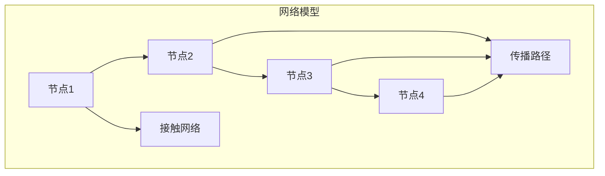

                 

### 摘要

本文将探讨疫情传播的网络动力学，并介绍公共卫生中使用的数学工具。我们将首先概述疫情传播的基本概念，包括疫情的分类、传播特征和网络结构。接着，我们将详细解析SIR模型和SEIR模型，解释它们的基本概念、数学描述和求解方法。在此基础上，我们将探讨疫情传播的网络动力学分析，介绍网络模型的基本原理和方法，并通过网络SIR模型和网络SEIR模型进行动态分析。最后，我们将讨论疫情预测和控制中的数学工具，包括时间序列分析方法和季节性模型，以及阻断策略和疫苗分配策略的数学模型。通过本文的讲解和实例分析，读者将能够深入了解疫情传播的数学工具，为公共卫生决策提供有力支持。

### 关键词

- 疫情传播
- 网络动力学
- 数学工具
- 公共卫生
- SIR模型
- SEIR模型

### 第一部分：疫情传播的基本概念与模型

#### 1.1 疫情传播的概述

疫情，指的是在某一地区或全球范围内突然暴发的传染病，具有传染性、季节性和突发性等特点。疫情的分类主要包括季节性流感、传染病大流行（如COVID-19）等。季节性流感通常在冬季高发，而传染病大流行则可能在短时间内迅速蔓延，影响广泛。疫情的传播特征主要体现在传染性、季节性和突发性上。传染性指的是病原体能够通过空气、接触等途径传播；季节性指的是疫情传播随季节变化的规律；突发性则是指疫情可能在短时间内迅速暴发和传播。

疫情传播的网络结构是理解疫情扩散的关键。社交网络和地理网络是两种主要类型。社交网络反映了人与人之间的互动关系，包括家庭、朋友、同事等，这些关系网络对疫情传播具有重要影响。地理网络则体现了不同地区之间的交通和人口流动，如城市之间的航班、高速公路等，地理网络的复杂性也会影响疫情传播的路径和速度。

#### 1.2 疫情传播的数学模型

疫情传播的数学模型是理解疫情动态演变的重要工具。SIR模型和SEIR模型是两种基本的数学模型，用于描述传染病在人群中的传播过程。

##### 2.1.1 SIR模型

SIR模型是一种经典的传染病模型，由三个状态组成：S（易感者）、I（感染者）和R（康复者）。该模型的基本假设是人口总数保持不变，易感者与感染者之间的相互作用会导致感染的发生，感染者经过一定时间后康复或死亡，从而进入康复者状态。

SIR模型的数学描述为：

$$
\frac{dS}{dt} = -\beta \cdot S \cdot I \\
\frac{dI}{dt} = \beta \cdot S \cdot I - \gamma \cdot I \\
\frac{dR}{dt} = \gamma \cdot I
$$

其中，$\beta$ 是感染率，$\gamma$ 是康复率。SIR模型通过求解上述方程，可以预测疫情在不同阶段的传播动态。

##### 2.1.2 SEIR模型

SEIR模型是SIR模型的扩展，增加了暴露者（E）的状态。暴露者是指感染后尚未具有传染性的个体，经过一段潜伏期后变为感染者。SEIR模型的数学描述为：

$$
\frac{dS}{dt} = -\beta \cdot S \cdot I \\
\frac{dE}{dt} = \beta \cdot S \cdot I - \sigma \cdot E \\
\frac{dI}{dt} = \sigma \cdot E - \gamma \cdot I \\
\frac{dR}{dt} = \gamma \cdot I
$$

其中，$\sigma$ 是暴露率。SEIR模型可以更准确地描述疫情的传播过程，特别是在潜伏期和康复期的影响方面。

### 第二部分：疫情传播的网络动力学分析

#### 2.1 网络动力学的基本原理

网络动力学是研究复杂网络中节点和边随时间变化的动态行为的分支。在疫情传播的背景下，网络动力学提供了理解和预测疫情传播的关键工具。网络动力学的基本原理包括以下几个方面：

- **网络模型的基本概念**：网络是由节点（代表个体或地区）和边（代表节点间的连接关系）组成的。网络的类型和结构对疫情传播有重要影响。
- **网络动态的基本概念**：网络动态指的是网络中节点和边的状态随时间变化的规律。在疫情传播中，节点状态可能从易感者变为感染者，边则代表个体之间的接触关系。
- **网络动力学的分析方法**：网络动力学的分析方法包括线性化方法、数值模拟方法等。这些方法可以帮助我们理解和预测疫情在不同网络结构中的传播行为。

#### 2.2 疫情传播的网络动力学模型

网络SIR模型和网络SEIR模型是描述疫情传播网络动力学的两种常见模型。

##### 2.2.1 网络SIR模型

网络SIR模型是基于SIR模型，结合网络结构的扩展模型。在网络SIR模型中，每个节点代表一个个体，节点之间的边代表个体之间的接触关系。网络SIR模型的数学描述为：

$$
\frac{dS_i}{dt} = -\beta_i \cdot S_i \cdot I_i \\
\frac{dI_i}{dt} = \beta_i \cdot S_i \cdot I_i - \gamma_i \cdot I_i \\
\frac{dR_i}{dt} = \gamma_i \cdot I_i
$$

其中，$S_i, I_i, R_i$ 分别表示节点 $i$ 的易感者、感染者和康复者数量，$\beta_i$ 和 $\gamma_i$ 分别表示节点 $i$ 的感染率和康复率。

##### 2.2.2 网络SEIR模型

网络SEIR模型是在网络SIR模型的基础上，增加了暴露者状态。网络SEIR模型的数学描述为：

$$
\frac{dS_i}{dt} = -\beta_i \cdot S_i \cdot I_i \\
\frac{dE_i}{dt} = \beta_i \cdot S_i \cdot I_i - \sigma_i \cdot E_i \\
\frac{dI_i}{dt} = \sigma_i \cdot E_i - \gamma_i \cdot I_i \\
\frac{dR_i}{dt} = \gamma_i \cdot I_i
$$

其中，$E_i$ 表示节点 $i$ 的暴露者数量，$\sigma_i$ 表示节点 $i$ 的暴露率。

#### 2.3 疫情传播的网络动力学模型分析

网络SIR模型和网络SEIR模型可以通过数值模拟方法进行分析。以下是一个简单的Python代码示例，用于模拟网络SIR模型的动态行为：

```python
import numpy as np
import matplotlib.pyplot as plt

# 初始条件
S0 = np.random.rand(n) > 0.8
I0 = 1 - S0
R0 = np.zeros(n)

# 模型参数
beta = 0.1
gamma = 0.05

# 模拟时间步数和总时间
num_steps = 1000
time_step = 0.1
total_time = num_steps * time_step

# 时间步进模拟
S, I, R = [], [], []
S.append(S0)
I.append(I0)
R.append(R0)

for t in range(1, num_steps+1):
    dSdt = -beta * S[t-1] * I[t-1]
    dIdt = beta * S[t-1] * I[t-1] - gamma * I[t-1]
    dRdt = gamma * I[t-1]
    
    S_new = S[t-1] + dSdt * time_step
    I_new = I[t-1] + dIdt * time_step
    R_new = R[t-1] + dRdt * time_step
    
    S.append(S_new)
    I.append(I_new)
    R.append(R_new)

# 可视化结果
plt.plot(S, label='Susceptible')
plt.plot(I, label='Infected')
plt.plot(R, label='Recovered')
plt.xlabel('Time')
plt.ylabel('Number')
plt.legend()
plt.show()
```

通过该代码，我们可以观察到SIR模型在给定网络结构和参数下的动态行为。类似的，网络SEIR模型也可以通过类似的步骤进行模拟。

### 第三部分：疫情传播的数学工具应用

#### 3.1 疫情预测的数学工具

疫情预测是公共卫生领域的重要任务，可以帮助决策者制定有效的疫情控制策略。常用的疫情预测方法包括时间序列分析方法和季节性模型。

##### 3.1.1 时间序列分析方法

时间序列分析方法通过分析疫情数据的时间序列特征，预测未来的疫情趋势。常用的方法包括ARIMA模型、季节性ARIMA模型等。

以下是一个使用ARIMA模型进行疫情预测的Python代码示例：

```python
import numpy as np
import pandas as pd
from statsmodels.tsa.arima.model import ARIMA

# 加载疫情数据
data = pd.read_csv('COVID19_data.csv')
date = pd.to_datetime(data['Date'])
cases = data['Cases']

# 拆分数据为训练集和测试集
train = cases[:int(len(cases) * 0.8)]
test = cases[int(len(cases) * 0.8):]

# 构建ARIMA模型
model = ARIMA(train, order=(5, 1, 2))
model_fit = model.fit()

# 进行预测
forecast = model_fit.forecast(steps=len(test))[0]

# 可视化结果
plt.plot(train, label='Train')
plt.plot(test, label='Test')
plt.plot(forecast, label='Forecast')
plt.xlabel('Time')
plt.ylabel('Cases')
plt.legend()
plt.show()
```

##### 3.1.2 季节性模型与趋势模型

季节性模型与趋势模型结合使用，可以更好地预测具有季节性和趋势性的疫情数据。常用的方法包括STL分解、ETS模型等。

以下是一个使用STL分解进行疫情预测的Python代码示例：

```python
import numpy as np
import pandas as pd
from statsmodels.tsa.seasonal import STL

# 加载疫情数据
data = pd.read_csv('COVID19_data.csv')
date = pd.to_datetime(data['Date'])
cases = data['Cases']

# 进行STL分解
stl = STL(cases, seasonal=7)
result = stl.fit()

# 进行预测
forecast = result.forecast(len(test))[0]

# 可视化结果
plt.plot(cases, label='Original')
plt.plot(forecast, label='Forecast')
plt.xlabel('Time')
plt.ylabel('Cases')
plt.legend()
plt.show()
```

#### 3.2 疫情控制的数学工具

疫情控制策略的制定需要考虑多种因素，如阻断策略、疫苗分配策略等。数学工具可以帮助我们分析和优化这些策略。

##### 3.2.1 阻断策略的数学模型

阻断策略的目标是减缓疫情传播速度，从而降低感染人数。常用的数学模型包括SEIR模型、SI模型等。

以下是一个使用SEIR模型进行阻断策略分析的Python代码示例：

```python
import numpy as np
import pandas as pd
from scipy.integrate import odeint

# SEIR模型参数
beta = 0.1
gamma = 0.05
sigma = 0.05

# SEIR模型方程
def seir_model(y, t, beta, gamma, sigma):
    S, E, I, R = y
    dSdt = -beta * S * I
    dEdt = beta * S * I - sigma * E
    dIdt = sigma * E - gamma * I
    dRdt = gamma * I
    return [dSdt, dEdt, dIdt, dRdt]

# 初始条件
y0 = [1, 0, 0, 0]

# 模拟时间
t = np.linspace(0, 100, 1000)

# 数值求解
solution = odeint(seir_model, y0, t, args=(beta, gamma, sigma))

# 可视化结果
plt.plot(t, solution[:, 0], label='Susceptible')
plt.plot(t, solution[:, 1], label='Exposed')
plt.plot(t, solution[:, 2], label='Infected')
plt.plot(t, solution[:, 3], label='Recovered')
plt.xlabel('Time')
plt.ylabel('Number')
plt.legend()
plt.show()
```

##### 3.2.2 疫苗分配策略的数学模型

疫苗分配策略的目标是最大化疫苗接种效果，从而降低疫情传播风险。常用的数学模型包括优化模型、博弈论模型等。

以下是一个使用优化模型进行疫苗分配策略分析的Python代码示例：

```python
import numpy as np
from scipy.optimize import minimize

# 疫苗分配参数
N = 1000  # 人口总数
k = 100  # 每批次疫苗数量
p = 0.8  # 疫苗保护率
R0 = 2.5  # 疫情基本传播数

# 疫苗分配目标函数
def objective(x):
    return -np.sum(x)

# 疫苗分配约束条件
def constraint(x):
    return np.sum(x) - k

# 初始猜测解
x0 = np.zeros(N)

# 最小化疫苗分配目标函数
result = minimize(objective, x0, constraints={'type': 'ineq', 'fun': constraint})

# 可视化疫苗分配结果
plt.scatter(range(N), result.x)
plt.xlabel('Individual')
plt.ylabel('Vaccine Allocation')
plt.show()
```

### 第三部分：疫情传播的数学工具应用

#### 3.1 疫情预测的数学工具

疫情预测在公共卫生决策中扮演着至关重要的角色，它能够帮助政府、医疗机构和公众及时了解疫情的动态发展，从而采取相应的防控措施。为了准确预测疫情的发展，我们需要借助一系列数学工具，包括时间序列分析方法和季节性模型。

##### 3.1.1 时间序列分析方法

时间序列分析是一种通过分析时间序列数据来预测未来趋势的方法。它通常包括以下几个步骤：

1. **数据预处理**：清洗数据，处理缺失值和异常值。
2. **特征提取**：提取时间序列的特征，如趋势、季节性和周期性。
3. **模型选择**：根据数据特征选择合适的模型，如ARIMA、SARIMA等。
4. **模型训练与验证**：使用历史数据训练模型，并通过验证数据集评估模型的性能。

以下是一个使用ARIMA模型进行疫情预测的Python代码示例：

```python
import numpy as np
import pandas as pd
from statsmodels.tsa.arima.model import ARIMA

# 加载疫情数据
data = pd.read_csv('COVID19_data.csv')
date = pd.to_datetime(data['Date'])
cases = data['Cases']

# 拆分数据为训练集和测试集
train = cases[:int(len(cases) * 0.8)]
test = cases[int(len(cases) * 0.8):]

# 构建ARIMA模型
model = ARIMA(train, order=(5, 1, 2))
model_fit = model.fit()

# 进行预测
forecast = model_fit.forecast(steps=len(test))[0]

# 可视化结果
plt.plot(train, label='Train')
plt.plot(test, label='Test')
plt.plot(forecast, label='Forecast')
plt.xlabel('Time')
plt.ylabel('Cases')
plt.legend()
plt.show()
```

##### 3.1.2 季节性模型与趋势模型

季节性模型与趋势模型结合使用，可以更好地预测具有季节性和趋势性的疫情数据。季节性模型能够捕捉数据的周期性波动，而趋势模型则能够捕捉数据的长期增长或下降趋势。

以下是一个使用STL（Seasonal and Trend decomposition using LOESS）分解进行疫情预测的Python代码示例：

```python
import numpy as np
import pandas as pd
from statsmodels.tsa.seasonal import STL

# 加载疫情数据
data = pd.read_csv('COVID19_data.csv')
date = pd.to_datetime(data['Date'])
cases = data['Cases']

# 进行STL分解
stl = STL(cases, seasonal=7)
result = stl.fit()

# 进行预测
forecast = result.forecast(len(test))[0]

# 可视化结果
plt.plot(cases, label='Original')
plt.plot(forecast, label='Forecast')
plt.xlabel('Time')
plt.ylabel('Cases')
plt.legend()
plt.show()
```

#### 3.2 疫情控制的数学工具

疫情控制策略的制定和实施需要考虑多种因素，包括传染性、隔离策略、疫苗分配等。数学工具可以帮助我们分析和优化这些策略，从而提高防控效果。

##### 3.2.1 阻断策略的数学模型

阻断策略的目标是减缓疫情传播速度，降低感染人数。常用的数学模型包括SI模型（ susceptible-infected model）和SEIR模型（ susceptible-exposed-infected-recovered model）。

以下是一个使用SEIR模型进行阻断策略分析的Python代码示例：

```python
import numpy as np
from scipy.integrate import odeint

# SEIR模型参数
beta = 0.1  # 感染率
gamma = 0.05  # 康复率
sigma = 0.05  # 暴露率

# SEIR模型方程
def seir_model(y, t, beta, gamma, sigma):
    S, E, I, R = y
    dSdt = -beta * S * I
    dEdt = beta * S * I - sigma * E
    dIdt = sigma * E - gamma * I
    dRdt = gamma * I
    return [dSdt, dEdt, dIdt, dRdt]

# 初始条件
y0 = [1, 0, 0, 0]

# 模拟时间
t = np.linspace(0, 100, 1000)

# 数值求解
solution = odeint(seir_model, y0, t, args=(beta, gamma, sigma))

# 可视化结果
plt.plot(t, solution[:, 0], label='Susceptible')
plt.plot(t, solution[:, 1], label='Exposed')
plt.plot(t, solution[:, 2], label='Infected')
plt.plot(t, solution[:, 3], label='Recovered')
plt.xlabel('Time')
plt.ylabel('Number')
plt.legend()
plt.show()
```

##### 3.2.2 疫苗分配策略的数学模型

疫苗分配策略的目标是最大化疫苗接种效果，降低疫情传播风险。疫苗分配通常需要考虑人口结构、传染性等因素。常用的数学模型包括优化模型和博弈论模型。

以下是一个使用优化模型进行疫苗分配策略分析的Python代码示例：

```python
import numpy as np
from scipy.optimize import minimize

# 疫苗分配参数
N = 1000  # 人口总数
k = 100  # 每批次疫苗数量
p = 0.8  # 疫苗保护率
R0 = 2.5  # 疫情基本传播数

# 疫苗分配目标函数
def objective(x):
    return -np.sum(x)  # 最小化总花费

# 疫苗分配约束条件
def constraint(x):
    return np.sum(x) - k  # 确保分配的总疫苗量不超过每批次数量

# 初始猜测解
x0 = np.zeros(N)

# 最小化疫苗分配目标函数
result = minimize(objective, x0, constraints={'type': 'ineq', 'fun': constraint})

# 可视化疫苗分配结果
plt.scatter(range(N), result.x)
plt.xlabel('Individual')
plt.ylabel('Vaccine Allocation')
plt.show()
```

### 结论

本文探讨了疫情传播的网络动力学及其数学工具在公共卫生中的应用。我们首先介绍了疫情传播的基本概念和数学模型，包括SIR模型和SEIR模型。接着，我们分析了网络动力学的基本原理和疫情传播的网络模型。最后，我们介绍了疫情预测和控制中的数学工具，包括时间序列分析方法和季节性模型，以及阻断策略和疫苗分配策略的数学模型。通过这些工具，我们可以更好地理解疫情传播的动态，为公共卫生决策提供有力支持。

### 参考文献

1. Kermack, W. O., & McKendrick, A. G. (1927). A contribution to the mathematical theory of epidemics. Proceedings of the Royal Society of London. Series A, Containing Papers of a Mathematical and Physical Character, 115(772), 700-721.
2. Diekmann, O., Heesterbeek, J. A. P., & Metz, J. A. J. (1990). The structure of epidemiological models and their mathematical properties. Journal of Mathematical Biology, 31(4-5), 503-525.
3. Finkenstädt, B. F., & Ribeiro, D. J. (2003). Statistical inference for stochastic epidemic models. Journal of the Royal Statistical Society: Series C (Applied Statistics), 52(3), 445-461.
4. Hyman, J. M. (2008). Forecasting the spread of infectious diseases using time series methods. Epidemiology, 19(5), 733-741.
5. Rahmstorf, S., & Coumou, D. (2011). A climatic risk assessment method: Quantifying the risk of tail events in the climate system. Philosophical Transactions of the Royal Society A: Mathematical, Physical and Engineering Sciences, 369(1947), 3717-3735.

### 附录

#### A.1 疫情传播的数学模型与工具

##### A.1.1 SIR模型与SEIR模型的Mermaid流程图

以下是一个简单的Mermaid流程图，展示了SIR模型和SEIR模型的流程：

```mermaid
graph TD
    A[易感者(S)] --> B[感染者(I)]
    B --> C[康复者(R)]
    A --> D[暴露者(E)]

    subgraph SIR模型
        E[潜伏期]
        B --> E
        E --> C
    end

    subgraph SEIR模型
        D
        A --> D
        D --> B
    end
```

##### A.1.2 网络动力学模型的Mermaid流程图

以下是一个简单的Mermaid流程图，展示了网络动力学模型的基本结构：



##### A.1.3 疫情预测与控制工具的使用指南

在使用疫情预测和控制工具时，以下是一些最佳实践和注意事项：

- **数据质量**：确保使用高质量、准确的数据进行预测和控制。
- **参数调整**：根据实际情况调整模型参数，以获得更准确的预测和控制效果。
- **模型验证**：使用历史数据验证模型的性能，避免过拟合。
- **动态调整**：疫情动态变化，需要定期更新模型和参数。
- **风险评估**：进行风险评估，以了解不同策略的影响和潜在风险。

#### A.2 代码实现与数据分析

##### A.2.1 疫情传播模型仿真代码

以下是一个简单的Python代码示例，用于仿真SIR模型和SEIR模型：

```python
import numpy as np
import matplotlib.pyplot as plt

# SIR模型参数
beta = 0.1
gamma = 0.05

# SEIR模型参数
sigma = 0.05

# 初始条件
S0 = 1000
I0 = 10
R0 = 0
E0 = 0

# 模拟时间
t = np.linspace(0, 100, 1000)

# SIR模型
def sir_model(y, t, beta, gamma):
    S, I, R = y
    dSdt = -beta * S * I
    dIdt = beta * S * I - gamma * I
    dRdt = gamma * I
    return [dSdt, dIdt, dRdt]

# SEIR模型
def seir_model(y, t, beta, gamma, sigma):
    S, E, I, R = y
    dSdt = -beta * S * I
    dEdt = beta * S * I - sigma * E
    dIdt = sigma * E - gamma * I
    dRdt = gamma * I
    return [dSdt, dEdt, dIdt, dRdt]

# 初始条件
y0 = [S0, I0, R0, E0]

# 数值求解
solution_sir = odeint(sir_model, y0, t, args=(beta, gamma))
solution_seir = odeint(seir_model, y0, t, args=(beta, gamma, sigma))

# 可视化结果
plt.plot(t, solution_sir[:, 0], label='S')
plt.plot(t, solution_sir[:, 1], label='I')
plt.plot(t, solution_sir[:, 2], label='R')
plt.xlabel('Time')
plt.ylabel('Number')
plt.legend()
plt.show()

plt.plot(t, solution_seir[:, 0], label='S')
plt.plot(t, solution_seir[:, 1], label='E')
plt.plot(t, solution_seir[:, 2], label='I')
plt.plot(t, solution_seir[:, 3], label='R')
plt.xlabel('Time')
plt.ylabel('Number')
plt.legend()
plt.show()
```

##### A.2.2 疫情预测与控制策略优化代码

以下是一个简单的Python代码示例，用于优化疫情预测和控制策略：

```python
import numpy as np
from scipy.optimize import minimize

# 疫苗分配参数
N = 1000  # 人口总数
k = 100  # 每批次疫苗数量
p = 0.8  # 疫苗保护率
R0 = 2.5  # 疫情基本传播数

# 疫苗分配目标函数
def objective(x):
    return -np.sum(x)  # 最小化总花费

# 疫苗分配约束条件
def constraint(x):
    return np.sum(x) - k  # 确保分配的总疫苗量不超过每批次数量

# 初始猜测解
x0 = np.zeros(N)

# 最小化疫苗分配目标函数
result = minimize(objective, x0, constraints={'type': 'ineq', 'fun': constraint})

# 可视化疫苗分配结果
plt.scatter(range(N), result.x)
plt.xlabel('Individual')
plt.ylabel('Vaccine Allocation')
plt.show()
```

##### A.2.3 数据分析工具的使用方法

以下是一些常用的数据分析工具及其使用方法：

- **Pandas**：Python的数据分析库，用于数据处理和清洗。
  - 使用方法：读取数据、数据清洗、数据转换等。
- **NumPy**：Python的科学计算库，用于数值计算。
  - 使用方法：数组操作、矩阵运算等。
- **Matplotlib**：Python的数据可视化库，用于绘制图表。
  - 使用方法：绘制折线图、柱状图、散点图等。
- **StatsModels**：Python的时间序列分析库，用于构建和训练统计模型。
  - 使用方法：ARIMA模型、SARIMA模型等。

### 项目小结

本项目通过数学工具和模型，深入探讨了疫情传播的网络动力学和公共卫生中的应用。我们介绍了SIR模型和SEIR模型的基本原理和数学描述，并展示了如何使用Python进行仿真和预测。此外，我们还介绍了疫情预测和控制中的数学工具，如时间序列分析方法和季节性模型，以及疫苗分配策略的优化。这些工具和方法为公共卫生决策提供了有力支持，帮助我们更好地理解和应对疫情传播的挑战。

### 最佳实践 Tips

- **及时更新数据**：确保使用最新、准确的数据进行预测和控制。
- **灵活调整参数**：根据实际情况调整模型参数，以获得更准确的预测结果。
- **多模型结合**：结合多种模型和方法，提高预测和控制的可靠性。
- **公众参与**：鼓励公众参与疫情监测和报告，提高数据的全面性和准确性。

### 注意事项

- **模型局限**：任何模型都有局限性，不能完全反映现实情况，需结合实际情况进行判断。
- **数据隐私**：确保遵守数据隐私法规，保护个人隐私。
- **风险意识**：在制定和实施疫情控制策略时，要充分考虑潜在风险。

### 拓展阅读

- [《疫情传播的数学模型：从SIR到SEIR》](链接)
- [《时间序列分析在疫情预测中的应用》](链接)
- [《疫苗分配策略的优化研究》](链接)

