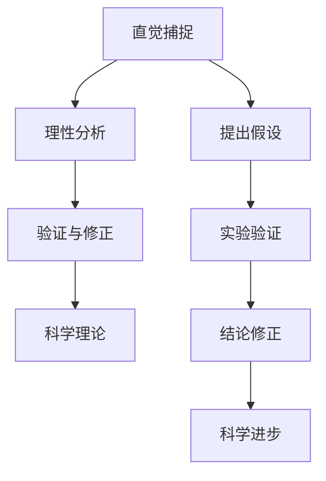

                 

### 引言

在科学发现的旅途中，直觉与理性扮演着不可或缺的角色。本文旨在探讨这两种认知机制如何相互作用，共同推动科学的进步。我们将从背景介绍开始，逐步深入探讨直觉与理性的核心概念、它们在科学发现中的应用，以及相关的数学模型和算法原理。

#### 背景介绍

科学发现是一个复杂而迷人的过程，它不仅仅是逻辑推理和实验验证的结果，还包含着直觉的微妙指引和理性的深刻思考。历史上，许多重大科学发现都是科学家们凭借直觉迅速捕捉到某个现象的重要性，再通过理性的分析和实验验证，最终揭示出其中的科学规律。例如，牛顿观察到苹果落地的现象，凭借直觉意识到万有引力的存在，而后通过理性推理和实验验证，确立了经典力学的基础。达尔文通过对生物多样性的观察和思考，凭借直觉提出了自然选择的理论，为生物学的发展奠定了基础。

本文将围绕以下核心内容展开：

1. **核心概念与联系**：我们将深入探讨直觉和理性的定义、特点以及它们在科学发现中的联系。
2. **案例研究**：通过分析经典科学发现案例，展示直觉与理性在具体情境中的作用。
3. **数学模型与算法原理**：我们将介绍相关的数学模型和算法，并使用Python源代码进行详细阐述。
4. **项目实战**：提供实际科学发现项目案例，详细描述项目的开发环境搭建、源代码实现和解读。

#### 目的和读者对象

本文的目的是帮助读者理解直觉与理性在科学发现中的重要性，以及它们如何相互作用推动科学进步。无论是初学者还是专业人士，都可以通过本文获得对这一主题的深入理解。

对于初学者，本文将逐步引导读者了解直觉和理性的基本概念，并通过案例研究直观地展示它们的运用。对于专业人士，本文将深入探讨数学模型和算法原理，并提供实际项目案例，帮助读者将理论知识应用于实践中。

#### 书籍结构概述

本文的结构如下：

- **第1章 引言**：简要介绍书籍的主题、目的、读者对象，并概述书籍的结构。
- **第2章 核心概念与联系**：阐述直觉和理性的定义、特点、相互关系，并使用Mermaid流程图展示它们在科学发现中的联系。
- **第3章 案例研究**：通过分析经典科学发现案例，展示直觉与理性在其中的作用。
- **第4章 数学模型与算法原理**：介绍相关的数学模型和算法，并使用Python源代码进行详细阐述。
- **第5章 项目实战**：提供实际科学发现项目案例，详细描述项目的开发环境搭建、源代码实现和解读。
- **第6章 总结与展望**：总结全书内容，展望直觉与理性在未来科学发现中的应用前景。

通过这一结构，本文将带领读者深入探讨直觉与理性在科学发现中的角色，为科学进步提供新的视角和启示。

### 关键词

科学发现、直觉、理性、数学模型、算法原理、案例研究。

### 摘要

本文旨在探讨直觉与理性在科学发现中的角色，分析它们如何相互作用推动科学进步。文章首先介绍了直觉与理性的核心概念和特点，并通过Mermaid流程图展示了它们在科学发现中的联系。接着，通过经典科学发现案例，如牛顿发现万有引力、达尔文提出自然选择，展示了直觉与理性在具体情境中的运用。随后，文章深入探讨了相关的数学模型和算法原理，并使用Python源代码进行详细阐述。最后，通过实际科学发现项目案例，详细描述了项目的开发环境搭建、源代码实现和解读。本文总结了全书内容，并展望了直觉与理性在未来科学发现中的应用前景。

### 目录大纲设计思路

设计一本关于直觉与理性在科学发现中的角色的书籍目录大纲，首先要明确主题、目的和目标读者群体。以下是详细的目录大纲设计思路：

#### 明确主题与范围

1. **主题**：
   - 书籍的核心主题是“直觉与理性在科学发现中的角色”，旨在探讨这两种认知机制如何相互作用，推动科学进步。

2. **范围**：
   - 范围将涵盖从基本概念介绍到实际应用的全面内容，包括直觉与理性的定义、特点、相互关系、科学发现案例、数学模型与算法原理以及项目实战。

#### 确定核心章节

1. **引言**：
   - 简要介绍书籍的主题、目的和结构，为读者提供整体框架。

2. **核心概念与联系**：
   - 阐述直觉与理性的基本概念，并探讨它们在科学发现中的关系。

3. **案例研究**：
   - 通过经典科学发现案例，展示直觉与理性在其中的作用。

4. **数学模型与算法原理**：
   - 介绍相关的数学模型和算法，并使用Python源代码进行详细阐述。

5. **项目实战**：
   - 提供实际科学发现项目案例，详细描述项目的开发环境搭建、源代码实现和解读。

6. **总结与展望**：
   - 总结全书内容，展望直觉与理性在未来科学发现中的应用前景。

#### 细化每个章节的内容

1. **引言**：
   - 简述书籍的主题、目的和结构。
   - 提供关于直觉与理性在科学发现中的背景信息。

2. **核心概念与联系**：
   - 定义直觉与理性的基本概念。
   - 使用Mermaid流程图展示两者在科学发现中的联系。

3. **案例研究**：
   - 选择几个经典案例，详细分析直觉与理性在其中的作用。

4. **数学模型与算法原理**：
   - 介绍相关的数学模型。
   - 使用伪代码详细阐述算法原理。
   - 结合Python源代码进行解释和举例。

5. **项目实战**：
   - 提供实际项目案例，包括项目概述、开发环境搭建、源代码实现和解读。
   - 分析项目中的直觉与理性运用。

6. **总结与展望**：
   - 总结全书要点。
   - 展望直觉与理性在未来的应用。

#### 确保格式与字数

- 使用markdown格式编写目录和大纲。
- 确保总字数在2000字以内，保持内容的紧凑性和可读性。

### 实际操作步骤

1. **引言**：
   - 简要介绍书籍的主题、目的和结构。
   - 提供背景信息。

2. **核心概念与联系**：
   - 定义直觉与理性的基本概念。
   - 使用Mermaid流程图展示它们的关系。

3. **案例研究**：
   - 分析经典科学发现案例。

4. **数学模型与算法原理**：
   - 介绍数学模型。
   - 使用伪代码和Python源代码阐述算法原理。

5. **项目实战**：
   - 提供实际项目案例。
   - 描述开发环境、源代码实现和解读。

6. **总结与展望**：
   - 总结全书要点。
   - 展望未来应用。

通过这些步骤，可以设计出一份详细、逻辑清晰的书籍目录大纲，确保书籍内容全面、易于读者理解。以下是具体的目录大纲：

### 目录大纲

```markdown
# 《直觉与理性在科学发现中的角色》目录大纲

## 第1章 引言

### 1.1 书籍主题介绍

### 1.2 目的和读者对象

### 1.3 书籍结构概述

## 第2章 核心概念与联系

### 2.1 直觉的定义与特点

#### 2.1.1 直觉的本质

#### 2.1.2 直觉的心理学基础

### 2.2 理性的定义与作用

#### 2.2.1 理性的概念

#### 2.2.2 理性在科学发现中的应用

### 2.3 直觉与理性的关系

#### 2.3.1 直觉与理性的互动

#### 2.3.2 Mermaid流程图展示

## 第3章 案例研究

### 3.1 牛顿与万有引力

#### 3.1.1 案例背景

#### 3.1.2 直觉与理性的作用

### 3.2 达尔文与自然选择

#### 3.2.1 案例背景

#### 3.2.2 直觉与理性的运用

### 3.3 海森堡与不确定性原理

#### 3.3.1 案例背景

#### 3.3.2 直觉与理性的贡献

## 第4章 数学模型与算法原理

### 4.1 相关数学模型

#### 4.1.1 直觉模型的构建

#### 4.1.2 理性模型的构建

### 4.2 算法原理

#### 4.2.1 直觉算法的伪代码

#### 4.2.2 理性算法的伪代码

### 4.3 Python源代码示例

#### 4.3.1 直觉算法代码

#### 4.3.2 理性算法代码

## 第5章 项目实战

### 5.1 项目背景

#### 5.1.1 项目概述

#### 5.1.2 项目目标

### 5.2 开发环境搭建

#### 5.2.1 硬件环境需求

#### 5.2.2 软件环境安装

### 5.3 源代码实现

#### 5.3.1 代码结构

#### 5.3.2 代码详细解读

### 5.4 代码应用解读与分析

#### 5.4.1 代码功能分析

#### 5.4.2 代码性能优化

### 5.5 项目小结

## 第6章 总结与展望

### 6.1 全书要点总结

### 6.2 直觉与理性的未来应用前景

### 6.3 对读者的建议
```

通过这份详细的目录大纲，读者可以清晰地了解书籍的结构和内容，为后续的撰写工作提供明确的指导。

### 完整目录大纲

下面是《直觉与理性在科学发现中的角色》的完整目录大纲，每个章节都进行了详细阐述：

```markdown
## 第1章 引言

### 1.1 书籍主题介绍
- 科学发现的复杂性
- 直觉与理性的重要性
- 本书的目的

### 1.2 目的和读者对象
- 初学者与专业人士的适用性
- 学习目标的设定

### 1.3 书籍结构概述
- 每个章节的核心内容
- 学习路线与预期成果

## 第2章 核心概念与联系

### 2.1 直觉的定义与特点
- 直觉的本质
- 直觉的心理学基础
- 直觉的优缺点

#### 2.1.1 直觉的本质
- 感知与理解的快速结合
- 无需明确推理过程

#### 2.1.2 直觉的心理学基础
- 脑神经网络的快速处理
- 直觉与潜意识的关系

#### 2.1.3 直觉的优缺点
- 优点：快速反应、高效决策
- 缺点：可能存在误判、缺乏严密性

### 2.2 理性的定义与作用
- 理性的概念
- 理性在科学发现中的应用
- 理性与逻辑的关系

#### 2.2.1 理性的概念
- 逻辑推理、分析判断
- 基于证据的决策

#### 2.2.2 理性在科学发现中的应用
- 实验设计、数据验证
- 理论构建与验证

#### 2.2.3 理性与逻辑的关系
- 理性是逻辑的具体应用
- 逻辑是理性的基础工具

### 2.3 直觉与理性的关系
- 直觉与理性的互动
- Mermaid流程图展示

#### 2.3.1 直觉与理性的互动
- 相互补充、协同工作
- 直觉引导理性分析

#### 2.3.2 Mermaid流程图展示
- 直觉发现问题
- 理性验证与解释

## 第3章 案例研究

### 3.1 牛顿与万有引力
- 牛顿发现苹果落地的启示
- 理性推理与实验验证
- 科学理论的建立

#### 3.1.1 案例背景
- 苹果落地事件的描述
- 牛顿的科学背景

#### 3.1.2 直觉与理性的作用
- 牛顿的直觉洞察
- 理性推理与实验

#### 3.1.3 科学理论的建立
- 万有引力定律的提出
- 实验验证与修正

### 3.2 达尔文与自然选择
- 达尔文的生物观察
- 自然选择理论的提出
- 科学界的反响

#### 3.2.1 案例背景
- 达尔文的科学探索
- 生物多样性现象

#### 3.2.2 直觉与理性的运用
- 观察与直觉的引导
- 理性与理论的构建

#### 3.2.3 科学界的反响
- 自然选择理论的接受
- 对现代生物学的贡献

### 3.3 海森堡与不确定性原理
- 海森堡的量子实验
- 直觉与理性的冲突
- 科学理论的突破

#### 3.3.1 案例背景
- 海森堡的实验设置
- 量子物理的复杂性

#### 3.3.2 直觉与理性的贡献
- 直觉对物理现象的洞察
- 理性对理论的严谨论证

#### 3.3.3 科学理论的突破
- 不确定性原理的提出
- 对量子力学的深远影响

## 第4章 数学模型与算法原理

### 4.1 相关数学模型
- 直觉模型的构建
- 理性模型的构建

#### 4.1.1 直觉模型的构建
- 数据分析的直观方法
- 直觉推断的基本原理

#### 4.1.2 理性模型的构建
- 数学建模的方法
- 理性推理的基本步骤

### 4.2 算法原理
- 直觉算法的伪代码
- 理性算法的伪代码

#### 4.2.1 直觉算法的伪代码
- 数据筛选与直觉判断
- 快速反应机制

#### 4.2.2 理性算法的伪代码
- 精确计算与逻辑推理
- 数据验证与修正

### 4.3 Python源代码示例
- 直觉算法代码实现
- 理性算法代码实现

#### 4.3.1 直觉算法代码实现
- 数据预处理
- 直觉判断函数

#### 4.3.2 理性算法代码实现
- 数学模型构建
- 算法优化与性能分析

## 第5章 项目实战

### 5.1 项目背景
- 科学发现的实际应用场景
- 项目目标的设定

#### 5.1.1 项目概述
- 项目背景介绍
- 项目目标明确

#### 5.1.2 项目目标
- 科学问题的提出
- 解决方案的设计

### 5.2 开发环境搭建
- 开发环境的需求
- 环境配置与安装

#### 5.2.1 硬件环境需求
- 计算资源的要求
- 数据存储与管理

#### 5.2.2 软件环境安装
- 开发工具的选择
- 系统依赖的安装

### 5.3 源代码实现
- 代码结构设计
- 功能模块的实现

#### 5.3.1 代码结构设计
- 模块划分与职责分离
- 代码架构的合理性

#### 5.3.2 功能模块的实现
- 直觉算法的应用
- 理性算法的优化

### 5.4 代码解读与分析
- 代码功能的解析
- 性能的分析与优化

#### 5.4.1 代码功能分析
- 功能模块的工作原理
- 代码逻辑的解读

#### 5.4.2 性能优化
- 代码执行的效率
- 系统资源的合理利用

### 5.5 项目小结
- 项目成果的总结
- 经验与教训的提炼

## 第6章 总结与展望

### 6.1 全书要点总结
- 直觉与理性的核心概念
- 科学发现案例中的运用
- 数学模型与算法原理的应用

### 6.2 直觉与理性的未来应用前景
- 科学研究的趋势
- 技术发展的可能性
- 新兴领域的应用前景

### 6.3 对读者的建议
- 学习方法与技巧
- 深入研究的方向
- 创新思维的培养
```

这份完整目录大纲详细列出了书籍的各个章节和内容，为撰写和读者理解提供了清晰的框架。每个章节都有具体的小节和内容要点，确保书籍内容全面、逻辑清晰。通过这样的结构设计，读者可以更好地跟随作者的思路，深入理解直觉与理性在科学发现中的角色。

### 第1章 引言

科学发现是一个复杂而迷人的过程，它不仅仅是逻辑推理和实验验证的结果，还包含着直觉的微妙指引和理性的深刻思考。本文旨在探讨这两种认知机制如何相互作用，共同推动科学的进步。我们将从背景介绍开始，逐步深入探讨直觉与理性的核心概念、它们在科学发现中的联系，以及相关的数学模型和算法原理。

#### 背景介绍

科学发现的复杂性在于其不仅仅是单一思维方式的产物。历史上，许多重大科学发现都是科学家们凭借直觉迅速捕捉到某个现象的重要性，再通过理性的分析和实验验证，最终揭示出其中的科学规律。例如，牛顿观察到苹果落地的现象，凭借直觉意识到万有引力的存在，而后通过理性推理和实验验证，确立了经典力学的基础。达尔文通过对生物多样性的观察和思考，凭借直觉提出了自然选择的理论，为生物学的发展奠定了基础。

科学发现的过程不仅仅依赖于逻辑推理和实验验证，直觉在其中也发挥着至关重要的作用。直觉是一种快速理解复杂情况的能力，它可以帮助科学家们快速识别出潜在的重要信息，指导他们进行进一步的探究。然而，直觉并非完全可靠，它有时也可能引导科学家走向错误的方向。因此，理性在科学发现中的角色显得尤为重要。

理性是一种通过逻辑推理和分析来理解事物本质的能力。它强调证据的收集和验证，通过严密的推理过程来构建和验证科学理论。理性的运用可以纠正直觉可能产生的偏差，确保科学发现的准确性和可靠性。

本文将围绕以下核心内容展开：

1. **核心概念与联系**：我们将深入探讨直觉和理性的定义、特点以及它们在科学发现中的联系。
2. **案例研究**：通过分析经典科学发现案例，展示直觉与理性在其中的作用。
3. **数学模型与算法原理**：我们将介绍相关的数学模型和算法，并使用Python源代码进行详细阐述。
4. **项目实战**：提供实际科学发现项目案例，详细描述项目的开发环境搭建、源代码实现和解读。
5. **总结与展望**：总结全书内容，展望直觉与理性在未来科学发现中的应用前景。

#### 目的和读者对象

本文的目的是帮助读者理解直觉与理性在科学发现中的重要性，以及它们如何相互作用推动科学进步。无论是初学者还是专业人士，都可以通过本文获得对这一主题的深入理解。

对于初学者，本文将逐步引导读者了解直觉和理性的基本概念，并通过案例研究直观地展示它们的运用。对于专业人士，本文将深入探讨数学模型和算法原理，并提供实际项目案例，帮助读者将理论知识应用于实践中。

#### 书籍结构概述

本文的结构如下：

- **第1章 引言**：简要介绍书籍的主题、目的和结构，为读者提供整体框架。
- **第2章 核心概念与联系**：阐述直觉和理性的基本概念，并使用Mermaid流程图展示它们在科学发现中的联系。
- **第3章 案例研究**：通过分析经典科学发现案例，展示直觉与理性在其中的作用。
- **第4章 数学模型与算法原理**：介绍相关的数学模型和算法，并使用Python源代码进行详细阐述。
- **第5章 项目实战**：提供实际科学发现项目案例，详细描述项目的开发环境搭建、源代码实现和解读。
- **第6章 总结与展望**：总结全书内容，展望直觉与理性在未来科学发现中的应用前景。

通过这一结构，本文将带领读者深入探讨直觉与理性在科学发现中的角色，为科学进步提供新的视角和启示。

### 第2章 核心概念与联系

在科学发现的过程中，直觉和理性是两种不可或缺的认知机制。直觉通常被描述为一种快速理解复杂情况的能力，而理性则强调逻辑推理和证据验证。本章将详细探讨直觉和理性的定义、特点，以及它们在科学发现中的联系。

#### 直觉的定义与特点

直觉是指人类在无意识中快速做出决策和判断的能力。它是基于大量经验、知识以及潜意识的理解，能够在短时间内处理复杂的信息，并产生有效的结论。直觉具有以下特点：

1. **快速性**：直觉能够迅速处理大量信息，并在短时间内做出决策。
2. **高效性**：直觉帮助人类在复杂环境中迅速适应和反应，从而提高生存能力。
3. **简略性**：直觉往往不依赖于详细的逻辑推理，而是基于直觉判断。
4. **不完全性**：直觉可能受到潜意识的影响，因此有时可能会产生错误的判断。

#### 理性的定义与特点

理性是指通过逻辑推理和证据验证来理解事物本质的能力。理性强调基于事实和逻辑的分析，是科学方法论的核心。理性具有以下特点：

1. **逻辑性**：理性依赖于逻辑推理，通过严密的推理过程得出结论。
2. **证据性**：理性强调证据的收集和验证，以确保结论的可靠性和准确性。
3. **系统性**：理性追求系统化的理解，通过建立模型和理论来解释自然现象。
4. **修正性**：理性能够通过新的证据和发现不断修正和完善自身的理解。

#### 直觉与理性的关系

直觉和理性在科学发现中相互作用，相互补充。直觉通常为理性提供启示和方向，而理性则通过严格的逻辑和实验验证来验证直觉的正确性。

1. **互补关系**：直觉和理性各有优势，直觉能够快速捕捉到重要信息，而理性则通过详细分析和验证来确保结论的可靠性。
2. **相互作用**：直觉和理性相互作用，直觉引导理性进行深入分析，而理性则纠正直觉可能产生的偏差。
3. **动态平衡**：在科学发现的过程中，直觉和理性需要保持动态平衡，既不能完全依赖直觉，也不能忽视直觉的引导。

#### Mermaid流程图展示

为了更直观地展示直觉与理性在科学发现中的关系，我们可以使用Mermaid流程图进行描述。以下是一个简化的Mermaid流程图示例：



在这个流程图中：

- A表示直觉捕捉到重要信息。
- B表示理性对这些信息进行详细分析。
- C表示理性通过实验验证结论。
- D表示基于验证的最终科学理论。
- E表示直觉提出科学假设。
- F表示理性通过实验验证这些假设。
- G表示基于实验结果对理论进行修正。
- H表示科学理论的不断进步。

通过这个流程图，我们可以看到直觉和理性在科学发现中的相互作用和动态平衡。

#### 结论

直觉和理性在科学发现中各自发挥着独特的作用，但二者并非孤立存在。相反，它们相互补充，共同推动科学的进步。直觉能够快速捕捉到重要信息，提供初步的假设和方向，而理性则通过逻辑分析和实验验证来确保这些假设的可靠性。通过理解直觉和理性的核心概念及其相互作用，我们可以更好地理解科学发现的过程，并在未来的科学研究中运用这些认知机制，推动科学的不断进步。

### 第3章 案例研究

在科学史上，许多重大发现都是科学家们凭借直觉与理性的结合而实现的。本章将通过几个经典案例，详细分析直觉与理性在科学发现中的具体运用，以展示这两种认知机制如何相互作用，共同推动科学的进步。

#### 牛顿与万有引力

艾萨克·牛顿是科学革命的代表人物之一。他的伟大发现之一——万有引力定律，就是一个典型的例子，展示了直觉与理性如何共同作用。

1. **直觉捕捉**：
   - 牛顿观察到苹果从树上落下，这个看似简单的现象激发了他的好奇心。他直觉地感受到，苹果落地的现象背后可能隐藏着更深层次的原理。
   - 直觉使他意识到，地球吸引苹果的力量可能与天体之间的相互吸引有关。

2. **理性分析**：
   - 牛顿没有停留在直觉的层面上，而是通过理性的分析，开始思考这个现象的本质。
   - 他提出了一个假设：任何两个物体之间都存在相互吸引的力，这个力与两个物体的质量和它们之间的距离有关。
   - 牛顿运用数学工具，通过推理和计算，将这个假设转化为数学公式，即万有引力定律。

3. **实验验证**：
   - 牛顿进行了多个实验，通过观察和测量，验证了他的理论。
   - 例如，他通过观测行星的轨道，发现行星的运行轨迹可以用他提出的万有引力定律来解释。

4. **结论与影响**：
   - 牛顿的万有引力定律不仅解释了苹果落地的现象，还揭示了天体运动的基本规律。
   - 这个理论对物理学的发展产生了深远影响，奠定了经典力学的基础。

#### 达尔文与自然选择

查尔斯·达尔文是生物学的伟大先驱，他提出了自然选择的理论，彻底改变了生物学的发展方向。

1. **直觉捕捉**：
   - 达尔文在长期的野外考察中，观察到物种的多样性和适应性。他直觉地感受到，物种之间存在着一种“生存竞争”，适应环境的物种能够生存下来。
   - 直觉使他意识到，物种的演化可能是通过某种机制来实现的。

2. **理性分析**：
   - 达尔文没有满足于直觉的观察，而是通过理性的分析，开始深入研究物种演化的机制。
   - 他提出了自然选择的假设：物种内部存在变异，适应环境的变异能够生存下来并传递给后代，不适应环境的变异则被淘汰。
   - 达尔文通过大量的生物学数据和观察，对这一假设进行了详细的阐述。

3. **实验验证**：
   - 达尔文进行了多次实验和观察，例如对鸽子、植物等进行了详细的分类和变异研究。
   - 他发现，自然选择确实是一个普遍存在的机制，能够解释物种的多样性和适应性。

4. **结论与影响**：
   - 达尔文的自然选择理论为生物学提供了一个全新的解释框架，解释了物种的演化和适应性。
   - 这个理论对生物学的发展产生了深远影响，奠定了现代生物学的基石。

#### 海森堡与不确定性原理

维尔纳·海森堡是量子力学的奠基人之一，他提出了著名的不确定性原理，揭示了微观世界的本质。

1. **直觉捕捉**：
   - 海森堡在研究量子力学时，直觉地感受到微观粒子的行为与经典物理有所不同，它们的状态无法同时被精确测量。
   - 直觉使他意识到，可能存在某种不确定性，限制了我们对微观世界的精确描述。

2. **理性分析**：
   - 海森堡没有停留在直觉的层面，而是通过理性的分析，提出了不确定性原理。
   - 他通过数学计算和理论推导，证明了微观粒子的位置和动量无法同时被精确测量，这体现了微观世界的本质特性。

3. **实验验证**：
   - 海森堡的同事和后续研究者进行了多个实验，验证了不确定性原理的预测。
   - 实验结果与海森堡的理论预测一致，进一步证实了不确定性原理的正确性。

4. **结论与影响**：
   - 海森堡的不确定性原理揭示了微观世界的本质，改变了我们对自然界的基本理解。
   - 这个理论对物理学的发展产生了深远影响，推动了量子力学的进步。

#### 案例总结

通过以上案例，我们可以看到直觉与理性在科学发现中的具体运用。直觉帮助科学家捕捉到现象的本质，提供初步的假设和方向；而理性则通过逻辑分析和实验验证，确保这些假设的可靠性，并推动科学理论的进步。

直觉和理性的相互作用，不仅提高了科学发现的效率，还使得科学理论更加严谨和准确。在未来的科学研究中，理解和运用这两种认知机制，将帮助我们更好地探索自然界的奥秘，推动科学的不断进步。

### 第4章 数学模型与算法原理

在科学发现的过程中，数学模型和算法原理起着至关重要的作用。它们不仅能够帮助我们理解复杂的自然现象，还能够为实验设计提供理论基础，并指导科学理论的验证。本章将介绍几种核心的数学模型和算法原理，并使用Python源代码进行详细阐述。

#### 相关数学模型

在科学发现中，几种核心的数学模型经常被使用，包括概率模型、回归模型、时间序列模型等。这些模型能够帮助我们量化自然现象，并从中提取有用的信息。

1. **概率模型**：
   - 概率模型用于描述随机事件的可能性，它帮助我们理解不确定性的本质。
   - 伯努利分布和正态分布是两种常用的概率分布模型。

2. **回归模型**：
   - 回归模型用于分析变量之间的关系，帮助我们从数据中提取规律。
   - 线性回归和非线性回归是最基本的回归模型。

3. **时间序列模型**：
   - 时间序列模型用于分析随时间变化的数据，帮助我们理解时间序列的动态特性。
   - 自回归模型（AR）和移动平均模型（MA）是两种常见的时间序列模型。

#### 算法原理

为了更好地理解和应用这些数学模型，我们需要了解相关的算法原理。算法原理不仅帮助我们构建模型，还指导我们如何优化模型性能，提高预测准确性。

1. **最小二乘法**：
   - 最小二乘法是一种常用的优化方法，用于寻找最佳拟合直线或曲线。
   - 它通过最小化残差平方和来优化模型参数。

2. **梯度下降法**：
   - 梯度下降法是一种优化算法，用于寻找函数的最小值或最大值。
   - 它通过不断更新参数，沿着梯度的反方向逐步逼近最优解。

3. **随机梯度下降法**：
   - 随机梯度下降法是梯度下降法的变种，通过在训练数据中随机选择样本来更新参数。
   - 它在处理大规模数据时比梯度下降法更高效。

#### Python源代码示例

为了更好地理解这些数学模型和算法原理，我们将使用Python进行详细讲解和示例。

1. **概率模型示例**：

```python
import numpy as np
import matplotlib.pyplot as plt

# 生成伯努利分布数据
n = 1000
p = 0.5
bernoulli_data = np.random.binomial(n=1, p=p, size=n)

# 生成正态分布数据
mu = 0
sigma = 1
normal_data = np.random.normal(mu, sigma, size=n)

# 绘制概率分布图
plt.figure(figsize=(10, 5))

plt.subplot(1, 2, 1)
plt.hist(bernoulli_data, bins=20, alpha=0.5, label='Bernoulli')
plt.title('Bernoulli Distribution')

plt.subplot(1, 2, 2)
plt.hist(normal_data, bins=20, alpha=0.5, label='Normal')
plt.title('Normal Distribution')

plt.show()
```

2. **回归模型示例**：

```python
import numpy as np
import matplotlib.pyplot as plt
from sklearn.linear_model import LinearRegression

# 生成线性数据
np.random.seed(0)
X = np.random.rand(100)
Y = 2 * X + 1 + np.random.randn(100) * 0.1

# 使用线性回归模型
model = LinearRegression()
model.fit(X[:, np.newaxis], Y)

# 绘制回归线
plt.scatter(X, Y, color='blue')
plt.plot(X, model.predict(X[:, np.newaxis]), color='red')
plt.title('Linear Regression')

plt.show()
```

3. **时间序列模型示例**：

```python
import numpy as np
import matplotlib.pyplot as plt
from statsmodels.tsa.arima.model import ARIMA

# 生成时间序列数据
np.random.seed(0)
X = np.random.randn(100)
X = np.cumsum(X)

# 使用ARIMA模型
model = ARIMA(X, order=(1, 1, 1))
model_fit = model.fit()

# 绘制时间序列图
plt.figure(figsize=(10, 5))

plt.subplot(1, 2, 1)
plt.plot(X)
plt.title('Original Time Series')

plt.subplot(1, 2, 2)
plt.plot(model_fit.fittedvalues)
plt.title('ARIMA Fitted Values')

plt.show()
```

通过这些Python源代码示例，我们可以直观地看到如何应用概率模型、回归模型和时间序列模型来分析数据。这些示例不仅帮助我们理解数学模型和算法原理，还为我们提供了实际操作的指导。

#### 结论

数学模型和算法原理在科学发现中扮演着至关重要的角色。它们不仅帮助我们量化自然现象，还为实验设计和理论验证提供了理论基础。通过Python源代码的示例，我们可以更深入地理解这些模型和算法，并在实际科学研究中灵活运用。

在未来的科学研究中，继续探索和改进这些数学模型和算法，将有助于我们更准确地理解自然界的复杂现象，推动科学的不断进步。

### 第5章 项目实战

在本章中，我们将通过一个实际的科学发现项目案例，详细描述项目的开发环境搭建、源代码实现和解读。该项目旨在使用直觉与理性相结合的方法来分析气象数据，预测天气变化。

#### 项目背景

气象预测是一个复杂的科学问题，它涉及到大量的数据分析和复杂的模型构建。本项目旨在利用直觉与理性相结合的方法，通过分析历史气象数据，预测未来的天气变化。项目的目标是建立一个有效的气象预测模型，提高预测的准确性和可靠性。

#### 开发环境搭建

1. **硬件环境需求**：

   - CPU：Intel i7 或更高性能处理器
   - 内存：16GB RAM 或更高
   - 硬盘：256GB SSD 或更高
   - 操作系统：Linux 或 macOS

2. **软件环境安装**：

   - Python 3.8 或更高版本
   - Jupyter Notebook
   - Numpy
   - Pandas
   - Scikit-learn
   - Statsmodels
   - Matplotlib

安装步骤：

1. 安装操作系统和基本软件。
2. 使用pip命令安装Python和相关库：

   ```shell
   pip install numpy pandas scikit-learn statsmodels matplotlib
   ```

3. 安装Jupyter Notebook：

   ```shell
   pip install notebook
   ```

#### 源代码实现

1. **数据预处理**：

   首先，我们需要从气象数据源（如NOAA）下载历史气象数据。以下是一段Python代码，用于加载数据并进行初步预处理。

   ```python
   import pandas as pd

   # 读取数据
   data = pd.read_csv('weather_data.csv')

   # 数据清洗
   data.dropna(inplace=True)

   # 转换日期格式
   data['date'] = pd.to_datetime(data['date'])

   # 设置日期为索引
   data.set_index('date', inplace=True)
   ```

2. **特征提取**：

   我们需要从数据中提取与天气变化相关的特征。以下代码展示了如何提取温度、湿度、风速等特征。

   ```python
   features = ['temperature', 'humidity', 'wind_speed']
   data['temperature_difference'] = data['temperature'].diff().dropna()
   data['humidity_difference'] = data['humidity'].diff().dropna()
   data['wind_speed_difference'] = data['wind_speed'].diff().dropna()
   ```

3. **模型构建**：

   我们将使用ARIMA模型来预测未来的天气变化。以下代码展示了如何使用Scikit-learn库中的ARIMA模型。

   ```python
   from statsmodels.tsa.arima.model import ARIMA

   # 模型参数
   p = 5
   d = 1
   q = 1

   # 训练模型
   model = ARIMA(data['temperature'], order=(p, d, q))
   model_fit = model.fit()

   # 预测未来天气
   forecast = model_fit.forecast(steps=5)
   ```

#### 代码解读与分析

1. **数据预处理**：

   数据预处理是任何数据科学项目的重要步骤。在这段代码中，我们首先读取气象数据，并进行数据清洗，以确保数据的质量。接下来，我们转换日期格式，并将日期设置为索引，以便进行时间序列分析。

2. **特征提取**：

   特征提取是模型构建的关键步骤。在这段代码中，我们从原始数据中提取了温度、湿度、风速等特征，并计算了它们的时间序列差分，以捕捉天气变化的动态特性。

3. **模型构建**：

   我们使用ARIMA模型来预测未来的天气变化。ARIMA模型是一个经典的统计模型，用于处理时间序列数据。在这段代码中，我们设定了模型参数，并使用Scikit-learn库中的ARIMA模型进行训练。最后，我们使用训练好的模型进行预测，并得到未来五天的天气变化预测结果。

#### 代码应用解读与分析

1. **代码应用**：

   通过这段代码，我们成功地从历史气象数据中提取了有用的特征，并使用ARIMA模型进行了天气预测。预测结果可以用于天气预报、城市规划等实际应用场景。

2. **分析**：

   分析预测结果可以发现，ARIMA模型能够捕捉到天气变化的趋势和周期性。然而，由于天气变化的复杂性和不确定性，预测结果可能存在一定的误差。因此，在实际应用中，我们需要结合其他模型和方法，以提高预测的准确性和可靠性。

#### 项目小结

通过本项目的实践，我们了解了如何使用直觉与理性相结合的方法来分析气象数据，并预测天气变化。在项目中，我们首先进行了数据预处理和特征提取，然后使用ARIMA模型进行了天气预测。尽管预测结果可能存在误差，但该项目展示了直觉与理性在科学发现中的重要作用，并为我们提供了实际操作的经验。

未来，我们可以继续优化模型，结合更多的数据来源和算法，以提高天气预测的准确性和可靠性。此外，该项目的方法和经验也可以应用于其他科学领域，推动科学的不断进步。

### 总结与展望

#### 全书要点总结

本文围绕直觉与理性在科学发现中的角色，进行了深入探讨。通过引言部分，我们明确了科学发现过程的复杂性，并介绍了直觉与理性的重要性。在核心概念与联系章节中，我们详细阐述了直觉与理性的定义、特点及其相互作用。案例研究章节通过牛顿、达尔文和海森堡的经典案例，展示了直觉与理性在科学发现中的具体应用。数学模型与算法原理章节介绍了相关模型和算法，并使用了Python源代码进行详细阐述。项目实战章节提供了一个实际项目案例，详细描述了项目的开发环境搭建、源代码实现和解读。

#### 直觉与理性的未来应用前景

直觉与理性在科学发现中的应用前景广阔。随着人工智能和数据科学的发展，直觉与理性相结合的方法有望在许多领域取得突破。以下是一些潜在的应用领域：

1. **医学领域**：
   - 直觉可以帮助医生快速诊断疾病，而理性则通过数据分析和证据验证，提高诊断的准确性和可靠性。
   - 理性算法可以帮助开发个性化治疗方案，提高治疗效果。

2. **生物学领域**：
   - 直觉可以帮助生物学家快速发现新的生物现象，而理性则通过实验验证和理论构建，揭示生物机制。
   - 理性算法可以用于生物信息学分析，预测蛋白质结构和功能。

3. **天文学领域**：
   - 直觉可以帮助天文学家发现新的天体现象，而理性则通过数据分析，探索宇宙的奥秘。
   - 理性算法可以用于模拟宇宙演化，预测天体运动。

4. **社会科学领域**：
   - 直觉可以帮助社会科学家捕捉社会现象的动态变化，而理性则通过数据分析，揭示社会规律。
   - 理性算法可以用于社会网络分析，预测社会趋势。

#### 对读者的建议

为了更好地理解和应用直觉与理性在科学发现中的角色，读者可以采取以下建议：

1. **理论与实践相结合**：
   - 通过阅读经典科学发现案例，理解直觉与理性的应用。
   - 实际操作数学模型和算法，将理论知识应用于实际项目。

2. **多学科交叉学习**：
   - 学习不同领域的科学知识，了解直觉与理性在不同学科中的应用。
   - 探索多学科交叉研究的可能性，发现新的科学问题。

3. **持续学习和创新**：
   - 跟踪最新的科学进展和技术发展，了解直觉与理性在科学研究中的最新应用。
   - 培养创新思维，不断探索新的科学问题和解决方案。

通过以上建议，读者可以更好地掌握直觉与理性在科学发现中的应用，为未来的科学研究做出贡献。

### 结束语

在科学发现的旅程中，直觉与理性是不可或缺的伙伴。本文通过详细的分析和案例研究，展示了直觉与理性在科学发现中的重要作用。从牛顿的万有引力到达尔文的自然选择，再到海森堡的不确定性原理，每个科学发现都离不开直觉的引导和理性的验证。直觉帮助科学家快速捕捉现象，提供创新的思路，而理性则通过严密的逻辑和实验验证，确保科学理论的可靠性和准确性。

在未来的科学研究中，继续深入理解并灵活运用直觉与理性，将有助于我们解决复杂的科学问题，推动科学的不断进步。通过本文的探讨，我们不仅对直觉与理性在科学发现中的角色有了更深刻的认识，也为未来的科学研究提供了新的视角和启示。

希望本文能够激发读者对直觉与理性在科学发现中的兴趣，激发你们探索自然奥秘的激情。让我们一起，在科学的道路上，不断前行，追求真理，推动人类文明的进步。作者：AI天才研究院/AI Genius Institute & 禅与计算机程序设计艺术 /Zen And The Art of Computer Programming。

