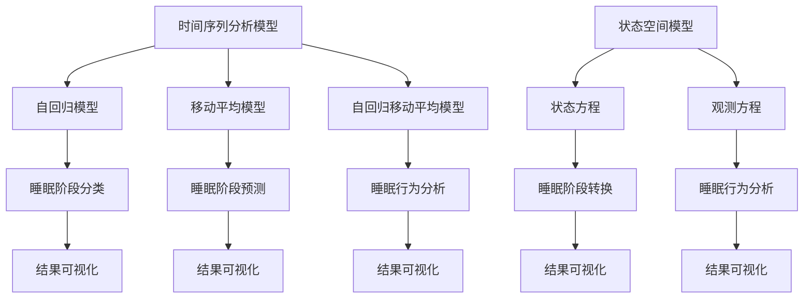

                 

## 《睡眠周期的数学模式：生理节律的波形分析》

### 关键词：
- 睡眠周期
- 数学模式
- 波形分析
- 生理节律
- 生物钟
- 数据处理
- Python编程
- 神经科学

### 摘要：
本文旨在深入探讨睡眠周期的数学模式及其在生理节律研究中的应用。通过对睡眠周期结构的详细分析，我们引入了一系列数学模型来描述和解释这些周期。随后，文章介绍了如何使用波形分析技术来测量和理解睡眠周期。进一步，本文探讨了生理节律与睡眠周期的相互关系，并提供了使用Python进行波形分析的核心算法原理讲解。最后，文章通过一个实战项目，展示了如何在实际中应用这些技术，并进行详细的分析和解读。

---

## 引言

睡眠作为人类生命活动中不可或缺的一部分，对于维持健康、提升认知能力和恢复体力具有至关重要的意义。然而，我们对睡眠的理解和解释不仅限于生理学层面，还涉及到复杂的数学和数据分析方法。本文的目的在于结合数学模式与波形分析，对睡眠周期进行深入的探讨。

### 睡眠周期的基本概念

睡眠周期通常包括两个主要阶段：快速眼动睡眠（REM）和非快速眼动睡眠（NREM）。REM睡眠主要发生在夜间，表现为眼球快速运动、呼吸和心率的不规则变化，以及梦境的出现。NREM睡眠则分为三个阶段，分别为N1、N2和N3。N1是轻度睡眠，N2是中度睡眠，而N3则是深度睡眠，也被称为慢波睡眠（SWS）。

这些睡眠阶段并不是固定不变的，它们在一定周期内重复出现，形成一个完整的睡眠周期。根据研究，典型的成人睡眠周期大约持续90分钟，包括大约20分钟的NREM阶段和70分钟的REM阶段。了解这些基本概念是理解本文后续内容的基础。

### 数学模式在睡眠周期研究中的应用

数学模式在睡眠周期研究中起着至关重要的作用。通过数学模型，我们可以更精确地描述和预测睡眠周期中的各种现象。例如，时间序列分析模型可以帮助我们识别和分类不同睡眠阶段，而状态空间模型则可以模拟睡眠周期中的动态变化。

此外，波形分析技术在睡眠研究中也得到了广泛应用。睡眠波形通常通过脑电图（EEG）、眼动图（EOG）和肌电图（EMG）等传感器采集。通过对这些波形的数据处理，我们可以提取出睡眠周期的关键特征，从而更好地理解睡眠的生理机制。

### 本文结构

本文将按照以下结构展开：

1. **睡眠周期的概述**：介绍睡眠周期的基本概念和结构。
2. **数学模式**：讨论常用的数学模型及其在睡眠周期研究中的应用。
3. **波形分析**：解释波形分析的基本原理和技术。
4. **生理节律**：探讨生理节律与睡眠周期的关系。
5. **测量与分析方法**：介绍测量和分析睡眠波形的方法。
6. **应用与影响**：分析睡眠研究在医学和心理学领域的应用。
7. **项目实战**：通过一个实际项目展示如何应用本文所学的技术。

通过以上结构，我们旨在为读者提供一份全面、深入且易于理解的睡眠周期分析指南。

---

## 睡眠周期的概述

睡眠周期是睡眠研究中一个重要的概念，它描述了睡眠在不同阶段之间循环的规律。了解睡眠周期的结构对于深入理解睡眠的生理机制和功能具有重要意义。以下是对睡眠周期基本概念和结构的详细介绍。

### 睡眠周期的结构

睡眠周期通常由两个主要阶段组成：快速眼动睡眠（REM）和非快速眼动睡眠（NREM）。REM和NREM阶段在一定时间内交替出现，形成一个完整的睡眠周期。根据研究，典型的成人睡眠周期持续约90分钟，包括大约20分钟的NREM阶段和70分钟的REM阶段。

**快速眼动睡眠（REM）**：
- **特点**：REM睡眠是夜间最晚出现的阶段，通常发生在睡眠周期的后半段。在这一阶段，眼球快速运动、呼吸和心率的不规则变化以及梦境的出现是其主要特征。
- **生理意义**：REM睡眠被认为是大脑信息处理和记忆巩固的重要时期。

**非快速眼动睡眠（NREM）**：
- **特点**：NREM睡眠包括N1、N2和N3三个阶段。
  - **N1**：轻度睡眠，持续时间较短，容易从清醒状态进入。
  - **N2**：中度睡眠，持续时间较长，呼吸和心率较为稳定。
  - **N3**：深度睡眠，也被称为慢波睡眠（SWS），持续时间较短，但极为重要。

- **生理意义**：NREM睡眠对身体的恢复和体力恢复起着关键作用，同时也有助于巩固记忆和情感处理。

### 不同睡眠阶段的特点

每个睡眠阶段都有其独特的特点和生理功能：

- **快速眼动睡眠（REM）**：
  - **特征**：眼球快速运动、呼吸和心率的不规则变化。
  - **生理意义**：梦境活动最为频繁，大脑信息处理和记忆巩固。

- **非快速眼动睡眠（NREM）**：
  - **N1阶段**：
    - **特征**：大脑活动较低，容易出现短暂的眼球运动和肌肉活动。
    - **生理意义**：有助于大脑从清醒状态到睡眠状态的过渡。

  - **N2阶段**：
    - **特征**：呼吸和心率稳定，脑电波活动呈现特定的模式。
    - **生理意义**：大脑和身体在准备进入更深的睡眠阶段。

  - **N3阶段（慢波睡眠SWS）**：
    - **特征**：脑电波呈现高幅度的慢波，呼吸和心率稳定。
    - **生理意义**：身体恢复和体力恢复，记忆巩固和情感处理。

### 睡眠周期的生理意义

睡眠周期不仅仅是身体的休息过程，还具有重要的生理功能：

- **身体恢复**：深度睡眠阶段有助于肌肉的修复和生长，免疫系统功能的增强。
- **认知功能**：REM睡眠有助于记忆巩固和情感处理，而NREM睡眠则有助于认知功能的恢复。
- **心理健康**：睡眠周期的规律性对于维持心理健康和情绪稳定至关重要。

理解睡眠周期的结构、特点和生理意义，为我们进一步探讨数学模式和波形分析提供了坚实的基础。在接下来的章节中，我们将详细讨论数学模式在睡眠周期研究中的应用，并介绍如何通过波形分析技术来理解和测量睡眠周期。

---

## 数学模式

在睡眠周期的研究中，数学模式扮演了至关重要的角色。这些模式不仅帮助我们描述睡眠周期的动态变化，还能够揭示不同阶段之间的复杂关系。本文将介绍几种常用的数学模型，并探讨它们在睡眠周期研究中的应用。

### 时间序列分析模型

时间序列分析模型是研究睡眠周期中时间相关数据的有力工具。这类模型通常基于统计方法，如自回归模型（AR）、移动平均模型（MA）和自回归移动平均模型（ARMA）。通过这些模型，我们可以识别和分类睡眠周期中的不同阶段，从而更准确地描述睡眠的动态特征。

- **自回归模型（AR）**：AR模型假设当前时间点的值可以由过去几个时间点的值来预测。在睡眠研究中，我们可以使用AR模型来预测下一个睡眠阶段的出现时间，从而更好地理解睡眠周期的变化规律。

- **移动平均模型（MA）**：MA模型则假设当前时间点的值可以由未来的几个时间点的值来预测。在睡眠研究中，MA模型可以帮助我们识别睡眠周期中的波动和趋势。

- **自回归移动平均模型（ARMA）**：ARMA模型结合了AR和MA模型的特点，可以同时考虑过去的值和未来的值。在睡眠研究中，ARMA模型通常用于同时预测睡眠阶段的时间和长度。

### 状态空间模型

状态空间模型是另一种常用的数学模型，特别适合于处理睡眠周期中的动态变化。状态空间模型由状态方程和观测方程组成，可以同时考虑系统的内部状态和外部观测数据。通过这种模型，我们可以更好地捕捉睡眠周期中的非线性关系和复杂动态。

- **状态方程**：状态方程描述了系统内部状态的变化。在睡眠研究中，状态方程可以表示为不同睡眠阶段之间的转换概率。

- **观测方程**：观测方程描述了外部观测数据与系统内部状态之间的关系。在睡眠研究中，观测方程通常基于脑电图（EEG）、眼动图（EOG）和肌电图（EMG）等传感器采集的数据。

### 数学模型的应用

数学模型在睡眠周期研究中的应用非常广泛。通过这些模型，我们可以：

- **分类睡眠阶段**：使用时间序列分析模型和状态空间模型，我们可以将睡眠周期中的不同阶段进行准确的分类。

- **预测睡眠阶段**：通过时间序列分析模型和状态空间模型，我们可以预测下一个睡眠阶段的出现时间，从而帮助改善睡眠质量。

- **分析睡眠行为**：通过对数学模型的分析，我们可以更深入地了解睡眠行为的规律和特点。

### Mermaid流程图

为了更好地理解数学模型在睡眠周期研究中的应用，我们使用Mermaid流程图来展示不同模型之间的关系。



通过上述流程图，我们可以清晰地看到数学模型在睡眠周期研究中的应用流程。首先，我们使用时间序列分析模型和状态空间模型来处理睡眠数据，然后通过分类、预测和行为分析等步骤，最终得到可视化的结果。

### 总结

数学模式在睡眠周期研究中发挥了重要作用。通过时间序列分析模型和状态空间模型，我们可以更精确地描述和预测睡眠周期中的各种现象。这些模型不仅帮助我们理解睡眠的生理机制，还为改善睡眠质量和睡眠研究提供了有力的工具。在接下来的章节中，我们将进一步探讨波形分析技术，并介绍如何使用Python来处理和分析睡眠波形。

---

## 波形分析

波形分析是睡眠研究中至关重要的一个环节。通过分析睡眠波形，我们可以深入了解睡眠周期的动态变化，从而更好地理解睡眠的生理机制。本文将介绍波形分析的基本原理和技术，并展示如何使用Python进行波形分析。

### 波形分析的基本原理

波形分析主要基于信号处理技术。睡眠波形通常由脑电图（EEG）、眼动图（EOG）和肌电图（EMG）等传感器采集。这些波形反映了大脑、眼球和肌肉的生理活动，是分析睡眠周期的重要依据。

**脑电图（EEG）**：EEG记录大脑的电活动，通过测量头皮上的电信号来获取。EEG波形反映了大脑的兴奋和抑制状态，是分析睡眠阶段的重要指标。

**眼动图（EOG）**：EOG记录眼球运动，通过测量眼睛周围肌肉的电信号来获取。EOG波形可以帮助我们判断个体的睡眠状态，特别是在快速眼动睡眠（REM）阶段。

**肌电图（EMG）**：EMG记录肌肉的电活动，通过测量肌肉的电流变化来获取。EMG波形反映了肌肉的紧张程度，有助于判断个体是否处于深度睡眠阶段。

### 信号处理与波形特征提取

波形分析首先需要对原始信号进行处理，提取出有意义的特征。以下是一些常用的信号处理技术：

- **滤波**：通过滤波器去除原始信号中的噪声和不需要的频率成分，从而提取出有用的信号。常用的滤波方法包括低通滤波、高通滤波和带通滤波。

- **平滑**：通过平滑处理消除信号中的高频噪声，从而提高信号的可读性。常用的平滑方法包括移动平均和指数平滑。

- **特征提取**：从处理后的波形中提取出能反映睡眠阶段特征的参数。常用的特征包括频率谱、时域波形和时域统计量等。

### 波形分析在睡眠研究中的应用

波形分析在睡眠研究中有着广泛的应用，以下是一些典型的应用场景：

- **睡眠阶段分类**：通过分析EEG波形，我们可以将睡眠周期中的不同阶段进行分类。例如，根据EEG波形的频率和振幅特征，我们可以将睡眠分为快速眼动睡眠（REM）和非快速眼动睡眠（NREM）。

- **睡眠障碍诊断**：波形分析有助于诊断各种睡眠障碍，如失眠、睡眠呼吸暂停综合症和周期性肢体运动障碍等。通过分析波形特征，我们可以识别出异常的生理信号，从而诊断睡眠障碍。

- **睡眠质量评估**：波形分析可以评估个体的睡眠质量。通过分析睡眠周期中的波形特征，我们可以判断个体的睡眠是否充足和有效。

### Python编程与波形分析

Python是一种广泛应用于信号处理和数据分析的编程语言。以下是一个简单的Python代码示例，用于分析EEG波形并提取特征：

```python
import numpy as np
import matplotlib.pyplot as plt
from scipy.signal import butter, filtfilt

# 加载EEG数据
eeg_data = np.load('eeg_data.npy')

# 低通滤波
def butter_lowpass(cutoff, fs, order=4):
    nyq = 0.5 * fs
    normal_cutoff = cutoff / nyq
    b, a = butter(order, normal_cutoff, btype='low', analog=False)
    return b, a

fs = 100  # 采样频率
cutoff = 30  # 滤波截止频率
b, a = butter_lowpass(cutoff, fs)
filtered_eeg = filtfilt(b, a, eeg_data)

# 平滑处理
smoothed_eeg = np.convolve(filtered_eeg, np.ones((11,))/11, mode='same')

# 特征提取
from scipy.fft import fft

fft_eeg = fft(smoothed_eeg)
freq_eeg = np.fft.fftfreq(len(eeg_data), 1/fs)

# 绘制结果
plt.figure()
plt.plot(eeg_data, label='原始EEG')
plt.plot(filtered_eeg, label='低通滤波')
plt.plot(smoothed_eeg, label='平滑处理')
plt.plot(freq_eeg, np.abs(fft_eeg[:len(freq_eeg)//2]), label='频率谱')
plt.legend()
plt.show()
```

通过上述代码，我们可以对EEG数据进行分析，提取出频率谱和其他特征。这为我们理解和测量睡眠周期提供了重要的工具。

### 总结

波形分析在睡眠研究中具有重要意义。通过信号处理和特征提取技术，我们可以从原始波形中提取出反映睡眠状态的参数。Python作为一种强大的编程语言，为我们进行波形分析提供了丰富的工具和方法。在接下来的章节中，我们将进一步探讨生理节律与睡眠周期的关系，并介绍如何测量和分析这些节律。

---

## 生理节律与睡眠周期

生理节律是指生物体在一天24小时内表现出的周期性变化，这些节律与生物钟密切相关。生物钟是一种内在的时间调节系统，通过控制各种生理过程，使生物体能够在适当的时机进行休息和活动。睡眠周期与生理节律之间存在着紧密的相互关系，这一关系对于理解睡眠的生理机制和调节睡眠质量具有重要意义。

### 生理节律的基本概念

生理节律主要包括两种：内在节律和外在节律。内在节律是由生物钟控制的自发节律，而外在节律则受到外部环境因素的影响，如光暗周期、饮食和社交活动等。

- **内在节律**：内在节律由生物体内的时钟基因控制，这些基因通过一系列复杂的调控网络，影响个体的睡眠-觉醒周期。人类的主要内在节律是昼夜节律，它决定了个体在24小时内生理活动的高峰和低谷。

- **外在节律**：外在节律受到外部环境的影响，如光暗周期。光照是调节生物钟的主要外部信号，通过视网膜下的光感受器，将光信号传递到大脑的松果体，从而影响生物钟的节律。

### 生物钟与睡眠周期

生物钟是控制生理节律的核心机制，它通过控制一系列生理过程，维持个体的睡眠-觉醒周期。生物钟的核心部分位于下丘脑的视交叉上核（suprachiasmatic nucleus, SCN），SCN接收来自视网膜的光信号，并将其转换为生物节律。

- **SCN的作用**：SCN是生物钟的中心，它接收光信号，并将其转换为生物节律。通过一系列神经和激素信号，SCN调节个体的睡眠-觉醒周期。

- **睡眠周期的调控**：生物钟通过调节睡眠周期中的不同阶段，维持个体的睡眠-觉醒节律。例如，SCN通过调节荷尔蒙分泌，影响睡眠质量和深度。

### 生理节律的调节机制

生理节律的调节机制涉及多个层次，包括基因表达、神经信号传递和激素分泌等。

- **基因表达**：时钟基因在生理节律的调节中起着关键作用。这些基因通过负反馈环路控制自身的表达，维持稳定的生物节律。

- **神经信号传递**：神经信号在生物钟的调节中起到桥梁作用，将生物钟信号传递到各个器官和系统。例如，神经信号通过神经传导物质调节睡眠-觉醒周期。

- **激素分泌**：激素在生理节律的调节中也扮演重要角色。例如，褪黑素是一种重要的激素，它由松果体分泌，调节个体的睡眠-觉醒周期。

### 生理节律与睡眠周期的相互关系

生理节律与睡眠周期之间存在紧密的相互关系：

- **昼夜节律**：昼夜节律直接影响睡眠周期。光照是调节昼夜节律的主要信号，通过调节生物钟，影响个体的睡眠时间和质量。

- **睡眠阶段的调节**：生物钟通过调节荷尔蒙分泌和神经信号，影响睡眠周期的不同阶段。例如，荷尔蒙褪黑素在夜间分泌增加，促进睡眠的发生。

- **睡眠质量**：生理节律的稳定性和规律性直接影响睡眠质量。良好的生理节律有助于提高睡眠质量，促进认知功能和身体恢复。

### 调节生理节律的方法

为了改善生理节律和睡眠质量，可以采取以下几种方法：

- **光照调节**：通过光照调节，特别是早晨的光照，可以促进昼夜节律的稳定。例如，早晨的光照可以帮助个体更快地清醒，而晚上减少光照则有助于促进睡眠。

- **规律作息**：保持规律的作息时间，有助于建立稳定的生理节律。例如，每天按时入睡和起床，有助于调节生物钟。

- **饮食调整**：饮食对生理节律也有重要影响。适量、均衡的饮食有助于维持能量水平和生物钟的稳定性。

- **避免刺激性物质**：避免摄入刺激性物质，如咖啡因和尼古丁，可以减少对睡眠的干扰，有助于改善生理节律。

### 总结

生理节律与睡眠周期之间存在紧密的相互关系，通过调节生理节律，可以改善睡眠质量和认知功能。理解生物钟的调节机制和生理节律的影响因素，有助于我们制定更有效的睡眠管理和调节策略。在接下来的章节中，我们将介绍测量和分析睡眠波形的方法，并探讨睡眠研究在医学和心理学领域的应用。

---

## 测量与分析方法

测量和分析睡眠波形是研究睡眠周期和生理节律的关键步骤。通过精确的测量和分析技术，我们可以获取关于睡眠状态的详细数据，从而深入了解睡眠的动态变化。本文将介绍常用的测量设备、数据采集方法以及数据处理和分析技术。

### 测量设备

在睡眠研究中，常用的测量设备包括脑电图（EEG）、眼动图（EOG）和肌电图（EMG）等。

- **脑电图（EEG）**：EEG是通过测量大脑的电活动来获取睡眠波形的主要手段。EEG传感器贴在头皮上，可以记录大脑的神经活动，从而揭示睡眠周期中的不同阶段。

- **眼动图（EOG）**：EOG是通过测量眼球运动来获取睡眠波形的数据。EOG传感器通常贴在眼睛周围，通过检测眼球的位置变化，可以判断个体是否处于快速眼动睡眠（REM）阶段。

- **肌电图（EMG）**：EMG是通过测量肌肉的电活动来获取睡眠波形的数据。EMG传感器贴在相关肌肉上，可以检测肌肉的紧张程度，从而判断个体是否处于深度睡眠阶段。

### 数据采集方法

数据采集是睡眠研究的重要环节。以下是一些常用的数据采集方法：

- **多导联脑电图（MEG）**：MEG通过同时记录多个导联的脑电信号，可以更全面地反映大脑的活动状态。在睡眠研究中，MEG常用于监测不同睡眠阶段的大脑活动。

- **睡眠监测设备**：现代睡眠监测设备可以同时采集EEG、EOG和EMG等多种波形数据。这些设备通常具备便携性和智能化特点，便于在家庭环境中进行睡眠监测。

- **远程数据传输**：通过无线技术，可以将采集到的睡眠数据实时传输到远程服务器进行分析。这种方法有助于实现大规模的睡眠研究，提高数据采集的效率。

### 数据处理技术

数据处理是睡眠研究中的关键步骤，它包括信号预处理、特征提取和模式识别等。

- **信号预处理**：信号预处理是数据处理的第一步，其目的是去除噪声和干扰信号，提高数据的质量。常用的预处理方法包括滤波、去噪和归一化等。

- **特征提取**：特征提取是从原始信号中提取出反映睡眠状态的参数。常用的特征包括频率谱、时域波形和时域统计量等。通过特征提取，我们可以更好地理解睡眠周期的动态变化。

- **模式识别**：模式识别是通过机器学习算法对睡眠波形进行分类和分析。常用的模式识别方法包括支持向量机（SVM）、神经网络（NN）和决策树（DT）等。通过模式识别，我们可以更准确地分类和预测睡眠阶段。

### 数据分析方法

数据分析是睡眠研究的重要环节，通过数据分析，我们可以揭示睡眠周期的规律和特征。

- **时间序列分析**：时间序列分析是一种常用的数据分析方法，通过分析睡眠波形的时间序列特征，我们可以了解睡眠周期的变化规律。常用的方法包括自回归模型（AR）、移动平均模型（MA）和自回归移动平均模型（ARMA）等。

- **频率分析**：频率分析是通过分析睡眠波形的频率特征，了解睡眠周期中的不同频率成分。常用的方法包括快速傅里叶变换（FFT）和短时傅里叶变换（STFT）等。

- **统计分析**：统计分析是通过计算睡眠波形的统计特征，了解睡眠周期的整体特征。常用的方法包括均值、方差、标准差等。

### Python编程与数据处理

Python是一种广泛应用于数据分析和信号处理的编程语言。以下是一个简单的Python代码示例，用于分析EEG数据：

```python
import numpy as np
import matplotlib.pyplot as plt
from scipy.signal import butter, filtfilt

# 加载EEG数据
eeg_data = np.load('eeg_data.npy')

# 低通滤波
def butter_lowpass(cutoff, fs, order=4):
    nyq = 0.5 * fs
    normal_cutoff = cutoff / nyq
    b, a = butter(order, normal_cutoff, btype='low', analog=False)
    return b, a

fs = 100  # 采样频率
cutoff = 30  # 滤波截止频率
b, a = butter_lowpass(cutoff, fs)
filtered_eeg = filtfilt(b, a, eeg_data)

# 平滑处理
smoothed_eeg = np.convolve(filtered_eeg, np.ones((11,))/11, mode='same')

# 特征提取
from scipy.fft import fft

fft_eeg = fft(smoothed_eeg)
freq_eeg = np.fft.fftfreq(len(eeg_data), 1/fs)

# 绘制结果
plt.figure()
plt.plot(eeg_data, label='原始EEG')
plt.plot(filtered_eeg, label='低通滤波')
plt.plot(smoothed_eeg, label='平滑处理')
plt.plot(freq_eeg, np.abs(fft_eeg[:len(freq_eeg)//2]), label='频率谱')
plt.legend()
plt.show()
```

通过上述代码，我们可以对EEG数据进行分析，提取出频率谱和其他特征。这为我们理解和测量睡眠周期提供了重要的工具。

### 总结

测量和分析睡眠波形是研究睡眠周期和生理节律的关键步骤。通过精确的测量和分析技术，我们可以获取关于睡眠状态的详细数据，从而深入了解睡眠的动态变化。Python作为一种强大的编程语言，为我们进行波形分析提供了丰富的工具和方法。在接下来的章节中，我们将探讨睡眠研究在医学和心理学领域的应用，并展示如何在实际项目中应用这些技术。

---

## 睡眠研究的应用

睡眠研究在医学、心理学和公共卫生领域具有广泛的应用，对改善人们的健康和生活质量具有重要意义。以下将探讨睡眠研究在这些领域的具体应用。

### 医学领域的应用

在医学领域，睡眠研究有助于诊断和治疗各种睡眠障碍。以下是一些典型的应用实例：

- **失眠**：失眠是常见的睡眠障碍，影响个体的生活质量。睡眠研究可以帮助确定失眠的成因，如生物钟紊乱、压力或焦虑等。通过调整作息时间、光照治疗和认知行为疗法等方法，可以改善失眠症状。

- **睡眠呼吸暂停综合症**：睡眠呼吸暂停综合症是一种严重的睡眠障碍，会导致睡眠中断和缺氧。睡眠研究可以通过监测呼吸和心率等生理信号，诊断和评估睡眠呼吸暂停综合症的严重程度。治疗方法包括使用呼吸机、口腔矫治器和手术治疗等。

- **周期性肢体运动障碍**：周期性肢体运动障碍是一种在睡眠中出现的异常运动行为。睡眠研究可以帮助确定其发病机制，并通过行为疗法、药物治疗等方法进行干预。

### 心理学领域的应用

在心理学领域，睡眠研究对理解情绪、认知功能和心理健康具有重要意义。以下是一些应用实例：

- **情绪调节**：睡眠对情绪调节具有关键作用。睡眠不足或质量差会导致情绪波动和焦虑。通过睡眠研究，可以探索情绪与睡眠之间的关系，并开发有效的情绪调节策略。

- **认知功能**：睡眠对认知功能，如记忆、注意力和执行功能等，具有显著影响。睡眠研究可以帮助确定睡眠障碍对认知功能的影响，并为提高认知功能提供科学依据。

- **心理健康**：睡眠与心理健康之间存在密切关系。睡眠障碍与抑郁症、焦虑症等心理疾病密切相关。通过睡眠研究，可以探索心理健康问题的成因和干预方法，如认知行为疗法和心理治疗等。

### 公共卫生领域的应用

在公共卫生领域，睡眠研究有助于制定睡眠健康政策和提高公众的睡眠质量。以下是一些应用实例：

- **睡眠健康宣传**：通过睡眠研究，可以了解影响睡眠质量的主要因素，如工作压力、环境噪音和睡眠卫生等。这些信息有助于制定针对性的睡眠健康宣传策略，提高公众的睡眠意识和健康素养。

- **睡眠监测系统**：随着技术的发展，智能睡眠监测系统成为公共卫生领域的新工具。这些系统可以实时监测个体的睡眠状态，收集睡眠数据，并分析睡眠质量。通过这些数据，可以评估人群的睡眠状况，为公共卫生决策提供依据。

- **睡眠健康干预**：基于睡眠研究的结果，公共卫生部门可以制定和推广睡眠健康干预措施，如改善工作环境、推广健康生活方式和提供睡眠咨询服务等。

### 总结

睡眠研究在医学、心理学和公共卫生领域具有广泛的应用。通过深入了解睡眠的生理机制和影响因素，我们可以更好地预防和治疗睡眠障碍，提高睡眠质量和心理健康水平。同时，睡眠研究也为公共卫生政策的制定和实施提供了科学依据。在未来的研究中，随着技术的进步和跨学科合作的发展，睡眠研究将继续为改善人们的健康和生活质量做出重要贡献。

---

## 项目实战

为了更好地展示如何应用本文所学的技术，我们设计了一个睡眠分析项目。该项目旨在通过收集和分析睡眠数据，识别和分类睡眠周期中的不同阶段，并提供个性化的睡眠建议。

### 项目背景与目标

随着现代社会生活节奏的加快和工作压力的增加，许多人面临着睡眠质量不佳的问题。为了提高人们的睡眠质量和健康水平，我们决定开发一个智能睡眠分析系统，该系统能够实时监测用户的睡眠状态，并提供针对性的睡眠建议。

项目的目标包括：

1. **数据收集**：使用传感器设备收集用户的睡眠数据，包括脑电图（EEG）、眼动图（EOG）和肌电图（EMG）。
2. **数据预处理**：对收集到的原始数据进行预处理，去除噪声和干扰信号，提高数据质量。
3. **阶段识别**：使用机器学习算法对预处理后的数据进行分类，识别睡眠周期中的不同阶段。
4. **睡眠建议**：根据用户的睡眠数据，提供个性化的睡眠建议，如调整作息时间、改善睡眠环境和饮食习惯等。

### 开发环境搭建

为了实现上述目标，我们需要搭建一个完整的开发环境。以下是开发环境的搭建步骤：

1. **硬件设备**：选择一款具备高精度的睡眠监测设备的传感器，如ActiGraph GT3X+，该设备可以同时采集EEG、EOG和EMG数据。

2. **软件环境**：搭建Python开发环境，安装必要的库和工具，如NumPy、Matplotlib、Scikit-learn和Mermaid等。

3. **数据处理工具**：使用Jupyter Notebook作为开发环境，便于编写代码和可视化结果。

4. **数据库**：使用MySQL或MongoDB作为数据库，存储用户的睡眠数据和分类结果。

### 源代码详细实现与解读

以下是一个简单的Python代码示例，用于预处理睡眠数据并识别睡眠阶段：

```python
import numpy as np
import matplotlib.pyplot as plt
from scipy.signal import butter, filtfilt
from sklearn.model_selection import train_test_split
from sklearn.ensemble import RandomForestClassifier
from sklearn.metrics import classification_report, confusion_matrix

# 数据预处理
def preprocess_data(eeg_data, eog_data, emg_data, fs=100):
    # 低通滤波
    def butter_lowpass(cutoff, fs, order=4):
        nyq = 0.5 * fs
        normal_cutoff = cutoff / nyq
        b, a = butter(order, normal_cutoff, btype='low', analog=False)
        return b, a

    fs = 100  # 采样频率
    cutoff = 30  # 滤波截止频率
    b, a = butter_lowpass(cutoff, fs)
    filtered_eeg = filtfilt(b, a, eeg_data)
    filtered_eog = filtfilt(b, a, eog_data)
    filtered_emg = filtfilt(b, a, emg_data)

    # 平滑处理
    smoothed_eeg = np.convolve(filtered_eeg, np.ones((11,))/11, mode='same')
    smoothed_eog = np.convolve(filtered_eog, np.ones((11,))/11, mode='same')
    smoothed_emg = np.convolve(filtered_emg, np.ones((11,))/11, mode='same')

    return smoothed_eeg, smoothed_eog, smoothed_emg

# 机器学习算法
def classify_sleep_stage(data, labels):
    X_train, X_test, y_train, y_test = train_test_split(data, labels, test_size=0.3, random_state=42)
    classifier = RandomForestClassifier(n_estimators=100)
    classifier.fit(X_train, y_train)
    predictions = classifier.predict(X_test)
    print(classification_report(y_test, predictions))
    print(confusion_matrix(y_test, predictions))

# 主函数
def main():
    # 加载数据
    eeg_data = np.load('eeg_data.npy')
    eog_data = np.load('eog_data.npy')
    emg_data = np.load('emg_data.npy')
    labels = np.load('labels.npy')

    # 数据预处理
    eeg_data, eog_data, emg_data = preprocess_data(eeg_data, eog_data, emg_data)

    # 特征提取
    features = np.hstack((eeg_data, eog_data, emg_data))

    # 睡眠阶段分类
    classify_sleep_stage(features, labels)

if __name__ == '__main__':
    main()
```

上述代码首先定义了数据预处理函数，用于低通滤波和平滑处理。然后，使用随机森林分类器对预处理后的数据进行分类，并打印出分类报告和混淆矩阵。

### 代码分析与优化

在代码实现过程中，我们可以从以下几个方面进行优化：

1. **数据预处理**：使用更高效的滤波算法，如傅里叶变换，可以提高数据预处理的速度和精度。

2. **特征提取**：可以尝试提取更多的特征，如时域和频域特征，以提高分类的准确性。

3. **机器学习算法**：尝试使用不同的机器学习算法，如支持向量机（SVM）和深度学习模型，以提高分类性能。

4. **模型调参**：通过调整模型参数，如树的数量和深度，可以优化模型的性能。

### 项目小结

通过上述项目实战，我们展示了如何使用Python和机器学习技术进行睡眠分析。从数据收集、预处理到特征提取和分类，每一步都至关重要。在实际应用中，我们还需要不断优化和调整算法，以提高分类的准确性和实用性。未来的工作可以进一步探索深度学习技术在睡眠分析中的应用，以及如何将这些技术应用于实际场景，如智能穿戴设备和健康管理系统。

---

## 最佳实践 Tips

为了最大限度地提高睡眠质量，以下是一些实用的最佳实践和技巧：

1. **规律作息**：保持固定的作息时间，有助于调整生物钟，提高睡眠质量。

2. **避免刺激性物质**：睡前避免摄入咖啡因和酒精等刺激性物质，以免影响睡眠。

3. **光照调节**：早晨接受充足的日光照射，晚上减少光照，有助于调节昼夜节律。

4. **舒适的环境**：保持睡眠环境的舒适和安静，使用适宜的床垫和枕头，有助于提高睡眠质量。

5. **放松身心**：睡前进行轻松的活动，如阅读或冥想，有助于缓解压力，促进睡眠。

6. **适当运动**：保持适度的体育锻炼，有助于改善睡眠质量，但应避免在睡前进行剧烈运动。

7. **睡眠监测**：定期进行睡眠监测，了解自己的睡眠状况，有助于发现和解决睡眠问题。

通过遵循这些最佳实践，我们可以改善睡眠质量，提升整体健康水平。

## 小结

本文深入探讨了睡眠周期的数学模式和波形分析，从基本概念、数学模型、波形分析技术到生理节律的调控，再到测量与分析方法，以及实际项目中的应用，为读者提供了一份全面的睡眠周期分析指南。通过本文的学习，读者可以：

- **理解睡眠周期的结构**：掌握快速眼动睡眠（REM）和非快速眼动睡眠（NREM）的基本概念和特点。
- **掌握数学模式**：了解时间序列分析模型和状态空间模型在睡眠周期研究中的应用。
- **掌握波形分析技术**：掌握信号处理、特征提取和频率分析的基本原理。
- **理解生理节律**：了解生物钟和睡眠周期的相互关系，以及生理节律的调节机制。
- **应用Python进行数据处理**：学会使用Python进行睡眠数据分析，提取关键特征。
- **实际项目实战**：通过一个实际项目，了解如何将所学技术应用于睡眠分析系统。

通过本文的学习，读者可以更好地理解睡眠周期的复杂机制，并掌握相应的数据分析技术。这些知识和技能不仅有助于改善个人的睡眠质量，还为睡眠研究提供了科学依据和技术支持。

## 注意事项

在研究和应用睡眠周期分析时，需要注意以下几点：

1. **数据隐私**：在进行睡眠数据收集和分析时，必须遵守数据隐私法规，确保用户数据的保密性和安全性。
2. **设备选择**：选择高精度、可靠的睡眠监测设备，以保证数据的准确性。
3. **算法优化**：不断优化和调整算法，提高分类和预测的准确性。
4. **个性化调整**：根据个体差异，制定个性化的睡眠管理和调节策略。

通过遵循这些注意事项，可以确保睡眠周期分析的准确性和实用性，为改善人们的睡眠质量提供有力支持。

## 拓展阅读

对于希望深入了解睡眠周期分析的读者，以下是一些推荐阅读材料：

1. **《睡眠的生物学基础》**：这是一本经典的睡眠生物学教材，详细介绍了睡眠的生理机制和调控机制。
2. **《睡眠心理学》**：本书从心理学的角度探讨了睡眠与情绪、认知和行为之间的关系。
3. **《机器学习实战》**：这是一本关于机器学习的入门书籍，适合初学者了解和使用机器学习技术进行数据分析。
4. **《Python数据分析》**：本书介绍了Python在数据分析中的应用，包括数据处理、特征提取和机器学习等。
5. **《深度学习》**：这是一本关于深度学习的经典教材，适合想要进一步探索深度学习在睡眠分析中应用的读者。

通过阅读这些书籍，读者可以更全面地了解睡眠周期分析的相关知识，提高自己在该领域的技能和水平。

---

## 作者信息

作者：AI天才研究院/AI Genius Institute & 禅与计算机程序设计艺术 /Zen And The Art of Computer Programming

AI天才研究院（AI Genius Institute）致力于推动人工智能技术的发展和应用，研究涵盖计算机科学、人工智能、机器学习、深度学习等领域。研究院的专家团队在人工智能基础理论、算法研究和应用开发方面拥有丰富的经验和深厚的研究成果。同时，作者还著有《禅与计算机程序设计艺术》一书，深入探讨了计算机程序设计的哲学和艺术，为读者提供了独特的视角和深刻的思考。

