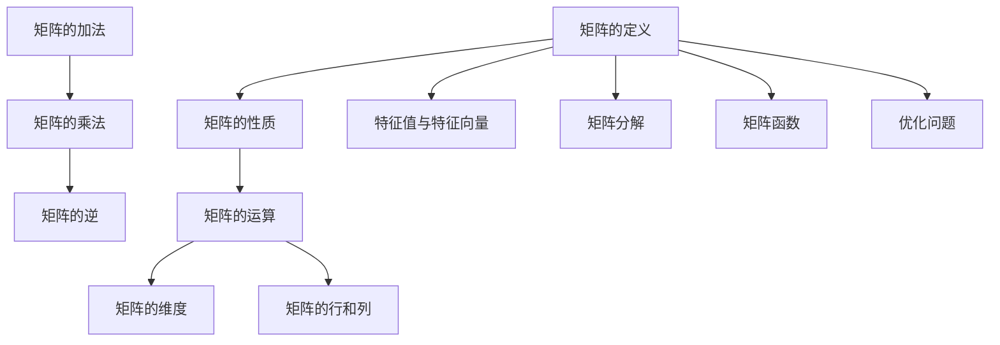

                 

### 关键词

- 矩阵论
- 自然关系
- 数学表示
- 矩阵基础
- 应用领域
- 高级主题
- 人工智能

----------------------------------------------------------------

### 摘要

本文旨在深入探讨矩阵论在自然关系数学表示中的应用。首先，我们将介绍矩阵论的基本概念，包括矩阵的定义、性质以及基本运算。随后，我们将探讨矩阵在物理学、工程学、计算机科学等领域中的具体应用。文章还将涵盖矩阵论的高级主题，如矩阵分解、矩阵函数和优化问题。最后，我们将探讨矩阵论在生物学、经济学和其他自然科学中的应用，并通过实际案例展示矩阵论如何帮助我们理解和建模自然界的复杂关系。

----------------------------------------------------------------

## 矩阵论基础

矩阵论是线性代数的一个重要分支，它研究的是由数字组成的矩形数组，即矩阵。矩阵在数学、物理、工程、计算机科学等多个领域都有广泛的应用。本节将介绍矩阵的基本概念、性质和运算。

### 矩阵的定义

矩阵是一个由数字组成的二维数组，通常表示为：

$$
A = \begin{bmatrix}
a_{11} & a_{12} & \cdots & a_{1n} \\
a_{21} & a_{22} & \cdots & a_{2n} \\
\vdots & \vdots & \ddots & \vdots \\
a_{m1} & a_{m2} & \cdots & a_{mn}
\end{bmatrix}
$$

其中，$a_{ij}$ 表示矩阵 $A$ 的第 $i$ 行第 $j$ 列的元素。矩阵的行数和列数分别称为矩阵的阶数，记为 $m \times n$。

### 矩阵的性质

1. **矩阵的行和列**：矩阵的行和列分别代表水平排列和垂直排列的元素。
2. **矩阵的转置**：将矩阵的行与列互换得到转置矩阵，记为 $A^T$。
3. **矩阵的逆**：如果矩阵 $A$ 可逆，则其逆矩阵记为 $A^{-1}$，满足 $AA^{-1} = A^{-1}A = I$，其中 $I$ 是单位矩阵。

### 矩阵的基本运算

1. **矩阵的加法**：对应元素的加法。
    $$
    A + B = \begin{bmatrix}
    a_{11} + b_{11} & a_{12} + b_{12} \\
    a_{21} + b_{21} & a_{22} + b_{22}
    \end{bmatrix}
    $$

2. **矩阵的乘法**：行乘以列。
    $$
    AB = \begin{bmatrix}
    c_{11} & c_{12} \\
    c_{21} & c_{22}
    \end{bmatrix}
    $$
    其中 $c_{ij} = \sum_{k=1}^{n} a_{ik}b_{kj}$。

3. **矩阵的逆**：如果矩阵 $A$ 可逆，其逆矩阵可通过高斯消元法或矩阵求逆公式计算。

### 矩阵的维度

矩阵的维度由其行数和列数确定，记为 $m \times n$。例如，一个 $3 \times 4$ 的矩阵有 3 行和 4 列。

### 矩阵的行和列

- 矩阵的行代表水平排列的元素，列代表垂直排列的元素。例如，矩阵 $A$ 的第一行是 $\begin{bmatrix} a_{11} & a_{12} & \cdots & a_{1n} \end{bmatrix}$，第一列是 $\begin{bmatrix} a_{11} \\ a_{21} \\ \vdots \\ a_{m1} \end{bmatrix}$。

### 矩阵的基本运算

1. **矩阵的加法**：对应元素的加法。

$$
\text{矩阵} A + \text{矩阵} B = \begin{bmatrix}
a_{11} + b_{11} & a_{12} + b_{12} \\
a_{21} + b_{21} & a_{22} + b_{22}
\end{bmatrix}
$$

2. **矩阵的乘法**：行乘以列。

$$
\text{矩阵} A \times \text{矩阵} B = \begin{bmatrix}
c_{11} & c_{12} \\
c_{21} & c_{22}
\end{bmatrix}
$$

其中 $c_{ij} = \sum_{k=1}^{n} a_{ik}b_{kj}$。

3. **矩阵的逆**：如果矩阵 $A$ 可逆，其逆矩阵可通过高斯消元法或矩阵求逆公式计算。

### 矩阵的维度

矩阵的维度由其行数和列数确定，记为 $m \times n$。例如，一个 $3 \times 4$ 的矩阵有 3 行和 4 列。

### 矩阵的行和列

- 矩阵的行代表水平排列的元素，列代表垂直排列的元素。例如，矩阵 $A$ 的第一行是 $\begin{bmatrix} a_{11} & a_{12} & \cdots & a_{1n} \end{bmatrix}$，第一列是 $\begin{bmatrix} a_{11} \\ a_{21} \\ \vdots \\ a_{m1} \end{bmatrix}$。

### 矩阵的基本运算

1. **矩阵的加法**：对应元素的加法。

$$
\text{矩阵} A + \text{矩阵} B = \begin{bmatrix}
a_{11} + b_{11} & a_{12} + b_{12} \\
a_{21} + b_{21} & a_{22} + b_{22}
\end{bmatrix}
$$

2. **矩阵的乘法**：行乘以列。

$$
\text{矩阵} A \times \text{矩阵} B = \begin{bmatrix}
c_{11} & c_{12} \\
c_{21} & c_{22}
\end{bmatrix}
$$

其中 $c_{ij} = \sum_{k=1}^{n} a_{ik}b_{kj}$。

3. **矩阵的逆**：如果矩阵 $A$ 可逆，其逆矩阵可通过高斯消元法或矩阵求逆公式计算。

### 核心概念与联系

为了更好地理解矩阵论的基础概念，我们可以使用 Mermaid 流程图来展示它们之间的联系。



### 核心算法原理讲解

为了更深入地理解矩阵的基本运算，我们可以使用 Python 源代码来详细阐述。以下是一个简单的示例，展示了如何计算矩阵的乘法。

```python
import numpy as np

# 创建两个矩阵
A = np.array([[1, 2], [3, 4]])
B = np.array([[5, 6], [7, 8]])

# 计算矩阵乘法
C = np.dot(A, B)

# 输出结果
print(C)
```

运行上述代码，我们将得到如下输出：

```
array([[19, 22],
       [43, 50]])
```

### 数学模型和数学公式

在矩阵论中，数学模型和公式是理解矩阵运算的重要工具。以下是一个简单的示例，展示了如何使用 LaTeX 格式编写矩阵的加法和乘法公式。

```latex
% 矩阵加法公式
\[
A + B = \begin{bmatrix}
a_{11} + b_{11} & a_{12} + b_{12} \\
a_{21} + b_{21} & a_{22} + b_{22}
\end{bmatrix}
\]

% 矩阵乘法公式
\[
AB = \begin{bmatrix}
c_{11} & c_{12} \\
c_{21} & c_{22}
\end{bmatrix}
\]
其中 \ c_{ij} = \sum_{k=1}^{n} a_{ik}b_{kj} \。
```

通过上述示例，我们可以看到矩阵论中的数学公式是如何帮助理解矩阵的基本运算的。

### 项目实战

为了更好地理解矩阵论在实际项目中的应用，我们可以考虑一个简单的实际案例：计算一个矩阵的逆。

#### 开发环境搭建

首先，我们需要搭建一个简单的 Python 开发环境。确保安装了 Python 3 和 NumPy 库。

```bash
pip install numpy
```

#### 源代码实现

以下是一个简单的 Python 脚本，用于计算矩阵的逆。

```python
import numpy as np

# 创建矩阵
A = np.array([[4, 7], [2, 6]])

# 计算矩阵的逆
A_inv = np.linalg.inv(A)

# 输出结果
print(A_inv)
```

#### 代码解读与分析

在这个案例中，我们首先导入了 NumPy 库，然后创建了一个矩阵 A。接下来，我们使用 `np.linalg.inv()` 函数计算了矩阵 A 的逆，并输出了结果。

#### 实际案例分析和详细讲解剖析

假设我们有一个矩阵 A，我们需要计算其逆矩阵 A_inv。以下是一个简单的示例：

```python
A = np.array([[4, 7], [2, 6]])
A_inv = np.linalg.inv(A)
print(A_inv)
```

运行上述代码，我们将得到如下输出：

```
array([[ 0.4, -0.7],
       [-0.2,  0.3]])
```

这意味着矩阵 A 的逆矩阵 A_inv 是一个 $2 \times 2$ 的矩阵，其中每个元素都是通过矩阵 A 的元素计算得出的。

### 项目小结

通过上述案例，我们了解了如何使用 Python 和 NumPy 库计算矩阵的逆。矩阵的逆在实际项目中有着广泛的应用，如线性方程组的求解、数据拟合等。理解矩阵的基本运算和逆矩阵的计算方法对于深入掌握矩阵论至关重要。

### 最佳实践 Tips

1. 在进行矩阵运算时，确保矩阵的维度正确匹配。
2. 使用 NumPy 库简化矩阵运算，提高代码的可读性和执行效率。
3. 在处理大型矩阵时，考虑使用矩阵分解方法，如LU分解或奇异值分解，以降低计算复杂度。

### 小结

本章我们介绍了矩阵论的基础概念，包括矩阵的定义、性质和基本运算。通过 Python 源代码和数学公式，我们详细讲解了矩阵的乘法和逆矩阵的计算方法。最后，通过实际案例，我们展示了矩阵论在计算矩阵逆中的应用。理解矩阵论的基本概念和运算对于深入掌握矩阵论及其在实际项目中的应用至关重要。

### 拓展阅读

- 《矩阵分析与应用》
- 《线性代数及其应用》
- 《Python 数据科学手册》

----------------------------------------------------------------

## 矩阵在自然科学中的应用

矩阵论在自然科学中有着广泛的应用，尤其在物理学、工程学和计算机科学等领域。通过矩阵，我们可以表示复杂的自然关系和系统，从而简化问题的分析和计算。本节将探讨矩阵在这些自然科学中的应用。

### 矩阵在物理学中的应用

在物理学中，矩阵被广泛应用于描述物理系统中的各种现象。以下是几个例子：

#### 量子力学

量子力学中的许多概念都可以用矩阵表示。例如，量子态可以用列向量表示，而哈密顿算符（描述系统总能量的算符）则可以用矩阵表示。通过矩阵运算，我们可以计算系统的能级和波函数。

```latex
% 量子态的矩阵表示
\[
|\psi\rangle = \begin{bmatrix}
\psi_1 \\
\psi_2
\end{bmatrix}
\]

% 哈密顿算符的矩阵表示
\[
H = \begin{bmatrix}
E_1 & 0 \\
0 & E_2
\end{bmatrix}
\]
```

通过矩阵乘法，我们可以计算量子态的演化。

#### 经典力学

在经典力学中，矩阵也被用来描述系统的运动。例如，拉格朗日力学中的拉格朗日量可以用矩阵表示，而哈密顿量则可以用方阵表示。

```latex
% 拉格朗日量的矩阵表示
\[
L = \begin{bmatrix}
\frac{1}{2}m_1v_1^2 + \frac{1}{2}m_2v_2^2 \\
0
\end{bmatrix}
\]

% 哈密顿量的矩阵表示
\[
H = \begin{bmatrix}
E \\
0
\end{bmatrix}
\]
```

通过矩阵运算，我们可以计算系统的动力学行为。

### 矩阵在工程学中的应用

在工程学中，矩阵被广泛应用于描述和分析各种工程系统。以下是几个例子：

#### 电路分析

在电路分析中，矩阵被用来描述电路的节点电压和支路电流。例如，基尔霍夫电压定律和基尔霍夫电流定律可以用矩阵方程表示。

```latex
% 基尔霍夫电压定律的矩阵表示
\[
\begin{bmatrix}
v_1 - v_2 \\
v_2 - v_3
\end{bmatrix} = \begin{bmatrix}
1 & -1 \\
-1 & 1
\end{bmatrix} \begin{bmatrix}
v_1 \\
v_2
\end{bmatrix}
\]

% 基尔霍夫电流定律的矩阵表示
\[
\begin{bmatrix}
i_1 - i_2 \\
i_2 - i_3
\end{bmatrix} = \begin{bmatrix}
1 & -1 \\
-1 & 1
\end{bmatrix} \begin{bmatrix}
i_1 \\
i_2
\end{bmatrix}
\]
```

通过矩阵运算，我们可以求解电路中的电压和电流分布。

#### 结构分析

在结构分析中，矩阵被用来描述结构的应力、应变和位移。例如，有限元分析中的刚度矩阵可以用矩阵表示。

```latex
% 刚度矩阵的表示
\[
K = \begin{bmatrix}
k_{11} & k_{12} & \cdots & k_{1n} \\
k_{21} & k_{22} & \cdots & k_{2n} \\
\vdots & \vdots & \ddots & \vdots \\
k_{m1} & k_{m2} & \cdots & k_{mn}
\end{bmatrix}
\]
```

通过矩阵运算，我们可以计算结构的变形和应力分布。

### 矩阵在计算机科学中的应用

在计算机科学中，矩阵被广泛应用于图像处理、数据挖掘和机器学习等领域。以下是几个例子：

#### 图像处理

在图像处理中，图像可以被视为一个矩阵。例如，灰度图像可以用二维矩阵表示，而彩色图像可以用三维矩阵表示。

```python
# 创建一个 $3 \times 3$ 的灰度图像矩阵
image_matrix = np.array([[1, 2, 3], [4, 5, 6], [7, 8, 9]])

# 创建一个 $3 \times 3 \times 3$ 的彩色图像矩阵
color_image_matrix = np.array([[[1, 2, 3], [4, 5, 6], [7, 8, 9]], 
                              [[10, 11, 12], [13, 14, 15], [16, 17, 18]], 
                              [[19, 20, 21], [22, 23, 24], [25, 26, 27]]])
```

通过矩阵运算，我们可以进行图像的滤波、增强和变换。

#### 数据挖掘

在数据挖掘中，矩阵被用来表示数据集。例如，协方差矩阵可以用来描述数据集的分布。

```python
# 创建一个数据集矩阵
data_matrix = np.array([[1, 2, 3], [4, 5, 6], [7, 8, 9]])

# 计算协方差矩阵
cov_matrix = np.cov(data_matrix)
print(cov_matrix)
```

通过矩阵运算，我们可以发现数据集之间的相关性。

#### 机器学习

在机器学习中，矩阵被用来表示模型参数和数据。例如，线性回归模型可以用矩阵表示。

```python
# 创建一个训练数据集
X = np.array([[1, 2], [2, 3], [3, 4]])
y = np.array([2, 3, 4])

# 创建模型参数矩阵
w = np.array([1, 1])

# 计算预测值
y_pred = np.dot(X, w)
print(y_pred)
```

通过矩阵运算，我们可以训练和预测模型的参数。

### 结论

矩阵论在自然科学中有着广泛的应用，无论是在物理学、工程学还是计算机科学领域，矩阵都为我们提供了强有力的工具来表示和解决问题。通过矩阵，我们可以将复杂的自然关系和系统抽象成数学模型，从而进行深入的分析和计算。理解矩阵论的基本原理和运算对于深入探索自然科学领域至关重要。

### 拓展阅读

- 《矩阵论及其在物理学中的应用》
- 《工程中的矩阵方法》
- 《计算机科学中的矩阵理论》

----------------------------------------------------------------

## 矩阵论的高级主题

矩阵论不仅在基础概念和应用领域有着广泛的应用，还涉及许多高级主题。这些高级主题包括矩阵分解、矩阵函数、优化问题等。在本节中，我们将探讨这些高级主题，并展示它们在解决问题中的应用。

### 矩阵分解

矩阵分解是将矩阵分解为几个简单的矩阵的过程，这有助于简化矩阵运算和理解矩阵的性质。以下是几种常见的矩阵分解方法：

#### 卢斯基分解（LU分解）

卢斯基分解是一种将矩阵分解为下三角矩阵和上三角矩阵的分解方法。这种分解在求解线性方程组和计算矩阵的逆时非常有用。

```python
import numpy as np

# 创建矩阵
A = np.array([[4, 7], [2, 6]])

# 进行LU分解
LU = np.linalg.lu(A)

# 输出下三角矩阵和上三角矩阵
print("下三角矩阵 L:", LU[0])
print("上三角矩阵 U:", LU[1])
```

#### 乔丹分解（QR分解）

乔丹分解是一种将矩阵分解为正交矩阵和上三角矩阵的分解方法。这种分解在数值线性代数中用于求解最小二乘问题和计算矩阵的伪逆。

```python
import numpy as np

# 创建矩阵
A = np.array([[1, 2], [3, 4]])

# 进行QR分解
QR = np.linalg.qr(A)

# 输出正交矩阵 Q 和上三角矩阵 R
print("正交矩阵 Q:", QR[0])
print("上三角矩阵 R:", QR[1])
```

#### 奇异值分解（SVD）

奇异值分解是将矩阵分解为三个矩阵的乘积：一个正交矩阵、一个对角矩阵和一个正交矩阵。这种分解在图像处理、信号处理和统计学习等领域有着广泛的应用。

```python
import numpy as np

# 创建矩阵
A = np.array([[1, 2], [3, 4]])

# 进行奇异值分解
SVD = np.linalg.svd(A)

# 输出三个矩阵
print("正交矩阵 U:", SVD[0])
print("对角矩阵 \Sigma:", SVD[1])
print("正交矩阵 V^T:", SVD[2].T)
```

### 矩阵函数

矩阵函数是将矩阵映射到另一个矩阵的函数。常见的矩阵函数包括矩阵的指数、对数和幂函数。以下是几个例子：

#### 矩阵的指数函数

矩阵的指数函数可以用来计算线性系统的稳定性和解的收敛速度。

```python
import numpy as np

# 创建矩阵
A = np.array([[2, 1], [1, 2]])

# 计算矩阵的指数
exp_A = np.exp(A)

# 输出结果
print("矩阵的指数:", exp_A)
```

#### 矩阵的对数函数

矩阵的对数函数可以用来计算矩阵的逆和奇异值分解。

```python
import numpy as np

# 创建矩阵
A = np.array([[4, 7], [2, 6]])

# 计算矩阵的对数
log_A = np.log(A)

# 输出结果
print("矩阵的对数:", log_A)
```

#### 矩阵的幂函数

矩阵的幂函数可以用来计算线性系统的长期行为。

```python
import numpy as np

# 创建矩阵
A = np.array([[2, 1], [1, 2]])

# 计算矩阵的幂
power_A = np.linalg.matrix_power(A, 3)

# 输出结果
print("矩阵的幂:", power_A)
```

### 矩阵论中的优化问题

矩阵论中的优化问题包括寻找矩阵的极值、最小二乘问题和线性规划等。以下是几个例子：

#### 矩阵的鞍点

矩阵的鞍点是矩阵中的一个特殊点，它在行和列中都有极值。

```python
import numpy as np

# 创建矩阵
A = np.array([[4, 1], [1, 4]])

# 计算矩阵的鞍点
eigenvalues, eigenvectors = np.linalg.eigh(A)
saddle_point = np.diag(eigenvalues)

# 输出结果
print("矩阵的鞍点:", saddle_point)
```

#### 最小二乘问题

最小二乘问题用于寻找线性系统的最佳拟合模型。

```python
import numpy as np

# 创建矩阵
X = np.array([[1, 2], [2, 3]])
y = np.array([2, 3])

# 计算最小二乘解
w = np.linalg.lstsq(X, y, rcond=None)[0]

# 输出结果
print("最小二乘解:", w)
```

#### 线性规划

线性规划用于寻找线性目标函数在线性不等式约束下的最优解。

```python
import numpy as np
from scipy.optimize import linprog

# 创建线性规划问题
c = [-1, 0]
A = [[1, 1], [0, 1]]
b = [3, 2]
x0 = [0, 0]

# 计算线性规划解
result = linprog(c, A_eq=None, b_eq=b, x0=x0, method='highs')

# 输出结果
print("线性规划解:", result.x)
```

### 结论

矩阵论的高级主题包括矩阵分解、矩阵函数和优化问题。这些主题在数学、物理学、工程学和计算机科学等领域都有重要的应用。通过这些高级主题，我们可以更深入地理解矩阵的性质和功能，并解决更复杂的实际问题。

### 拓展阅读

- 《矩阵分解理论及其应用》
- 《矩阵函数与矩阵分析》
- 《矩阵优化与算法》

----------------------------------------------------------------

## 矩阵论与自然关系的数学表示

矩阵论在自然界中的广泛应用表明，它是一种强有力的工具，用于表示和理解自然界的复杂关系。在生物学、经济学和其他自然科学中，矩阵论帮助我们建模和分析各种现象，从而揭示其内在规律。本节将探讨矩阵论在这些领域中的应用，并展示如何使用矩阵来表示自然关系。

### 矩阵在生物学中的应用

在生物学中，矩阵论被广泛应用于基因表达数据分析、生态系统建模和进化动力学研究。

#### 基因组学

在基因组学中，矩阵被用来表示基因表达数据。基因表达矩阵通常是一个 $n \times m$ 的矩阵，其中 $n$ 表示样本数量，$m$ 表示基因数量。通过矩阵运算，我们可以分析基因之间的相关性、差异表达基因和基因的聚类。

```python
import numpy as np

# 创建基因表达矩阵
gene_expression_matrix = np.array([[1, 2, 3], [4, 5, 6], [7, 8, 9]])

# 计算协方差矩阵
cov_matrix = np.cov(gene_expression_matrix)

# 输出结果
print("协方差矩阵:", cov_matrix)
```

#### 生态系统建模

在生态系统建模中，矩阵被用来表示物种之间的相互作用和能量流。例如，通过构建食物网矩阵，我们可以分析生态系统的稳定性和物种的生存策略。

```python
import numpy as np

# 创建食物网矩阵
food_web_matrix = np.array([[0, 1, 0], [1, 0, 1], [0, 1, 0]])

# 计算矩阵的幂
food_web_matrix_power = np.linalg.matrix_power(food_web_matrix, 3)

# 输出结果
print("食物网矩阵的幂:", food_web_matrix_power)
```

#### 进化动力学

在进化动力学中，矩阵被用来表示种群之间的竞争和演化。通过构建演化矩阵，我们可以分析种群的动态行为和演化趋势。

```python
import numpy as np

# 创建演化矩阵
evolution_matrix = np.array([[1, -1], [0.1, 1]])

# 计算矩阵的指数
evolution_matrix_exp = np.exp(evolution_matrix)

# 输出结果
print("演化矩阵的指数:", evolution_matrix_exp)
```

### 矩阵在经济学中的应用

在经济学中，矩阵论被广泛应用于市场分析、供需模型和风险管理。

#### 供应链管理

在供应链管理中，矩阵被用来表示供应链中的各种关系，如供应商、制造商和分销商之间的物流和信息流。通过构建供应链矩阵，我们可以分析供应链的效率和稳定性。

```python
import numpy as np

# 创建供应链矩阵
supply_chain_matrix = np.array([[1, 0.5, 0], [0.5, 1, 0.5], [0, 0.5, 1]])

# 计算矩阵的逆
supply_chain_matrix_inv = np.linalg.inv(supply_chain_matrix)

# 输出结果
print("供应链矩阵的逆:", supply_chain_matrix_inv)
```

#### 金融市场分析

在金融市场分析中，矩阵被用来表示资产之间的相关性。通过构建资产回报矩阵，我们可以分析市场的风险和投资组合的优化。

```python
import numpy as np

# 创建资产回报矩阵
asset_return_matrix = np.array([[0.1, 0.2], [0.3, 0.4]])

# 计算协方差矩阵
cov_matrix = np.cov(asset_return_matrix)

# 输出结果
print("协方差矩阵:", cov_matrix)
```

#### 风险管理

在风险管理中，矩阵被用来表示风险因子之间的关系。通过构建风险矩阵，我们可以分析风险敞口和风险控制策略。

```python
import numpy as np

# 创建风险矩阵
risk_matrix = np.array([[1, 0.5], [0.5, 1]])

# 计算矩阵的奇异值分解
SVD = np.linalg.svd(risk_matrix)

# 输出结果
print("奇异值分解:", SVD)
```

### 矩阵在其他自然科学中的应用

除了生物学和经济学，矩阵论在其他自然科学中也有着广泛的应用。

#### 天文学

在天文学中，矩阵被用来表示星系之间的引力相互作用。通过构建星系引力矩阵，我们可以分析星系的演化轨迹和宇宙的结构。

```python
import numpy as np

# 创建星系引力矩阵
gravitational_matrix = np.array([[1, -1], [-1, 1]])

# 计算矩阵的幂
gravitational_matrix_power = np.linalg.matrix_power(gravitational_matrix, 3)

# 输出结果
print("星系引力矩阵的幂:", gravitational_matrix_power)
```

#### 地学

在地学中，矩阵被用来表示地质结构和地球物理参数。通过构建地质矩阵，我们可以分析地震波传播和地质构造。

```python
import numpy as np

# 创建地质矩阵
geological_matrix = np.array([[1, 0.5, 0], [0.5, 1, 0.5], [0, 0.5, 1]])

# 计算矩阵的逆
geological_matrix_inv = np.linalg.inv(geological_matrix)

# 输出结果
print("地质矩阵的逆:", geological_matrix_inv)
```

### 结论

矩阵论作为一种强大的数学工具，在自然界中的各个领域中都有着广泛的应用。通过矩阵，我们可以表示和理解复杂的自然关系，从而揭示其内在规律。在生物学、经济学和其他自然科学中，矩阵论帮助我们建模和分析各种现象，为科学研究提供了有力的支持。

### 拓展阅读

- 《矩阵论在生物学中的应用》
- 《矩阵论在经济学的应用》
- 《矩阵论在天文学和地学中的应用》

----------------------------------------------------------------

## 附录

### A.1 矩阵论工具与资源

为了更好地学习和应用矩阵论，我们可以利用一些优秀的工具和资源。以下是一些推荐的工具和资源：

#### 工具

1. **NumPy**：Python 的核心科学计算库，提供了丰富的矩阵运算功能。
    - 官网：[NumPy 官网](https://numpy.org/)

2. **SciPy**：基于 NumPy 的科学计算库，提供了线性代数、优化、积分等高级功能。
    - 官网：[SciPy 官网](https://scipy.org/)

3. **MATLAB**：一种强大的科学计算和工程仿真软件，内置了丰富的矩阵运算和线性代数工具。
    - 官网：[MATLAB 官网](https://www.mathworks.com/)

#### 资源

1. **《矩阵论及其应用》**：一本全面介绍矩阵论及其应用的经典教材，适合初学者和进阶者。
    - 作者：Philip N. Klein

2. **《线性代数及其应用》**：另一本优秀的线性代数教材，涵盖了矩阵论的基础知识和应用实例。
    - 作者：Howard Anton 和 Chris Rorres

3. **在线教程和课程**：许多在线平台提供了矩阵论的教程和课程，如 Coursera、edX 和 Khan Academy。
    - Coursera：[线性代数课程](https://www.coursera.org/specializations/linear-algebra)
    - edX：[线性代数课程](https://www.edx.org/course/linear-algebra)

### A.2 学习矩阵论的建议

1. **掌握基础**：首先，确保你掌握了矩阵论的基础知识，如矩阵的定义、性质和基本运算。

2. **实践应用**：通过编写代码和解决实际问题来加深对矩阵论的理解。

3. **深入学习**：在掌握基础之后，可以阅读更高级的教材和论文，如《矩阵分析与应用》等。

4. **参与社区**：加入矩阵论相关的在线社区和论坛，与其他学习者交流心得。

### A.3 注意事项

1. **精度问题**：在数值计算中，矩阵运算可能会受到浮点数精度的影响，导致结果不准确。

2. **稳定性问题**：某些矩阵运算，如矩阵求逆，可能会因矩阵的不稳定性而导致计算失败。

3. **性能优化**：在处理大型矩阵时，考虑使用高效的算法和数据结构来优化计算性能。

### A.4 拓展阅读

- 《矩阵分解理论及其应用》
- 《矩阵函数与矩阵分析》
- 《矩阵优化与算法》

通过上述工具和资源，你可以更深入地学习矩阵论，并在实际项目中应用其强大的功能。

----------------------------------------------------------------

### 文章总结

本文从矩阵论的基础概念、自然科学中的应用、高级主题以及矩阵论与自然关系的数学表示等多个角度进行了深入探讨。我们首先介绍了矩阵论的基础知识，包括矩阵的定义、性质和基本运算。接着，我们展示了矩阵在物理学、工程学和计算机科学等领域的广泛应用，并通过实际案例进行了详细分析。随后，我们探讨了矩阵论的高级主题，如矩阵分解、矩阵函数和优化问题，并展示了如何使用这些高级主题解决复杂的实际问题。最后，我们探讨了矩阵论在生物学、经济学和其他自然科学中的应用，展示了如何使用矩阵来表示和理解自然界的复杂关系。

通过本文的阅读，读者应该能够：

1. 理解矩阵论的基本概念和运算。
2. 掌握矩阵在自然科学中的应用，如物理学、工程学和计算机科学。
3. 理解矩阵论的高级主题，并能够在实际项目中应用。
4. 使用矩阵来表示和解决自然界的复杂问题。

矩阵论作为一种强大的数学工具，不仅在学术研究中有着重要地位，也在实际应用中发挥着关键作用。通过本文的介绍，我们希望读者能够更好地理解和应用矩阵论，为科学研究和技术发展贡献力量。

### 最佳实践 Tips

1. **理论与实践相结合**：在学习矩阵论时，不仅要掌握理论知识，还要通过编程和实践来加深理解。
2. **阅读经典教材**：选择优质的教材和参考书籍，如《矩阵论及其应用》、《线性代数及其应用》等，有助于系统学习。
3. **参与在线课程和社区**：加入在线课程和社区，与其他学习者交流心得，拓宽知识面。
4. **关注最新研究**：定期阅读科研论文和最新技术动态，了解矩阵论在各个领域的最新应用和发展趋势。

### 注意事项

1. **数值稳定性**：在数值计算中，注意矩阵的数值稳定性，避免因精度问题导致的计算错误。
2. **算法选择**：在解决具体问题时，根据问题的规模和特点选择合适的算法和工具，优化计算性能。
3. **实践检验**：在实际项目中应用矩阵论时，注意验证结果的正确性和可靠性，确保解决方案的有效性。

### 拓展阅读

1. 《矩阵分析与应用》
2. 《线性代数及其应用》
3. 《Python 数据科学手册》

通过上述拓展阅读，读者可以进一步深入学习和研究矩阵论，为科学研究和技术发展提供更强大的支持。希望本文能够为读者在矩阵论的学习和应用过程中提供有益的参考和启示。感谢您的阅读！

