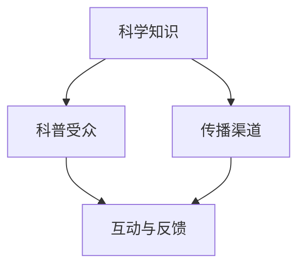

                 

### 第一部分：社交媒体时代的科学传播环境

#### 第1章：社交媒体时代的背景

**社交媒体的发展历程**

社交媒体的概念起源于互联网的早期发展，它以用户生成内容为核心，强调用户之间的互动与分享。早期的社交媒体形式主要包括论坛、聊天室和电子邮件列表。随着互联网技术的不断进步，尤其是宽带网络的普及和移动设备的普及，社交媒体进入了一个快速发展的阶段。Twitter、Facebook、Instagram、微信等平台相继诞生，并迅速改变了人们的生活方式。

**社交媒体的发展趋势**

当前，社交媒体的发展趋势呈现出以下几个特点：

1. **移动化**：随着智能手机和移动应用的普及，社交媒体逐渐从PC端转移到移动端，用户可以在任何时间和地点访问社交媒体平台。
2. **社交化**：社交媒体平台不仅是一个信息交流的工具，还成为用户社交网络的重要一部分。用户通过分享生活点滴、关注亲友、参与讨论等形式，加强了自己与他人的联系。
3. **多样化**：社交媒体平台的内容形式越来越多样化，包括文字、图片、视频、直播等多种形式，满足了用户不同的需求。
4. **智能化**：随着人工智能技术的发展，社交媒体平台逐渐引入了智能推荐、智能客服等功能，提升了用户体验。

**社交媒体对社会的影响**

社交媒体的兴起对社会产生了深远的影响：

1. **信息传播速度加快**：社交媒体平台使得信息传播速度大大提高，一个新闻事件可以在短时间内传遍全球。
2. **社会关系重构**：社交媒体改变了人们的社交方式，虚拟社交成为现实社交的重要补充。
3. **舆论环境变化**：社交媒体为公众提供了表达意见的平台，舆论环境变得更加复杂和多元化。
4. **经济模式改变**：社交媒体平台的广告收入成为企业重要的盈利渠道，同时也改变了传统媒体的经济模式。

在了解了社交媒体的发展历程和趋势后，我们可以看到，社交媒体已经成为了现代社会不可或缺的一部分。它不仅改变了人们的交流方式，也对科学传播产生了深远的影响。在接下来的章节中，我们将深入探讨社交媒体与科学传播之间的关系，以及如何利用社交媒体平台进行科学传播。

#### 第2章：社交媒体与科学传播的关系

**社交媒体在科学传播中的作用**

社交媒体在科学传播中扮演了重要的角色，它为科学信息的传播提供了全新的渠道和方式。以下是社交媒体在科学传播中的几个重要作用：

1. **扩大科学影响力**：社交媒体平台具有广泛的影响力和强大的传播能力，科学信息可以通过这些平台迅速传播到全球各地的用户。例如，科研机构、科学家和科普工作者可以通过微博、微信公众号等平台发布科学研究成果和科普文章，吸引大量关注和传播。

2. **提高科学普及率**：社交媒体的普及使得科学知识更加容易被公众获取。通过微博、微信、抖音等平台，科普工作者可以将深奥的科学原理和研究成果以通俗易懂的方式呈现给大众，提高公众的科学素养和科学意识。

3. **促进科学交流与互动**：社交媒体平台提供了互动交流的功能，用户可以在线评论、点赞、分享科学内容，甚至直接与科学家进行互动。这种双向互动有助于建立科学家与公众之间的沟通桥梁，提高科学传播的参与度和效果。

**社交媒体在科学传播中的挑战**

尽管社交媒体在科学传播中具有巨大潜力，但同时也面临着一些挑战：

1. **科学信息真实性与准确性**：在社交媒体上，虚假信息、误导性信息甚至谣言时有发生，这给科学传播带来了困扰。科学信息需要经过严格的审核和验证，以确保其真实性和准确性。

2. **科学内容的可读性**：科学内容的表达需要既准确又生动有趣，以吸引公众的关注。在社交媒体平台上，内容的表达方式需要更加贴近大众的语言习惯和兴趣点，这增加了内容创作的难度。

3. **社交媒体对科学家的要求**：科学家需要在保持专业性和学术严谨性的同时，适应社交媒体的传播特点。他们需要具备一定的媒介素养，能够有效地进行科学传播，同时还需要应对社交媒体带来的时间管理和资源分配的挑战。

**社交媒体对科学家的要求**

科学家的科学传播工作不仅需要专业知识，还需要适应社交媒体的特点和需求。以下是科学家在社交媒体上进行科学传播时需要考虑的几个方面：

1. **媒介素养**：科学家需要具备媒介素养，了解不同社交媒体平台的规则和传播特点，能够选择合适的平台和方式来传播科学信息。

2. **内容创作**：科学内容需要既专业又生动有趣，科学家需要具备内容创作的能力，能够将复杂的科学知识以通俗易懂的方式表达出来。

3. **时间管理**：科学家的科研工作繁忙，需要在有限的时间内进行科学传播。科学家需要合理安排时间，确保科学传播工作能够持续有效地进行。

4. **互动沟通**：科学家需要积极参与与公众的互动，解答公众的疑问，建立良好的公众形象，增强科学传播的效果。

通过了解社交媒体与科学传播的关系及其带来的挑战和科学家在社交媒体传播中的要求，我们可以更好地利用社交媒体平台进行科学传播，提高科学信息的传播效果，促进科学知识的普及和科学素养的提升。

#### 第二部分：科学传播策略

**科学传播的目标与原则**

科学传播的目标是普及科学知识，提高公众的科学素养，促进科学精神的培养。为了实现这一目标，科学传播需要遵循以下原则：

1. **准确性**：科学传播的信息必须真实、准确，避免误导公众。科学信息的来源需要经过严格的审核和验证，确保其科学性和可靠性。

2. **普及性**：科学传播的内容需要简洁易懂，适合不同文化背景和知识水平的公众。内容表达应避免使用过于专业的术语，尽量使用形象化、故事化的方式来传递科学知识。

3. **互动性**：科学传播不仅仅是单向的信息传递，更需要与公众进行双向互动。通过社交媒体等平台，公众可以参与到科学传播过程中，提出问题、分享观点，与科学家和科普工作者进行交流。

4. **持续性**：科学传播是一个长期的过程，需要持续不断地进行。科学知识不断更新，科学传播工作也需要不断地跟进，以确保公众能够及时获取最新的科学信息。

**科学传播的内容选择与设计**

科学传播的内容选择和设计直接影响传播效果。以下是一些关键点：

1. **内容类型**：科学传播的内容应涵盖多个方面，包括基础科学知识、前沿科研成果、科学方法论等。内容类型应多样化，以满足不同公众的需求。

2. **内容形式**：科学传播的形式应灵活多样，包括文字、图片、视频、动画、直播等。不同的内容形式能够满足不同公众的阅读和观看习惯，提高传播效果。

3. **故事化表达**：科学传播的内容可以采用故事化的方式表达，通过讲述科学家的故事、科学发现的历程等，增加内容的趣味性和吸引力。

4. **互动性设计**：在内容设计过程中，应充分考虑与公众的互动。例如，设置问答环节、评论区互动、在线讨论等，鼓励公众参与科学传播过程。

5. **视觉设计**：科学传播的内容需要视觉设计，包括图片、图表、动画等，以增强内容的可读性和吸引力。视觉设计应简洁明了，避免信息过载。

**核心概念与联系**

为了更好地进行科学传播，我们需要明确几个核心概念，并理解它们之间的联系。以下是科学传播中的几个核心概念及其相互关系：

1. **科学知识**：科学知识是科学传播的基础，包括科学事实、理论、方法等。科学知识需要准确、严谨，同时也需要生动、易懂。

2. **科普受众**：科普受众是科学传播的目标群体，包括公众、学生、专业人士等。不同的受众群体对科学传播的需求和接受程度不同，需要针对不同受众设计相应的传播内容。

3. **传播渠道**：传播渠道是科学信息传递的媒介，包括社交媒体、传统媒体、学术期刊等。不同的传播渠道具有不同的传播效果和受众群体，需要根据实际情况选择合适的传播渠道。

4. **互动与反馈**：互动与反馈是科学传播过程中不可或缺的一环。通过与公众的互动，可以了解公众对科学传播内容的反应和需求，及时调整传播策略，提高传播效果。

以下是科学传播核心概念与联系的Mermaid流程图：



**核心概念与联系的重要性**

核心概念与联系是科学传播策略的基础，它们帮助我们明确科学传播的目标、内容和方法。通过理解这些核心概念及其相互关系，我们可以更好地设计科学传播的内容，选择合适的传播渠道，提高传播效果，最终实现科学传播的目标。在接下来的章节中，我们将进一步探讨科学传播算法和数学模型，为科学传播策略提供更具体的工具和方法。

#### 第4章：科学传播算法原理讲解

**科学传播算法概述**

科学传播算法是利用计算机技术和数据分析方法，对科学传播过程进行优化和提升的一类算法。科学传播算法的核心目的是提高科学信息的传播效果，使其能够更广泛、更准确地到达目标受众。科学传播算法主要包括以下几个类型：

1. **信息推送算法**：信息推送算法是科学传播算法的一种基础类型，其目的是将科学信息推送给用户。这类算法通常基于用户的行为数据和兴趣偏好，通过分析用户的历史行为和交互数据，推荐用户可能感兴趣的科学信息。

2. **用户行为分析算法**：用户行为分析算法通过对用户的浏览、点赞、评论等行为数据进行分析，了解用户的兴趣和需求。这些数据可以帮助科学家和科普工作者更好地了解受众，从而设计更符合受众需求的科学传播内容。

3. **内容推荐算法**：内容推荐算法是科学传播算法中的重要组成部分，其目的是为用户提供个性化的科学信息推荐。这类算法通常使用协同过滤、基于内容的推荐、混合推荐等方法，通过分析用户和内容之间的相关性，推荐用户可能感兴趣的科学内容。

**常见的科学传播算法**

在科学传播中，以下几种算法得到了广泛应用：

1. **协同过滤算法**：协同过滤算法是一种基于用户行为数据的推荐算法，它通过分析用户的历史行为数据，找出相似用户，并推荐这些用户喜欢的科学信息。协同过滤算法分为基于用户的协同过滤和基于物品的协同过滤两种。

   - **基于用户的协同过滤**：这种方法通过寻找与当前用户兴趣相似的其他用户，并将这些用户喜欢的科学信息推荐给当前用户。其核心在于计算用户之间的相似度，常用的相似度计算方法包括余弦相似度、皮尔逊相关系数等。
   
   - **基于物品的协同过滤**：这种方法通过分析用户对不同物品的评分，找到与其他用户评分相似的科学信息，并将其推荐给当前用户。其核心在于计算物品之间的相似度，常用的相似度计算方法包括余弦相似度、Jaccard相似度等。

2. **基于内容的推荐算法**：基于内容的推荐算法通过分析科学信息的特征，将具有相似特征的科学信息推荐给用户。这种方法通常需要构建一个内容特征模型，将科学信息转化为向量表示，然后通过计算用户和内容特征向量之间的相似度来进行推荐。

3. **混合推荐算法**：混合推荐算法结合了协同过滤和基于内容的推荐算法的优点，通过融合不同算法的推荐结果，提高推荐的准确性和多样性。混合推荐算法可以分为模型融合和策略融合两种类型。

**算法原理讲解**

以下是基于用户的协同过滤算法的Python源代码示例，通过该示例我们可以更直观地理解算法的实现原理：

```python
import numpy as np

# 用户行为数据矩阵，行表示用户，列表示物品（科学信息）
user_item_matrix = np.array([[1, 0, 1, 0],
                             [0, 1, 0, 1],
                             [1, 1, 0, 1]])

# 计算用户之间的相似度矩阵
similarity_matrix = np.dot(user_item_matrix, user_item_matrix.T) / np.linalg.norm(user_item_matrix, axis=1)[:, np.newaxis] / np.linalg.norm(user_item_matrix, axis=0)[np.newaxis, :]

# 假设我们想要为用户2推荐物品3
user_to_recommend = 2
item_to_recommend = 3

# 计算用户2与其他用户的相似度之和
similarity_sum = np.sum(similarity_matrix[user_to_recommend])

# 计算用户2对其他用户的评分之和（这里用1表示用户已经评价过的物品）
rating_sum = np.sum(user_item_matrix[user_to_recommend])

# 计算相似用户对物品3的评分之和
neighbor_rating_sum = np.sum(user_item_matrix[:, item_to_recommend])

# 计算预测评分
predicted_rating = (neighbor_rating_sum + rating_sum) / similarity_sum

print(f"预测的用户2对物品3的评分：{predicted_rating}")
```

在上面的示例中，我们首先构建了一个用户行为数据矩阵，然后计算了用户之间的相似度矩阵。接着，我们通过计算相似用户对目标物品的评分之和，预测用户对该物品的评分。这只是一个简单的协同过滤算法实现，实际应用中还需要考虑噪声过滤、数据缺失等问题。

**算法应用解读**

科学传播算法的应用可以帮助科学家和科普工作者更有效地传播科学信息。例如，通过用户行为分析算法，可以了解用户的兴趣和需求，从而设计更符合受众需求的科学传播内容；通过内容推荐算法，可以自动为用户推荐他们可能感兴趣的科学信息，提高信息的传播效果。

然而，科学传播算法的应用也面临着一些挑战，例如如何处理噪声数据、如何确保推荐结果的多样性等。这些问题需要通过不断的研究和优化来解决，以提升科学传播算法的效果。

**算法优化的方法**

1. **数据预处理**：对用户行为数据和使用数据进行清洗和处理，去除噪声和缺失数据，提高数据的准确性和完整性。
2. **特征工程**：通过构建合适的特征模型，将用户和物品转化为向量表示，提高算法的性能。
3. **模型选择**：根据不同的应用场景和需求，选择合适的推荐算法，并进行参数调优。
4. **在线学习**：利用在线学习技术，实时更新用户和物品的特征模型，适应用户需求的变化。

通过以上方法，我们可以不断提升科学传播算法的效果，为科学传播提供更有效的工具和方法。

**小结**

科学传播算法是提高科学信息传播效果的重要工具。通过协同过滤、基于内容推荐等算法，我们可以为用户提供个性化的科学信息推荐，提高科学传播的效率和质量。然而，科学传播算法的应用也需要不断优化和改进，以应对复杂的科学传播环境。在接下来的章节中，我们将进一步探讨科学传播中的数学模型，为科学传播策略提供更深入的理论支持。

#### 第5章：科学传播数学模型讲解

**科学传播数学模型概述**

科学传播数学模型是用于描述科学信息传播过程及其影响因素的数学模型。这些模型通过数学公式和算法，对科学传播的现象进行定量分析和预测。科学传播数学模型主要包括以下几类：

1. **贝叶斯网络模型**：贝叶斯网络模型是一种概率图模型，用于表示变量之间的条件依赖关系。在科学传播中，贝叶斯网络模型可以用于分析科学信息传播路径和影响因素，预测科学信息的传播效果。

2. **社交网络模型**：社交网络模型用于描述社交网络中的节点（如用户）和边（如关注关系）的分布和动态。在科学传播中，社交网络模型可以用于分析科学信息的传播速度、传播范围等。

3. **传播效果评估模型**：传播效果评估模型用于评估科学传播活动的效果，包括信息传播的广度、深度、影响力等。这些模型可以帮助科学家和科普工作者了解科学传播活动的效果，指导进一步的传播策略。

**常见的科学传播数学模型**

以下是一些常见的科学传播数学模型及其应用：

1. **贝叶斯网络模型**

   贝叶斯网络模型通过条件概率表（CP表）来描述变量之间的依赖关系。在科学传播中，贝叶斯网络模型可以用于分析科学信息的传播路径和影响因素。例如，我们可以使用贝叶斯网络模型来分析科学信息在微博上的传播过程，确定哪些用户对科学信息的传播起到了关键作用。

   贝叶斯网络模型的表示形式如下：
   
   $$
   P(A, B, C) = P(A)P(B|A)P(C|A, B)
   $$
   
   其中，$A$、$B$和$C$表示三个随机变量，$P(A)$表示变量$A$的概率，$P(B|A)$表示在变量$A$发生的情况下变量$B$的概率，$P(C|A, B)$表示在变量$A$和$B$都发生的情况下变量$C$的概率。

2. **社交网络模型**

   社交网络模型用于描述社交网络中的节点和边的分布。常见的社交网络模型包括小世界模型和巴贝奇模型。在科学传播中，社交网络模型可以用于分析科学信息的传播速度和传播范围。

   社交网络模型的表示形式如下：
   
   $$
   P(k) \propto k^{\alpha}
   $$
   
   其中，$P(k)$表示节点度数为$k$的概率，$\alpha$是一个参数。对于小世界模型，$\alpha$通常接近2；对于巴贝奇模型，$\alpha$通常接近3。

3. **传播效果评估模型**

   传播效果评估模型用于评估科学传播活动的效果。常见的传播效果评估模型包括信息传播的广度模型、深度模型和影响力模型。

   - **广度模型**：广度模型用于评估科学信息传播的范围。一个简单的广度模型可以表示为：
     
     $$
     B(t) = \sum_{i=1}^{n} I_i(t)
     $$
     
     其中，$B(t)$表示在时间$t$时科学信息的传播广度，$I_i(t)$表示节点$i$在时间$t$时传播的科学信息量。

   - **深度模型**：深度模型用于评估科学信息传播的深度。一个简单的深度模型可以表示为：
     
     $$
     D(t) = \max_{i \in N} \sum_{j=1}^{n} d_{ij}
     $$
     
     其中，$D(t)$表示在时间$t$时科学信息的传播深度，$N$表示节点的集合，$d_{ij}$表示节点$i$到节点$j$的传播距离。

   - **影响力模型**：影响力模型用于评估科学信息传播的影响力。一个简单的影响力模型可以表示为：
     
     $$
     I(t) = \sum_{i=1}^{n} \sum_{j=1}^{m} w_{ij} I_i(t)
     $$
     
     其中，$I(t)$表示在时间$t$时科学信息的传播影响力，$w_{ij}$表示节点$i$对节点$j$的影响力权重，$I_i(t)$表示节点$i$在时间$t$时传播的科学信息量。

**模型应用示例**

假设我们使用贝叶斯网络模型来分析科学信息在微博上的传播过程，我们可以构建如下的贝叶斯网络模型：

```
          A
         / \
        /   \
       B     C
      / \   / \
     D   E F   G
```

在这个模型中，$A$、$B$、$C$、$D$、$E$、$F$和$G$分别表示七个节点，它们之间的依赖关系可以用条件概率表来描述。例如，假设我们已知$A$表示科学信息是否被用户点赞，$B$表示用户是否转发该信息，$C$表示用户是否评论该信息，则条件概率表可以表示为：

$$
P(A|B, C) = P(B|A, C) = P(C|A, B) = 0.5
$$

通过这个贝叶斯网络模型，我们可以分析不同因素对科学信息传播的影响，例如通过计算条件概率$P(A|B, C)$，我们可以了解用户转发和评论信息对科学信息点赞行为的影响。

**模型应用解读**

科学传播数学模型为科学传播提供了定量的分析工具，通过这些模型，我们可以更好地理解科学信息的传播过程和影响因素。例如，通过贝叶斯网络模型，我们可以分析科学信息在微博上的传播路径和影响因素，从而优化科学传播策略；通过社交网络模型，我们可以预测科学信息的传播速度和范围，为科学传播活动的策划提供依据；通过传播效果评估模型，我们可以评估科学传播活动的效果，为科学传播策略的调整提供数据支持。

然而，科学传播数学模型的应用也面临一些挑战，例如如何准确描述科学信息的传播过程、如何处理噪声数据等。这些问题需要通过不断的研究和实践来解决，以提高科学传播数学模型的应用效果。

**小结**

科学传播数学模型是分析科学信息传播过程的重要工具。通过贝叶斯网络模型、社交网络模型和传播效果评估模型，我们可以定量分析科学信息的传播路径、影响因素和传播效果。这些模型为科学传播策略的制定提供了有力的支持，有助于提高科学传播的效果和质量。在接下来的章节中，我们将探讨社交媒体平台在科学传播中的应用，进一步探索科学传播的实践策略。

### 第三部分：社交媒体平台的应用

#### 第6章：不同社交媒体平台的特点与应用

**社交媒体平台概述**

社交媒体平台是科学传播的重要渠道，不同平台具有各自的特点和优势。以下是对几种主要社交媒体平台的特点和应用的分析：

1. **微博**

   微博是中国最流行的社交媒体平台之一，以其信息传播速度快、互动性强而著称。微博的特点包括：

   - **信息传播速度快**：微博用户可以通过发布短文、图片、视频等形式的内容，快速传播科学信息。
   - **互动性强**：微博用户可以评论、点赞、转发内容，增强信息的传播效果和用户参与度。
   - **用户基数大**：微博拥有庞大的用户群体，可以覆盖广泛的受众。

   微博在科学传播中的应用包括：

   - **科研成果发布**：科学家和科研机构可以通过微博发布最新的科研成果，吸引公众关注。
   - **科普宣传**：科普工作者可以撰写科普文章，通过微博平台向公众普及科学知识。
   - **科学讨论**：用户可以就科学话题进行讨论，促进科学知识的传播和交流。

2. **微信公众号**

   微信公众号是中国最受欢迎的社交媒体平台之一，以其内容丰富、互动性强和用户黏性高而受到用户的喜爱。微信公众号的特点包括：

   - **内容丰富**：微信公众号支持图文、视频、音频等多种内容形式，可以提供多样化的科学传播内容。
   - **互动性强**：微信公众号支持留言、赞赏等功能，用户可以与作者互动，提高内容的传播效果。
   - **用户黏性高**：微信公众号具有高度的粉丝黏性，可以建立长期稳定的读者群体。

   微信公众号在科学传播中的应用包括：

   - **科普文章**：科普工作者可以通过微信公众号发布科普文章，传播科学知识。
   - **科学讲座**：科学家可以通过微信公众号进行科学讲座直播，与公众互动交流。
   - **科研动态**：科研机构和高校可以通过微信公众号发布科研动态，展示科研成果。

3. **Facebook**

   Facebook是全球最大的社交媒体平台之一，以其强大的社交网络和用户互动功能而闻名。Facebook的特点包括：

   - **社交网络强大**：Facebook用户可以通过点赞、评论、分享等功能，与朋友和公众互动，传播科学信息。
   - **内容多样化**：Facebook支持图片、视频、直播等多种内容形式，可以提供丰富的科学传播内容。
   - **用户基数大**：Facebook拥有全球数十亿的活跃用户，可以覆盖广泛的受众。

   Facebook在科学传播中的应用包括：

   - **科学新闻发布**：科学家和科研机构可以通过Facebook发布科学新闻，吸引公众关注。
   - **科普文章**：科普工作者可以通过Facebook发布科普文章，向全球用户传播科学知识。
   - **科学讨论**：用户可以就科学话题进行讨论，促进科学知识的交流。

4. **Twitter**

   Twitter是一个全球性的社交媒体平台，以其快速的信息传播和用户互动功能而著称。Twitter的特点包括：

   - **信息传播速度快**：Twitter用户可以通过发布推文，快速传播科学信息。
   - **互动性强**：Twitter用户可以回复、点赞、转发推文，增强信息的传播效果。
   - **用户基数大**：Twitter拥有数亿的活跃用户，可以覆盖广泛的受众。

   Twitter在科学传播中的应用包括：

   - **科研成果发布**：科学家和科研机构可以通过Twitter发布科研成果，吸引公众关注。
   - **科普宣传**：科普工作者可以通过Twitter发布科普推文，向公众普及科学知识。
   - **科学讨论**：用户可以就科学话题进行讨论，促进科学知识的传播和交流。

**不同社交媒体平台的特点与应用对比**

以下是不同社交媒体平台在科学传播中的特点和应用对比：

| 平台 | 特点 | 应用 |
| --- | --- | --- |
| 微博 | 信息传播速度快，互动性强，用户基数大 | 科研成果发布，科普宣传，科学讨论 |
| 微信公众号 | 内容丰富，互动性强，用户黏性高 | 科普文章，科学讲座，科研动态 |
| Facebook | 社交网络强大，内容多样化，用户基数大 | 科学新闻发布，科普文章，科学讨论 |
| Twitter | 信息传播速度快，互动性强，用户基数大 | 科研成果发布，科普宣传，科学讨论 |

通过以上分析，我们可以看到，不同的社交媒体平台在科学传播中具有各自的特点和应用。科学家和科普工作者可以根据自身需求和目标受众，选择合适的社交媒体平台进行科学传播，以提高科学信息的传播效果和影响力。

#### 第7章：社交媒体平台下的科学传播实践

**科学传播实践概述**

科学传播实践是指科学家、科研机构、科普工作者和媒体等利用社交媒体平台，通过各种形式的互动和内容创作，向公众普及科学知识、传播科学信息、促进科学讨论和交流的活动。科学传播实践的目标是提高公众的科学素养，增强科学社会的建设。

科学传播实践的方法包括以下几个方面：

1. **内容创作**：科学家和科普工作者可以创作多样化的科学内容，如科普文章、视频、动画、图片等，通过这些内容形式向公众传播科学知识。

2. **互动交流**：通过社交媒体平台的互动功能，如评论、点赞、转发等，与公众进行实时互动，回答公众的疑问，收集公众的意见和建议。

3. **活动策划**：组织科学讲座、研讨会、科学实验等活动，通过社交媒体平台进行宣传和推广，吸引公众参与，提高科学传播的影响力。

4. **数据监测**：利用社交媒体平台的数据分析功能，监测科学传播活动的效果，如内容阅读量、互动量、用户增长等，为科学传播策略的调整提供依据。

**科学传播实践案例分析**

以下是几个成功的科学传播实践案例，通过这些案例我们可以看到科学传播实践的具体方法和效果：

1. **案例一：微博上的科学科普**

   微博上的“科学松鼠会”是一个科普组织，其成员包括多位知名科学家和科普作家。该组织通过微博发布科普文章、科学实验视频和科学问答等内容，吸引了大量关注和粉丝。其成功经验包括：

   - **内容创作**：以通俗易懂的语言和生动有趣的图片、视频形式，创作高质量的科普内容。
   - **互动交流**：积极回复评论，与粉丝互动，解答科学疑问，提高公众参与度。
   - **活动策划**：组织线上科学讲座和线下科学沙龙活动，吸引公众参与，扩大影响力。

2. **案例二：微信公众号上的科普文章**

   “中科院物理所”微信公众号是一个科学传播平台，通过发布科普文章、科学视频和科研动态等内容，向公众传播科学知识。其成功经验包括：

   - **内容创作**：结合科研工作和科学热点，创作富有深度和广度的科普文章。
   - **互动交流**：通过留言和赞赏功能，与读者进行互动，收集读者反馈，不断优化内容。
   - **品牌建设**：通过长期坚持高质量的科普内容，建立了良好的品牌形象和口碑。

3. **案例三：Facebook上的科学传播**

   “NASA”在Facebook上设有官方账号，通过发布科学新闻、宇航员访谈、太空探索视频等内容，向全球用户传播科学知识。其成功经验包括：

   - **内容多样化**：结合文字、图片、视频等多种内容形式，提供丰富的科学传播内容。
   - **互动交流**：积极与粉丝互动，回答粉丝的提问，举办在线问答活动，增强用户参与感。
   - **全球传播**：通过翻译和本地化内容，吸引不同国家和地区的用户，实现全球科学传播。

**科学传播实践中的挑战**

尽管科学传播实践取得了显著成果，但在实际操作中也面临一些挑战：

1. **内容真实性**：在社交媒体上，虚假信息和误导性信息时有发生，这对科学传播的准确性提出了挑战。

2. **内容吸引力**：科学内容的创作需要既准确又生动有趣，以吸引公众的关注。这要求科普工作者具备良好的内容创作能力。

3. **用户参与度**：如何提高用户的参与度和互动性，是科学传播实践中的一个重要问题。

4. **时间管理**：科学工作者需要平衡科研工作和科学传播任务，合理安排时间和资源。

**成功经验总结**

通过分析成功的科学传播实践案例，我们可以总结出以下经验：

1. **内容质量是关键**：高质量的内容是科学传播成功的基础，科普工作者需要注重内容的科学性和可读性。

2. **互动性是关键**：与用户的互动可以增强内容的传播效果，科普工作者需要积极参与互动，回答用户的问题。

3. **品牌建设是关键**：建立良好的品牌形象和口碑，可以提高科学传播的公信力和影响力。

4. **持续创新是关键**：科学传播实践需要不断创新，采用新的传播形式和互动方式，以适应不断变化的社交媒体环境。

**小结**

社交媒体平台下的科学传播实践为科学知识的普及和科学素养的提升提供了新的渠道和方式。通过内容创作、互动交流、活动策划和数据监测等实践方法，科学家和科普工作者可以更有效地传播科学知识，提高公众的科学素养。在科学传播实践中，成功经验包括内容质量、互动性、品牌建设和持续创新等方面。面对挑战，科普工作者需要不断提高自己的媒介素养和内容创作能力，持续创新，以实现科学传播的目标。

### 第四部分：科学传播的评估与优化

#### 第8章：科学传播效果的评估方法

**科学传播效果评估的重要性**

科学传播效果的评估是科学传播工作的重要环节，它不仅可以帮助我们了解科学传播活动的实际效果，还能为科学传播策略的优化提供依据。有效的评估方法可以确保科学传播资源的合理配置，提高科学传播的效率和影响力。

**评估方法的分类**

科学传播效果的评估方法可以分为以下几类：

1. **量化评估方法**：通过量化指标来衡量科学传播的效果，如阅读量、点赞量、转发量、评论量等。这种方法可以直接反映出科学信息在社交媒体平台上的传播效果。

2. **定性评估方法**：通过用户反馈、专家评价等方式，对科学传播效果进行定性分析。这种方法可以深入了解用户对科学传播内容的感受和反应，从而为科学传播策略提供更加细致的指导。

3. **综合评估方法**：结合量化评估方法和定性评估方法，对科学传播效果进行全面分析。这种方法能够综合考虑不同方面的数据，得出更全面的评估结果。

**常用的量化评估指标**

以下是科学传播效果评估中常用的量化评估指标：

1. **阅读量**：科学传播内容的阅读量是衡量其影响力的基础指标。阅读量越高，表明科学信息越受欢迎。

2. **点赞量**：点赞量反映了用户对科学传播内容的认可程度。点赞量越高，表明科学传播内容越受欢迎。

3. **转发量**：转发量反映了科学传播内容的传播范围。转发量越高，表明科学传播效果越好。

4. **评论量**：评论量反映了用户对科学传播内容的兴趣和参与度。评论量越高，表明用户对科学传播内容的关注度越高。

5. **互动率**：互动率是指用户与科学传播内容互动的频率。高互动率表明用户对科学传播内容有较高的参与度。

**数据收集与处理方法**

1. **数据收集**：科学传播效果的评估需要收集大量的数据，如阅读量、点赞量、转发量、评论量等。数据可以从社交媒体平台、数据分析工具等渠道获取。

2. **数据处理**：收集到的数据需要进行处理，如去重、清洗、转换等，以确保数据的准确性和完整性。

3. **数据分析**：通过对处理后的数据进行统计分析，如计算均值、中位数、标准差等，可以得出科学传播效果的量化指标。

**评估案例**

以下是一个科学传播效果评估的案例：

假设我们想要评估某科普文章在微信公众号上的传播效果，我们可以收集以下数据：

- 阅读量：1000次
- 点赞量：200次
- 转发量：50次
- 评论量：30条

通过计算以下指标，我们可以评估这篇文章的传播效果：

1. **阅读率**：阅读率 = 阅读量 / 关注人数，例如，如果公众号有10000关注者，则阅读率 = 1000 / 10000 = 10%

2. **点赞率**：点赞率 = 点赞量 / 阅读量，例如，点赞率 = 200 / 1000 = 20%

3. **转发率**：转发率 = 转发量 / 阅读量，例如，转发率 = 50 / 1000 = 5%

4. **评论率**：评论率 = 评论量 / 阅读量，例如，评论率 = 30 / 1000 = 3%

5. **互动率**：互动率 = (点赞量 + 转发量 + 评论量) / 阅读量，例如，互动率 = (200 + 50 + 30) / 1000 = 8%

通过以上指标，我们可以分析这篇文章的传播效果，例如，评论率较高，说明用户对这篇文章有较高的兴趣和参与度。

**小结**

科学传播效果的评估是科学传播工作的重要环节，通过量化评估和定性评估方法，我们可以全面了解科学传播活动的效果，为科学传播策略的优化提供依据。在科学传播实践中，应注重数据的收集和处理，结合多种评估方法，得出科学的评估结果，以不断提高科学传播的效果和质量。

#### 第9章：科学传播策略的优化

**科学传播策略优化的重要性**

科学传播策略的优化是提高科学传播效果和效率的关键。优化科学传播策略不仅能够提高科学信息的传播范围和影响力，还能提升公众对科学知识的理解和接受度。因此，科学传播策略的优化是科学传播工作中不可或缺的一环。

**优化策略的方法**

以下是几种常见的科学传播策略优化方法：

1. **数据驱动的策略优化**：利用数据分析工具，对科学传播活动的效果进行量化评估，根据评估结果调整传播策略。例如，通过分析阅读量、点赞量、转发量等指标，找出传播效果较好的内容类型和传播方式，进一步优化传播策略。

2. **用户画像分析**：通过用户画像分析，了解目标受众的兴趣偏好、行为习惯等，为内容创作和传播渠道选择提供依据。例如，如果分析结果显示目标受众对视频内容更感兴趣，那么可以增加视频内容的创作和推广。

3. **多渠道整合**：利用多种社交媒体平台和渠道进行科学传播，实现信息的广泛覆盖和深度传播。例如，可以在微博、微信公众号、Facebook、Twitter等多个平台发布相同或类似的内容，提高信息的传播效果。

4. **互动式传播**：通过增加与用户的互动，提高用户的参与度和忠诚度。例如，可以举办线上问答活动、科学实验直播等，鼓励用户参与科学传播过程。

**优化策略的步骤**

以下是科学传播策略优化的具体步骤：

1. **目标设定**：明确科学传播的目标，如提高公众的科学素养、推广科研成果、促进科学讨论等。

2. **数据收集**：收集科学传播活动的相关数据，如阅读量、点赞量、转发量、评论量等。

3. **数据分析**：对收集到的数据进行分析，找出传播效果较好的内容和传播方式。

4. **策略调整**：根据数据分析结果，调整科学传播策略，例如，增加视频内容的创作、优化内容表达方式、选择更合适的传播渠道等。

5. **实施与监测**：实施调整后的科学传播策略，并持续监测效果，根据实际情况进行进一步优化。

**案例分析**

以下是一个科学传播策略优化的案例：

某科普组织在微信公众号上发布科学文章，但阅读量一直较低。通过数据分析，发现以下几个问题：

1. **内容形式单一**：文章形式主要为文字，缺乏图片、视频等多样化元素。

2. **发布时间不当**：文章通常在晚上发布，与目标受众的活跃时间不匹配。

3. **用户反馈不足**：文章缺乏互动环节，用户无法参与讨论。

针对这些问题，该科普组织进行了以下策略优化：

1. **内容多样化**：增加图片、视频等元素，使文章更具吸引力。

2. **调整发布时间**：将文章发布时间调整到用户活跃的时间段，如下午或晚上。

3. **互动式传播**：在文章末尾增加问答环节，鼓励用户提问和评论，提高用户参与度。

经过一段时间的策略优化，该科普组织的文章阅读量显著提高，用户互动也变得更加活跃。

**小结**

科学传播策略的优化是提高科学传播效果和效率的重要手段。通过数据驱动的策略优化、用户画像分析、多渠道整合和互动式传播等方法，我们可以不断调整和优化科学传播策略，提高科学信息的传播效果和影响力。在实际操作中，应结合具体情况进行策略优化，并根据实际情况进行监测和调整，以实现科学传播的目标。

#### 第10章：社交媒体时代的科学传播挑战与机遇

**社交媒体时代的科学传播挑战**

随着社交媒体的快速发展，科学传播面临着一系列新的挑战：

1. **信息真实性**：在社交媒体上，虚假信息和误导性信息时常出现，这给科学传播带来了困扰。科学家和科普工作者需要花费更多的时间和精力来核实信息的真实性，以确保科学信息的准确性。

2. **内容创作难度**：科学内容需要既专业又生动有趣，以吸引公众的关注。科普工作者在创作内容时，需要在科学性和可读性之间找到平衡，这增加了内容创作的难度。

3. **受众群体多样性**：社交媒体用户群体庞大且多样化，不同受众对科学传播的需求和接受程度不同。科学家和科普工作者需要设计多样化的传播策略，以满足不同受众的需求。

4. **时间管理**：科学工作者需要在忙碌的科研工作中抽出时间进行科学传播，这要求他们具备良好的时间管理能力。

**社交媒体时代的科学传播机遇**

尽管面临着挑战，社交媒体时代也为科学传播带来了许多机遇：

1. **传播速度快**：社交媒体平台具有快速传播的特点，科学信息可以通过这些平台迅速传播到全球各地，提高了科学信息传播的效率。

2. **互动性强**：社交媒体平台提供了互动功能，科学家和科普工作者可以与公众进行实时互动，回答公众的疑问，增强科学传播的互动性和参与度。

3. **内容形式多样化**：社交媒体平台支持多种内容形式，包括文字、图片、视频、直播等，这为科学传播提供了更多元的表达方式，有助于吸引不同类型的受众。

4. **数据支持**：社交媒体平台提供了丰富的数据分析工具，科学家和科普工作者可以通过这些工具了解科学传播的效果，为科学传播策略的优化提供数据支持。

**如何应对挑战与抓住机遇**

为了应对社交媒体时代的科学传播挑战并抓住机遇，科学家和科普工作者可以采取以下措施：

1. **加强科学素养**：提高自身科学素养，增强对社交媒体信息的辨别能力，确保传播的科学信息真实、准确。

2. **提升内容创作能力**：通过学习和实践，提升内容创作能力，设计既专业又生动的科学传播内容。

3. **多样化传播策略**：根据不同受众的特点和需求，设计多样化的传播策略，如利用视频、动画、互动游戏等形式，提高科学传播的吸引力。

4. **合理利用数据分析**：利用社交媒体平台提供的数据分析工具，了解科学传播的效果，不断优化传播策略。

5. **积极参与互动**：积极参与与公众的互动，回答公众的疑问，建立良好的公众形象，增强科学传播的效果。

**小结**

社交媒体时代为科学传播带来了新的挑战和机遇。科学家和科普工作者需要积极应对挑战，利用社交媒体的机遇，不断提升科学传播的效果和质量，提高公众的科学素养。通过加强科学素养、提升内容创作能力、多样化传播策略和合理利用数据分析等措施，我们可以更好地应对社交媒体时代的科学传播挑战，抓住机遇，推动科学知识的普及和科学素养的提升。

### 第11章：科学传播的未来趋势

**技术进步对科学传播的影响**

随着技术的不断进步，科学传播的方式和效果也在发生深刻变革。人工智能、大数据、虚拟现实（VR）和增强现实（AR）等技术的应用，为科学传播带来了新的机遇和挑战。

1. **人工智能**：人工智能技术在科学传播中的应用主要体现在内容生成和推荐系统上。通过自然语言处理（NLP）和机器学习算法，AI可以自动化生成科普文章、视频和音频内容，提高内容创作的效率和多样性。同时，智能推荐系统可以根据用户行为和兴趣偏好，为用户提供个性化的科学信息推荐，提高信息传播的精准性和有效性。

2. **大数据**：大数据技术在科学传播中的应用主要体现在数据分析和用户画像上。通过收集和分析大量用户行为数据，科学家和科普工作者可以深入了解受众需求，优化内容创作和传播策略。大数据分析还可以帮助识别科学传播中的热点话题和趋势，为科学传播提供实时指导和反馈。

3. **虚拟现实和增强现实**：虚拟现实（VR）和增强现实（AR）技术为科学传播提供了全新的沉浸式体验。通过VR和AR技术，观众可以进入虚拟的科学实验室，亲身体验科学实验过程，增强科学学习的趣味性和互动性。这些技术还可以用于虚拟科学展览和科普教育，打破时间和空间的限制，让科学知识触手可及。

**社交媒体与科学传播的深度融合**

社交媒体与科学传播的深度融合是未来科学传播的重要趋势。社交媒体平台的多样化和用户基数的不断扩大，为科学传播提供了更广阔的舞台。

1. **跨平台传播**：科学家和科普工作者将科学信息发布到多个社交媒体平台，通过跨平台传播，实现科学信息的多渠道覆盖和广泛传播。

2. **互动式科普**：社交媒体平台提供了丰富的互动功能，科学家和科普工作者可以通过直播、问答、投票等方式，与公众进行实时互动，增强科学传播的参与感和互动性。

3. **社交影响力**：社交媒体上的知名科学博主和科普大V，具有广泛的影响力和号召力。通过与这些意见领袖的合作，科学家和科普工作者可以更高效地传播科学知识，扩大科学传播的影响力。

**科学传播内容的多样化与个性化**

科学传播内容的多样化和个性化是未来科学传播的重要方向。随着用户需求的不断变化，科学传播内容需要更加丰富多样，以满足不同受众的需求。

1. **多样化内容形式**：科学传播内容不仅包括传统的文字、图片、视频，还将融合音频、动画、游戏等多种形式，提供多样化的学习体验。

2. **个性化推荐**：通过大数据分析和人工智能技术，为用户提供个性化的科学信息推荐，让用户可以更便捷地获取感兴趣的科学内容。

3. **定制化科普**：根据用户的特点和需求，提供定制化的科普服务，如为特定领域的科研人员提供专业科普内容，为普通公众提供基础科普知识。

**科学传播的全球化和国际化**

随着全球化的加速，科学传播的全球化和国际化也成为一个重要趋势。科学传播内容的国际化，不仅有助于促进科学知识的全球共享，还能提升各国公众的科学素养。

1. **多语言支持**：科学传播内容将提供多语言版本，打破语言障碍，让全球用户都能获取科学知识。

2. **国际合作**：科学家和科普工作者将与国际同行合作，共同开展科学传播项目，促进科学知识的跨国传播和交流。

3. **全球性话题**：关注全球性科学话题，如气候变化、生物多样性等，通过社交媒体平台传播，提高全球公众的科学意识和参与度。

**小结**

科学传播的未来趋势将受到技术进步、社交媒体发展和用户需求变化的共同影响。通过人工智能、大数据、VR/AR等技术的应用，科学传播将变得更加高效、互动和个性化。同时，社交媒体的深度融合和全球化的推进，将使科学传播的影响力进一步扩大。科学家和科普工作者需要不断创新和适应，利用新技术和新媒体平台，提高科学传播的效果和质量，为全球公众提供高质量的科普服务。通过持续的努力和探索，科学传播将在未来实现更加广泛和深入的普及。

## 关键词

社交媒体、科学传播、算法、大数据、人工智能、虚拟现实、增强现实、内容创作、互动交流、评估优化、用户画像、个性化推荐、国际化传播。

## 摘要

本文深入探讨了社交媒体时代的科学传播策略，分析了社交媒体对科学传播的背景、作用和挑战，提出了科学传播的核心概念与联系、算法原理讲解、数学模型讲解以及社交媒体平台下的科学传播实践。文章还详细讨论了科学传播效果的评估方法和策略优化，展望了科学传播的未来趋势。通过技术进步和社交媒体与科学传播的深度融合，科学传播将变得更加高效、互动和个性化，为公众提供高质量的科普服务。

## 作者信息

作者：AI天才研究院/AI Genius Institute & 禅与计算机程序设计艺术 /Zen And The Art of Computer Programming

### 总结与最佳实践 tips

通过本文的探讨，我们了解到社交媒体在科学传播中具有巨大的潜力，但也面临诸多挑战。为了提高科学传播的效果，科学家和科普工作者需要：

1. **确保内容真实性**：在社交媒体上发布科学信息时，务必确保信息的真实性和准确性。

2. **提高内容创作能力**：创作多样化、生动有趣的内容，以满足不同受众的需求。

3. **利用数据分析**：通过数据分析了解用户行为和需求，优化传播策略。

4. **增强互动性**：积极与用户互动，回答疑问，提高参与度。

5. **多平台传播**：利用多个社交媒体平台，实现信息的多渠道覆盖。

6. **关注全球性话题**：关注全球性科学话题，提高国际科普影响力。

最后，建议读者深入研究和实践本文提出的方法和策略，不断优化科学传播工作，为公众提供更高质量的科普服务。拓展阅读方面，可以参考相关书籍、学术论文和社交媒体平台上的科普账号，以获取更多关于科学传播的见解和经验。

