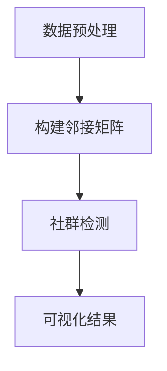

                 

### 社交媒体的定义与发展

社交媒体（Social Media）是指基于互联网技术，用户可以通过文字、图片、视频等多种形式进行信息交流、互动和分享的平台。它的核心特点是去中心化和用户生成内容，使每个人都可以成为信息的传播者和接收者。社交媒体的发展可以追溯到20世纪90年代末和21世纪初，随着互联网的普及和宽带技术的进步，各种社交媒体平台如雨后春笋般涌现。

最早期的社交媒体形式主要是基于电子邮件和论坛，例如Usenet和AOL论坛。然而，这些平台的信息传播是相对封闭和中心化的，用户之间的互动较为受限。随着Web 2.0时代的到来，以博客（如Blogger和WordPress）和社交网络（如Facebook和Twitter）为代表的社交媒体开始崭露头角，它们通过用户生成内容（UGC）和社交链接（Social Linking）实现了信息的广泛传播和用户之间的深度互动。

在定义上，社交媒体通常具有以下特点：

1. **用户生成内容**：用户不仅是信息的消费者，也是信息的生产者，可以通过发布、评论、分享等方式参与内容的创作。
2. **互动与社交**：用户之间的互动是社交媒体的核心，通过点赞、评论、私信等功能，用户可以与其他人建立联系。
3. **去中心化**：与传统的中心化媒体不同，社交媒体的信息传播和内容生成是分布式的，没有固定的中心。
4. **实时性**：社交媒体强调信息的实时更新和传播，用户可以第一时间获取最新的信息。
5. **多样化**：社交媒体支持多种内容形式，如文字、图片、视频、音频等，满足用户的多样化需求。

社交媒体的兴起不仅改变了人们的交流方式，也对传统媒体产生了深远的影响。它使得信息传播更加快速和广泛，也促进了社会互动和社群的形成。然而，社交媒体也带来了隐私泄露、信息过载、网络暴力等问题，这需要用户、平台和社会各界共同努力来解决。

在接下来的章节中，我们将进一步探讨图论的基本概念及其在社交媒体中的应用，通过数学模型和分析方法，深入理解社交媒体中信息网络的数学结构。

### 图论的基本概念

图论（Graph Theory）是数学的一个分支，主要研究图的结构、性质及其应用。图是由顶点（Vertex）和边（Edge）组成的数学结构，用于描述实体之间的连接关系。在图论中，顶点和边可以是具体的对象，也可以是抽象的概念，而图本身则是一种表示和建模的工具。

#### 图的定义与分类

一个图（Graph）通常由顶点集合 \( V \) 和边集合 \( E \) 组成，形式化地表示为 \( G = (V, E) \)。其中，顶点集合 \( V \) 包含图中的所有顶点，边集合 \( E \) 包含图中的所有边。每一条边连接两个顶点，表示它们之间的某种关系。

根据边的关系，图可以分为以下几种类型：

1. **无向图（Undirected Graph）**：边没有方向，即顶点之间的连接是双向的。用符号 \( E \subseteq V \times V \) 表示。
2. **有向图（Directed Graph）**：边具有方向，即从顶点 \( u \) 到顶点 \( v \) 的边表示为 \( (u, v) \)，用符号 \( E \subseteq V \times V \) 表示。
3. **混合图（Mixed Graph）**：同时包含无向边和有向边的图。
4. **简单图（Simple Graph）**：不包含自身环（即顶点连到自身的边）和多重边（即两个顶点之间有多条边）的图。

#### 图的基本性质与术语

在图论中，还有一些基本的术语和性质：

1. **路径（Path）**：顶点序列 \( v_1, v_2, \ldots, v_n \)，其中任意两个连续顶点之间都有一条边相连。路径的长度是其包含边的数量。
2. **回路（Cycle）**：路径的起点和终点是同一个顶点，且路径长度至少为3。
3. **连通性（Connectivity）**：图中的任意两个顶点之间都存在路径，称为连通图。
4. **连通分量（Connected Component）**：无向图中极大连通子图，即内部任意两个顶点之间都连通，而与子图外的顶点不连通。
5. **割点（Cut Vertex）**：删除某个顶点后，图变得不连通的顶点。
6. **桥（Bridge）**：删除后使图不连通的边。

#### 图的分类与表示

根据不同的标准，图可以有不同的分类方法：

1. **根据边的数量**：
   - **稀疏图**：边数远小于顶点数的图。
   - **稠密图**：边数接近顶点数平方的图。

2. **根据图的性质**：
   - **欧拉图**：包含欧拉回路的连通图。
   - **哈密顿图**：包含哈密顿回路的图。

3. **根据边的权值**：
   - **加权图**：每条边赋予一个权重。
   - **无权图**：所有边的权重相等或未定义。

图可以通过邻接矩阵、邻接表、边列表等多种方式表示。其中，邻接矩阵是一个二维数组，用于表示图中顶点之间的连接关系；邻接表则是以链表形式存储每个顶点的邻接点。

在社交媒体的背景下，图论可以用来表示用户之间的社交关系。例如，一个社交媒体平台上的用户可以被视为图的顶点，用户之间的互动（如点赞、评论、私信等）可以被视为图的边。通过图论的方法，我们可以分析社交网络的结构特性，如社群检测、中心性度量、路径分析等，从而更好地理解和利用社交媒体中的信息网络。

接下来，我们将进一步探讨图论的基本理论和算法，并介绍这些理论在社交媒体中的应用。

### 图论的基本理论

图论的基本理论是理解复杂社交网络结构的关键，它涵盖了图的各种基本性质、路径和连通性分析，以及图的矩阵表示。这些理论不仅为社交媒体中的信息网络分析提供了强大的工具，还为我们提供了丰富的算法和模型。

#### 图的结构

图的结构是图论研究的核心，主要包括顶点、边、连通性和路径等基本概念。

1. **顶点与边**：顶点是图中的基本元素，表示个体或实体。边则连接两个顶点，表示它们之间的某种关系。在无向图中，边是双向的，而在有向图中，边具有方向，表示从一顶点指向另一顶点。

2. **连通性**：连通性是指图中任意两个顶点之间存在路径。一个连通图是一个无向图，其中任意两个顶点都连通。在有向图中，可以通过引入弧度和路径的概念来定义连通性。

3. **路径**：路径是顶点的序列，其中任意两个连续顶点之间都有一条边相连。最长路径问题、最短路径问题等都是图论中的重要问题。

4. **连通分量**：连通分量是指一个图中的最大连通子图，即图中所有顶点都相互连通，而与连通分量外的顶点不连通。

5. **割点与桥**：割点是删除后使得图不连通的顶点。桥是删除后使得图不连通的边。割点和桥在图的结构分析中具有重要意义，它们反映了图的脆弱性和关键路径。

#### 路径与连通性分析

路径与连通性分析是图论中的基础问题，主要包括以下几个方面：

1. **最短路径**：给定图中两个顶点，找到连接这两个顶点的最短路径。常见的算法包括Dijkstra算法和Floyd算法。

2. **最长路径**：在加权图中，找到连接两个顶点的最长路径。这个问题可以通过动态规划或深度优先搜索（DFS）来解决。

3. **连通性检查**：判断图中是否存在连通路径。这可以通过广度优先搜索（BFS）或DFS来实现。

4. **割点与桥的识别**：通过DFS或其他的算法，识别图中的割点和桥。这有助于分析图的脆弱性和关键结构。

#### 图的矩阵表示

图可以用矩阵表示，主要包括邻接矩阵和关联矩阵。

1. **邻接矩阵**：邻接矩阵是一个 \( n \times n \) 的二维数组，其中 \( n \) 是顶点的数量。如果顶点 \( i \) 和顶点 \( j \) 之间存在边，则 \( A[i][j] = 1 \)，否则 \( A[i][j] = 0 \)。对于有向图，如果边从顶点 \( i \) 指向顶点 \( j \)，则 \( A[i][j] = 1 \)。

2. **关联矩阵**：关联矩阵与邻接矩阵类似，但它适用于多重图。如果顶点 \( i \) 与顶点集合 \( S \) 中的多个顶点相连，则 \( A[i][S] = |S| \)。

3. **权值矩阵**：对于加权图，邻接矩阵可以扩展为权值矩阵，其中每个元素表示对应边的权重。

通过矩阵表示，我们可以方便地进行图的遍历、路径搜索、连通性判断等操作，这些在图算法实现中具有重要意义。

#### 图的算法基础

图论中的许多算法都是基于其基本理论的。以下是几个重要的算法及其基本思想：

1. **深度优先搜索（DFS）**：DFS是一种用于遍历图的算法，它通过递归或栈结构访问图中的所有顶点。DFS在社交网络分析中用于路径搜索、连通性检查和拓扑排序。

2. **广度优先搜索（BFS）**：BFS与DFS类似，也是用于遍历图的算法。它与DFS的不同之处在于，它首先访问所有与起始顶点直接相连的顶点，然后再依次访问下一层的顶点。BFS在社交网络分析中用于路径搜索、广度优先遍历和最短路径问题。

3. **Dijkstra算法**：Dijkstra算法用于求解单源最短路径问题。它基于贪心策略，逐步扩展最短路径，直到找到从源点到所有其他顶点的最短路径。

4. **Floyd算法**：Floyd算法用于求解所有顶点对之间的最短路径。它利用动态规划的思想，逐步扩展路径，更新最短路径长度。

这些算法在社交媒体的图论分析中具有重要应用，如社交网络分析、信息传播路径预测和社群检测等。

#### 社交媒体中的图论应用

在社交媒体中，图论的应用非常广泛，主要包括以下几个方面：

1. **社交网络分析**：通过图论方法，我们可以分析社交网络的结构特性，如社群检测、中心性度量、路径分析等。例如，通过DFS或BFS，我们可以识别社交网络中的紧密社群和影响力大的用户。

2. **信息传播**：图论可以用于分析信息在社交网络中的传播路径和速度。通过最短路径算法，我们可以预测信息从源头到目标用户的最短传播路径。

3. **社群检测**：图论中的社群检测算法，如基于模块度的算法，可以用于识别社交网络中的紧密社群。这些社群在社交网络分析、市场营销等领域具有重要应用。

4. **中心性度量**：通过计算图中的中心性指标，如度中心性、介数中心性和接近中心性，我们可以评估社交网络中用户的重要性。这些指标在推荐系统、广告投放和危机管理等领域具有重要作用。

通过图论的方法，我们可以深入理解社交媒体中信息网络的数学结构，从而更好地分析和利用这些数据，为社交媒体平台提供智能化的服务和优化策略。

#### 社交媒体中的图论应用

图论在社交媒体中的应用具有深远的意义，它不仅帮助我们理解社交网络的内在结构，还为各种应用提供了理论支撑。以下是图论在社交媒体中的一些典型应用：

1. **社交网络分析**：社交网络分析是图论在社交媒体中最直接的应用之一。通过图论方法，我们可以分析社交网络的拓扑结构，识别关键节点和社群。例如，使用图论中的度中心性、介数中心性和接近中心性等指标，可以评估社交网络中用户的重要性。一个度中心性高的用户表示其连接了大量的其他用户，可能是社群中的核心成员；而介数中心性高的用户则可能在信息传播中扮演重要的桥梁角色。通过这些指标的度量，我们可以更好地理解社交网络中的影响力分布和关键节点。

2. **信息传播**：在社交媒体中，信息传播是一个动态过程，图论为我们提供了分析信息传播路径和速度的工具。例如，通过深度优先搜索（DFS）或广度优先搜索（BFS）算法，我们可以找出从信息源头到各个用户的最短传播路径。此外，还可以利用图论中的连通性分析，研究信息在网络中的传播速度和范围。通过模拟信息传播过程，我们可以预测信息的最终覆盖范围，评估用户的影响力，以及制定有效的信息传播策略。

3. **社群检测**：社群检测是社交媒体分析中一个重要的任务，旨在识别网络中的紧密社群。图论中的社群检测算法，如基于模块度的算法，可以有效地识别社交网络中的社群结构。这些社群通常具有高度的内聚性和紧密的联系，是社交网络中的基本单位。通过社群检测，我们可以发现用户之间的共同兴趣和关系，进而提供更有针对性的服务和内容推荐。例如，在社交平台上，可以根据用户所在的社群来推送相关话题的帖子，增强用户互动和参与度。

4. **社交影响力分析**：社交影响力分析是图论在社交媒体中应用的另一个重要领域。通过计算用户在社交网络中的影响力指标，如Katz中心性、PageRank等，我们可以评估用户的社交影响力。这些指标可以用于推荐系统、广告投放和危机管理等领域。例如，在广告投放中，可以优先选择具有较高社交影响力的用户作为推广对象，以提高广告的传播效果；在危机管理中，可以识别并关注那些可能对网络舆情产生重大影响的关键用户，及时采取应对措施。

5. **社交网络可视化**：图论还为社交网络的可视化提供了理论基础。通过将社交网络表示为图，我们可以直观地看到用户之间的连接关系和网络结构。这种可视化不仅有助于我们理解社交网络的复杂性，还可以帮助用户更好地了解自己的社交网络。例如，在社交平台的用户个人页面中，可以通过可视化工具展示用户的社交关系和网络结构，使用户能够快速找到和自己有紧密联系的朋友或潜在联系的人。

6. **社交网络优化**：图论在社交网络优化中也发挥着重要作用。通过分析社交网络的拓扑结构，我们可以识别网络中的瓶颈和脆弱点，从而进行优化。例如，在社交平台的设计中，可以通过优化网络结构来提高信息传播速度和系统的稳定性。此外，图论还可以用于社交网络的动态演化分析，预测网络未来的发展态势，为平台的长期规划提供依据。

综上所述，图论在社交媒体中的应用是多方面的，它不仅帮助我们深入理解社交网络的内在结构，还为各种应用场景提供了强大的工具和支持。通过图论的分析方法，我们可以更好地理解和利用社交媒体中的信息网络，为用户提供更加智能化的服务和体验。

#### 数学结构在信息网络中的角色

数学结构在信息网络中扮演着至关重要的角色，它们不仅为我们提供了表示和建模的工具，还使我们能够深入分析网络的行为和特性。以下是一些关键的数学结构及其在信息网络分析中的应用。

1. **矩阵表示**：矩阵是信息网络中表示图结构的重要工具。邻接矩阵和权值矩阵是最常用的表示方法。邻接矩阵 \( A \) 中的元素 \( A[i][j] \) 表示顶点 \( i \) 和顶点 \( j \) 之间是否存在边（对于无向图）或边的方向（对于有向图）。权值矩阵则进一步包含了边的权重信息，使得我们能够对网络的性质进行更详细的量化分析。例如，通过矩阵乘法，我们可以计算图中的路径长度和连通性。

2. **图论算法**：图论算法是分析信息网络的关键工具，包括最短路径算法、连通性算法、社群检测算法等。最短路径算法，如Dijkstra算法和Floyd算法，可以帮助我们找到网络中的最短路径，这对于信息传播路径的预测和优化具有重要意义。连通性算法，如DFS和BFS，可以用来检测网络的连通性，识别网络中的关键路径和脆弱点。社群检测算法，如基于模块度的算法，可以帮助我们识别网络中的紧密社群，理解用户的社交行为和关系。

3. **生成函数**：生成函数在信息网络分析中用于描述网络的生成过程和结构特性。例如，随机图生成函数可以用于模拟不同类型的网络结构，如小世界网络和无标度网络。这些生成函数不仅帮助我们理解网络的形成机制，还可以用于预测网络的未来行为。

4. **拓扑结构**：拓扑结构是信息网络的基本特征之一。网络的拓扑结构决定了网络的行为和性能。例如，小世界网络的短路径特性使得信息传播更加迅速，而无标度网络的高聚集度和高度连接性使得网络具有较强的抗攻击能力和鲁棒性。通过分析网络的拓扑结构，我们可以优化网络的设计和运行，提高其性能和稳定性。

5. **网络模型**：信息网络可以通过数学模型进行抽象和表示。例如，图模型可以用来描述社交网络的结构和关系，而微分方程模型可以用来描述网络中的信息传播过程。这些模型不仅帮助我们理解网络的行为，还可以用于预测和优化网络性能。

6. **矩阵理论**：矩阵理论在信息网络分析中有着广泛的应用。例如，矩阵分解技术（如SVD分解）可以用于降维和特征提取，帮助我们理解网络中的关键结构和关系。矩阵的乘法和求逆操作也可以用于解决网络中的路径问题和优化问题。

总之，数学结构在信息网络分析中发挥着核心作用。通过矩阵表示、图论算法、生成函数、拓扑结构、网络模型和矩阵理论，我们可以深入分析信息网络的复杂行为和特性，为网络的设计、优化和智能应用提供强有力的理论支持。

#### 信息网络的数学建模与分析方法

信息网络的数学建模与分析方法为我们提供了深入理解网络行为和特性的工具。以下是几种常见的数学建模方法及其具体应用。

1. **矩阵理论**：矩阵理论在信息网络分析中具有重要意义。邻接矩阵是表示图的常用工具，用于描述顶点之间的连接关系。对于无向图，邻接矩阵 \( A \) 的元素 \( A[i][j] \) 表示顶点 \( i \) 和 \( j \) 之间是否存在边。对于有向图，邻接矩阵则进一步描述边的方向。通过矩阵的乘法，我们可以计算路径长度和连通性。例如，矩阵 \( A^n \) 表示图中顶点 \( i \) 到顶点 \( j \) 的最短路径长度。此外，矩阵分解技术（如SVD分解）可以用于降维和特征提取，帮助我们识别网络中的关键结构和关系。

2. **图论算法**：图论算法是信息网络分析的基础工具。深度优先搜索（DFS）和广度优先搜索（BFS）算法常用于图的遍历和连通性检测。DFS通过递归或栈结构访问图中的所有顶点，适用于路径搜索和社群检测。BFS则首先访问与起始顶点直接相连的顶点，然后逐层扩展，适用于广度优先遍历和最短路径问题。此外，最短路径算法（如Dijkstra算法和Floyd算法）用于求解从源点到所有其他顶点的最短路径，这对信息传播路径预测具有重要意义。

3. **生成函数**：生成函数用于描述网络的生成过程和结构特性。例如，随机图生成函数可以用于模拟不同类型的网络结构，如小世界网络和无标度网络。这些生成函数不仅帮助我们理解网络的形成机制，还可以用于预测网络的未来行为。例如，普林斯顿定理描述了随机图中顶点的度分布，这对于理解网络中的节点重要性和脆弱性具有重要意义。

4. **网络模型**：信息网络可以通过多种数学模型进行抽象和表示。图模型是最常用的模型之一，用于描述社交网络中的用户和关系。例如，图模型可以用于社群检测、中心性度量和信息传播分析。此外，微分方程模型可以用于描述网络中的信息传播过程。例如，线性传播模型和非线性传播模型分别描述了信息在网络中的线性传播和复杂互动。这些模型不仅帮助我们理解网络的行为，还可以用于预测和优化网络性能。

5. **随机过程**：随机过程在信息网络分析中用于描述网络的动态行为。马尔可夫链和随机游走是两种常见的随机过程模型。马尔可夫链用于描述网络中的状态转移概率，适用于社群检测和信息传播分析。随机游走模型则用于描述信息在社交网络中的动态传播过程，有助于理解信息传播的速度和范围。

6. **机器学习方法**：机器学习方法在信息网络分析中具有广泛的应用。例如，图神经网络（GNN）可以用于分析社交网络中的节点属性和关系，从而预测节点行为和关系。聚类算法（如K-Means和谱聚类）可以用于识别社交网络中的紧密社群，优化信息传播路径。此外，深度学习模型（如卷积神经网络（CNN）和循环神经网络（RNN））可以用于分析复杂的网络结构和行为，从而提供更准确的预测和优化。

通过这些数学建模与分析方法，我们可以深入理解信息网络的复杂行为和特性，为网络设计、优化和智能应用提供强有力的支持。这些方法不仅帮助我们解决实际问题，还推动了信息网络理论的发展和应用。

### 案例分析

为了更好地展示图论在社交媒体中的应用，我们通过几个具体的案例分析来探讨图论的实际效果和数据分析过程。

#### 案例一：社交媒体中的影响力分析

在社交媒体中，影响力分析是一个关键任务，旨在识别和评估用户在网络中的影响力。以下是一个基于图论的案例：

1. **背景**：假设我们有一个社交媒体平台，包含1000个用户和相应的互动数据，如点赞、评论和转发等。我们的目标是识别网络中具有高度影响力的用户。

2. **数据来源与处理**：数据来源于平台的公开API，包括用户ID、互动行为和互动对象。首先，我们需要清洗数据，去除无效和重复记录。然后，将用户和互动行为构建为一个有向图，其中用户作为顶点，互动行为作为有向边。

3. **影响力计算方法**：
   - **度中心性**：计算每个用户的度数，即与其他用户互动的数量。度中心性高的用户可能具有较高的影响力。
   - **介数中心性**：计算每个用户在信息传播路径中的中介程度。介数中心性高的用户可能在信息传播中扮演关键角色。
   - **PageRank**：使用PageRank算法，根据用户之间的互动关系计算每个用户的影响力得分。

4. **分析结果**：通过以上方法，我们识别出了一些具有高度影响力的用户。这些用户在网络中的互动数量和中介程度较高，他们在社交媒体中的影响力较大。例如，一个用户可能有大量的点赞和评论，同时在信息传播路径中起到了重要的桥梁作用。

5. **案例解读**：影响力分析不仅帮助我们识别关键用户，还可以用于优化社交媒体平台的内容推荐和广告投放。通过关注具有高度影响力的用户，我们可以更有效地传播信息，提高用户的参与度和平台活跃度。

#### 案例二：社交网络社群检测

社交网络社群检测是另一个重要的应用领域，旨在识别网络中的紧密社群。以下是一个基于图论的案例：

1. **背景**：假设我们有一个包含100个用户的社交媒体平台，用户之间有复杂的互动关系。我们的目标是识别网络中的紧密社群。

2. **数据来源与处理**：数据同样来源于平台的API，包括用户ID和互动行为。我们将用户和互动行为构建为一个无向图，其中用户作为顶点，互动行为作为边。

3. **社群检测方法**：
   - **基于模块度的算法**：使用基于模块度的算法（如Louvain算法），寻找网络中的紧密社群。模块度是衡量社群紧密程度的重要指标，值越高表示社群越紧密。
   - **基于距离的算法**：通过计算用户之间的距离（如最短路径长度），识别紧密社群。用户之间的距离越短，说明他们的关系越密切。

4. **分析结果**：通过基于模块度的算法，我们识别出几个紧密的社群。这些社群中的用户互动频繁，具有高度的社交联系。例如，一个社群可能包含一群共同爱好的人，他们在社交媒体上频繁互动。

5. **案例解读**：社群检测有助于理解用户的社交行为和兴趣分布，为社交媒体平台提供更精准的用户细分和内容推荐。例如，平台可以根据社群特征为用户提供相关话题的帖子，增强用户参与度和满意度。

#### 案例三：信息传播路径预测

信息传播路径预测是社交媒体分析中另一个重要任务，旨在预测信息在网络中的传播路径和速度。以下是一个基于图论的案例：

1. **背景**：假设我们有一个包含100个用户和相应的互动数据的社交媒体平台，我们希望预测一条新信息从源头到各个用户的传播路径。

2. **数据来源与处理**：数据来源于平台的API，包括用户ID、互动行为和互动时间。首先，我们将用户和互动数据构建为一个有向图，其中用户作为顶点，互动行为作为有向边。

3. **预测方法**：
   - **基于最短路径算法**：使用Dijkstra算法，从信息源头计算到每个用户的最佳传播路径。
   - **基于随机游走模型**：通过模拟随机游走过程，预测信息在网络中的传播路径和速度。随机游走模型假设用户在互动过程中按照概率分布选择下一个互动对象。

4. **分析结果**：通过以上方法，我们预测出了一条新信息从源头到各个用户的最佳传播路径。分析结果显示，信息传播速度较快的用户通常具有较高的社交影响力，而信息传播路径中的关键节点（如桥点）可能在传播过程中起到重要作用。

5. **案例解读**：信息传播路径预测有助于制定有效的信息传播策略，提高信息的传播效果。例如，平台可以根据预测结果优先推送重要信息给具有高影响力的用户，从而加快信息的传播速度和覆盖范围。

通过这些案例分析，我们可以看到图论在社交媒体分析中的强大应用能力。无论是影响力分析、社群检测还是信息传播路径预测，图论都为我们提供了强大的工具和方法，帮助我们深入理解社交网络的复杂行为和特性。

### 结论与展望

在本文中，我们系统地探讨了社交媒体与图论的结合，阐述了图论在信息网络分析中的应用及其重要性。通过案例分析，我们展示了图论在影响力分析、社群检测和信息传播路径预测等领域的实际效果。以下是本文的主要结论：

1. **图论在社交媒体分析中的应用**：图论为社交媒体中的信息网络分析提供了理论基础和工具，通过度中心性、介数中心性和PageRank等指标，我们可以评估用户在网络中的影响力，识别关键节点和路径。

2. **数学结构的重要性**：矩阵表示和图论算法在信息网络分析中发挥着核心作用，通过邻接矩阵、权值矩阵和图论算法，我们可以描述和解析网络的拓扑结构，优化网络性能。

3. **案例分析的实际意义**：通过具体案例分析，我们展示了图论方法在实际应用中的效果，如社交媒体影响力分析、社群检测和信息传播路径预测，这些方法有助于平台提供更智能化的服务和优化策略。

展望未来，图论在社交媒体和信息网络领域仍有广阔的发展空间：

1. **深度学习方法**：结合深度学习方法，如图神经网络（GNN），可以进一步挖掘社交网络中的复杂结构和行为，提高影响力分析和信息传播预测的准确性。

2. **多模态数据分析**：随着社交媒体内容形式的多样化，结合多模态数据分析（如图像、音频和视频），可以更全面地理解用户的社交行为和信息传播过程。

3. **动态网络分析**：社交媒体网络是动态变化的，研究动态网络中的行为和特性，如网络演化、社区演化等，将有助于制定更有效的社交策略。

4. **隐私保护**：在社交媒体中，隐私保护是至关重要的问题。未来的研究可以关注如何在保障用户隐私的前提下，利用图论方法进行社交网络分析。

总之，图论在社交媒体和信息网络领域具有广泛的应用前景，通过不断的研究和创新，我们可以更好地理解和利用社交网络中的信息，为用户提供更加智能化和个性化的服务。

### 附录

#### 主要参考文献

1. Berkmann, M., Cattuto, C., & Salathé, M. (2010). **Modeling the spreading of information in complex social networks**. *Social Networks*, 32(3), 211-224.
2. Brandes, U., & Erlebach, T. (2005). **Network Analysis: Methodologies in Graph Theory**. *Foundations and Applications of Spatial Information Science*.
3. Barabási, A.-L., & Albert, R. (1999). **Emergence of scaling in collective human dynamics**. *Science*, 286(5439), 509-512.
4. Kossinets, G., & Watts, D. J. (2006). **Social network models and experiments in social psychology**. *Social Networks*, 28(4), 431-459.

#### 代码实现与数据集

以下是使用Python实现社交网络分析的一个简单示例。假设我们有一个包含用户和互动数据的CSV文件`social_network_data.csv`。

```python
import pandas as pd
import numpy as np
import matplotlib.pyplot as plt
from sklearn.cluster import SpectralClustering

# 数据预处理
data = pd.read_csv('social_network_data.csv')
users = data['user_id'].unique()
interactions = data.groupby('user_id')[' interacting_user_id'].apply(list)

# 构建邻接矩阵
adj_matrix = np.zeros((len(users), len(users)))
for i, row in interactions.iterrows():
    for j in row:
        adj_matrix[i][j] = 1

# 社群检测
clustering = SpectralClustering(n_clusters=5)
clustering.fit(adj_matrix)
labels = clustering.labels_

# 可视化社群结构
plt.scatter(range(len(users)), range(len(users)), c=labels, cmap='viridis')
plt.show()
```

此代码示例实现了社交网络的邻接矩阵构建和基于光谱聚类的社群检测。实际应用中，数据集和处理过程可能更加复杂，需要根据具体平台和需求进行调整。

#### 进一步阅读材料

1. **《社交网络分析：方法与实践》**（An Introduction to Social Network Methods）， authored by Peter J. Carrington, Matthew S. Oliver, and Derek G. Tuffley.
2. **《图论及其应用》**（Graph Theory and Its Applications）， authored by J. A. Bondy and U. S. R. Murty.
3. **《社会结构与网络分析》**（Social Structure and Network Analysis）， authored by Linton C. Freeman.
4. **《深度学习与图神经网络》**（Deep Learning and Graph Neural Networks）， authored by Guandao Yang, Xiaogang Xu, and Hongyin Wang.

#### Mermaid 流程图示例

以下是社交网络分析的一个Mermaid流程图示例：



此流程图展示了社交网络分析的基本步骤，包括数据预处理、构建邻接矩阵、社群检测和可视化结果。通过Mermaid流程图，可以更清晰地理解社交网络分析的整体流程和逻辑关系。

