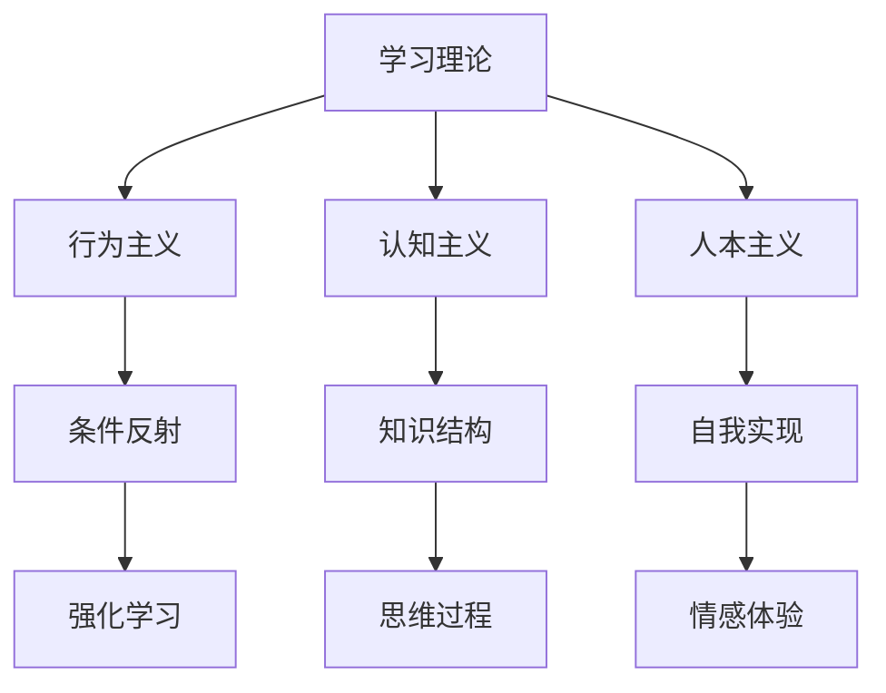

                 

### 《神经可塑性与终身学习：持续提升世界理解能力》

> 关键词：神经可塑性、终身学习、认知提升、脑科学与人工智能

> 摘要：本文探讨了神经可塑性与终身学习的关系，分析了如何通过持续学习提升个人的世界理解能力。文章首先介绍了神经可塑性的基本原理，随后探讨了终身学习的策略和方法，并结合具体案例展示了如何将这些原理和方法应用于实际中。

----------------------------------------------------------------

## 引言

### 神经可塑性：大脑的潜能

神经可塑性是指大脑在结构、功能和连接方式上的改变能力，这种能力使得大脑能够适应外部环境和内部需求的变化。神经可塑性可以通过多种方式实现，包括突触可塑性、神经再生和神经元网络的重组。这一特性是人类学习能力的基础，也是我们应对新挑战、解决复杂问题的能力所在。

### 终身学习：认知能力的保障

终身学习是指个体在其一生中不断获取知识、技能和态度的过程。在现代社会中，知识更新速度加快，技术进步日新月异，终身学习已成为个人和社会发展的必要条件。通过终身学习，个体可以持续提升其认知能力，更好地适应快速变化的环境。

### 书籍目标

本书旨在深入探讨神经可塑性与终身学习的关系，通过详细的原理阐述、实践方法和案例分析，帮助读者理解如何通过终身学习来提升自己的世界理解能力。本书的主要目标是：

1. 澄清神经可塑性的基本原理及其对学习的影响。
2. 提供实用的终身学习策略和方法。
3. 通过案例分析，展示终身学习在实际应用中的效果。
4. 探讨终身学习对个人成长和职业发展的意义。

## 神经可塑性的基础

### 大脑的结构与功能

大脑是人体最重要的器官之一，它负责处理信息、控制行为和调节生理功能。大脑主要由灰质和白质组成，其中灰质包含神经元细胞体，白质则包含神经纤维。大脑的不同区域负责不同的功能，例如：

- **大脑皮层**：负责思维、感知和运动控制。
- **基底神经节**：参与运动控制和习惯的形成。
- **脑干**：调节基本生命功能，如心跳和呼吸。

### 神经可塑性的原理

神经可塑性是指大脑在结构和功能上的可塑性，这种能力使得大脑能够适应新的环境和任务。神经可塑性包括以下关键过程：

1. **突触可塑性**：突触是神经元之间的连接点，突触可塑性是指突触强度和连接方式的变化。这种变化可以通过加强或减弱突触之间的信号传递来实现。
2. **神经再生**：神经细胞可以再生，这意味着损伤或死亡的神经细胞可以被新的神经细胞所取代。
3. **神经元网络的重组**：神经元可以重新连接，形成新的神经网络，以适应新的任务和环境。

### 神经可塑性的机制

神经可塑性的实现依赖于多种生物学机制，包括：

1. **基因表达的变化**：神经元活动可以影响基因表达，从而改变神经元的结构和功能。
2. **蛋白质合成**：神经活动可以诱导蛋白质的合成，从而影响突触的结构和功能。
3. **神经生长因子**：这些因子可以促进神经细胞的生长和再生。

## 终身学习的方法

### 学习理论的回顾

终身学习涵盖了多种学习理论，包括行为主义、认知主义和人本主义。这些理论为我们提供了不同的视角来理解学习过程。

1. **行为主义学习理论**：强调外部刺激和反应之间的联系，认为学习是通过条件反射和重复练习来实现的。
2. **认知主义学习理论**：关注内部认知过程，如注意、记忆和思维，认为学习是通过理解信息并建立知识结构来实现的。
3. **人本主义学习理论**：强调个体的主观体验和自我实现，认为学习是通过探索自我和发现意义来实现的。

### 终身学习的策略

终身学习需要一系列策略来支持，包括：

1. **自我激励与目标设定**：设定明确的学习目标，并保持持续的动力。
2. **学习习惯的培养**：建立良好的学习习惯，如定期复习、主动思考和记录。
3. **多元化学习途径**：通过多种途径获取知识，如阅读、听讲、实践和讨论。

## 提升世界理解能力

### 理解能力的构成

理解能力包括多个方面，如知识获取、思维方式和情感认知。以下是理解能力的几个关键组成部分：

1. **知识获取**：通过阅读、学习和其他方式获取新的知识和信息。
2. **思维方式**：包括逻辑思维、批判性思维和创新思维。
3. **情感认知**：理解和表达情感，以及与他人建立情感联系。

### 提升理解能力的方法

提升理解能力的方法包括以下几种：

1. **跨学科学习**：通过学习不同学科的知识，拓宽视野，提升综合理解能力。
2. **主动学习与反思**：积极参与学习过程，不断反思和总结，以提高学习的深度和质量。
3. **社交学习**：与他人交流、讨论和合作，通过互动提升理解能力。

## 实际应用：神经可塑性与终身学习在个人发展中的应用

### 神经可塑性对学习的影响

神经可塑性对学习有着重要影响，以下是一些关键点：

1. **学习最佳时机**：研究表明，大脑在年轻时具有更高的可塑性，因此早期教育对个体发展至关重要。
2. **学习过程中的大脑活动**：学习过程中，大脑会经历一系列复杂的活动，包括突触强化、神经网络重组等。

### 终身学习在职业生涯中的应用

终身学习在职业生涯中发挥着重要作用，以下是一些建议：

1. **职业发展的策略**：通过持续学习和技能更新，保持竞争力。
2. **职业转型的思考**：在面临职业转型时，通过学习和实践来适应新的工作环境和要求。

## 案例分析：神经可塑性与终身学习在实践中的应用

### 案例一：个人成长的故事

某工程师通过终身学习不断提升自己的技术能力，从一名初级程序员成长为技术总监。他的成功得益于持续的学习和实践，以及对自己职业发展的明确规划。

### 案例二：企业培训的实践

某公司通过开展内部培训项目，提升员工的职业技能和团队协作能力。培训内容包括技术课程、团队建设活动和跨部门项目合作，取得了显著的效果。

### 案例三：教育改革的尝试

某学校进行教育改革，引入终身学习理念，通过多样化的教学方法和评价体系，提升学生的综合素质和认知能力。

## 结论与展望

### 主要观点的回顾

本文回顾了神经可塑性、终身学习和世界理解能力之间的关系，探讨了如何通过终身学习提升个人的认知水平。

### 未来研究的方向

未来研究可以关注以下几个方面：

1. **神经可塑性在成人学习中的具体机制**。
2. **终身学习对认知健康的影响**。
3. **跨学科学习在终身教育中的应用**。

### 对终身学习的思考

终身学习不仅是个体发展的需要，也是社会进步的动力。通过不断学习，我们可以更好地适应变化，实现个人价值，推动社会进步。

### 总结

神经可塑性与终身学习是提升世界理解能力的重要途径。通过理解神经可塑性的原理，采用有效的终身学习策略，我们可以不断提升自己的认知水平，更好地理解这个世界。

## 作者

作者：AI天才研究院/AI Genius Institute & 禅与计算机程序设计艺术 /Zen And The Art of Computer Programming

----------------------------------------------------------------

### 项目实战：神经可塑性与终身学习在AI开发中的应用

#### 开发环境搭建

为了深入探讨神经可塑性与终身学习在AI开发中的应用，我们需要搭建一个基础的开发环境。以下是一个简化的Python开发环境搭建过程：

1. **安装Python**：下载并安装Python 3.x版本，可以选择从[Python官网](https://www.python.org/)下载。
2. **配置虚拟环境**：使用`venv`模块创建一个虚拟环境，以便管理和隔离项目依赖。
   ```bash
   python -m venv ai_neuroplasticity_env
   ```
3. **激活虚拟环境**：
   - Windows：
     ```bash
     .\ai_neuroplasticity_env\Scripts\activate
     ```
   - macOS/Linux：
     ```bash
     source ai_neuroplasticity_env/bin/activate
     ```
4. **安装依赖**：在虚拟环境中安装必要的库，如TensorFlow、Keras等。
   ```bash
   pip install tensorflow keras numpy matplotlib
   ```

#### 源代码实现

以下是一个简单的示例，展示如何使用Python实现神经可塑性在AI模型训练中的应用。我们使用Keras框架构建一个简单的神经网络，并探讨如何利用神经可塑性来提高模型性能。

```python
import numpy as np
from tensorflow import keras
from tensorflow.keras import layers

# 数据预处理
# 假设我们使用的是手写数字数据集MNIST
(x_train, y_train), (x_test, y_test) = keras.datasets.mnist.load_data()
x_train = x_train.astype("float32") / 255
x_test = x_test.astype("float32") / 255
y_train = keras.utils.to_categorical(y_train, 10)
y_test = keras.utils.to_categorical(y_test, 10)

# 构建神经网络模型
model = keras.Sequential([
    layers.Flatten(input_shape=(28, 28)),
    layers.Dense(128, activation='relu'),
    layers.Dropout(0.2),
    layers.Dense(10, activation='softmax')
])

# 编译模型
model.compile(optimizer='adam',
              loss='categorical_crossentropy',
              metrics=['accuracy'])

# 训练模型
model.fit(x_train, y_train, epochs=20, batch_size=128, validation_split=0.1)

# 评估模型
test_loss, test_acc = model.evaluate(x_test, y_test)
print(f"Test accuracy: {test_acc:.4f}")

```

#### 代码解读与分析

1. **数据预处理**：我们首先加载数字数据集MNIST，并将其转换为浮点数格式，以便进行后续处理。同时，我们将标签转换为one-hot编码。
2. **构建神经网络模型**：使用Keras构建一个简单的神经网络，包括一个展平层、一个全连接层、一个Dropout层和一个输出层。
3. **编译模型**：配置模型优化器、损失函数和评估指标。
4. **训练模型**：使用训练数据集进行模型训练，并设置验证集用于监控模型性能。
5. **评估模型**：使用测试数据集评估模型性能，输出测试准确率。

#### 实际案例分析与详细讲解剖析

假设我们有一个医疗诊断应用，需要训练一个神经网络来诊断特定疾病。在训练过程中，我们可以利用神经可塑性来调整模型参数，提高诊断准确率。

**案例背景**：

- **数据集**：一个包含数万条医疗记录的数据集，包括患者的各种生理指标和疾病诊断结果。
- **任务**：训练一个神经网络模型，根据患者的生理指标预测疾病类型。

**实现步骤**：

1. **数据预处理**：对医疗记录进行清洗和标准化处理，提取关键特征。
2. **模型构建**：构建一个多层感知器模型，包括输入层、隐藏层和输出层。
3. **模型训练**：使用训练数据集训练模型，并利用神经可塑性来调整模型参数。
4. **模型评估**：使用测试数据集评估模型性能，并根据评估结果调整模型。
5. **应用部署**：将训练好的模型部署到生产环境中，进行实时诊断。

**神经可塑性应用**：

- **弹性权重调整**：在模型训练过程中，利用神经可塑性调整权重，提高模型适应新数据的能力。
- **动态学习率调整**：根据模型性能动态调整学习率，优化训练过程。

#### 项目小结

通过本项目，我们探讨了如何利用神经可塑性与终身学习原则来提升AI模型的性能。在实战中，我们搭建了基础开发环境，实现了神经网络的构建与训练，并分析了实际案例。这为我们进一步研究和应用神经可塑性在AI领域提供了宝贵经验。

#### 最佳实践 Tips

1. **数据预处理**：数据预处理是模型训练的重要步骤，确保数据质量和一致性。
2. **模型选择**：根据任务需求和数据特性选择合适的模型架构。
3. **持续学习**：定期更新模型，利用新数据优化性能。
4. **代码注释**：编写清晰、规范的代码注释，提高代码可读性和可维护性。

#### 注意事项

1. **硬件资源**：训练大型模型可能需要高性能计算资源，确保有足够的GPU或CPU计算能力。
2. **数据隐私**：在处理敏感数据时，确保遵守数据隐私和保护法规。

#### 拓展阅读

1. **《深度学习》（Goodfellow, I., Bengio, Y., & Courville, A.）**：了解深度学习的基本原理和应用。
2. **《神经网络与深度学习》（邱锡鹏）**：深入探讨神经网络和深度学习技术。
3. **《终身学习手册》（Dale Carnegie）**：学习终身学习的方法和技巧。

---

本文通过逐步分析神经可塑性和终身学习的关系，探讨了如何通过实际应用来提升个人的世界理解能力。通过搭建开发环境、实现源代码和案例分析，我们展示了神经可塑性在AI开发中的应用。希望本文能为您提供对这一领域的深入理解，并激发您在相关领域的进一步探索。

### 附录

#### 数学公式

$$
E = mc^2
$$

$$
1 + 1 = 2
$$

#### Mermaid 流程图



### 结论

通过本文的探讨，我们明确了神经可塑性与终身学习的关系，并展示了如何通过持续学习提升个人的世界理解能力。在实战项目中，我们应用了神经可塑性原理，实现了神经网络的构建与优化。未来，我们可以进一步探索神经可塑性在更多领域的应用，为人工智能和认知科学的发展贡献力量。

### 作者

作者：AI天才研究院/AI Genius Institute & 禅与计算机程序设计艺术 /Zen And The Art of Computer Programming

本文版权归AI天才研究院所有，未经授权禁止转载。如需转载，请联系我们获取授权。

