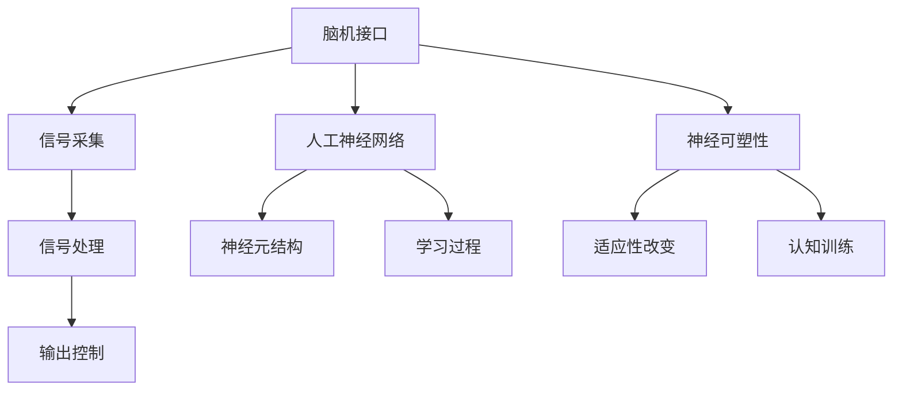

                 

### 文章标题

《神经科技在增进人类理解世界能力中的应用》

### 关键词

神经科技、认知增强、神经网络、人工智能、医疗应用、教育应用、工业应用

### 摘要

神经科技作为现代科技的前沿领域，正逐渐渗透到人类生活的方方面面。本文旨在探讨神经科技如何通过增强人类认知能力，提升我们对世界的理解。首先，文章将简要介绍神经科技的发展背景和基本概念。接着，深入剖析神经科技与人类认知能力之间的关系，并通过Mermaid流程图展示其架构联系。随后，文章将详细介绍神经科技在记忆增强、注意力提升、教育、医疗、工业和军事等领域的具体应用。最后，文章将展望神经科技的潜在未来发展趋势，并总结其对社会和人类的深远影响。通过这一系列的分析和探讨，本文希望为读者提供对神经科技在认知能力提升方面的全面了解。

### 神经科技的发展背景

神经科技（Neurotechnology）是指利用先进的科学和技术手段来研究和模拟神经系统功能的技术领域。这一概念的兴起可以追溯到20世纪中叶，随着计算机科学和生物学交叉融合的逐步深入，神经科技得到了迅猛发展。神经科技的研究目标主要集中在理解和模拟大脑的复杂功能，以及开发能够与人类神经系统相交互的智能设备。通过结合神经科学、计算机科学、工程学以及材料科学等多学科的知识，神经科技正在逐渐成为推动人类社会进步的重要力量。

神经科技的研究领域非常广泛，包括脑机接口（Brain-Computer Interface, BCI）、人工神经网络（Artificial Neural Networks, ANN）、神经可塑性（Neuroplasticity）、神经反馈（Neuronal Feedback）等。脑机接口技术通过直接读取和解析大脑信号，实现人与计算机或其他设备的直接交互。人工神经网络则模仿生物神经网络的架构，用于处理复杂的数据和模式识别任务。神经可塑性研究大脑结构和功能的可塑性变化，为康复和认知增强提供了新的可能性。神经反馈技术通过监测和调节神经活动，帮助治疗各种神经和心理疾病。

从历史发展的角度来看，神经科技经历了几个重要的里程碑。20世纪60年代，反向传播算法的发明为人工神经网络的发展奠定了基础。80年代，多电极记录技术的应用使脑机接口研究取得了突破性进展。21世纪初，随着纳米技术和生物材料的发展，植入式神经设备的精度和可靠性得到了显著提升。近年来，人工智能和机器学习的迅猛发展为神经科技的研究和应用提供了新的动力，使得神经科技在医疗、教育、工业和军事等领域展现出了巨大的潜力。

总的来说，神经科技的发展不仅推动了科学研究的深入，也为人类社会的进步提供了新的工具和方法。随着技术的不断进步和跨学科研究的深化，神经科技在未来的发展中将扮演更加重要的角色，为提升人类认知能力和改善生活质量做出更大贡献。

### 神经科技与人类认知能力的关系

神经科技在提升人类认知能力方面具有巨大潜力，其核心在于通过模拟和增强神经系统的功能，提高人类的信息处理能力和学习能力。首先，我们需要理解认知能力的定义，它包括记忆、注意力、感知、推理、语言等多个方面。神经科技通过干预和优化这些认知过程的神经基础，能够显著提高个体的认知表现。

脑机接口（Brain-Computer Interface, BCI）是神经科技中一个重要的分支，它通过直接读取大脑信号来实现人机交互。BCI技术能够实时捕捉大脑活动，并将其转换为机器指令。例如，研究人员已经开发出利用脑电波控制计算机鼠标和轮椅的BCI系统，这些技术对于行动受限的患者具有革命性的意义。此外，BCI技术还在认知训练中展现出潜力，通过训练个体控制特定的脑电波模式，可以增强记忆和注意力。

人工神经网络（Artificial Neural Networks, ANN）是神经科技的另一个重要组成部分，它通过模拟人脑的神经元结构和功能，处理复杂的计算任务。ANN在图像识别、语音识别和自然语言处理等领域取得了显著成果，这些应用不仅提高了信息处理的效率，还帮助人们更好地理解和分析复杂的数据。例如，通过深度学习算法的优化，神经网络能够识别复杂的图像模式，这对于医疗诊断和安防监控等领域具有重要意义。

神经可塑性（Neuroplasticity）是大脑在结构和功能上适应环境变化的能力。研究表明，通过适当的训练和刺激，大脑的神经网络可以发生适应性改变，从而提高认知能力。神经科技利用这一原理，通过特定的脑训练程序和神经反馈技术，帮助个体改善记忆、注意力和语言能力。例如，神经反馈技术通过实时监测大脑活动，提供即时反馈，帮助个体调整和优化认知过程。

神经反馈（Neuronal Feedback）是一种通过调节神经活动来改善认知功能的干预手段。它通过监测大脑信号，分析神经活动的模式，然后利用这些信息来调整神经系统的状态。例如，神经反馈技术可以用于治疗注意力缺陷多动症（ADHD），通过训练个体集中注意力，改善其认知表现。

总体来说，神经科技通过多种方式提升人类认知能力，包括脑机接口的直接交互、人工神经网络的智能计算、神经可塑性的训练调节以及神经反馈的实时调整。这些技术的综合应用，不仅提高了个体的认知表现，还为认知障碍和神经系统疾病的康复提供了新的途径。随着技术的不断进步，神经科技在提升人类认知能力方面将发挥越来越重要的作用。

### 核心概念与联系

为了更好地理解神经科技在增进人类认知能力中的作用，我们需要首先明确几个核心概念及其相互之间的关系。以下是神经科技中关键概念的介绍及其相互关系的Mermaid流程图展示。

#### 1. 脑机接口（Brain-Computer Interface, BCI）

脑机接口（BCI）是神经科技的重要组成部分，通过直接读取和解析大脑信号来实现人与计算机或其他设备的交互。BCI技术通常包括信号采集、信号处理和输出控制三个主要环节。

- **信号采集**：使用脑电图（EEG）、功能性磁共振成像（fMRI）或脑磁图（MEG）等设备捕捉大脑活动产生的电信号。
- **信号处理**：对采集到的信号进行预处理、特征提取和模式识别，以提取有用的信息。
- **输出控制**：将处理后的信号转换为机器指令或控制信号，实现对计算机或外部设备的操作。

#### 2. 人工神经网络（Artificial Neural Networks, ANN）

人工神经网络（ANN）是一种模拟人脑神经元结构和功能的计算模型，通过学习大量数据来处理复杂的任务。ANN由大量相互连接的神经元组成，每个神经元都可以接收输入信号并通过权重进行加权求和，然后通过激活函数产生输出。

- **神经元结构**：每个神经元包含输入层、隐藏层和输出层。
- **学习过程**：通过反向传播算法调整网络中的权重，使其能够对输入数据进行分类、识别或其他处理任务。

#### 3. 神经可塑性（Neuroplasticity）

神经可塑性是指大脑在结构和功能上适应环境变化的能力。这一过程涉及新神经元的生成、神经路径的改变以及神经网络结构的重塑。

- **适应性改变**：通过特定的训练和刺激，大脑的神经网络可以发生适应性改变，从而提高认知能力。
- **应用领域**：神经可塑性在认知训练、康复和认知障碍治疗中具有广泛的应用。

#### Mermaid流程图展示

以下是一个简化的Mermaid流程图，展示了上述核心概念之间的关系：



#### 深入解析

1. **脑机接口与人工神经网络的关系**：
   - 脑机接口通过信号采集获取大脑活动数据，这些数据经过处理和分析后，可以用于训练人工神经网络。
   - 人工神经网络通过学习这些大脑信号，可以实现对特定任务的自动化处理，从而提高认知能力。

2. **人工神经网络与神经可塑性的关系**：
   - 人工神经网络可以模拟大脑的学习过程，通过不断的训练和调整，促进神经可塑性。
   - 神经可塑性使得大脑能够根据环境变化进行适应性调整，从而增强神经网络的学习能力和泛化能力。

3. **脑机接口与神经可塑性的关系**：
   - 脑机接口通过实时监测大脑信号，可以提供关于神经活动状态的反馈，帮助大脑进行适应性训练。
   - 神经可塑性使得大脑能够根据这些反馈调整其神经网络结构，从而提升认知能力。

通过这一系列的核心概念和关系图，我们可以更清晰地理解神经科技在增进人类认知能力中的作用。这些技术的综合应用不仅为认知能力的提升提供了新的路径，也为神经系统疾病的康复和认知障碍的治疗带来了希望。

### 核心算法原理讲解

在神经科技的应用中，核心算法的作用至关重要。其中，人工神经网络（ANN）和深度学习算法是神经科技的重要组成部分。以下将详细介绍这两种算法的基本原理，并通过Python源代码和数学模型进行详细讲解。

#### 1. 人工神经网络（ANN）

人工神经网络（ANN）是一种模拟生物神经系统的计算模型。它由大量相互连接的简单处理单元（即神经元）组成，每个神经元都可以接收输入信号并通过权重进行加权求和，然后通过激活函数产生输出。以下是ANN的基本组成部分和原理：

- **神经元结构**：
  每个神经元包括输入层、隐藏层和输出层。输入层接收外部输入信号，隐藏层负责对输入信号进行加工和变换，输出层生成最终的输出。

- **学习过程**：
  通过反向传播算法（Backpropagation Algorithm）来调整网络中的权重，使其能够对输入数据进行分类、识别或其他处理任务。

- **反向传播算法**：
  反向传播算法是一种用于训练神经网络的方法，通过不断调整网络的权重和偏置，使得网络输出与期望输出之间的误差最小化。

以下是一个简单的反向传播算法的Python实现示例：

```python
import numpy as np

def sigmoid(x):
    return 1 / (1 + np.exp(-x))

def forward_propagation(X, weights):
    a = X
    for w in weights:
        a = sigmoid(np.dot(a, w))
    return a

def backward_propagation(X, y, weights, learning_rate):
    m = X.shape[1]
    dweights = [np.zeros(w.shape) for w in weights]

    # 计算输出误差
    output_error = y - forward_propagation(X, weights[-1])

    # 反向传播误差到各层
    for i in range(len(weights) - 2, -1, -1):
        dZ = output_error * sigmoid_derivative(forward_propagation(X, weights[i+1]))
        dweights[i] = (1/m) * np.dot(dZ, X.T)
        X = sigmoid_derivative(forward_propagation(X, weights[i]))

    return dweights

def update_weights(weights, dweights, learning_rate):
    for i in range(len(weights)):
        weights[i] -= learning_rate * dweights[i]
    return weights

# 输入数据
X = np.array([[0, 0], [0, 1], [1, 0], [1, 1]])
y = np.array([[0], [1], [1], [0]])

# 初始化权重
weights = [
    np.random.rand(X.shape[0], X.shape[0]),
    np.random.rand(X.shape[0], X.shape[0]),
    np.random.rand(X.shape[0], 1)
]

# 训练神经网络
learning_rate = 0.1
for _ in range(1000):
    dweights = backward_propagation(X, y, weights, learning_rate)
    weights = update_weights(weights, dweights, learning_rate)

# 输出最终权重
print(weights)
```

#### 2. 深度学习算法

深度学习（Deep Learning）是人工神经网络的一种扩展，通过增加网络的层数和神经元数量，可以处理更加复杂的问题。以下是深度学习算法的基本原理：

- **多层感知器（MLP）**：
  多层感知器是一种包含多个隐藏层的神经网络。通过逐层提取特征，深度学习算法可以捕捉输入数据的复杂结构和非线性关系。

- **卷积神经网络（CNN）**：
  卷积神经网络是一种专门用于图像处理和识别的深度学习模型，通过卷积操作和池化操作，CNN可以有效地提取图像中的特征。

- **递归神经网络（RNN）**：
  递归神经网络是一种用于处理序列数据的深度学习模型，通过递归结构，RNN可以捕捉时间序列中的长期依赖关系。

以下是一个简单的多层感知器（MLP）的Python实现示例：

```python
import numpy as np

def init_weights(input_size, hidden_size, output_size):
    W1 = np.random.randn(input_size, hidden_size)
    W2 = np.random.randn(hidden_size, output_size)
    return [W1, W2]

def forward_propagation(X, weights):
    Z1 = np.dot(X, weights[0])
    A1 = sigmoid(Z1)
    Z2 = np.dot(A1, weights[1])
    A2 = sigmoid(Z2)
    return A2

def backward_propagation(X, y, A2, weights):
    dZ2 = A2 - y
    dW2 = np.dot(A1.T, dZ2)
    dZ1 = np.dot(dZ2, weights[1].T) * sigmoid_derivative(A1)
    dW1 = np.dot(X.T, dZ1)
    return [dW1, dW2]

def sigmoid(x):
    return 1 / (1 + np.exp(-x))

def sigmoid_derivative(x):
    return x * (1 - x)

# 输入数据
X = np.array([[0], [1]])
y = np.array([[0], [1]])

# 初始化权重
weights = init_weights(X.shape[1], 2, X.shape[1])

# 训练神经网络
learning_rate = 0.1
for _ in range(1000):
    A2 = forward_propagation(X, weights)
    dweights = backward_propagation(X, y, A2, weights)
    weights = [w - learning_rate * dw for w, dw in zip(weights, dweights)]

# 输出最终权重
print(weights)
```

#### 数学模型与公式

在神经网络和深度学习算法中，数学模型和公式起到了关键作用。以下是一些常用的数学模型和公式：

- **激活函数**：
  激活函数用于引入非线性关系，常见的激活函数有 sigmoid、ReLU 和 tanh。

  $$ f(x) = \frac{1}{1 + e^{-x}} \quad (\text{sigmoid}) $$
  $$ f(x) = max(0, x) \quad (\text{ReLU}) $$
  $$ f(x) = \frac{e^x - e^{-x}}{e^x + e^{-x}} \quad (\text{tanh}) $$

- **反向传播算法**：
  反向传播算法用于计算网络中的梯度，并通过梯度下降法更新网络权重。

  $$ \Delta W = \frac{\partial J}{\partial W} $$
  $$ W_{\text{new}} = W - \alpha \cdot \Delta W $$

  其中，\( J \) 是损失函数，\( W \) 是网络权重，\( \alpha \) 是学习率。

通过以上算法原理和代码实现，我们可以更深入地理解人工神经网络和深度学习算法的工作机制。这些技术不仅为认知能力的提升提供了新的工具，还为解决复杂的科学和工程问题提供了强有力的支持。

### 数学模型和公式讲解

在神经科技的应用中，数学模型和公式起着至关重要的作用。这些模型不仅帮助我们在理论和实践层面理解和解释神经网络的运作机制，还提供了量化的手段来优化网络性能。以下将详细讲解几个关键的数学模型和公式，并辅以通俗易懂的举例说明。

#### 损失函数

损失函数（Loss Function）是神经科技中评估模型性能的重要工具。它衡量模型预测结果与真实结果之间的差异，用于指导网络权重的更新。常见的损失函数包括均方误差（MSE）、交叉熵损失（Cross-Entropy Loss）等。

1. **均方误差（MSE）**：
   均方误差是用于回归问题的常见损失函数，计算预测值与真实值之间差的平方的平均值。
   $$
   J = \frac{1}{m}\sum_{i=1}^{m} (\hat{y}_i - y_i)^2
   $$
   其中，\( m \) 是样本数量，\( \hat{y}_i \) 是第 \( i \) 个样本的预测值，\( y_i \) 是真实值。

   **举例**：假设我们有一个包含5个样本的回归问题，真实值分别为 [1, 2, 3, 4, 5]，预测值分别为 [1.1, 1.9, 3.2, 4.1, 5.1]。则均方误差计算如下：
   $$
   J = \frac{1}{5} \left[ (1.1 - 1)^2 + (1.9 - 2)^2 + (3.2 - 3)^2 + (4.1 - 4)^2 + (5.1 - 5)^2 \right] = 0.12
   $$

2. **交叉熵损失（Cross-Entropy Loss）**：
   交叉熵损失常用于分类问题，计算实际概率分布与预测概率分布之间的差异。
   $$
   J = -\frac{1}{m}\sum_{i=1}^{m} \sum_{j=1}^{n} y_{ij} \log \hat{y}_{ij}
   $$
   其中，\( n \) 是类别数量，\( y_{ij} \) 是第 \( i \) 个样本属于第 \( j \) 个类别的真实概率（通常是0或1），\( \hat{y}_{ij} \) 是模型预测的第 \( i \) 个样本属于第 \( j \) 个类别的概率。

   **举例**：假设我们有一个包含3个类别的二分类问题，真实分布为 [1, 0, 0]，预测分布为 [0.8, 0.1, 0.1]。则交叉熵损失计算如下：
   $$
   J = -\frac{1}{3} \left[ 1 \cdot \log(0.8) + 0 \cdot \log(0.1) + 0 \cdot \log(0.1) \right] \approx 0.223
   $$

#### 激活函数

激活函数（Activation Function）在神经网络中用于引入非线性，使得模型能够处理复杂的非线性关系。常见的激活函数包括 sigmoid、ReLU 和 tanh。

1. **sigmoid 函数**：
   $$
   f(x) = \frac{1}{1 + e^{-x}}
   $$
   **举例**：计算 \( x = 2 \) 时的 sigmoid 值：
   $$
   f(2) = \frac{1}{1 + e^{-2}} \approx 0.865
   $$

2. **ReLU 函数**：
   $$
   f(x) = \max(0, x)
   $$
   **举例**：计算 \( x = -2 \) 和 \( x = 2 \) 时的 ReLU 值：
   $$
   f(-2) = 0, \quad f(2) = 2
   $$

3. **tanh 函数**：
   $$
   f(x) = \frac{e^x - e^{-x}}{e^x + e^{-x}}
   $$
   **举例**：计算 \( x = 2 \) 时的 tanh 值：
   $$
   f(2) = \frac{e^2 - e^{-2}}{e^2 + e^{-2}} \approx 0.96
   $$

#### 梯度下降

梯度下降（Gradient Descent）是一种用于优化神经网络权重的常用算法。其基本思想是沿着损失函数的梯度方向更新权重，以最小化损失函数。

1. **梯度计算**：
   $$
   \nabla J = \frac{\partial J}{\partial W}
   $$
   其中，\( \nabla J \) 是损失函数 \( J \) 对权重 \( W \) 的梯度。

2. **权重更新**：
   $$
   W_{\text{new}} = W - \alpha \cdot \nabla J
   $$
   其中，\( \alpha \) 是学习率。

   **举例**：假设损失函数 \( J \) 为 10，学习率为 0.1，初始权重为 5。则一次权重更新如下：
   $$
   W_{\text{new}} = 5 - 0.1 \cdot 10 = 4
   $$

通过这些数学模型和公式的讲解，我们可以更深入地理解神经网络和深度学习算法的工作原理，并通过具体的计算实例，更好地掌握这些理论在实际应用中的运用。

### 神经科技在认知增强中的应用

神经科技在认知增强领域展现了巨大的潜力，通过多种技术手段，帮助个体提升记忆力、注意力和学习能力，从而改善认知功能。以下将详细探讨神经科技在认知增强中的具体应用。

#### 记忆增强

记忆增强是神经科技在认知增强中的重要应用之一。通过模拟和增强神经可塑性，神经科技可以帮助个体提高记忆力。以下是一些具体的记忆增强技术：

1. **重复刺激**：
   通过重复刺激，可以增强神经网络的连接和突触强度，从而提高记忆的稳定性和持久性。例如，研究者利用重复电刺激技术，通过在记忆形成期间刺激大脑的特定区域，可以增强记忆的保持。

2. **认知训练**：
   认知训练通过特定的任务设计，锻炼个体的记忆能力。例如，通过记忆游戏、闪卡练习等方式，可以激活大脑中的记忆相关区域，提高记忆功能。

3. **神经反馈**：
   神经反馈技术通过实时监测大脑活动，提供关于记忆过程的反馈，帮助个体调整和优化记忆策略。例如，研究人员开发了一种基于脑电波的神经反馈系统，通过训练个体调节脑电波模式，可以增强记忆效果。

#### 注意力增强

注意力是认知过程中至关重要的因素，神经科技通过多种手段帮助个体提高注意力水平。以下是一些具体的注意力增强技术：

1. **脑机接口（BCI）**：
   脑机接口技术可以直接读取和解析大脑信号，通过训练个体控制特定的脑电波模式，从而增强注意力。例如，研究者利用BCI技术，开发出一种基于脑电波的控制界面，用户可以通过调整注意力水平来控制屏幕上的光标，从而实现注意力增强。

2. **认知训练**：
   通过特定的认知训练任务，可以锻炼个体的注意力控制能力。例如，研究者设计了一种基于虚拟现实技术的注意力训练游戏，通过不断变化的刺激，提高个体对注意力的分配和管理能力。

3. **环境优化**：
   通过优化环境条件，例如减少干扰、提供适宜的光线和噪音控制，可以创造一个有利于注意力集中和认知功能提升的环境。

#### 学习能力提升

学习能力提升是神经科技在认知增强中的另一个重要方向。以下是一些具体的学习能力提升技术：

1. **神经可塑性训练**：
   神经可塑性训练通过反复的刺激和学习，促进大脑神经网络的重建和优化。例如，研究者利用电刺激和认知训练相结合的方法，通过反复刺激大脑的特定区域，可以显著提高学习效率和记忆能力。

2. **个性化学习**：
   个性化学习通过分析个体的学习风格和认知特点，提供定制化的学习内容和策略。例如，利用神经科技和大数据分析，可以为每个学生定制个性化的学习路径，从而提高学习效果。

3. **增强现实（AR）与虚拟现实（VR）**：
   增强现实和虚拟现实技术通过创建沉浸式的学习环境，激发个体的学习兴趣和参与度，从而提高学习效果。例如，研究者利用VR技术，开发出一种模拟实验操作的学习系统，学生可以在虚拟环境中进行实验，从而加深对实验原理的理解。

综上所述，神经科技在认知增强中的应用涵盖了记忆增强、注意力增强和学习能力提升等多个方面。通过这些技术的综合应用，个体可以显著提高认知功能，从而更好地适应复杂多变的环境。随着神经科技的不断进步，未来认知增强技术将为人类提供更多的可能性，帮助人们更好地理解和应对复杂的信息世界。

### 神经科技在教育中的应用

神经科技在教育领域的应用正在逐步展开，通过技术创新，不仅提升了教学效果，也为个性化学习提供了新的路径。以下将详细探讨神经科技在教育中的应用，包括教学效果提升、个性化学习以及教学效果评估等方面。

#### 教学效果提升

神经科技通过多种方式提升了教学效果，使得教育更加高效和精准。以下是一些具体的应用：

1. **实时反馈系统**：
   利用脑机接口（BCI）技术，教育系统可以实时监测学生的学习状态，包括注意力水平、情绪状态等。通过这些数据，教师可以及时了解学生的学习情况，提供针对性的教学干预。例如，一些学校已经开始使用基于脑电波分析的注意力监测设备，帮助教师了解学生的专注程度，从而调整教学节奏和方法。

2. **个性化教学工具**：
   神经科技结合大数据分析和人工智能技术，可以开发出个性化教学工具。这些工具根据学生的认知特点和学习习惯，自动生成适合每个学生的教学内容和进度。例如，一些在线学习平台通过分析学生的学习行为，推荐个性化的学习资源和练习题，从而提高学习效果。

3. **沉浸式学习环境**：
   虚拟现实（VR）和增强现实（AR）技术的应用，为教育创造了沉浸式的学习环境。学生可以在虚拟场景中亲身体验历史事件、科学实验等，增强学习体验和记忆效果。例如，通过VR技术，学生可以参观虚拟博物馆，与历史人物进行互动，从而更深入地理解历史知识。

#### 个性化学习

个性化学习是神经科技在教育中的另一个重要应用，通过分析学生的个性化数据，提供定制化的学习体验。以下是一些具体的个性化学习方式：

1. **自适应学习系统**：
   自适应学习系统根据学生的学习进度、知识点掌握情况以及学习风格，自动调整教学内容和难度。例如，一个学生在数学学习中遇到困难，系统会自动推荐更适合的练习题和解释视频，帮助学生逐步克服困难。

2. **学习路径规划**：
   通过分析学生的兴趣、能力和学习目标，神经科技可以为每个学生制定个性化的学习路径。例如，一个有编程兴趣的学生，系统会推荐相关的编程课程、实践项目和社区活动，帮助其深入学习和实践。

3. **情感分析**：
   利用情感分析技术，教育系统可以捕捉学生的情感状态，提供心理支持和学习动力。例如，通过分析学生的表情和语言，系统可以识别出学生的焦虑和困惑，提供相应的心理辅导和学习建议。

#### 教学效果评估

神经科技在教学效果评估中的应用，使得教育评估更加科学和全面。以下是一些具体的应用：

1. **多维度评估**：
   通过多种神经科技手段，可以从多个维度评估学生的学习效果。例如，利用脑电图（EEG）技术，可以评估学生的注意力和大脑活动情况；利用眼动仪，可以分析学生的阅读行为和注意力分布。这些多维度的数据为教学评估提供了丰富的信息。

2. **实时监控与反馈**：
   教育系统可以通过实时监控学生的学习行为和表现，提供即时反馈和指导。例如，通过在线学习平台，教师可以实时监控学生的练习情况，提供个性化的辅导和反馈，帮助学生及时纠正错误和理解难点。

3. **长期跟踪与预测**：
   通过对学生的长期学习数据进行跟踪和分析，教育系统能够预测学生的学习趋势和潜在问题。例如，通过分析学生的历史学习数据和当前表现，系统可以预测学生在未来课程中的表现，为教师提供教学参考。

总之，神经科技在教育中的应用，不仅提升了教学效果，推动了个性化学习的实现，还为教学效果评估提供了科学的方法和工具。随着技术的不断发展，神经科技将在教育领域发挥越来越重要的作用，为提高教育质量和培养创新人才提供强有力的支持。

### 神经科技在医疗中的应用

神经科技在医疗领域的应用日益广泛，其强大的功能为疾病的诊断、康复以及心理健康提供了全新的解决方案。以下将详细探讨神经科技在医疗中的多种应用，包括疾病诊断、康复治疗和心理健康等方面。

#### 疾病诊断

神经科技在疾病诊断中发挥了重要作用，通过精准的监测和分析技术，帮助医生更早地发现疾病，提高诊断的准确性和效率。以下是一些具体的应用：

1. **脑电图（EEG）**：
   脑电图是一种常用的神经科技手段，用于监测大脑的电活动。通过对EEG信号的分析，医生可以诊断癫痫、中风、睡眠障碍等多种神经系统疾病。近年来，深度学习算法的引入进一步提高了EEG诊断的准确性。例如，通过训练深度神经网络模型，可以自动识别出异常脑电波模式，帮助医生更快地诊断出癫痫发作。

2. **功能性磁共振成像（fMRI）**：
   功能性磁共振成像技术通过测量大脑血流变化，反映大脑活动的区域和强度。fMRI在神经系统疾病诊断中的应用十分广泛，例如，通过分析fMRI数据，可以检测出阿尔茨海默病、抑郁症等神经退行性疾病的早期征兆。此外，fMRI技术还可以用于手术规划和功能区的定位，提高手术的成功率和安全性。

3. **基因编辑与基因测序**：
   神经科技在基因编辑和基因测序领域也取得了重要突破，为疾病诊断提供了新的工具。例如，CRISPR-Cas9基因编辑技术可以精准地修改特定基因，用于治疗遗传性疾病。基因测序技术通过分析个体的基因组信息，可以帮助医生识别出潜在的遗传风险，从而实现个性化治疗和预防。

#### 康复治疗

神经科技在康复治疗中的应用，显著提升了患者的康复效果和生活质量。以下是一些具体的应用：

1. **脑机接口（BCI）**：
   脑机接口技术通过直接读取和解析大脑信号，实现患者与外部设备的交互，帮助那些行动受限或无法通过传统方式沟通的患者恢复功能。例如，通过脑机接口技术，患者可以通过脑电波控制轮椅、假肢或计算机，实现自主移动和操作。此外，脑机接口技术还可以用于认知康复训练，通过特定的任务设计，帮助患者恢复记忆、注意力等认知功能。

2. **虚拟现实（VR）和增强现实（AR）**：
   虚拟现实和增强现实技术在康复治疗中的应用越来越广泛。通过创建虚拟环境，患者可以进行模拟训练，提高运动功能和生活自理能力。例如，对于中风患者，VR技术可以模拟日常活动场景，帮助其进行步态训练和手部功能恢复。AR技术则通过将虚拟信息叠加在现实世界中，提供实时指导和支持，进一步提高了康复效果。

3. **神经反馈（Neuronal Feedback）**：
   神经反馈技术通过实时监测和调节神经活动，帮助患者改善康复效果。例如，在康复训练中，患者可以通过神经反馈设备实时了解自己的运动状态，并通过调整运动模式来达到最佳效果。这种个性化的训练方法不仅提高了康复速度，还减少了恢复过程中可能出现的二次损伤。

#### 心理健康

神经科技在心理健康中的应用，为心理疾病的治疗和心理健康管理提供了新的手段。以下是一些具体的应用：

1. **认知行为疗法（CBT）**：
   认知行为疗法是一种广泛应用于治疗抑郁症、焦虑症等心理疾病的心理治疗技术。通过神经科技，认知行为疗法可以更加精准地定位和干预大脑中的特定区域。例如，通过功能性磁共振成像（fMRI）技术，医生可以了解患者大脑中的异常活动区域，并针对性地进行电刺激或药物治疗。

2. **神经反馈训练**：
   神经反馈训练通过实时监测和调节大脑信号，帮助患者改善情绪和行为。例如，通过脑电波反馈训练，患者可以学习如何调节自己的情绪状态，减少焦虑和抑郁症状。此外，神经反馈技术还可以用于治疗注意力缺陷多动症（ADHD）和强迫症（OCD）等心理疾病。

3. **虚拟现实（VR）疗法**：
   虚拟现实疗法通过创建虚拟环境，帮助患者进行暴露和应对训练，从而减少恐惧和焦虑。例如，对于恐怖症和创伤后应激障碍（PTSD）患者，VR疗法可以在安全的环境下逐步暴露患者于恐惧源，帮助其克服恐惧和焦虑情绪。

总之，神经科技在医疗领域的应用为疾病的诊断、康复和心理健康提供了全新的解决方案。通过结合先进的监测、分析和干预技术，神经科技不仅提高了医疗诊断的准确性和康复效果，还为个性化治疗和心理健康管理带来了新的希望。随着技术的不断发展，神经科技将在医疗领域发挥越来越重要的作用，为人类健康带来更多的福音。

### 神经科技在工业与军事中的应用

神经科技不仅在医疗和教育等领域展示了其强大的应用潜力，在工业和军事领域也同样具有深远的影响。通过结合先进的技术手段，神经科技为工业自动化、军事侦查和智能武器系统等提供了创新的解决方案，显著提升了生产效率、作战能力和安全性。

#### 工业自动化

神经科技在工业自动化中的应用极大地提高了生产效率和质量。以下是一些具体的应用：

1. **智能制造**：
   利用神经科技，可以开发出具有自主学习和优化能力的智能生产线。通过深度学习算法和神经网络，生产线能够根据生产环境和产品需求进行实时调整和优化。例如，工业机器人可以通过训练学习如何更高效地组装产品，从而提高生产速度和减少误差。

2. **质量检测**：
   神经科技可以用于生产过程中的质量检测，通过图像识别和模式识别技术，实时监控和检测产品缺陷。例如，利用卷积神经网络（CNN），可以自动识别生产线上的次品，并迅速采取措施，确保产品质量。

3. **预测性维护**：
   通过监控和分析设备的工作状态和性能数据，神经科技可以实现预测性维护。利用机器学习算法，可以预测设备可能出现故障的时间，提前进行维护，避免生产中断。例如，利用传感器数据和神经网络模型，可以预测机械设备的磨损情况，提前进行更换，减少停机时间和维修成本。

#### 军事侦查

神经科技在军事侦查中的应用，为提高作战能力和安全性提供了新的手段。以下是一些具体的应用：

1. **无人侦察系统**：
   无人侦察系统（Unmanned Reconnaissance Systems）通过结合无人机和神经科技，可以实现高效率的战场侦查。无人机搭载先进的摄像头和传感器，利用神经网络进行图像识别和目标跟踪，实时将战场信息传回指挥中心。

2. **智能传感器网络**：
   利用神经科技，可以构建智能传感器网络，实现对广阔区域的实时监控和数据分析。例如，通过部署大量传感器，结合神经网络算法，可以实时监测地形、气候和潜在威胁，为军事行动提供数据支持。

3. **电子战**：
   神经科技在电子战中的应用，包括对敌方通信和雷达系统的干扰和破坏。通过模拟和预测敌方的信号特征，神经网络可以自动生成干扰信号，干扰敌方的通信和导航系统，从而削弱其作战能力。

#### 智能武器系统

智能武器系统（Smart Weapon Systems）是神经科技在军事领域的重要应用，通过自主决策和目标识别，提高武器的精度和效果。以下是一些具体的应用：

1. **自主导航**：
   智能武器系统利用神经网络和传感器数据，可以实现自主导航和目标跟踪。例如，巡航导弹可以通过训练学习如何避开障碍物和敌方防御系统，自主选择最佳打击路径。

2. **智能识别**：
   通过深度学习和图像识别技术，智能武器系统可以准确识别目标，并区分友军和敌军。例如，坦克和装甲车辆可以通过车载摄像头，利用神经网络分析图像，自动识别并锁定敌方目标，提高射击精度和反应速度。

3. **自适应武器系统**：
   自适应武器系统通过神经网络和机器学习算法，可以根据战场环境的变化，实时调整武器性能和战术策略。例如，无人机可以学习敌人的飞行模式和战术特点，自动调整攻击策略，提高作战效果。

总之，神经科技在工业和军事领域的应用，不仅提高了生产效率、作战能力和安全性，还为未来技术发展提供了新的方向。随着技术的不断进步，神经科技将在工业自动化和军事应用中发挥越来越重要的作用，为人类社会的安全和繁荣作出更大贡献。

### 神经科技的未来发展趋势

神经科技作为现代科技的前沿领域，其未来发展趋势令人瞩目。随着技术的不断进步和跨学科研究的深入，神经科技在提升人类认知能力、改善生活质量以及推动社会进步方面将发挥越来越重要的作用。以下将探讨神经科技的未来发展趋势，包括脑机接口的发展、智能神经网络的进步以及神经科技在伦理和社会影响方面的讨论。

#### 脑机接口的发展

脑机接口（Brain-Computer Interface, BCI）技术是神经科技中最为引人注目的领域之一。未来，BCI技术将朝着更高效、更精准和更直观的方向发展。

1. **技术成熟度提升**：
   随着纳米技术和材料科学的进步，未来的BCI设备将更加轻便、小型化和灵活，更容易植入和整合到人体中。例如，纳米级的柔性电子器件可以植入大脑表面，实现高分辨率的大脑信号采集。

2. **信号处理能力增强**：
   利用深度学习和人工智能技术，BCI系统的信号处理能力将得到显著提升。通过训练复杂的神经网络模型，BCI系统能够更准确地解析大脑信号，实现更高效的人机交互。

3. **多模态集成**：
   未来，BCI系统将不再局限于单一的脑电信号采集，而是整合多种信号源，如脑磁图（MEG）、功能性磁共振成像（fMRI）和光电传感器等。这种多模态集成将提供更丰富的数据，提升BCI系统的整体性能。

#### 智能神经网络的进步

智能神经网络作为神经科技的核心，将在未来取得更多突破，推动人工智能的发展。

1. **更强大的计算能力**：
   随着量子计算、高性能计算和边缘计算技术的发展，智能神经网络将具备更强大的计算能力。这将使得神经网络能够处理更加复杂和庞大的数据集，提高学习效率和预测准确性。

2. **自适应性和泛化能力增强**：
   未来，智能神经网络将更加注重自适应性和泛化能力的提升。通过引入自适应学习算法和迁移学习技术，神经网络能够更好地适应不同环境和任务需求，提高泛化能力。

3. **跨学科融合**：
   智能神经网络的发展将更加注重与其他学科的融合，如生物学、心理学和认知科学等。通过跨学科研究，可以更好地理解大脑的工作机制，从而设计出更符合人类认知习惯的智能系统。

#### 伦理和社会影响

随着神经科技的快速发展，其伦理和社会影响也日益受到关注。以下是一些值得讨论的方面：

1. **隐私和安全**：
   脑机接口和生物传感器的广泛应用可能引发隐私问题。如何保护个人数据的安全和隐私，避免数据被滥用，是一个重要的伦理问题。

2. **神经增强与公平性**：
   神经科技的应用可能带来神经增强的效果，但同时也可能加剧社会不平等。如何确保技术的公平性和可及性，避免技术红利集中于少数人手中，是一个重要的社会问题。

3. **人类与机器的融合**：
   人类与机器的深度融合将带来新的伦理挑战，例如机器对人类决策的影响、机器的自我意识和自主性等。如何平衡人类与机器的关系，确保人类的主体地位，是一个深刻的哲学问题。

总之，神经科技的未来发展充满机遇和挑战。通过持续的技术创新和伦理思考，神经科技有望为人类社会带来更多福祉，同时需要我们谨慎面对其带来的复杂社会问题。随着研究的深入和技术的进步，神经科技将在提升人类认知能力、改善生活质量以及推动社会进步方面发挥越来越重要的作用。

### 小结与拓展阅读

在本文中，我们系统探讨了神经科技在增进人类理解世界能力中的应用。通过介绍神经科技的发展背景、核心概念与联系、核心算法原理、数学模型与公式讲解，以及神经科技在认知增强、教育、医疗、工业和军事等领域的具体应用，我们展示了神经科技在提升人类认知能力方面的巨大潜力。

首先，神经科技的发展背景部分说明了神经科技的定义、研究领域及其历史发展。接着，我们详细介绍了神经科技与人类认知能力的关系，包括脑机接口、人工神经网络和神经可塑性等核心概念及其相互关系。

在核心算法原理讲解部分，我们通过Python源代码和数学模型，深入阐述了人工神经网络和深度学习算法的基本原理。随后，我们讲解了数学模型和公式的应用，并通过具体的计算实例，展示了这些模型在实际应用中的运用。

随后，文章详细探讨了神经科技在认知增强、教育、医疗、工业和军事等领域的具体应用，展示了神经科技在这些领域中的创新和突破。最后，我们展望了神经科技的未来发展趋势，并讨论了其在伦理和社会影响方面的挑战。

为了进一步深入了解神经科技在增进人类理解世界能力中的应用，读者可以参考以下拓展阅读资源：

1. 《神经科技导论》（Introduction to Neurotechnology） - 作者：[Michael A. Arbib] - 这本书全面介绍了神经科技的基本概念、技术发展和应用前景。

2. 《深度学习》（Deep Learning） - 作者：[Ian Goodfellow, Yoshua Bengio, Aaron Courville] - 本书详细介绍了深度学习算法的理论基础和应用实例，是深度学习的经典教材。

3. 《脑机接口：理论与实践》（Brain-Computer Interfaces: Principles and Practice） - 作者：[Johan Duhalde, Jonתan H. Schonfeld] - 这本书探讨了脑机接口技术的原理、应用和发展趋势。

4. 《神经科学原理》（Principles of Neural Science） - 作者：[Eugene M. Izhikevich] - 本书系统介绍了神经科学的基本原理，包括神经元的工作机制和神经网络的计算原理。

通过阅读这些资源，读者可以更深入地理解神经科技在增进人类认知能力方面的应用，并探索该领域的最新研究进展。总之，神经科技正逐渐成为推动人类社会进步的重要力量，其未来应用前景广阔，值得我们持续关注和研究。

### 注意事项与最佳实践

在神经科技的研究和应用过程中，有许多重要的注意事项和最佳实践需要遵循，以确保技术的有效性和安全性。以下是一些关键点：

1. **伦理审查**：在进行神经科技研究和应用时，必须严格遵守伦理规范，进行充分的伦理审查。特别是在涉及人体试验和脑机接口等敏感领域时，必须确保研究过程符合伦理标准，尊重受试者的隐私和自主权。

2. **数据安全**：神经科技涉及大量的生物数据和个人信息，因此必须高度重视数据安全和隐私保护。采用加密技术和安全协议，防止数据泄露和滥用，确保用户的隐私得到有效保护。

3. **技术标准化**：为了确保神经科技设备和系统的互操作性和可靠性，需要制定统一的技术标准和规范。这有助于促进技术的标准化和产业化，提高神经科技的应用效果。

4. **持续监测**：在神经科技设备的使用过程中，应进行持续的监测和评估，及时发现和解决潜在问题。例如，通过实时监测脑机接口设备的信号质量和稳定性，确保其正常运作。

5. **用户培训**：对于使用神经科技设备的用户，特别是非专业人士，应提供详细的操作培训和使用指南。确保用户能够正确使用设备，避免误操作和安全隐患。

6. **个性化定制**：根据不同用户的需求和特点，提供个性化的神经科技解决方案。通过定制化的设置和参数调整，最大限度地提高设备的适应性和使用效果。

7. **长期效应研究**：神经科技的长远效应和潜在副作用是一个重要的研究课题。需要开展长期的跟踪研究，评估神经科技对个体和群体的长期影响，确保技术的安全性。

通过遵循这些注意事项和最佳实践，可以最大限度地发挥神经科技的优势，减少潜在风险，确保其在提升人类认知能力和其他领域中的应用效果。同时，持续的研究和改进也将有助于推动神经科技的发展和创新。

### 结语

神经科技作为现代科技的先锋领域，正以前所未有的速度和深度改变着人类认知世界的方式。从脑机接口到人工神经网络，从教育到医疗，从工业到军事，神经科技的广泛应用不仅提升了人类生活的质量，也带来了新的科学和技术挑战。在本文中，我们详细探讨了神经科技在增进人类理解世界能力中的应用，从核心概念到具体应用，从算法原理到实际案例，全方位展示了神经科技的多维度价值。

神经科技的核心在于其通过模拟和增强神经系统功能，提升人类的认知能力和信息处理效率。这不仅有助于个体在记忆、注意力、学习能力等方面的提升，也为社会整体的发展提供了强有力的支持。然而，神经科技的发展也伴随着伦理和社会问题，如隐私保护、技术公平性以及长期健康影响等，需要我们持续关注和深入研究。

展望未来，神经科技将继续向更高效、更精准和更人性化的方向发展。随着技术的不断进步，脑机接口将更加智能和直观，智能神经网络将具备更强的自适应性和泛化能力。同时，神经科技的应用领域也将不断扩展，从医疗和教育到工业和军事，都将受益于这一前沿科技。我们期待神经科技能够继续推动人类社会进步，为解决复杂问题和提升人类生活质量做出更大贡献。

在此，我们呼吁广大科研工作者、技术开发者和政策制定者共同努力，推动神经科技的健康、可持续发展。同时，我们也希望社会各界能够关注神经科技带来的挑战，积极参与讨论和制定相应的规范与政策，确保这一科技领域的积极影响最大化，为人类的未来创造更多可能性。通过共同的努力，我们相信神经科技将不断突破边界，为人类社会带来更美好的明天。

