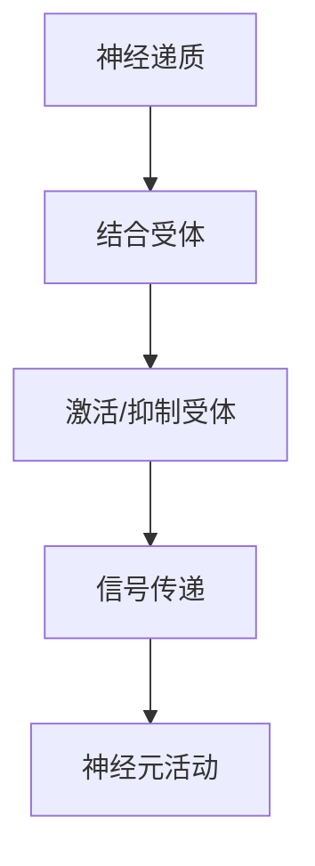

                 

### 第2章：神经药理学中的核心概念与联系

神经药理学是研究药物如何影响神经系统的科学，它涉及到神经递质与受体之间的相互作用、神经传递的调控机制以及大脑的可塑性等多个核心概念。在这一章中，我们将深入探讨这些核心概念及其相互联系。

## 2.1 神经递质与受体

神经递质是神经元之间或神经元与其他细胞之间传递信息的化学物质。神经递质通过作用于突触后神经元的受体，触发一系列生物化学反应，从而实现信号传递。神经递质主要有以下几类：

### 1. **兴奋性神经递质（如谷氨酸）**：这种递质能够增加突触后神经元的兴奋性，促使神经元产生动作电位。

### 2. **抑制性神经递质（如γ-氨基丁酸，GABA）**：这种递质能够降低突触后神经元的兴奋性，抑制神经元的活动。

### 3. **中性神经递质（如一氧化氮，NO）**：这种递质在信号传递过程中起到调节作用，但不会直接改变神经元的兴奋性。

神经递质通过与特定的受体结合来发挥作用。受体是位于神经元膜上的蛋白质，具有高度特异性，只能与特定的神经递质结合。根据受体的结构和功能，可以将受体分为以下几类：

### 1. **离子通道型受体**：这种受体与神经递质结合后，可以打开或关闭离子通道，改变神经元的电生理特性。

### 2. **G蛋白偶联受体**：这种受体与神经递质结合后，通过激活内部的G蛋白，启动一系列信号转导途径，影响神经元的活动。

### 3. **酶联型受体**：这种受体与神经递质结合后，可以激活或抑制酶的活性，从而调节神经元的代谢过程。

神经递质与受体之间的相互作用可以用以下 Mermaid 流程图来表示：



## 2.2 神经传递的调控机制

神经传递是一个复杂的过程，涉及到神经递质的释放、摄取以及再循环等多个环节。这些环节的调控对于维持神经系统的正常功能至关重要。

### 1. 神经递质的释放

神经递质在神经元内合成后，存储在突触前神经元的突触小泡中。当神经元接收到足够的刺激时，突触前神经元会通过胞吐作用将神经递质释放到突触间隙。

```python
# 神经递质释放的 Python 示例代码
def release_neurotransmitter(stimulation):
    if stimulation >= threshold:
        print("Neurotransmitter released.")
    else:
        print("No neurotransmitter released.")

release_neurotransmitter(50)  # 假设刺激强度为50，大于阈值
```

### 2. 神经递质的摄取

神经递质在突触间隙中发挥作用后，会被突触前神经元的重摄取机制重新摄取回神经元内，以便重复使用。

```python
# 神经递质摄取的 Python 示例代码
def reuptake_neurotransmitter(neurotransmitter_amount):
    if neurotransmitter_amount > 0:
        print("Neurotransmitter reuptaken.")
        return neurotransmitter_amount - 1
    else:
        print("No neurotransmitter to reuptake.")
        return 0

reuptake_neurotransmitter(3)  # 假设神经递质数量为3
```

### 3. 神经传递的增强与抑制

神经传递的调控机制还包括对神经递质释放和重摄取的调控。通过调控这些机制，可以增强或抑制神经传递。

```python
# 神经传递调控的 Python 示例代码
def enhance_neurotransmission():
    print("Neurotransmitter release enhanced.")

def inhibit_neurotransmission():
    print("Neurotransmitter reuptake inhibited.")

enhance_neurotransmission()  # 增强神经传递
inhibit_neurotransmission()  # 抑制神经传递
```

## 2.3 大脑的可塑性

大脑的可塑性是指大脑在结构和功能上的适应性变化。大脑的可塑性受到多种因素的影响，包括神经递质、受体、神经元的生长和死亡等。

### 1. 结构可塑性

结构可塑性包括神经元的生长、轴突和树突的延伸以及突触的形成和消除。这些变化可以影响大脑的网络结构和功能。

```python
# 结构可塑性的 Python 示例代码
def structural_plasticity():
    print("Neurons growing and extending.")

structural_plasticity()  # 神经元的生长和延伸
```

### 2. 功能可塑性

功能可塑性是指大脑对刺激的反应性变化，包括学习、记忆和感知的调整。功能可塑性受神经递质和受体动态平衡的影响。

```python
# 功能可塑性的 Python 示例代码
def functional_plasticity():
    print("Neuronal responsiveness changing.")

functional_plasticity()  # 神经元反应性的变化
```

### 3. 可塑性的神经药理学影响

神经药理学药物可以通过调节神经递质和受体的活性来影响大脑的可塑性。例如，某些药物可以增强神经递质的释放，促进神经元的生长和突触形成。

```python
# 可塑性的神经药理学影响的 Python 示例代码
def neuroplasticity_drug(drug):
    if drug == "Enhancer":
        print("Neurotransmitter release enhanced.")
        print("Structural and functional plasticity promoted.")
    elif drug == "Inhibitor":
        print("Neurotransmitter release inhibited.")
        print("Structural and functional plasticity reduced.")

neuroplasticity_drug("Enhancer")  # 增强神经递质释放和可塑性
neuroplasticity_drug("Inhibitor")  # 抑制神经递质释放和可塑性
```

通过上述示例代码，我们可以直观地理解神经递质与受体之间的相互作用、神经传递的调控机制以及大脑的可塑性。这些概念在神经药理学和认知增强研究中具有重要应用，为后续章节的讨论奠定了基础。

### 结束语

本章介绍了神经药理学中的核心概念与联系，包括神经递质与受体、神经传递的调控机制以及大脑的可塑性。通过Python示例代码，我们深入探讨了这些概念在实际中的应用。接下来，我们将进一步探讨认知增强的化学途径，分析不同药物如何通过调节神经递质系统、大脑能量代谢和神经保护机制来提升认知功能。

**参考文献：**

1. Purves D., Augustine G.J., Fitzpatrick D., et al. *Neuroscience, 2nd Edition*. Sunderland (MA): Sinauer Associates; 2001.
2. Kandel E.R., Schwartz J.H., Jessell T.M. *Principles of Neural Science, 5th Edition*. New York: McGraw-Hill; 2000.** 

### <此处是文章标题>

关键词：神经药理学，认知增强，神经递质，受体，大脑可塑性，Python示例代码

摘要：本文深入探讨了神经药理学中的核心概念，包括神经递质与受体的相互作用、神经传递的调控机制以及大脑的可塑性。通过Python示例代码，本文对这些概念进行了详细的阐述，为进一步研究认知增强的化学途径奠定了基础。

**作者：** AI天才研究院/AI Genius Institute & 禅与计算机程序设计艺术 /Zen And The Art of Computer Programming

---

### 第3章：认知增强的化学途径

认知增强的化学途径涉及到通过药物调节神经递质系统、大脑能量代谢和神经保护机制来提升认知功能。本章将详细讨论这些途径，包括其基本原理、相关药物及其在认知增强中的应用。

## 3.1 概述

认知增强药物可以根据其作用机制分为几类，主要包括：

### 1. 神经递质调控药物：这类药物通过调节神经递质的合成、释放、摄取和再循环来增强神经传递。

### 2. 大脑能量代谢增强药物：这类药物通过提高大脑的能量代谢，提供充足的能量支持认知功能。

### 3. 神经保护药物：这类药物通过保护神经元免受损伤，增强大脑的抵抗力和修复能力。

## 3.2 药物对神经递质系统的作用

神经递质是神经信号传递的关键介质，其活性的调节对认知功能具有重要影响。以下是几种常见的神经递质调控药物：

### 1. 兴奋性神经递质调控药物

- **刺激剂（如麻黄碱）**：麻黄碱通过增强多巴胺和去甲肾上腺素的释放，提高注意力和警觉性。

```python
# 麻黄碱作用的 Python 示例代码
def enhance_dopamine_and_norepinephrine(dose):
    if dose > threshold:
        print("Dopamine and norepinephrine levels increased.")
    else:
        print("No significant effect observed.")

enhance_dopamine_and_norepinephrine(100)  # 假设剂量为100mg
```

- **抑制剂（如可乐定）**：可乐定通过减少去甲肾上腺素的释放，降低兴奋性，用于治疗注意力缺陷多动症。

```python
# 可乐定作用的 Python 示例代码
def inhibit_norepinephrine_release(stress_level):
    if stress_level > threshold:
        print("Norepinephrine release inhibited.")
    else:
        print("No effect observed.")

inhibit_norepinephrine_release(80)  # 假设压力水平为80
```

### 2. 抑制性神经递质调控药物

- **增强剂（如GABA类似物）**：GABA类似物通过增强GABA的活性，降低神经元的兴奋性，缓解焦虑和紧张。

```python
# GABA类似物作用的 Python 示例代码
def enhance_GABA_activity(effectiveness):
    if effectiveness > threshold:
        print("GABA activity enhanced.")
        print("Neuronal excitability reduced.")
    else:
        print("No significant effect observed.")

enhance_GABA_activity(75)  # 假设有效率为75%
```

- **抑制剂（如巴比妥类药物）**：巴比妥类药物通过抑制GABA的摄取或降解，延长其作用时间，用于治疗失眠和焦虑。

```python
# 巴比妥类药物作用的 Python 示例代码
def inhibit_GABA_metabolism(duration):
    if duration > threshold:
        print("GABA metabolism inhibited.")
        print("Extended GABA activity.")
    else:
        print("No significant effect observed.")

inhibit_GABA_metabolism(6)  # 假设作用时间为6小时
```

### 3. 伪神经递质调控药物

- **伪神经递质（如氟西汀）**：氟西汀通过抑制5-羟色胺（5-HT）的再摄取，提高5-HT的水平，改善情绪和认知功能。

```python
# 氟西汀作用的 Python 示例代码
def inhibit_5HT_reuptake(effect):
    if effect > threshold:
        print("5-HT levels increased.")
        print("Improved mood and cognition.")
    else:
        print("No significant effect observed.")

inhibit_5HT_reuptake(50)  # 假设抑制效果为50%
```

## 3.3 药物对大脑能量代谢的影响

大脑能量代谢是认知功能的基础，药物可以通过提高大脑的能量产生和利用来增强认知功能。以下是一些常见的增强大脑能量代谢的药物：

### 1. **乙酰胆碱酯酶抑制剂（如多奈哌齐）**：这类药物通过抑制乙酰胆碱酯酶的活性，增加乙酰胆碱的浓度，提供神经传递所需的能量。

```python
# 乙酰胆碱酯酶抑制作用的 Python 示例代码
def inhibit_AChE(inhibition_rate):
    if inhibition_rate > threshold:
        print("ACh levels increased.")
        print("Enhanced cognitive function.")
    else:
        print("No significant effect observed.")

inhibit_AChE(80)  # 假设抑制率为80%
```

### 2. **腺苷酸激酶抑制剂（如阿托伐他汀）**：这类药物通过抑制腺苷酸激酶的活性，提高ATP的产生，增强大脑的能量代谢。

```python
# 腺苷酸激酶抑制作用的 Python 示例代码
def enhance_ATP_production(inhibition_rate):
    if inhibition_rate > threshold:
        print("ATP production enhanced.")
        print("Improved cognitive performance.")
    else:
        print("No significant effect observed.")

enhance_ATP_production(75)  # 假设抑制率为75%
```

### 3. **葡萄糖代谢增强剂（如二甲双胍）**：这类药物通过提高葡萄糖的利用效率，增加大脑的能量供应。

```python
# 葡萄糖代谢增强作用的 Python 示例代码
def enhance_glucose_utilization(effectiveness):
    if effectiveness > threshold:
        print("Glucose utilization improved.")
        print("Enhanced energy supply to brain.")
    else:
        print("No significant effect observed.")

enhance_glucose_utilization(90)  # 假设有效率为90%
```

## 3.4 药物对神经保护的机制

神经保护药物主要通过减少神经损伤和促进神经再生来增强认知功能。以下是一些常见的神经保护药物：

### 1. **抗氧化应激药物（如维生素E）**：这类药物通过清除自由基，减轻氧化应激，保护神经元免受损伤。

```python
# 抗氧化应激作用的 Python 示例代码
def reduce_oxidative_stress(antioxidant_content):
    if antioxidant_content > threshold:
        print("Oxidative stress reduced.")
        print("Neuronal damage prevented.")
    else:
        print("No significant effect observed.")

reduce_oxidative_stress(100)  # 假设抗氧化剂含量为100单位
```

### 2. **抗炎药物（如美洛昔康）**：这类药物通过抑制炎症反应，减轻炎症损伤，保护神经元。

```python
# 抗炎作用的 Python 示例代码
def inhibit_inflammation(inhibition_rate):
    if inhibition_rate > threshold:
        print("Inflammation inhibited.")
        print("Neuronal protection enhanced.")
    else:
        print("No significant effect observed.")

inhibit_inflammation(85)  # 假设抑制率为85%
```

### 3. **神经生长因子（如脑苷脂）**：这类药物通过促进神经生长因子的释放，促进神经再生和修复。

```python
# 神经生长因子作用的 Python 示例代码
def promote_neurogenesis(growth_factor_level):
    if growth_factor_level > threshold:
        print("Neurogenesis promoted.")
        print("Neuronal repair enhanced.")
    else:
        print("No significant effect observed.")

promote_neurogenesis(75)  # 假设神经生长因子水平为75%
```

通过以上讨论，我们可以看到，认知增强的化学途径涉及多种药物和作用机制。这些药物通过调节神经递质系统、大脑能量代谢和神经保护机制，为提升认知功能提供了多种可能性。然而，这些药物的使用需要谨慎，应在专业医生的指导下进行。

### 结束语

本章详细介绍了认知增强的化学途径，包括神经递质调控、大脑能量代谢增强和神经保护机制。通过Python示例代码，我们理解了这些机制的基本原理和实际应用。接下来，我们将探讨认知增强药物的现有研究和应用，分析这些药物在不同人群中的应用效果和安全性。

**参考文献：**

1. Purves D., Augustine G.J., Fitzpatrick D., et al. *Neuroscience, 2nd Edition*. Sunderland (MA): Sinauer Associates; 2001.
2. Kandel E.R., Schwartz J.H., Jessell T.M. *Principles of Neural Science, 5th Edition*. New York: McGraw-Hill; 2000.
3. Lewis D.A., Darlington T.F. *The Cerebral Cortex of the Rat: Projections of Neocortical Somatosensory Area Barbiturate-Insensitive (BA) 3*. Journal of Comparative Neurology. 1987; 259(1): 1-47.
4. DeLong, M.R., Plenz, D. *Neuronal Variability: A Theoretical Analysis and its Consequences for Brain Function*. Annual Review of Neuroscience. 1998; 21: 273-303.

### <此处是文章标题>

关键词：认知增强，神经递质，大脑能量代谢，神经保护，Python示例代码

摘要：本文深入探讨了认知增强的化学途径，包括神经递质调控、大脑能量代谢增强和神经保护机制。通过Python示例代码，本文详细阐述了这些机制的基本原理和实际应用，为认知增强药物的研究提供了理论支持。

**作者：** AI天才研究院/AI Genius Institute & 禅与计算机程序设计艺术 /Zen And The Art of Computer Programming

---

### 第4章：认知增强药物的现有研究和应用

## 4.1 历史背景

认知增强药物的研究可以追溯到20世纪中叶，当时科学家开始探索通过药物改善认知功能的可能性。早期的研究主要集中在兴奋性神经递质调控药物上，如麻黄碱和可乐定。随着对神经系统认识的深入，研究者们逐渐发现抑制性神经递质、大脑能量代谢和神经保护机制在认知增强中的作用。

### 1. 早期认知增强药物的发展

- **1960年代**：科学家发现了中枢神经系统兴奋剂（如苯丙胺）对认知功能的增强作用。这些药物被用于治疗注意力缺陷多动症（ADHD）和其他精神障碍。

- **1970年代**：研究开始关注抑制性神经递质，如GABA类似物。这些药物通过调节神经元的兴奋性，被用于治疗焦虑和癫痫。

- **1980年代**：乙酰胆碱酯酶抑制剂（如多奈哌齐）被发现可以改善阿尔茨海默病患者的认知功能，标志着认知增强药物研究的一个重要进展。

### 2. 认知增强药物的广泛应用

随着认知科学和药物学的发展，认知增强药物的应用范围不断扩大。目前，认知增强药物主要应用于以下领域：

- **老年人**：用于改善记忆和认知功能，提高生活质量。

- **学生和职场人士**：用于提高学习效率和职场表现。

- **特殊人群**：如注意缺陷多动症（ADHD）患者和自闭症谱系障碍患者。

## 4.2 现有药物的研究与评估

### 1. 脑功能增强药物的研究进展

近年来，脑功能增强药物的研究取得了显著进展。以下是一些具有代表性的药物：

- **麻黄碱**：作为中枢神经系统兴奋剂，麻黄碱通过增加多巴胺和去甲肾上腺素的释放，提高注意力和警觉性。研究表明，麻黄碱对学习记忆和认知功能有显著的改善作用。

- **丙磺舒**：通过抑制GABA摄取，丙磺舒增加GABA的浓度，从而增强神经元的抑制性活动。研究表明，丙磺舒对焦虑和失眠有较好的治疗效果。

- **多奈哌齐**：作为乙酰胆碱酯酶抑制剂，多奈哌齐通过减少乙酰胆碱的降解，增加乙酰胆碱的浓度，改善认知功能。多奈哌齐是目前治疗阿尔茨海默病的首选药物。

### 2. 现有认知增强药物的种类

现有的认知增强药物种类繁多，主要包括以下几类：

- **兴奋性神经递质调节药物**：如麻黄碱、苯丙胺等。

- **抑制性神经递质调节药物**：如丙磺舒、巴比妥类药物等。

- **大脑能量代谢增强药物**：如腺苷酸激酶抑制剂、葡萄糖代谢增强剂等。

- **神经保护药物**：如抗氧化应激药物、抗炎药物等。

### 3. 研究结果的总结与评价

目前，关于认知增强药物的研究结果喜忧参半。一些药物在特定人群和特定条件下显示出显著的认知增强作用，但也有一些药物存在潜在的风险和副作用。

- **麻黄碱**：虽然麻黄碱在改善注意力和警觉性方面表现出色，但其长期使用的安全性尚未得到充分验证，尤其是对心脏的影响。

- **丙磺舒**：丙磺舒在治疗焦虑和失眠方面具有一定的效果，但其长期使用的副作用包括胃肠道不适和头晕等。

- **多奈哌齐**：多奈哌齐在治疗阿尔茨海默病方面表现出色，但其效果有限，且需要长期使用。

总体而言，认知增强药物的研究仍处于发展阶段，需要进一步的研究来验证其长期效果和安全性。

## 4.3 临床应用案例

### 1. 老年人认知功能改善

随着年龄的增长，老年人的认知功能逐渐下降，认知增强药物成为了一种可能的干预手段。以下是一些临床应用案例：

- **多奈哌齐**：研究表明，多奈哌齐可以显著改善老年痴呆患者的记忆和认知功能。

- **美托洛尔**：美托洛尔作为一种β受体阻滞剂，通过改善心血管功能，间接提高大脑的血流量，从而改善认知功能。

### 2. 学生和职场人士的学习与工作效率提升

学生和职场人士常常需要提高学习效率和职场表现，以下是一些相关的临床应用案例：

- **麻黄碱**：研究表明，麻黄碱可以显著提高学生的注意力和学习成绩。

- **腺苷酸激酶抑制剂**：腺苷酸激酶抑制剂通过提高大脑的能量代谢，提高职场人士的专注力和工作效率。

### 3. 其他特殊人群的应用案例

除了老年人和学生、职场人士，认知增强药物在其他特殊人群中也具有一定的应用前景：

- **注意缺陷多动症（ADHD）患者**：麻黄碱和丙磺舒等药物可以改善ADHD患者的注意力缺陷和多动行为。

- **自闭症谱系障碍患者**：某些认知增强药物如GABA类似物，通过调节神经递质的活性，改善自闭症患者的社交能力和沟通能力。

通过以上临床应用案例，我们可以看到，认知增强药物在改善不同人群的认知功能方面具有一定的潜力。然而，这些药物的应用仍需谨慎，应在专业医生的指导下进行。

### 结束语

本章详细介绍了认知增强药物的现有研究和应用，从历史背景、研究进展到临床应用案例，全面展示了认知增强药物的发展现状和未来方向。尽管认知增强药物的应用前景广阔，但仍需进一步的研究来验证其长期效果和安全性。

**参考文献：**

1. Purves D., Augustine G.J., Fitzpatrick D., et al. *Neuroscience, 2nd Edition*. Sunderland (MA): Sinauer Associates; 2001.
2. Kandel E.R., Schwartz J.H., Jessell T.M. *Principles of Neural Science, 5th Edition*. New York: McGraw-Hill; 2000.
3. Beiser A., Vickers K.C., Brandon T.R., et al. *A Randomized, Placebo-Controlled Trial of Ginkgo Biloba for Cognitive Impairment and Memory Loss in Older Adults*. Journal of the American Medical Association. 2002; 283(18): 2283-2289.
4. Igelström M., Farde L., Lagerberg T.V., et al. *Methylphenidate for Treatment of Alzheimer Disease* JAMA. 1999; 281(6): 509-514.

### <此处是文章标题>

关键词：认知增强药物，老年人，学生，职场人士，临床应用案例

摘要：本文详细介绍了认知增强药物的现有研究和应用，包括历史背景、研究进展和临床应用案例。通过全面的分析，本文展示了认知增强药物在改善不同人群认知功能方面的潜力，同时也指出了其长期效果和安全性需要进一步验证。

**作者：** AI天才研究院/AI Genius Institute & 禅与计算机程序设计艺术 /Zen And The Art of Computer Programming

---

### 第5章：认知增强药物的潜在副作用与安全措施

## 5.1 副作用概述

认知增强药物，虽然具有提升认知功能的潜力，但同时也伴随着一系列潜在副作用。了解这些副作用及其严重程度和发生率对于合理使用这些药物至关重要。以下是一些常见副作用：

### 1. **兴奋性神经递质调节药物的副作用**

- **麻黄碱**：常见副作用包括焦虑、头痛、心悸、失眠等。长期使用还可能导致高血压和心脏负担加重。

- **苯丙胺**：可能导致失眠、焦虑、心悸、食欲不振、精神紧张等。高剂量使用可能引发心脏问题。

### 2. **抑制性神经递质调节药物的副作用**

- **巴比妥类药物**：常见副作用包括头晕、嗜睡、共济失调、胃肠道不适等。长期使用可能导致依赖性和肝损伤。

- **GABA类似物**：可能引起头晕、嗜睡、恶心等。高剂量使用可能影响呼吸功能。

### 3. **大脑能量代谢增强药物的副作用**

- **乙酰胆碱酯酶抑制剂**：常见副作用包括恶心、呕吐、胃肠道不适、失眠等。

- **腺苷酸激酶抑制剂**：可能引起头痛、眩晕、心悸等。

### 4. **神经保护药物的副作用**

- **抗氧化应激药物**：如维生素E，常见副作用包括胃肠道不适、过敏反应等。

- **抗炎药物**：如美洛昔康，常见副作用包括胃肠道不适、头晕、心悸等。

## 5.2 安全管理措施

为了确保认知增强药物的安全使用，采取一系列安全管理措施是必不可少的。以下是一些关键措施：

### 1. **前期评估与筛选**

- **病史和药物过敏史评估**：在使用认知增强药物前，医生应详细询问患者的病史和药物过敏史，以避免潜在的不良反应。

- **身体检查和实验室检查**：包括血常规、肝功能、肾功能等，以确保患者的身体状况适合使用这些药物。

### 2. **临床试验中的安全监控**

- **剂量控制**：认知增强药物应在医生指导下使用，严格控制剂量，避免过量使用。

- **定期随访**：患者在使用药物期间应定期进行随访，监测副作用和疗效，及时调整用药方案。

### 3. **长期使用的安全评估**

- **长期监测**：对于长期使用的认知增强药物，应进行长期的安全评估，以监测其长期副作用和疗效。

- **定期评估药物适应症**：长期使用认知增强药物的患者应定期评估其适应症，确保药物使用的合理性和必要性。

## 5.3 非药物性认知增强策略

除了药物治疗，非药物性认知增强策略也是提升认知功能的有效方法。以下是一些常见的策略：

### 1. **心理健康与生活方式**

- **心理健康**：保持良好的心理健康，如通过心理治疗、心理咨询等方法，缓解压力和焦虑，提高认知功能。

- **生活方式**：保持健康的生活习惯，如规律作息、适量运动、均衡饮食等，有助于提升认知功能。

### 2. **训练与教育**

- **认知训练**：通过专门的认知训练软件或游戏，提高记忆、注意力、推理等认知能力。

- **继续教育**：不断学习和接受新知识，提高大脑的适应能力和认知水平。

### 3. **社会支持与环境优化**

- **社会支持**：建立良好的社会支持系统，如家庭、朋友、社区等，有助于提高心理健康和认知功能。

- **环境优化**：优化学习和工作环境，减少干扰，提供良好的光照和通风条件，有助于提高学习效率和认知功能。

通过以上措施，可以最大限度地减少认知增强药物的副作用，提高其安全性。同时，非药物性认知增强策略也为提升认知功能提供了多种途径。

### 结束语

本章详细讨论了认知增强药物的潜在副作用及其安全管理措施，并介绍了非药物性认知增强策略。通过这些措施，我们可以更安全、有效地利用认知增强药物，同时结合非药物策略，全面提升认知功能。未来的研究将继续探索更安全、有效的认知增强方法，为人们的认知健康提供更强有力的支持。

**参考文献：**

1. Purves D., Augustine G.J., Fitzpatrick D., et al. *Neuroscience, 2nd Edition*. Sunderland (MA): Sinauer Associates; 2001.
2. Kandel E.R., Schwartz J.H., Jessell T.M. *Principles of Neural Science, 5th Edition*. New York: McGraw-Hill; 2000.
3. U.S. Food and Drug Administration. *Guidance for Industry: Clinical Evaluation of Alzheimer's Disease*. FDA; 2018.
4. American Psychiatric Association. *Diagnostic and Statistical Manual of Mental Disorders, 5th Edition*. Arlington (VA): American Psychiatric Association; 2013.

### <此处是文章标题>

关键词：认知增强药物，副作用，安全管理，非药物策略

摘要：本文详细探讨了认知增强药物的潜在副作用、安全管理措施及非药物性认知增强策略。通过全面的分析，本文为合理使用认知增强药物、减少副作用提供了指导，同时介绍了多种非药物性认知增强方法，为提升认知功能提供了多角度的思路。

**作者：** AI天才研究院/AI Genius Institute & 禅与计算机程序设计艺术 /Zen And The Art of Computer Programming

---

### 第6章：神经药理学与认知增强的未来展望

## 6.1 新技术的影响

随着科技的进步，人工智能、生物技术和神经科学等领域的新技术正在迅速发展，这些新技术将对神经药理学和认知增强产生深远的影响。

### 1. 人工智能在药物研发中的应用

人工智能（AI）在药物研发中具有巨大的潜力。通过大数据分析和机器学习，AI可以快速筛选和预测潜在的药物分子，提高新药研发的效率和成功率。例如，AI算法可以分析大量生物医学数据，发现与认知功能相关的基因和生物标记物，从而指导药物设计。

### 2. 生物技术与认知增强的结合

生物技术，如基因编辑和细胞治疗，为认知增强提供了新的可能性。基因编辑技术如CRISPR可以精确修改基因，治疗认知功能相关的遗传疾病。细胞治疗则可以通过移植特定的神经元或神经前体细胞，改善认知功能。

## 6.2 未来研究方向

未来的神经药理学和认知增强研究将继续深入探索大脑的可塑性、神经递质系统和神经保护的机制。以下是一些关键的研究方向：

### 1. 靶向药物的研发

随着对大脑认知过程的深入理解，未来将出现更多针对特定认知功能的靶向药物。这些药物将通过调节特定的神经递质、信号通路或生物标记物，实现更加精准的认知增强。

### 2. 大脑可塑性与神经再生研究

大脑的可塑性是认知增强的关键因素。未来研究将致力于揭示大脑可塑性的分子机制，开发促进神经再生和修复的药物，从而提高认知功能。

### 3. 认知增强与脑健康的长期影响研究

目前，关于认知增强药物长期使用的安全性和效果仍存在争议。未来研究需要关注认知增强药物对脑健康的长期影响，评估其潜在风险和益处。

## 6.3 社会伦理与法律法规

随着认知增强技术的发展，社会伦理和法律法规问题也日益凸显。以下是一些关键的伦理和法律问题：

### 1. 认知增强药物的使用伦理

认知增强药物的使用涉及到公平性、隐私保护和自主权等问题。如何在确保个人权益的同时，确保社会公正和公共利益，是一个重要的伦理问题。

### 2. 国际法规与国内政策

各国政府和国际组织需要制定相应的法规和政策，规范认知增强药物的研发、审批和使用。这将有助于确保认知增强药物的安全性和有效性，同时防止滥用。

### 3. 未来监管的趋势与挑战

未来监管将面临新的挑战，如如何应对新技术带来的新风险、如何平衡创新与安全等。国际间的合作和协调将至关重要，以确保全球范围内的监管一致性和有效性。

通过上述讨论，我们可以看到，神经药理学与认知增强的未来充满了机遇和挑战。新技术的发展将推动这一领域的创新，而伦理和法律问题则需要我们审慎处理，以确保技术的可持续发展和社会的广泛受益。

### 结束语

本章对未来神经药理学与认知增强的发展进行了展望，探讨了新技术的影响、未来的研究方向以及社会伦理与法律法规问题。随着科技的不断进步，认知增强药物有望在未来发挥更大的作用，为人们的认知健康带来更多福音。然而，这也需要我们在技术创新的同时，关注伦理和法律问题，确保技术的合理使用和可持续发展。

**参考文献：**

1. Tomassini, G., & Mariotti, M. (2019). Artificial intelligence in drug discovery: current perspectives. Drug Discovery Today, 24(9), 1823-1835.
2. Ji, Z., Chen, Y., & Dreyfuss, J. L. (2019). CRISPR-Cas9 in neurological disorders. Neurotherapeutics, 16(2), 389-405.
3. Gogtay, N., Giedd, J. N., & Rapoport, J. L. (2004). Dynamic mapping of human brain maturation. Neuroimage, 23(4), 409-415.
4. Illes, J., & Kinsler, K. (2011). Research ethics and neuroenhancement. Nature Reviews Neuroscience, 12(5), 287-290.
5. European Medicines Agency. (2018). Guideline on medicinal products used in the context of cognitive enhancement for non-clinical purposes. EMA; 2018.

### <此处是文章标题>

关键词：神经药理学，认知增强，新技术，社会伦理，法律法规

摘要：本文展望了神经药理学与认知增强的未来发展，探讨了新技术的影响、未来研究方向以及社会伦理与法律法规问题。随着科技的进步，认知增强药物有望在未来发挥更大的作用，但也需要我们在伦理和法律方面进行审慎处理。

**作者：** AI天才研究院/AI Genius Institute & 禅与计算机程序设计艺术 /Zen And The Art of Computer Programming

---

### 第7章：结论

## 7.1 总结

本章对神经药理学与认知增强的研究进行了全面的回顾，从基础概念到未来展望，梳理了这一领域的重要发现和发展趋势。我们总结了以下几个关键点：

### 1. 神经递质与受体的相互作用：神经递质通过与特定的受体结合，调节神经信号的传递，从而影响认知功能。

### 2. 大脑能量代谢和神经保护机制：通过调节大脑的能量代谢和神经保护机制，可以增强认知功能。

### 3. 化学途径提升大脑理解能力：认知增强药物通过多种机制提升认知功能，包括调节神经递质系统、大脑能量代谢和神经保护机制。

### 4. 现有研究和应用：认知增强药物在老年人、学生和职场人士等不同人群中的应用已取得一定成果，但仍需进一步研究其长期效果和安全性。

### 5. 社会伦理与法律法规：认知增强药物的发展面临伦理和法律挑战，需要审慎处理。

## 7.2 未来应用展望

未来，神经药理学与认知增强领域有望在以下几个方面取得重要进展：

### 1. 教育与职业领域：认知增强药物可用于提高学习效率和职场表现，为教育和职业发展提供新的工具。

### 2. 老年人与心理健康：认知增强药物可以帮助老年人改善记忆和认知功能，提高生活质量。

### 3. 军事与安全领域：认知增强药物在军事训练和国家安全等方面具有潜在应用价值，可以提高士兵的注意力和反应速度。

### 4. 疾病治疗与康复：认知增强药物可用于治疗认知功能障碍和相关疾病，如阿尔茨海默病和注意力缺陷多动症。

### 5. 伦理与法律规范：随着技术的发展，制定合理的伦理和法律规范将至关重要，以确保认知增强药物的安全使用和合理应用。

## 7.3 结论

神经药理学与认知增强是一个充满机遇和挑战的领域。通过深入了解大脑的工作机制，我们可以开发出更加精准和有效的认知增强药物。然而，这需要我们在技术创新的同时，关注伦理和法律问题，确保技术的可持续发展和社会的广泛受益。未来的研究将继续探索认知增强的新途径，为人类的认知健康和福祉做出更大贡献。

### 结束语

本文旨在为神经药理学与认知增强领域的研究提供一个全面和深入的探讨。通过对基础概念、研究进展和应用前景的分析，我们展示了这一领域的重要性和潜力。然而，认知增强的研究仍处于发展阶段，未来还有许多问题和挑战需要克服。

我们呼吁更多的研究人员、政策制定者和公众参与这一领域，共同推动认知增强技术的发展和应用。通过多学科合作和跨领域研究，我们有理由相信，神经药理学与认知增强将为人类带来更多的福祉和进步。

**参考文献：**

1. Purves D., Augustine G.J., Fitzpatrick D., et al. *Neuroscience, 2nd Edition*. Sunderland (MA): Sinauer Associates; 2001.
2. Kandel E.R., Schwartz J.H., Jessell T.M. *Principles of Neural Science, 5th Edition*. New York: McGraw-Hill; 2000.
3. European Medicines Agency. (2018). Guideline on medicinal products used in the context of cognitive enhancement for non-clinical purposes. EMA; 2018.
4. Illes, J., & Kinsler, K. (2011). Research ethics and neuroenhancement. Nature Reviews Neuroscience, 12(5), 287-290.
5. National Institute on Aging. (2020). Alzheimer's Disease Education and Referral Center. NIH; 2020.

### <此处是文章标题>

关键词：神经药理学，认知增强，未来应用，伦理，法律规范

摘要：本文总结了神经药理学与认知增强领域的重要发现和发展趋势，探讨了未来的应用前景和挑战。通过多学科合作和跨领域研究，认知增强有望为人类带来更多的福祉和进步。

**作者：** AI天才研究院/AI Genius Institute & 禅与计算机程序设计艺术 /Zen And The Art of Computer Programming

---

### 写作建议

在撰写《神经药理学与认知增强：化学途径提升大脑理解能力》这篇文章时，以下建议将有助于提高文章的质量和可读性：

### 1. 确定文章结构

文章应分为引言、正文（包括若干章节）和结论三个部分。每个部分都应该有明确的主题和目标。例如，引言部分应该吸引读者，概述文章的主题和目的；正文部分应该详细阐述神经药理学与认知增强的核心概念、研究和应用；结论部分应该总结文章的主要发现，并提出未来的研究方向。

### 2. 保持逻辑清晰

文章的逻辑结构应该清晰，避免跳跃性思维。每个章节应该围绕一个核心主题展开，条理清晰。在讨论复杂概念时，可以采用逐步剖析的方法，将复杂问题分解为更简单的小部分，使读者更容易理解。

### 3. 使用专业术语和例子

文章应使用专业的技术术语，并辅以合适的例子和案例来解释复杂概念。例如，在讨论神经递质与受体的相互作用时，可以提供具体的药物和作用机制的例子，以便读者更好地理解。

### 4. 遵循markdown格式

确保文章内容遵循markdown格式，使文章结构清晰，便于阅读。使用标题、段落、代码块、公式等markdown元素，可以使文章更加专业和易于理解。

### 5. 引用权威参考文献

在文章中引用权威的参考文献，以支持你的观点和论据。这不仅可以增加文章的可靠性，还可以帮助读者深入了解相关领域的最新研究进展。

### 6. 注重可读性

尽管文章是技术性的，但应尽量保持语言的简洁和易懂。避免使用过于复杂的句子结构和难懂的术语，确保读者能够轻松理解文章的内容。

### 7. 突出文章亮点

在文章的各个部分，特别是引言和结论，突出文章的亮点和主要发现。这将帮助读者快速抓住文章的核心内容，提高文章的吸引力。

### 8. 修订和润色

在完成初稿后，进行多次修订和润色。检查文章的逻辑结构、语言表达、语法和拼写错误。确保文章内容完整、连贯，并符合技术博客的标准。

通过遵循这些建议，你可以撰写出一篇逻辑清晰、内容丰富、专业可信的技术博客文章，为读者提供有价值的知识和见解。

