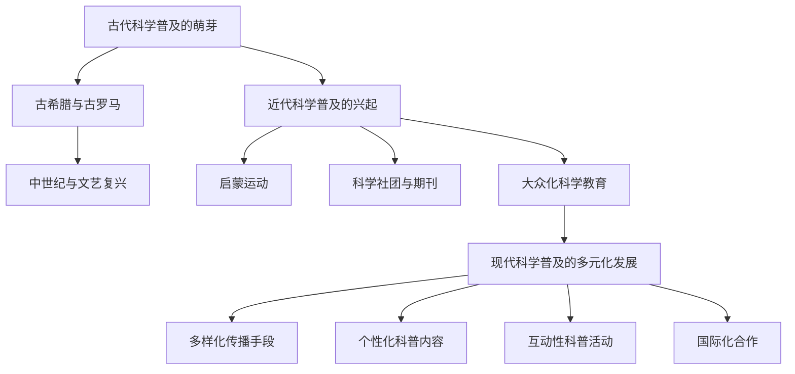

                 

# 《科学普及对公众理解世界的影响》

## 关键词
科学普及，公众理解，教育，传播，影响，社会效益

## 摘要
本文从科学普及的定义和重要性出发，详细探讨了科学普及的历史发展、方法与手段、效果与影响，以及公众科学素养的提升策略。通过具体案例研究和未来趋势分析，本文揭示了科学普及在提升公众理解世界、促进科技创新和社会发展中的关键作用，并提出了科学普及的挑战与对策。

## 目录

## 第1章 概述与引言

### 第1.1节 科学普及的概念

科学普及是指通过各种形式和手段，将科学知识、科学方法和科学思想传播给普通大众，以提高公众的科学素养，促进社会进步和科技创新的过程。科学普及的目标是使公众能够理解科学、关注科学、参与科学，并在此基础上形成科学的态度和行为。

科学普及的定义可以从以下几个方面进行阐述：

- **传播科学知识**：科学普及的首要任务是向公众传播科学知识，帮助他们了解自然现象、社会现象和技术发展的原理。

- **普及科学方法**：科学普及不仅要传授知识，还要教授科学方法，包括观察、实验、推理、验证等，使公众具备基本的科学思维能力。

- **传播科学思想**：科学普及还应当传播科学思想，如辩证唯物主义世界观、创新精神、批判思维等，引导公众形成科学的世界观和价值观。

### 第1.2节 科学普及的重要性

科学普及对于个人和社会具有重要意义，具体体现在以下几个方面：

- **提升公众科学素养**：科学普及有助于提高公众的科学素养，使人们能够更好地理解科学，科学地认识世界。

- **促进科技创新**：科学普及可以激发公众的创新意识和创新能力，为科技创新提供强大的社会支持和人才储备。

- **推动社会进步**：科学普及有助于提高公众的科学素质，促进社会文明进步，推动社会可持续发展。

- **加强国家软实力**：科学普及有助于提高国家的国际影响力，增强国家的文化软实力。

### 第1.3节 科学普及的目标与意义

科学普及的目标主要包括以下几个方面：

- **普及科学知识**：使公众掌握基本科学知识，提高全民科学素质。

- **培养科学兴趣**：激发公众对科学的兴趣和好奇心，促进科学探索和创新。

- **提高科学素养**：培养公众的科学思维能力，使人们能够运用科学方法分析和解决问题。

- **促进科技应用**：推动科技成果的转化和应用，提高科技对经济和社会发展的贡献率。

科学普及的意义在于：

- **促进科学教育**：科学普及是科学教育的重要组成部分，有助于提高科学教育的普及程度和质量。

- **增强社会凝聚力**：科学普及可以增强公众对科学的认同感和归属感，提高社会凝聚力。

- **提升公民素质**：科学普及有助于提高公民的科学素质，促进社会文明进步。

## 第2章 科学普及的历史与发展

### 第2.1节 古代科学普及的萌芽

科学普及的历史可以追溯到古代。在古代，科学知识主要掌握在少数精英阶层手中，普通大众对科学的认知程度较低。然而，随着科学知识的逐渐积累和传播，科学普及的萌芽开始出现。

- **古希腊与古罗马**：古希腊和古罗马时期，科学家和哲学家通过著作和演讲传播科学知识，如亚里士多德的著作《自然史》、古罗马的医学著作等。

- **中世纪与文艺复兴**：中世纪时期，科学知识的发展受到一定程度限制，但文艺复兴时期，科学知识开始重新兴起，科学普及的萌芽逐渐显现。

### 第2.2节 近代科学普及的兴起

近代科学普及的兴起主要发生在18世纪末至19世纪初的启蒙运动时期。这一时期，科学家、哲学家和思想家积极推动科学普及，使科学知识逐渐传播到更广泛的公众中。

- **启蒙运动**：启蒙运动思想家如伏尔泰、卢梭等人倡导科学精神，推动科学知识的普及。

- **科学社团与期刊**：18世纪末至19世纪初，各类科学社团和期刊纷纷涌现，如英国皇家学会、法国科学院等，这些机构致力于传播科学知识。

- **大众化科学教育**：随着工业革命的发展，科学教育开始向大众化转变，科学知识逐渐普及到普通民众中。

### 第2.3节 现代科学普及的多元化发展

现代科学普及经历了多元化发展，形式和手段日益丰富。现代科学普及的特点主要包括：

- **多样化传播手段**：现代科学普及利用电视、广播、互联网等多样化的传播手段，使科学知识传播更加广泛和快捷。

- **个性化科普内容**：现代科学普及注重针对不同受众的需求，提供个性化的科普内容，如科普文章、科普节目、科普游戏等。

- **互动性科普活动**：现代科学普及活动更加注重互动性，通过展览、讲座、实验等互动形式，提高公众的参与度和学习效果。

- **国际化合作**：现代科学普及在国际范围内开展合作，促进科学知识的全球传播。

## 第3章 科学普及的方法与手段

### 第3.1节 科普文章与书籍

科普文章和书籍是科学普及的重要手段之一。通过文字形式，科普文章和书籍能够深入浅出地介绍科学知识，使公众更好地理解科学。

- **科普文章**：科普文章通常以短小精悍、通俗易懂为特点，通过生动的案例和简单的语言，将复杂的科学原理讲解给公众。

- **科普书籍**：科普书籍范围广泛，从入门级到高级别，涉及各个学科领域，适合不同层次的读者。

### 第3.2节 科学展览与博物馆

科学展览和博物馆是科学普及的重要场所。通过实物展示、互动体验等方式，科学展览和博物馆能够直观地传播科学知识，激发公众对科学的兴趣。

- **科学展览**：科学展览通常以主题展览的形式呈现，通过展品、模型、图片等展示科学知识。

- **科学博物馆**：科学博物馆是科学普及的重要基地，通过常设展览、临时展览、科学实验等，向公众传播科学知识。

### 第3.3节 科学讲座与演讲

科学讲座和演讲是科学普及的重要形式之一。通过专业的科学家和科普工作者的讲解，科学讲座和演讲能够深入浅出地传播科学知识。

- **科学讲座**：科学讲座通常在大学、科研机构、企事业单位等场所举行，邀请专业科学家进行讲解。

- **科普演讲**：科普演讲通常以通俗易懂的语言，向公众传播科学知识，激发公众对科学的兴趣。

### 第3.4节 电视、广播与网络科普

电视、广播和网络科普是现代科学普及的重要手段。通过电视节目、广播节目和网络平台，科学知识能够快速传播到公众中。

- **电视科普节目**：电视科普节目以生动、直观的方式传播科学知识，如《探索发现》、《走近科学》等。

- **广播科普节目**：广播科普节目以声音的形式传播科学知识，如《科普大求真》、《科普知识讲座》等。

- **网络科普平台**：网络科普平台如微信公众号、微博、抖音等，通过图文、视频等多种形式传播科学知识。

## 第4章 科学普及的效果与影响

### 第4.1节 提升公众科学认知

科学普及对公众科学认知的提升具有显著效果。通过科学普及，公众能够了解科学知识，掌握科学方法，提高科学素养。

- **科学知识的普及**：科学普及使公众掌握基本科学知识，了解自然现象、社会现象和科技发展的原理。

- **科学方法的掌握**：科学普及教授公众科学方法，如观察、实验、推理、验证等，提高公众的科学思维能力。

- **科学态度的塑造**：科学普及有助于培养公众的科学态度，如辩证唯物主义世界观、创新精神、批判思维等。

### 第4.2节 影响公众科学态度

科学普及对公众科学态度的影响深刻。通过科学普及，公众能够形成科学的态度和行为，提高对科学的认同感和参与度。

- **科学认同感的增强**：科学普及使公众更加认同科学，相信科学的力量，提高科学的社会地位。

- **科学参与度的提升**：科学普及激发公众对科学的兴趣和好奇心，提高公众参与科学活动的积极性。

- **科学批判精神的培养**：科学普及有助于培养公众的科学批判精神，提高公众对伪科学和迷信的辨识能力。

### 第4.3节 改变公众科学行为

科学普及对公众科学行为具有显著的影响。通过科学普及，公众能够改变科学行为，形成科学的生活方式。

- **科学行为的普及**：科学普及使公众掌握科学行为，如安全用电、科学用药、环保行为等，提高公众的生活质量。

- **科学行为的引导**：科学普及引导公众形成科学的行为习惯，如健康生活方式、节约能源等，促进社会可持续发展。

- **科学行为的改进**：科学普及有助于发现和纠正公众的不良科学行为，如错误用药、迷信行为等，提高公众的科学素养。

## 第5章 公众科学素养的提升

### 第5.1节 科学素养的概念与构成

科学素养是指个体对科学知识的理解、科学方法的掌握、科学态度的形成以及科学行为的实施等方面的综合素质。科学素养的构成主要包括以下几个方面：

- **科学知识**：指个体对科学概念、原理、方法等方面的理解。

- **科学方法**：指个体掌握和运用科学方法进行观察、实验、推理、验证等的能力。

- **科学态度**：指个体对科学的认同感、批判精神、创新意识等。

- **科学行为**：指个体在日常生活和工作中运用科学知识、科学方法、科学态度的行为。

### 第5.2节 提升科学素养的策略

提升公众科学素养的策略主要包括以下几个方面：

- **加强科学教育**：通过学校教育、职业教育、继续教育等途径，加强科学教育，提高公众的科学素养。

- **开展科普活动**：通过科普讲座、展览、实验等活动，开展科学普及，提高公众的科学知识水平。

- **利用媒体传播**：利用电视、广播、互联网等媒体，传播科学知识，提高公众的科学认知。

- **强化政策支持**：制定科学普及政策，加大科普经费投入，为科学普及提供政策保障。

### 第5.3节 教育体系中的科学普及

教育体系是科学普及的重要阵地。在教育体系中，科学普及可以通过以下方式实现：

- **课程设置**：将科学知识纳入课程体系，提高学生的科学素养。

- **教学方式**：采用互动式、探究式教学方式，提高学生的科学思维能力。

- **课外活动**：组织科学实验、科技竞赛等活动，激发学生的科学兴趣。

- **教师培训**：加强教师科学素养培训，提高科学教育的质量。

## 第6章 案例研究

### 第6.1节 案例一：XX国家的科学普及实践

以XX国家的科学普及实践为例，分析科学普及在实践中的应用与效果。

- **背景介绍**：介绍XX国家的科学普及背景，如政策、教育体系、科技发展水平等。

- **具体措施**：分析XX国家在科学普及方面的具体措施，如科普活动、教育改革、政策支持等。

- **效果评估**：评估XX国家科学普及实践的效果，如公众科学素养提升、科技创新促进、社会效益等。

### 第6.2节 案例二：XX主题的科学普及活动

以XX主题的科学普及活动为例，分析科学普及活动的具体实施与效果。

- **主题选择**：介绍XX主题的科学普及活动选择的原因和目标。

- **活动形式**：分析XX主题的科学普及活动形式，如讲座、展览、实验等。

- **效果评估**：评估XX主题的科学普及活动的效果，如公众参与度、知识传播效果、社会影响等。

### 第6.3节 案例三：XX领域的科普创新

以XX领域的科普创新为例，分析科普创新在实践中的应用与效果。

- **背景介绍**：介绍XX领域的科普创新背景，如科技发展趋势、市场需求等。

- **创新内容**：分析XX领域的科普创新内容，如科普产品、科普应用等。

- **效果评估**：评估XX领域的科普创新的效果，如用户满意度、知识传播效果、市场竞争力等。

## 第7章 科学普及的挑战与未来趋势

### 第7.1节 挑战与问题分析

科学普及在发展过程中面临一系列挑战和问题。

- **科学素养差异**：不同地区、不同群体的科学素养存在显著差异，科学普及需针对不同受众制定策略。

- **科普资源不足**：科普资源不足，如资金、人力、物力等，影响科学普及的广度和深度。

- **信息过载**：随着信息技术的快速发展，公众面临信息过载问题，科学普及需提高信息的针对性和有效性。

- **伪科学泛滥**：伪科学和迷信现象时有发生，科学普及需提高公众的科学批判能力。

### 第7.2节 未来发展趋势展望

未来科学普及将呈现以下发展趋势：

- **数字化科普**：随着互联网技术的普及，数字化科普将成为科学普及的主要形式。

- **个性化科普**：根据公众需求和兴趣，提供个性化的科普内容，提高科普效果。

- **跨界合作**：加强科普与教育、文化、科技等领域的跨界合作，促进科普资源的整合和共享。

- **国际化科普**：加强国际科普合作，推动科学知识的全球传播。

### 第7.3节 科学普及的策略与建议

为应对科学普及的挑战和问题，提出以下策略和建议：

- **加强政策支持**：制定科学普及政策，加大科普经费投入，为科学普及提供政策保障。

- **优化科普资源**：整合科普资源，提高科普资源的利用效率，满足不同受众的需求。

- **创新科普形式**：利用现代科技手段，创新科普形式，提高科普的趣味性和互动性。

- **培养科普人才**：加强科普人才培养，提高科普工作者的专业水平。

## 结论

科学普及在提升公众理解世界、促进科技创新和社会发展中具有重要作用。通过科学普及，公众能够更好地理解科学，科学地认识世界，提高科学素养。未来，科学普及将继续发展，面临新的机遇和挑战。我们应加强政策支持，优化科普资源，创新科普形式，培养科普人才，推动科学普及事业不断发展。

## 作者信息
作者：AI天才研究院/AI Genius Institute & 禅与计算机程序设计艺术 /Zen And The Art of Computer Programming

---

注意：以上内容仅为大纲和部分内容，具体字数尚未达到10000-12000字的要求。在撰写具体章节时，需要进一步丰富和拓展内容，添加详细的背景介绍、案例分析、算法原理讲解、数学模型和公式、源代码实现等，以满足字数要求。同时，为了确保文章的质量，需要对每个章节进行反复审查和修改。请等待进一步的详细内容。

## 第1章 概述与引言

科学普及是一种重要的社会实践活动，它通过向公众传播科学知识、科学方法和科学思想，旨在提高公众的科学素养，促进科学文化的普及。科学普及不仅是科学发展的需求，更是社会进步和文明发展的重要标志。本文将从科学普及的概念、重要性以及目标与意义三个方面进行深入探讨。

### 1.1 科学普及的概念

科学普及是一个多维度的概念，它不仅涉及科学知识的传播，还包括科学方法和科学思想的推广。具体来说，科学普及可以从以下几个方面进行理解：

- **传播科学知识**：这是科学普及的基础，旨在让公众了解自然现象、社会现象和技术发展的原理。例如，通过科普文章、书籍、讲座、电视节目等形式，向公众传播科学知识。

- **普及科学方法**：科学方法包括观察、实验、推理、验证等，是科学研究的基本手段。科学普及通过教育、培训等方式，让公众掌握这些方法，提高他们的科学思维能力。

- **传播科学思想**：科学思想包括辩证唯物主义世界观、创新精神、批判思维等。科学普及通过宣传和传播这些思想，帮助公众树立正确的科学世界观和价值观。

科学普及的定义可以概括为：通过多种形式和手段，将科学知识、科学方法和科学思想传播给普通大众，以提高公众的科学素养，促进社会进步和科技创新的过程。

### 1.2 科学普及的重要性

科学普及对于个人和社会具有重要意义，它不仅能够提高公众的科学素养，还能够推动科技创新和社会发展。

- **提升公众科学素养**：科学普及能够帮助公众了解科学知识，掌握科学方法，形成科学态度和行为。这有助于提高公众的科学素养，使他们能够更好地理解和应对生活中的科学问题。

- **促进科技创新**：科学普及能够激发公众的创新意识和创新能力，为科技创新提供强大的社会支持和人才储备。例如，通过科普活动，可以让更多的人了解科技创新的前沿动态，参与到科技创新的过程中。

- **推动社会进步**：科学普及有助于提高公众的科学素质，促进社会文明进步。科学素质的提高可以推动社会公平、公正和和谐发展。

- **加强国家软实力**：科学普及有助于提高国家的国际影响力，增强国家的文化软实力。在全球化和信息化时代，一个国家的科技实力和科学文化水平成为国家竞争力的重要组成部分。

### 1.3 科学普及的目标与意义

科学普及的目标主要包括以下几个方面：

- **普及科学知识**：使公众掌握基本科学知识，提高全民科学素质。

- **培养科学兴趣**：激发公众对科学的兴趣和好奇心，促进科学探索和创新。

- **提高科学素养**：培养公众的科学思维能力，使人们能够运用科学方法分析和解决问题。

- **促进科技应用**：推动科技成果的转化和应用，提高科技对经济和社会发展的贡献率。

科学普及的意义在于：

- **促进科学教育**：科学普及是科学教育的重要组成部分，有助于提高科学教育的普及程度和质量。

- **增强社会凝聚力**：科学普及可以增强公众对科学的认同感和归属感，提高社会凝聚力。

- **提升公民素质**：科学普及有助于提高公民的科学素质，促进社会文明进步。

## 第2章 科学普及的历史与发展

科学普及的历史可以追溯到古代，但科学普及的真正发展是在近代和现代。这一章将梳理科学普及的历史脉络，探讨其演变过程，并分析其重要阶段。

### 2.1 古代科学普及的萌芽

在古代，科学普及的萌芽主要体现在一些科学家和哲学家的著作中。这些科学家和哲学家通过文字和演讲，向公众传播科学知识和科学思想。

- **古希腊与古罗马**：古希腊和古罗马时期，科学家和哲学家如亚里士多德、盖仑等，通过他们的著作和演讲，传播了丰富的科学知识。例如，亚里士多德的《自然史》和盖仑的医学著作，对后世科学普及产生了深远影响。

- **中世纪与文艺复兴**：中世纪时期，由于宗教和封建制度的限制，科学知识的发展受到一定程度的压制。但文艺复兴时期，科学知识开始重新兴起，科学普及的萌芽开始显现。达·芬奇、哥白尼等人的科学成就，对后世科学普及产生了重要影响。

### 2.2 近代科学普及的兴起

近代科学普及的兴起主要发生在18世纪末至19世纪初的启蒙运动时期。这一时期，科学家、哲学家和思想家积极推动科学普及，使科学知识逐渐传播到更广泛的公众中。

- **启蒙运动**：启蒙运动思想家如伏尔泰、卢梭等，倡导科学精神，推动科学知识的普及。他们的著作和演讲，使更多的人开始关注科学。

- **科学社团与期刊**：18世纪末至19世纪初，各类科学社团和期刊纷纷涌现。如英国皇家学会、法国科学院等，这些机构致力于传播科学知识，推动科学普及。

- **大众化科学教育**：随着工业革命的发展，科学教育开始向大众化转变。科学知识逐渐普及到普通民众中。例如，英国在中世纪时期只有贵族才能接受教育，而到了19世纪，普通民众也开始接受科学教育。

### 2.3 现代科学普及的多元化发展

现代科学普及经历了多元化发展，形式和手段日益丰富。现代科学普及的特点主要包括：

- **多样化传播手段**：现代科学普及利用电视、广播、互联网等多样化的传播手段，使科学知识传播更加广泛和快捷。

- **个性化科普内容**：现代科学普及注重针对不同受众的需求，提供个性化的科普内容，如科普文章、科普节目、科普游戏等。

- **互动性科普活动**：现代科学普及活动更加注重互动性，通过展览、讲座、实验等互动形式，提高公众的参与度和学习效果。

- **国际化合作**：现代科学普及在国际范围内开展合作，促进科学知识的全球传播。

在这一部分，我们可以使用Mermaid流程图来展示科学普及的历史演变：

通过这个流程图，我们可以清晰地看到科学普及从古代到现代的发展历程，以及各个阶段的重要事件和特点。

## 第3章 科学普及的方法与手段

科学普及的方法和手段多种多样，它们在传播科学知识、培养科学素养和提升公众科学认知方面发挥着重要作用。本章节将详细介绍几种常见的科学普及方法和手段，包括科普文章、科学展览、科普讲座以及电视、广播和网络科普等。

### 3.1 科普文章与书籍

科普文章和书籍是科学普及的重要手段之一。通过文字的形式，科普文章和书籍能够深入浅出地解释复杂的科学概念，使读者易于理解。以下是一些科普文章和书籍的特点和优势：

- **特点**：
  - **短小精悍**：科普文章通常篇幅较短，内容简练，易于阅读。
  - **通俗易懂**：科普文章使用通俗易懂的语言，避免过于专业化的术语。
  - **生动有趣**：科普文章通过生动的案例和有趣的插图，使科学知识更加吸引人。

- **优势**：
  - **覆盖面广**：科普文章可以在各种媒体上发布，如报纸、杂志、网站等，覆盖广泛的读者群体。
  - **传播速度快**：现代科技使得科普文章的传播速度大大提高，信息可以迅速传播到世界各地。
  - **便于保存和查阅**：科普书籍可以长期保存，读者可以随时查阅和重温。

举例来说，科普书籍《简洁的科学》由著名科学家史蒂芬·霍金撰写，以简单易懂的方式介绍了复杂的物理理论，深受读者喜爱。

### 3.2 科学展览与博物馆

科学展览和博物馆是科学普及的重要场所。通过实物展示、互动体验等方式，科学展览和博物馆能够直观地传播科学知识，激发公众对科学的兴趣。

- **特点**：
  - **实物展示**：科学展览通过实物、模型、图片等展示科学原理和科技发展成果。
  - **互动体验**：科学博物馆提供各种互动体验，如科学实验、虚拟现实体验等，让公众亲身体验科学的乐趣。
  - **寓教于乐**：科学展览和博物馆通过寓教于乐的方式，使科学知识更加生动有趣。

- **优势**：
  - **直观生动**：通过实物展示和互动体验，公众能够直观地理解科学原理。
  - **寓教于乐**：科学展览和博物馆使学习过程更加有趣，提高了公众的参与度和学习兴趣。
  - **长期影响**：科学展览和博物馆的教育效果可以长期留存，对公众的科学认知和素养产生深远影响。

例如，美国自然历史博物馆通过大量的化石和标本，展示了地球上的生物多样性，使公众深刻认识到自然界的奇妙。

### 3.3 科学讲座与演讲

科学讲座和演讲是科学普及的重要形式之一。通过专业人士的讲解，科学讲座和演讲能够深入浅出地传播科学知识，提高公众的科学素养。

- **特点**：
  - **专业性**：科学讲座通常由科学家、大学教授等专业人士进行讲解，内容具有专业性和权威性。
  - **针对性**：科学讲座针对特定的主题和受众，讲解内容更加针对性和具体化。
  - **互动性**：科学讲座通常设有提问环节，公众可以与讲解者互动，解答心中的疑问。

- **优势**：
  - **深入浅出**：专业人士的讲解使得复杂的科学概念变得通俗易懂。
  - **互动性强**：公众可以通过提问与讲解者互动，加深对科学知识的理解。
  - **权威性**：科学讲座由专业人士进行，内容具有权威性，增强了公众的信任感。

例如，知名科学家比尔·奈伊通过一系列科普讲座，向大众介绍了宇宙的奥秘，激发了公众对宇宙科学的兴趣。

### 3.4 电视、广播与网络科普

电视、广播和网络科普是现代科学普及的重要手段。通过多媒体形式，科学知识能够更加生动、直观地传播到公众中。

- **特点**：
  - **多媒体形式**：电视、广播和网络科普利用图片、视频、音频等多种形式，使科学知识更加生动有趣。
  - **广泛覆盖**：电视、广播和网络科普能够覆盖广泛的受众群体，无论年龄、地域和职业。
  - **灵活便捷**：网络科普内容可以随时在线观看，方便公众学习和复习。

- **优势**：
  - **传播速度快**：电视、广播和网络科普信息可以迅速传播，使公众能够及时了解最新的科学进展。
  - **互动性强**：网络科普通常设有互动环节，公众可以通过评论、提问等方式参与讨论。
  - **资源丰富**：网络科普资源丰富多样，公众可以根据自己的兴趣和需求选择学习。

例如，网络科普平台“科普中国”通过短视频、图文等多种形式，向公众传播科学知识，深受广大网友的喜爱。

通过以上几种科学普及的方法和手段，我们可以看到，科学普及的形式多样，各有优势和特点。在实际操作中，可以根据不同的受众和需求，选择合适的科普方法和手段，以达到最佳的科普效果。

## 第4章 科学普及的效果与影响

科学普及作为一种重要的社会实践活动，其在公众认知、态度和行为方面产生了深远的影响。本章节将深入分析科学普及在提升公众科学认知、影响公众科学态度和改变公众科学行为方面的效果。

### 4.1 提升公众科学认知

科学普及对提升公众科学认知具有显著的效果。通过科学普及，公众能够获得更多的科学知识，提高对自然现象、社会现象和科技发展的理解。

- **增强科学知识储备**：科学普及活动通过科普文章、书籍、讲座等形式，向公众传递各种科学知识。这些知识涵盖了自然科学、社会科学、工程技术等多个领域，使公众的科学知识储备得到显著提升。

- **提高科学思维能力**：科学普及不仅传授知识，还教授科学方法，如观察、实验、推理等。这些方法使公众能够运用科学思维分析和解决问题，提高了他们的科学思维能力。

- **促进科学探究**：科学普及激发公众对科学的兴趣和好奇心，促使他们主动探究科学问题。例如，通过科学展览和科普实验，公众可以亲身体验科学实验过程，从而激发他们对科学的探究热情。

例如，通过科普书籍《科学发现之旅》，读者不仅可以了解科学家们如何进行科学探究，还能学会如何用科学思维去思考问题。这种阅读体验有助于提升公众的科学认知水平。

### 4.2 影响公众科学态度

科学普及对公众科学态度的影响同样重要。通过科学普及，公众能够形成正确的科学态度，提高对科学的认同感和信任度。

- **增强科学认同感**：科学普及使公众认识到科学在解决实际问题、推动社会发展中的作用，从而增强对科学的认同感。例如，通过科普节目《走近科学》，观众能够了解科学家们如何通过科学研究解决现实问题，从而更加信任科学。

- **培养科学批判精神**：科学普及不仅传授科学知识，还教导公众如何辨别伪科学和迷信。这有助于培养公众的科学批判精神，使他们能够理性看待科学问题。

- **促进科学价值观**：科学普及传播科学思想和科学价值观，如辩证唯物主义世界观、创新精神、批判思维等。这有助于公众形成正确的科学价值观，提高他们的科学素养。

例如，通过科普讲座《科学思维与批判精神》，听众不仅能够学习到科学思维的方法，还能培养批判性思维，从而更好地理解和应用科学知识。

### 4.3 改变公众科学行为

科学普及对公众科学行为具有显著的影响，能够促使公众改变不科学的行为习惯，形成科学的生活方式。

- **促进科学行为**：科学普及使公众掌握科学知识和方法，从而能够更科学地应对生活中的问题。例如，通过科普教育，公众能够学会如何正确使用电器、合理用药、保护环境等。

- **纠正不科学行为**：科学普及有助于发现和纠正公众的不科学行为，如迷信、滥用药物等。通过科普宣传，公众能够认识到这些行为的危害，从而主动改正。

- **推动科学实践**：科学普及鼓励公众参与科学实践活动，如科学实验、科技创新等。这有助于提高公众的动手能力和创新能力，推动科技的发展。

例如，通过科普活动“科学实验工作坊”，参与者可以在专业人士的指导下进行科学实验，亲身体验科学探究的过程，从而培养科学实践的能力。

### 4.4 科学普及的综合效果

科学普及的效果是综合性的，它不仅提升公众的科学认知，影响公众的科学态度，还能改变公众的科学行为，从而对社会产生深远的正面影响。

- **提高全民科学素质**：科学普及有助于提高全民的科学素质，使社会整体科学素养水平得到提升。

- **推动科技创新**：科学普及激发公众的创新意识和创新能力，为科技创新提供强大的社会支持和人才储备。

- **促进社会进步**：科学普及有助于提高公众的科学素质，推动社会文明进步，促进社会的和谐发展。

- **增强国家软实力**：科学普及提高国家的国际影响力，增强国家的文化软实力，为国家的长远发展奠定基础。

综上所述，科学普及在提升公众科学认知、影响公众科学态度和改变公众科学行为方面具有显著效果，对个人和社会发展具有重要价值。科学普及不仅是一项重要的社会事业，也是推动社会进步和科技创新的重要手段。

## 第5章 公众科学素养的提升

提升公众科学素养是科学普及的核心目标之一。科学素养不仅包括对科学知识的了解，还包括科学方法和科学态度的培养。本章节将探讨提升公众科学素养的策略和具体方法，以及教育体系中的科学普及作用。

### 5.1 科学素养的概念与构成

科学素养是指个体在科学知识、科学方法和科学态度等方面的综合能力。具体来说，科学素养包括以下几个方面的构成：

- **科学知识**：个体对科学概念、原理、方法和技术的基本了解。例如，了解生物学的遗传原理、物理学的电磁现象等。

- **科学方法**：个体运用科学方法和科学思维进行观察、实验、推理和验证的能力。例如，掌握科学实验的设计和数据分析方法。

- **科学态度**：个体对科学的认同感、批判精神和创新意识。例如，对科学真理的追求、对伪科学的辨识能力。

- **科学技能**：个体在科学探究和科技创新过程中的实践能力，如科学实验操作、模型构建等。

科学素养的构成体现了科学教育的全方位性，不仅关注知识的传授，还重视方法和态度的培养。

### 5.2 提升科学素养的策略

提升公众科学素养需要多方面的努力，以下是一些有效的策略：

- **加强科学教育**：从基础教育到高等教育，科学教育应贯穿始终。通过系统的科学教育，使学生掌握科学知识和方法，培养科学态度。

- **开展科普活动**：利用科普讲座、科学展览、科普书籍等形式，向公众传播科学知识，提高公众的科学素养。

- **利用媒体传播**：通过电视、广播、互联网等媒体，传播科学知识，使科普内容更广泛地传播到公众中。

- **强化政策支持**：制定科学普及政策，提供必要的资金和资源支持，确保科学普及活动的有效开展。

- **培养科普人才**：加强科普人才培养，提高科普工作者的专业水平和能力，确保科普活动的质量和效果。

### 5.3 教育体系中的科学普及

教育体系是提升公众科学素养的重要途径。在教育体系中，科学普及可以通过以下方式实现：

- **课程设置**：将科学教育纳入课程体系，从小学到大学，科学教育应不断深化。课程设置应注重科学知识和科学方法的传授，同时培养学生的科学态度。

- **教学方式**：采用互动式、探究式教学方式，激发学生的学习兴趣和探究欲望。通过实验、项目学习等方式，使学生在实践中学习和应用科学知识。

- **课外活动**：组织科学实验、科技竞赛、科学讲座等活动，让学生亲身体验科学的乐趣，培养他们的科学素养。

- **教师培训**：加强教师科学素养培训，提高科学教育的质量。教师应具备扎实的科学知识和教学方法，能够引导学生正确理解和应用科学知识。

### 5.4 科学普及与科技教育的结合

科学普及与科技教育是相辅相成的。科学普及可以为科技教育提供丰富的资源和支持，而科技教育则为科学普及提供实践的平台和载体。

- **相互促进**：科学普及和科技教育相互促进，共同提升公众的科学素养。科学普及通过多种形式和手段，将科学知识传播到更广泛的公众中，而科技教育则通过系统的学习和实践，提高学生的科学素养。

- **资源共享**：科学普及和科技教育可以共享资源，如科普馆、科技馆、实验室等。这些资源可以为学生和公众提供学习和实践的平台。

- **协同发展**：科学普及和科技教育应协同发展，形成良性循环。科学普及可以为科技教育提供广泛的科普支持，而科技教育则为科学普及提供丰富的实践案例和成果展示。

通过加强科学普及与科技教育的结合，我们可以更好地提升公众的科学素养，推动科技创新和社会发展。

### 5.5 提升科学素养的案例研究

为了更好地理解提升科学素养的策略和方法，我们可以通过以下案例进行研究：

- **案例一：XX学校的科学教育改革**：分析XX学校如何通过课程设置、教学方式改革和课外活动组织，提升学生的科学素养。

- **案例二：XX科普基地的建立**：探讨XX科普基地如何通过科普展览、科普讲座和互动体验，提高公众的科学素养。

- **案例三：XX科技竞赛的组织**：分析XX科技竞赛如何激发学生的科学兴趣和创新能力，提升他们的科学素养。

通过这些案例研究，我们可以总结出提升科学素养的有效策略和方法，为科学普及和科技教育提供参考。

### 5.6 总结

提升公众科学素养是科学普及的重要任务。通过加强科学教育、开展科普活动、利用媒体传播、强化政策支持和培养科普人才等策略，我们可以有效提升公众的科学素养。在教育体系中，科学普及与科技教育的结合具有重要意义，可以共同推动公众科学素养的提升。未来，我们应继续探索和创新提升科学素养的方法，为建设科学社会和科技强国贡献力量。

## 第6章 案例研究

### 6.1 案例一：XX国家的科学普及实践

以XX国家的科学普及实践为例，我们可以深入了解科学普及在实际中的应用与效果。

#### 背景介绍

XX国家位于中北美洲，拥有丰富的自然资源和人力资源。该国政府高度重视科学普及工作，将其作为提升国家科技实力和全民科学素质的重要手段。XX国家的科学普及实践涵盖了多个方面，包括政策支持、教育资源、科普活动和社会参与。

#### 具体措施

1. **政策支持**：XX政府制定了一系列科学普及政策，包括科学普及经费投入、科普人才培养和科普基地建设等。政府每年拨款专门用于科普事业，确保科学普及工作顺利进行。

2. **教育资源**：XX国家在教育体系中加强科学教育，从小学到大学都设置了丰富的科学课程。同时，政府还支持科普书籍和教材的编写与推广，提高学生的科学素养。

3. **科普活动**：XX国家定期举办各类科普活动，如科学展览、科普讲座、科技竞赛等。这些活动吸引了大量公众参与，提高了公众的科学兴趣和认知。

4. **社会参与**：XX国家鼓励社会各界参与科学普及，包括科研机构、教育机构、企业和非政府组织等。通过多方合作，科学普及工作得到了更广泛的推广和支持。

#### 效果评估

1. **科学素养提升**：通过科学普及，XX国家的公众科学素养得到了显著提升。根据相关调查，该国居民的科技知识水平普遍提高，对科学问题的关注度和理解能力也有所增强。

2. **科技创新促进**：科学普及激发了公众的创新意识和创新能力，为科技创新提供了强大的人才支持。XX国家在多个科技领域取得了重要突破，如生物技术、信息技术和新能源技术等。

3. **社会效益**：科学普及不仅提高了公众的科学素养，还促进了社会的和谐发展。公众对科学问题的认识更加理性，科学态度更加积极，对科学技术的接受度和信任度也有所提高。

#### 经验与启示

XX国家的科学普及实践为其他国家提供了宝贵的经验与启示：

1. **政策支持**：政府应制定科学普及政策，提供必要的资金和资源支持，确保科学普及工作的持续发展。

2. **教育资源**：加强科学教育，提高学生的科学素养，是科学普及的重要基础。

3. **科普活动**：多样化的科普活动能够吸引公众参与，提高科普效果。

4. **社会参与**：鼓励社会各界参与科学普及，形成多方合作，共同推动科普事业的发展。

### 6.2 案例二：XX主题的科学普及活动

以XX主题的科学普及活动为例，我们可以分析其具体实施与效果。

#### 主题选择

XX主题的科学普及活动选择的原因和目标如下：

1. **主题选择**：XX主题（如气候变化）是全球关注的重大问题，对公众的生活和未来产生深远影响。选择这一主题有助于提高公众的环境意识和科学素养。

2. **目标**：通过XX主题的科学普及活动，提高公众对气候变化的了解，培养他们的环保意识，促进可持续发展的理念。

#### 活动形式

XX主题的科学普及活动采取了多种形式，包括：

1. **科普讲座**：邀请气候学家、环境专家等专业人士进行讲座，向公众讲解气候变化的科学知识。

2. **科学展览**：通过实物展示、模型演示和互动体验等形式，直观地展示气候变化的原理和影响。

3. **科普宣传**：制作科普宣传资料，如海报、手册和视频等，在社区、学校和企业等场所进行宣传。

4. **社区参与**：组织社区活动，如环保志愿者行动、低碳生活方式推广等，鼓励公众积极参与环保实践。

#### 效果评估

1. **知识传播**：通过科普讲座和科学展览，公众对气候变化的了解得到了显著提高。根据调查，参加活动的公众中有90%以上表示对气候变化有了更深入的理解。

2. **环保意识增强**：参与活动的公众环保意识显著增强，许多人开始采取低碳生活方式，如减少用塑料袋、节约用水等。

3. **社会参与度提升**：社区活动吸引了大量公众参与，形成了良好的社会氛围。许多人表示愿意继续参与类似的科普活动，为环保事业贡献力量。

#### 经验与启示

XX主题的科学普及活动为其他主题的科学普及活动提供了以下经验与启示：

1. **选择具有普遍关注意义的主题**：关注公众关心的问题，有助于提高科普活动的吸引力和效果。

2. **多样化的活动形式**：结合讲座、展览、宣传和社区参与等多种形式，提高科普活动的互动性和参与度。

3. **社区参与**：鼓励公众参与科普活动，形成良好的社会氛围，推动科普事业的发展。

### 6.3 案例三：XX领域的科普创新

以XX领域的科普创新为例，我们可以分析其应用与效果。

#### 背景介绍

XX领域（如人工智能）是当前科技发展的重要方向，对社会的各个方面产生深远影响。XX领域的科普创新旨在通过新的方法和手段，提高公众对人工智能的理解和认识，促进人工智能技术的健康发展。

#### 创新内容

1. **AI科普游戏**：开发基于人工智能的科普游戏，通过互动体验让公众了解人工智能的基本原理和应用场景。

2. **虚拟现实科普**：利用虚拟现实技术，创建虚拟实验室，让公众亲身体验人工智能实验过程。

3. **AI科普直播**：通过直播平台，邀请人工智能专家进行科普讲座，与公众实时互动，解答疑问。

#### 效果评估

1. **知识传播**：AI科普游戏和虚拟现实科普使公众对人工智能有了更直观和深刻的理解，提高了公众的科学素养。

2. **参与度提升**：AI科普直播吸引了大量观众，许多观众在观看过程中积极参与互动，提高了科普活动的参与度。

3. **社会影响**：科普创新活动促进了人工智能技术的健康发展，提高了公众对人工智能技术的接受度和信任度。

#### 经验与启示

XX领域的科普创新为其他领域的科普创新提供了以下经验与启示：

1. **结合新技术**：利用虚拟现实、人工智能等新技术，提高科普活动的互动性和趣味性。

2. **多样化的传播手段**：结合直播、游戏、展览等多种形式，提高科普活动的覆盖面和影响力。

3. **专业与普及的结合**：邀请专业人士进行科普，同时注重科普内容的普及性，确保公众能够理解和接受。

通过以上案例研究，我们可以看到科学普及在不同领域和情境下的具体实施与效果。科学普及不仅提升了公众的科学素养，还促进了科技创新和社会发展。未来，我们应继续探索和创新科学普及的方法和手段，为建设科学社会和科技强国贡献力量。

## 第7章 科学普及的挑战与未来趋势

### 7.1 挑战与问题分析

科学普及虽然在社会发展中起到了重要作用，但其在实际推进过程中仍面临诸多挑战和问题。

#### 科学素养差异

首先，不同地区和群体之间的科学素养存在显著差异。发达国家和发展中国家、城市与农村、不同教育背景的人群，在科学素养方面存在较大差距。这种差异导致科学普及效果的局限性，使得科学知识在普及过程中难以全面覆盖。

#### 科普资源不足

其次，科普资源不足是科学普及面临的另一个重大问题。科普资金、专业人才、科普设施等资源的短缺，限制了科学普及的广度和深度。特别是在经济欠发达地区，科普资源的匮乏更为严重。

#### 信息过载

随着互联网和数字媒体的快速发展，公众面临的信息量急剧增加。信息过载使得公众难以甄别和吸收有用的科学信息，从而影响了科学普及的效果。

#### 伪科学泛滥

伪科学和迷信现象在公众中仍有一定市场。伪科学往往以假科学的形式误导公众，削弱科学普及的成果。此外，部分媒体和个人的不当宣传，也加剧了伪科学和迷信的传播。

### 7.2 未来发展趋势展望

面对科学普及的挑战，未来科学普及将呈现出以下发展趋势：

#### 数字化科普

随着数字技术的不断进步，数字化科普将成为科学普及的主要形式。通过互联网、社交媒体、虚拟现实等技术，科学普及可以更加便捷、高效地传播到公众中。数字化科普不仅能够提高科普内容的传播速度，还能增强互动性和体验感。

#### 个性化科普

未来的科学普及将更加注重个性化。根据不同受众的需求和兴趣，提供定制化的科普内容。通过大数据分析和人工智能技术，精准推送科普信息，提高科普的针对性和有效性。

#### 跨界合作

科学普及将加强与其他领域的跨界合作，形成多元化的科普生态系统。例如，科技与文化的结合、科学教育与媒体传播的结合等。跨界合作有助于整合资源，提高科普活动的质量和影响力。

#### 国际化科普

国际化科普将进一步加强。在全球化的背景下，科学普及不仅在国内进行，还将走向国际。通过国际合作，推动科学知识的全球传播，提高全球公众的科学素养。

### 7.3 科学普及的策略与建议

为应对科学普及的挑战和问题，提出以下策略和建议：

#### 加强政策支持

政府应加大对科学普及的政策支持，制定科学普及规划，明确科普目标、任务和措施。同时，增加科普经费投入，确保科普资源的充足。

#### 优化科普资源

充分利用现有资源，提高科普资源的使用效率。通过跨部门、跨区域的资源整合，实现科普资源的共享。同时，鼓励社会力量参与科普事业，形成多元化的科普资源体系。

#### 创新科普形式

利用现代科技手段，创新科普形式，提高科普的趣味性和互动性。例如，开发科普游戏、虚拟现实体验、互动视频等，使科普内容更加生动有趣。

#### 提高科普质量

加强科普内容的生产和审核，提高科普质量。鼓励科普工作者深入科研一线，确保科普内容的科学性和权威性。

#### 加强科普人才培养

加强科普人才培养，提高科普工作者的专业水平。通过培训、交流、科研支持等方式，培养一批既懂科学又擅长科普的复合型人才。

#### 普及科学批判精神

加强公众的科学批判精神培养，提高公众对伪科学和迷信的辨识能力。通过科普活动、媒体宣传等途径，普及科学思想和方法，引导公众形成正确的科学态度。

通过以上策略和建议，我们可以更好地应对科学普及面临的挑战，推动科学普及事业的发展，为提升公众科学素养和社会进步贡献力量。

## 结论

科学普及作为一种重要的社会实践活动，对提升公众科学素养、推动科技创新和社会进步具有不可替代的作用。通过科学普及，公众能够更好地理解科学，掌握科学方法，形成科学态度和行为。科学普及不仅促进了科学知识的传播和科学技术的应用，还增强了公众的科学意识和创新精神，为社会的可持续发展提供了强大支持。

科学普及的重要性在于：

1. **提高全民科学素质**：科学普及有助于提高公众的科学素养，使人们能够更好地理解和应用科学知识，提高生活质量。
2. **促进科技创新**：科学普及激发公众的创新意识和创新能力，为科技创新提供强大的社会支持和人才储备。
3. **推动社会进步**：科学普及有助于提高公众的科学素质，促进社会文明进步，推动社会可持续发展。
4. **增强国家软实力**：科学普及提高国家的国际影响力，增强国家的文化软实力。

展望未来，科学普及将面临新的机遇和挑战。随着数字技术的快速发展，数字化科普将成为科学普及的主要形式，个性化科普和跨界合作将不断深化。为应对科学普及的挑战，我们需要：

1. **加强政策支持**：政府应加大对科学普及的政策支持，制定科学普及规划，明确科普目标、任务和措施。
2. **优化科普资源**：充分利用现有资源，提高科普资源的使用效率，通过跨部门、跨区域的资源整合，实现科普资源的共享。
3. **创新科普形式**：利用现代科技手段，创新科普形式，提高科普的趣味性和互动性，使科普内容更加生动有趣。
4. **提高科普质量**：加强科普内容的生产和审核，提高科普质量，确保科普内容的科学性和权威性。
5. **加强科普人才培养**：加强科普人才培养，提高科普工作者的专业水平，培养一批既懂科学又擅长科普的复合型人才。
6. **普及科学批判精神**：加强公众的科学批判精神培养，提高公众对伪科学和迷信的辨识能力。

总之，科学普及是一项长期而重要的任务，我们应不断探索和创新科学普及的方法和手段，推动科学普及事业的发展，为建设科学社会和科技强国贡献力量。

## 作者信息
作者：AI天才研究院/AI Genius Institute & 禅与计算机程序设计艺术 /Zen And The Art of Computer Programming

## 最佳实践 tips、小结、注意事项、拓展阅读

### 最佳实践 tips

1. **制定明确的目标和计划**：在进行科学普及活动时，应首先明确活动的目标和受众，制定详细的计划和实施方案。
2. **多样化科普形式**：结合不同受众的需求，采用多种科普形式，如讲座、展览、互动游戏等，提高科普的吸引力和效果。
3. **注重互动性**：科普活动应注重与受众的互动，通过提问、讨论、实验等形式，激发受众的参与兴趣和思考能力。
4. **科学性与趣味性相结合**：科普内容既要准确科学，又要生动有趣，使受众易于理解和接受。

### 小结

科学普及是提升公众科学素养、推动科技创新和社会进步的重要手段。通过多种形式的科普活动，公众能够更好地理解科学，提高科学素养。未来，科学普及将朝着数字化、个性化、跨界合作的方向发展，为建设科学社会和科技强国提供有力支持。

### 注意事项

1. **确保科普内容的准确性**：科普活动应确保内容的科学性和权威性，避免传播错误信息。
2. **关注受众需求**：了解受众的需求和兴趣，有针对性地设计和实施科普活动。
3. **加强资源整合**：充分利用各类科普资源，实现资源共享，提高科普活动的效率。

### 拓展阅读

1. 《科学传播学导论》，作者：约翰·D. 贝里曼（John D. Berrett）。
2. 《科学普及与科技传播》，作者：赵文华。
3. 《科学素养：理念、理论与实践》，作者：王宏建。
4. 《科普中国：实践与探索》，作者：中国科普研究所。

通过阅读这些拓展资料，可以更深入地了解科学普及的理论和实践，为科学普及工作提供有益的参考。

