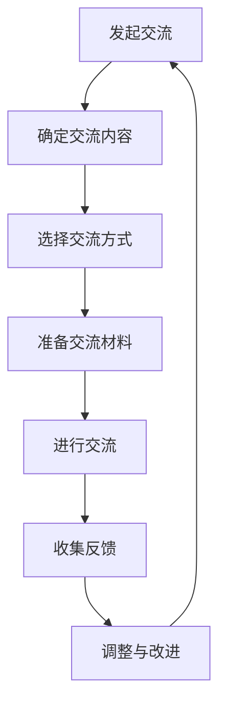

                 

# 科学交流在促进世界可理解性中的作用

## 关键词
科学交流、可理解性、信息传播、知识共享、跨文化沟通

## 摘要
本文旨在探讨科学交流在促进世界可理解性中的重要作用。通过分析科学交流的基本概念、理论基础、方法与工具，本文揭示了科学交流在信息传播、知识共享和跨文化沟通中的关键角色。同时，本文结合实际案例，详细阐述了科学交流在实际应用中的挑战与解决方案，为推动全球科学交流和世界可理解性的提升提供了有益的参考。

## 引言
### 1.1 书籍背景与目标
在当今全球化迅猛发展的时代，科学交流作为人类知识传播和共享的重要手段，日益受到广泛关注。科学交流不仅关乎科学研究的发展，更直接影响全球范围内的科技普及和科技创新。因此，如何有效地进行科学交流，提升世界的可理解性，成为一个亟待解决的问题。

本书旨在系统阐述科学交流的基本概念、理论基础、方法与工具，并结合实际案例，分析科学交流在信息传播、知识共享和跨文化沟通中的关键角色。希望通过本书的探讨，为广大科学工作者、教育者、政策制定者和公众提供有益的参考，共同推动科学交流的发展，提升世界的可理解性。

### 1.2 目标读者
本书的目标读者主要包括以下几个方面：
1. 科学工作者：帮助其掌握科学交流的基本理论和方法，提升科研写作与沟通能力。
2. 教育者：为其提供科学交流教学资源，指导学生进行有效的科学学习与交流。
3. 政策制定者：为其提供科学交流的政策建议，推动科学交流的发展与普及。
4. 公众：提高公众的科学素养，增强对科学知识的理解与认知。

### 1.3 书籍结构
本书分为七个章节，具体结构如下：

1. 引言：介绍书籍背景、目标读者和书籍结构。
2. 核心概念与联系：使用Mermaid流程图展示科学交流的概念框架。
3. 科学交流的理论基础：阐述科学交流的基本原理和理论基础。
4. 科学交流的方法与工具：介绍科学交流的不同方法和技术工具。
5. 科学交流的挑战与解决方案：分析科学交流面临的挑战，并给出解决方案。
6. 科学交流在不同领域的应用：探讨科学交流在不同学科和行业中的应用。
7. 结论与未来展望：总结科学交流的作用，展望未来发展趋势。

## 核心概念与联系
### 2.1 科学交流的基本概念
科学交流是指科学工作者、教育者、政策制定者等主体，通过多种形式和渠道，传播、共享和利用科学知识、技术和信息的过程。科学交流不仅包括科学研究的成果发表、学术会议的交流、科技活动的推广等，还涉及科学知识的普及、科技政策的制定、科学传播与教育的融合等多个方面。

科学交流的主要目标有：
1. 促进科学知识的传播与普及。
2. 提高科学研究的效率与质量。
3. 推动科技创新与发展。
4. 加强科学工作者之间的合作与交流。
5. 提升公众的科学素养。

科学交流的主要组成部分包括：
1. 交流主体：科学工作者、教育者、政策制定者等。
2. 交流对象：科学研究者、学生、公众等。
3. 交流内容：科学知识、技术信息、研究成果等。
4. 交流方式：学术论文、报告、演讲、书籍、网络媒体等。
5. 交流渠道：学术期刊、会议、研讨会、科普活动、科技项目等。

### 2.2 科学交流流程的Mermaid流程图
为了更好地理解科学交流的概念和架构，我们使用Mermaid流程图来展示科学交流的主要流程和环节。

## 科学交流的理论基础
### 3.1 科学交流的历史发展
科学交流的历史可以追溯到古代文明时期。在古代，科学知识的传播主要依赖于口口相传和手抄本的形式。随着印刷术的发明，科学知识的传播速度得到了极大的提升。18世纪末至19世纪初，随着工业革命的到来，科学交流进入了一个新的阶段，学术期刊的兴起和科学会议的举办为科学交流提供了更加有效的平台。

进入20世纪，科学交流迎来了迅猛发展。随着计算机技术的崛起，科学交流的方式和手段日益丰富。电子期刊、学术网络、社交媒体等新兴媒体为科学交流提供了新的渠道。此外，科学交流逐渐呈现出跨学科、跨国界、跨文化的特点，为全球科学合作和知识共享提供了广阔的空间。

### 3.2 科学交流的基本原理
科学交流遵循以下基本原理：

1. **信息传播原理**：科学交流的核心是信息的传递和传播。信息传播的速度、准确性和覆盖面直接影响科学交流的效果。为了提高信息传播的效果，需要采用多种传播渠道和手段，如学术论文、报告、演讲、书籍等。

2. **有效沟通原理**：科学交流不仅仅是信息的传递，更重要的是信息的理解和接受。为了实现有效沟通，需要注重语言的简洁、准确和易懂，以及交流双方的互动和反馈。

3. **互动与反馈原理**：科学交流是一个双向的过程，需要交流双方积极参与和互动。通过收集反馈，交流者可以了解信息接收者对信息的理解程度，从而进行及时的调整和改进。

### 3.3 科学交流在知识共享中的作用
科学交流在知识共享中发挥着重要作用。首先，科学交流是知识共享的重要渠道。通过科学交流，科学工作者可以分享研究成果、经验和技术，促进知识的传播和共享。其次，科学交流有助于知识的积累和创新。通过科学交流，科学工作者可以借鉴他人的研究成果，激发新的思路和灵感，推动科学知识的发展。最后，科学交流有助于提升公众的科学素养。通过科学交流，公众可以了解科学知识，增强对科学的认知和理解，提高科学素养。

## 科学交流的方法与工具
### 4.1 文字交流方法
文字交流是科学交流中最为传统和常见的方法。主要包括学术论文、报告、书籍等形式。

1. **学术论文**：学术论文是科学工作者展示研究成果的重要平台。撰写学术论文需要遵循一定的格式和规范，确保研究成果的严谨性和可读性。

2. **报告**：报告是科学工作者在学术会议、研讨会等场合分享研究成果的方式。撰写报告需要注重内容的简洁明了，突出研究的关键点和创新点。

3. **书籍**：书籍是科学工作者系统总结研究成果和知识的重要方式。撰写书籍需要注重结构的严谨和逻辑性，确保读者能够系统理解知识。

### 4.2 非文字交流方法
非文字交流方法主要包括实验与展示、数据可视化、网络媒体等形式。

1. **实验与展示**：实验与展示是科学工作者验证研究成果、展示研究过程和结果的重要方式。通过实验与展示，可以直观地让公众了解科学研究的全貌。

2. **数据可视化**：数据可视化是将复杂数据转化为图表、图形等形式，以便更好地理解和分析数据的方法。数据可视化在科学交流中具有重要的应用价值，可以帮助科学工作者和公众更好地理解数据。

3. **网络媒体**：网络媒体是科学交流的重要渠道，包括学术网站、博客、社交媒体等。网络媒体具有传播速度快、覆盖面广、互动性强等特点，有助于科学工作者和公众之间的交流与互动。

### 4.3 科学交流工具的优缺点分析
不同类型的科学交流方法具有不同的优缺点，科学工作者可以根据实际情况选择合适的方法。

1. **学术论文**：
   - 优点：严谨、规范、权威，有助于研究成果的传播和验证。
   - 缺点：写作过程复杂、耗时较长，受众范围相对有限。

2. **报告**：
   - 优点：直观、简洁、互动性强，有助于研究成果的展示和交流。
   - 缺点：内容有限、难以详细阐述研究过程和结果。

3. **书籍**：
   - 优点：系统、全面、深入，有助于知识的积累和传承。
   - 缺点：编写过程复杂、耗时较长，受众范围相对有限。

4. **实验与展示**：
   - 优点：直观、生动、易于理解，有助于研究成果的展示和普及。
   - 缺点：成本较高、实施难度大，受时间、空间限制。

5. **数据可视化**：
   - 优点：简洁、直观、易于理解，有助于数据分析和传播。
   - 缺点：数据处理和分析要求较高，受数据质量和工具限制。

6. **网络媒体**：
   - 优点：传播速度快、覆盖面广、互动性强，有助于科学知识的普及和交流。
   - 缺点：内容质量参差不齐、信息真实性难以保证。

## 科学交流的挑战与解决方案
### 5.1 语言障碍
科学交流中的语言障碍是一个普遍存在的问题。不同国家和地区之间的语言差异，使得科学工作者在交流和合作中面临诸多困难。语言障碍主要体现在以下几个方面：

1. **术语不一致**：不同国家和地区之间的科学术语可能存在差异，导致交流双方对同一概念的理解不一致。

2. **表达能力受限**：科学工作者可能不熟悉对方的语言，导致表达能力受限，难以准确传达研究成果。

3. **理解难度增加**：语言差异使得科学工作者在阅读和理解对方的研究成果时，需要花费更多的时间和精力。

### 5.2 解决方案
为了解决语言障碍，可以采取以下措施：

1. **使用国际通用术语**：科学工作者在交流和合作时，应尽量使用国际通用术语，确保双方对同一概念的理解一致。

2. **提供翻译支持**：在学术会议、研讨会等场合，可以提供专业的翻译服务，帮助交流双方准确传达研究成果。

3. **加强语言学习**：科学工作者应积极学习对方的语言，提高自己的表达能力，以便更有效地进行科学交流。

4. **采用多种语言交流**：在科学交流中，可以采用多种语言进行交流，如英语、汉语、法语等，以适应不同国家和地区的需求。

### 5.3 信息过载
科学交流中的信息过载也是一个普遍存在的问题。随着科学研究的不断发展和信息技术的进步，科学工作者面临着海量的信息资源，难以有效地筛选和处理。信息过载主要体现在以下几个方面：

1. **信息资源繁多**：科学工作者需要阅读大量学术论文、报告、书籍等，以获取最新的研究动态和成果。

2. **信息筛选困难**：科学工作者难以从海量的信息中，快速找到与自己研究相关的信息。

3. **信息处理耗时**：科学工作者需要花费大量时间对信息进行筛选、整理和分析，影响科研工作的效率。

### 5.4 解决方案
为了解决信息过载，可以采取以下措施：

1. **制定信息管理策略**：科学工作者可以制定适合自己的信息管理策略，如分类、标注、备份等，以提高信息处理的效率。

2. **利用信息筛选工具**：科学工作者可以利用各种信息筛选工具，如学术搜索引擎、文献管理软件等，快速找到与自己研究相关的信息。

3. **参与学术合作**：通过参与学术合作，科学工作者可以共享他人的研究成果和信息，减轻信息过载的压力。

4. **定期更新知识**：科学工作者应定期更新自己的知识，关注最新的研究动态和成果，以保持对领域的深入了解。

### 5.5 跨文化沟通
科学交流中的跨文化沟通也是一个重要的挑战。不同国家和地区之间的文化差异，可能导致科学工作者在交流和合作中产生误解和冲突。跨文化沟通主要体现在以下几个方面：

1. **价值观差异**：不同国家和地区之间的价值观可能存在差异，导致科学工作者对同一问题的看法和观点不一致。

2. **沟通方式不同**：不同国家和地区之间的沟通方式可能存在差异，导致科学工作者在交流和合作中产生障碍。

3. **文化敏感度不足**：科学工作者可能对对方的文化背景、习俗和价值观了解不足，导致在交流和合作中产生误解。

### 5.6 解决方案
为了解决跨文化沟通，可以采取以下措施：

1. **了解对方文化**：科学工作者应了解对方的文化背景、习俗和价值观，尊重差异，增强沟通的有效性。

2. **采用多元沟通方式**：科学工作者可以采用多种沟通方式，如面对面交流、邮件、电话等，以适应不同文化背景的需求。

3. **加强跨文化培训**：科学工作者可以参加跨文化培训，提高自己的跨文化沟通能力，增强跨文化合作的适应性。

4. **建立跨文化团队**：在科学交流中，可以建立跨文化团队，充分发挥不同文化的优势，实现合作共赢。

## 科学交流在不同领域的应用
### 6.1 科学研究中的应用
科学交流在科学研究中的应用至关重要。科学工作者通过科学交流，可以分享研究成果、经验和技术，促进科学知识的传播和共享。以下是科学交流在科学研究中的应用：

1. **学术论文发表**：学术论文是科学工作者展示研究成果的重要平台。通过发表学术论文，科学工作者可以与他人分享研究成果，接受同行的评审和反馈，提高研究质量和影响力。

2. **学术会议交流**：学术会议是科学工作者交流研究成果、分享经验和观点的重要场合。通过参加学术会议，科学工作者可以了解最新的研究动态，拓宽研究视野，建立学术合作关系。

3. **科研项目合作**：科学交流有助于科学工作者之间的合作，推动科研项目的进展。通过合作，科学工作者可以共享资源、知识和技术，提高科研效率和质量。

### 6.2 科技创新中的应用
科学交流在科技创新中的应用也具有重要意义。科学交流不仅有助于科学知识的传播和共享，还可以促进科技创新和产业发展。以下是科学交流在科技创新中的应用：

1. **科技传播与推广**：科学交流可以通过多种渠道，如学术论文、报告、书籍、网络媒体等，传播和推广科技创新成果，提高公众对科技的认识和理解。

2. **科技项目合作**：科学交流有助于科技工作者之间的合作，推动科技项目的进展。通过合作，科技工作者可以共享资源、知识和技术，实现科技创新和突破。

3. **科技政策制定**：科学交流可以为科技政策制定者提供科学依据和建议，促进科技政策的制定和实施。

### 6.3 教育中的应用
科学交流在教育领域也具有重要作用。科学交流可以帮助教育者传播科学知识，提高学生的科学素养，促进科学教育的发展。以下是科学交流在教育中的应用：

1. **科普教育**：科学交流可以通过科普教育，向公众传播科学知识，提高公众的科学素养。科普教育形式多样，包括科普读物、科普讲座、科普展览等。

2. **科学教育**：科学交流可以帮助教育者分享科学教学经验，提高科学教学质量和效果。通过科学交流，教育者可以了解最新的科学研究成果和教学方法，不断优化教学。

3. **科学竞赛**：科学交流可以通过科学竞赛，激发学生的科学兴趣和创新能力，提高学生的科学素养。科学竞赛形式多样，包括论文竞赛、实验竞赛、创新竞赛等。

## 结论与未来展望
### 7.1 科学交流的作用总结
科学交流在促进世界可理解性中具有重要作用。通过科学交流，科学工作者可以分享研究成果、经验和技术，促进科学知识的传播和共享。科学交流不仅有助于科学研究的发展，还可以推动科技创新和产业发展，提高公众的科学素养。科学交流在信息传播、知识共享和跨文化沟通中发挥着关键作用，对提升世界的可理解性具有重要意义。

### 7.2 未来发展趋势分析
随着信息技术的不断进步和全球化进程的加速，科学交流在未来将继续发展。以下是科学交流的未来发展趋势：

1. **数字化与智能化**：科学交流将越来越多地依赖于数字化和智能化技术，如大数据、云计算、人工智能等，提高科学交流的效率和质量。

2. **开放科学与开源软件**：开放科学和开源软件将成为科学交流的重要趋势。通过开放数据和开源工具，科学工作者可以更加便捷地共享研究成果，促进科学知识的传播和共享。

3. **跨学科与跨领域合作**：科学交流将更加注重跨学科和跨领域合作，推动科学知识的整合和创新。

4. **全球科学合作**：全球科学合作将进一步加强，科学工作者将更加紧密地合作，共同应对全球性科学挑战。

### 7.3 对世界可理解性的影响与展望
科学交流对提升世界的可理解性具有重要影响。通过科学交流，科学工作者可以分享研究成果、传播科学知识，提高公众的科学素养。在未来，随着科学交流的不断发展，世界的可理解性将得到进一步提升，为人类社会的可持续发展提供有力支持。同时，科学交流也将促进全球科学合作，推动科技创新和产业发展，为人类创造更加美好的未来。

## 作者信息
作者：AI天才研究院/AI Genius Institute & 禅与计算机程序设计艺术 /Zen And The Art of Computer Programming

**结语**
科学交流在促进世界可理解性中扮演着不可或缺的角色。让我们共同努力，通过科学交流，传播科学知识，推动科技创新，提高公众的科学素养，共同构建一个更加理解、和谐、美好的世界。

