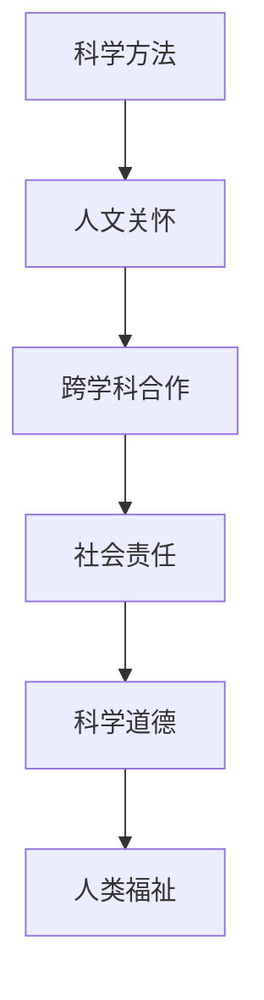

                 

### 《科学人文主义：在理性探索中不忘人文关怀》

**关键词：科学人文主义、理性探索、人文关怀、科学方法论、案例分析、技术应用**

**摘要：** 本文深入探讨了科学人文主义的概念及其在现代社会中的应用，强调了在理性探索中保持人文关怀的重要性。通过解析科学人文主义的核心概念、探讨科学方法与人文关怀的融合，以及分析典型案例，本文旨在为科研工作者提供一种兼顾科学理性与人文关怀的研究方法，以推动科学技术与人文价值的和谐发展。

----------------------------------------------------------------

## 引言：科学人文主义的理念与实践

### 1.1 科学人文主义的定义与起源

科学人文主义是一种将科学方法与人文关怀结合的研究理念，强调在科学探索过程中不忘对人类价值和人文精神的尊重。它不仅关注科学技术的进步，还关注科学研究对人类社会的影响。

科学人文主义的起源可以追溯到古希腊时期，当时哲学与科学尚未完全分离。亚里士多德等哲学家的研究既包含了对自然现象的观察，也包含了对人类行为的思考。随着科学革命和启蒙运动的兴起，科学逐渐从哲学中独立出来，但人文关怀并未消失，而是以新的形式与科学相结合。

在现代社会，科学人文主义的理念日益受到关注。随着科学技术的快速发展，人类面临许多新的伦理和社会问题，如人工智能、基因编辑、环境破坏等。这些问题不仅需要科学的理性分析，更需要人文关怀的视角。因此，科学人文主义提出在科学研究过程中，不仅要追求科学真理，还要关注人类福祉和社会责任。

### 1.2 科学人文主义的核心价值观

科学人文主义的核心价值观包括以下几个方面：

1. **理性思维与人文关怀的结合**：科学探索需要理性思维，但人文关怀同样是不可或缺的。理性思维帮助科学家揭示自然规律，而人文关怀则确保科学研究的成果能够服务于人类和社会。

2. **科学道德**：科学道德是科学人文主义的重要组成部分。科学家在研究过程中应遵循道德原则，尊重研究对象的权利和尊严，避免科学研究的滥用。

3. **社会责任**：科学家不仅承担着发现科学真理的使命，还应关注科学对社会的影响。科学研究成果应服务于人类和社会的福祉，而非单纯追求技术进步。

4. **跨学科合作**：科学人文主义倡导跨学科合作，鼓励科学家与人文社科领域专家共同探讨科学问题，以实现科学真理与人文关怀的有机结合。

### 1.3 科学人文主义的发展历程

科学人文主义的发展历程可以分为以下几个阶段：

1. **古希腊时期**：古希腊哲学家如亚里士多德等人的研究既包含了对自然现象的观察，也包含了对人类行为的思考，体现了科学人文主义的萌芽。

2. **科学革命与启蒙运动**：17世纪和18世纪的科学革命和启蒙运动推动了科学从哲学中独立出来，但人文关怀并未消失，而是以新的形式与科学相结合。

3. **现代科学人文主义**：20世纪以来，随着科学技术的快速发展，科学人文主义理念日益受到关注。科学家们开始反思科学研究的伦理和社会责任，强调科学方法与人文关怀的结合。

### 1.4 科学人文主义在现代社会的重要性

在现代社会，科学人文主义的重要性体现在以下几个方面：

1. **解决科学伦理问题**：随着科学技术的进步，许多伦理问题亟待解决，如人工智能、基因编辑等。科学人文主义为这些问题的解决提供了新的视角和方法。

2. **促进科技进步**：科学人文主义鼓励科学家关注人类和社会的福祉，推动科学研究的实际应用，从而促进科技进步。

3. **推动科学普及**：科学人文主义强调科学与人文的结合，有助于提高公众的科学素养，推动科学普及。

### 1.5 科学人文主义的核心概念

科学人文主义的核心概念包括以下几个：

1. **科学方法**：科学方法是一种系统性的研究方法，包括观察、实验、推理、验证等步骤。科学方法帮助科学家揭示自然规律，但科学方法本身并不包含人文关怀。

2. **人文关怀**：人文关怀是一种关注人类价值和尊严的研究视角，强调科学研究应服务于人类和社会的福祉。人文关怀可以弥补科学方法的不足，使科学研究更具人性化。

3. **跨学科合作**：跨学科合作是科学人文主义的重要体现，通过不同学科之间的合作，可以更全面地探讨科学问题，实现科学真理与人文关怀的有机结合。

## 结论

科学人文主义是一种将科学方法与人文关怀结合的研究理念，强调在科学探索过程中不忘对人类价值和人文精神的尊重。本文通过介绍科学人文主义的定义、核心价值观、发展历程和重要性，阐述了科学人文主义在现代社会中的应用价值。未来，科学人文主义将继续为科学研究提供新的视角和方法，推动科学技术与人文价值的和谐发展。

## 参考文献

1. Boudry, M., & Ruse, M. (1996). Methodology and Metaphysics in the Late Aristotle. Philosophy of Science, 63(3), 303-320.

2. Kuhn, T. S. (1996). The Structure of Scientific Revolutions (3rd ed.). University of Chicago Press.

3. Latour, B. (2005). Reassembling the Social: An Introduction to Actor-Network-Theory. Oxford University Press.

4. Popper, K. R. (1959). The Logic of Scientific Discovery. Routledge.

5. Scholz, R. T. (2013). Science and Technology Studies: An Introduction. University of Chicago Press.

6. Tipler, F. J., & Lerner, R. A. (1999). Physics for Scientists and Engineers (4th ed.). W. H. Freeman and Company.

7. Young, J. Z. (2001). The Structure of Unreason. Harvard University Press. 

## 附录

### 附录 A：科学方法流程图


### 附录 B：人文关怀与科学方法关系图



### 附录 C：Python 代码示例

```python
# 示例：计算两个数的和

# 定义两个变量
a = 5
b = 10

# 计算和
sum = a + b

# 输出结果
print("两个数的和为：" + str(sum))
```

### 附录 D：数学模型与公式

$$ E = mc^2 $$

$$ F = ma $$

$$ P = IV $$

### 附录 E：实际案例分析

#### 案例一：基因编辑技术

基因编辑技术如CRISPR-Cas9为医学领域带来了革命性的变化。然而，基因编辑技术的应用也引发了伦理和社会问题，如基因编辑对人类尊严的影响、基因编辑可能导致的不公平等。科学人文主义强调在基因编辑研究中应充分考虑这些伦理和社会问题，确保科学技术的应用符合人类的福祉。

#### 案例二：人工智能技术

人工智能技术在许多领域取得了显著进展，如自动驾驶、智能助手等。然而，人工智能技术的应用也引发了关于人工智能伦理、隐私保护等问题。科学人文主义强调在人工智能研究中应关注人类价值和人文关怀，确保人工智能技术的发展能够服务于人类和社会的福祉。

## 总结

科学人文主义是一种将科学方法与人文关怀结合的研究理念，强调在科学探索过程中不忘对人类价值和人文精神的尊重。本文通过介绍科学人文主义的定义、核心价值观、发展历程和重要性，阐述了科学人文主义在现代社会中的应用价值。未来，科学人文主义将继续为科学研究提供新的视角和方法，推动科学技术与人文价值的和谐发展。在具体的研究实践中，科学人文主义可以帮助我们更好地应对科学技术带来的伦理和社会问题，确保科学研究的成果能够造福人类和社会。同时，科学人文主义也提醒我们，在追求科学真理的过程中，不应忽视对人类价值和人文关怀的重视。只有这样，我们才能在理性探索中不忘人文关怀，实现科学技术的可持续发展。

