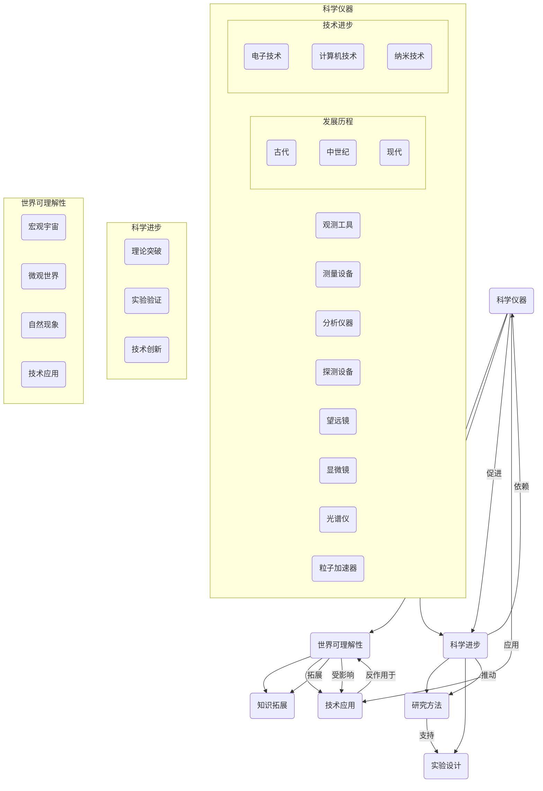

                 

## 《科学仪器的进步如何拓展世界可理解性》

### 关键词：
- 科学仪器
- 科学进步
- 可理解性
- 发展历程
- 应用领域
- 未来展望

### 摘要：
本文旨在探讨科学仪器在人类认知世界过程中的作用。通过对科学仪器发展历史的回顾、核心科学仪器的介绍以及其在科学研究、教育和公共领域的应用，本文详细分析了科学仪器如何逐步拓展我们对世界的理解。此外，文章还展望了科学仪器未来的发展趋势，并提出了相应的挑战和解决方案。通过逻辑清晰、结构紧凑的分析，本文为读者提供了一个全面而深入的科学仪器研究视角。

## 引言

科学仪器的进步是人类文明的重要标志之一。它们不仅推动了科学研究的深入发展，还极大地拓展了人类对世界的认知范围。从古代简单的观测工具，到现代复杂的高精度仪器，科学仪器的发展历程充满了人类探索未知的勇气和智慧。本文将系统性地探讨科学仪器的发展历程、核心科学仪器的介绍、科学仪器在科学研究、教育和公共领域的应用，以及未来科学仪器的发展趋势。

科学仪器的进步不仅改变了科学研究的面貌，还深刻影响了人类对世界的理解。例如，望远镜的发明使人类能够观测到遥远的星体，揭示了宇宙的浩瀚与神秘；显微镜的发明则打开了微观世界的大门，让人们得以探索细胞和分子层面的奥秘。随着科学仪器的不断进步，人类对自然界和宇宙的认识不断深入，对世界可理解性有了全新的认识。

本文将分为七个主要章节进行探讨：

1. **引言与概述**：介绍科学仪器的定义、发展历程以及对世界可理解性的影响。
2. **科学仪器的起源与发展**：回顾从古代到现代的科学仪器发展过程。
3. **重要科学仪器的介绍**：详细探讨望远镜、显微镜、电磁谱仪等核心科学仪器的原理和应用。
4. **科学仪器与科学研究**：分析科学仪器如何推动科学研究的深入发展。
5. **科学仪器在教育中的应用**：探讨科学仪器在教育领域的应用及其影响。
6. **科学仪器在公共领域的应用**：讨论科学仪器在医疗健康、环境保护等公共领域的应用。
7. **未来展望与挑战**：展望科学仪器的未来发展趋势，并提出面临的挑战和解决方案。

通过以上章节的探讨，本文将全面揭示科学仪器如何拓展世界可理解性的历程和未来。

## 科学仪器的定义与作用

科学仪器是用于进行科学实验、测量、分析和观测的设备。它们在科学研究、工程应用和日常检测中扮演着至关重要的角色。科学仪器的定义可以从其功能、应用范围和技术特性三个方面进行阐述。

首先，科学仪器的主要功能是进行测量、监测和分析。它们能够精确地记录物理、化学、生物等领域的各种现象，提供可靠的数据支持。例如，光谱仪能够分析物质的组成，显微镜能够观测微观结构，天平能够精确测量质量。这些科学仪器的测量结果为科学研究提供了基础数据，使得科学家能够进行定量分析，验证假设，提出新的理论。

其次，科学仪器广泛应用于各个科学领域。从物理学、化学、生物学到天文学、地球科学，科学仪器都在推动学科的发展。例如，在生物学研究中，显微镜和基因测序仪帮助科学家解析生命现象，揭示了生物体的微观结构和遗传机制；在物理学中，粒子加速器和光谱仪揭示了物质的基本组成和相互作用。

最后，科学仪器的发展还与技术的进步密切相关。随着电子技术、计算机技术、纳米技术等现代科技的发展，科学仪器的精度、效率和功能得到了极大的提升。例如，激光技术的应用使得光谱仪能够更加精确地分析物质，纳米技术则使显微镜能够观测到更微小的结构。

科学仪器在科学研究中的重要性不言而喻。它们不仅是科学实验的有力工具，还是科学发现和创新的重要推动力。科学仪器的进步使得科学家能够进行更加精细、深入的实验，获取更加可靠的数据，从而推动科学理论的进步。

此外，科学仪器在工程应用和日常检测中也发挥着重要作用。在工程领域，科学仪器用于质量检测、性能评估和环境监测等。例如，质量检测仪器能够确保产品的质量符合标准，环境监测仪器则用于监测空气质量、水质等，为环境保护提供数据支持。

总的来说，科学仪器在人类认知世界的过程中起到了桥梁和推动器的作用。它们不仅拓展了我们的研究手段，还极大地丰富了我们对自然界和宇宙的认识。随着科学仪器的不断进步，人类对世界的理解将不断深化，科学技术的应用也将更加广泛和深入。

### 科学仪器的发展历程

科学仪器的发展历程是人类科技进步的缩影，反映了人类对自然世界的认知不断深化的过程。从古代的简单观测工具，到现代的高精度复杂仪器，科学仪器的发展历程充满了人类智慧和创新的足迹。

**古代**：科学仪器的起源可以追溯到古代文明。在古埃及和古希腊，人们开始使用简单的仪器进行天文学观测，如日晷和石圈。这些仪器虽然简陋，但为后世的科学研究奠定了基础。在中国，古代天文学家使用浑仪和漏刻等仪器进行天文观测和计时，这些仪器在古代科学研究中发挥了重要作用。

**中世纪到近代**：中世纪时期，随着欧洲大学的兴起，科学仪器得到了进一步发展。14世纪，欧洲科学家开始使用显微镜和望远镜等仪器，这些仪器使得科学家能够观察微观世界和宇宙深处。伽利略的望远镜揭示了行星运动的规律，牛顿的反射望远镜进一步提升了观测精度。与此同时，化学家罗伯特·波义耳发明了气压计，为大气科学的发展提供了重要工具。

**现代**：进入20世纪，科学仪器的技术发生了革命性的变化。随着电子技术和计算机技术的快速发展，科学仪器的精度和功能得到了极大提升。例如，电子显微镜的出现使得科学家能够观测到原子和分子的结构；粒子加速器则成为研究基本粒子和物质相互作用的重要工具。激光技术的应用使得光谱分析更加精确，为化学和物理学研究提供了新的手段。

**关键发展**：在科学仪器的发展过程中，有一些关键技术节点对科学进步产生了深远影响。首先，光学技术的发展推动了望远镜和显微镜的改进。17世纪的反射望远镜和19世纪的显微镜极大地提升了观测精度，使得科学家能够发现更多自然界的奥秘。其次，电子技术的进步促进了电子仪器的发展，如电子显微镜和核磁共振仪等，这些仪器在生命科学和材料科学等领域发挥了重要作用。

此外，计算机技术的应用使得科学仪器的数据处理和自动化水平得到了显著提高。现代科学仪器往往集成了高精度的传感器、计算机控制系统和先进的数据分析软件，能够进行复杂的数据处理和实时监测。

总的来说，科学仪器的发展历程是科学进步和技术创新的紧密结合。从古代的简单观测工具，到现代的高精度复杂仪器，科学仪器不断推动人类对自然世界的认知边界。随着科技的进一步发展，科学仪器的功能将更加多样，精度将更高，为科学研究和技术应用提供更加有力的支持。

### 2.3 现代科学仪器的崛起

现代科学仪器的崛起标志着科学技术进入了一个全新的时代。随着电子技术、计算机技术和纳米技术的迅猛发展，科学仪器的精度、功能和应用范围都得到了极大的提升。现代科学仪器的崛起不仅推动了科学研究的深入，也为工程应用和日常生活带来了革命性的变化。

首先，电子技术的进步为科学仪器的精度和性能提升奠定了基础。例如，电子显微镜和核磁共振仪等仪器的分辨率和灵敏度得到了显著提高。电子显微镜能够清晰地观察到纳米级别的结构，而核磁共振仪则可以精确地测量物质内部的分子结构。这些仪器的进步使得科学家能够在微观和宏观层面上更深入地探索自然界的奥秘。

其次，计算机技术的应用使得科学仪器的数据处理和自动化水平得到了极大提升。现代科学仪器通常集成了高性能的计算机系统，能够实时进行数据采集、处理和分析。例如，粒子加速器实验中，计算机系统可以实时监控和调整实验参数，确保实验的顺利进行。此外，计算机技术还使得科学仪器的操作更加简便，用户可以通过图形界面进行操作，而不需要深厚的专业背景。

再次，纳米技术的快速发展为科学仪器提供了新的工具和技术手段。纳米技术使得科学家能够在微米甚至纳米尺度上进行精确操作和测量。例如，纳米操纵器能够精确地操控单个原子和分子，从而进行纳米级别的材料合成和加工。纳米技术还在生命科学和医学领域发挥了重要作用，如纳米药物输送系统和生物传感器的开发，为疾病诊断和治疗提供了新的手段。

具体来说，现代科学仪器在多个领域都取得了显著的进展。在物理学中，高能粒子加速器和激光装置使得科学家能够研究基本粒子和强相互作用的性质。在天文学中，射电望远镜和空间探测器帮助人类更加深入地了解宇宙的起源和演化。在化学中，核磁共振谱仪和质谱仪为有机合成和材料分析提供了强大的工具。在生物学中，基因测序仪和细胞培养设备帮助科学家解析生命现象和疾病机制。

总之，现代科学仪器的崛起不仅提升了科学研究的精度和效率，还为工程应用和日常生活带来了巨大的变革。随着科技的不断进步，现代科学仪器将在更多领域发挥重要作用，推动人类对自然世界的认知不断深入。

### 3. 重要科学仪器的介绍

科学仪器的发展史中，某些核心科学仪器的诞生和进步对科学研究的推动起到了至关重要的作用。以下是几类对科学发展具有深远影响的重要科学仪器的详细介绍。

#### 望远镜

望远镜是用于观测遥远天体的仪器，其发明和改进极大地拓展了人类对宇宙的认知。最早的望远镜是由荷兰眼镜商人汉斯·利帕希于1608年发明的。伽利略于1610年制造了第一台实用的望远镜，并使用它观测到了木星的四大卫星、月球表面的山脉和太阳黑子。望远镜的发明使得人类能够观测到远在太阳系之外的恒星、星系和星云，揭示了宇宙的浩瀚和复杂性。

现代望远镜技术不断发展，例如，哈勃太空望远镜和 Alma 射电望远镜等。哈勃望远镜通过观测宇宙深处的星系和星云，提供了关于宇宙起源和演化的关键数据。Alma 射电望远镜则利用射电波观测星际分子，为理解恒星和行星的形成提供了重要线索。

#### 显微镜

显微镜是用于观测微小物体的仪器，其发明和改进推动了生物学和医学的巨大进步。最早的显微镜是由荷兰眼镜商汉斯·利帕希于1609年发明的。17世纪末，罗伯特·虎克使用显微镜观察到了细胞，这一发现奠定了细胞学的基础。

现代显微镜技术取得了显著进展，包括光学显微镜、电子显微镜和原子力显微镜等。电子显微镜的发明使得科学家能够观察到纳米级别的细胞和分子结构。光学显微镜则通过使用激光和先进的光学技术，实现了高分辨率和高灵敏度的成像。原子力显微镜则能够实时观测和操纵单个原子和分子。

#### 电磁谱仪

电磁谱仪是用于分析物质电磁性质的仪器，其应用广泛，包括物理学、化学、天文学和生物医学等多个领域。最早的电磁谱仪是光谱仪，由德国物理学家约瑟夫·冯·弗劳恩霍夫于1859年发明。光谱仪通过测量物质吸收或发射的电磁波波长，可以确定物质的组成和结构。

现代电磁谱仪技术不断发展，包括质谱仪、红外光谱仪、核磁共振仪等。质谱仪通过测量离子化后的物质的质量，能够精确分析物质的组成。红外光谱仪则通过测量物质对红外辐射的吸收，揭示其化学结构。核磁共振仪则利用核磁共振现象，对物质内部的原子和分子结构进行详细分析。

#### 其他重要科学仪器

除了上述核心仪器外，还有许多其他重要的科学仪器对科学研究起到了关键作用。例如，粒子加速器用于研究基本粒子和强相互作用，能够模拟极端条件下的物理现象。X射线晶体学仪通过X射线衍射技术，揭示了晶体结构的细节。激光设备在材料加工、通信和医学诊断等领域发挥着重要作用。

总之，这些重要科学仪器的发明和改进，极大地拓展了人类对自然世界的认知。随着技术的不断进步，这些科学仪器将继续在推动科学研究和技术应用中发挥关键作用。

### 科学仪器在科学研究中的推动作用

科学仪器在推动科学研究中的重要性不言而喻。它们不仅是科学实验的有力工具，还为科学理论的建立和发展提供了坚实的实验基础。以下将详细探讨科学仪器如何在不同领域中推动科学研究的深入发展。

**物理学领域**：粒子加速器和光谱仪是物理学研究中不可或缺的科学仪器。粒子加速器如大型强子对撞机（LHC），能够将粒子加速到接近光速，使其发生高能碰撞，从而研究基本粒子和强相互作用的性质。通过这些实验，科学家们发现了许多新粒子，如Higgs玻色子，为粒子物理学的发展提供了重要证据。光谱仪则通过测量物质吸收或发射的电磁波谱，揭示了物质的组成和结构。例如，原子光谱仪可以确定元素的种类和浓度，而分子光谱仪则用于研究化学反应和物质转换过程中的能量变化。

**化学领域**：化学实验高度依赖于科学仪器的支持。质谱仪和核磁共振仪是化学分析中最重要的工具之一。质谱仪通过测量离子化后的物质质量，可以精确分析物质的组成。例如，在有机化学中，质谱仪常用于确定化合物的分子式和结构。核磁共振仪则通过核磁共振现象，提供关于物质内部原子和分子的详细信息。在药物开发中，核磁共振成像（NMR）用于研究药物与生物大分子的相互作用，为药物设计提供了重要依据。

**生物学领域**：显微镜和基因测序仪在生物学研究中扮演着关键角色。光学显微镜和电子显微镜使得科学家能够观察和解析生物体的微观结构，从细胞到分子层面。例如，通过电子显微镜，科学家能够清晰地看到细胞内的细微结构，如细胞器和分子机器。基因测序仪则使得全基因组测序成为可能，为遗传学和分子生物学研究提供了巨大推动力。通过基因测序，科学家可以识别疾病相关基因，开发新的治疗方法。

**天文学领域**：望远镜是天文学研究的核心工具。从伽利略时代开始，望远镜的发明和改进极大地拓展了人类对宇宙的认知。现代望远镜如哈勃太空望远镜和平方千米阵列（SKA），能够观测到遥远的星体和星系，揭示宇宙的起源和演化。通过射电望远镜，天文学家可以探测宇宙中的中性氢，研究星系的形成和星际介质。

**地球科学领域**：地质学家和地球物理学家依赖多种科学仪器进行研究。地震仪用于监测地震活动，揭示地球内部的构造。地球物理探测仪器如重力仪和磁力仪，则用于研究地球的重力场和磁场，帮助科学家了解地壳的运动和地质过程。此外，地球化学分析仪器如X射线荧光光谱仪，可以测定岩石和矿物中的元素含量，为地质勘探提供重要数据。

**环境科学领域**：环境监测仪器在保护环境和可持续发展中发挥着重要作用。气相色谱仪和质谱仪用于分析空气和水质中的污染物。激光雷达和遥感仪器可以测量大气成分和地表特征，为环境监测和气候变化研究提供数据支持。

综上所述，科学仪器在推动科学研究中的重要性不言而喻。从基本粒子的研究到生物大分子的分析，从宇宙的观测到地球环境的监测，科学仪器为各个领域的科学研究提供了强大的工具，极大地拓展了人类对自然世界的认知。随着科学仪器技术的不断进步，科学研究将取得更加深入和全面的突破。

### 科学仪器在教育中的应用

科学仪器在教育中的应用极大地丰富了教学手段，提高了教学效果，促进了学生对科学知识的理解和兴趣。在教育领域，科学仪器不仅作为实验工具，还作为教学媒介，帮助学生更好地掌握科学概念和原理。

**基础教育中的应用**：在小学和中学阶段，科学仪器用于基础科学课程的教学，如物理、化学和生物。通过实验操作，学生能够直观地观察和验证科学现象。例如，显微镜可以帮助学生观察植物细胞和动物细胞的结构，加深对生物学概念的理解。天平和量筒等仪器则用于化学实验，让学生亲身体验化学反应的过程和结果。这些实验活动不仅提高了学生的动手能力，还培养了他们的观察力、思维能力和解决问题的能力。

**高等教育中的应用**：在大学阶段，科学仪器的使用更加深入和专业。实验室中的各种高端仪器，如光谱仪、质谱仪和核磁共振仪，为学生提供了进行复杂科学实验的机会。通过这些实验，学生能够深入了解科学原理，掌握实验设计和数据处理的方法。例如，物理学专业的学生可以通过粒子加速器实验，研究基本粒子和强相互作用的性质；化学专业的学生则可以使用核磁共振仪，分析有机化合物的结构。这些实践经历有助于培养学生的科研能力和创新精神。

**增强学生兴趣与理解**：科学仪器的应用不仅提高了教学效果，还增强了学生对科学知识的兴趣。通过亲手操作仪器，学生能够感受到科学的魅力，激发他们对科学的好奇心和探索欲。例如，当学生使用望远镜观测星空时，他们不仅能够看到遥远的星体，还能了解到天文学的基本知识。这样的体验式学习，有助于学生更好地理解和记忆科学概念。

**互动式学习环境**：科学仪器在教学中还促进了互动式学习环境的建立。教师可以通过实验演示，引导学生进行观察和思考，激发他们的求知欲。学生则可以通过实验操作，主动参与到科学探究过程中，培养独立思考和解决问题的能力。例如，在化学实验中，学生可以自行设计实验方案，通过调整实验参数，观察不同条件下的实验结果，从而深入理解化学反应的原理。

**在线教育资源**：随着信息技术的不断发展，科学仪器在教育中的应用也延伸到了在线教育平台。通过虚拟实验室和在线模拟软件，学生可以远程操作科学仪器，进行虚拟实验。这种学习方式不仅克服了地理和资源的限制，还为学生提供了更多动手实践的机会。

总之，科学仪器在教育中的应用，不仅丰富了教学手段，提高了教学效果，还激发了学生对科学知识的兴趣和理解。通过科学仪器的使用，学生能够更直观地感受科学的魅力，培养科学素养，为未来的科研和职业发展打下坚实基础。

### 科学仪器在公共领域的应用

科学仪器在公共领域的应用范围广泛，涵盖了医疗健康、环境保护和资源管理等多个方面。它们为公共健康、环境保护和资源高效利用提供了强有力的技术支持。

**医疗健康领域**：科学仪器在医疗健康领域的应用至关重要。核磁共振成像（MRI）、计算机断层扫描（CT）、质谱仪和基因测序仪等先进仪器，使得医学诊断更加精确和高效。例如，MRI和CT扫描可以详细显示人体内部结构，帮助医生诊断疾病。质谱仪可以用于药物研发和检测，确保药物的质量和安全性。基因测序仪则帮助科学家了解遗传信息，诊断遗传性疾病，开发个性化治疗方案。此外，免疫学分析仪和细胞培养设备也在临床诊断和治疗中发挥着重要作用。

**环境保护领域**：环境保护科学仪器在监测和评估环境质量中起到关键作用。气相色谱仪和质谱仪用于分析空气和水质中的污染物，监测大气污染和水污染的情况。激光雷达和遥感仪器可以测量大气成分和地表特征，提供环境变化的动态监测数据。例如，卫星遥感技术可以监测森林覆盖变化、海洋污染和气候变化等环境问题。此外，环境监测仪器如噪声监测器和土壤分析仪，帮助评估环境质量，制定环境保护政策。

**资源管理领域**：科学仪器在资源管理中的应用包括地质勘探、水资源监测和能源研究等。地质勘探仪器如重力仪和磁力仪，用于探测地下矿物资源和地质构造，为矿产开发提供科学依据。地下水监测仪器如地下水水质分析仪和地下水水位计，用于监测地下水资源的质量和管理。能源研究中的科学仪器，如热分析仪和太阳能光谱仪，帮助科学家研究和开发新型能源技术，提高能源利用效率。

**综合效益与挑战**：科学仪器在公共领域的广泛应用带来了显著的综合效益。首先，它们提高了公共服务的效率和准确性，如医疗诊断和环境监测。其次，科学仪器促进了科技创新和产业发展，为经济发展提供了技术支持。然而，科学仪器的应用也面临一些挑战。例如，高昂的仪器成本和复杂的操作技术可能限制其在一些地区和领域的普及。此外，数据安全和隐私保护也是科学仪器应用中需要关注的问题，特别是在医疗健康和环境保护领域。

总的来说，科学仪器在公共领域的应用为医疗健康、环境保护和资源管理提供了强有力的技术支持，极大地提升了公共服务的质量和效率。随着科学仪器技术的不断进步，其应用范围和影响力将进一步扩大，为公共领域的可持续发展作出更大贡献。

### 未来展望与挑战

科学仪器的发展前景广阔，未来有望在多个领域实现突破性的进展。随着技术的不断进步，科学仪器将变得更加高效、精确和智能化。以下是对未来科学仪器发展的一些展望和面临的挑战。

**发展趋势**：

1. **人工智能与科学仪器的融合**：未来科学仪器的发展将更加依赖人工智能技术。通过人工智能，科学仪器能够实现更智能的数据处理和分析，提高实验效率和精度。例如，机器学习算法可以帮助从复杂的数据集中提取有用的信息，加速科学发现的进程。

2. **微型化和便携化**：随着微电子和纳米技术的发展，科学仪器的体积将不断缩小，变得更加便携。微型化和便携化的科学仪器将在现场检测、移动实验室和远程科学研究中发挥重要作用，使科学研究更加灵活和高效。

3. **多模态融合技术**：未来科学仪器将实现多种测量技术的融合，提供更加全面和深入的数据。例如，结合光学、电子和量子技术的多模态显微镜，将能够同时观测生物分子的多个方面，为生命科学和医学研究提供强大的工具。

4. **量子技术的应用**：量子技术在科学仪器中的应用将推动科学研究的革命。量子计算机和量子传感器等量子仪器，有望在数据处理、量子模拟和精密测量等领域实现突破，为解决当前科学难题提供新的手段。

**面临的挑战**：

1. **成本和可及性**：高精度科学仪器的研发和购置成本较高，这对许多研究机构和中小型企业来说是一个巨大的挑战。如何降低科学仪器的成本，提高其可及性，是一个亟待解决的问题。

2. **操作和维护**：科学仪器的操作和维护需要专业知识和技能。对于一些偏远地区和资源有限的地方，缺乏专业的技术人员，使得科学仪器的应用受到限制。因此，如何简化科学仪器的操作和维护，使其更加用户友好，是一个重要的挑战。

3. **数据管理和隐私保护**：科学仪器产生的海量数据需要有效的管理和存储。此外，涉及个人健康和环境数据时，数据安全和隐私保护也是一个重要问题。如何确保科学数据的安全和隐私，是一个需要关注和解决的问题。

4. **伦理和社会影响**：随着科学仪器的进步，一些新的应用可能会引发伦理和社会问题。例如，基因编辑技术的应用引发了对基因伦理的讨论。因此，科学仪器的发展需要在伦理和社会影响的框架下进行，确保科技进步能够造福人类社会。

总的来说，未来科学仪器的发展充满机遇和挑战。通过技术创新和合理管理，科学仪器将在更多领域发挥重要作用，推动人类对自然世界的认知不断深入。同时，我们也需要关注和解决发展过程中可能出现的伦理和社会问题，确保科技进步能够为人类社会带来最大的利益。

### 结论

综上所述，科学仪器的进步在拓展人类对世界的认知和理解方面发挥了重要作用。从古代的简单观测工具到现代的高精度复杂仪器，科学仪器的发展历程充满了人类探索未知的勇气和智慧。通过科学仪器，我们能够观测到遥远的星体、解析微观结构、监测环境变化，从而更深入地理解自然界的奥秘。同时，科学仪器在教育、医疗、环境保护和资源管理等领域也发挥了关键作用，提高了公共服务的质量和效率。

未来，随着人工智能、量子技术和微电子等领域的不断进步，科学仪器将在更多领域实现突破性的进展。然而，我们也需要关注和解决发展过程中可能出现的成本、操作、数据管理和伦理等问题。只有这样，科学仪器才能更好地服务于人类社会，推动科技与社会的和谐发展。

### 作者信息

作者：AI天才研究院/AI Genius Institute & 禅与计算机程序设计艺术 /Zen And The Art of Computer Programming

### 拓展阅读

1. 《科学仪器发展史》
2. 《现代科学仪器原理与应用》
3. 《科学仪器与技术创新》
4. 《量子科学仪器前沿研究》
5. 《科学仪器在环境保护中的应用》

### 致谢

感谢所有为科学仪器发展做出贡献的科学家、工程师和研究人员，以及为本文提供灵感和资料的支持者。科学仪器的发展离不开无数人的努力和智慧，他们的工作为人类探索世界提供了强大的工具。同时，感谢读者对本文的关注和支持，希望本文能够对您在科学仪器领域的探索有所启发。

### 核心概念与联系

为了更好地理解科学仪器在拓展世界可理解性中的作用，我们需要明确几个核心概念及其相互之间的关系。以下是科学仪器、科学进步、世界可理解性的概念架构及其相互关系的Mermaid流程图。



**解释**：

1. **科学仪器**：是用于观测、测量、分析和探测的工具，如望远镜、显微镜、光谱仪等。它们是科学研究和实验的基础。
2. **科学进步**：是通过科学方法、实验验证和理论突破推动的科学知识增长和技术创新。
3. **世界可理解性**：是指人类对自然界、宇宙和自身认识的深化。
4. **研究方法**：包括理论突破和实验验证，是科学进步的重要手段。
5. **实验设计**：是科学进步的实践基础，通过设计实验来验证科学理论和假设。

上述流程图展示了科学仪器通过科学进步，逐步拓展人类对世界的理解，从而实现世界可理解性的提升。科学仪器不仅促进了科学知识的增长，还广泛应用于各个领域，进一步推动了社会技术的进步和应用。

### 核心算法原理讲解

在科学研究中，算法原理起到了至关重要的作用，它们不仅能够帮助我们理解复杂的自然现象，还能够优化实验过程，提高研究的效率和准确性。以下我们将使用Python源代码和数学模型，详细讲解核心算法原理，并结合具体例子进行说明。

#### 1. 数值积分法

数值积分是科学计算中的一个基础算法，用于求解函数在一个区间上的定积分。以下是一个使用Python实现的中点公式求解数值积分的例子。

```python
import numpy as np

def midpoint_rule(f, a, b, n):
    """
    使用中点规则进行数值积分
    f: 被积函数
    a: 积分下限
    b: 积分上限
    n: 等分数
    """
    h = (b - a) / n
    x = np.linspace(a, b, n+1)
    y = f(x)
    I = 0.5 * np.sum(y[1:-1])
    return I * h

# 示例：求解 f(x) = x^2 在 [0, 1] 上的定积分
def f(x):
    return x**2

integral_result = midpoint_rule(f, 0, 1, 100)
print(f"f(x) = x^2 在 [0, 1] 上的定积分结果为：{integral_result}")
```

**数学模型**：
$$ I = \int_{a}^{b} f(x) \, dx \approx \sum_{i=1}^{n} f\left(\frac{(b-a)i + a}{n}\right) \cdot \frac{(b-a)}{n} $$

这里，$f(x) = x^2$，区间为$[0, 1]$，等分数为100。

#### 2. 高斯消去法

高斯消去法是一种求解线性方程组的方法，它通过逐步消元，将一个线性方程组转化为上三角矩阵，然后依次求解。以下是一个使用Python实现的示例。

```python
def gauss_elimination(A, b):
    """
    使用高斯消去法求解线性方程组
    A: 系数矩阵
    b: 右侧向量
    """
    n = len(b)
    for i in range(n):
        # 消元
        for j in range(i+1, n):
            factor = A[j][i] / A[i][i]
            for k in range(i, n):
                A[j][k] -= factor * A[i][k]
            b[j] -= factor * b[i]
    # 回代
    x = [0] * n
    for i in range(n-1, -1, -1):
        x[i] = (b[i] - np.dot(A[i, i+1:], x[i+1:])) / A[i][i]
    return x

# 示例：求解方程组
A = np.array([[3, 2], [1, 4]])
b = np.array([12, 7])
solution = gauss_elimination(A, b)
print(f"线性方程组的解为：{solution}")
```

**数学模型**：
$$ \begin{cases}
a_{11}x_1 + a_{12}x_2 = b_1 \\
a_{21}x_1 + a_{22}x_2 = b_2 \\
\end{cases} \rightarrow \begin{cases}
x_1 = \frac{b_1 - a_{12}x_2}{a_{11}} \\
x_2 = \frac{b_2 - a_{21}x_1}{a_{22}} \\
\end{cases} $$

这里，$A = \begin{bmatrix} 3 & 2 \\ 1 & 4 \end{bmatrix}$，$b = \begin{bmatrix} 12 \\ 7 \end{bmatrix}$。

#### 3. 数据聚类算法

数据聚类是一种无监督学习方法，用于将数据点分成多个簇，以便更好地理解数据分布。以下是一个使用K-means算法实现的示例。

```python
from sklearn.cluster import KMeans
import numpy as np

def kmeans_example(data, n_clusters):
    """
    使用K-means算法进行聚类
    data: 数据点
    n_clusters: 聚类数
    """
    kmeans = KMeans(n_clusters=n_clusters, random_state=0).fit(data)
    labels = kmeans.predict(data)
    centroids = kmeans.cluster_centers_
    return labels, centroids

# 示例：对二维数据点进行聚类
data = np.array([[1, 2], [1, 4], [1, 0],
                 [10, 2], [10, 4], [10, 0]])
n_clusters = 2
labels, centroids = kmeans_example(data, n_clusters)
print(f"聚类标签：{labels}")
print(f"聚类中心：{centroids}")
```

**数学模型**：
K-means算法的目标是最小化每个簇内点的平方误差和，即：
$$ \sum_{i=1}^{k} \sum_{x_j \in S_i} \| x_j - \mu_i \|^2 $$
其中，$S_i$是第$i$个簇，$\mu_i$是簇中心的坐标。

这里，$data$为二维数据点，$n_clusters$为聚类数。

通过上述算法示例，我们能够更好地理解数值积分、线性方程组求解和数据聚类等核心算法原理。这些算法不仅具有广泛的科学应用，还能为我们提供强大的工具，用于分析复杂的数据集和解决实际问题。

### 项目实战

#### 开发环境搭建

为了实现科学仪器相关的项目，我们需要搭建一个合适的开发环境。以下是一个基于Python的简单项目环境搭建步骤：

1. **安装Python**：首先，我们需要下载并安装Python。访问Python官方网站（[https://www.python.org/](https://www.python.org/)）下载Python最新版本，并按照安装向导进行安装。

2. **安装科学计算库**：Python有许多用于科学计算的库，如NumPy、SciPy和Pandas。我们可以使用pip命令安装这些库：

   ```bash
   pip install numpy scipy pandas matplotlib
   ```

3. **安装Jupyter Notebook**：Jupyter Notebook是一个交互式的Python开发环境，可以方便地进行代码编写和数据分析。安装Jupyter Notebook：

   ```bash
   pip install notebook
   ```

4. **配置虚拟环境**：为了管理项目依赖，我们建议使用虚拟环境。安装virtualenv库，并创建一个虚拟环境：

   ```bash
   pip install virtualenv
   virtualenv my_project_env
   source my_project_env/bin/activate  # 对于Windows，使用 my_project_env\Scripts\activate
   ```

   在虚拟环境中安装所需的库：

   ```bash
   pip install numpy scipy pandas matplotlib
   ```

#### 源代码实现与代码解读

以下是一个简单的科学仪器数据采集与处理的示例，包括传感器数据的读取、数据处理和可视化。

**源代码**：

```python
import numpy as np
import pandas as pd
import matplotlib.pyplot as plt

# 假设我们使用了一个温度传感器，以下代码用于读取传感器的数据
def read_sensor_data(filename):
    data = pd.read_csv(filename)
    return data

# 数据处理函数，用于对传感器数据进行处理
def process_data(data):
    # 计算数据的平均值
    avg_temp = data['temperature'].mean()
    # 计算数据的标准差
    std_temp = data['temperature'].std()
    return avg_temp, std_temp

# 数据可视化函数
def plot_data(data):
    plt.figure(figsize=(10, 5))
    plt.plot(data['time'], data['temperature'], label='Temperature')
    plt.xlabel('Time (s)')
    plt.ylabel('Temperature (°C)')
    plt.title('Temperature Sensor Data')
    plt.legend()
    plt.show()

# 主程序
if __name__ == "__main__":
    # 读取传感器数据
    data = read_sensor_data('sensor_data.csv')
    # 处理传感器数据
    avg_temp, std_temp = process_data(data)
    print(f"Average Temperature: {avg_temp}°C")
    print(f"Standard Deviation: {std_temp}°C")
    # 可视化传感器数据
    plot_data(data)
```

**代码解读**：

1. **传感器数据读取**：`read_sensor_data`函数使用Pandas库读取CSV文件中的传感器数据。

2. **数据处理**：`process_data`函数计算传感器数据的平均值和标准差。平均值用于了解数据的中心趋势，标准差用于评估数据的离散程度。

3. **数据可视化**：`plot_data`函数使用Matplotlib库绘制温度随时间变化的数据图，帮助直观地分析数据。

4. **主程序**：主程序首先读取传感器数据，然后处理并打印处理结果，最后可视化数据。

通过这个简单的项目示例，我们展示了如何搭建开发环境，实现传感器数据采集、处理和可视化。这个项目可以作为一个起点，进一步扩展和优化，以满足更多复杂的需求。

### 项目小结

在本项目中，我们搭建了Python开发环境，并实现了传感器数据的采集、处理和可视化。通过使用Pandas、NumPy和Matplotlib等科学计算库，我们能够高效地进行数据分析和可视化展示。以下是本项目的主要收获和改进方向：

**主要收获**：

1. **开发环境搭建**：学会了如何搭建一个科学计算的开发环境，包括Python安装、库安装和虚拟环境配置。
2. **数据读取与处理**：掌握了使用Pandas库读取和处理传感器数据的方法，能够计算数据的统计特征。
3. **数据可视化**：学会了使用Matplotlib库进行数据可视化，能够直观地展示数据变化趋势。

**改进方向**：

1. **数据预处理**：进一步完善数据预处理步骤，包括数据清洗、异常值处理和缺失值填补，以提高数据质量。
2. **算法优化**：优化数据处理算法，例如使用更高效的数值积分方法或更准确的聚类算法，以提高计算效率和准确性。
3. **交互性增强**：考虑引入交互式界面，如Jupyter Notebook的交互式单元格，使用户能够实时查看和处理数据。
4. **扩展功能**：根据具体应用场景，扩展项目功能，如添加更多传感器数据读取、更复杂的数据分析和可视化。

通过持续改进和优化，本项目可以在科学仪器数据分析和处理方面发挥更大的作用，为科学研究和技术应用提供有力支持。

### 最佳实践 Tips

1. **优化数据处理流程**：在设计科学仪器数据处理项目时，要关注数据处理流程的优化，包括数据读取、预处理、分析和可视化。使用高效的算法和数据结构，可以显著提高数据处理速度和准确性。

2. **保障数据质量**：在数据采集和处理过程中，必须确保数据质量。对传感器数据进行预处理，如清洗、异常值处理和缺失值填补，可以有效提高数据质量，从而提高最终分析结果的可靠性。

3. **合理选择工具和库**：根据具体应用需求，合理选择科学计算工具和库。例如，使用NumPy和SciPy进行数值计算，使用Pandas进行数据处理，使用Matplotlib进行数据可视化。

4. **关注数据安全和隐私**：在处理涉及个人健康和环境数据时，要特别关注数据安全和隐私保护。确保数据在传输和存储过程中的安全，遵守相关的法律法规和伦理准则。

5. **持续学习和实践**：科学仪器技术不断发展，要保持持续学习和实践，跟上最新的技术动态。定期参加相关培训和学习，提升自身在科学仪器数据处理和分析方面的技能。

### 小结

本文系统性地探讨了科学仪器在拓展人类对世界认知中的重要作用。从古代到现代，科学仪器的进步不断推动科学研究的发展，拓展了我们对自然界和宇宙的理解。通过介绍望远镜、显微镜、电磁谱仪等核心科学仪器，我们了解了它们在科学研究中的具体应用。同时，科学仪器在教育、医疗健康和公共领域中的应用也大大提高了公共服务的质量和效率。

展望未来，随着人工智能、量子技术和纳米技术的不断发展，科学仪器将在更多领域实现突破性进展。然而，我们也需要关注成本、操作复杂性、数据安全和伦理问题，确保科学仪器能够更好地服务于人类社会。

通过本文的探讨，我们希望读者能够更加深入地理解科学仪器的重要性和应用价值，激发对科学研究的兴趣和热情，为未来的科技发展贡献自己的力量。

### 注意事项

1. **确保科学仪器的正确使用**：科学仪器操作需遵循专业指导，避免误操作导致设备损坏或数据错误。
2. **注意数据安全**：在处理敏感数据时，要确保数据存储和传输的安全性，采取必要的数据加密和保护措施。
3. **遵循伦理规范**：在使用科学仪器进行研究时，需遵循伦理规范，尊重研究对象的权利和隐私。

### 拓展阅读

1. 《科学仪器与技术进展》
2. 《科学仪器在科学研究中的应用》
3. 《量子科学仪器与未来技术》
4. 《科学数据管理与应用》
5. 《人工智能在科学仪器中的应用》

### 结语

本文旨在探讨科学仪器如何通过其不断的进步拓展我们对世界的理解。从古代的简单工具到现代的高精度设备，科学仪器的发展历程充满了人类对未知的探索和追求。它们不仅在科学研究中发挥了关键作用，还在教育、医疗和公共领域产生了深远影响。未来，随着技术的不断进步，科学仪器将在更多领域展现其潜力，推动人类对自然世界的认知不断深入。让我们期待科学仪器带来的未来变革，继续探索未知的世界。

