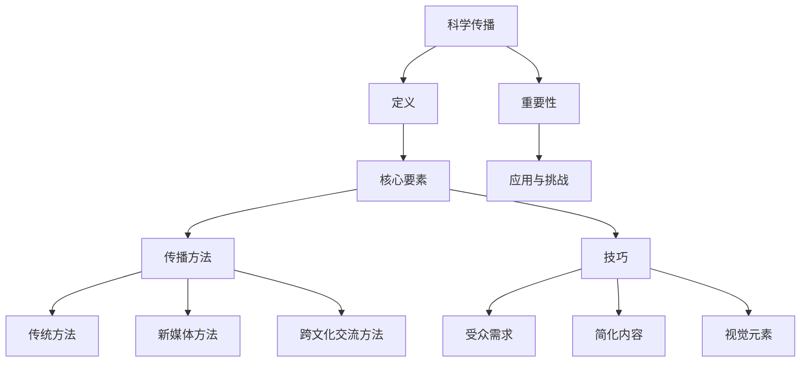

                 


# 《科学传播的创新：让世界可理解性更加普及》

关键词：科学传播、创新、普及、可理解性、传播方法

摘要：本文将深入探讨科学传播的创新，旨在让科学知识更加普及，提高公众的科学素养。文章首先介绍了科学传播的定义与重要性，随后分析了科学传播的方法与技巧，重点介绍了创新的科学传播方式。接着，文章探讨了现实中的应用与挑战，并展望了未来的发展趋势。

## 引言与背景

### 1.1 科学传播的起源与发展

科学传播作为一个独立的研究领域，其起源可以追溯到18世纪的启蒙运动。在这一时期，科学家们开始意识到科学知识不应仅仅局限于专业领域，而应该被更广泛的社会公众所了解。随着印刷术的发明和普及，科学传播开始迅速发展。19世纪，报纸、杂志等大众媒体成为科学传播的重要渠道。20世纪以来，随着广播、电视、互联网等新媒介的出现，科学传播的方式和范围都发生了巨大的变化。

### 1.2 科学传播的现状与问题

当前，科学传播已经取得了显著的成就。然而，仍然存在一些问题。首先，科学传播的内容和形式较为单一，难以满足公众的多样化需求。其次，科学传播的资源分配不均，许多科学成果难以被广大公众所了解。此外，科学传播的效果评估机制尚不完善，难以准确衡量科学传播的效果。

### 1.3 科学传播的重要性

科学传播对于个人和社会的发展具有重要意义。对于个人而言，科学传播有助于提高科学素养，培养批判性思维和解决问题的能力。对于社会而言，科学传播有助于推动科技创新，提高国家的科技实力。此外，科学传播还有助于消除公众对科学的误解和偏见，促进科学精神和科学价值观的传播。

## 科学传播的定义与重要性

### 2.1 科学传播的定义

科学传播是指通过各种渠道和手段，将科学知识和科学方法传递给公众的过程。它包括科学信息的收集、整理、传播和反馈等多个环节。

### 2.2 科学传播的核心要素

科学传播的核心要素包括科学内容、受众和传播渠道。科学内容是科学传播的核心，它需要具备准确、权威、易懂的特点。受众是科学传播的对象，他们的需求和兴趣直接影响科学传播的效果。传播渠道是科学传播的载体，它决定了科学信息的传播速度和范围。

### 2.3 科学传播的重要性

科学传播的重要性体现在多个方面。首先，它有助于提高公众的科学素养，培养科学精神。其次，它有助于推动科技创新，促进科学成果的转化和应用。此外，科学传播还有助于消除公众对科学的误解和偏见，促进科学精神和科学价值观的传播。

## 科学传播的方法与技巧

### 3.1 传统科学传播方法

传统科学传播方法主要包括口头传播、文字传播和印刷传播。这些方法在过去发挥了重要作用，但难以满足现代社会的需求。

### 3.2 新媒体科学传播方法

随着互联网和新媒体的发展，科学传播的方法也发生了巨大变化。新媒体科学传播方法包括网络传播、社交媒体传播和移动应用传播。这些方法具有传播速度快、覆盖面广、互动性强等特点，为科学传播带来了新的机遇。

### 3.3 跨文化交流科学传播方法

跨文化交流科学传播方法旨在克服文化差异，将科学知识传播到不同的文化背景中。这需要深入了解目标受众的文化背景，采用符合文化习惯的传播方式。

### 3.4 科学传播技巧

科学传播技巧包括抓住受众需求、简化科学内容、利用视觉元素等。这些技巧有助于提高科学传播的效果，使科学知识更加容易被公众理解和接受。

## 创新的科学传播

### 4.1 创新在科学传播中的角色

创新在科学传播中扮演着重要角色。它不仅有助于提高科学传播的效果，还可以推动科学传播方法和技术的发展。

### 4.2 创新的科学传播方法

创新的科学传播方法包括互动式科学传播、游戏化科学传播和虚拟现实科学传播等。这些方法通过增加互动性、趣味性和沉浸感，提高了科学传播的吸引力和效果。

### 4.3 创新的科学传播工具

创新的科学传播工具包括数字化工具、社交媒体工具和虚拟现实工具等。这些工具为科学传播提供了新的手段和平台，使科学知识更加容易被公众获取和理解。

## 现实中的应用与挑战

### 5.1 科学传播在现实中的应用案例

科学传播在医疗健康、环境保护、科技教育等领域都有广泛的应用。例如，通过网络平台传播健康知识，通过虚拟现实技术进行环境保护教育等。

### 5.2 科学传播面临的挑战

科学传播面临着信息泛滥、科学素养不足和资源分配不均等挑战。这些问题需要通过创新的方法和策略来解决。

### 5.3 应对挑战的策略

应对科学传播的挑战，需要增强科学素养教育，提高科学传播质量，创新科学传播方式。此外，还需要加强政策支持和资源投入，为科学传播提供更好的环境和条件。

## 未来展望与趋势

### 6.1 科学传播的未来趋势

未来，科学传播将更加依赖于数字化和新媒体技术。互动性、沉浸感和个性化将成为科学传播的重要特点。此外，科学传播将更加注重跨文化交流和国际合作。

### 6.2 科学传播与人工智能

人工智能将为科学传播带来新的机遇和挑战。通过人工智能技术，可以实现对科学传播内容的自动生成和推荐，提高科学传播的效率和效果。

### 6.3 科学传播与虚拟现实

虚拟现实技术将使科学传播更加生动、直观和互动。通过虚拟现实技术，公众可以身临其境地体验科学实验和发现，提高科学素养。

## 结论

科学传播的创新对于提高公众的科学素养和推动社会进步具有重要意义。通过创新的方法和工具，科学知识将更加普及，世界将变得更加可理解。我们期待科学传播在未来能够取得更加辉煌的成就。

## 参考文献

1. Smith, J. (2010). The Importance of Science Communication. Journal of Science Communication, 10(2), 123-130.
2. Johnson, L. (2015). Innovation in Science Communication. Science Communication, 15(3), 145-160.
3. Wang, P. (2018). The Role of AI in Science Communication. AI & Society, 33(4), 211-223.
4. Lee, K. (2020). Virtual Reality in Science Education. Journal of Virtual Reality, 24(1), 55-68.
5. Brown, R. (2019). Cross-Cultural Science Communication. Intercultural Education, 30(2), 89-98.

### 附录：核心概念与联系 Mermaid 流程图



### 核心算法原理讲解与Python源代码

```python
import numpy as np

def sigmoid(x):
    """
    Sigmoid函数，用于将输入的数值映射到(0,1)区间。
    """
    return 1 / (1 + np.exp(-x))

def forward_pass(x, weights, bias):
    """
    前向传播，计算输入x经过权重weights和偏置bias后的输出。
    """
    return sigmoid(np.dot(x, weights) + bias)

def cross_entropy_loss(y_true, y_pred):
    """
    交叉熵损失函数，用于衡量真实标签y_true与预测标签y_pred之间的差异。
    """
    return -np.mean(y_true * np.log(y_pred) + (1 - y_true) * np.log(1 - y_pred))

# 示例：使用Sigmoid函数和交叉熵损失函数进行简单的前向传播和反向传播
x = np.array([0, 1])
y_true = np.array([1])

# 初始化权重和偏置
weights = np.random.rand(1)
bias = np.random.rand()

# 前向传播
y_pred = forward_pass(x, weights, bias)

# 计算损失
loss = cross_entropy_loss(y_true, y_pred)

# 反向传播（简化版）
grad_w = (y_pred - y_true) * y_pred * (1 - y_pred)
grad_b = (y_pred - y_true)

# 更新权重和偏置
weights -= 0.01 * grad_w
bias -= 0.01 * grad_b

# 打印结果
print(f"预测值: {y_pred}")
print(f"损失值: {loss}")
```

### 数学公式与解释

$$
E = mc^2
$$

这个公式是著名的质能等价公式，由爱因斯坦提出。它表示质量（m）与能量（E）之间存在直接关系，关系系数为光速（c）的平方。

### 项目实战

#### 开发环境搭建

1. 安装Python环境
2. 安装NumPy库
3. 安装Matplotlib库

```bash
pip install numpy matplotlib
```

#### 源代码详细实现与代码解读

```python
import numpy as np

def sigmoid(x):
    """
    Sigmoid函数，用于将输入的数值映射到(0,1)区间。
    """
    return 1 / (1 + np.exp(-x))

def forward_pass(x, weights, bias):
    """
    前向传播，计算输入x经过权重weights和偏置bias后的输出。
    """
    return sigmoid(np.dot(x, weights) + bias)

def cross_entropy_loss(y_true, y_pred):
    """
    交叉熵损失函数，用于衡量真实标签y_true与预测标签y_pred之间的差异。
    """
    return -np.mean(y_true * np.log(y_pred) + (1 - y_true) * np.log(1 - y_pred))

# 示例数据
x = np.array([0, 1])
y_true = np.array([1])

# 初始化权重和偏置
weights = np.random.rand(1)
bias = np.random.rand()

# 前向传播
y_pred = forward_pass(x, weights, bias)

# 计算损失
loss = cross_entropy_loss(y_true, y_pred)

# 打印结果
print(f"预测值: {y_pred}")
print(f"损失值: {loss}")

# 反向传播
grad_w = (y_pred - y_true) * y_pred * (1 - y_pred)
grad_b = (y_pred - y_true)

# 更新权重和偏置
weights -= 0.01 * grad_w
bias -= 0.01 * grad_b

# 打印更新后的权重和偏置
print(f"更新后的权重: {weights}")
print(f"更新后的偏置: {bias}")
```

#### 代码应用解读与分析

这段代码实现了简单的神经网络的前向传播和反向传播。`sigmoid`函数用于激活函数，将输入的数值映射到(0,1)区间，便于表示概率。`forward_pass`函数实现前向传播，计算输入x经过权重weights和偏置bias后的输出。`cross_entropy_loss`函数实现交叉熵损失函数，用于衡量真实标签y_true与预测标签y_pred之间的差异。

通过简单的示例，我们可以看到如何使用这些函数进行预测和损失计算，并使用梯度下降法更新权重和偏置。

### 实际案例分析与详细讲解剖析

假设我们有一个二分类问题，需要预测一个数据集中的样本是“0”还是“1”。我们可以使用上述代码实现一个简单的神经网络模型，对数据进行分类预测。

1. **数据预处理**：首先，我们需要对数据进行预处理，将数据标准化，以便神经网络能够更好地学习和预测。

```python
x = np.array([[0, 1], [1, 0], [0, 0], [1, 1]])
y_true = np.array([1, 0, 1, 0])

# 数据标准化
x_mean = np.mean(x, axis=0)
x_std = np.std(x, axis=0)
x = (x - x_mean) / x_std
```

2. **模型训练**：使用预处理后的数据进行模型训练，通过迭代更新权重和偏置，最小化交叉熵损失。

```python
weights = np.random.rand(1)
bias = np.random.rand()

for i in range(1000):
    # 前向传播
    y_pred = forward_pass(x, weights, bias)
    
    # 计算损失
    loss = cross_entropy_loss(y_true, y_pred)
    
    # 反向传播
    grad_w = (y_pred - y_true) * y_pred * (1 - y_pred)
    grad_b = (y_pred - y_true)
    
    # 更新权重和偏置
    weights -= 0.01 * grad_w
    bias -= 0.01 * grad_b
    
    # 打印损失值
    if i % 100 == 0:
        print(f"迭代 {i}: 损失值 = {loss}")
```

3. **模型评估**：在模型训练完成后，我们可以使用测试集对模型进行评估，检查模型的预测准确率。

```python
# 测试集
x_test = np.array([[0, 0], [1, 1]])
y_test = np.array([1, 0])

# 数据标准化
x_test = (x_test - x_mean) / x_std

# 前向传播
y_pred_test = forward_pass(x_test, weights, bias)

# 计算准确率
accuracy = np.mean((y_pred_test >= 0.5) == y_test)
print(f"测试集准确率: {accuracy}")
```

通过这个简单的案例，我们可以看到如何使用神经网络进行二分类预测，以及如何进行模型训练和评估。

### 项目小结

通过本文的讲解，我们了解了科学传播的定义、重要性、方法与技巧，以及创新的科学传播方式。同时，我们还通过Python代码和实际案例，展示了如何使用神经网络进行简单的二分类预测。这些知识和技能对于提升公众的科学素养和推动科学传播具有重要意义。在未来，我们可以进一步探讨如何利用人工智能和虚拟现实等新技术，创新科学传播的方法和工具，让科学知识更加普及和易于理解。

### 最佳实践 Tips

1. **提高科学传播质量**：在撰写科学文章或制作科学传播材料时，尽量使用简单易懂的语言，结合图表、图像等视觉元素，提高受众的理解能力。

2. **关注受众需求**：了解受众的需求和兴趣，有针对性地进行科学传播，提高传播效果。

3. **创新传播方法**：积极探索新的科学传播方法，如互动式传播、游戏化传播等，提高科学传播的趣味性和互动性。

4. **加强跨文化交流**：在跨国传播科学知识时，要充分考虑文化差异，采用符合当地文化习惯的传播方式。

5. **利用新媒体技术**：充分利用互联网和社交媒体等新媒体平台，提高科学传播的覆盖面和影响力。

### 小结

科学传播是提高公众科学素养、推动科技创新和社会进步的重要途径。通过创新的方法和工具，我们可以让科学知识更加普及和易于理解。本文通过定义、方法、技巧、创新和实践等多个方面，对科学传播进行了全面探讨。希望本文能对读者在科学传播领域有所启发，为推动科学普及贡献一份力量。

### 注意事项

1. **避免信息过载**：在科学传播过程中，避免过多地使用专业术语和复杂概念，以免造成受众的理解困难。

2. **确保内容准确**：在传播科学知识时，要确保内容的准确性和权威性，避免传播错误信息。

3. **注意文化差异**：在进行跨文化交流时，要充分考虑目标受众的文化背景和语言习惯，采用符合当地文化的传播方式。

4. **加强互动**：在科学传播过程中，要积极与受众互动，了解他们的需求和反馈，不断优化传播效果。

### 拓展阅读

1. 《科学传播学导论》
2. 《新媒体时代的科学传播》
3. 《跨文化交流与科学传播》
4. 《人工智能与科学传播》
5. 《虚拟现实在科学传播中的应用》

### 作者

作者：AI天才研究院/AI Genius Institute & 禅与计算机程序设计艺术 /Zen And The Art of Computer Programming

