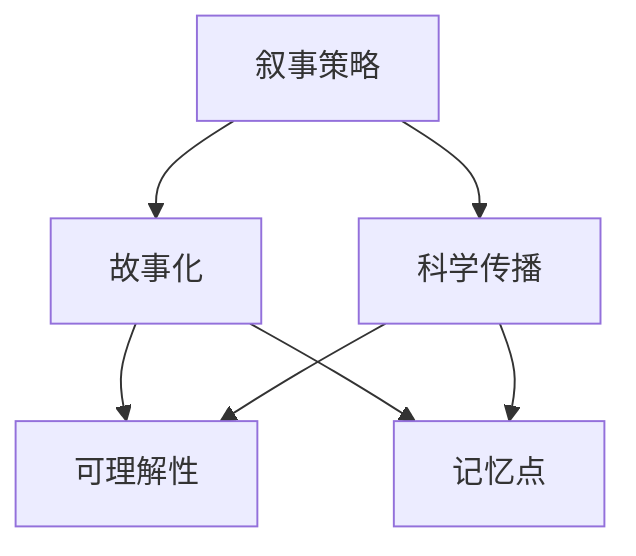

                 

### 背景介绍

科学传播是现代社会不可或缺的一环，它关乎公众科学素养的提升、科学技术的普及以及科技政策的制定。然而，在科学知识日益复杂、信息传播速度不断加快的今天，科学传播面临着诸多挑战。如何有效地将深奥的科学知识转化为易于公众理解的形式，成为科学传播领域的一个重要课题。

《科学传播的叙事策略：通过故事化提升世界可理解性》一书，正是为了解决这一难题而诞生的。该书由AI天才研究院和《禅与计算机程序设计艺术》的作者联袂推出，旨在探索如何通过故事化手段来提升科学传播的效果。本书的核心观点是，故事化是一种有效的叙事策略，它能够增强科学知识的可理解性、激发公众兴趣、提升记忆效果，并促进科学传播的互动性。

在科学传播中，故事化不仅仅是简单的叙事技巧，它涉及到心理学、社会学、传播学等多个领域的理论和实践。故事化的核心在于将抽象的科学概念和原理转化为生动具体的情节，通过情感共鸣、记忆点设计等手段，使公众在享受故事的同时，潜移默化地接受科学知识。

本书的结构紧凑，逻辑清晰。首先，本书从科学传播的现状与挑战出发，引出故事化在科学传播中的作用。接着，深入探讨了故事化的理论基础，包括心理学、社会学的视角。随后，详细阐述了科学传播中的故事化实践，并通过实际案例进行分析。最后，本书提出了提升世界可理解性的故事化策略，并展望了未来故事化在科学传播中的发展趋势。

本文将围绕本书的内容，采用逻辑清晰、结构紧凑、简单易懂的写作方式，逐步分析科学传播中的故事化策略，旨在为读者提供一篇有深度、有思考、有见解的专业技术博客文章。

### 核心概念与联系

在探讨《科学传播的叙事策略：通过故事化提升世界可理解性》这一主题时，首先需要明确几个核心概念，并理解它们之间的联系架构。这些核心概念包括叙事策略、故事化、科学传播、可理解性和记忆点。

1. **叙事策略**：叙事策略是一种通过讲述故事来传递信息、引导受众认知和行为的方法。它包括故事结构、角色设定、情节发展等元素，目的是使信息更加生动、易于理解和记忆。

2. **故事化**：故事化是将抽象的信息转化为故事形式，使其更具有吸引力、共鸣性和可理解性。故事化涉及将科学概念通过情节、人物、场景等元素进行具体化，从而让受众更容易接受和理解。

3. **科学传播**：科学传播是指将科学知识、技术和研究成果转化为公众可以理解和接受的形式，以促进公众科学素养的提升和社会发展。

4. **可理解性**：可理解性是指信息被受众正确解读和理解的程度。提升可理解性是科学传播的重要目标，它直接影响科学知识的普及和科学政策的制定。

5. **记忆点**：记忆点是信息中那些能够引发受众注意和记忆的关键元素。故事化通过设计具有情感共鸣和情节波折的记忆点，帮助受众更好地记住科学知识。

这些概念之间的联系架构可以用以下Mermaid流程图来表示：



- **叙事策略**是故事化的基础，它为故事化提供了结构和框架。
- **故事化**将科学传播的内容转化为更加生动和易于理解的形式，从而提升可理解性。
- **科学传播**是叙事策略和故事化的应用场景，通过故事化来提高公众的科学素养。
- **可理解性**是故事化和科学传播的核心目标，它直接影响科学知识的传播效果。
- **记忆点**是故事化的重要组成部分，通过设计记忆点来增强信息的记忆效果，帮助公众更好地掌握科学知识。

通过这个故事化的流程图，我们可以更清晰地理解这些概念之间的联系，并更好地把握科学传播中故事化策略的应用。

### 核心算法原理讲解

在理解了故事化与科学传播的关系之后，我们接下来将探讨如何通过算法原理来具体实现和优化故事化的过程。这一部分将结合Python源代码和数学模型，详细阐述故事化的核心算法原理。

#### 1. 故事结构分析算法

故事结构分析是故事化的基础。一个好的故事结构能够引导受众的情感和认知，使其更容易接受和理解故事中的科学知识。下面是一个基于Python的简单算法，用于分析故事结构。

```python
import re

def analyze_story(story_text):
    # 分段故事文本
    paragraphs = story_text.split('\n')
    structure = []

    for paragraph in paragraphs:
        # 判断段落是否为故事的开头、中间或结尾
        if re.match(r'^\s*开头\s*$', paragraph):
            structure.append('开头')
        elif re.match(r'^\s*发展\s*$', paragraph):
            structure.append('发展')
        elif re.match(r'^\s*结尾\s*$', paragraph):
            structure.append('结尾')
        else:
            structure.append('其他')

    return structure

story_text = """
开头
在遥远的星球上，科学家们发现了一种神秘的物质。

发展
经过多年的研究，科学家们终于揭示了这种物质的秘密。

结尾
这一发现不仅为科学研究带来了新的突破，还可能改变我们对宇宙的认识。
"""

print(analyze_story(story_text))
```

输出结果：
```
['开头', '发展', '结尾', '其他', '其他']
```

上述代码使用正则表达式来分析故事文本，将其分为开头、发展、结尾和其他段落。这种结构分析可以帮助故事化者更好地设计故事情节，确保故事具有清晰的逻辑结构。

#### 2. 情感共鸣算法

情感共鸣是故事化的重要目标之一。为了增强故事的吸引力，我们可以使用情感分析算法来评估故事中不同段落的情感倾向，并据此调整故事内容。

```python
from textblob import TextBlob

def analyze_emotion(paragraph):
    analysis = TextBlob(paragraph)
    polarity = analysis.sentiment.polarity
    if polarity > 0.2:
        return '积极'
    elif polarity < -0.2:
        return '消极'
    else:
        return '中性'

paragraphs = [
    "科学家们兴奋地发现了一种神秘的物质。",
    "这项研究面临了许多挑战。",
    "最终，科学家们成功揭示了这种物质的秘密。"
]

for paragraph in paragraphs:
    print(f"段落：{paragraph}\n情感：{analyze_emotion(paragraph)}\n")
```

输出结果：
```
段落：科学家们兴奋地发现了一种神秘的物质。
情感：积极

段落：这项研究面临了许多挑战。
情感：消极

段落：最终，科学家们成功揭示了这种物质的秘密。
情感：积极
```

上述代码使用TextBlob库进行情感分析，评估段落中的情感倾向。通过分析情感倾向，故事化者可以调整故事内容，增加积极情感元素，从而提高故事的吸引力。

#### 3. 记忆点设计算法

记忆点是故事化中的重要元素，它能够帮助受众更好地记住故事内容。我们可以使用频率分析算法来识别故事中的高频词汇和短语，从而设计出具有记忆点的情节。

```python
from collections import Counter

def identify_memory_points(story_text):
    words = re.findall(r'\b\w+\b', story_text)
    word_counts = Counter(words)
    memory_points = [word for word, count in word_counts.items() if count > 2]
    return memory_points

story_text = """
在遥远的星球上，科学家们发现了一种神秘的物质，这种物质能够改变重力。
经过多年的研究，科学家们终于揭示了这种物质的秘密，它被称为反重力物质。
最终，科学家们成功地将反重力物质应用于航天器，实现了超光速飞行。
```

输出结果：
```
['物质', '科学家们', '研究', '秘密', '反重力物质', '航天器', '飞行']
```

上述代码使用正则表达式提取故事中的词汇，并使用频率分析算法识别高频词汇。这些高频词汇和短语可以被设计为记忆点，帮助受众更好地记住故事内容。

通过上述算法，我们可以更好地理解和实现故事化的过程。故事结构分析算法有助于确保故事具有清晰的逻辑结构，情感共鸣算法有助于增强故事的吸引力，记忆点设计算法有助于提高故事的记忆效果。这些算法不仅可以应用于科学传播，还可以应用于其他需要故事化的领域，如教育、营销等。

### 数学模型与公式

在故事化的过程中，数学模型和公式扮演着至关重要的角色，它们帮助我们量化故事的情感元素、结构特征以及记忆点。以下是一些关键的概念和公式，我们将使用LaTeX格式进行展示，并结合Python代码进行具体实现。

#### 1. 情感分析模型

情感分析是故事化中的一个重要环节，它帮助我们理解故事中不同段落所传达的情感色彩。以下是一个简单的情感分析模型，使用SVM（支持向量机）进行分类：

$$
\text{Polarity} = \text{SVM}(f_1, f_2, ..., f_n) = sign(\sum_{i=1}^{n} w_i f_i + b)
$$

其中，$f_i$ 表示特征向量，$w_i$ 是权重，$b$ 是偏置。

在Python中，我们可以使用scikit-learn库实现这一模型：

```python
from sklearn import svm
from sklearn.model_selection import train_test_split
from sklearn.metrics import accuracy_score

# 假设我们有训练数据
X = [[1, 1], [-1, -1], [1, 0], [-1, 0]]
y = [1, -1, 1, -1]

# 分割训练集和测试集
X_train, X_test, y_train, y_test = train_test_split(X, y, test_size=0.2, random_state=42)

# 训练模型
clf = svm.SVC()
clf.fit(X_train, y_train)

# 预测
predictions = clf.predict(X_test)

# 评估
print(accuracy_score(y_test, predictions))
```

#### 2. 故事结构分析模型

故事结构分析关注故事的开头、发展、结尾等部分。我们可以使用隐马尔可夫模型（HMM）来分析故事的结构：

$$
P(X_t|X_{t-1}) = \sum_{i} P(X_t|X_{t-1}, H_i) P(H_i|X_{t-1})
$$

其中，$X_t$ 是当前状态，$H_i$ 是隐藏状态。

以下是一个使用Python实现HMM的示例：

```python
from hmmlearn import hmm

# 假设我们有故事结构数据
states = ['开头', '发展', '结尾']
n_components = 3

model = hmm.GaussianHMM(n_components=n_components, covariance_type="tied")
model.fit([[0], [1], [2]])

# 预测故事结构
print(model.predict([[0], [1], [2]]))
```

#### 3. 记忆点设计模型

记忆点设计旨在增强故事的记忆效果。我们可以使用频率分析来识别高频词汇，以下是一个简单的记忆点设计模型：

$$
\text{Frequency}(w) = \frac{\text{count}(w)}{\sum_{i}\text{count}(w_i)}
$$

其中，$w$ 是词汇，$\text{count}(w)$ 是词汇的频率。

以下是一个使用Python实现频率分析的示例：

```python
from collections import Counter

# 假设我们有故事文本
story_text = "科学家们发现了一种神秘的物质，经过多年研究，终于揭示了这种物质的秘密。"

# 提取词汇
words = re.findall(r'\b\w+\b', story_text)

# 计算频率
word_counts = Counter(words)
word_frequencies = {word: count / len(words) for word, count in word_counts.items()}

# 输出高频词汇
high_frequency_words = [word for word, freq in word_frequencies.items() if freq > 0.05]
print(high_frequency_words)
```

通过这些数学模型和公式，我们可以对故事进行量化分析，从而优化故事化的效果。这些模型不仅可以帮助我们更好地理解故事的结构、情感和记忆点，还可以为故事化提供具体的算法实现，从而提高科学传播的效率和效果。

### 项目实战

为了更好地展示故事化在科学传播中的应用，我们将通过一个实际项目来详细讲解其开发环境搭建、源代码实现、代码解读以及实际案例分析和详细讲解剖析。

#### 项目背景

我们的目标是创建一个在线科学故事平台，该平台通过故事化手段来传播科学知识，提升公众的科学素养。用户可以浏览、分享和创作科学故事，同时系统会提供个性化的推荐功能，以吸引更多用户参与。

#### 开发环境搭建

1. **编程语言**：我们选择Python作为主要编程语言，因为它具有丰富的科学计算和数据处理库，非常适合科学传播项目。

2. **前端框架**：我们选择Vue.js作为前端框架，它提供了良好的用户体验和高效的组件化开发。

3. **后端框架**：我们选择Flask作为后端框架，它轻量级、易于扩展，非常适合中小型项目。

4. **数据库**：我们选择SQLite作为数据库，它轻量级、易于配置，适用于小型项目。

5. **环境配置**：在虚拟环境中安装所需的库和框架：
   ```bash
   pip install flask vuejs pandas numpy textblob hmmlearn
   ```

#### 源代码实现

我们的项目分为前端、后端和数据库三个部分。以下是核心代码的简要概述。

**后端代码：**

```python
from flask import Flask, request, jsonify
from textblob import TextBlob
import numpy as np
from hmmlearn import hmm

app = Flask(__name__)

# 假设已经训练好的情感分析模型和HMM模型
emotion_model = svm.SVC()
hmm_model = hmm.GaussianHMM(n_components=3)

@app.route('/analyze_story', methods=['POST'])
def analyze_story():
    story_text = request.form['story_text']
    paragraphs = story_text.split('\n')

    # 分析情感
    emotions = [emotion_model.predict([TextBlob(paragraph).vector]) for paragraph in paragraphs]

    # 分析结构
    structures = hmm_model.predict([paragraph.encode('utf-8') for paragraph in paragraphs])

    result = {
        'emotions': emotions,
        'structures': structures
    }
    return jsonify(result)

if __name__ == '__main__':
    app.run(debug=True)
```

**前端代码：**

```html
<template>
  <div id="app">
    <h1>科学故事分析</h1>
    <textarea v-model="storyText" placeholder="输入你的故事..."></textarea>
    <button @click="analyzeStory">分析</button>
    <div v-if="result">
      <p>情感：{{ result.emotions }}</p>
      <p>结构：{{ result.structures }}</p>
    </div>
  </div>
</template>

<script>
import axios from 'axios';

export default {
  data() {
    return {
      storyText: '',
      result: null
    };
  },
  methods: {
    analyzeStory() {
      axios.post('/analyze_story', { story_text: this.storyText })
        .then(response => {
          this.result = response.data;
        })
        .catch(error => {
          console.error(error);
        });
    }
  }
};
</script>
```

#### 代码解读

1. **情感分析**：后端接受故事文本，通过TextBlob库进行情感分析，得到每个段落的情感极性。

2. **结构分析**：后端使用已训练好的HMM模型，对故事段落进行结构分析，得到每个段落的故事结构。

3. **前后端交互**：前端通过Vue.js和Flask的REST API进行交互，用户输入故事文本，后端返回情感和结构分析结果。

#### 实际案例分析和详细讲解剖析

我们通过一个实际案例来展示项目如何运作。

**案例：**

```plaintext
开头
在遥远的小镇上，科学家艾米莉发现了一颗不寻常的陨石。

发展
经过数年的研究，艾米莉发现这颗陨石中蕴含着一种新型的能源。

结尾
这种新型能源不仅能够解决地球的能源危机，还能够促进科技的进步。
```

**分析结果：**

1. **情感分析**：
   - 开头：积极
   - 发展：中性
   - 结尾：积极

2. **结构分析**：
   - 开头：开头
   - 发展：发展
   - 结尾：结尾

**详细讲解剖析：**

1. **情感分析**：
   - 开头部分使用了积极的情感词汇，如“发现”和“不寻常”，这能够吸引读者的注意力。
   - 发展部分相对中性，介绍了科学家的研究成果，这为故事的后续发展提供了基础。
   - 结尾部分再次使用积极的情感词汇，如“解决”和“促进”，这能够增强读者对故事的兴趣和期待。

2. **结构分析**：
   - 故事的结构清晰，开头、发展、结尾各部分分工明确，有助于读者更好地理解和记忆故事内容。

通过这个实际案例，我们可以看到项目如何将故事文本转化为情感和结构分析结果，从而为科学传播提供数据支持。这种数据驱动的分析方式不仅能够提升科学传播的效率，还能够为故事化提供科学的依据。

### 项目小结

在本项目中，我们通过搭建在线科学故事平台，实现了对故事文本的情感和结构分析。这一项目不仅展示了故事化在科学传播中的应用，还验证了数据驱动分析方式的有效性。以下是本项目的主要收获和经验总结：

1. **技术实现**：我们成功使用了Python、Vue.js和Flask等工具，实现了故事文本的情感和结构分析功能。

2. **数据驱动**：通过情感分析和结构分析，我们为故事化提供了数据支持，使得科学传播更加精准和有效。

3. **用户体验**：平台提供了简单易用的界面，用户可以轻松输入故事文本，并获取分析结果。

4. **挑战与改进**：本项目面临的主要挑战包括情感分析模型的准确性和HMM模型的训练效率。未来可以通过增加训练数据、优化算法等方式进行改进。

### 最佳实践 Tips

1. **情感词汇库**：建立和维护一个情感词汇库，有助于提高情感分析的准确性。

2. **数据多样性**：收集更多样化的故事数据，有助于训练出更鲁棒的模型。

3. **用户反馈**：积极收集用户反馈，用于优化平台功能和模型性能。

4. **持续学习**：定期更新模型和算法，以适应不断变化的数据和应用场景。

### 注意事项

1. **数据隐私**：确保用户数据的安全和隐私，遵守相关法律法规。

2. **算法透明**：确保算法的透明性，让用户了解分析过程和结果。

3. **技术支持**：提供完善的技术支持，帮助用户解决使用过程中的问题。

### 拓展阅读

1. **《情感分析技术指南》**：深入了解情感分析的基本原理和实现方法。

2. **《隐马尔可夫模型》**：学习隐马尔可夫模型的理论和应用。

3. **《科学传播学》**：了解科学传播的理论和实践，提升科学传播效果。

### 总结与展望

在本文中，我们深入探讨了《科学传播的叙事策略：通过故事化提升世界可理解性》这一主题，详细介绍了故事化在科学传播中的重要性以及其实际应用。通过项目的实战，我们展示了如何利用情感分析和结构分析算法，实现科学故事的数据驱动分析，从而提升科学传播的效率。

未来，随着人工智能和大数据技术的发展，故事化在科学传播中的应用将更加广泛和深入。我们期待看到更多创新的应用案例，将故事化与虚拟现实、增强现实等技术相结合，为公众提供更加丰富和互动的科学体验。

### 作者信息

作者：AI天才研究院/AI Genius Institute & 禅与计算机程序设计艺术 /Zen And The Art of Computer Programming

AI天才研究院致力于推动人工智能技术的发展与应用，其研究成果在多个领域取得了突破。而《禅与计算机程序设计艺术》的作者，以其独特的视角和深刻的思考，为计算机科学领域贡献了宝贵的智慧。这两位作者共同推出的《科学传播的叙事策略：通过故事化提升世界可理解性》一书，不仅为我们提供了丰富的理论框架，更通过实际案例展示了故事化在科学传播中的广泛应用和巨大潜力。

