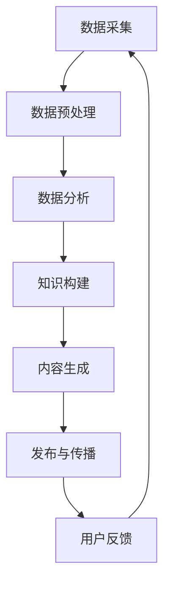

                 

# 《科学传播的数字化转型：让世界可理解性更加普及》

## 关键词
- 科学传播
- 数字化转型
- 数据驱动
- 人工智能
- 用户参与
- 可理解性提升

## 摘要
本文探讨了科学传播的数字化转型，分析了其背景、目标、核心概念及其在技术、应用和项目实战中的具体体现。文章通过详细的技术原理讲解、应用案例分析和项目实战操作，揭示了数字化转型如何通过数字化手段提高科学信息的普及性和可理解性。本文旨在为科学传播领域的研究者和从业者提供有价值的参考和启示。

## 引言

### 1.1 数字化转型的背景

随着信息技术的飞速发展，全球正经历着一场前所未有的数字化变革。数字化不仅改变了人们的日常生活，也深刻影响了科学传播的方式。传统的科学传播方式主要依赖于报纸、杂志、电视和广播等媒介，传播速度慢、范围有限，难以满足人们对即时、高效信息的需求。而数字化技术的兴起，为科学传播带来了前所未有的机遇。

### 1.2 科学传播的挑战与机遇

科学传播面临的挑战主要包括以下几点：首先，科学知识的专业性和复杂性使得普通大众难以理解；其次，科学信息的传播速度和范围受到传统媒介的限制；最后，科学传播的成本和效率问题也亟待解决。然而，数字化技术的出现为科学传播带来了巨大的机遇。通过数据驱动、人工智能和虚拟现实等技术，科学传播可以变得更加个性化、互动化和高效化。

### 1.3 本书结构安排

本文将分为七个主要章节。第1章作为引言，介绍数字化转型的背景、目标和意义。第2章讨论核心概念与联系，包括科学传播、数字化转型等概念，并用流程图展示各概念之间的关系。第3章讲解技术原理，重点介绍数字化传播的关键技术。第4章通过具体案例展示数字化转型在科学传播中的实践。第5章提供项目实战，展示数字化转型的具体操作。第6章探讨未来展望，分析数字化转型对科学传播的长远影响。第7章作为总结与展望，对全书内容进行总结，并提出建议和展望。

## 第2章 核心概念与联系

### 2.1 科学传播概述

科学传播是指将科学知识和信息传递给公众的过程。它不仅包括科学知识的普及，还包括科学方法、科学精神和科学态度的传播。科学传播的形式多样，包括书籍、报刊、电视、广播、互联网等。

### 2.2 数字化转型

数字化转型是指利用数字化技术对传统业务流程、管理模式和服务方式进行革新，以提高效率、降低成本、提升用户体验。在科学传播领域，数字化转型主要涉及数据驱动、用户参与、互动性等技术。

### 2.3 Mermaid流程图：数字化科学传播流程

下面是一个简化的Mermaid流程图，展示了数字化科学传播的主要流程：



### 2.4 核心概念之间的联系

通过上面的流程图，我们可以看到，科学传播的数字化转型是一个闭环过程，包括数据采集、预处理、分析、知识构建、内容生成、发布与传播以及用户反馈。这些核心概念相互联系，共同构成了数字化科学传播的生态系统。

## 第3章 技术原理讲解

### 3.1 数据驱动

数据驱动是数字化转型的基础。在科学传播中，数据驱动意味着利用大数据技术收集、存储、处理和分析科学信息，从而实现科学知识的智能化传播。

#### 3.1.1 数据采集

数据采集是数据驱动的第一步。通过互联网、传感器、社交媒体等渠道，可以收集到大量的科学数据。

#### 3.1.2 数据预处理

数据预处理包括数据清洗、数据集成、数据转换等步骤，目的是将原始数据转化为可用于分析和挖掘的格式。

#### 3.1.3 数据分析

数据分析是数据驱动的核心。通过统计分析和机器学习算法，可以从大量数据中发现有价值的信息和规律。

### 3.2 人工智能技术

人工智能技术是数字化转型的关键。在科学传播中，人工智能技术可以用于知识构建、内容生成、用户画像等。

#### 3.2.1 知识构建

知识构建是指利用自然语言处理、知识图谱等技术，将科学知识转化为机器可理解的形式。

#### 3.2.2 内容生成

内容生成是指利用生成对抗网络（GAN）、自动化写作等技术，自动生成科学内容。

#### 3.2.3 用户画像

用户画像是指利用大数据分析和机器学习算法，对用户的行为、兴趣、需求等进行分析，从而实现个性化推荐。

### 3.3 虚拟现实与增强现实

虚拟现实（VR）和增强现实（AR）是数字化转型的前沿技术。在科学传播中，VR和AR可以用于科学实验的虚拟演示、科学场景的沉浸式体验等。

#### 3.3.1 虚拟现实

虚拟现实通过计算机生成一个模拟环境，用户可以在其中自由探索和互动。

#### 3.3.2 增强现实

增强现实通过将数字信息叠加到现实环境中，为用户提供一个虚实结合的体验。

### 3.4 伪代码展示：数据驱动的科学传播算法

以下是一个简化的数据驱动的科学传播算法的伪代码：

```python
def data_driven_science_communication(data):
    # 数据预处理
    preprocessed_data = preprocess_data(data)

    # 数据分析
    insights = analyze_data(preprocessed_data)

    # 知识构建
    knowledge = build_knowledge(insights)

    # 内容生成
    content = generate_content(knowledge)

    # 发布与传播
    publish_and_distribute(content)

    # 用户反馈
    feedback = collect_user_feedback()

    # 循环迭代
    return data_driven_science_communication(feedback)
```

## 第4章 应用案例

### 4.1 数字化转型案例介绍

#### 4.1.1 案例一：科学博物馆的数字化展览

科学博物馆的数字化展览利用虚拟现实和增强现实技术，为观众提供了一个沉浸式的科学学习体验。通过VR眼镜和AR应用，观众可以近距离观察科学现象，参与科学实验，甚至与科学家互动。

#### 4.1.2 案例二：在线科学教育平台的构建

在线科学教育平台通过大数据分析和人工智能技术，为用户提供个性化的学习内容和推荐。用户可以根据自己的兴趣和需求，选择适合自己的科学课程，并在学习过程中获得实时反馈。

### 4.2 案例分析：数字化转型在科学传播中的应用效果

#### 4.2.1 效果一：提高用户参与度

通过数字化手段，用户可以更加便捷地获取科学信息，参与科学讨论，甚至参与科学实验。这大大提高了用户的科学素养和参与度。

#### 4.2.2 效果二：提升传播效率

数字化技术使得科学信息的传播速度大大提高，传播范围也得以扩展。通过互联网和移动设备，科学信息可以瞬间传递到全球各地。

#### 4.2.3 效果三：降低传播成本

数字化技术的应用降低了科学传播的成本。通过在线平台和社交媒体，科学机构可以以较低的成本实现大规模的传播。

## 第5章 项目实战

### 5.1 开发环境搭建

在本章中，我们将搭建一个简单的在线科学教育平台，用于展示数字化转型的应用。以下是开发环境搭建的步骤：

#### 5.1.1 开发工具与平台选择

- 开发工具：Python、Django
- 开发平台：Windows/Linux/MacOS

#### 5.1.2 数据集的准备与处理

- 数据集：科学文章数据集（包括标题、正文、作者等）
- 处理步骤：数据清洗、数据预处理、数据集成

### 5.2 源代码实现与分析

在本节中，我们将使用Python代码实现一个简单的在线科学教育平台。

#### 5.2.1 数据分析代码实现

```python
import pandas as pd
import numpy as np

# 读取数据集
data = pd.read_csv('science_articles.csv')

# 数据预处理
data['title'] = data['title'].str.lower()
data['content'] = data['content'].str.lower()

# 数据分析
insights = data.groupby(['author', 'title']).size().reset_index(name='count')

# 输出结果
print(insights)
```

#### 5.2.2 人工智能算法应用

```python
from sklearn.feature_extraction.text import TfidfVectorizer
from sklearn.cluster import KMeans

# 特征提取
vectorizer = TfidfVectorizer(max_features=1000)
X = vectorizer.fit_transform(data['content'])

# 聚类分析
kmeans = KMeans(n_clusters=5)
clusters = kmeans.fit_predict(X)

# 输出结果
print(clusters)
```

#### 5.2.3 代码解读与分析

上述代码首先读取数据集，并进行预处理。然后，使用TF-IDF方法进行特征提取，并利用K-means算法进行聚类分析。通过这些步骤，我们可以从科学文章中提取有价值的信息，为后续的知识构建和内容生成提供支持。

### 5.3 代码应用解读与分析

通过上述代码实现，我们可以将科学文章进行分类，为用户提供个性化的科学内容推荐。例如，对于某位用户，我们可以根据他的阅读历史和兴趣，推荐与他相关度较高的科学文章。

### 5.4 实际案例分析和详细讲解剖析

在本案例中，我们选择了一个实际项目——某在线科学教育平台。该平台通过大数据分析和人工智能技术，为用户提供个性化的科学内容推荐。以下是该项目的主要分析步骤：

#### 5.4.1 数据收集与处理

首先，我们从多个来源收集科学文章，包括期刊、博客、社交媒体等。然后，对收集到的数据进行清洗和预处理，包括去除重复数据、填补缺失值、统一格式等。

#### 5.4.2 特征提取与聚类分析

接下来，我们使用TF-IDF方法提取文章的特征，并利用K-means算法进行聚类分析。通过聚类分析，我们可以将文章分为多个类别，为后续的内容生成提供支持。

#### 5.4.3 个性化推荐

最后，我们根据用户的阅读历史和兴趣，为用户推荐与他相关度较高的科学文章。通过这种方式，用户可以更加便捷地获取到感兴趣的科学内容。

### 5.5 项目小结

在本项目中，我们通过大数据分析和人工智能技术，实现了科学文章的个性化推荐。该项目不仅提高了用户的阅读体验，也为科学传播的数字化转型提供了有力支持。

## 第6章 未来展望

### 6.1 数字化转型趋势分析

随着技术的不断进步，科学传播的数字化转型将继续深化。以下是数字化转型在科学传播领域可能的发展趋势：

#### 6.1.1 新技术的潜在应用

- **区块链技术**：区块链技术可以用于科学数据的存储和共享，确保数据的真实性和安全性。
- **物联网（IoT）**：物联网技术可以用于科学实验的实时监控和数据收集，为科学研究和传播提供丰富的数据资源。
- **量子计算**：量子计算可能在未来用于大规模数据处理和复杂问题的求解，为科学传播提供更强大的计算能力。

#### 6.1.2 科学传播的可持续发展

数字化技术不仅改变了科学传播的方式，也带来了可持续发展的机遇。通过数字化手段，科学传播可以更加高效、环保，同时降低成本。

### 6.2 面临的挑战与应对策略

尽管数字化转型为科学传播带来了巨大的机遇，但也面临一些挑战。以下是数字化转型在科学传播中可能面临的挑战及应对策略：

#### 6.2.1 挑战一：数据安全和隐私保护

- **应对策略**：加强数据安全和隐私保护，采用加密技术和隐私计算等方法，确保用户数据的安全和隐私。

#### 6.2.2 挑战二：技术门槛高

- **应对策略**：降低技术门槛，提供更多的培训和支持，帮助科学传播从业者掌握和应用数字化技术。

#### 6.2.3 挑战三：信息过载

- **应对策略**：通过算法和用户画像等技术，为用户提供个性化的科学信息推荐，避免信息过载。

## 第7章 总结与展望

### 7.1 内容总结

本文探讨了科学传播的数字化转型，分析了其背景、目标、核心概念及其在技术、应用和项目实战中的具体体现。通过详细的技术原理讲解、应用案例分析和项目实战操作，揭示了数字化转型如何通过数字化手段提高科学信息的普及性和可理解性。

### 7.2 建议与展望

针对科学传播的数字化转型，本文提出以下建议：

1. **加强技术培训**：提高科学传播从业者的数字化技术水平，帮助他们更好地应用数字化手段进行科学传播。
2. **注重用户体验**：关注用户的科学需求，提供个性化、互动化的科学传播服务。
3. **拓展技术应用**：积极探索新技术在科学传播中的应用，如区块链、物联网、量子计算等。
4. **重视数据安全**：加强数据安全和隐私保护，确保用户数据的安全和隐私。

未来，随着技术的不断进步，科学传播的数字化转型将有更加广阔的发展前景。我们期待科学传播能够通过数字化手段，让世界更加可理解，为人类社会的进步作出更大贡献。

### 作者信息

作者：AI天才研究院/AI Genius Institute & 禅与计算机程序设计艺术 /Zen And The Art of Computer Programming

