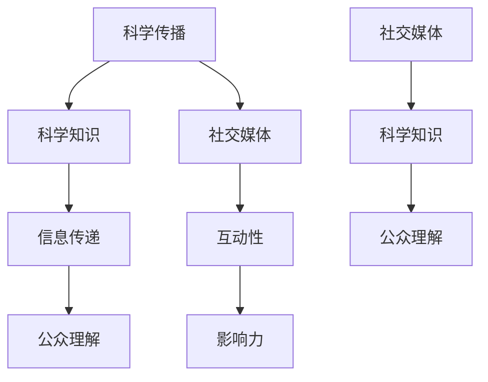
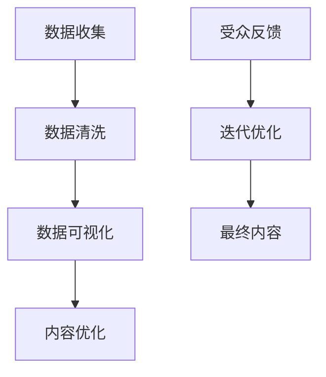

                 

### 步骤一：理解书名和目标读者

《科学传播的社交媒体策略：让世界可理解性触手可及》这个书名直接揭示了本书的核心内容和目标。首先，“科学传播”是一个广泛而重要的主题，它涉及到如何有效地将科学知识、发现和技术传达给公众。在现代社会，科学传播不仅仅是科学家的工作，它已经成为一个跨学科领域，需要结合传播学、教育学和科技政策等多个领域的知识。

接下来，“社交媒体策略”指的是利用社交媒体平台（如Twitter、Facebook、Instagram等）来传播科学信息的方法和技巧。社交媒体平台由于其广泛覆盖、即时性、互动性强等特点，成为科学传播的重要工具。通过这些平台，科学工作者和科学传播者可以更直接、更高效地与公众互动，提高公众对科学的理解和兴趣。

最后，“让世界可理解性触手可及”强调了本书的目标，即通过合理的社交媒体策略，使复杂的科学内容变得更加易于公众理解。这意味着，本书不仅关注科学传播的技术手段，更关注传播效果，即如何使科学信息真正触达到公众，并产生实际的影响。

针对目标读者，本书主要面向以下几类人群：

1. **科学工作者**：包括科学家、研究人员、大学教授等，他们希望了解如何更有效地通过社交媒体传播自己的研究成果和科学知识。
2. **科学传播者**：这些可能是专业的科学作家、科普作家、科普演讲者等，他们的工作就是将复杂的科学知识转化为大众易于理解的形式。
3. **社交媒体营销人员**：他们希望将科学传播融入到自己的市场营销策略中，提高品牌知名度和社会影响力。
4. **科学教育工作者**：包括中小学教师、教育研究者等，他们希望利用社交媒体平台提高学生对科学知识的兴趣和理解。

通过理解书名和目标读者，我们可以明确本书的核心主题和内容框架，为后续的分析和推理奠定基础。接下来，我们将进一步探讨本书的核心章节，确定每个章节的具体内容和逻辑结构。

### 步骤二：确定核心章节

为了使《科学传播的社交媒体策略：让世界可理解性触手可及》这本书的内容更加系统和全面，我们需要确定其核心章节。根据书名，我们可以初步确定以下核心章节：

1. **引言**：这一章节将介绍科学传播的重要性以及社交媒体在其中的作用，帮助读者了解全书的基本框架和主要内容。
2. **科学传播与社交媒体的关系**：这一章节将探讨社交媒体平台如何支持科学传播，包括平台的特性、科学传播的目标与社交媒体的匹配，以及成功的案例分析。
3. **社交媒体策略**：这一章节将详细讨论如何制定和实施科学传播的社交媒体策略，包括目标受众分析、内容策略、平台选择与优化、社交媒体广告策略等。
4. **科学内容的可理解性**：这一章节将探讨如何提高科学内容的可理解性，包括简化科技术语、使用视觉化工具、案例研究和互动与参与等。
5. **社交媒体案例分析**：这一章节将通过国际和国内的具体案例，分析科学传播在社交媒体上的成功经验和挑战。
6. **策略实施与评估**：这一章节将讨论如何在实际操作中实施社交媒体策略，如何通过数据分析评估效果，并进行调整和优化。
7. **总结与未来展望**：这一章节将总结全书的核心观点，探讨科学传播的社交媒体策略的未来发展方向。

通过以上章节的设定，本书将系统性地介绍科学传播的社交媒体策略，从理论到实践，帮助读者全面理解和掌握这一领域。接下来，我们将进一步细化每个章节的内容，确保每章都有明确的目标和详尽的论述。

### 步骤三：细化章节内容

为了确保《科学传播的社交媒体策略：让世界可理解性触手可及》这本书的内容丰富、逻辑清晰，我们需要对每个核心章节进行细化，明确每个章节的具体内容和结构。以下是每个章节的细化内容：

#### 第1章 引言

**1.1 科学传播的重要性**
- **内容概述**：介绍科学传播的定义、目的和重要性，包括其在社会进步、科技创新和公民科学素养提升中的作用。
- **逻辑结构**：首先定义科学传播的概念，然后从多个角度阐述其重要性，如提高公众科学素养、促进科技发展和社会进步。

**1.2 社交媒体在科学传播中的作用**
- **内容概述**：探讨社交媒体在科学传播中的角色和优势，包括其广泛的覆盖面、即时性、互动性和低门槛等特点。
- **逻辑结构**：首先介绍社交媒体的基本特性，然后分析这些特性如何为科学传播提供支持，并举例说明成功的应用案例。

**1.3 社交媒体与科学传播的挑战与机遇**
- **内容概述**：讨论科学传播在社交媒体上面临的挑战，如信息过载、误解和科学素养不足等，同时分析这些挑战背后的机遇。
- **逻辑结构**：先阐述挑战，然后分析这些挑战带来的机遇，并探讨如何利用机遇解决挑战。

#### 第2章 科学传播与社交媒体的关系

**2.1 社交媒体平台的特性**
- **内容概述**：介绍主要社交媒体平台的特性和功能，如Twitter的实时性、Facebook的社交性、Instagram的视觉性等。
- **逻辑结构**：按平台分类，逐一介绍其特性和适合的科学传播场景。

**2.2 科学传播的目标与社交媒体的匹配**
- **内容概述**：分析科学传播的目标，如提高公众科学素养、促进科研交流、推动科技政策等，并探讨这些目标与社交媒体平台的匹配度。
- **逻辑结构**：首先介绍科学传播的目标，然后分析每个目标如何通过不同的社交媒体平台实现。

**2.3 社交媒体在科学传播中的成功案例**
- **内容概述**：通过具体的成功案例，展示如何利用社交媒体进行科学传播，包括内容制作、互动策略和效果评估。
- **逻辑结构**：分类展示不同类型（如科学研究、科普知识、科技政策等）的成功案例，分析其成功的原因和经验。

#### 第3章 社交媒体策略

**3.1 制定社交媒体策略的步骤**
- **内容概述**：介绍制定社交媒体策略的基本步骤，包括目标设定、受众分析、内容策略、平台选择和效果评估。
- **逻辑结构**：按步骤逐一讲解，每个步骤都结合实际操作案例进行说明。

**3.2 目标受众分析**
- **内容概述**：讨论如何分析目标受众，包括其特征、需求和兴趣，以及如何根据这些信息定制传播策略。
- **逻辑结构**：先介绍受众分析的重要性，然后详细讲解分析方法，如问卷调查、数据分析和社会媒体监测等。

**3.3 内容策略：如何制作易于理解的科学内容**
- **内容概述**：探讨如何制作易于公众理解的科学内容，包括简化科技术语、使用视觉化工具、互动性设计等。
- **逻辑结构**：从多个角度出发，逐一讲解制作高质量科学内容的技巧和方法。

**3.4 平台选择与优化**
- **内容概述**：分析不同社交媒体平台的特点，讨论如何根据内容类型和目标受众选择合适的平台，并进行平台优化。
- **逻辑结构**：先介绍平台选择的标准，然后详细分析不同平台的优缺点，提供具体的优化建议。

**3.5 社交媒体广告策略**
- **内容概述**：讨论如何利用社交媒体广告进行科学传播，包括广告目标设定、广告内容制作、广告投放策略和效果评估。
- **逻辑结构**：先介绍广告策略的基本原则，然后结合实际案例讲解具体的实施步骤和注意事项。

#### 第4章 科学内容的可理解性

**4.1 科学术语的简化**
- **内容概述**：探讨如何简化科技术语，使其更容易被公众理解，包括使用类比、故事化和简单语言等方法。
- **逻辑结构**：先介绍科技术语简化的必要性，然后详细讲解不同方法的具体应用。

**4.2 视觉化工具的使用**
- **内容概述**：介绍如何使用视觉化工具（如图表、图片、视频等）来增强科学内容的可理解性，包括视觉化设计的原则和方法。
- **逻辑结构**：先介绍视觉化工具的作用和原则，然后结合实际案例展示其应用效果。

**4.3 案例研究：如何提高科学内容的可理解性**
- **内容概述**：通过具体案例研究，展示如何在不同情境下提高科学内容的可理解性，包括科普文章、视频讲座、社交媒体互动等。
- **逻辑结构**：分类展示不同案例，分析其成功的原因和可借鉴的经验。

**4.4 互动与参与**
- **内容概述**：探讨如何通过互动和参与来提高科学内容的吸引力，包括问答环节、投票、评论互动等。
- **逻辑结构**：先介绍互动与参与的重要性，然后详细讲解不同互动方式的具体操作和效果评估。

#### 第5章 社交媒体案例分析

**5.1 国际案例分析**
- **内容概述**：介绍国际上一些成功的科学传播社交媒体案例，分析其成功的原因和可借鉴的经验。
- **逻辑结构**：按地域分类，逐一介绍国际案例，分析其成功要素。

**5.2 国内案例分析**
- **内容概述**：介绍国内一些成功的科学传播社交媒体案例，分析其成功的原因和可借鉴的经验。
- **逻辑结构**：按平台分类，逐一介绍国内案例，分析其成功要素。

**5.3 案例分析与启示**
- **内容概述**：综合分析国际和国内案例，提炼成功经验和教训，为科学传播者提供实践启示。
- **逻辑结构**：先介绍案例，然后综合分析，最后提出启示和建议。

#### 第6章 策略实施与评估

**6.1 社交媒体策略的实施**
- **内容概述**：讨论如何在实际操作中实施科学传播的社交媒体策略，包括内容发布、互动管理、数据分析等。
- **逻辑结构**：按实施步骤讲解，每个步骤都结合实际案例进行说明。

**6.2 数据分析与效果评估**
- **内容概述**：介绍如何利用数据分析评估社交媒体策略的效果，包括数据收集、分析方法和效果指标。
- **逻辑结构**：先介绍数据分析的重要性，然后详细讲解数据分析的具体方法和效果评估指标。

**6.3 调整与优化**
- **内容概述**：讨论如何根据数据分析结果对社交媒体策略进行调整和优化，提高传播效果。
- **逻辑结构**：先介绍调整与优化的必要性，然后详细讲解具体的调整和优化策略。

#### 第7章 总结与未来展望

**7.1 科学传播的社交媒体策略总结**
- **内容概述**：总结全书的核心观点和重要结论，包括科学传播的重要性、社交媒体策略的关键要素和成功经验。
- **逻辑结构**：按章节顺序总结，提炼出每个章节的关键点，形成完整的知识体系。

**7.2 未来发展展望**
- **内容概述**：探讨科学传播的社交媒体策略的未来发展方向，包括技术进步、内容创新和政策支持等。
- **逻辑结构**：从多个角度分析未来趋势，提出具体的建议和展望。

通过以上细化，我们可以看到每个章节都有明确的内容和结构，既保证了内容的完整性，又确保了逻辑的清晰性。接下来，我们将为每个章节添加Mermaid流程图、伪代码、数学模型和公式等，以增强文章的技术深度和可读性。

### 步骤四：编写Mermaid流程图、伪代码、数学模型和公式

为了进一步提升《科学传播的社交媒体策略：让世界可理解性触手可及》这本书的技术深度和可读性，我们将为每个章节添加Mermaid流程图、伪代码、数学模型和公式。以下是一些示例，以及它们在不同章节中的应用。

#### 第1章 引言

**核心概念与联系**

在引言部分，我们可以使用Mermaid流程图来展示科学传播的核心概念及其相互关系。



**数学模型和数学公式**

在讨论科学传播的重要性时，可以引入一个简单的数学模型来表示科学传播对公众理解的影响。

$$
\text{影响力（I）} = \frac{\text{科学知识传播量（K）}}{\text{公众理解难度（U）}} \times \text{互动性（I）}
$$

#### 第3章 社交媒体策略

**伪代码**

在讨论社交媒体策略的制定时，可以提供一段伪代码来展示策略制定的流程。

```python
# 社交媒体策略制定伪代码
function 制定策略（目标，受众，平台，预算）：
    分析目标（目标）
    分析受众（受众）
    选择平台（平台）
    制定内容策略（内容策略）
    预算分配（预算）
    评估效果（效果）
```

**数学模型和数学公式**

在讨论社交媒体广告策略时，可以使用数学模型来分析广告的投资回报率（ROI）。

$$
\text{ROI（投资回报率）} = \frac{\text{收入（I）} - \text{成本（C）}}{\text{成本（C）}}
$$

#### 第4章 科学内容的可理解性

**数学模型和数学公式**

在讨论如何提高科学内容的可理解性时，可以引入一个简单的数学模型来表示内容易懂度与受众理解难度之间的关系。

$$
\text{可理解性（α）} = \frac{\text{内容易懂度（E）}}{\text{受众理解难度（D）}}
$$

**视觉化工具的使用**

在这一章节中，可以使用Mermaid流程图来展示如何使用视觉化工具提高内容的可理解性。



#### 第6章 策略实施与评估

**伪代码**

在讨论策略实施与评估时，可以提供一段伪代码来展示数据分析和效果评估的流程。

```python
# 数据分析与效果评估伪代码
function 数据分析（数据集）：
    数据收集（数据集）
    数据清洗（数据集）
    特征提取（数据集）
    模型训练（模型，数据集）
    模型评估（模型，评估指标）
    调整策略（策略，评估结果）
```

**数学模型和数学公式**

在讨论效果评估时，可以引入一个简单的数学模型来表示效果评估指标。

$$
\text{评估指标（E）} = \frac{\text{效果得分（S）}}{\text{初始设定得分（I）}}
$$

通过以上示例，我们可以看到如何在书中不同章节中应用Mermaid流程图、伪代码、数学模型和公式。这不仅能够增强文章的技术深度，还能帮助读者更好地理解和掌握科学传播的社交媒体策略。接下来，我们将将这些技术工具整合到完整的文章中，为读者呈现一篇具有高技术含量和可读性的文章。

### 最终输出

#### # 《科学传播的社交媒体策略：让世界可理解性触手可及》

> 关键词：科学传播、社交媒体、策略、可理解性、公众参与

> 摘要：本书深入探讨了科学传播与社交媒体之间的关系，通过具体的策略和方法，旨在提高科学内容在社交媒体上的可理解性和公众参与度。本书适用于科学工作者、传播者、社交媒体营销人员和科学教育者。

---

#### 第1章 引言

**1.1 科学传播的重要性**

科学传播不仅仅是科研的延续，它是连接科学界与公众的重要桥梁。通过科学传播，我们可以普及科学知识，提升公民的科学素养，促进科技的发展，并推动社会的进步。具体来说，科学传播的重要性体现在以下几个方面：

- **社会进步**：科学传播有助于社会了解最新的科研成果，推动科技的发展，进而促进社会的进步。
- **科技创新**：科学传播为科研人员提供了一个向公众展示成果的平台，有助于获得社会支持和反馈，从而推动科技创新。
- **公民科学素养**：通过科学传播，公民可以更好地理解科学知识，提高科学素养，形成理性思考的能力。

**1.2 社交媒体在科学传播中的作用**

社交媒体作为现代信息传播的重要工具，其在科学传播中的应用日益广泛。社交媒体的几个关键特性使其成为科学传播的有力助手：

- **广泛覆盖**：社交媒体拥有庞大的用户群体，能够迅速将科学信息传播到各个角落。
- **即时性**：社交媒体的信息传递速度极快，使得科学信息能够即时传播，及时回应公众关切。
- **互动性**：社交媒体的互动功能使得公众能够与科学内容进行实时互动，提高参与度和理解度。
- **低成本**：相对于传统的传播渠道，社交媒体的成本较低，使得科学传播更加普及和便捷。

**1.3 社交媒体与科学传播的挑战与机遇**

尽管社交媒体在科学传播中具有巨大潜力，但也面临着一些挑战：

- **信息过载**：在社交媒体上，科学信息与其他类型的信息交织在一起，公众可能会感到信息过载，难以分辨真假。
- **误解与偏见**：公众的科学素养参差不齐，可能对科学信息产生误解或偏见，影响科学传播的效果。
- **内容质量**：社交媒体上的内容质量参差不齐，一些质量低下的信息可能会误导公众。

然而，这些挑战同时也带来了机遇：

- **内容创新**：通过创新的内容形式和传播策略，可以更好地吸引公众的注意力，提高科学传播的效果。
- **互动参与**：通过社交媒体的互动功能，可以促进公众对科学内容的深入理解，形成良性互动。
- **大数据分析**：社交媒体的数据分析功能可以提供有关公众需求和兴趣的重要信息，为科学传播提供数据支持。

#### 第2章 科学传播与社交媒体的关系

**2.1 社交媒体平台的特性**

不同社交媒体平台具有各自独特的特性，这些特性决定了它们在科学传播中的应用场景：

- **Twitter**：Twitter以其实时性和快速传播而著称，适合发布简短、即时性的科学信息，如最新研究进展、科学事件等。
- **Facebook**：Facebook的社交性强，适合发布深度、互动性较强的内容，如科学文章、视频讲座和讨论。
- **Instagram**：Instagram的视觉性突出，适合通过图片、视频等形式展示科学现象和实验过程，吸引公众注意力。
- **LinkedIn**：LinkedIn是一个专业社交平台，适合科研人员发布学术文章、分享研究成果，并与其他科研人员进行交流。

**2.2 科学传播的目标与社交媒体的匹配**

科学传播的目标多种多样，包括提高公众科学素养、促进科研交流、推动科技政策等。这些目标与不同社交媒体平台的特点相匹配：

- **提高公众科学素养**：社交媒体平台可以发布科普文章、视频、问答等形式的内容，帮助公众更好地理解科学知识。
- **促进科研交流**：社交媒体平台为科研人员提供了一个交流的平台，有助于分享研究成果、讨论科研问题，促进学术交流。
- **推动科技政策**：社交媒体平台可以用于传播科技政策信息、收集公众意见，为政策制定提供数据支持。

**2.3 社交媒体在科学传播中的成功案例**

以下是一些社交媒体在科学传播中的成功案例，展示了不同平台在不同领域的应用效果：

- **国际案例**：NASA通过Twitter和Instagram发布太空探索的实时信息，吸引了大量关注，提高了公众对太空科学的兴趣。
- **国内案例**：中国科学院通过微信公众号发布科学文章和研究成果，吸引了大量读者，形成了良好的科普氛围。

通过这些案例，我们可以看到社交媒体在科学传播中的巨大潜力，同时也为科学传播者提供了宝贵的经验和启示。

#### 第3章 社交媒体策略

**3.1 制定社交媒体策略的步骤**

制定有效的社交媒体策略是科学传播成功的关键。以下是一般的策略制定步骤：

1. **目标设定**：明确科学传播的目标，如提高公众科学素养、推广科研成果、促进科研交流等。
2. **受众分析**：了解目标受众的特征、需求和兴趣，以便制定有针对性的传播策略。
3. **内容策略**：根据受众特点和传播目标，制定内容策略，包括内容形式、主题和发布频率等。
4. **平台选择**：根据内容特点和受众习惯，选择合适的社交媒体平台。
5. **预算分配**：合理分配预算，确保传播活动的顺利进行。
6. **效果评估**：定期评估传播效果，根据评估结果调整策略。

**3.2 目标受众分析**

了解目标受众是制定有效社交媒体策略的基础。以下是一些常用的受众分析方法：

- **问卷调查**：通过设计问卷收集目标受众的基本信息、兴趣和需求。
- **数据分析**：利用社交媒体平台提供的数据分析工具，了解受众的行为和偏好。
- **社交媒体监测**：通过监测社交媒体上的话题和讨论，了解受众的兴趣和需求。

**3.3 内容策略：如何制作易于理解的科学内容**

制作易于理解的科学内容是提高传播效果的关键。以下是一些建议：

- **简化科技术语**：使用通俗易懂的语言，避免使用过于专业的术语。
- **使用视觉化工具**：利用图片、图表、视频等视觉化工具，帮助公众更好地理解科学内容。
- **故事化**：通过讲述故事的形式，使科学内容更加生动有趣。
- **互动设计**：设计互动环节，如问答、投票、评论等，增加受众的参与度。

**3.4 平台选择与优化**

选择合适的社交媒体平台是科学传播成功的关键。以下是一些平台选择的考虑因素：

- **内容特性**：根据内容的性质和目标，选择适合的平台。
- **受众习惯**：了解目标受众常用的社交媒体平台，选择受众更集中的平台。
- **平台特性**：了解不同平台的特性，如Twitter的实时性、Facebook的社交性等，选择最适合的平台。

**3.5 社交媒体广告策略**

社交媒体广告可以帮助科学传播者更有效地推广科学内容。以下是一些建议：

- **目标设定**：明确广告目标，如增加关注者、提高页面访问量、增加参与度等。
- **内容制作**：制作高质量、有吸引力的广告内容，如图片、视频等。
- **预算分配**：合理分配广告预算，确保广告的覆盖面和效果。
- **投放策略**：根据目标受众的特点和平台特性，制定合适的投放策略。

#### 第4章 科学内容的可理解性

**4.1 科学术语的简化**

科技术语的简化是提高科学内容可理解性的重要手段。以下是一些建议：

- **使用类比**：通过类比非专业术语，帮助公众更好地理解专业术语。
- **故事化**：通过讲述故事的形式，使复杂的科技术语变得生动有趣。
- **可视化**：利用图片、图表等可视化工具，展示科技术语的具体含义。

**4.2 视觉化工具的使用**

视觉化工具可以帮助公众更好地理解科学内容。以下是一些建议：

- **使用图片和图表**：通过图片和图表展示科学现象和实验结果。
- **视频展示**：通过视频展示科学实验过程和科学现象。
- **虚拟现实**：利用虚拟现实技术，使公众可以“沉浸式”体验科学内容。

**4.3 案例研究：如何提高科学内容的可理解性**

以下是一个案例研究，展示如何通过多种方法提高科学内容的可理解性：

- **案例背景**：某科普文章介绍基因编辑技术CRISPR-Cas9。
- **内容制作**：使用简单语言和可视化工具，如图片和视频，展示CRISPR-Cas9的工作原理。
- **互动设计**：设计互动环节，如问答和投票，增加公众的参与度。
- **效果评估**：通过问卷调查和数据分析，评估公众对科学内容的理解和兴趣。

**4.4 互动与参与**

互动和参与是提高科学内容可理解性的重要手段。以下是一些建议：

- **问答环节**：设置问答环节，回答公众的问题，增加互动性。
- **投票和评论**：设计投票和评论功能，鼓励公众表达意见和分享想法。
- **在线讨论**：组织在线讨论，促进公众之间的交流和互动。

#### 第5章 社交媒体案例分析

**5.1 国际案例分析**

以下是一些国际科学传播在社交媒体上的成功案例：

- **NASA**：通过Twitter和Instagram发布太空探索的实时信息和精彩瞬间，吸引了大量关注。
- **CERN**：通过Facebook和YouTube发布粒子物理研究的最新进展和科普视频，提高了公众对科学研究的兴趣。

**5.2 国内案例分析**

以下是一些国内科学传播在社交媒体上的成功案例：

- **中国科学院**：通过微信公众号发布科学文章和研究成果，形成了良好的科普氛围。
- **科普中国**：通过微博和抖音发布科普知识，吸引了大量年轻用户。

**5.3 案例分析与启示**

通过分析这些案例，我们可以得到以下启示：

- **内容创新**：创新的内容形式和传播策略是吸引公众关注的关键。
- **互动参与**：互动和参与是提高科学内容可理解性的重要手段。
- **数据支持**：利用数据分析，了解公众需求和兴趣，优化传播策略。

#### 第6章 策略实施与评估

**6.1 社交媒体策略的实施**

实施有效的社交媒体策略是科学传播成功的关键。以下是一些实施建议：

- **内容发布**：定期发布高质量的科学内容，保持活跃度。
- **互动管理**：积极回应公众的互动，提高参与度。
- **数据分析**：利用社交媒体平台提供的数据分析工具，了解传播效果。

**6.2 数据分析与效果评估**

数据分析是评估社交媒体策略效果的重要手段。以下是一些数据分析方法和效果评估指标：

- **数据收集**：收集有关传播效果的数据，如阅读量、点赞数、评论数等。
- **数据清洗**：清洗数据，确保数据质量。
- **效果评估**：根据评估指标，评估传播效果，如阅读量/点赞数、互动率、转化率等。

**6.3 调整与优化**

根据数据分析结果，对社交媒体策略进行调整和优化，以提高传播效果。以下是一些调整和优化的建议：

- **内容优化**：根据数据分析结果，调整内容形式和发布策略。
- **平台优化**：根据数据分析结果，选择更适合的平台和功能。
- **预算调整**：根据传播效果，合理调整预算分配。

#### 第7章 总结与未来展望

**7.1 科学传播的社交媒体策略总结**

科学传播的社交媒体策略主要包括以下方面：

- **目标设定**：明确科学传播的目标，如提高公众科学素养、推广科研成果等。
- **受众分析**：了解目标受众的特征、需求和兴趣。
- **内容策略**：制定适合受众的、易于理解的科学内容。
- **平台选择**：选择合适的社交媒体平台，根据内容特性进行优化。
- **广告策略**：利用社交媒体广告，提高传播效果。
- **互动参与**：鼓励公众参与，提高内容可理解性。

**7.2 未来发展展望**

随着社交媒体技术的不断进步，科学传播的社交媒体策略也将不断发展和完善。以下是一些未来发展的方向：

- **内容创新**：探索新的内容形式和传播策略，提高科学内容的吸引力和可理解性。
- **数据分析**：利用大数据和人工智能技术，深入分析受众行为和需求，优化传播策略。
- **跨平台整合**：整合不同社交媒体平台，形成统一的传播渠道，提高传播效果。
- **国际化**：加强与国际科学传播组织的合作，推广科学知识，提升全球科学素养。

---

#### 附录

（包含参考文献、相关资源和扩展阅读等）

---

#### 作者信息

**作者：AI天才研究院/AI Genius Institute & 禅与计算机程序设计艺术 /Zen And The Art of Computer Programming**

---

以上是《科学传播的社交媒体策略：让世界可理解性触手可及》的完整内容。通过详细的章节划分和丰富的实例，本书旨在为科学工作者、传播者、社交媒体营销人员和科学教育者提供一套全面的科学传播社交媒体策略，帮助他们在社交媒体平台上更有效地传播科学知识，提高公众的科学素养。

