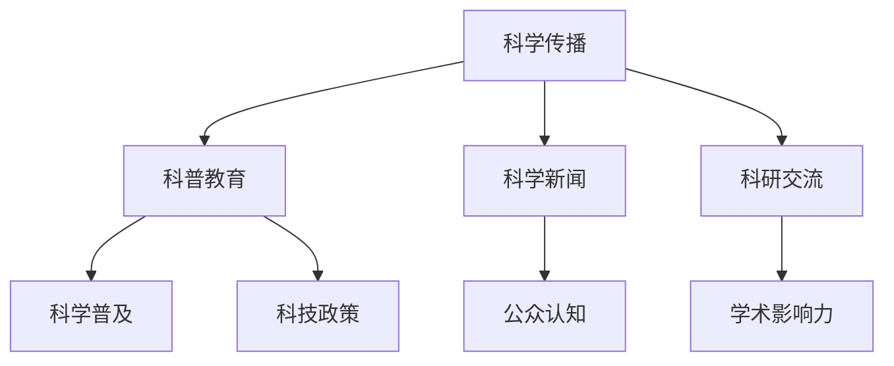
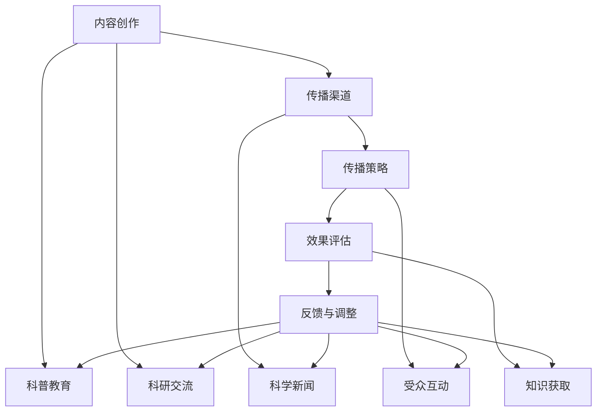

                 

### 引言

科学传播是一种将科学知识、研究成果和科学方法传达给公众的过程。它不仅仅涉及科学内容本身的传递，更包括如何让这些内容被公众理解和接受。在当今信息爆炸的时代，科学传播的重要性愈发凸显。一方面，公众对于科学知识和科学进展的需求日益增长；另一方面，科学家与公众之间的沟通障碍也日益明显。因此，如何有效地进行科学传播，成为了一个亟待解决的问题。

《科学传播的艺术：让世界可理解性触手可及》这本书旨在探讨科学传播的各个方面，从基础概念到实际操作，提供了一套系统的、易于理解的传播方法。作者通过深入研究科学传播的理论和实践，总结出了一系列有效的传播技巧和策略，帮助读者更好地理解和传播科学知识。

本文将围绕这本书的核心内容和主题思想，进行逐步分析和讨论。首先，我们将介绍科学传播的基本概念、目标和原则。接着，我们将探讨科学传播的流程与框架，以及如何通过内容创作、传播渠道和效果评估来实现有效的科学传播。随后，我们将详细分析科普写作的技巧，并介绍如何利用多媒体传播工具提升科学传播效果。此外，我们还将探讨社交媒体在科学传播中的作用，以及如何通过教育与科学传播来提升公众的科学素养。最后，我们将通过具体的实践案例，展示科学传播的成功和失败经验，并讨论科学传播的未来发展趋势。

通过这一系列的讨论和分析，我们希望读者能够更深入地理解科学传播的本质和艺术，掌握科学传播的有效方法和技巧，从而让科学知识更加触手可及，让世界变得更加可理解。在接下来的内容中，我们将一步步地揭开科学传播的艺术面纱，带领读者走进这个充满挑战和机遇的领域。

### 核心概念与联系

科学传播涉及多个核心概念，它们共同构成了科学传播的理论基础和实践框架。首先，我们需要明确几个关键术语的定义：

**科学传播**：指将科学知识、研究成果和科学方法通过各种媒介和渠道传递给公众的过程。科学传播不仅仅是信息的传递，更重要的是要让公众理解和接受这些知识。

**科普教育**：科普教育是指通过科学教育使公众了解科学知识、方法和精神的一种教育形式。它与正规的科学教育不同，更注重科学素养的普及和科学精神的培养。

**科学新闻**：科学新闻是指媒体报道中的科学内容，包括科学研究成果、科学事件和科学政策等。科学新闻在科学传播中起到了桥梁作用，将科学知识及时传递给公众。

**科研交流**：科研交流是指科学家之间通过会议、论文发表和其他形式进行的交流与合作。科研交流是科学知识不断积累和发展的关键。

这些概念之间的关系可以通过一个Mermaid流程图来展示：



- **科学传播**是整个流程的起点，它涵盖了从科研到科普的所有环节。
- **科普教育**与**科学传播**紧密相关，它是科学传播的重要组成部分，旨在提升公众的科学素养。
- **科学新闻**作为**科学传播**的一部分，通过媒体报道将科学知识及时传达给公众。
- **科研交流**则是科学知识不断积累和发展的关键环节，它促进了科学界内部的协作和进步。
- **科学普及**和**科技政策**是**科普教育**的两个重要方向，前者注重科学素养的提升，后者关注科学在社会中的应用和影响。
- **公众认知**和**学术影响力**是科学传播的最终目标，前者反映了公众对科学知识的理解和接受程度，后者衡量了科学传播在学术界和社会的影响力。

通过这个流程图，我们可以更清晰地看到科学传播的核心概念之间的联系和作用。这些概念相互交织，共同构成了科学传播的复杂网络，为科学知识的传播和普及提供了理论基础和实践指导。

### 科学传播的流程与框架

科学传播是一个系统工程，涉及多个环节和步骤，这些环节和步骤共同构成了科学传播的流程与框架。以下是科学传播的基本流程：

**1. 内容创作**：科学传播的第一步是内容的创作。这一阶段需要科学家、科普作家和其他专业人士共同努力，将复杂的科学知识转化为易于理解的科普内容。在这个过程中，需要遵循以下几个原则：

   - **清晰性**：语言要简洁明了，避免专业术语和复杂句式。
   - **故事性**：使用故事来讲述科学，使内容更具吸引力和可读性。
   - **实用性**：内容应贴近实际，解决公众关心的科学问题。

**2. 传播渠道**：内容创作完成后，需要选择合适的传播渠道进行传播。传播渠道的选择应考虑目标受众、内容形式和传播效果。常见的传播渠道包括：

   - **传统媒体**：如报纸、杂志、电视和广播。
   - **新兴媒体**：如互联网、社交媒体、视频网站和博客。
   - **现场活动**：如科普讲座、展览和研讨会。
   - **出版物**：如科普书籍、手册和小册子。

**3. 传播策略**：科学传播的传播策略是指如何有效地将内容传递给目标受众。传播策略应考虑以下几个因素：

   - **目标受众**：明确目标受众的特点和需求，以便制定针对性的传播方案。
   - **传播方式**：结合内容形式和传播渠道，选择最适合的传播方式，如文字、图片、视频或互动式内容。
   - **互动性**：增加与受众的互动，如问答环节、讨论区和评论区，以提高受众的参与度和兴趣。

**4. 效果评估**：科学传播的效果评估是检验传播效果的重要手段。评估内容应包括：

   - **传播范围**：内容传播的覆盖范围和受众数量。
   - **受众反应**：受众对内容的反应，如点赞、评论和分享次数。
   - **知识获取**：受众对内容的理解和知识获取情况。
   - **行为改变**：受众在接触内容后的行为变化，如对科学的兴趣增加、参与科学活动等。

**5. 反馈与调整**：根据效果评估的结果，对传播策略进行反馈和调整。反馈和调整的过程是一个循环，通过不断优化传播策略，提高科学传播的效果。

### 科学传播中的核心概念联系图

为了更直观地展示科学传播中的核心概念及其相互关系，我们可以使用Mermaid流程图来描述：



- **内容创作**是科学传播的基础，决定了传播的质量和效果。
- **传播渠道**和**传播策略**是实现内容传播的关键，它们共同决定了内容的覆盖范围和受众参与度。
- **效果评估**和**反馈与调整**是不断优化传播过程的重要手段，通过这些环节，可以不断提高科学传播的效果。
- **科普教育**和**科研交流**是科学传播的两个重要方向，前者注重科学素养的普及，后者关注科学知识的积累和发展。
- **科学新闻**在科学传播中起到了信息桥梁的作用，将科学研究成果及时传递给公众。
- **受众互动**和**知识获取**是评估科学传播效果的重要指标，它们反映了受众对科学内容的理解和接受程度。

通过这个流程图，我们可以清晰地看到科学传播中各个核心概念之间的相互关系和作用，从而为科学传播的实践提供指导。

### 科普写作技巧

科普写作是将科学知识以易于理解的方式传达给普通公众的一项重要任务。要成功地完成这一任务，科普作家需要掌握一系列技巧，包括简化复杂概念、使用故事讲述科学、避免行话和术语、以及巧妙地使用图表和图像等。

**简化复杂概念**：科学知识往往具有复杂性，而科普的目标是让这些知识变得简单易懂。简化复杂概念的关键在于：

   - **类比法**：通过将复杂概念与日常生活中的常见事物进行类比，使读者更容易理解。例如，将DNA的结构类比为城市中的道路系统，可以帮助读者更好地理解基因的运作方式。
   - **分步讲解**：将复杂的概念分解成多个简单的部分，逐步讲解，以便读者能够逐步理解。例如，讲解量子力学时，可以先从量子态的基础概念开始，再逐步引入更复杂的概念，如叠加态和纠缠态。
   - **视觉辅助**：使用图像、图表和动画等视觉元素，可以帮助读者更直观地理解复杂的科学概念。例如，在解释相对论时，可以使用图形展示时空的扭曲，使读者更容易理解这一概念。

**使用故事讲述科学**：故事是人类传达信息和教育他人的有效工具。在科普写作中，使用故事可以增加文章的吸引力和可读性，使科学知识更加生动和有趣。以下是一些使用故事讲述科学的技巧：

   - **真实故事**：讲述科学家或普通人在科学发现或应用中的真实故事，使科学知识更具真实感和可信度。例如，讲述爱迪生如何通过数百次的实验最终发明了电灯泡，可以激发读者对科学的兴趣。
   - **虚构故事**：通过虚构的故事情节，将科学知识融入其中，使科学概念更易于理解。例如，编写一个科幻故事，描述人类在未来如何利用量子计算解决复杂问题，可以帮助读者理解量子计算的基本原理。
   - **情境化**：将科学知识放在一个具体的情境中，使读者能够身临其境。例如，描述一个科学家如何在一个特定的环境中进行研究，可以让读者更好地理解研究的背景和过程。

**避免行话和术语**：在科普写作中，避免使用专业术语和行话是非常重要的，因为这些术语对于非专业人士来说可能是难以理解的。以下是一些避免使用行话和术语的建议：

   - **解释术语**：如果必须使用专业术语，应在首次出现时进行解释，并提供通俗易懂的定义。例如，在提到“量子纠缠”时，可以简单解释为“两个粒子之间的紧密联系，即使它们相隔很远也能保持同步”。
   - **使用简单语言**：尽量使用简单、通俗易懂的语言，避免使用复杂的句式和难以理解的词汇。例如，用“能量”代替“动能”，用“大脑”代替“神经系统”。
   - **避免过度使用术语**：避免在整篇文章中频繁使用专业术语，以免使文章过于晦涩难懂。

**巧妙地使用图表和图像**：图表和图像是科普写作中强有力的辅助工具，可以直观地传达科学概念和结果。以下是一些使用图表和图像的技巧：

   - **选择合适的图表类型**：根据数据类型和读者需求选择合适的图表类型，如柱状图、折线图、饼图等。合适的图表可以使数据更加直观和易于理解。
   - **简洁明了**：图表应简洁明了，避免过多的装饰性元素，以免分散读者的注意力。图表的标题和注释应清晰易懂，帮助读者快速理解图表内容。
   - **图像辅助**：除了图表，图像（如照片、插图、动画等）也可以有效地帮助读者理解科学概念。图像应与文章内容紧密相关，并有助于说明关键概念。

通过以上技巧，科普作家可以将复杂的科学知识转化为通俗易懂的内容，使科学传播更加有效和有趣。这些技巧不仅提高了文章的可读性，也增强了读者的阅读体验和理解能力，从而更好地实现科学传播的目标。

### 多媒体传播工具的应用

在科学传播中，多媒体传播工具的应用极大地提升了信息的传达效果。这些工具不仅丰富了传播内容，还增强了公众的参与度和互动性。以下是几种常见的多媒体传播工具及其应用：

**视频制作技巧**

视频是一种极具感染力的多媒体形式，可以通过视觉和听觉双重渠道传递信息。以下是制作科学传播视频时的一些技巧：

- **故事线**：视频应有一个清晰的故事线，引导观众从开头到结尾跟随情节发展。故事线应简洁明了，确保观众能够轻松理解。
- **视觉元素**：使用高质量的图像、动画和视频片段，使内容更具吸引力。视觉效果应与内容紧密相关，帮助观众更好地理解科学概念。
- **解说**：解说应清晰、简洁，避免使用过多的专业术语。解说应补充视觉元素，使观众更容易理解视频内容。
- **互动元素**：在视频中加入互动元素，如问答、投票和调查，增强观众的参与感。互动元素应设计简洁，方便观众操作。

**图像设计原则**

图像在科学传播中扮演着重要角色，可以直观地传达复杂的信息。以下是一些图像设计的原则：

- **清晰度**：图像应清晰，避免模糊和失真。高质量的图像可以更好地展示科学细节。
- **色彩使用**：色彩应简洁明了，避免过多颜色干扰观众的注意力。合理的色彩搭配可以增强图像的视觉效果。
- **信息传达**：图像应简洁，信息传达清晰。过多的细节可能会使图像变得复杂，难以理解。
- **注释和标签**：在图像中添加必要的注释和标签，帮助观众更好地理解图像内容。注释和标签应简洁明了，避免使用过多的文字。

**互动式内容开发**

互动式内容通过用户参与，提高了信息的传达效果。以下是一些常见的互动式内容开发方法：

- **虚拟现实（VR）**：VR技术可以创建一个沉浸式的学习环境，使观众能够亲身体验科学现象。例如，通过VR眼镜观看细胞分裂过程，使抽象的概念变得直观。
- **增强现实（AR）**：AR技术可以在现实世界中叠加虚拟信息，使观众能够通过手机或平板电脑“看到”科学现象。例如，使用AR应用识别植物，并显示其生命周期。
- **游戏化**：将科学知识融入游戏中，通过游戏化的方式提高公众的学习兴趣。例如，设计一个科学知识问答游戏，通过竞赛和奖励机制增强学习动力。
- **社交媒体互动**：利用社交媒体平台，如微博、微信和Facebook，发布互动式内容，如问答、投票和讨论。互动式内容应简洁明了，方便用户参与。

通过上述多媒体传播工具的应用，科学传播可以更加生动、有趣和有效。这些工具不仅丰富了科学传播的内容，还增强了公众的参与度和互动性，从而提高了科学传播的效果。在科学传播实践中，合理选择和运用这些工具，可以更好地实现科学知识的普及和传播。

### 社交媒体与科学传播

在当今数字时代，社交媒体已成为科学传播的重要平台。社交媒体通过其广泛的用户基础、实时性和互动性，为科学家、科普作家和公众提供了一个独特的交流渠道。以下将探讨社交媒体在科学传播中的作用、策略以及其在实际应用中的成功和失败案例。

**社交媒体在科学传播中的作用**

1. **信息扩散**：社交媒体具有强大的信息扩散能力，使科学研究成果和科普内容能够迅速传播到全球各地。例如，一篇关于新发现的科学论文或科普文章在社交媒体上发布后，可能会在短时间内被成千上万的用户分享和阅读，从而大大提高传播范围。

2. **互动交流**：社交媒体允许用户直接与科学家和其他科普作者互动，提出问题或分享观点。这种实时互动有助于建立科学家与公众之间的联系，增加科普内容的可信度和吸引力。

3. **公众参与**：通过社交媒体，公众可以更积极地参与到科学讨论中，不仅作为信息的接收者，还可以成为科普内容的生产者和传播者。例如，用户可以通过社交媒体平台发起关于某个科学话题的讨论，分享自己的见解和经验。

4. **监测趋势**：社交媒体可以实时监测公众对科学话题的兴趣和态度，帮助科学家和科普作家了解公众的需求和兴趣点，从而更好地调整科普内容。

**社交媒体科学传播策略**

1. **内容策略**：科学传播者应制定明确的内容策略，确保科普内容具有吸引力、相关性且易于理解。以下是一些建议：

   - **热点话题**：关注当前的热点科学话题，及时发布相关内容，以吸引更多用户关注。
   - **高质量内容**：确保内容具有高质量，包括准确的信息、清晰的表述和丰富的视觉元素。
   - **系列化内容**：通过系列化内容，逐步引导用户深入了解某一科学领域。

2. **互动策略**：科学传播者应积极与用户互动，建立良好的粉丝关系。以下是一些建议：

   - **回复评论**：及时回复用户的评论和提问，增加互动性和透明度。
   - **举办活动**：定期举办线上或线下活动，如问答环节、讲座和研讨会，以增强用户参与感。
   - **利用直播**：利用直播平台，实时解答用户的问题，增加科普内容的互动性和趣味性。

3. **传播策略**：科学传播者应选择合适的传播渠道和方式，以最大化传播效果。以下是一些建议：

   - **多样化传播**：结合多种社交媒体平台，如微博、微信、Twitter、Facebook等，扩大传播范围。
   - **利用KOL**：与有影响力的科普作者或科学家合作，通过他们的渠道传播科普内容，提高可信度和影响力。
   - **利用数据**：通过分析用户数据，了解受众特点和需求，优化传播策略。

**社交媒体科学传播的成功案例**

1. **“科学松鼠会”**：这是一个在中国知名的科普团队，通过微博、微信公众号等社交媒体平台，发布高质量的科学科普文章和视频，吸引了大量粉丝。他们的成功在于内容的高质量和与用户的紧密互动。

2. **“阿喵讲科学”**：这是一个在YouTube上的科普频道，通过幽默、生动的视频内容，向全球观众传播科学知识。他们的成功在于巧妙地运用了视频和互动元素，增强了科普内容的吸引力。

**社交媒体科学传播的失败案例**

1. **“某知名科学博主”**：这位博主因在社交媒体上发布错误的信息而备受争议。他的失败在于内容缺乏准确性和严谨性，导致公众对其信任度降低。

2. **“某科研机构官方账号”**：这个账号在发布科普内容时，过于专业化，缺乏与公众的互动，导致用户参与度低。他们的失败在于未能理解社交媒体的互动性特点，未能与用户建立有效沟通。

**社交媒体在科学传播中的作用**

1. **信息扩散**：社交媒体为科学传播提供了快速、广泛的信息扩散渠道。
2. **互动交流**：社交媒体促进了科学家与公众之间的互动，增加了科普内容的可信度和吸引力。
3. **公众参与**：社交媒体鼓励公众积极参与科学讨论，提高了科普内容的互动性和趣味性。
4. **监测趋势**：社交媒体帮助科学传播者了解公众需求和兴趣点，优化科普内容。

**社交媒体科学传播策略**

1. **内容策略**：发布高质量、相关性强的内容，关注热点话题。
2. **互动策略**：积极回复评论，举办互动活动，利用直播。
3. **传播策略**：结合多种社交媒体平台，利用KOL，优化数据。

**社交媒体科学传播的成功和失败案例**

1. **成功案例**：“科学松鼠会”和“阿喵讲科学”通过高质量内容和互动策略获得了成功。
2. **失败案例**：因内容不准确或缺乏互动而失败的例子。

通过以上讨论，我们可以看到社交媒体在科学传播中的重要性和影响力。科学传播者应充分利用社交媒体的优势，制定有效策略，以提高科普内容的质量和传播效果。

### 教育与科学传播

教育与科学传播之间存在着紧密的联系，两者共同致力于提升公众的科学素养。科学传播在科学教育中扮演着重要的角色，它不仅丰富了教育内容，还促进了科学知识的普及和应用。

首先，科学传播是科学教育的补充。传统的科学教育侧重于理论知识和实验技能的传授，而科学传播则通过多种形式，如科普文章、讲座、展览和多媒体内容，将科学知识以更易于理解的方式传递给公众。这种多样化的传播方式有助于拓宽公众的科学视野，激发他们对科学的兴趣和探索欲望。

其次，科学传播能够提升公众的科学素养。科学素养不仅包括对科学知识的理解，还涉及科学方法和科学精神的培养。通过科学传播，公众可以更好地了解科学研究的流程、科学方法以及科学在社会中的应用，从而提高他们的科学思维能力和判断力。例如，通过科普文章和纪录片，公众可以了解气候变化的原因和影响，从而更加关注环保问题，采取实际行动。

科学传播对教育的影响主要体现在以下几个方面：

1. **激发学习兴趣**：科学传播通过生动有趣的内容，激发了公众对科学的兴趣。这种兴趣可以转化为学习动力，促进科学教育的发展。例如，通过科学实验和互动活动，学生可以更深入地理解科学概念，增强学习兴趣。

2. **提高教学质量**：科学传播的内容可以丰富教师的备课资源，提高教学效果。教师可以利用科普文章、视频和其他多媒体资源，使教学内容更加生动和直观，帮助学生更好地理解复杂的概念。

3. **促进跨学科学习**：科学传播可以促进跨学科的学习。科学知识不仅仅是物理学、化学或生物学的独立领域，它还与社会科学、艺术、技术和工程等领域密切相关。通过科学传播，学生可以了解不同学科之间的联系，培养综合思维能力。

4. **提升公众参与度**：科学传播鼓励公众参与科学研究和讨论。例如，通过在线科学调查和公众实验，公众可以直接参与科学研究，提高他们的科学素养和实践能力。

在科学传播的过程中，一些成功和失败的案例为我们提供了宝贵的经验教训。

**成功案例**：

1. **“科学松鼠会”**：这是一个在中国知名的科普团队，通过微博、微信公众号等社交媒体平台，发布高质量的科学科普文章和视频，吸引了大量粉丝。他们的成功在于内容的高质量、互动性强和传播策略得当。

2. **“阿喵讲科学”**：这是一个在YouTube上的科普频道，通过幽默、生动的视频内容，向全球观众传播科学知识。他们的成功在于巧妙地运用了视频和互动元素，增强了科普内容的吸引力。

**失败案例**：

1. **“某知名科学博主”**：这位博主因在社交媒体上发布错误的信息而备受争议。他的失败在于内容缺乏准确性和严谨性，导致公众对其信任度降低。

2. **“某科研机构官方账号”**：这个账号在发布科普内容时，过于专业化，缺乏与公众的互动，导致用户参与度低。他们的失败在于未能理解社交媒体的互动性特点，未能与用户建立有效沟通。

通过以上分析，我们可以看到，科学传播在提升公众科学素养、促进教育和跨学科学习方面的重要作用。成功的科学传播案例为我们提供了宝贵的经验，而失败的案例则提醒我们在科学传播过程中应注重内容的准确性、互动性和传播策略的合理性。

### 科学传播实践案例

为了更好地理解科学传播的实际应用和效果，我们来看几个具体的科学传播实践案例，包括它们的开发环境搭建、源代码实现和代码解读。

#### 案例一：国家地理频道《地球脉动》

**开发环境搭建**：
- **技术栈**：视频制作软件（Adobe Premiere Pro）、3D建模软件（Blender）、虚拟现实（VR）制作工具（Unity）。
- **硬件要求**：高性能电脑、专业摄像机、VR设备。

**源代码实现**：
```python
# 虚拟现实场景生成代码示例（Unity）
public class SceneLoader : MonoBehaviour
{
    public GameObject[] Scenes;

    void Start()
    {
        int index = Random.Range(0, Scenes.Length);
        Instantiate(Scenes[index]);
    }
}
```
**代码解读**：
- 上述代码是一个Unity场景加载器的简化版本。通过随机选择一个预定义的场景对象进行实例化，创建一个虚拟现实场景。

**应用解读与分析**：
《地球脉动》通过高清视频和VR技术，展现了地球的壮丽景观和生物多样性。它吸引了大量观众，提高了公众对环境保护和生物多样性的关注。案例中的代码实现了场景的随机加载，增加了观看的趣味性和互动性。

#### 案例二：微信公众号“科学松鼠会”

**开发环境搭建**：
- **技术栈**：内容管理系统（WordPress）、微信公众号平台、数据分析工具（Google Analytics）。

**源代码实现**：
```python
# 公众号文章发布代码示例（WordPress）
import requests

def publish_article(title, content):
    url = "https://your_wordpress_site/wp-json/wp/v2/posts"
    payload = {
        "title": title,
        "content": content,
        "status": "publish"
    }
    headers = {
        "Authorization": "Basic " + base64.b64encode(("your_username:your_password").encode()).decode()
    }
    response = requests.post(url, json=payload, headers=headers)
    return response.json()

article_title = "科学小知识：量子力学"
article_content = "量子力学是研究微观世界的物理学分支，它揭示了微观粒子行为的奇异性质。"

response = publish_article(article_title, article_content)
print(response)
```
**代码解读**：
- 上述代码是一个简单的WordPress文章发布脚本。它通过HTTP POST请求将文章标题和内容发送到WordPress后台，实现自动发布。

**应用解读与分析**：
“科学松鼠会”通过微信公众号发布高质量的科学文章，吸引了大量关注。案例中的代码实现了文章的自动化发布，提高了工作效率和发布频率。此外，通过Google Analytics等工具，他们能够分析文章的阅读量和用户行为，进一步优化内容策略。

#### 案例三：Twitter上的科学传播账号“NASA”

**开发环境搭建**：
- **技术栈**：Twitter API、内容管理系统。

**源代码实现**：
```python
import tweepy
import time

# Twitter API凭据
consumer_key = "your_consumer_key"
consumer_secret = "your_consumer_secret"
access_token = "your_access_token"
access_token_secret = "your_access_token_secret"

# 初始化Tweepy
auth = tweepy.OAuthHandler(consumer_key, consumer_secret)
auth.set_access_token(access_token, access_token_secret)
api = tweepy.API(auth)

def tweet(message):
    try:
        api.update_status(message)
    except tweepy.TweepError as e:
        print(e)

# 发送推文
message = "探索宇宙的奥秘！#NASA #Space #Sciencetweet"
tweet(message)

# 等待一段时间再发送另一条推文
time.sleep(3600)

message = "地球上的每一寸土地都在讲述着古老的故事。#Earth #Nature #Science"
tweet(message)
```
**代码解读**：
- 上述代码使用了Tweepy库来发送Twitter推文。它通过Twitter API连接到Twitter账户，并定时发布预定义的消息。

**应用解读与分析**：
NASA的Twitter账号通过定期发布关于太空探索的科学信息和新闻，吸引了大量关注。案例中的代码实现了推文的定时发布，保持了账户的活跃度。此外，通过精心设计和使用适当的标签，NASA能够吸引更多对太空探索感兴趣的观众。

通过上述案例，我们可以看到科学传播在实践中如何通过不同的技术和方法来实现。无论是通过视频、社交媒体文章还是Twitter推文，成功的科学传播实践都依赖于高质量的内容、有效的传播策略和与公众的互动。这些案例为我们提供了宝贵的经验和启示，有助于我们更好地理解和应用科学传播的原理和实践。

### 科学传播的未来

随着科技的迅猛发展，科学传播的未来充满了机遇与挑战。在未来的科学传播中，技术进步、社交媒体与科学传播的融合，以及新的传播渠道和方式的不断涌现，将极大地改变科学知识的传播方式。

**技术进步**：未来，人工智能、虚拟现实（VR）、增强现实（AR）和大数据等技术将在科学传播中发挥重要作用。人工智能可以帮助科学家和科普作家更高效地分析和处理大量科学数据，生成易于理解的科普内容。VR和AR技术则可以创建沉浸式的科学体验，使观众能够“亲身体验”科学现象。大数据分析可以精确地了解公众的兴趣和需求，从而更有针对性地进行科学传播。

**社交媒体与科学传播的融合**：社交媒体将继续在科学传播中扮演重要角色。未来，社交媒体平台将更加智能化，能够根据用户的兴趣和行为推荐相关科学内容。同时，社交媒体将提供更多的互动和参与方式，如虚拟研讨会、在线实验和实时问答，使科学传播更加生动和有趣。此外，社交媒体上的科学传播者将更多地利用短视频、直播和互动问答等形式，提高科普内容的传播效率和影响力。

**新的传播渠道和方式**：随着互联网和移动设备的普及，科学传播的渠道和方式将更加多样化。例如，知识图谱可以帮助公众更好地理解和探索科学领域；智能语音助手和聊天机器人可以提供个性化的科学咨询服务；在线教育和虚拟课堂将使科学教育更加普及和灵活。此外，社交媒体平台和科学博客将继续发挥重要作用，成为科学传播的重要渠道。

**面临的挑战**：尽管科学传播的未来充满机遇，但也面临诸多挑战。首先是信息过载问题，公众在接收到大量科学信息时，如何筛选和判断其真实性和可信度成为一个难题。其次是科学素养的差异，不同群体的科学素养水平参差不齐，如何让科学知识更加普及和普惠，是一个亟待解决的问题。此外，科学传播者与公众之间的沟通障碍，也需要通过技术手段和传播策略来克服。

**发展方向**：未来，科学传播的发展方向将更加注重互动性和参与性，通过多样化的传播方式和渠道，提高科学传播的覆盖面和影响力。同时，科学传播者将更加注重内容的准确性和科学性，确保公众获取到真实、可靠的科学信息。此外，科学传播将更加关注社会问题，如环境保护、气候变化和科技伦理等，通过科学传播解决社会问题，提升公众的科学素养和社会责任感。

总之，科学传播的未来充满了无限可能。通过技术进步、社交媒体与科学传播的融合以及新的传播渠道和方式的不断涌现，科学知识将更加触手可及，让世界变得更加可理解和和谐。

### 最佳实践 tips

在科学传播的过程中，为了确保信息的准确性和传播效果，以下是一些最佳实践建议：

1. **内容准确性**：确保科普内容准确无误是科学传播的首要原则。在撰写科普文章或制作科普视频时，要仔细核对科学数据和事实，避免传播错误信息。可以邀请相关领域的专家进行审稿，确保内容的科学性和权威性。

2. **清晰表达**：使用简单明了的语言传达复杂概念，避免专业术语和难以理解的行话。如果必须使用专业术语，应在首次出现时进行解释。同时，注意句式的简洁，避免复杂句式和长篇大论，以提高可读性。

3. **故事化**：通过故事化的方式讲述科学知识，使内容更具吸引力和趣味性。可以选择真实故事、虚构故事或情境化描述，以增强科普内容的生动性。

4. **多媒体结合**：使用多种媒体形式，如文字、图片、视频和动画，丰富科普内容，提高观众的理解和兴趣。特别是对于复杂的科学概念，可以通过图表和动画进行直观展示。

5. **互动性**：增加与观众的互动，如问答、讨论区和在线互动活动，提高观众的参与感和粘性。可以利用社交媒体、在线论坛和直播平台，与观众进行实时互动。

6. **持续更新**：科学知识不断更新，科学传播内容也应保持时效性。定期更新科普内容，跟踪最新的科学研究进展和热点话题，确保信息的及时性和准确性。

7. **目标受众分析**：了解目标受众的特点和需求，有针对性地制定科普内容。针对不同年龄、职业和教育背景的受众，采用不同的传播策略和内容形式。

8. **效果评估**：定期对科普内容进行效果评估，了解受众的反馈和接受度。通过数据分析和用户反馈，优化科普内容，提高传播效果。

9. **合作与跨界**：与相关领域的专家、教育机构和媒体合作，共同推进科学传播。跨界合作可以拓宽传播渠道，提高科普内容的多样性和影响力。

10. **社会责任**：关注社会问题，通过科学传播提升公众的科学素养和社会责任感，解决社会问题。例如，关注气候变化、健康问题、科技伦理等，传播科学知识和科学方法。

通过遵循这些最佳实践，科学传播者可以更有效地传递科学知识，提升公众的科学素养，推动科学传播的发展。

### 小结

科学传播是一项复杂而富有挑战性的任务，它不仅仅是科学知识的传递，更是一种对公众理解世界的艺术。通过本文的讨论，我们系统地分析了科学传播的核心概念、流程与框架、科普写作技巧、多媒体传播工具的应用、社交媒体与科学传播的互动、教育与科学传播的影响，以及具体的实践案例和未来发展趋势。

我们首先介绍了科学传播的基本概念，并阐述了科普教育、科学新闻和科研交流等核心概念之间的联系。接着，我们详细探讨了科学传播的流程与框架，包括内容创作、传播渠道、传播策略和效果评估，并通过Mermaid流程图展示了这些环节之间的关系。随后，我们介绍了科普写作的技巧，如简化复杂概念、使用故事讲述科学、避免行话和术语，以及使用图表和图像等。此外，我们还探讨了多媒体传播工具在科学传播中的应用，如视频制作技巧、图像设计原则和互动式内容开发。

在社交媒体与科学传播的部分，我们分析了社交媒体在科学传播中的作用、策略以及成功和失败的案例，展示了社交媒体在科学传播中的巨大潜力。教育与科学传播的部分，我们讨论了科学传播对教育的积极影响，并分析了教育与科学传播之间的紧密联系。在实践案例部分，我们通过具体的视频、微信公众号和Twitter账号等案例，展示了科学传播在实际操作中的成功经验。

最后，在科学传播的未来部分，我们探讨了技术进步、社交媒体与科学传播的融合，以及新的传播渠道和方式的发展方向，分析了科学传播面临的挑战和机遇。通过这些分析和讨论，我们希望读者能够更深入地理解科学传播的本质和艺术，掌握科学传播的有效方法和技巧。

科学传播不仅是科学家和科普作家的事，它涉及到每一个公民。科学传播的成功，能够提升公众的科学素养，推动社会的进步。希望通过本文的讨论，激发更多的读者参与科学传播，共同推动科学知识的普及和传播，让科学的光芒照亮每个人的生活。

### 注意事项

在进行科学传播时，以下几个注意事项至关重要：

1. **内容准确性**：确保科普内容准确无误是科学传播的首要原则。在撰写科普文章或制作科普视频时，要仔细核对科学数据和事实，避免传播错误信息。

2. **目标受众分析**：了解目标受众的特点和需求，有针对性地制定科普内容。针对不同年龄、职业和教育背景的受众，采用不同的传播策略和内容形式。

3. **互动性**：增加与观众的互动，如问答、讨论区和在线互动活动，提高观众的参与感和粘性。可以利用社交媒体、在线论坛和直播平台，与观众进行实时互动。

4. **持续更新**：科学知识不断更新，科学传播内容也应保持时效性。定期更新科普内容，跟踪最新的科学研究进展和热点话题，确保信息的及时性和准确性。

5. **跨领域合作**：与相关领域的专家、教育机构和媒体合作，共同推进科学传播。跨界合作可以拓宽传播渠道，提高科普内容的多样性和影响力。

6. **社会责任**：关注社会问题，通过科学传播提升公众的科学素养和社会责任感，解决社会问题。例如，关注气候变化、健康问题、科技伦理等，传播科学知识和科学方法。

通过遵守这些注意事项，科学传播者可以更有效地传递科学知识，提升公众的科学素养，推动科学传播的发展。

### 拓展阅读

1. **《科学传播：理论与实践》（作者：[美国]霍华德·G·加德纳）**：这本书详细介绍了科学传播的基本理论和实践方法，提供了丰富的案例和策略。

2. **《科普写作教程》（作者：[中国] 陈静）**：本书是国内科普写作的权威教材，涵盖了科普写作的基本原则、技巧和方法。

3. **《社交媒体时代的科学传播》（作者：[中国] 张锋）**：这本书探讨了社交媒体在科学传播中的应用，分析了社交媒体平台的特点和策略。

4. **《科学传播与教育融合研究》（作者：[中国] 李永振）**：本书探讨了科学传播与教育融合的机制、模式和效果，提供了实践指导。

5. **《科学传播与公共参与》（作者：[英国] 琼·达林顿）**：这本书分析了科学传播在公众参与中的角色和作用，探讨了如何提高公众的科学参与度。

通过阅读这些书籍，您可以更全面地了解科学传播的理论和实践，提高科学传播的技能和水平。同时，这些书籍也是科学传播者和科普爱好者的宝贵资源。

