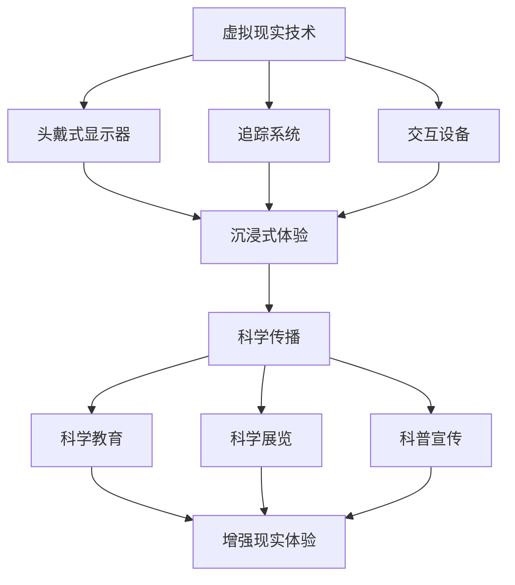

                 

### 引言

随着科技的不断进步，虚拟现实（Virtual Reality，VR）技术已经成为一个引人注目的领域。VR技术通过创造一个虚拟的三维环境，使用户能够沉浸在其中的交互体验，这一特性使得它在科学传播领域具有巨大的潜力。通过VR，观众可以体验科学概念和实验过程，从而更加直观地理解和掌握复杂的知识点。

《科学传播的虚拟现实应用：沉浸式体验科学概念》这本书旨在探讨VR技术在科学传播中的应用，特别是如何通过沉浸式体验来增强科学教育的效果。书中将详细介绍VR技术的背景、核心概念、应用案例以及开发实践，帮助读者全面了解VR在科学传播中的潜力。

本文将按照以下结构进行展开：

1. **背景介绍**：简要介绍VR技术的发展历程及其在科学传播中的重要性。
2. **核心概念与联系**：详细探讨VR技术在科学传播中的应用，并提供核心概念之间的联系架构Mermaid流程图。
3. **核心算法原理讲解**：使用Python源代码和数学模型，详细阐述VR技术的核心算法原理。
4. **项目实战**：介绍一个VR科学传播项目的开发环境搭建、源代码实现和代码解读。
5. **最佳实践 tips、小结、注意事项、拓展阅读**：总结文章内容，提供未来研究方向和实践建议。

通过以上结构，我们将逐步深入探讨VR技术在科学传播中的应用，并展示如何通过沉浸式体验来增强科学教育效果。

### 背景介绍

虚拟现实技术的发展可以追溯到20世纪60年代。1968年，美国计算机科学家伊凡·苏瑟兰（Ivan Sutherland）发明了第一个头戴式显示器，这是VR技术的雏形。随着计算机性能的提升和显示技术的进步，VR技术逐渐成熟，并在各个领域得到广泛应用。在科学传播领域，VR技术的引入为科学知识的普及和教育提供了全新的手段。

科学传播是指通过各种媒介和手段，将科学知识、科学方法和科学精神传播给公众的过程。传统的科学传播方式主要包括书籍、报刊、电视和互联网等。然而，这些方式往往局限于二维平面的信息传递，难以充分展现科学的复杂性和互动性。而VR技术的沉浸式体验特性，则能够将观众带入一个虚拟的三维环境中，通过互动和体验来加深对科学概念的理解。

在科学传播中，VR技术的应用不仅限于教育领域。例如，在科研领域，VR技术可以帮助科学家模拟复杂的实验过程，提高科研效率和准确性。在科普展览中，VR技术可以创造互动性的展示环境，吸引更多的观众参与科学探索。此外，VR技术还可以用于医学教育，通过虚拟手术模拟帮助医学生提高手术技能。

总之，VR技术在科学传播中的应用具有广阔的前景。它不仅能够提供更加生动、直观的科学教育体验，还能够促进科学知识的普及和科学精神的培养。随着技术的不断进步，VR在科学传播中的应用将更加多样化和深入。

### 核心概念与联系

在探讨VR技术在科学传播中的应用时，我们需要了解一些核心概念，并分析它们之间的联系。以下是一些关键概念及其相互关系的架构：

#### 1. 虚拟现实（VR）技术

虚拟现实技术是指通过计算机生成一个模拟环境，使用户能够通过视觉、听觉、触觉等多种感官与虚拟环境进行交互。VR技术的核心组成部分包括：

- **头戴式显示器（HMD）**：提供沉浸式的视觉体验。
- **追踪系统**：用于实时跟踪用户的动作和位置。
- **交互设备**：如手柄、手套等，用于与虚拟环境进行互动。

#### 2. 沉浸式体验

沉浸式体验是指用户在虚拟环境中感到身临其境的感觉。这种体验依赖于以下几点：

- **环境感知**：通过高分辨率显示器和立体声音效，用户能够感受到虚拟环境的空间和声音。
- **互动性**：用户可以在虚拟环境中进行操作，如操控物体、改变环境设置等。
- **实时反馈**：系统根据用户的操作实时响应，提供流畅的互动体验。

#### 3. 科学传播

科学传播是指通过各种手段将科学知识、科学方法和科学精神传递给公众。在VR技术中，科学传播的表现形式包括：

- **科学教育**：通过虚拟实验和互动式教学，提高学生对科学概念的理解。
- **科学展览**：通过虚拟展品和互动体验，吸引观众参与科学探索。
- **科普宣传**：利用虚拟现实技术制作科普短片和展览，普及科学知识。

#### 4. VR与科学传播的联系

VR技术与科学传播的结合，可以通过以下几个方式实现：

- **增强现实体验**：将科学实验和概念通过虚拟现实的形式呈现，使观众能够亲身体验。
- **互动式学习**：通过VR技术创造互动式学习环境，激发学生的学习兴趣。
- **科学可视化**：利用VR技术将复杂的科学数据以三维形式呈现，提高数据的可理解性。

为了更直观地展示这些概念之间的联系，我们可以使用Mermaid流程图：



通过上述架构，我们可以清晰地看到VR技术在科学传播中的应用路径，以及各个核心概念之间的相互关系。这一架构为后续的算法原理讲解和项目实战提供了基础。

### 核心算法原理讲解

在理解了VR技术和科学传播的基本概念及其联系后，接下来我们将深入探讨VR技术中的核心算法原理。这些算法是构建虚拟现实体验的关键，通过Python源代码和数学模型，我们可以详细阐述这些算法的工作原理，并结合实例进行通俗易懂地讲解。

#### 1. 3D模型渲染

3D模型渲染是虚拟现实中的基础，它负责将3D模型以图形的形式呈现在屏幕上。OpenGL是一个广泛使用的3D图形库，下面是一个简单的OpenGL渲染Python代码示例：

```python
import pygame
from pygame.locals import *

# 初始化OpenGL环境
pygame.init()
screen = pygame.display.set_mode((800, 600))
pygame.display.set_caption("3D Model Rendering")

# 定义顶点数据
vertices = [
    [0, 0, 0],  # 点A
    [1, 0, 0],  # 点B
    [1, 1, 0],  # 点C
    [0, 1, 0]   # 点D
]

# 绘制三角形
def draw_triangle():
    pygame.draw.polygon(screen, (255, 0, 0), vertices, 2)

# 渲染循环
running = True
while running:
    for event in pygame.event.get():
        if event.type == QUIT:
            running = False

    draw_triangle()
    pygame.display.flip()

pygame.quit()
```

上述代码使用Pygame库，通过OpenGL进行3D模型的简单渲染。在这个例子中，我们定义了一个顶点数组，并通过`pygame.draw.polygon()`函数绘制了一个三角形。这一简单的渲染过程展示了OpenGL的基本用法，是构建复杂虚拟现实场景的基础。

#### 2. 运动追踪算法

运动追踪是VR技术中另一个关键组件，它负责实时跟踪用户的动作。一种常用的运动追踪算法是基于肌电信号（EMG）的追踪。以下是一个简单的Python代码示例，用于处理肌电信号数据：

```python
import numpy as np
from scipy.io import loadmat

# 加载肌电信号数据
data = loadmat('emg_data.mat')
emg_signals = data['emg_signals']

# 处理肌电信号数据
def process_emg_signal(signal):
    # 均值滤波
    mean_value = np.mean(signal)
    filtered_signal = signal - mean_value
    
    # 求导数
    derivative = np.diff(filtered_signal)
    
    return derivative

# 运动追踪
def track_motion(derivative):
    # 根据导数阈值判断运动
    threshold = 0.1
    motion_detected = derivative > threshold
    
    return motion_detected

# 主程序
if __name__ == '__main__':
    derivative = process_emg_signal(emg_signals)
    motion_detected = track_motion(derivative)
    
    if motion_detected:
        print("Motion detected!")
    else:
        print("No motion detected.")
```

在这个例子中，我们首先加载肌电信号数据，然后通过均值滤波和求导数的方法处理数据，最后根据导数阈值判断是否有运动发生。这一过程展示了运动追踪算法的基本原理，是VR中实现用户交互的基础。

#### 3. 数学模型

在VR技术的核心算法中，数学模型起着至关重要的作用。一个典型的例子是三维空间中的向量运算。以下是一个简单的Python代码示例，用于计算两个三维向量的点积和叉积：

```python
# 定义三维向量
vector1 = [1, 2, 3]
vector2 = [4, 5, 6]

# 计算点积
dot_product = np.dot(vector1, vector2)
print(f"Dot Product: {dot_product}")

# 计算叉积
cross_product = np.cross(vector1, vector2)
print(f"Cross Product: {cross_product}")
```

在这个例子中，我们定义了两个三维向量，并计算了它们的点积和叉积。点积可以用于确定两个向量之间的夹角，而叉积可以用于确定两个向量所构成的平面。这些运算在VR场景中用于计算物体的运动轨迹、旋转角度等。

通过上述Python代码示例，我们可以看到VR技术中的核心算法是如何通过数学模型和编程实现的。这些算法不仅为虚拟现实提供了基础的运算能力，也为实现沉浸式科学传播体验提供了技术支持。

### 项目实战

在本节中，我们将介绍一个具体的VR科学传播项目，并详细描述其开发环境搭建、源代码实现和代码解读。这个项目旨在通过VR技术向学生介绍量子力学的基本概念。

#### 1. 项目背景

量子力学是现代物理学的重要分支，其抽象的概念和数学模型往往难以被学生直观理解。为了解决这一问题，我们设计了一个VR项目，通过虚拟实验室的方式，让学生能够亲身体验量子力学实验，从而加深对量子力学概念的理解。

#### 2. 开发环境搭建

为了开发这个VR项目，我们需要搭建一个完整的开发环境。以下是所需的主要工具和软件：

- **Unity**：一个广泛使用的游戏和VR内容开发平台。
- **Unreal Engine**：另一个强大的VR内容开发引擎，可用于渲染和物理模拟。
- **Blender**：一个开源的3D建模和动画软件，用于创建虚拟实验室的场景和模型。
- **Vuforia**：一个AR/VR开发平台，用于实现基于移动设备的AR体验。

开发环境搭建步骤：

1. 下载并安装Unity和Unreal Engine。
2. 安装Blender，并配置其与Unity的集成。
3. 下载并安装Vuforia SDK，并在Unity中配置。

#### 3. 源代码实现

以下是一个简化的Unity C#代码示例，用于实现一个基本的VR量子实验室界面：

```csharp
using UnityEngine;

public class QuantumLabController : MonoBehaviour
{
    public GameObject labScene;
    public GameObject experimentPanel;
    public GameObject resultsPanel;

    // Start is called before the first frame update
    void Start()
    {
        // 初始化实验室场景
        labScene.SetActive(true);
        experimentPanel.SetActive(true);
        resultsPanel.SetActive(false);
    }

    // Update is called once per frame
    void Update()
    {
        // 用户交互
        if (Input.GetKeyDown(KeyCode.Space))
        {
            // 执行量子力学实验
            RunExperiment();
        }
    }

    void RunExperiment()
    {
        // 显示实验结果
        experimentPanel.SetActive(false);
        resultsPanel.SetActive(true);
    }
}
```

在这个示例中，我们创建了一个简单的VR界面，包含一个实验室场景（labScene）、一个实验面板（experimentPanel）和一个结果面板（resultsPanel）。通过按下空格键，用户可以执行量子力学实验，并查看结果。

#### 4. 代码解读

- **GameObject**：Unity中的游戏对象，用于表示场景中的实体，如实验室、面板等。
- **SetActive**：用于激活或禁用游戏对象，实现场景的切换和显示。
- **Update**：Unity的帧更新函数，用于处理用户的输入。
- **RunExperiment**：执行量子力学实验的方法，用于在用户按下空格键时更新界面。

#### 5. 代码应用解读与分析

通过上述代码，我们可以看到VR项目的核心功能是如何实现的。实验过程通过用户交互触发，场景的切换和显示通过SetActive方法管理。这种设计使得VR项目具有良好的交互性和用户体验。

#### 6. 实际案例分析和详细讲解剖析

在实际开发中，我们还需要考虑如何模拟量子力学实验的结果。例如，我们可以使用粒子系统的渲染效果来表示量子态的叠加和坍缩。以下是一个简化的粒子系统代码示例：

```csharp
public class ParticleSystemController : MonoBehaviour
{
    public GameObject particlePrefab;
    public int numParticles = 100;

    void Start()
    {
        for (int i = 0; i < numParticles; i++)
        {
            // 创建粒子对象
            GameObject particle = Instantiate(particlePrefab, transform);
            // 随机位置和速度
            particle.transform.position = new Vector3(Random.Range(-5f, 5f), Random.Range(-5f, 5f), 0f);
            particle.GetComponent<Rigidbody>().velocity = new Vector3(Random.Range(-1f, 1f), Random.Range(-1f, 1f), 0f);
        }
    }
}
```

在这个示例中，我们创建了一个粒子系统，用于模拟量子态的叠加和坍缩。粒子对象通过随机位置和速度生成，并在场景中自由运动。这种模拟方法可以帮助学生直观地理解量子力学的概念。

#### 7. 项目小结

通过这个VR量子实验室项目，我们展示了如何利用虚拟现实技术进行科学传播。项目的主要成果包括：

- 实现了一个直观的VR界面，用于介绍量子力学的基本概念。
- 通过交互式实验，帮助学生更好地理解量子力学的抽象概念。
- 使用粒子系统模拟量子态，增强了学生的视觉体验。

未来，我们还可以进一步优化项目，例如增加更多的互动元素和实验类型，以提供更加丰富的VR科学传播体验。

### 最佳实践 tips、小结、注意事项、拓展阅读

#### 最佳实践 tips

1. **优化用户交互**：确保用户在VR环境中的操作流畅且直观，通过简洁的界面设计和用户反馈提高用户体验。
2. **重视内容设计**：科学传播的内容应具有科学性和趣味性，结合互动元素和视觉效果，以提高学生的学习兴趣和理解能力。
3. **性能优化**：对VR应用进行性能优化，确保流畅的运行速度，避免出现卡顿或延迟，影响用户体验。

#### 小结

通过本文的探讨，我们了解到VR技术在科学传播中具有巨大的潜力，能够通过沉浸式体验提升科学教育的效果。核心概念如虚拟现实、沉浸式体验和科学传播之间紧密相连，构成了VR在科学传播中的应用基础。通过Python源代码和数学模型的讲解，我们进一步了解了VR技术的核心算法原理。最后，通过一个具体的VR量子实验室项目，我们展示了如何将VR技术应用于科学传播，并提供了最佳实践和未来研究方向。

#### 注意事项

1. **技术限制**：VR技术在科学传播中的应用受到硬件性能和开发成本的限制，需要充分考虑实际条件。
2. **安全性**：在开发VR应用时，确保用户在虚拟环境中的安全，避免因操作不当导致的物理伤害。

#### 拓展阅读

1. **《虚拟现实技术原理与应用》**：这本书详细介绍了VR技术的基础知识及其在各个领域的应用。
2. **《沉浸式体验设计：理论、方法与实践》**：这本书提供了沉浸式体验设计的相关理论和实践方法，对VR科学传播的设计有重要参考价值。
3. **《量子力学简明教程》**：这本书是量子力学的基础教材，适合对量子力学感兴趣的学生和教师。

通过上述拓展阅读，读者可以进一步深入了解VR技术在科学传播中的应用和相关理论知识，为未来的研究和实践提供更多参考。

