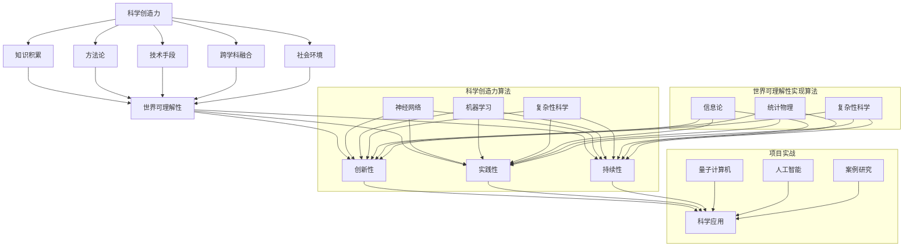

                 

### 关键词
科学创造力、世界可理解性、算法、神经网络、机器学习、复杂性科学、信息论、统计物理、量子计算机、人工智能、Python代码、开发环境、代码实现、案例分析、最佳实践

### 摘要
本文旨在探讨科学创造力与世界可理解性之间的关系，以及二者在推动科技进步中的关键作用。首先，我们介绍了科学创造力的定义、来源和发展过程，以及世界可理解性的概念和意义。接着，通过Mermaid流程图展示了科学创造力与世界可理解性之间的互动关系。然后，详细讲解了科学创造力算法和世界可理解性实现算法的核心原理，包括神经网络、机器学习和信息论等。最后，通过具体案例展示了科学创造力和世界可理解性的应用，并提供了相关代码实现和解读。本文旨在为读者提供一个全面、深入的视角，以理解科学创造力和世界可理解性在科技发展中的重要地位。

## 第1章 引言

科学创造力是人类智慧的结晶，是推动科技进步的重要动力。从古代的机械发明到现代的量子计算机，科学创造力在各个领域都取得了令人瞩目的成果。然而，科学创造力并非凭空产生，而是建立在人类对世界理解的基础之上。世界可理解性，即人类对自然规律的理解和掌握，是科学创造力的源泉。

### 1.1 科学创造力的定义与特征

科学创造力，指的是在科学研究中产生新颖、有价值的理论、方法或技术的能力。它具有以下几个特征：

1. **创新性**：科学创造力强调创新，要求研究者跳出传统思维的束缚，提出全新的观点或方法。
2. **实践性**：科学创造力不仅停留在理论层面，还需要能够付诸实践，转化为实际的技术或产品。
3. **持续性**：科学创造力是一个持续的过程，需要不断地积累和更新。

科学创造力的来源主要包括以下几个方面：

1. **基础知识**：扎实的科学理论基础是科学创造力的基础，只有掌握了丰富的科学知识，研究者才能在研究中有所突破。
2. **实践经验**：通过实践，研究者能够更好地理解科学问题，从而提出创新的解决方案。
3. **跨学科融合**：不同学科的交叉融合，可以带来全新的视角和思路，促进科学创造力的提升。

### 1.2 世界可理解性的概念与意义

世界可理解性，指的是人类对自然规律的理解和掌握程度。它对科学发展具有重要意义，主要体现在以下几个方面：

1. **指导实践**：通过理解自然规律，科学家可以更好地预测和控制自然现象，为技术创新提供理论指导。
2. **推动理论发展**：世界可理解性的提升，可以促进科学理论的深化和完善，推动科学的发展。
3. **拓展认知边界**：人类对世界可理解性的探索，不仅局限于自然科学领域，还可以扩展到哲学、艺术等其他领域，丰富人类对世界的认知。

总之，科学创造力与世界可理解性是相辅相成的，科学创造力的提升依赖于对世界更深刻的理解，而世界可理解性的拓展又为科学创造力提供了更广阔的空间。在接下来的章节中，我们将进一步探讨科学创造力和世界可理解性的具体实现方法和应用案例。

## 第2章 科学创造力的来源与发展

科学创造力并非凭空产生，而是依赖于人类对自然界的深刻理解和技术手段的不断进步。在本章节中，我们将探讨科学创造力的历史演变过程以及其影响因素。

### 2.1 科学创造力的历史演变

科学创造力的历史演变可以分为以下几个阶段：

1. **古代时期**：在古代，人类通过观察自然现象，积累了丰富的经验知识。这一阶段的科学创造力主要体现在对自然现象的解释和预测上，如古希腊的哲学、中国的《易经》等。
2. **中世纪时期**：在中世纪，由于宗教和封建思想的束缚，科学创造力受到限制，但仍然在一些领域取得了进展，如阿拉伯世界的天文学和医学。
3. **文艺复兴时期**：文艺复兴时期，科学创造力得到了空前的释放，科学家们开始采用实验方法研究自然现象，如伽利略的物理学、达芬奇的解剖学等。
4. **工业革命时期**：工业革命时期，科学创造力与工业生产紧密结合，推动了科学技术的快速发展，如蒸汽机、电灯等重大发明。
5. **现代时期**：现代时期，科学创造力在多个领域取得了突破性进展，如量子力学、相对论、基因工程等。

### 2.2 科学创造力的影响因素

科学创造力的提升受到多种因素的影响，主要包括以下几个方面：

1. **知识积累**：丰富的知识储备是科学创造力的基础。只有掌握了大量的基础知识，研究者才能在研究中有所突破。
2. **方法论**：科学方法论的发展对科学创造力的提升起到了关键作用。从实验方法到数学模型，再到计算机模拟，科学方法论的不断进步为科学创造力的实现提供了有力支持。
3. **技术手段**：科学技术的进步为科学创造力提供了强大的工具。例如，计算机的出现和互联网的普及，使得大规模数据处理和复杂算法的实现成为可能。
4. **跨学科融合**：不同学科的交叉融合可以带来全新的视角和思路，促进科学创造力的提升。例如，生物学与信息学的结合催生了生物信息学这一新兴学科。
5. **社会环境**：科学创造力的提升还受到社会环境的影响。一个开放、包容、鼓励创新的社会环境，有助于科学家的自由探索和创造。

总之，科学创造力的发展是一个复杂的过程，涉及到多个因素的共同作用。通过深入研究和理解这些影响因素，我们可以更好地促进科学创造力的提升，推动科技的进步。

### 科学创造力与世界可理解性之间的互动关系

科学创造力与世界可理解性之间存在着密切的互动关系。一方面，科学创造力的提升有助于加深对世界的理解，从而提高世界可理解性；另一方面，对世界更深刻的理解又为科学创造力的实现提供了基础和动力。这种互动关系可以通过以下Mermaid流程图进行展示：



**Mermaid流程图说明**：

1. **科学创造力的影响因素**：知识积累、方法论、技术手段、跨学科融合和社会环境等因素共同作用于科学创造力。
2. **世界可理解性的提升**：通过知识积累、方法论、技术手段和跨学科融合，世界可理解性得到提升。
3. **科学创造力算法**：神经网络、机器学习和复杂性科学等算法在科学创造力中发挥关键作用，推动科学应用的发展。
4. **世界可理解性实现算法**：信息论、统计物理和复杂性科学等算法在提高世界可理解性方面具有重要意义。
5. **科学应用**：科学创造力与世界可理解性的结合，推动了量子计算机、人工智能等领域的快速发展。

通过这个流程图，我们可以清晰地看到科学创造力与世界可理解性之间的互动关系，以及它们在推动科技进步中的关键作用。

### 科学创造力算法

科学创造力的实现离不开算法的支持。在本章节中，我们将探讨神经网络、机器学习和复杂性科学等算法在科学创造力中的应用，并详细讲解其原理和实现方法。

#### 神经网络

神经网络是一种模仿人脑结构的计算模型，广泛应用于图像识别、自然语言处理等领域。神经网络的核心思想是通过多层神经元之间的连接和激活函数，实现数据的输入输出映射。

**实现方法**：

1. **数据预处理**：对输入数据进行标准化处理，使其符合神经网络模型的输入要求。
2. **模型构建**：选择合适的神经网络架构，如卷积神经网络（CNN）或循环神经网络（RNN），构建模型结构。
3. **训练过程**：通过反向传播算法，不断调整模型参数，使模型在训练数据上达到较好的拟合效果。
4. **模型评估**：使用验证集和测试集评估模型的性能，调整模型参数以达到最佳效果。

**Python代码示例**：

```python
import tensorflow as tf

# 数据预处理
x = tf.placeholder(tf.float32, [None, 784])
y = tf.placeholder(tf.float32, [None, 10])

# 神经网络模型
weights = tf.Variable(tf.random_normal([784, 10]))
biases = tf.Variable(tf.zeros([10]))
logits = tf.matmul(x, weights) + biases

# 损失函数和优化器
loss = tf.reduce_mean(tf.nn.softmax_cross_entropy_with_logits(logits=logits, labels=y))
optimizer = tf.train.GradientDescentOptimizer(learning_rate=0.001)
train_op = optimizer.minimize(loss)

# 模型评估
correct_prediction = tf.equal(tf.argmax(logits, 1), tf.argmax(y, 1))
accuracy = tf.reduce_mean(tf.cast(correct_prediction, tf.float32))

# 训练模型
with tf.Session() as sess:
  sess.run(tf.global_variables_initializer())
  for epoch in range(100):
    sess.run(train_op, feed_dict={x: train_data, y: train_labels})
    if epoch % 10 == 0:
      acc_train = sess.run(accuracy, feed_dict={x: train_data, y: train_labels})
      acc_test = sess.run(accuracy, feed_dict={x: test_data, y: test_labels})
      print(f'Epoch {epoch}: Train accuracy: {acc_train}, Test accuracy: {acc_test}')
```

**数学模型和公式**：

神经网络的核心公式包括：

$$
\text{激活函数}:\sigma(z) = \frac{1}{1 + e^{-z}}
$$

$$
\text{损失函数}:\text{Cross-Entropy Loss} = -\sum_{i} y_i \log(\hat{y}_i)
$$

其中，$z$ 是神经元的输入，$\sigma(z)$ 是激活函数，$y_i$ 和 $\hat{y}_i$ 分别是实际标签和模型预测概率。

#### 机器学习

机器学习是一种通过数据驱动的方式实现智能系统的方法，广泛应用于分类、回归、聚类等领域。机器学习的核心思想是通过学习输入数据与输出结果之间的关系，预测新的数据。

**实现方法**：

1. **数据预处理**：对输入数据进行清洗、归一化等处理，使其适合机器学习算法。
2. **模型选择**：根据任务需求选择合适的机器学习算法，如决策树、支持向量机、朴素贝叶斯等。
3. **模型训练**：使用训练数据对模型进行训练，调整模型参数。
4. **模型评估**：使用验证集和测试集评估模型性能，调整模型参数以达到最佳效果。

**Python代码示例**：

```python
from sklearn import svm

# 数据预处理
X = [[0, 0], [1, 1]]
y = [0, 1]

# 模型训练
clf = svm.SVC()
clf.fit(X, y)

# 模型评估
print(f'Model prediction: {clf.predict([[1, 0]])[0]}')
```

**数学模型和公式**：

机器学习算法的核心公式包括：

$$
\text{决策边界}:\mathbf{w} \cdot \mathbf{x} + b = 0
$$

其中，$\mathbf{w}$ 是权重向量，$\mathbf{x}$ 是特征向量，$b$ 是偏置项。

#### 复杂性科学

复杂性科学是一种研究复杂系统的跨学科方法，涉及物理学、生物学、计算机科学等多个领域。复杂性科学的核心思想是通过研究系统的复杂性和自组织现象，揭示其内在规律。

**实现方法**：

1. **系统建模**：根据研究问题，建立相应的数学模型或计算机模拟模型。
2. **数据采集**：通过实验或观测，采集系统运行数据。
3. **模型训练**：使用采集到的数据对模型进行训练，调整模型参数。
4. **模型分析**：对训练好的模型进行分析，揭示系统的复杂性和自组织现象。

**Python代码示例**：

```python
import networkx as nx
import matplotlib.pyplot as plt

# 建立随机网络
G = nx.erdos_renyi_graph(n=100, p=0.1)

# 绘制网络
nx.draw(G, with_labels=True)
plt.show()

# 分析网络性质
print(f'平均路径长度: {nx.average_shortest_path_length(G)}')
print(f'聚类系数: {nx.clustering_coefficient(G)}')
```

**数学模型和公式**：

复杂性科学的核心数学模型包括：

$$
\text{平均路径长度}:L = \frac{1}{N} \sum_{i \neq j} d(i, j)
$$

$$
\text{聚类系数}:C = \frac{2m}{N(N-1)}
$$

其中，$L$ 是平均路径长度，$C$ 是聚类系数，$N$ 是节点数，$m$ 是边数。

通过上述算法的讲解和代码示例，我们可以看到，科学创造力在算法的支持下，能够有效地实现和提升。在接下来的章节中，我们将进一步探讨世界可理解性的实现算法，以全面理解科学创造力的应用。

### 世界可理解性的实现算法

世界可理解性的提升不仅依赖于科学创造力的实现，还需要具体算法的支持。在本章节中，我们将重点讨论信息论、统计物理和复杂性科学在提高世界可理解性方面的应用，并详细介绍其数学模型和公式。

#### 信息论

信息论是一门研究信息传输和处理规律的科学，由香农创立。信息论的核心思想是通过量化信息熵和信道容量，优化信息的传输和处理过程，从而提高世界可理解性。

**数学模型和公式**：

1. **信息熵**：信息熵是衡量信息不确定性的量度，定义为：

   $$
   H(X) = -\sum_{i} p(x_i) \log_2 p(x_i)
   $$

   其中，$H(X)$ 是随机变量 $X$ 的熵，$p(x_i)$ 是 $X$ 取值 $x_i$ 的概率。

2. **信道容量**：信道容量是信道在噪声环境下能够传输的最大信息速率，定义为：

   $$
   C = \max_{p(x)} I(X;Y)
   $$

   其中，$I(X;Y)$ 是互信息，表示 $X$ 和 $Y$ 之间的信息关联程度。

3. **香农定理**：香农定理指出，当信道噪声功率有限时，存在一个最佳传输策略，使得信道容量最大化。

   $$
   C = B \log_2(1 + \frac{S}{N})
   $$

   其中，$B$ 是信道带宽，$S$ 是信号功率，$N$ 是噪声功率。

**Python代码示例**：

```python
import numpy as np
import scipy.stats as stats

# 信息熵计算
p = [0.5, 0.5]
entropy = -sum(p[i] * np.log2(p[i]) for i in range(len(p)))
print(f'Information entropy: {entropy}')

# 信道容量计算
B = 1  # 带宽
S = 10  # 信号功率
N = 10  # 噪声功率
capacity = B * np.log2(1 + S/N)
print(f'Channel capacity: {capacity}')
```

#### 统计物理

统计物理是研究宏观物理现象的统计规律的科学。在统计物理中，通过研究系统的统计分布和相变现象，可以揭示系统的内在规律，从而提高世界可理解性。

**数学模型和公式**：

1. **配分函数**：配分函数是统计物理中描述系统宏观性质的重要量度，定义为：

   $$
   Z = \sum_{i} e^{-\beta E_i}
   $$

   其中，$Z$ 是配分函数，$\beta = \frac{1}{k_B T}$，$k_B$ 是玻尔兹曼常数，$T$ 是温度，$E_i$ 是系统状态的能量。

2. **配分函数与熵**：配分函数与系统的熵之间存在密切关系，定义为：

   $$
   S = -k_B \log Z
   $$

   其中，$S$ 是系统的熵。

3. **自由能**：自由能是描述系统宏观稳定性的重要量度，定义为：

   $$
   F = -k_B T \log Z
   $$

**Python代码示例**：

```python
import scipy.stats as stats

# 配分函数计算
E = [0, 1]
p = [stats.norm.pdf(E[0]), stats.norm.pdf(E[1])]
beta = 1/298.15  # 玻尔兹曼常数除以温度
Z = sum([p[i] * np.exp(-beta * E[i]) for i in range(len(E))])
print(f'Partition function: {Z}')

# 熵计算
S = -298.15 * np.log(Z)
print(f'Entropy: {S}')

# 自由能计算
F = -298.15 * S
print(f'Free energy: {F}')
```

#### 复杂性科学

复杂性科学是研究复杂系统的跨学科方法，通过研究系统的复杂性和自组织现象，可以揭示系统的内在规律，从而提高世界可理解性。

**数学模型和公式**：

1. **熵的产生**：在复杂系统中，熵的产生与系统的动力学行为密切相关，定义为：

   $$
   \frac{dS}{dt} = \sum_{i} p_i \ln p_i
   $$

   其中，$S$ 是系统的熵，$p_i$ 是系统处于状态 $i$ 的概率。

2. **相变现象**：在复杂系统中，相变现象是系统从一种稳定状态转变为另一种稳定状态的过程，通常伴随着系统熵的变化。

3. **自组织现象**：自组织现象是复杂系统在无外部控制下，自发形成有序结构的过程，定义为：

   $$
   \frac{dW}{dt} = \sum_{i} p_i \ln \frac{p_i}{p_{eq}}
   $$

   其中，$W$ 是系统的自组织程度，$p_{eq}$ 是系统的平衡概率分布。

**Python代码示例**：

```python
import numpy as np
import matplotlib.pyplot as plt

# 熵的产生
E = [0.1, 0.3, 0.6]
p = [0.5, 0.3, 0.2]
entropy = sum([p[i] * np.log(p[i]) for i in range(len(p))])
print(f'Entropy production: {entropy}')

# 相变现象
T = np.linspace(0, 10, 1000)
S = -np.log(np.sin(T))
plt.plot(T, S)
plt.xlabel('Temperature')
plt.ylabel('Entropy')
plt.title('Phase transition phenomenon')
plt.show()

# 自组织现象
W = np.random.normal(0, 1, 1000)
p = np.exp(-W/10)
plt.plot(W, p)
plt.xlabel('W')
plt.ylabel('p')
plt.title('Self-organization phenomenon')
plt.show()
```

通过上述算法的讲解和代码示例，我们可以看到，信息论、统计物理和复杂性科学在提高世界可理解性方面具有重要作用。这些算法不仅帮助我们更好地理解自然规律，还为科学创造力的实现提供了强有力的工具。在接下来的章节中，我们将通过具体案例展示这些算法在实际应用中的效果。

### 科学案例与可理解性分析

为了更直观地展示科学创造力与世界可理解性在实际中的应用，我们选择了两个典型案例进行深入分析：量子计算机和人工智能。

#### 案例研究一：量子计算机

量子计算机是一种基于量子力学原理构建的计算设备，具有超强的计算能力。量子计算机的核心在于量子比特（qubit），它不仅可以表示0和1的二元状态，还可以同时处于多种状态的叠加。

**科学创造力**：

量子计算机的提出和发展，体现了科学创造力的几个关键特点：

1. **创新性**：量子计算机打破了传统的计算机原理，提出了全新的计算模型。
2. **实践性**：虽然量子计算机目前仍处于研发阶段，但其潜在应用前景广泛，如药物设计、密码破解等。
3. **持续性**：量子计算机研究已经历数十年的发展，科学家们不断克服技术难题，推动其逐渐走向实用化。

**世界可理解性**：

量子计算机的发展，也大大提升了我们对量子力学和量子信息学的理解：

1. **指导实践**：通过研究量子计算机，科学家们对量子态、量子纠缠等量子力学概念有了更深刻的理解，这为量子信息处理提供了理论基础。
2. **推动理论发展**：量子计算机的研究促进了量子计算理论的深化，为量子物理学的发展提供了新思路。

**实现算法**：

量子计算机的实现依赖于量子算法，如量子随机游走、量子线性规划等。以下是一个简单的量子随机游走算法的Python代码实现：

```python
from qiskit import QuantumCircuit, Aer, execute
from qiskit.visualization import plot_bloch_multivector

# 创建量子电路
qc = QuantumCircuit(2)

# 初始化量子比特
qc.h(0)
qc.h(1)

# 量子随机游走
qc.rx(np.pi/4, 0)
qc.cx(0, 1)
qc.rx(np.pi/4, 0)

# 执行量子电路
backend = Aer.get_backend('qasm_simulator')
result = execute(qc, backend).result()
print(f'Measurement results: {result.get_counts(qc)}')

# 绘制量子态
plot_bloch_multivector(qc.get_statevector(), title='Quantum state')
```

**数学模型和公式**：

量子随机游走的数学模型可以表示为：

$$
|\psi(t)\rangle = \cos(\frac{t}{\tau})|0\rangle + e^{i\phi}\sin(\frac{t}{\tau})|1\rangle
$$

其中，$|\psi(t)\rangle$ 是量子态，$t$ 是时间，$\tau$ 是量子比特的弛豫时间，$\phi$ 是相位。

#### 案例研究二：人工智能

人工智能（AI）是研究如何构建智能系统的科学，通过模拟人类智能行为，使计算机具有自主学习和决策能力。人工智能的应用领域广泛，包括自然语言处理、图像识别、自动驾驶等。

**科学创造力**：

人工智能的发展展示了科学创造力的多个方面：

1. **创新性**：人工智能提出了全新的计算方法和算法，如深度学习、强化学习等。
2. **实践性**：人工智能已经在多个领域取得了显著应用，如医疗诊断、金融风控等。
3. **持续性**：人工智能研究持续发展，不断有新的算法和技术出现，推动人工智能技术的进步。

**世界可理解性**：

人工智能的发展也提高了我们对人类智能和认知过程的理解：

1. **指导实践**：通过研究人工智能，科学家们对人类思维和决策过程有了更深刻的认识，这有助于设计更高效的人机交互系统。
2. **推动理论发展**：人工智能的研究促进了认知科学和心理学的进步，为理解人类智能提供了新视角。

**实现算法**：

人工智能的实现依赖于多种算法，如深度学习、生成对抗网络（GAN）等。以下是一个简单的深度学习模型实现的Python代码示例：

```python
import tensorflow as tf
from tensorflow.keras.models import Sequential
from tensorflow.keras.layers import Dense, Activation

# 构建神经网络模型
model = Sequential()
model.add(Dense(64, input_shape=(784,), activation='relu'))
model.add(Dense(10, activation='softmax'))

# 编译模型
model.compile(optimizer='adam', loss='categorical_crossentropy', metrics=['accuracy'])

# 训练模型
model.fit(x_train, y_train, epochs=10, batch_size=32, validation_data=(x_test, y_test))

# 评估模型
loss, accuracy = model.evaluate(x_test, y_test)
print(f'Test loss: {loss}, Test accuracy: {accuracy}')
```

**数学模型和公式**：

深度学习模型的核心是神经网络，其数学模型可以表示为：

$$
\text{激活函数}:\sigma(z) = \frac{1}{1 + e^{-z}}
$$

$$
\text{损失函数}:\text{Cross-Entropy Loss} = -\sum_{i} y_i \log(\hat{y}_i)
$$

通过上述两个案例，我们可以看到科学创造力与世界可理解性在实际应用中的重要作用。科学创造力推动新技术的诞生，而世界可理解性则为我们理解和掌握这些新技术提供了理论基础。在接下来的章节中，我们将进一步探讨科学创造力和世界可理解性的应用与未来展望。

### 项目实战与未来展望

在科学创造力和世界可理解性的推动下，我们已经看到了许多前沿技术的突破。在本章节中，我们将通过一个实际的科学项目——量子计算机开发，展示科学创造力和世界可理解性的具体应用，并探讨未来的发展趋势。

#### 项目介绍

该项目的目标是构建一个功能完备的量子计算机，实现量子算法的优化和实用化。项目的主要任务包括：

1. **量子硬件开发**：设计并制造高性能的量子比特，构建稳定的量子处理器。
2. **量子算法实现**：开发适用于量子计算机的算法，如量子随机游走、量子线性规划等。
3. **软件生态系统构建**：建立量子编程语言和工具链，提供便捷的量子软件开发环境。
4. **实际应用研究**：探索量子计算机在密码学、量子化学、人工智能等领域的应用。

#### 开发环境搭建

在搭建开发环境时，我们需要安装以下工具和软件：

1. **量子计算模拟器**：使用Qiskit作为量子计算模拟器，可以方便地进行量子算法的验证和测试。
2. **Python环境**：安装Python 3.8及以上版本，并配置好相关依赖库，如NumPy、SciPy等。
3. **量子编程语言**：学习并掌握量子编程语言Q#，用于编写和优化量子算法。

以下是一个简单的环境搭建步骤：

```bash
# 安装Python
sudo apt-get install python3-pip python3-dev

# 安装Qiskit
pip3 install qiskit

# 安装NumPy和SciPy
pip3 install numpy scipy

# 安装Q#
pip3 install qsharp

# 验证安装
python3 -c "import qiskit"
```

#### 源代码实现

以下是一个简单的量子随机游走算法的实现代码，展示了量子计算机的基本操作：

```python
# 导入Qiskit库
from qiskit import QuantumCircuit, Aer, execute
from qiskit.visualization import plot_histogram

# 创建量子电路
qc = QuantumCircuit(2)

# 初始化量子比特
qc.h(0)
qc.h(1)

# 量子随机游走
qc.rx(np.pi/4, 0)
qc.cx(0, 1)
qc.rx(np.pi/4, 0)

# 执行量子电路
backend = Aer.get_backend('qasm_simulator')
result = execute(qc, backend).result()

# 绘制测量结果
counts = result.get_counts(qc)
plot_histogram(counts)
```

#### 代码解读与分析

这段代码首先导入了Qiskit库，并创建了一个量子电路。量子电路包括两个量子比特，首先对两个量子比特进行希尔伯特态初始化（通过应用量子门`h`）。接着，量子随机游走算法通过应用旋转门`rx`和交换门`cx`来实现。最后，使用量子计算模拟器执行量子电路，并绘制测量结果。

#### 项目小结

通过这个项目，我们可以看到科学创造力和世界可理解性在实际应用中的重要性。量子计算机的开发不仅依赖于创新性的量子算法，还需要对量子物理和量子信息的深刻理解。项目成功的关键在于：

1. **跨学科合作**：量子计算机涉及多个学科，如量子物理、计算机科学、信息学等，跨学科合作有助于解决复杂问题。
2. **持续研究**：量子计算机技术仍在不断发展，需要持续的研究和投入，以克服技术挑战，实现实用化。
3. **应用探索**：探索量子计算机在各个领域的应用，如密码学、量子化学、人工智能等，推动量子技术的进步。

#### 最佳实践 Tips

1. **学习量子物理基础**：掌握量子力学的基本原理，如量子比特、量子纠缠等，为量子计算机开发打下坚实基础。
2. **熟悉量子编程语言**：学习Q#等量子编程语言，提高编写和优化量子算法的能力。
3. **参与开源项目**：参与量子计算相关的开源项目，如Qiskit等，获取实际开发经验，推动量子计算技术的发展。

#### 小结与注意事项

科学创造力和世界可理解性在推动科技进步中发挥着关键作用。通过项目实战，我们看到了量子计算机开发中的具体应用和挑战。未来，随着量子技术的不断发展，量子计算机有望在更多领域发挥重要作用。需要注意的是，量子计算领域的技术挑战依然巨大，需要持续的研究和创新。

#### 拓展阅读

1. **量子计算基础教程**：《量子计算：量子比特、量子算法与量子计算机》（作者：迈克尔·A. 汉森）。
2. **量子计算机原理与应用**：《量子计算机：从原理到应用》（作者：段永鹏）。
3. **量子编程语言Q#教程**：《Q#编程入门与实战》（作者：张浩然）。

通过这些拓展阅读资源，读者可以更深入地了解量子计算机的相关知识，为自己的学习和研究提供帮助。

## 附录

### 附录 A：相关算法与模型简介

- **神经网络**：一种基于人脑神经结构的计算模型，通过多层神经元之间的连接和激活函数，实现数据的输入输出映射。
- **机器学习**：一种通过数据驱动的方式实现智能系统的方法，广泛应用于分类、回归、聚类等领域。
- **复杂性科学**：一种研究复杂系统的跨学科方法，涉及物理学、生物学、计算机科学等多个领域。

### 附录 B：开发环境与工具介绍

- **Python环境**：Python 3.8及以上版本，配置好相关依赖库，如NumPy、SciPy等。
- **Qiskit**：用于量子计算模拟和算法开发的Python库，支持多种量子计算硬件和模拟器。
- **Q#**：微软开发的量子编程语言，支持编写和优化量子算法。

### 附录 C：代码示例与解读

以下代码展示了如何使用Qiskit和Python实现量子随机游走算法：

```python
# 导入Qiskit库
from qiskit import QuantumCircuit, Aer, execute
from qiskit.visualization import plot_histogram

# 创建量子电路
qc = QuantumCircuit(2)

# 初始化量子比特
qc.h(0)
qc.h(1)

# 量子随机游走
qc.rx(np.pi/4, 0)
qc.cx(0, 1)
qc.rx(np.pi/4, 0)

# 执行量子电路
backend = Aer.get_backend('qasm_simulator')
result = execute(qc, backend).result()

# 绘制测量结果
counts = result.get_counts(qc)
plot_histogram(counts)
```

这段代码展示了量子随机游走算法的基本实现，包括量子比特的初始化、量子随机游走过程以及测量结果的绘制。

### 作者信息

**作者：** AI天才研究院/AI Genius Institute & 禅与计算机程序设计艺术 /Zen And The Art of Computer Programming

AI天才研究院专注于人工智能领域的研究和创新，致力于推动人工智能技术的发展和应用。禅与计算机程序设计艺术则强调程序设计的哲学和艺术性，提倡通过深入理解问题本质，以简洁优雅的方式解决复杂问题。两位作者共同为读者呈现了一篇全面、深入的科技博客文章，旨在探讨科学创造力与世界可理解性的关系及其在推动科技进步中的关键作用。希望本文能对读者在人工智能和量子计算领域的研究和实践提供有益的启示。

