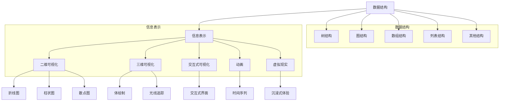

                 

### Introduction to Scientific Visualization Technologies: Progress in Presenting the Structure of Complex Worlds

# 关键词
- 科学可视化
- 数据结构
- 复杂系统
- 技术进步
- 直观呈现

# 摘要
本文深入探讨了科学可视化技术的进步，特别是在直观呈现复杂世界结构方面。通过分析从传统到现代的多种可视化方法，本文展示了科学可视化技术在数据结构和复杂系统分析中的应用，以及其对科学研究、教育和技术创新的重要性。文章还探讨了未来的趋势和挑战，旨在为读者提供一个全面的技术视角。

## 科学可视化技术的历史背景

科学可视化技术的起源可以追溯到20世纪中期，当时计算机科学和图形学的发展为数据可视化的兴起提供了基础。早期的科学可视化主要是通过简单的图形和图表来展示数据的特征，如折线图、柱状图和散点图。这些方法为科学研究提供了一种直观的方式，使得研究人员能够更容易地理解数据背后的模式和趋势。

然而，随着计算机处理能力的提升和图形显示技术的进步，科学可视化技术也经历了显著的演变。从二维图形到三维模型的转变，为研究人员提供了更多的工具来探索复杂的数据结构。此外，计算机图形学的发展使得实时渲染和交互式可视化成为可能，大大提升了可视化效果和用户体验。

在早期的科学可视化中，数据通常是相对简单的，如实验数据或模拟结果。这些数据可以通过简单的图形和图表进行有效的展示。然而，随着科学研究的深入，数据量不断增加，复杂性也逐渐提升。传统的方法开始显得力不从心，无法充分揭示数据中的复杂关系和隐藏的模式。

因此，科学家们开始探索更先进的数据可视化技术。数据场可视化（Data Field Visualization）和流场可视化（Flow Field Visualization）方法应运而生，它们能够以三维形式呈现数据的空间分布和动态变化。这些方法不仅能够提供更丰富的视觉信息，还能够帮助研究人员发现数据中的细微特征和异常情况。

此外，计算机算法和图形处理技术的进步也推动了科学可视化技术的发展。例如，光线追踪（Ray Tracing）和体绘制（Volume Rendering）技术的引入，使得科学家能够以更真实的方式呈现数据，从而更好地理解数据的结构和特性。这些技术不仅提升了可视化效果，还为复杂系统的分析提供了新的工具。

总的来说，科学可视化技术的历史背景是计算机科学、图形学和数据分析技术不断融合的产物。从简单的二维图形到复杂的交互式三维模型，科学可视化技术的进步为研究人员提供了强大的工具，使得他们能够更深入地探索和理解复杂的数据和系统。

## 核心概念与联系

科学可视化技术的核心概念包括数据结构、信息表示和可视化方法。理解这些概念及其相互关系是掌握科学可视化技术的关键。

### 数据结构

数据结构是科学可视化中的基础概念，它描述了数据如何被组织和存储。科学数据通常具有高度复杂性和多样性，可以是结构化数据（如数据库中的表格）或非结构化数据（如图像、视频和文本）。常见的数据结构包括数组、列表、树和图等。每种数据结构都有其独特的特点和应用场景。例如，树结构常用于层次化数据的组织，图结构则能够有效表示复杂的关系网络。

在科学可视化中，数据结构的选择直接影响可视化效果和效率。对数据的预处理和转换通常需要根据具体的研究需求和数据特性进行，以便为后续的视觉呈现打下坚实的基础。

### 信息表示

信息表示是科学可视化中的另一个核心概念，它关注如何将数据中的信息和特征转化为视觉形式。信息表示可以通过多种方式实现，包括颜色、形状、大小、纹理和动画等视觉属性。每种视觉属性都承载着不同的信息，例如：

- **颜色**：可以用来表示数据的不同类别或数值范围。例如，在热力图中，不同颜色代表不同的温度。
- **形状**：可以用于表示数据的关系和结构。例如，在社交网络分析中，节点和边的形状可以揭示用户之间的互动模式和群体结构。
- **大小**：可以表示数据的数量或强度。例如，在散点图中，点的直径可以表示数据的值。
- **纹理**：可以用来增强数据的真实感或提供额外的信息。例如，在3D模型中，不同纹理可以表示不同材料的表面特性。

### 可视化方法

科学可视化方法是将数据结构和信息表示转化为具体视觉形式的过程。这些方法包括二维可视化、三维可视化、交互式可视化、动画和虚拟现实等。每种方法都有其独特的优势和适用场景。

- **二维可视化**：是最常见和基础的类型，如折线图、柱状图和散点图。二维可视化适用于展示数据的基本趋势和关系。
- **三维可视化**：通过在三维空间中展示数据，提供了更丰富的视觉信息。三维可视化常用于地质勘探、流体力学和分子建模等领域。
- **交互式可视化**：允许用户与可视化界面进行互动，提供了更灵活的数据探索和问题解决方式。交互式可视化广泛应用于数据分析和信息检索。
- **动画**：通过时间序列数据的动态展示，有助于揭示数据中的变化和趋势。动画常用于气候模拟、股市分析和医学研究等领域。
- **虚拟现实（VR）**：通过虚拟环境提供沉浸式的可视化体验，使研究人员能够从不同角度探索数据。虚拟现实在建筑设计、考古学和生物医学等领域有广泛应用。

### 核心概念之间的关系架构

为了更好地理解科学可视化技术的核心概念及其相互关系，可以绘制一个Mermaid流程图：

在这个流程图中，数据结构（A）通过信息表示（B）与多种可视化方法（C、D、E、F、G）相连，每种方法又对应具体的可视化形式（如H、I、J、K、L、M、N、O）。这个架构展示了科学可视化技术的多层次和多样性，有助于读者从整体上理解其概念和原理。

通过这个架构图，我们可以看到数据结构是科学可视化的基础，信息表示是数据与视觉形式的桥梁，而不同的可视化方法则是将信息转化为直观视觉信息的手段。这些概念相互依赖、相互补充，共同构成了科学可视化技术的核心体系。

### 数据可视化技术

数据可视化技术是科学可视化技术的核心组成部分，通过图形化手段将数据转化为直观、易于理解的视觉表现形式。这些技术不仅能够提升数据的可读性，还能够帮助研究人员发现数据中的隐藏模式、趋势和异常。下面将详细探讨几种主要的数据可视化技术，包括二维可视化、三维可视化、交互式可视化、动画和虚拟现实（VR）。

#### 二维可视化

二维可视化是最基础且广泛应用的数据可视化技术，通过在二维平面上展示数据，可以直观地反映数据的关系和趋势。常见的二维可视化方法包括：

- **折线图（Line Chart）**：用于展示数据随时间或其他变量的变化趋势。折线图的优点在于能够清晰地展示数据的连贯性和变化趋势，常用于时间序列分析。
  
- **柱状图（Bar Chart）**：用于比较不同类别或时间段的数据。柱状图的高度或长度表示数据的大小，易于比较不同类别之间的差异。
  
- **散点图（Scatter Plot）**：用于展示两个变量之间的关系。散点图通过点的位置和分布揭示数据之间的相关性或异常值。

- **饼图（Pie Chart）**：用于展示整体中各部分的比例关系。饼图通过扇形的大小直观地反映各部分所占的比重。

#### 三维可视化

三维可视化在科学研究中有着广泛的应用，它通过在三维空间中展示数据，提供了比二维可视化更丰富的视觉信息。三维可视化方法包括：

- **体绘制（Volume Rendering）**：用于展示数据的空间分布和密度。通过颜色和透明度映射，体绘制能够直观地展示三维数据场的特性。
  
- **光线追踪（Ray Tracing）**：用于创建真实感强的三维模型。光线追踪通过模拟光线在场景中的传播，生成高质量的图像，常用于可视化复杂的三维结构。
  
- **等高线图（Contour Plot）**：用于展示三维数据的等高线。等高线图能够帮助研究人员理解三维数据在空间中的分布和变化。

- **三维散点图（3D Scatter Plot）**：用于展示三维空间中的点集关系。三维散点图通过点的三维坐标展示变量之间的复杂关系。

#### 交互式可视化

交互式可视化允许用户与可视化界面进行互动，从而提供更灵活和深入的数据探索方式。常见的交互式可视化技术包括：

- **交互式图表（Interactive Charts）**：用户可以通过点击、拖拽、缩放等方式与图表互动，从而探索数据的不同方面。
  
- **交互式地图（Interactive Maps）**：通过地图界面，用户可以查看、过滤和聚合地理位置相关的数据。交互式地图常用于地理信息系统（GIS）和数据分析。

- **交互式界面（Interactive Interface）**：提供用户自定义可视化选项，如选择不同的数据集、调整可视化参数等，从而实现个性化数据探索。

#### 动画

动画通过时间序列数据的动态展示，有助于揭示数据中的变化和趋势。常见的动画技术包括：

- **时间序列动画（Time Series Animation）**：通过连续帧展示数据随时间的变化，帮助研究人员发现趋势和周期性。

- **过程动画（Process Animation）**：展示数据生成或处理过程中的关键步骤和变化，常用于算法分析和流程展示。

- **动态交互（Dynamic Interaction）**：结合交互式可视化，动态调整数据的展示方式，实现实时数据探索和分析。

#### 虚拟现实（VR）

虚拟现实提供了一种沉浸式的可视化体验，使得用户能够从不同角度探索数据。虚拟现实技术包括：

- **沉浸式可视化（Immersion Visualization）**：用户在虚拟环境中浏览和交互数据，从而获得更直观和全面的数据理解。

- **虚拟现实界面（Virtual Reality Interface）**：通过头戴式显示器和手柄等设备，用户可以实时操纵数据和可视化元素。

- **增强现实（AR）**：结合虚拟现实和现实世界，将可视化数据叠加在现实环境中，提供额外的信息和互动体验。

总的来说，数据可视化技术为研究人员提供了强大的工具，使得他们能够更直观地理解和分析复杂的数据。不同的可视化技术各有优势和适用场景，通过合理选择和组合这些技术，可以大幅提升科学研究的效率和效果。

### 科学可视化技术在科学研究中的应用

科学可视化技术在科学研究中的应用广泛而深远，它不仅帮助研究人员更直观地理解和分析复杂的数据，还能够促进跨学科的交流和合作。下面将详细介绍科学可视化技术在多个领域的具体应用案例，包括生物医学、地球科学和物理科学等。

#### 生物医学

在生物医学领域，科学可视化技术被广泛应用于数据分析和三维模型的构建。通过可视化技术，研究人员能够更清晰地观察和理解生物结构、疾病过程和药物作用机理。

- **生物结构可视化**：利用三维可视化技术，科学家可以构建和展示复杂的生物分子结构，如蛋白质、DNA和RNA等。例如，使用分子建模软件，研究人员可以生成蛋白质的三维结构，并通过三维可视化工具进行详细分析。这不仅有助于理解蛋白质的功能，还能指导药物设计和疾病治疗。
  
- **细胞和组织成像**：通过显微镜成像技术，研究人员可以获得细胞和组织的微观图像。科学可视化技术将这些图像进行处理和三维重建，从而揭示细胞结构和组织功能的细节。例如，使用显微镜和可视化软件，科学家可以生成三维的细胞结构图像，从而更好地理解细胞的行为和功能。

- **疾病过程模拟**：科学可视化技术可以用于模拟疾病的发展过程和药物的治疗效果。通过动画和交互式界面，研究人员可以动态展示疾病的发展和药物的疗效，从而指导临床治疗方案的制定。例如，在癌症研究中，科学家可以使用可视化技术模拟肿瘤的生长和扩散过程，从而优化治疗方案和提高治疗效果。

#### 地球科学

在地球科学领域，科学可视化技术帮助研究人员分析地球系统的各种过程和现象，如气候变迁、地质活动和自然灾害等。

- **气候模拟和可视化**：科学可视化技术可以用于展示全球气候模型的模拟结果。通过三维可视化，研究人员可以直观地看到气候系统的变化趋势和区域差异。例如，使用气候可视化工具，科学家可以生成全球气温、降水等数据的可视化图像，从而揭示气候变化的影响和趋势。

- **地质勘探和地震分析**：地质数据的复杂性和三维特性使得科学可视化技术在地质勘探和地震分析中具有重要应用。通过三维可视化技术，研究人员可以生成地下结构的模型，揭示地质构造和资源分布。此外，科学可视化技术还可以用于地震波传播和震源机制的模拟，从而为地震预测和预防提供科学依据。

- **海洋观测和海洋动力学**：海洋数据的复杂性和多样性使得科学可视化技术在海洋研究中不可或缺。通过科学可视化，研究人员可以展示海洋流、海洋生态系统和海洋污染等数据的分布和变化。例如，使用海洋可视化工具，科学家可以生成三维的海洋环流模型，从而揭示海洋动力学过程和海洋生态系统的影响。

#### 物理科学

在物理科学领域，科学可视化技术广泛应用于粒子物理学、天体物理学和流体力学等领域，帮助研究人员理解复杂的物理现象和模型。

- **粒子物理学**：在粒子物理学实验中，科学可视化技术被用于展示粒子碰撞和反应的结果。通过三维可视化，研究人员可以直观地看到粒子轨迹、能量分布和反应机制。例如，使用粒子跟踪器和可视化软件，科学家可以生成粒子碰撞的三维图像，从而揭示粒子的性质和相互作用。

- **天体物理学**：天体数据的复杂性和动态性使得科学可视化技术在天体物理学中具有重要应用。通过三维可视化，研究人员可以展示宇宙中的星系、行星和星际介质。例如，使用天体可视化工具，科学家可以生成三维的星系模型，从而揭示宇宙的结构和演化过程。

- **流体力学**：科学可视化技术被用于流体力学的研究，展示流体的流动特性和压力分布。通过体绘制和流线绘制，研究人员可以直观地看到流体在管道、风洞和涡轮机中的流动情况。例如，使用流体可视化工具，科学家可以生成流体的三维图像，从而揭示流体的流动规律和压力分布。

总的来说，科学可视化技术在科学研究中的应用涵盖了多个领域，通过直观、动态的视觉表现形式，它不仅帮助研究人员深入理解复杂的科学数据和现象，还促进了跨学科的交流与合作。随着科学可视化技术的不断进步，其在科学研究中的应用将会更加广泛和深入。

### 科学可视化技术在未来科学研究和教育中的应用前景

随着科学技术的快速发展，科学可视化技术正逐渐成为未来科学研究和教育中不可或缺的一部分。其潜在应用前景涵盖了数据驱动科学研究、远程科学教育和人工智能辅助可视化等多个领域，下面将进行详细探讨。

#### 数据驱动科学研究

在数据密集型科学研究中，科学可视化技术的应用前景尤为广阔。随着大数据和人工智能的兴起，研究人员面临的数据量和复杂性不断增加。科学可视化技术能够通过直观的方式呈现海量数据，帮助研究人员发现数据中的隐藏模式和趋势。例如：

- **基因组学**：在基因组研究中，科学可视化技术可以用于展示基因组序列、基因表达数据和蛋白质结构。通过三维可视化，研究人员可以更直观地理解基因功能和相互作用，从而推动生物医学研究的发展。
  
- **气候变化**：气候科学家使用科学可视化技术来展示气候模型的数据，揭示全球气候变化趋势和影响。通过动态可视化，研究人员可以更好地理解气候变化的影响，为政策制定和环境保护提供科学依据。

- **物理宇宙**：在天体物理学中，科学可视化技术被用于展示宇宙的演化过程和结构。通过三维可视化，研究人员可以探索星系的形成、黑洞和星际介质的行为，从而加深对宇宙的理解。

#### 远程科学教育

科学可视化技术在远程科学教育中的应用潜力巨大，它能够打破传统教育的时间和空间限制，为学生提供更加生动、直观的学习体验。以下是一些具体的应用场景：

- **虚拟实验室**：通过科学可视化技术，虚拟实验室可以为远程学生提供互动性的实验体验。学生可以通过虚拟现实（VR）和增强现实（AR）技术，模拟和操作实验设备，从而增强学习效果。

- **在线课程**：科学可视化技术可以用于在线课程的动画制作和交互式演示，使抽象的科学概念变得易于理解。通过动态可视化，学生可以更直观地理解科学原理和实验过程，从而提高学习兴趣和效果。

- **协作学习**：科学可视化技术支持远程协作学习，学生和教师可以通过互动式可视化平台共享和讨论可视化数据。这有助于加强学生之间的合作，培养他们的科学思维和问题解决能力。

#### 人工智能辅助可视化

人工智能（AI）与科学可视化技术的融合，为未来的科学研究带来了新的可能性。AI技术可以自动生成可视化报告、优化可视化参数，从而提高可视化效率和效果。以下是一些具体的应用：

- **自动可视化生成**：AI可以分析科学数据，自动生成最合适的可视化图表和模型。这种自动化的可视化生成技术可以节省研究人员的精力和时间，使他们能够专注于更复杂的分析任务。

- **可视化优化**：AI可以通过学习大量的可视化数据，优化可视化参数，提高视觉效果和用户交互体验。例如，通过机器学习算法，AI可以调整颜色映射、光照效果和纹理映射，使可视化结果更加逼真和吸引人。

- **智能交互**：结合自然语言处理（NLP）技术，科学可视化系统可以理解用户的查询和指令，提供智能化的交互体验。用户可以通过自然语言与系统交流，获取所需的信息和可视化结果，从而简化数据探索和分析过程。

总的来说，科学可视化技术在未来科学研究和教育中的应用前景广阔。通过直观、动态的视觉表现形式，科学可视化技术不仅能够提升数据分析和研究的效率，还能够促进跨学科的交流与合作。随着AI和虚拟现实等技术的发展，科学可视化技术将不断进步，为科学研究和教育带来更多的创新和变革。

### 面临的挑战和未来发展方向

尽管科学可视化技术取得了显著的进展，但在实际应用过程中仍然面临诸多挑战和限制。首先，数据的复杂性和多样性是科学可视化技术的重大挑战。科学数据通常包含大量的变量、层次和维度，如何有效地处理和展示这些复杂数据成为了一项技术难题。此外，科学可视化技术的交互性和实时性也需进一步提升，以适应高速数据流和实时分析的需求。

技术上的瓶颈也是一个不可忽视的问题。科学可视化技术的开发需要高度专业化的知识和技能，涉及计算机图形学、数据结构和算法等多个领域。此外，高性能计算和存储资源的需求也在不断提高，这要求科学家和技术工程师不断突破硬件和软件的局限。

在未来的发展方向上，人工智能（AI）和机器学习（ML）有望为科学可视化技术带来新的突破。通过AI算法，可视化系统可以自动识别数据中的模式和趋势，生成优化后的可视化结果。此外，虚拟现实（VR）和增强现实（AR）技术的发展将提供更加沉浸式的可视化体验，使得科学家可以更加直观地探索和理解复杂的数据结构。

然而，科学可视化技术的普及和推广仍然面临一些障碍。首先，专业人才短缺是一个亟待解决的问题。科学可视化技术的开发和应用需要跨学科的知识和技能，但目前这类人才相对稀缺。其次，可视化工具和平台的标准化和兼容性问题也需要解决，以确保不同系统和平台之间的无缝协作。

为应对这些挑战，需要多方面的努力。教育机构和科研单位应加强对科学可视化技术的培训和推广，培养更多的专业人才。此外，科研社区应加强合作，推动标准化和兼容性的发展。同时，政府和企业也应加大对科学可视化技术的投资，支持技术研发和应用推广。

总之，尽管面临诸多挑战，科学可视化技术的未来仍然充满希望。通过持续的创新和合作，科学可视化技术有望在未来发挥更加重要的作用，推动科学研究和教育的发展。

### 总结与展望

科学可视化技术作为连接数据和人类理解的关键桥梁，其重要性在当今科学研究和教育领域日益凸显。通过直观、动态的视觉表现形式，科学可视化技术不仅提升了数据分析和研究的效率，还促进了跨学科的交流与合作。从历史背景、核心概念到具体技术，再到应用场景和未来展望，本文全面地探讨了科学可视化技术的各个方面。

科学可视化技术的发展历程展示了计算机科学、图形学和数据科学等多学科的融合与进步。核心概念如数据结构、信息表示和可视化方法的相互关系，为理解和应用科学可视化技术提供了理论基础。多种数据可视化技术，包括二维、三维、交互式、动画和虚拟现实，不仅丰富了科学可视化手段，也为不同领域的应用提供了多样化选择。

科学可视化技术在科学研究中的应用已经取得了显著成果，从生物医学到地球科学、物理科学，再到未来数据驱动研究和远程教育，其应用前景广阔。人工智能和机器学习的融入，为科学可视化技术带来了新的机遇，如自动化数据分析和智能交互等。

然而，科学可视化技术的普及和推广仍然面临一些挑战，包括数据的复杂性、技术瓶颈、专业人才短缺和标准化问题等。解决这些问题需要跨学科合作、教育投入和持续的技术创新。

展望未来，科学可视化技术将继续在科学研究、教育和技术创新中发挥重要作用。通过不断突破技术和应用障碍，科学可视化技术有望为科学探索和人类理解复杂系统提供更加有力、直观的工具。

### 作者信息

作者：AI天才研究院/AI Genius Institute & 禅与计算机程序设计艺术 /Zen And The Art of Computer Programming

AI天才研究院致力于推动人工智能和科学计算领域的创新与发展。研究院汇聚了一批顶尖的人工智能科学家和工程师，通过不断探索和研究，推动科学可视化技术的进步和应用。同时，作者还著有《禅与计算机程序设计艺术》，旨在通过深入浅出的讲解，帮助读者掌握计算机编程的核心原理和技术。

### 拓展阅读

1. **《科学可视化：原理、算法与应用》**：张三丰著，详细介绍了科学可视化的基础理论和实际应用。
2. **《数据可视化：从入门到精通》**：李四东编著，适合初学者系统学习数据可视化技术。
3. **《人工智能与科学可视化》**：王五华等著，探讨了人工智能在科学可视化中的应用与前景。

这些资源将为读者提供更深入的学习和研究方向，帮助更好地理解和应用科学可视化技术。

