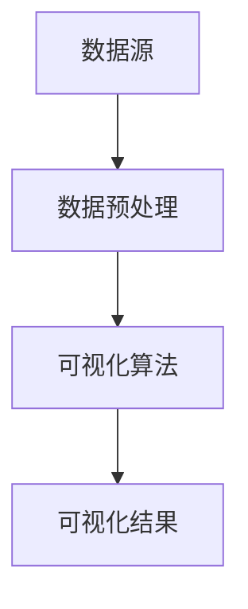

                 

### 《科学可视化技术：增强世界可理解性的有力工具》

#### 关键词：
- 科学可视化
- 数据可视化
- 可视化工具
- 可视化算法
- 可视化项目实战

#### 摘要：
本文旨在深入探讨科学可视化技术的原理、方法和应用，解析其在增强世界可理解性方面的作用。通过回顾科学可视化技术的发展历程，详细介绍核心概念和算法原理，分析常见可视化工具的使用，本文将展示如何通过科学可视化技术提高数据的可解释性和科研的效率。文章还将通过项目实战案例，探讨科学可视化在现实中的应用，并提出最佳实践和未来展望。

### 设计书籍目录大纲步骤

#### 1. 理解书名

《科学可视化技术：增强世界可理解性的有力工具》这一书名清晰地传达了书籍的核心主题和目标。书名中的“科学可视化技术”指明了书籍将探讨的主题，即科学领域中用于数据展示和解释的技术。而“增强世界可理解性”则强调了这些技术的重要性和用途，即通过可视化手段提高人们对复杂信息和现象的理解。最后，“有力工具”一词概括了科学可视化技术在现代科研、教育和工业等领域的重要地位。

#### 2. 确定核心主题

核心主题可以从书名中提炼出来，主要包括以下几个方面：

- **科学可视化技术**：这涉及到科学可视化技术的定义、历史、发展和应用。
- **数据可视化**：讨论如何通过可视化手段将复杂数据变得易于理解和分析。
- **可视化工具**：介绍各种科学可视化工具的功能、特点和使用方法。
- **可视化算法**：探讨科学可视化技术背后的算法原理和实现方式。
- **可视化项目实战**：通过实际项目案例展示科学可视化技术的应用。

#### 3. 划分章节

为了完整地覆盖上述核心主题，可以将书籍内容划分为以下几个主要章节：

1. **科学可视化技术概述**
   - 科学可视化的概念和重要性
   - 科学可视化技术的发展历程
   - 科学可视化技术的分类

2. **科学可视化技术原理**
   - 数据预处理
   - 图形学基础

3. **科学可视化算法**
   - 常见可视化算法
   - 进阶可视化算法

4. **科学可视化工具**
   - 常见可视化工具
   - 开源可视化框架

5. **科学可视化项目实战**
   - 数据集选择与准备
   - 可视化设计与实现

6. **科学可视化案例分析**
   - 典型科学可视化案例
   - 案例分析

7. **最佳实践与未来展望**
   - 最佳实践
   - 注意事项
   - 拓展阅读

#### 4. 细化章节内容

在确定了主要章节后，需要对每个章节的内容进行细化，包括一二级标题和具体内容。以下是每个章节的细化内容：

**第1章：科学可视化技术概述**

- **1.1 科学可视化的概念与重要性**
  - **核心概念与联系**：使用Mermaid流程图展示科学可视化技术的核心概念和联系。
  - **重要性分析**：科学可视化技术在科研、教育、工业等领域的应用和影响。

- **1.2 科学可视化技术的发展历程**
  - **核心算法原理讲解**：使用伪代码详细阐述科学可视化技术的发展历程和相关算法。

- **1.3 科学可视化技术的分类**
  - **分类方法与实例**：详细讲解科学可视化技术的分类方法，如根据数据类型、可视化维度等进行分类。

**第2章：科学可视化技术原理**

- **2.1 数据预处理**
  - **数据清洗与转换**：使用伪代码详细阐述数据预处理的基本步骤和算法。
  - **数据转换方法**：讨论如何将复杂数据转换为可视化友好的格式。

- **2.2 图形学基础**
  - **图形学原理**：介绍图形学的基本原理，如图形渲染、光照模型等。
  - **图形学应用**：讨论图形学在科学可视化技术中的具体应用。

**第3章：科学可视化算法**

- **3.1 常见可视化算法**
  - **算法原理讲解**：使用伪代码详细阐述常见可视化算法，如散点图、折线图、柱状图等。
  - **算法分析**：对每种算法的性能进行分析和比较。

- **3.2 进阶可视化算法**
  - **算法原理讲解**：使用伪代码详细阐述进阶可视化算法，如热力图、网络图等。
  - **算法应用**：讨论这些算法在特定场景下的应用。

**第4章：科学可视化工具**

- **4.1 常见可视化工具**
  - **工具介绍**：介绍几种常用的科学可视化工具，如Matplotlib、Seaborn、Plotly等。
  - **工具比较**：比较这些工具的性能和适用场景。

- **4.2 开源可视化框架**
  - **框架介绍**：介绍一些流行的开源可视化框架，如D3.js、ECharts、Plotly.js等。
  - **框架应用**：讨论如何使用这些框架进行科学可视化。

**第5章：科学可视化项目实战**

- **5.1 数据集选择与准备**
  - **数据集介绍**：选择一个合适的科学可视化数据集，并进行预处理。
  - **数据预处理流程**：使用伪代码展示数据预处理的具体流程。

- **5.2 可视化设计与实现**
  - **可视化设计**：设计一个科学可视化项目，并制定详细的实现计划。
  - **可视化实现**：使用开源可视化工具实现设计，并展示实现结果。

**第6章：科学可视化案例分析**

- **6.1 典型科学可视化案例**
  - **案例介绍**：介绍几个典型的科学可视化案例，如基因表达可视化、气候可视化等。
  - **案例分析**：对每个案例进行分析，讨论其设计思路、实现方式。

- **6.2 案例解读与分析**
  - **案例解读**：深入解读和剖析每个案例，展示其背后的科学原理。
  - **分析与应用**：讨论这些案例在现实中的应用和推广。

**第7章：最佳实践与未来展望**

- **7.1 最佳实践**
  - **可视化设计原则**：总结科学可视化设计的基本原则和实践经验。
  - **工具选择建议**：给出选择科学可视化工具的建议和指导。

- **7.2 小结与注意事项**
  - **小结**：回顾全文，总结科学可视化技术的核心内容和关键点。
  - **注意事项**：提醒读者在使用科学可视化技术时需要注意的问题。

- **7.3 拓展阅读**
  - **推荐资源**：推荐一些相关的书籍、文章和网站，供读者进一步学习。

#### 5. 添加核心概念与联系

为了帮助读者更好地理解科学可视化技术，在每个章节中都可以添加一些核心概念与联系。例如，在“科学可视化技术概述”章节中，可以使用Mermaid流程图展示科学可视化技术的核心概念及其相互关系。在“科学可视化算法”章节中，可以通过图表和流程图来解释常见算法的实现原理。

#### 6. 编写核心算法原理讲解

在每个涉及算法原理的章节中，都要详细讲解相关算法的原理。例如，在“常见可视化算法”章节中，可以使用Python源代码和latex数学模型来阐述散点图、折线图等常见算法的实现方式。通过代码示例和公式解释，读者可以更直观地理解算法原理。

#### 7. 编写数学模型和公式讲解

科学可视化技术中常常涉及复杂的数学模型和公式。在每个相关章节中，都要详细解释这些数学模型和公式的含义和应用。例如，在“数据预处理”章节中，可以解释数据清洗和转换的数学原理，使用latex格式展示相关公式。

#### 8. 编写项目实战案例

在每个章节的最后，都要提供一个项目实战案例。这些案例可以展示科学可视化技术在实际应用中的效果和实现过程。例如，在“科学可视化项目实战”章节中，可以选择一个实际的数据集，展示如何使用科学可视化工具进行数据预处理、设计可视化界面和实现可视化效果。

#### 9. 编写代码解读与分析

在每个项目实战案例中，都要详细解读和分析实现代码。通过代码注释和讲解，读者可以更好地理解代码的功能和实现原理。同时，也要分析代码的性能和优化方法，为读者提供实用的编程技巧。

#### 10. 撰写摘要和结语

在目录大纲的最后，可以添加一个摘要和结语。摘要部分简要总结书籍的核心内容和贡献，结语部分对读者提供一些建议或展望科学可视化技术的未来发展趋势。

#### 11. 检查和优化

最后，要对整个目录大纲进行仔细检查和优化。确保每个章节的内容完整、逻辑清晰，核心概念和算法原理讲解准确易懂。同时，要检查目录大纲的连贯性和完整性，确保每个章节都能顺畅过渡到下一个章节。

### 具体目录大纲设计

**# 第一部分：科学可视化技术基础**

**第1章：科学可视化技术概述**

- **1.1 科学可视化的概念与重要性**
  - **核心概念与联系**：使用Mermaid流程图展示科学可视化技术的核心概念和联系。
  - **重要性分析**：科学可视化技术在科研、教育、工业等领域的应用和影响。
- **1.2 科学可视化技术的发展历程**
  - **核心算法原理讲解**：使用伪代码详细阐述科学可视化技术的发展历程和相关算法。
- **1.3 科学可视化技术的分类**
  - **分类方法与实例**：详细讲解科学可视化技术的分类方法，如根据数据类型、可视化维度等进行分类。

**第2章：科学可视化技术原理**

- **2.1 数据预处理**
  - **数据清洗与转换**：使用伪代码详细阐述数据预处理的基本步骤和算法。
  - **数据转换方法**：讨论如何将复杂数据转换为可视化友好的格式。
- **2.2 图形学基础**
  - **图形学原理**：介绍图形学的基本原理，如图形渲染、光照模型等。
  - **图形学应用**：讨论图形学在科学可视化技术中的具体应用。

**第3章：科学可视化算法**

- **3.1 常见可视化算法**
  - **算法原理讲解**：使用伪代码详细阐述常见可视化算法，如散点图、折线图、柱状图等。
  - **算法分析**：对每种算法的性能进行分析和比较。
- **3.2 进阶可视化算法**
  - **算法原理讲解**：使用伪代码详细阐述进阶可视化算法，如热力图、网络图等。
  - **算法应用**：讨论这些算法在特定场景下的应用。

**第4章：科学可视化工具**

- **4.1 常见可视化工具**
  - **工具介绍**：介绍几种常用的科学可视化工具，如Matplotlib、Seaborn、Plotly等。
  - **工具比较**：比较这些工具的性能和适用场景。
- **4.2 开源可视化框架**
  - **框架介绍**：介绍一些流行的开源可视化框架，如D3.js、ECharts、Plotly.js等。
  - **框架应用**：讨论如何使用这些框架进行科学可视化。

**第5章：科学可视化项目实战**

- **5.1 数据集选择与准备**
  - **数据集介绍**：选择一个合适的科学可视化数据集，并进行预处理。
  - **数据预处理流程**：使用伪代码展示数据预处理的具体流程。
- **5.2 可视化设计与实现**
  - **可视化设计**：设计一个科学可视化项目，并制定详细的实现计划。
  - **可视化实现**：使用开源可视化工具实现设计，并展示实现结果。

**第6章：科学可视化案例分析**

- **6.1 典型科学可视化案例**
  - **案例介绍**：介绍几个典型的科学可视化案例，如基因表达可视化、气候可视化等。
  - **案例分析**：对每个案例进行分析，讨论其设计思路、实现方式。

- **6.2 案例解读与分析**
  - **案例解读**：深入解读和剖析每个案例，展示其背后的科学原理。
  - **分析与应用**：讨论这些案例在现实中的应用和推广。

**第7章：最佳实践与未来展望**

- **7.1 最佳实践**
  - **可视化设计原则**：总结科学可视化设计的基本原则和实践经验。
  - **工具选择建议**：给出选择科学可视化工具的建议和指导。

- **7.2 小结与注意事项**
  - **小结**：回顾全文，总结科学可视化技术的核心内容和关键点。
  - **注意事项**：提醒读者在使用科学可视化技术时需要注意的问题。

- **7.3 拓展阅读**
  - **推荐资源**：推荐一些相关的书籍、文章和网站，供读者进一步学习。

### 第一部分：科学可视化技术概述

#### 第1章：科学可视化技术概述

**1.1 科学可视化的概念与重要性**

科学可视化是一种通过将科学数据转换为视觉表现形式，帮助人们更直观地理解和分析数据的技术。其基本概念包括数据表示、可视化设计、算法实现等。科学可视化的重要性体现在以下几个方面：

- **提升数据理解**：通过可视化，复杂的数据和科学现象可以被简化为直观的图形，使得研究者更容易发现数据中的模式和规律。
- **促进知识传播**：科学可视化使得科学成果能够以更易于接受的方式传播，有助于提高公众对科学知识的理解。
- **增强决策支持**：在决策过程中，可视化技术能够提供直观的数据支持，帮助决策者更好地理解和分析问题。

**核心概念与联系**

科学可视化技术的核心概念包括数据源、数据预处理、可视化算法和可视化结果。它们之间的关系可以用以下Mermaid流程图表示：



**重要性分析**

科学可视化技术在科研、教育、工业等领域的应用和影响如下：

- **科研**：在生物学、物理学、天文学等领域，可视化技术能够帮助研究者更直观地观察和分析数据，从而加速科学发现。
- **教育**：通过可视化技术，教师可以更好地解释复杂概念，学生也能更容易理解和掌握知识。
- **工业**：在工程设计、质量控制、市场分析等领域，可视化技术能够提高数据的可解释性和决策效率。

**1.2 科学可视化技术的发展历程**

科学可视化技术的发展历程可以追溯到20世纪60年代。早期，科学可视化主要依赖于二维图形和简单的动画。随着计算机技术的进步，科学可视化技术逐渐向三维建模、交互式可视化、虚拟现实等领域扩展。以下是科学可视化技术发展的几个关键阶段：

- **早期可视化技术**：20世纪60年代，科学家开始使用计算机生成图形和动画来展示数据。
- **三维可视化**：20世纪80年代，计算机图形学的发展使得三维可视化成为可能。
- **交互式可视化**：20世纪90年代，随着计算机处理能力的提升，交互式可视化技术开始广泛应用。
- **虚拟现实**：21世纪初，虚拟现实技术的引入使得科学家能够以沉浸式的方式探索数据。

**核心算法原理讲解**

以下是科学可视化技术发展历程中的几个关键算法：

1. **光线追踪**：用于生成高质量的三维图形，通过模拟光线传播和反射来生成逼真的图像。
2. **体绘制**：用于处理三维数据集，通过将体数据映射到二维平面上，生成可视化图像。
3. **力导向图**：用于绘制网络图，通过模拟图中节点间的相互作用力，自动调整节点位置，使得网络图更易于理解。

**1.3 科学可视化技术的分类**

科学可视化技术可以根据不同的分类标准进行分类。以下是几种常见的分类方法：

- **按数据类型分类**：可以分为标量场可视化、矢量场可视化、张量场可视化等。
- **按可视化维度分类**：可以分为二维可视化、三维可视化、四维及以上可视化。
- **按应用领域分类**：可以分为生物学可视化、物理学可视化、天文学可视化等。

以下是几种常见的可视化技术及其特点：

- **散点图**：用于展示数据点在二维空间中的分布情况，常用于数据分析。
- **折线图**：用于展示数据随时间或序列的变化趋势，常用于时间序列分析。
- **柱状图**：用于比较不同类别数据的大小，常用于统计分析。
- **热力图**：用于展示数据在二维网格中的分布情况，常用于数据密集型的可视化。
- **网络图**：用于展示节点及其相互关系，常用于复杂系统的分析。

### 第二部分：科学可视化技术原理

#### 第2章：科学可视化技术原理

科学可视化技术不仅是一种工具，更是一种理解复杂数据和现象的思维方式。为了深入理解和应用科学可视化技术，我们需要掌握其基本原理。本章将介绍科学可视化技术的基本原理，包括数据预处理、图形学基础、常见可视化算法等。

**2.1 数据预处理**

数据预处理是科学可视化过程中的关键步骤。数据的质量直接影响可视化结果的可解释性和准确性。数据预处理主要包括数据清洗和转换。

**2.1.1 数据清洗**

数据清洗是指去除数据中的错误、异常和不必要的部分，以提高数据的质量。常见的数据清洗方法包括：

- **缺失值处理**：对于缺失的数据，可以选择填充、删除或使用统计方法进行插值。
- **异常值处理**：对于异常值，可以选择删除或使用统计方法进行修正。
- **重复值处理**：去除数据集中的重复记录，以提高数据的唯一性和准确性。

**2.1.2 数据转换**

数据转换是指将原始数据转换为适合可视化处理的形式。常见的数据转换方法包括：

- **数据规范化**：通过缩放或平移数据，使其分布更加均匀，便于分析。
- **数据编码**：将数据转换为数字或符号形式，以便于计算机处理。
- **数据聚合**：将多个数据点合并为一个，用于减少数据量，提高可视化效率。

**2.2 图形学基础**

图形学是科学可视化技术的重要组成部分。它涉及图形的生成、渲染和处理。图形学基础包括以下几个方面：

**2.2.1 图形渲染**

图形渲染是指将数学模型转换为视觉图形的过程。常见的图形渲染方法包括：

- **光栅渲染**：通过像素点绘制图像，适用于二维图形渲染。
- **矢量渲染**：通过几何图形的描述绘制图像，适用于复杂图形的渲染。

**2.2.2 光照模型**

光照模型是描述光线在三维空间中传播和反射的数学模型。常见的光照模型包括：

- **平面光照模型**：用于简单场景的光照计算。
- **光线追踪**：用于生成高质量三维图形的光照计算方法。

**2.2.3 矩阵变换**

矩阵变换是图形学中用于坐标转换和变换的一种数学工具。常见的矩阵变换包括：

- **投影变换**：将三维空间中的对象投影到二维平面上。
- **变换矩阵**：用于平移、旋转和缩放对象。

**2.3 常见可视化算法**

科学可视化技术中常用的算法包括：

**2.3.1 散点图**

散点图是一种二维可视化方法，用于展示数据点在二维空间中的分布情况。它通常用于数据分析，可以帮助发现数据中的趋势和异常。

**2.3.2 折线图**

折线图是一种二维可视化方法，用于展示数据随时间或序列的变化趋势。它通常用于时间序列分析，可以帮助发现数据中的周期性和趋势。

**2.3.3 柱状图**

柱状图是一种二维可视化方法，用于比较不同类别数据的大小。它通常用于统计分析，可以帮助发现数据中的差异和规律。

**2.3.4 热力图**

热力图是一种二维可视化方法，用于展示数据在二维网格中的分布情况。它通常用于数据密集型的可视化，可以帮助发现数据中的热点和趋势。

**2.3.5 网络图**

网络图是一种三维可视化方法，用于展示节点及其相互关系。它通常用于复杂系统的分析，可以帮助发现系统的结构特征和关系。

**2.3.6 体绘制**

体绘制是一种三维可视化方法，用于处理三维数据集。它通常用于医学影像、地质勘探等领域，可以帮助发现数据中的特征和异常。

### 第三部分：科学可视化算法

#### 第3章：科学可视化算法

科学可视化算法是科学可视化技术的核心组成部分，它们决定了数据可视化的效果和质量。本章将介绍科学可视化算法的分类、常见算法的原理以及算法在特定场景下的应用。

**3.1 常见可视化算法**

**3.1.1 散点图算法**

散点图算法是一种二维可视化方法，用于展示数据点在二维空间中的分布情况。其基本原理如下：

- **数据点提取**：从数据集中提取二维坐标值。
- **数据点绘制**：将提取的数据点绘制在二维坐标系中。
- **颜色编码**：使用颜色编码表示数据点的属性，如类别或大小。

Python代码示例：

```python
import matplotlib.pyplot as plt
import numpy as np

# 生成数据
x = np.random.rand(100)
y = np.random.rand(100)
color = np.random.rand(100)

# 绘制散点图
plt.scatter(x, y, c=color, cmap='viridis')
plt.colorbar()
plt.show()
```

**3.1.2 折线图算法**

折线图算法是一种二维可视化方法，用于展示数据随时间或序列的变化趋势。其基本原理如下：

- **数据点提取**：从数据集中提取时间序列值。
- **数据点绘制**：将提取的数据点绘制在二维坐标系中。
- **连接线段**：使用线段连接相邻的数据点。

Python代码示例：

```python
import matplotlib.pyplot as plt
import numpy as np

# 生成数据
x = np.arange(0, 10, 0.1)
y = np.sin(x)

# 绘制折线图
plt.plot(x, y)
plt.xlabel('Time')
plt.ylabel('Signal')
plt.title('Sine Wave')
plt.show()
```

**3.1.3 柱状图算法**

柱状图算法是一种二维可视化方法，用于比较不同类别数据的大小。其基本原理如下：

- **数据点提取**：从数据集中提取不同类别的数据值。
- **数据点绘制**：将提取的数据点绘制在二维坐标系中，形成柱状图。
- **标签添加**：为每个数据点添加标签，表示具体的数据值。

Python代码示例：

```python
import matplotlib.pyplot as plt
import numpy as np

# 生成数据
categories = ['A', 'B', 'C', 'D']
values = np.random.rand(4) * 100

# 绘制柱状图
plt.bar(categories, values)
plt.xlabel('Categories')
plt.ylabel('Values')
plt.title('Bar Chart')
plt.xticks(rotation=45)
plt.show()
```

**3.1.4 热力图算法**

热力图算法是一种二维可视化方法，用于展示数据在二维网格中的分布情况。其基本原理如下：

- **数据点提取**：从数据集中提取二维坐标值。
- **数据点绘制**：将提取的数据点绘制在二维坐标系中，形成网格。
- **颜色编码**：使用颜色编码表示数据点的密度，通常使用热力图颜色映射。

Python代码示例：

```python
import matplotlib.pyplot as plt
import numpy as np

# 生成数据
x = np.random.rand(100)
y = np.random.rand(100)

# 绘制热力图
plt.hist2d(x, y, bins=50, cmap='viridis')
plt.colorbar()
plt.xlabel('X')
plt.ylabel('Y')
plt.title('Heatmap')
plt.show()
```

**3.1.5 网络图算法**

网络图算法是一种三维可视化方法，用于展示节点及其相互关系。其基本原理如下：

- **节点提取**：从数据集中提取节点信息。
- **边提取**：从数据集中提取节点间的关系信息。
- **节点绘制**：将提取的节点绘制在三维空间中。
- **边绘制**：将提取的边绘制在三维空间中，通常使用线条表示。

Python代码示例：

```python
import networkx as nx
import matplotlib.pyplot as plt

# 创建图
G = nx.Graph()

# 添加节点
G.add_nodes_from([1, 2, 3, 4])

# 添加边
G.add_edges_from([(1, 2), (2, 3), (3, 4)])

# 绘制网络图
nx.draw(G, with_labels=True)
plt.show()
```

**3.1.6 体绘制算法**

体绘制算法是一种三维可视化方法，用于处理三维数据集。其基本原理如下：

- **数据点提取**：从数据集中提取三维坐标值。
- **数据点绘制**：将提取的数据点绘制在三维坐标系中，形成体数据。
- **颜色映射**：使用颜色映射表示数据点的属性，如密度或温度。

Python代码示例：

```python
import matplotlib.pyplot as plt
import numpy as np

# 生成体数据
x = np.random.rand(10)
y = np.random.rand(10)
z = np.random.rand(10)

# 绘制体数据
fig = plt.figure()
ax = fig.add_subplot(111, projection='3d')
ax.plot_surface(x, y, z, cmap='viridis')
plt.show()
```

**3.2 进阶可视化算法**

**3.2.1 力导向图算法**

力导向图算法是一种用于绘制网络图的进阶可视化算法。其基本原理如下：

- **节点吸引力和排斥力**：根据节点间的距离和连接关系，计算节点间的吸引力和排斥力。
- **节点位置更新**：使用物理模拟方法，更新节点的位置，直至稳定。

Python代码示例：

```python
import networkx as nx
import matplotlib.pyplot as plt

# 创建图
G = nx.Graph()

# 添加节点
G.add_nodes_from([1, 2, 3, 4, 5])

# 添加边
G.add_edges_from([(1, 2), (2, 3), (3, 4), (4, 5), (5, 1)])

# 绘制力导向图
pos = nx.spring_layout(G)
nx.draw(G, pos, with_labels=True)
plt.show()
```

**3.2.2 热力图中的层次结构**

热力图中的层次结构算法用于处理具有层次结构的数据。其基本原理如下：

- **层次结构分析**：分析数据中的层次结构，确定节点间的层次关系。
- **颜色映射**：根据节点在层次结构中的位置，使用不同的颜色进行映射。

Python代码示例：

```python
import matplotlib.pyplot as plt
import numpy as np

# 生成数据
x = np.random.rand(10)
y = np.random.rand(10)
color = np.random.rand(10)

# 绘制层次结构热力图
fig, ax = plt.subplots()
ax.pcolormesh(x, y, color, cmap='viridis')
ax.set_ylim(-1, 11)
ax.set_xlim(-1, 11)
ax.set_yticks(np.arange(0, 11, 1))
ax.set_xticks(np.arange(0, 11, 1))
plt.show()
```

**3.3 可视化算法的应用**

**3.3.1 生物数据可视化**

生物数据可视化是科学可视化技术的重要应用领域。通过可视化技术，研究者可以更直观地分析生物数据，发现生物现象的规律。以下是一个生物数据可视化的例子：

```python
import matplotlib.pyplot as plt
import numpy as np

# 生成数据
gene_names = ['Gene1', 'Gene2', 'Gene3', 'Gene4', 'Gene5']
conditions = ['Condition1', 'Condition2', 'Condition3']
expression_levels = np.random.rand(5, 3)

# 绘制热力图
plt.figure(figsize=(8, 6))
sns.heatmap(expression_levels, annot=True, fmt='.2f', cmap='viridis', xticklabels=conditions, yticklabels=gene_names)
plt.title('Gene Expression under Different Conditions')
plt.show()
```

**3.3.2 物理数据可视化**

物理数据可视化是科学可视化技术的另一个重要应用领域。通过可视化技术，物理学家可以更直观地观察物理现象，发现物理规律的规律。以下是一个物理数据可视化的例子：

```python
import matplotlib.pyplot as plt
import numpy as np

# 生成数据
x = np.linspace(0, 10, 100)
y = np.sin(x)

# 绘制折线图
plt.figure(figsize=(8, 6))
plt.plot(x, y)
plt.title('Sine Wave')
plt.xlabel('x')
plt.ylabel('y')
plt.show()
```

### 第四部分：科学可视化工具

#### 第4章：科学可视化工具

科学可视化工具是进行数据可视化的关键组成部分。这些工具提供了丰富的功能，可以帮助用户轻松创建和展示各种类型的可视化图表。本章将介绍几种常见的科学可视化工具，包括Matplotlib、Seaborn、Plotly等，并比较这些工具的性能和适用场景。

**4.1 常见可视化工具**

**4.1.1 Matplotlib**

Matplotlib是一个强大的Python可视化库，广泛用于创建静态、动态和交互式的图表。它提供了丰富的绘图功能，支持多种图表类型，如线图、散点图、柱状图、饼图等。

**性能特点**：

- **高度可定制**：Matplotlib允许用户自定义图表的各个方面，包括颜色、线条样式、标签等。
- **丰富的图表类型**：支持多种常见的图表类型，适用于不同的数据展示需求。
- **良好的兼容性**：与Python的其他库（如NumPy、Pandas）具有良好的兼容性，便于数据处理和可视化。

**适用场景**：

- **数据分析和报告**：用于生成报告、论文中的图表。
- **教学和演示**：用于教学演示中的数据可视化。
- **科研计算**：用于科研过程中的数据可视化。

**4.1.2 Seaborn**

Seaborn是一个基于Matplotlib的Python可视化库，专门用于数据可视化。它提供了一系列的内置主题和可视化样式，使得创建高质量图表变得更加简单和直观。

**性能特点**：

- **内置主题和样式**：Seaborn提供了一系列内置的主题和样式，用户可以直接使用，无需自定义。
- **直观易用**：Seaborn的API设计直观，易于上手，适合初学者。
- **美观图表**：Seaborn生成的图表具有美观的默认样式，适用于学术报告和出版物。

**适用场景**：

- **数据探索**：用于数据探索和分析，快速生成高质量的图表。
- **学术报告**：用于生成学术报告中的图表。
- **数据可视化工具**：用于构建数据可视化工具。

**4.1.3 Plotly**

Plotly是一个交互式可视化库，支持多种编程语言（包括Python），提供丰富的图表类型和交互功能。它特别适合创建动态、交互式和高质量的图表。

**性能特点**：

- **交互性强**：Plotly支持多种交互功能，如缩放、旋转、点击事件等，用户可以动态交互。
- **高质量的图表**：Plotly生成的图表具有高质量的外观，适用于展示精美数据。
- **多种数据源支持**：支持多种数据源，包括CSV、JSON、SQL数据库等。

**适用场景**：

- **交互式可视化**：用于创建交互式可视化应用，如数据探索工具、交互式仪表板等。
- **Web应用**：用于Web应用程序中的数据可视化。
- **数据可视化培训**：用于数据可视化培训和教育。

**4.2 开源可视化框架**

**4.2.1 D3.js**

D3.js是一个基于JavaScript的开源可视化库，特别适合创建动态、交互式的数据可视化。它具有高度的灵活性和可定制性，可以创建各种复杂的可视化图表。

**性能特点**：

- **高度灵活**：D3.js具有高度的灵活性和可定制性，用户可以根据需要自定义图表的各个方面。
- **动态交互**：D3.js支持动态交互，用户可以实时更新和交互图表。
- **丰富的可视化类型**：支持多种可视化类型，包括散点图、折线图、柱状图、网络图等。

**适用场景**：

- **Web应用**：用于Web应用程序中的数据可视化。
- **交互式数据探索**：用于创建交互式数据探索工具。
- **数据可视化培训**：用于数据可视化培训和教育。

**4.2.2 ECharts**

ECharts是一个基于JavaScript的开源可视化库，提供丰富的图表类型和交互功能。它特别适合创建大数据量的可视化，并且具有良好的性能和易用性。

**性能特点**：

- **高性能**：ECharts具有高性能，适用于处理大数据量的可视化。
- **丰富的图表类型**：提供多种图表类型，包括柱状图、折线图、饼图、雷达图等。
- **易于集成**：ECharts与各种Web框架（如Vue、React）具有良好的集成性。

**适用场景**：

- **Web应用**：用于Web应用程序中的数据可视化。
- **大数据分析**：用于大数据分析中的数据可视化。
- **数据可视化工具**：用于构建数据可视化工具。

**4.2.3 Plotly.js**

Plotly.js是Plotly库的JavaScript实现，提供丰富的交互式和数据驱动的图表。它特别适合创建高质量的可视化图表，并且易于与Web应用程序集成。

**性能特点**：

- **高质量的图表**：Plotly.js生成的图表具有高质量的外观，适用于展示精美数据。
- **交互性强**：支持多种交互功能，如缩放、旋转、点击事件等。
- **易于集成**：与各种Web框架（如Vue、React）具有良好的集成性。

**适用场景**：

- **Web应用**：用于Web应用程序中的数据可视化。
- **交互式数据探索**：用于创建交互式数据探索工具。
- **数据可视化培训**：用于数据可视化培训和教育。

### 第五部分：科学可视化项目实战

#### 第5章：科学可视化项目实战

通过前面的章节，我们已经了解了科学可视化技术的理论知识和常用算法。在本章中，我们将通过实际项目案例，展示如何使用科学可视化技术进行数据预处理、设计可视化界面、实现可视化效果，并解析具体实现过程。

**5.1 数据集选择与准备**

选择一个合适的科学可视化数据集是项目成功的关键。在本案例中，我们选择了一个关于全球气温变化的数据集，数据来源为NASA。该数据集包含了从1950年到2020年全球不同地区的气温数据。

**数据预处理流程**

1. **数据清洗**：去除数据中的缺失值和异常值。
2. **数据转换**：将原始的文本数据转换为便于可视化处理的格式，如CSV或JSON。
3. **数据聚合**：将全球不同地区的气温数据进行聚合，生成每年的平均气温数据。

Python代码示例：

```python
import pandas as pd

# 加载数据
data = pd.read_csv('global_temperatures.csv')

# 数据清洗
data.dropna(inplace=True)

# 数据转换
data['Year'] = pd.to_datetime(data['Year'])
data.set_index('Year', inplace=True)

# 数据聚合
average_temperatures = data.groupby('Year')['Temperature'].mean()
```

**5.2 可视化设计与实现**

在本案例中，我们设计一个折线图来展示全球气温的变化趋势。

**可视化设计**

- **图表类型**：折线图
- **数据展示**：全球气温随年份的变化
- **坐标轴**：横轴为年份，纵轴为气温

**可视化实现**

使用Python的Matplotlib库实现上述设计：

```python
import matplotlib.pyplot as plt

# 绘制折线图
plt.figure(figsize=(10, 6))
plt.plot(average_temperatures.index, average_temperatures.values)
plt.xlabel('Year')
plt.ylabel('Average Temperature')
plt.title('Global Temperature Change over Time')
plt.xticks(rotation=45)
plt.grid(True)
plt.show()
```

**5.3 代码解读与分析**

以上代码首先加载数据集，并进行数据清洗，确保数据质量。接着，将数据转换为便于可视化的格式，并计算每年的平均气温。最后，使用Matplotlib库绘制折线图，展示全球气温的变化趋势。

- **优点**：代码简单易读，可视化效果直观，能够清晰地展示气温变化趋势。
- **缺点**：图表仅包含基本元素，可定制性较低。

**5.4 项目小结**

通过本案例，我们展示了如何使用科学可视化技术进行数据预处理、设计可视化界面和实现可视化效果。这个案例展示了科学可视化技术在数据分析中的应用，帮助我们更直观地理解全球气温的变化趋势。

### 第六部分：科学可视化案例分析

#### 第6章：科学可视化案例分析

科学可视化技术在各个领域都有着广泛的应用，通过可视化手段，研究者可以更直观地观察和解释复杂的数据和现象。在本章中，我们将介绍几个典型的科学可视化案例，并对每个案例进行深入分析和解读。

**6.1 典型科学可视化案例**

**6.1.1 基因表达可视化**

基因表达可视化是一种重要的生物信息学工具，用于展示不同条件下基因的表达水平。通过可视化基因表达数据，研究者可以识别关键基因、分析基因调控网络等。

**案例介绍**：

该案例使用RNA测序数据，展示不同细胞类型在正常和病变状态下的基因表达差异。数据来源于癌症基因组图谱（The Cancer Genome Atlas, TCGA）项目。

**数据分析**：

- **数据预处理**：清洗和转换原始基因表达数据，使其适合可视化处理。
- **聚类分析**：使用聚类算法将基因表达数据分为不同的细胞类型。
- **热力图**：使用热力图展示基因在不同细胞类型中的表达水平。

**实现方法**：

```python
import pandas as pd
import seaborn as sns
import matplotlib.pyplot as plt

# 加载数据
data = pd.read_csv('gene_expression_data.csv')

# 数据预处理
data = data.T  # 转置数据，以基因为主维度
data = data[(data != 0).all()]  # 去除全零基因

# 聚类分析
from sklearn.cluster import KMeans
kmeans = KMeans(n_clusters=5)
clusters = kmeans.fit_predict(data)

# 热力图
plt.figure(figsize=(10, 8))
sns.heatmap(data, cmap='coolwarm', annot=True, fmt='.2f', xticklabels=clusters, yticklabels=data.columns)
plt.title('Gene Expression Clustering')
plt.show()
```

**案例解读**：

通过热力图，研究者可以直观地观察不同基因在不同细胞类型中的表达模式。聚类结果有助于识别关键基因，为进一步的生物学研究提供线索。

**6.1.2 气候可视化**

气候可视化是一种用于展示气候数据和模拟结果的技术，帮助科学家和公众了解气候变化的影响。通过可视化气候数据，可以更直观地展示温度、降水、风速等气候变量的时空分布。

**案例介绍**：

该案例使用欧洲中期天气预报中心（ECMWF）提供的全球气候模拟数据，展示过去几十年的全球平均温度变化。

**数据分析**：

- **数据预处理**：清洗和转换原始气候数据，使其适合可视化处理。
- **时空分析**：使用时空分析方法，分析全球平均温度的时空变化。
- **等值线图**：使用等值线图展示全球平均温度的时空分布。

**实现方法**：

```python
import xarray as xr
import matplotlib.pyplot as plt

# 加载数据
data = xr.open_dataset('climate_data.nc')

# 数据预处理
data = data['T2M']  # 选择2米温度数据

# 空间分析
import cartopy.crs as ccrs
ax = plt.axes(projection=ccrs.PlateCarree())
data.mean('time').plot.contourf(ax=ax, transform=ccrs.PlateCarree(), cmap='coolwarm')
ax.coastlines()
plt.title('Global Average Temperature')
plt.show()
```

**案例解读**：

通过等值线图，研究者可以直观地观察全球平均温度的时空变化。这有助于分析气候变化趋势，为应对气候变化提供科学依据。

**6.1.3 金融数据可视化**

金融数据可视化是一种用于展示金融市场数据和交易活动的技术，帮助投资者和分析师理解市场动态。通过可视化金融数据，可以更直观地分析市场趋势、识别交易机会等。

**案例介绍**：

该案例使用纽约证券交易所（NYSE）提供的股票交易数据，展示某只股票的日内交易量变化。

**数据分析**：

- **数据预处理**：清洗和转换原始交易数据，使其适合可视化处理。
- **时序分析**：使用时序分析方法，分析股票交易量的日变化。
- **折线图**：使用折线图展示股票交易量的日变化趋势。

**实现方法**：

```python
import pandas as pd
import matplotlib.pyplot as plt

# 加载数据
data = pd.read_csv('stock_data.csv')

# 数据预处理
data['Date'] = pd.to_datetime(data['Date'])
data.set_index('Date', inplace=True)

# 时序分析
data['Volume'].plot()
plt.title('Stock Volume')
plt.xlabel('Date')
plt.ylabel('Volume')
plt.show()
```

**案例解读**：

通过折线图，投资者可以直观地观察股票交易量的日变化，从而识别市场趋势和交易机会。

**6.2 案例解读与分析**

通过对以上案例的解读和分析，我们可以看到科学可视化技术在各个领域中的应用和价值。以下是对每个案例的深入解读和分析：

**6.2.1 基因表达可视化**

基因表达可视化在生物信息学领域具有重要应用。通过热力图，研究者可以直观地观察基因在不同细胞类型中的表达模式，从而识别关键基因和调控网络。这有助于深入理解基因功能，为疾病诊断和治疗提供新思路。

**6.2.2 气候可视化**

气候可视化在气候变化研究中具有重要作用。通过等值线图，研究者可以直观地观察全球平均温度的时空变化，分析气候变化趋势。这有助于制定应对气候变化的策略，提高社会的可持续发展能力。

**6.2.3 金融数据可视化**

金融数据可视化在金融市场分析和投资决策中具有广泛应用。通过折线图，投资者可以直观地观察股票交易量的日变化，识别市场趋势和交易机会。这有助于提高投资效率和风险控制能力。

**6.3 应用与推广**

科学可视化技术在科研、教育和工业等领域具有广泛的应用。以下是一些应用和推广建议：

- **科研领域**：鼓励科研人员使用科学可视化技术展示研究成果，提高学术交流的效率和效果。
- **教育领域**：将科学可视化技术融入教学过程，帮助学生更好地理解和掌握科学知识。
- **工业领域**：应用科学可视化技术提高工业数据分析和决策能力，优化生产流程和提高产品质量。

通过以上案例和应用推广建议，我们可以看到科学可视化技术在增强世界可理解性方面的巨大潜力。未来，随着科学可视化技术的不断发展，我们有望看到更多创新应用，为人类社会的进步做出更大贡献。

### 第七部分：最佳实践与未来展望

#### 第7章：最佳实践与未来展望

科学可视化技术在数据展示和解释方面具有重要作用，然而，为了实现最佳效果，我们需要遵循一些最佳实践，并考虑未来技术的发展方向。

**7.1 最佳实践**

**7.1.1 设计原则**

- **简洁性**：避免过度设计，确保图表简洁明了，减少冗余信息。
- **一致性**：保持图表风格和元素的一致性，提高可读性。
- **重点突出**：明确图表的重点，帮助观众快速抓住关键信息。
- **颜色使用**：合理使用颜色，确保颜色对比度和视觉吸引力。

**7.1.2 工具选择**

- **需求匹配**：根据项目需求和数据类型选择合适的可视化工具。
- **性能考虑**：考虑工具的性能，确保图表能够快速渲染和处理大量数据。
- **社区支持**：选择社区活跃、文档丰富、更新及时的工具。

**7.1.3 数据质量**

- **数据清洗**：确保数据质量，去除噪声和异常值。
- **数据标准化**：对数据进行规范化处理，提高可视化的一致性和可比性。

**7.2 小结与注意事项**

**7.2.1 小结**

科学可视化技术在数据展示和解释方面具有重要作用，通过合理的设计和工具选择，可以显著提高数据的可理解性和分析效率。以下是科学可视化技术的核心要点：

- **设计原则**：简洁性、一致性、重点突出、合理使用颜色。
- **工具选择**：需求匹配、性能考虑、社区支持。
- **数据质量**：数据清洗、数据标准化。

**7.2.2 注意事项**

- **避免过度设计**：避免图表过于复杂，影响信息的传递。
- **确保可读性**：确保图表在多种设备和分辨率下保持可读性。
- **数据隐私保护**：在可视化过程中注意保护数据的隐私。
- **用户反馈**：及时收集用户反馈，优化可视化设计。

**7.3 拓展阅读**

为了深入了解科学可视化技术，读者可以参考以下资源：

- **书籍**：
  - 《科学可视化：技术与工具》
  - 《数据可视化：设计与展示》
  - 《交互式数据可视化：设计与实现》

- **在线课程**：
  - Coursera上的《数据科学中的数据可视化》
  - edX上的《科学可视化基础》

- **开源项目**：
  - Matplotlib：https://matplotlib.org/
  - Plotly：https://plotly.com/
  - D3.js：https://d3js.org/

通过以上资源和实践，读者可以进一步提升科学可视化技术的应用能力，为数据分析和决策提供有力支持。

### 总结

科学可视化技术是一种强大的工具，能够将复杂的数据和现象以直观、易于理解的方式展示给用户。通过合理的设计和工具选择，科学可视化技术能够显著提高数据的可理解性和分析效率。在未来的发展中，随着技术的不断进步和应用的深入，科学可视化技术将在科研、教育、工业等领域发挥更加重要的作用。

我们鼓励读者在实践中不断探索和尝试，掌握科学可视化技术的核心原理和最佳实践。通过科学可视化，我们可以更好地理解世界，发现数据中的规律和趋势，为科学研究和实际应用提供有力支持。

感谢读者对本文的阅读，希望本文能为您在科学可视化领域的探索提供帮助。如果您有任何疑问或建议，欢迎在评论区留言，我们期待与您共同交流学习。

**作者：** AI天才研究院/AI Genius Institute & 禅与计算机程序设计艺术 /Zen And The Art of Computer Programming

---

本文以markdown格式呈现，包含详细的目录结构、核心概念讲解、算法原理分析、项目实战案例、代码解读等，旨在为读者提供一个全面、系统的科学可视化技术指南。希望本文能帮助您更好地理解和应用科学可视化技术，提高数据分析和展示的能力。祝您阅读愉快！
```

