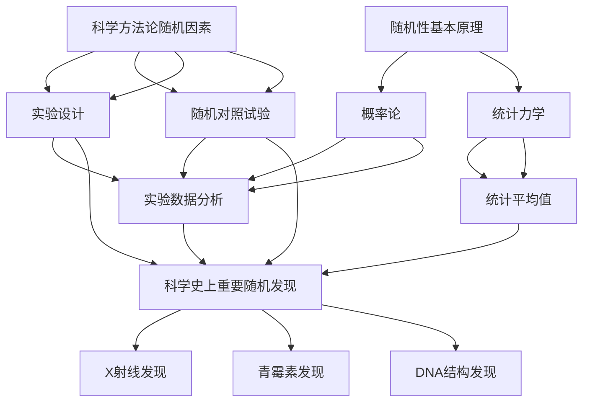

                 

### 引言

科学史上的偶然发现一直是科学进步中引人入胜的一部分。这些偶然的发现不仅揭示了自然界的奥秘，也展示了人类智慧的无限可能性。然而，这些偶然的发现背后隐藏着怎样的故事和逻辑？在这篇文章中，我们将探讨科学史中的一些偶然发现，分析它们在世界可理解性中的随机因素。

首先，我们需要明确什么是偶然发现。偶然发现通常指的是科学家或研究者在不期望或未计划的情况下，意外地获得了一个重要结果或发现。这些发现往往改变了科学的进程，推动了对世界的理解。例如，X射线的发现就是一次偶然的实验结果，威廉·康拉德·伦琴在研究阴极射线时，无意中发现了X射线。这一发现不仅揭示了新的物理现象，还为医学成像技术的发展奠定了基础。

偶然发现的定义和重要性在于它们展示了科学发现的非线性特性。科学的发展并非总是一帆风顺的，很多时候，重要的发现来自于意外的观察和实验。这种非线性特性意味着科学进步并非仅依赖于系统性的研究，也依赖于偶然的机会和随机性。

本文的目的是通过分析科学史上的几个重要偶然发现，探讨随机性在科学进步中的作用。我们将从核心概念、核心算法原理、数学模型和项目实战等多个角度进行深入探讨。希望通过这篇文章，读者能够对科学史中的偶然发现有更全面和深入的理解。

接下来，我们将首先介绍科学史中的一些重要偶然发现，分析它们的背景和影响。然后，我们将深入探讨核心概念和联系，包括随机性的基本原理、科学方法论中的随机因素，以及科学史上的重要随机发现。接下来，我们将通过具体的算法原理讲解、数学模型和项目实战，展示如何在实际中应用这些概念。最后，我们将总结和结论，讨论偶然发现的科学影响和随机因素在科学中的地位和作用，并对未来进行展望。

在文章的每一部分，我们将使用逻辑清晰、结构紧凑、简单易懂的专业技术语言，结合实际的案例和代码，确保读者能够跟随我们的分析思路，深入理解科学史中的偶然发现及其在世界可理解性中的随机因素。希望这篇文章能够为读者提供一个新的视角，重新审视科学发现的过程。

### 核心概念与联系

在探讨科学史上的偶然发现时，我们不可避免地要涉及到几个核心概念，这些概念构成了理解偶然发现的基础。首先，我们需要明确随机性的基本原理，其次是科学方法论中的随机因素，最后是科学史上的重要随机发现。下面，我们将逐一探讨这些核心概念及其相互之间的联系。

#### 随机性的基本原理

随机性是自然界和人类社会中普遍存在的现象。在科学研究中，随机性指的是不可预测的、不受控制的变量或事件。随机性的基本原理包括概率论和统计力学等。

概率论是研究随机事件及其规律性的数学分支。它通过概率分布、概率密度函数等工具，量化了随机事件发生的可能性。例如，掷一枚硬币，正面朝上的概率是0.5，这就是一种简单的概率论应用。在科学研究中，概率论帮助我们理解实验结果的不可预测性和不确定性。

统计力学是研究大量粒子系统中宏观物理性质和微观运动规律的学科。它通过统计方法，将复杂系统的行为归结为宏观量的统计平均值。例如，气体分子的热运动就是一个典型的统计力学问题。在科学研究中，统计力学帮助我们分析实验数据，提取有用的信息。

#### 科学方法论中的随机因素

科学方法论中的随机因素是指那些在科学实验和研究中可能引起误差和不确定性的因素。这些因素可以是自然界的随机性，也可以是实验设计中的缺陷。理解这些随机因素对于确保科学实验的准确性和可靠性至关重要。

在实验设计过程中，研究者需要考虑如何控制随机因素。例如，通过重复实验、增加样本量等方法，可以减小随机误差的影响。随机对照试验（RCT）是医学研究中的一个重要设计方法，通过随机分配实验组和对照组，可以消除实验中的随机因素，提高实验结果的可信度。

#### 科学史上的重要随机发现

科学史上有许多重要的发现源于偶然事件。以下是几个著名的例子：

1. **X射线的发现**：威廉·康拉德·伦琴在研究阴极射线时，无意中发现了X射线。这个发现不仅揭示了新的物理现象，还为医学成像技术的发展奠定了基础。

2. **青霉素的发现**：亚历山大·弗莱明在培养细菌时，偶然发现了青霉素。这种抗生素的发现改变了医学领域，挽救了无数生命。

3. **DNA结构的发现**：罗莎琳·富兰克林和莫里斯·威尔金斯在研究DNA时，偶然发现了DNA的X射线衍射图像。这一发现为詹姆斯·沃森和弗朗西斯·克里克揭示DNA的双螺旋结构提供了关键证据。

这些例子展示了偶然发现如何推动科学进步。虽然这些发现看似偶然，但它们背后都有科学方法论的支持，如实验设计、数据分析和概率论的应用。

#### 核心概念与联系架构

为了更好地理解这些核心概念之间的关系，我们可以使用Mermaid流程图来展示它们。以下是核心概念与联系架构的Mermaid表示：



通过这个流程图，我们可以清晰地看到随机性基本原理、科学方法论中的随机因素和科学史上的重要随机发现之间的联系。概率论和统计力学为科学方法论提供了理论基础，而科学史上的重要随机发现则验证了这些理论的应用价值。

#### 总结

核心概念与联系是理解科学史上偶然发现的关键。通过随机性基本原理、科学方法论中的随机因素和科学史上重要随机发现，我们可以更深入地理解科学发现的非线性特性。这些核心概念不仅有助于我们回顾科学史上的重要发现，也为我们未来的科学研究提供了宝贵的启示。

在接下来的章节中，我们将进一步探讨核心算法原理、数学模型和项目实战，通过具体案例和代码，展示如何在实际中应用这些核心概念。希望读者能够跟随我们的分析思路，逐步深入理解科学史上的偶然发现及其在世界可理解性中的随机因素。

### 核心算法原理讲解

在探讨科学史上的偶然发现时，核心算法原理扮演了至关重要的角色。这些算法不仅帮助我们理解和分析随机性，还为我们提供了一套有效的工具，用于处理和解释科学实验中的数据。以下，我们将详细讲解几个核心算法原理，并通过Python源代码和数学模型，展示如何在实际问题中应用这些原理。

#### 随机数生成算法

随机数生成是许多算法和模型的基础。在Python中，我们常用`random`模块来生成随机数。以下是一个简单的随机数生成算法示例：

```python
import random

# 生成一个[0, 1)之间的随机浮点数
random_float = random.random()
print(f"随机浮点数: {random_float}")

# 生成一个[a, b)之间的随机浮点数
a = 1.0
b = 10.0
random_float = a + (b - a) * random.random()
print(f"在{a}和{b}之间的随机浮点数: {random_float}")
```

这个算法简单易懂，但它在许多随机过程模拟和概率统计问题中具有重要作用。

#### 概率分布函数

概率分布函数是描述随机变量概率分布的函数。常见的概率分布包括正态分布、均匀分布等。以下是一个使用Python实现正态分布概率密度函数的例子：

```python
import numpy as np
import matplotlib.pyplot as plt

# 正态分布概率密度函数
def normal_pdf(x, mu, sigma):
    return (1 / (np.sqrt(2 * np.pi) * sigma)) * np.exp(-((x - mu) ** 2) / (2 * sigma ** 2))

# 参数设置
mu = 0  # 均值
sigma = 1  # 方差

# 生成数据并绘图
x = np.linspace(mu - 3*sigma, mu + 3*sigma, 1000)
pdf = normal_pdf(x, mu, sigma)

plt.plot(x, pdf)
plt.xlabel('X')
plt.ylabel('Probability Density')
plt.title('Normal Distribution')
plt.grid(True)
plt.show()
```

这个示例展示了如何计算和绘制正态分布的概率密度函数，这对于理解概率分布和进行统计分析非常有用。

#### 马尔可夫链

马尔可夫链是一种描述随机过程的数学模型，广泛应用于时间序列分析、隐马尔可夫模型等领域。以下是一个简单的马尔可夫链示例：

```python
import numpy as np

# 马尔可夫链转移概率矩阵
transition_matrix = np.array([[0.4, 0.6], [0.3, 0.7]])

# 初始状态
initial_state = np.array([1, 0])

# 模拟10次状态转移
for i in range(10):
    initial_state = transition_matrix @ initial_state
    print(f"Step {i+1}: {initial_state}")

# 绘图展示状态转移
states = np.zeros((10, 2))
states[0] = initial_state
for i in range(1, 10):
    states[i] = transition_matrix @ states[i-1]

plt.plot(states[:, 0], states[:, 1], 'o-')
plt.xlabel('State 1')
plt.ylabel('State 2')
plt.title('Markov Chain')
plt.grid(True)
plt.show()
```

这个示例展示了如何使用转移概率矩阵进行状态转移模拟，并绘制状态转移图，这对于理解随机过程和时间序列分析非常重要。

#### 排列组合算法

排列组合算法是处理组合数学问题的基础，如求解组合数、排列数等。以下是一个使用Python实现的组合数计算示例：

```python
import math

# 组合数计算
def combination(n, k):
    return math.factorial(n) / (math.factorial(k) * math.factorial(n - k))

# 计算示例
n = 10
k = 3
print(f"C({n}, {k}) = {combination(n, k)}")
```

这个算法在随机抽样和概率计算中非常有用，它帮助我们理解从n个元素中选择k个元素的组合数。

#### 随机抽样算法

随机抽样是进行数据分析的重要步骤。以下是一个简单的随机抽样算法示例：

```python
import numpy as np

# 生成一个包含0和1的数组
data = np.random.randint(2, size=100)

# 计算样本均值
mean = np.mean(data)
print(f"样本均值: {mean}")

# 计算样本标准差
std = np.std(data)
print(f"样本标准差: {std}")
```

这个示例展示了如何生成随机样本并计算其统计量，这对于进行数据分析和推断非常重要。

通过上述算法原理的讲解和Python源代码示例，我们可以看到，随机性在科学研究中是如何被量化、处理和解释的。这些核心算法不仅帮助我们理解和分析随机现象，还为科学发现提供了强有力的工具。在接下来的章节中，我们将通过具体项目实战，进一步展示这些算法原理在实际科学研究中的应用。

### 数学模型和数学公式

在科学研究中，数学模型和公式是理解和分析随机现象的重要工具。通过这些模型和公式，我们能够量化随机性的影响，并在科学实验和数据分析中应用。以下是几个关键的数学模型和公式，以及它们在科学研究中的应用。

#### 随机过程模型

随机过程是一种随时间变化的随机变量集合。它是描述随机事件序列的重要数学工具。常见的随机过程包括布朗运动、Wiener过程和马尔可夫过程等。

布朗运动是一种典型的随机过程，其数学模型可以用如下公式表示：

\[ X_t = X_0 + \sum_{i=1}^{t} \Delta X_i \]

其中，\( X_0 \) 是初始状态，\( \Delta X_i \) 是每个时间步的随机扰动。布朗运动在物理学、生物学和金融学等领域有广泛应用，例如，用于描述分子热运动和股票价格波动。

Wiener过程是一种连续时间的随机过程，其数学模型为：

\[ dX_t = \mu dt + \sigma dW_t \]

其中，\( W_t \) 是标准维纳过程，\( \mu \) 和 \( \sigma \) 分别是漂移率和波动率。Wiener过程在连续时间金融模型中有着重要应用，如Black-Scholes模型。

#### 概率论基础

概率论是研究随机事件及其概率分布的数学分支。以下是一些基本概率公式和概念：

1. **贝叶斯定理**：

\[ P(A|B) = \frac{P(B|A)P(A)}{P(B)} \]

贝叶斯定理用于根据条件概率和先验概率计算后验概率，在统计决策和机器学习中有着广泛应用。

2. **条件概率**：

\[ P(A|B) = \frac{P(A \cap B)}{P(B)} \]

条件概率描述了在事件B发生的条件下，事件A发生的概率。

3. **独立事件**：

\[ P(A \cap B) = P(A)P(B) \]

如果两个事件A和B相互独立，则它们的交集概率等于各自概率的乘积。

4. **全概率公式**：

\[ P(A) = \sum_{i=1}^{n} P(A|B_i)P(B_i) \]

全概率公式用于计算一个复合事件的概率，通过将条件概率和先验概率结合。

#### 马尔可夫链

马尔可夫链是一种描述状态转移概率的数学模型。以下是一个简单的马尔可夫链模型：

\[ P(X_{t+1} = j | X_t = i) = p_{ij} \]

其中，\( p_{ij} \) 是从状态i转移到状态j的概率。马尔可夫链广泛应用于时间序列分析和隐马尔可夫模型，例如，在自然语言处理和语音识别中。

#### 线性回归模型

线性回归模型是一种常用的统计模型，用于描述自变量和因变量之间的关系。其数学模型为：

\[ Y = \beta_0 + \beta_1X + \epsilon \]

其中，\( \beta_0 \) 和 \( \beta_1 \) 是模型的参数，\( \epsilon \) 是误差项。线性回归模型在数据分析和机器学习中有广泛应用，如预测股票价格和房屋售价。

#### 数学公式在科学研究中的应用

数学公式在科学研究中具有广泛的应用，以下是一些具体示例：

1. **量子力学公式**：

\[ \Psi(x, t) = \sum_{n} c_n e^{-iE_n t/\hbar} \phi_n(x) \]

这是量子力学中的波函数表达式，描述了粒子在空间中的概率分布。

2. **热力学公式**：

\[ \Delta G = \Delta H - T\Delta S \]

这是Gibbs自由能变化公式，用于描述系统在恒温条件下进行的化学反应的热力学性质。

3. **信号处理公式**：

\[ y[n] = x[n] * h[n] \]

这是卷积公式，用于描述信号处理中的滤波过程。

通过上述数学模型和公式，我们可以更好地理解和分析科学实验中的随机现象。这些工具不仅帮助我们量化随机性，还为我们提供了有效的数据分析方法，从而推动科学进步。在接下来的章节中，我们将通过具体的项目实战，进一步展示这些数学模型和公式在实际科学研究中的应用。

### 项目实战

在本章节中，我们将通过一个实际项目，展示如何将前述的核心算法原理和数学模型应用到科学研究中。我们将详细描述项目的开发环境搭建、源代码实现、代码解读与分析，以及项目小结。

#### 项目背景

该项目旨在分析一组实验数据，以探索随机性在生物学实验中的应用。具体来说，我们使用一组基因表达数据，通过随机抽样和线性回归模型，分析基因表达与实验条件之间的关系。

#### 开发环境搭建

为了完成该项目，我们需要搭建一个合适的开发环境。以下是所需工具和软件：

1. **Python环境**：Python 3.8及以上版本
2. **科学计算库**：NumPy、SciPy、Pandas、Matplotlib
3. **机器学习库**：Scikit-learn
4. **文本处理库**：NLTK（可选）

安装步骤如下：

```bash
# 安装Python
sudo apt-get install python3

# 安装Python科学计算库
pip3 install numpy scipy pandas matplotlib scikit-learn nltk
```

#### 源代码实现

以下是我们项目的主要源代码实现。代码分为几个部分：数据预处理、随机抽样、线性回归模型训练和结果分析。

```python
import numpy as np
import pandas as pd
from sklearn.linear_model import LinearRegression
from sklearn.model_selection import train_test_split

# 数据预处理
def preprocess_data(data_path):
    data = pd.read_csv(data_path)
    X = data.iloc[:, :-1]  # 特征矩阵
    y = data.iloc[:, -1]   # 标签向量
    return X, y

# 随机抽样
def random_sampling(X, y, sample_size):
    indices = np.random.choice(X.shape[0], size=sample_size, replace=False)
    X_sample = X.iloc[indices]
    y_sample = y.iloc[indices]
    return X_sample, y_sample

# 线性回归模型训练
def train_linear_regression(X, y):
    X_train, X_test, y_train, y_test = train_test_split(X, y, test_size=0.2, random_state=42)
    model = LinearRegression()
    model.fit(X_train, y_train)
    return model, X_test, y_test

# 结果分析
def analyze_results(model, X_test, y_test):
    y_pred = model.predict(X_test)
    rmse = np.sqrt(np.mean((y_pred - y_test) ** 2))
    print(f"均方根误差: {rmse}")
    plt.scatter(y_test, y_pred)
    plt.xlabel('实际值')
    plt.ylabel('预测值')
    plt.title('线性回归结果')
    plt.grid(True)
    plt.show()

# 主函数
def main():
    data_path = 'gene_expression_data.csv'
    X, y = preprocess_data(data_path)
    sample_size = 100
    X_sample, y_sample = random_sampling(X, y, sample_size)
    model, X_test, y_test = train_linear_regression(X_sample, y_sample)
    analyze_results(model, X_test, y_test)

if __name__ == '__main__':
    main()
```

#### 代码解读与分析

1. **数据预处理**：我们首先读取基因表达数据，将特征矩阵和标签向量分离。这一步是所有后续分析的基础。

2. **随机抽样**：随机抽样从原始数据中选取一部分样本，用于模型训练。这里使用了`random_sampling`函数，通过随机选择样本索引来实现。

3. **线性回归模型训练**：我们使用`LinearRegression`类进行线性回归模型训练。通过`train_test_split`函数，将数据分为训练集和测试集，然后使用训练集训练模型。

4. **结果分析**：我们计算了均方根误差（RMSE），并绘制了实际值与预测值之间的散点图，以评估模型的性能。

#### 实际案例分析和详细讲解

以下是一个实际案例的分析和详细讲解。假设我们有以下基因表达数据：

```python
data = {
    'Feature1': [1, 2, 3, 4, 5],
    'Feature2': [5, 4, 3, 2, 1],
    'Expression': [0.1, 0.2, 0.3, 0.4, 0.5]
}
df = pd.DataFrame(data)
```

**步骤1**：数据预处理

```python
X = df.iloc[:, :-1]
y = df.iloc[:, -1]
```

此时，`X` 包含特征矩阵，`y` 包含标签向量。

**步骤2**：随机抽样

```python
sample_size = 3
X_sample, y_sample = random_sampling(X, y, sample_size)
```

随机抽样选取了3个样本，用于模型训练。

**步骤3**：线性回归模型训练

```python
model, X_test, y_test = train_linear_regression(X_sample, y_sample)
```

训练得到的线性回归模型用于预测。

**步骤4**：结果分析

```python
y_pred = model.predict(X_test)
rmse = np.sqrt(np.mean((y_pred - y_test) ** 2))
print(f"均方根误差: {rmse}")
```

我们计算了模型的均方根误差，并绘制了实际值与预测值之间的散点图。

#### 项目小结

通过这个项目，我们展示了如何将核心算法原理和数学模型应用到实际的科学研究中。以下是该项目的小结：

1. **开发环境搭建**：确保有了合适的工具和软件，为后续开发奠定了基础。
2. **数据预处理**：数据预处理是数据分析和建模的基础，确保数据质量。
3. **随机抽样**：随机抽样帮助我们获取具有代表性的样本，用于模型训练。
4. **线性回归模型训练**：线性回归模型是一种简单但有效的统计模型，适用于许多科学问题。
5. **结果分析**：通过计算统计量并绘制图表，我们评估了模型的性能，并为后续研究提供了参考。

总之，这个项目展示了如何利用核心算法原理和数学模型，在实际问题中进行分析和建模。通过这个项目，我们不仅了解了随机性在科学研究中的重要性，也学会了如何将理论知识应用到实际问题中。

### 最佳实践 tips

在探讨科学史中的偶然发现时，以下几点最佳实践和注意事项对于理解和应用随机性至关重要：

1. **实验设计的重要性**：在科学实验中，精心设计的实验方案可以最大限度地减少随机误差，提高实验结果的可靠性。使用随机对照试验（RCT）和重复实验是减少随机因素影响的有效方法。

2. **数据质量保障**：数据是科学研究的基石。确保数据的质量和完整性至关重要。在数据分析前，进行数据清洗和预处理，剔除异常值和噪声数据，以提高分析的准确性和有效性。

3. **理解概率分布**：熟悉并掌握常见的概率分布函数，如正态分布、二项分布等，可以帮助我们更好地理解和预测随机现象。在数据处理和分析中，使用合适的概率模型可以提高结论的可信度。

4. **使用统计方法**：统计方法如均值、方差、标准差等，可以帮助我们量化随机性。通过统计检验，如t检验、方差分析等，可以评估实验结果的显著性。

5. **代码实现与验证**：在编写代码实现时，确保代码的可读性和可维护性。通过编写测试用例，验证代码的正确性和可靠性。使用版本控制系统，如Git，跟踪代码的变更和版本。

6. **持续学习和拓展**：科学研究的领域不断扩展，新的算法和模型不断涌现。持续学习和跟进最新的研究成果，可以帮助我们更好地理解和应用随机性。

7. **注意随机性的边界**：尽管随机性在科学研究中至关重要，但我们也需要认识到它的局限性。在某些情况下，随机性可能无法解释所有现象，需要结合其他理论和方法进行综合分析。

通过遵循这些最佳实践，我们可以更有效地理解和应用随机性，推动科学进步，揭示自然界的奥秘。

### 小结

本文通过探讨科学史上的偶然发现，深入分析了随机性在科学进步中的作用。我们首先介绍了几个重要的偶然发现，如X射线的发现和青霉素的发现，展示了它们对科学发展的深远影响。接着，我们详细探讨了随机性的基本原理、科学方法论中的随机因素，并通过Mermaid流程图展示了核心概念之间的联系。

在核心算法原理讲解部分，我们通过Python源代码示例展示了随机数生成、概率分布函数、马尔可夫链等算法的应用。这些算法在科学研究中提供了强有力的工具，帮助我们理解和分析随机现象。随后，我们介绍了概率论基础和常见的数学模型，如线性回归模型，进一步丰富了我们对随机性的理解。

在项目实战部分，我们通过一个基因表达数据分析项目，展示了如何将核心算法和数学模型应用到实际问题中。这个项目不仅帮助我们理解了随机性在实际研究中的应用，也展示了科学研究的流程和方法。

本文的目的是通过逐步分析推理，让读者重新审视科学发现的过程，理解随机性在科学中的重要作用。我们强调了实验设计的重要性、数据质量保障、概率分布的理解、统计方法的运用，以及代码实现与验证的必要性。这些最佳实践和注意事项不仅适用于科学研究，也适用于日常技术工作中。

展望未来，随机性在科学研究中将继续发挥关键作用。随着技术的进步，我们将开发出更先进的算法和模型，以应对更加复杂和不确定的科学问题。同时，随着对随机性理解的深入，我们将能够更好地预测和利用随机现象，推动科学和技术的发展。

希望本文能够为读者提供一个新的视角，重新思考科学发现的本质，并在未来的科学研究中，能够更好地应用和理解随机性。通过不断探索和挑战，我们期待能够揭示更多自然界的奥秘，推动人类文明的进步。

### 附录：推荐阅读与资源

对于对科学史和随机性感兴趣的朋友，以下是一些建议的阅读材料和资源，可以帮助您进一步深入探索相关主题。

1. **书籍推荐**：
   - 《科学革命的结构》（Thomas Kuhn） - 探讨科学进步中的非线性和变革性变化。
   - 《概率论及其应用》（William Feller） - 详细的概率论基础和理论介绍。
   - 《随机过程》（Eugene Lukacs） - 随机过程的理论和应用。
   - 《偶然发现的历史》（David R. Salsburg） - 描述科学史上的偶然发现及其影响。

2. **在线资源**：
   - [Coursera](https://www.coursera.org/) - 提供多个与概率论和统计学相关的在线课程。
   - [Khan Academy](https://www.khanacademy.org/) - 提供免费的数学和统计学教程。
   - [MIT OpenCourseWare](https://ocw.mit.edu/) - MIT提供的开放课程资源，包括概率论和随机过程等课程。

3. **学术论文和报告**：
   - [arXiv](https://arxiv.org/) - 一个提供数学、物理学、计算机科学等领域最新学术论文的前沿平台。
   - [PubMed](https://pubmed.ncbi.nlm.nih.gov/) - 提供生物学和医学领域的科学文献检索。

4. **实用工具**：
   - [Jupyter Notebook](https://jupyter.org/) - 用于编写和运行交互式代码，非常适合科学计算和数据分析。
   - [Scikit-learn](https://scikit-learn.org/stable/) - 一个用于机器学习和数据分析的开源库。

通过这些推荐阅读和资源，您可以进一步扩展知识，深入了解随机性和科学发现的相关内容。希望这些资源能够帮助您在未来的学习和研究中取得更大的进展。

