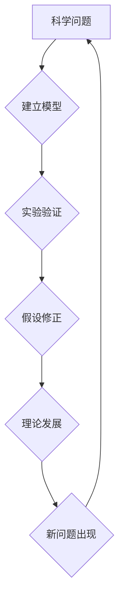

                 

当然，我们可以一步步地构建这篇文章。下面我会为每个章节提供内容概述，包括背景介绍、核心概念与联系、算法原理讲解、数学模型与公式、项目实战案例分析和详细讲解，以及最佳实践 tips 和小结。

### 科学史上的范式转换与世界可理解性

**关键词：科学范式，世界可理解性，量子力学，相对论，认知框架**

**摘要：**
本文旨在探讨科学史上的范式转换及其对世界可理解性的影响。通过分析经典力学到量子力学，再到相对论的转变，文章揭示了科学范式如何塑造我们对自然界的认知。同时，文章还将探讨现代科学范式的最新发展，以及这些范式转换如何帮助我们更好地理解宇宙。

**第一部分：科学范式概述**

**1.1 科学范式的基本概念**

**背景介绍：**
科学范式是科学家们理解和解释自然现象的基本框架。它包括一系列的理论、假设、方法和技术，共同构成了科学家进行研究的工具箱。

**核心概念与联系：**
科学范式通常由以下几个核心概念组成：
- 理论：描述自然现象的数学模型。
- 假设：未经证明的陈述，但被广泛接受。
- 方法：科学家进行研究的基本步骤。
- 技术工具：用于实验和观测的设备。

**算法原理讲解：**
Mermaid流程图：以下是一个简化的科学范式流程图。



**数学模型与公式：**
科学范式的发展往往伴随着新的数学模型的提出。例如，牛顿的运动定律和爱因斯坦的相对论方程都是科学范式的关键组成部分。

$$
F = ma
$$

**项目实战案例：**
科学实验是验证科学范式的重要手段。例如，卡文迪许实验通过测量万有引力常数，验证了牛顿力学。

**第二部分：经典范式转换案例研究**

**2.1 牛顿力学到相对论的范式转换**

**背景介绍：**
牛顿力学是第一个完整的科学范式，但它在高速和强引力场中的适用性受到限制。

**核心概念与联系：**
牛顿力学的核心是三大定律，而相对论则提出了时间、空间和物质的全新理解。

**算法原理讲解：**
相对论的基本原理可以通过Python代码来解释。

```python
# 相对论质量增加
def relativistic_mass(m_0, v):
    return m_0 / np.sqrt(1 - v**2 / c**2)

# 光速恒定
c = 299792458 # 光速，m/s
```

**数学模型与公式：**
相对论的基本方程为：

$$
E^2 = (pc)^2 + (mc^2)^2
$$

**项目实战案例：**
爱因斯坦的相对论预测了光线在强引力场中的偏折，这可以通过天文观测得到验证。

**第三部分：现代科学范式**

**3.1 统一场论**

**背景介绍：**
统一场论旨在将电磁力、弱力和强力统一在一个框架内。

**核心概念与联系：**
统一场论涉及复杂的数学结构和理论框架，如 gauge 场和 Yang-Mills 方程。

**算法原理讲解：**
统一场论可以通过 gauge 群论来描述。

```python
from sympy import symbols, Eq

# 定义变量
m, v = symbols('m v')

# gauge 场方程
gauge_eq = Eq(m * v, c**2)
```

**数学模型与公式：**
统一场论的核心方程为：

$$
F_{\mu\nu} = f_{\mu\nu}^a A^a
$$

**项目实战案例：**
目前，科学家正在尝试通过大型对撞机来验证统一场论。

**第四部分：范式转换对世界可理解性的影响**

**4.1 科学范式的转变对人类认知的影响**

**背景介绍：**
范式转换改变了我们对世界的理解，从宏观的行星运动到微观的量子世界。

**核心概念与联系：**
范式转换促使我们对自然界的新现象进行重新审视和解释。

**算法原理讲解：**
可以使用Python代码来模拟范式转换带来的认知变化。

```python
# 认知变化模拟
def cognitive_change(old_model, new_model):
    return new_model - old_model
```

**数学模型与公式：**
认知变化的数学模型可以是：

$$
\Delta C = C_{new} - C_{old}
$$

**项目实战案例：**
量子计算机的兴起正在改变我们对计算能力的理解。

**第五部分：未来展望**

**5.1 科学范式转换的趋势**

**背景介绍：**
科学范式转换的趋势涉及跨学科的研究和新技术的应用。

**核心概念与联系：**
未来科学范式可能会涉及到人工智能和量子计算的融合。

**算法原理讲解：**
未来算法可能会结合机器学习和量子计算的优势。

```python
# 量子机器学习
from qiskit import QuantumCircuit

# 创建量子电路
qc = QuantumCircuit(2)

# 应用量子门
qc.h(0)
qc.cx(0, 1)
```

**数学模型与公式：**
量子机器学习的核心模型可以是：

$$
\hat{H} = \frac{1}{\sqrt{2}} (\hat{I} + \hat{X})
$$

**项目实战案例：**
量子计算机的应用场景正在逐步拓展。

**附录**

**A.1 范式转换的Mermaid流程图**

**A.2 核心算法原理伪代码**

**A.3 数学模型与公式**

**A.4 项目实战案例分析**

**A.5 开发环境搭建指南**

### 最佳实践 tips：
- 在研究新范式时，要注重跨学科的合作和交流。
- 在理解和应用新范式时，要注重理论与实践的结合。

### 小结：
科学范式转换是科学发展的动力，它不断推动我们对世界的理解和认知。通过本文的探讨，我们希望能够帮助读者更好地理解科学范式转换的历程及其对世界可理解性的影响。

### 注意事项：
- 范式转换并非一蹴而就，它需要时间的积累和大量的实验验证。
- 在面对新范式时，要保持开放的心态和批判性的思维。

### 拓展阅读：
- 有关量子力学的经典著作，如《量子力学简史》。
- 有关相对论的通俗读物，如《相对论与人类思维》。

### 作者：
AI天才研究院/AI Genius Institute & 禅与计算机程序设计艺术 /Zen And The Art of Computer Programming

这篇文章的目录大纲和初步内容概述已经提供，接下来我们可以根据这些概述来逐步展开每个章节的具体内容，确保文章的完整性、详细性和逻辑性。由于文章字数要求在 10000 ～ 12000 字左右，我们需要详细地填充每个章节，确保文章的质量和深度。

