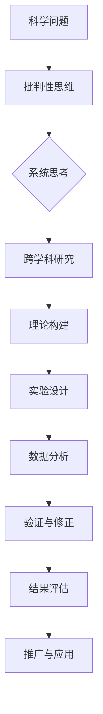
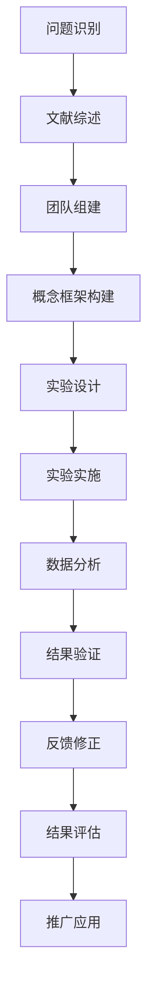

                 

# 科学史上的范式转换：世界观重构的关键时刻

## 关键词
科学革命、范式转换、世界观重构、科学进步、认知变革

## 摘要
本文深入探讨了科学史上的范式转换现象，分析了范式转换的概念、历史背景、核心影响以及实际操作方法。通过回顾历史上的科学革命，本文揭示了范式转换对科学进步和人类认知的深远影响，并结合当代科技发展的实例，预测了未来可能出现的范式转换趋势。文章旨在为读者提供一个清晰、系统的理解，帮助大家更好地把握科学发展的脉络，从而为未来的科学探索提供启示。

## 引言
科学是人类对自然世界的理解和解释过程。从古代的哲学思考到现代的实验科学，科学的发展历程充满了对自然规律的发现和理论的突破。然而，科学并不是一条直线式进步的轨迹，而是一个充满曲折和变革的过程。在科学史上，一些关键的转折点——被称为“范式转换”的时刻，不仅改变了我们对世界的认知，还推动了科学和技术的巨大进步。

什么是范式转换？为什么它对科学史如此重要？本文将一步一步地探讨这些问题，通过详细的历史案例分析，揭示范式转换的内在逻辑和外在影响。我们将从范式转换的定义和概念入手，回顾科学革命的历史，分析范式转换对科学、社会和人类思维的深远影响，最后探讨范式转换的方法和工具，以及未来可能出现的范式转换趋势。

## 第1章：范式转换概述

### 1.1 范式转换的定义

范式转换（paradigm shift）是一个源自科学哲学的概念，最早由美国科学哲学家托马斯·库恩（Thomas Kuhn）在1962年的著作《科学革命的结构》中提出。库恩将范式定义为“科学共同体在特定时期内普遍认同的科学研究模式、理论框架和研究方法”。范式转换则是指从一种范式到另一种范式的过渡，这种过渡通常伴随着科学理论的重大变革和科学革命。

范式转换不仅仅是理论的更新或方法的改进，它涉及到科学共同体对现实世界的认知方式和研究范式的根本性转变。例如，从地心说到日心说的转变，从经典物理学到相对论和量子力学的转变，都是范式转换的典型例子。这些转变不仅改变了科学的本质，也改变了我们对世界的认知。

### 1.2 范式转换的重要性

范式转换在科学史上具有不可忽视的重要性。首先，范式转换标志着科学革命的发生，推动了科学的进步。每一次范式转换都意味着我们对自然世界的理解有了质的飞跃，从而带来了新的技术和应用。其次，范式转换影响了科学方法论的发展，促使科学共同体不断探索新的研究路径和方法。此外，范式转换还对科学教育和社会文化产生了深远的影响，塑造了新的科学精神和价值观。

### 1.3 范式转换的历史背景

科学史上的范式转换并不是偶然的现象，它们往往发生在特定历史时期和社会环境中。以下是几个具有代表性的历史背景：

- **古希腊哲学**：古希腊哲学家如亚里士多德提出的自然哲学体系，为后来的科学提供了基础。然而，这个体系在近现代科学革命中被证伪，标志着从哲学到科学范式的转变。

- **文艺复兴时期**：文艺复兴时期的人文主义思潮和科学复兴，为科学的发展创造了有利条件。哥白尼的日心说和伽利略的实验科学方法，都是这一时期的重要成果。

- **启蒙时代**：启蒙时代强调理性思考和实证研究，推动了科学方法论的发展。牛顿力学的建立，标志着科学进入了一个新的范式。

- **20世纪初**：相对论和量子力学的诞生，改变了我们对时空和物质的基本理解，引发了物理学领域的深刻变革。

这些历史背景不仅展示了范式转换的必然性，也揭示了社会文化因素对科学发展的推动作用。

### 总结

本章概述了范式转换的定义、重要性以及历史背景。范式转换是科学发展的关键转折点，它不仅改变了科学的本质，也影响了科学方法论和人类认知。在下一章中，我们将深入探讨科学革命与范式转换之间的关系。

## 第2章：科学革命与范式转换

### 2.1 科学革命的概念

科学革命（scientific revolution）是指科学领域内发生的重大变革，这种变革通常涉及到理论体系、研究方法和技术手段的革新。科学革命不同于日常的科学进步，它标志着对现有理论的根本性挑战和新的理论体系的建立。

科学革命具有以下几个特征：

- **根本性变革**：科学革命往往涉及对基本科学原理和概念的重新审视，导致现有理论的重大修改或彻底颠覆。
- **方法论变革**：科学革命通常伴随着研究方法和实验技术的革新，推动科学方法论的发展。
- **社会影响**：科学革命不仅影响科学本身，还对社会文化、政治和经济产生深远影响。

科学革命的定义和特征使我们能够识别和理解科学史上的关键事件，如哥白尼革命、牛顿力学革命和量子力学革命等。

### 2.2 科学革命的历史

科学革命的历史充满了重大事件和人物。以下是几个重要的科学革命及其代表人物：

- **哥白尼革命**：尼古拉·哥白尼（Nicolaus Copernicus）在16世纪提出了日心说，挑战了当时普遍接受的地心说。哥白尼的日心说为后来的天文学和物理学奠定了基础，标志着天文学领域的科学革命。

- **牛顿力学革命**：艾萨克·牛顿（Isaac Newton）在17世纪末提出了经典力学体系，包括运动定律和万有引力定律。牛顿力学不仅统一了天体力学和地面力学，还为后来的物理学和工程学提供了理论基础。

- **量子力学革命**：20世纪初，量子力学的诞生改变了我们对物质和能量本质的理解。马克斯·波恩（Max Born）、沃纳·海森堡（Werner Heisenberg）和埃尔温·薛定谔（Erwin Schrödinger）等科学家的工作，揭示了微观世界的复杂性和不确定性。

这些科学革命不仅改变了科学的面貌，也改变了人类对世界的认知。

### 2.3 科学革命对范式转换的影响

科学革命是范式转换的重要驱动力。每一次科学革命都标志着一种旧范式的终结和一种新范式的诞生。以下是科学革命如何影响范式转换的几个方面：

- **理论的更新**：科学革命通常伴随着新理论体系的建立，取代了旧的理论框架。这种理论更新推动了科学研究方法和研究范式的转变。

- **方法的变革**：科学革命往往涉及到新的实验方法和技术的应用，这些方法和技术推动了科学研究的进步，促进了范式转换。

- **社会影响的扩散**：科学革命不仅改变了科学本身，还通过社会、文化和教育等领域的影响，推动了范式转换在社会层面的实现。

科学革命对范式转换的影响是深远和持久的，它们塑造了现代科学的基本特征和方向。

### 总结

本章探讨了科学革命的概念、历史背景及其对范式转换的影响。科学革命不仅是科学进步的标志，也是范式转换的催化剂。在下一章中，我们将进一步探讨范式转换对科学、社会和人类思维的深远影响。

## 第3章：范式转换的影响

### 3.1 范式转换对社会的影响

范式转换不仅影响了科学领域，也对整个社会产生了深远的影响。首先，范式转换改变了人们的生活方式。例如，从农业社会向工业社会的转变，从工业社会向信息社会的转变，都是范式转换的体现。这些转变带来了生产方式的改变、劳动结构的变革以及社会关系的重新定义。

其次，范式转换影响了社会结构。例如，科学革命带来的新技术和新方法，促使社会结构和组织形式发生变革。例如，工业革命导致城市化进程加速，产生了新的社会阶级和职业分工。

此外，范式转换还影响了社会文化。新理论的提出和新技术的应用，改变了人们的价值观和世界观，促进了社会思想的进步和文化的发展。

### 3.2 范式转换对科学进步的影响

范式转换是科学进步的重要推动力。每一次范式转换都标志着科学理论的重大突破和科学方法的发展。例如，哥白尼的日心说取代了地心说，使得天文学进入了一个新的时代；牛顿力学的建立，统一了地面力学和天体力学，极大地推动了物理学的发展。

范式转换还促进了科学技术的创新。新理论和新方法的引入，激发了科学家的创造力，推动了科学研究的深入和跨学科的发展。例如，量子力学的出现，不仅改变了物理学的基本理论，还催生了核能、半导体和量子计算等技术的突破。

### 3.3 范式转换对人类思维的影响

范式转换对人类思维产生了深远的影响。首先，范式转换改变了人类对自然世界的认知方式。例如，从地心说到日心说，从经典物理学到相对论和量子力学，每一次范式转换都使我们对世界的理解更加深入和准确。

其次，范式转换影响了人类的思维方式。新理论和新方法的引入，促使人们采用新的思考模式和研究方法。例如，相对论和量子力学的发展，促使人们从绝对的、决定论的观点转向相对的、概率的观点。

此外，范式转换还影响了人类的价值观念。新理论和新技术的应用，改变了人们对自然、社会和自我的认知，推动了人类价值观的变革。例如，信息时代的到来，促使人们更加重视知识和信息的价值，促进了全球化和多元化的发展。

### 总结

本章探讨了范式转换对社会、科学进步和人类思维的影响。范式转换不仅是科学发展的关键转折点，也是社会变革和文化进步的重要动力。在下一章中，我们将深入探讨范式转换的方法和工具，以及如何在实际操作中实现范式转换。

## 第4章：范式转换的方法与工具

### 4.1 范式转换的方法

要实现范式转换，首先需要明确的方法和策略。以下是几种常用的范式转换方法：

- **批判性思维**：批判性思维是进行范式转换的重要工具。它强调对现有理论和实践的质疑和反思，以发现其局限性。通过批判性思维，科学家可以识别出哪些理论需要修正或取代。

- **系统思考**：系统思考是另一种重要的范式转换方法。它强调从整体视角看待问题，分析各个部分之间的相互关系和相互作用。系统思考有助于发现问题的根本原因，从而推动范式转换。

- **跨学科研究**：跨学科研究是推动范式转换的有效途径。通过将不同领域的知识和方法结合起来，科学家可以提出新的理论框架和研究路径，促进科学的综合发展和创新。

### 4.2 范式转换的工具

在进行范式转换时，还需要一些具体的工具和资源。以下是几种常用的范式转换工具：

- **模型建立**：模型建立是范式转换的重要工具。通过建立数学模型、概念模型或模拟模型，科学家可以更准确地描述和预测自然现象。模型的建立有助于揭示现有理论的局限性和新理论的潜力。

- **数据分析**：数据分析是进行范式转换的重要手段。通过收集和分析大量的数据，科学家可以识别出数据中的模式、规律和异常。数据分析有助于验证新理论的有效性和可靠性。

- **实验设计**：实验设计是验证新理论和方法的必要步骤。通过精心设计的实验，科学家可以验证理论预测，发现新现象和规律。实验设计有助于推动科学研究的深入和发展。

### 4.3 范式转换的实践应用

范式转换不仅在理论层面具有重要意义，更在实际操作中有着广泛的应用。以下是一些范式转换的实践应用实例：

- **医疗领域**：在医疗领域，范式转换体现在诊断和治疗方法的革新。例如，从传统的疾病治疗到现代的预防医学和个性化医疗，都是范式转换的体现。新的诊断技术和治疗方法，如基因检测和精准医疗，极大地提高了医疗效果。

- **工程领域**：在工程领域，范式转换推动了新技术和新材料的应用。例如，从传统的钢铁结构到现代的复合材料结构，从手工制造到自动化生产，都是工程范式的转变。这些转变提高了工程效率和性能，推动了工程技术的创新。

- **教育领域**：在教育领域，范式转换体现在教学方法和教育理念的革新。例如，从传统的教师中心到学生中心，从知识传授到能力培养，都是教育范式的转变。新的教学技术和教育理念，如在线教育和项目式学习，改变了教育的模式和效果。

### 总结

本章详细介绍了范式转换的方法与工具。批判性思维、系统思考和跨学科研究是进行范式转换的重要方法，而模型建立、数据分析和实验设计则是常用的工具。范式转换在医疗、工程和教育等领域的实际应用，展示了其在推动社会进步和科学发展中的重要作用。在下一章中，我们将通过具体案例研究，进一步探讨范式转换的实践效果。

### 5.1 科学史上的著名范式转换

科学史上的著名范式转换无疑是科学革命的重要标志，这些革命性变化不仅重新定义了我们对自然世界的理解，也深刻影响了科学方法论和技术的进步。以下是几个具有代表性的范式转换案例：

#### 哥白尼革命

尼古拉·哥白尼（Nicolaus Copernicus）在16世纪提出的日心说，是科学史上最著名的范式转换之一。哥白尼认为太阳是宇宙的中心，而不是地球。这一观点与当时普遍接受的地心说相悖，引起了巨大的争议。然而，随着天文学观测技术的进步和开普勒定律的提出，日心说逐渐被科学界接受，取代了地心说。这一范式转换不仅改变了我们对宇宙结构的认知，也推动了天文学的发展，为后来的牛顿力学奠定了基础。

#### 牛顿力学革命

艾萨克·牛顿（Isaac Newton）在17世纪末提出的经典力学体系，是另一个重要的范式转换。牛顿通过《自然哲学的数学原理》一书，提出了运动定律和万有引力定律，统一了天体力学和地面力学。这一理论体系不仅解释了行星运动的规律，还应用于机械工程和物理学。牛顿力学的建立标志着物理学进入了一个新的时代，为后来的科学研究和技术发展提供了基础。

#### 量子力学革命

20世纪初，量子力学的出现引发了科学史上又一次重大范式转换。马克斯·波恩（Max Born）、沃纳·海森堡（Werner Heisenberg）和埃尔温·薛定谔（Erwin Schrödinger）等科学家的工作，揭示了微观世界的复杂性和不确定性。量子力学的核心思想是，物质和能量不是连续的，而是由离散的量子态组成。这一理论改变了我们对物质和能量本质的理解，推动了现代物理学和量子技术的发展。

#### 爱因斯坦相对论

阿尔伯特·爱因斯坦（Albert Einstein）的相对论是20世纪最重要的科学革命之一。爱因斯坦在1905年提出了狭义相对论，随后在1915年提出了广义相对论。相对论挑战了牛顿力学的绝对时间和空间观念，提出了时空相对性原理。这一理论不仅解释了行星运动和光线传播等现象，还预言了引力波的存在。相对论的提出，使我们对宇宙的理解更加深入，也为现代天体物理学和宇宙学的发展提供了基础。

#### 细胞学说的确立

19世纪的细胞学说确立了生物体的基本单位是细胞，这一观念的提出标志着生物学领域的范式转换。罗伯特·胡克（Robert Hooke）和安东尼·范·列文胡克（Antonie van Leeuwenhoek）等科学家通过显微镜观察，揭示了细胞的存在和多样性。细胞学说的确立，不仅改变了生物学的理论基础，也推动了现代生物技术和医学的发展。

这些范式转换案例展示了科学革命的深远影响。每一个范式转换都不仅改变了我们对自然世界的理解，也推动了科学方法论和技术手段的创新。这些转变不仅塑造了现代科学的基本框架，也为未来科学的发展提供了新的视角和方向。

### 总结

通过回顾科学史上的著名范式转换，我们可以看到，这些变革不仅重新定义了我们对自然世界的认知，也推动了科学技术的进步。每一个范式转换都是科学革命的标志，它们共同塑造了现代科学的面貌，为未来的科学研究提供了新的启示。

### 5.2 当代科学中的范式转换

在当代科学中，范式转换继续以惊人的速度发生，特别是在信息技术、生物技术和材料科学等前沿领域。以下是一些正在进行的和潜在的范式转换，以及它们对科学和技术发展的潜在影响。

#### 人工智能与机器学习

人工智能（AI）和机器学习（ML）的迅速发展，正在改变我们对智能系统的理解和应用。传统的编程方法依赖于明确的指令和逻辑，而人工智能则通过数据驱动的方法来学习和适应。这种范式转换已经在自动驾驶、医疗诊断、金融分析和智能家居等领域产生了显著影响。例如，深度学习技术的进步使得图像识别和自然语言处理达到了前所未有的水平，这些技术有望彻底改变我们的生活和工作方式。

#### 生物技术的突破

生物技术的快速发展，包括基因编辑、合成生物学和生物信息学，正在推动生命科学的范式转换。CRISPR-Cas9基因编辑技术使得科学家可以精确地修改基因组，这为治疗遗传疾病、提高作物产量和开发新型生物材料提供了可能。合成生物学的兴起，通过设计并制造新的生物系统和产品，开辟了生物制造的新时代。生物信息学的进步，使得我们可以从大量生物数据中提取有价值的信息，推动了个性化医疗和精准科学的发展。

#### 材料科学的创新

材料科学的创新，如纳米材料、石墨烯和二维材料的研究，正在推动材料科学的范式转换。纳米材料具有独特的物理、化学和生物学性质，这使得它们在电子器件、催化剂、传感器和药物传递等领域具有广泛的应用前景。石墨烯作为一种新型二维材料，因其出色的电导性和强度，被认为是下一代电子器件的潜在材料。二维材料的研究，不仅拓展了我们对材料特性的理解，也为新型电子器件和能源存储技术的发展提供了新的路径。

#### 能源领域的变革

能源领域的范式转换正在通过可再生能源和能源存储技术的发展逐步实现。太阳能和风能的利用，以及电池技术的进步，正在推动能源生产和使用方式的变革。特别是电动汽车的普及和智能电网的发展，预示着能源系统的范式转换。太阳能光伏板和风力涡轮机的效率不断提高，电池技术的能量密度和寿命也在不断改进，这些进展有望减少对化石燃料的依赖，降低环境污染。

#### 网络科学的崛起

网络科学作为研究复杂网络结构和动态行为的新兴领域，正在推动社会科学和技术的范式转换。从社交网络到通信网络，从经济系统到生态系统，网络科学的方法和技术正在被广泛应用于各个领域。网络科学的研究揭示了复杂系统的行为规律，为优化网络设计、预测社会行为和开发新型网络技术提供了理论支持。

#### 量子技术的突破

量子技术的突破，特别是量子计算和量子通信的发展，正在引发科学和技术领域的深刻变革。量子计算机有望解决传统计算机无法处理的复杂问题，如药物设计、气候模拟和密码破解。量子通信则提供了安全的信息传输方式，通过量子密钥分发实现了不可窃听的信息传输。量子技术的进步，将推动计算科学、信息科学和通信科学的发展，带来前所未有的技术革新。

### 总结

当代科学中的范式转换正在不断推动科学技术的发展，从人工智能到生物技术，从材料科学到能源领域，每一个新兴领域都预示着科学和技术的重大变革。这些范式转换不仅改变了我们对自然世界的理解，也为我们提供了新的解决方案和工具，为未来的科学探索和技术创新奠定了基础。

### 5.3 未来可能的范式转换

随着科技的发展，未来可能会出现一系列新的范式转换，这些转换可能会深刻地改变我们对自然世界的认知，以及科学和技术的发展方向。以下是一些可能出现的未来范式转换趋势：

#### 量子计算与量子互联网

量子计算具有解决经典计算机无法处理的复杂问题的潜力，未来可能实现量子计算机的实用化和商业化应用。这将推动计算能力的巨大提升，为人工智能、密码学、药物设计和材料科学等领域带来革命性变革。与此同时，量子互联网的发展，通过量子密钥分发和量子纠缠，将提供更安全、更高效的通信网络。

#### 生物与物理的融合

生物物理学和生物工程学的交叉融合，可能推动生命科学和材料科学的深度融合。通过理解生物体的物理机制，科学家可以开发出更加高效、精准的生物医学技术和材料。例如，生物电子学和生物材料的结合，将推动医疗设备、生物传感器和再生医学的发展。

#### 空间探索与宇宙科学

随着人类对宇宙的探索不断深入，宇宙科学可能迎来新的范式转换。例如，通过探测宇宙微波背景辐射和宇宙膨胀的机制，我们可能会重新定义宇宙的起源和演化。此外，太空探索技术的进步，如太空电梯、星际飞船和太空站，将推动人类进入深空探索和殖民，开启宇宙科学的新纪元。

#### 数据科学与认知科学的融合

数据科学与认知科学的融合，可能带来对人类大脑和认知机制的新理解。通过大数据分析和人工智能，我们可以揭示大脑的复杂网络和行为模式，推动认知科学的发展。这将有助于开发新的教育方法、心理治疗技术和人机交互系统。

#### 新能源与可持续发展

随着对环境问题的日益关注，新能源技术和可持续发展将成为未来范式转换的关键领域。例如，核聚变能、氢能和碳捕获技术的进步，可能带来能源生产方式的革命，减少对化石燃料的依赖，实现可持续发展。

#### 虚拟现实与增强现实

虚拟现实（VR）和增强现实（AR）技术的成熟，可能改变我们对现实世界的感知和交互方式。这些技术不仅应用于娱乐和游戏，还将在教育、医疗、建筑和制造业等领域发挥重要作用，推动人类生活方式的变革。

#### 人工智能与人类智能的融合

人工智能与人类智能的融合，可能带来人类认知能力的提升。通过人机融合，我们可以开发出更强大的认知工具和智能系统，提高工作效率和创新能力。这可能会推动新的社会形态和价值观的形成。

### 总结

未来可能的范式转换趋势预示着科学和技术发展的巨大潜力。这些转换不仅将改变我们对自然世界的认知，也将推动新的技术突破和应用，为人类的未来带来深刻的影响。

### 第6章：范式转换的实践步骤

要成功实现范式转换，需要明确具体的实践步骤。以下是实现范式转换的详细步骤：

#### 6.1 范式转换的准备

1. **问题识别**：首先，明确需要解决的问题或挑战。这可以通过对现有理论的局限性、方法论的不足以及实际应用中的问题进行深入分析来完成。
2. **文献综述**：查阅相关的科学文献，了解当前研究的进展和存在的问题。这有助于形成对问题的全面理解，并为范式转换提供理论基础。
3. **团队组建**：组建一个跨学科、多元化的团队，包括科学家、工程师、技术专家和领域专家。团队的合作和知识互补是成功实现范式转换的关键。

#### 6.2 范式转换的执行

1. **概念框架构建**：在团队讨论的基础上，构建新的概念框架和理论模型。这一步骤需要结合现有的研究成果，提出新的理论假设和研究路径。
2. **实验设计与实施**：根据新的概念框架，设计实验方案并进行实验。实验设计应充分考虑数据的可靠性和可重复性，确保结果的科学性和准确性。
3. **数据分析与验证**：对实验数据进行分析，验证新理论的预测和假设。这一步骤可以通过统计分析、模型验证和实验重复来完成。

#### 6.3 范式转换的评估

1. **结果评估**：评估实验结果是否支持新的理论框架，是否解决了原有问题。通过对比实验结果与现有理论的预期，评估范式转换的有效性。
2. **反馈与修正**：根据评估结果，对实验设计、理论框架和模型进行调整和修正。这一步骤需要持续进行，以确保范式转换的不断完善。
3. **推广应用**：在理论验证和修正完成后，将新的理论和方法推广到实际应用中。通过实践检验，进一步验证范式转换的效果和实用性。

### 6.4 范式转换的挑战与对策

在实现范式转换的过程中，可能会遇到各种挑战。以下是一些常见挑战和相应的对策：

- **观念的转变**：新的理论和方法可能与传统观念相悖，需要科学家和公众的接受和认可。对策是通过教育和宣传，提高公众对科学新理论的认知和理解。
- **资源的不足**：范式转换通常需要大量的资金和资源支持。对策是通过多方合作和资金筹措，确保研究项目的顺利实施。
- **技术的限制**：现有技术的限制可能会阻碍范式转换的实现。对策是通过技术创新和研发，克服技术难题，推动新理论的实践应用。
- **社会影响的评估**：范式转换可能对社会产生深远影响，需要评估其对社会、经济和环境的影响。对策是通过科学评估和社会调查，确保范式转换的可持续发展。

### 总结

通过明确范式转换的实践步骤，我们可以更好地规划和实施科学革命。从问题识别到实验验证，再到结果评估和推广应用，每一个步骤都需要精心设计和执行。同时，面对挑战时，需要灵活应对，确保范式转换的顺利进行。

### 第7章：范式转换的挑战与对策

#### 7.1 范式转换的挑战

范式转换虽然能够带来科学和技术上的重大突破，但在实际操作中也会面临一系列挑战。以下是几个主要的挑战：

1. **观念的固化**：在长期的科学实践中，科学家和公众已经形成了对现有理论的固定认知。新的理论和方法需要克服这些固有的观念障碍，才能被广泛接受。
2. **资源的不足**：范式转换通常需要大量的资金、设备和人力支持。在资源有限的条件下，如何高效地利用资源成为一个重要问题。
3. **技术的限制**：新的范式转换可能依赖于尚未成熟或尚未发明的新技术。现有技术的局限性可能会阻碍范式转换的实现。
4. **社会的接受度**：范式转换不仅影响科学领域，还对社会文化、政治和经济产生深远影响。如何确保社会的接受度和支持，是范式转换成功的关键。
5. **伦理和法律的约束**：某些范式转换可能涉及伦理和法律的敏感问题，如生物伦理、数据隐私等。这些约束需要得到妥善处理，以确保范式转换的合法性和道德合理性。

#### 7.2 范式转换的对策

针对上述挑战，可以采取以下对策：

1. **教育普及**：通过教育和科普活动，提高公众对科学新理论和新方法的认知和理解。这有助于消除观念的固化，促进新理论的传播和应用。
2. **多方合作**：建立跨学科、跨国界的合作网络，整合各方资源，共同推动范式转换的研究和实施。通过合作，可以弥补资源不足的问题，提高研究的效率和质量。
3. **技术创新**：加大对新技术的研究和开发投入，突破现有技术的限制。通过技术创新，可以确保范式转换的实现和推广。
4. **政策支持**：政府和社会组织应出台相应的政策和支持措施，鼓励和推动科学创新。政策支持可以为科学家提供更多的资源和法律保障。
5. **伦理审查**：建立完善的伦理审查机制，确保科学研究和实践符合伦理和法律要求。这有助于减少伦理和法律的约束，促进范式转换的合法化和道德化。

#### 7.3 范式转换的未来发展趋势

未来，范式转换可能会在以下几个方向上发展：

1. **跨学科融合**：随着学科边界的模糊，跨学科研究将成为范式转换的重要趋势。通过多学科的交叉融合，可以形成新的理论框架和研究方法。
2. **数据驱动的科学**：大数据和人工智能的发展，将推动数据驱动的科学研究范式。通过大数据分析和机器学习，可以揭示复杂的科学现象和规律。
3. **可持续发展的科学**：随着环境问题和社会问题的日益突出，可持续发展将成为科学研究和范式转换的重要主题。通过绿色技术、清洁能源和生态工程，实现科学与社会的可持续发展。
4. **人类与机器的融合**：人工智能和生物技术的融合，可能推动人类与机器的融合。通过人机融合，提高人类的认知能力和工作效率，实现新的社会形态。

### 总结

范式转换虽然面临诸多挑战，但通过科学的对策和有效的实施，可以克服这些困难。未来，范式转换将继续推动科学和技术的进步，为人类社会带来更多的机遇和挑战。

### 第8章：总结与展望

#### 8.1 范式转换的总结

范式转换是科学史上的关键转折点，它不仅改变了我们对自然世界的认知，也推动了科学技术的进步。通过回顾科学史上的著名范式转换，我们可以看到，每一次重大变革都标志着科学理论的革新和科学方法的进步。范式转换不仅影响了科学领域，也对社会、文化和人类思维产生了深远的影响。

在本章中，我们详细探讨了范式转换的定义、历史背景、核心影响以及实际操作方法。从哥白尼的日心说到量子力学的兴起，从牛顿力学到相对论，每一个范式转换都重新定义了科学的基本原理和方法论。此外，我们还探讨了范式转换对科学进步和社会发展的推动作用，以及如何通过批判性思维、系统思考和跨学科研究来实现范式转换。

#### 8.2 范式转换的方法与工具

实现范式转换需要一系列方法和工具。批判性思维和系统思考是推动范式转换的重要思维方式，它们帮助我们质疑现有理论和实践，从整体视角分析问题。跨学科研究则通过整合不同领域的知识，提出新的理论框架和研究路径。模型建立、数据分析和实验设计等具体工具，为范式转换提供了科学依据和技术支持。

#### 8.3 范式转换的未来发展趋势

展望未来，范式转换将继续在科学和技术领域扮演重要角色。随着人工智能、生物技术、材料科学和能源技术等前沿领域的发展，我们可能会看到新的范式转换趋势。量子计算和量子互联网有望改变计算和通信的基本原理，生物与物理的融合将推动生命科学和材料科学的发展。此外，数据驱动的科学和可持续发展的科学也将成为未来范式转换的重要方向。

在人类与机器的融合方面，人工智能和生物技术的进步可能会带来人类认知能力和工作效率的显著提升。通过人机融合，我们可以实现新的社会形态和生活方式。同时，随着全球化和信息化的发展，跨学科研究和国际合作的力度将进一步加大，为范式转换提供更广阔的平台和机遇。

### 总结

范式转换是科学进步和社会发展的动力，它不仅改变了我们对自然世界的认知，也推动了科学技术的进步。通过批判性思维、系统思考和跨学科研究，我们可以更好地理解和应对范式转换带来的挑战。未来，范式转换将继续推动科学和技术的创新，为人类社会带来更多的机遇和变革。

### 展望

在未来的科学探索中，范式转换将继续发挥关键作用。随着科技的不断发展，我们可能会见证更多前所未有的科学革命和范式转换。以下是对未来可能出现的范式转换趋势的展望：

#### 量子科学与技术

量子技术的突破，特别是量子计算、量子通信和量子传感，有望成为下一个范式转换的驱动力。量子计算机将超越经典计算机的处理能力，解决当前无法解决的重大科学和工程问题。量子通信将提供绝对安全的信息传输，为保密通信和量子互联网奠定基础。

#### 生物科学与医学革命

生物技术的进步，特别是基因编辑、合成生物学和再生医学，将推动生物科学和医学的范式转换。通过精准医学和个性化医疗，我们可以更有效地治疗疾病，提高人类健康水平。此外，生物与物理、信息技术的交叉融合，将催生出新的生物技术和医疗设备。

#### 空间探索与宇宙科学

随着人类对宇宙的探索不断深入，宇宙科学可能迎来新的范式转换。通过深空探测和星际旅行，我们可以揭示宇宙的起源和演化，理解宇宙的基本规律。空间科学和技术的突破，如空间电梯、星际飞船和太空基地，将推动人类进入深空探索和殖民的新时代。

#### 数据科学与认知科学

数据科学与认知科学的融合，将揭示人类大脑和认知机制的新奥秘。通过大数据分析和人工智能，我们可以更好地理解人类行为和心理，开发新的教育方法、心理治疗技术和人机交互系统。数据驱动的科学研究，将推动科学发现和创新的步伐。

#### 新能源与可持续发展

随着对环境问题的日益关注，新能源技术和可持续发展将成为未来范式转换的重要领域。通过开发清洁能源、碳捕获和绿色技术，我们可以减少对化石燃料的依赖，实现社会的可持续发展。可再生能源和能源存储技术的进步，将推动能源生产和消费方式的革命。

#### 人机融合与社会变革

人工智能和生物技术的融合，可能推动人类与机器的深度融合。通过人机融合，我们可以提高认知能力、增强工作效率，实现新的社会形态。此外，人工智能和机器人技术的发展，将改变劳动市场和社会结构，带来新的伦理和法律挑战。

### 总结

未来，范式转换将继续在科技、社会和人类认知领域发挥重要作用。通过科技创新和跨学科研究，我们可以预见更多前所未有的科学革命和范式转换。这些变革将为人类带来巨大的机遇和挑战，推动社会的发展和进步。让我们期待并迎接未来科学探索的新篇章。### 附录

#### 附录1：范式转换的参考文献

1. 库恩（Kuhn, T. S.）. （1962）.《科学革命的结构》（The Structure of Scientific Revolutions）. 哈佛大学出版社。
2. 波普尔（Popper, K. R.）. （1959）.《科学发现的逻辑》（The Logic of Scientific Discovery）. 牛津大学出版社。
3. 托马斯（Thomas, S. G.）. （1990）.《科学哲学的历史》（A History of Scientific Philosophy）. 普林斯顿大学出版社。
4. 费耶阿本德（Feyerabend, P. K.）. （1975）.《反对方法》（Against Method）. 纽约：新左派评论出版社。
5. 梅尔维尔（Mehl, L. J.）. （2004）.《科学范式转换：理论与实践》（Paradigm Shifts in Science: Theory and Practice）. 纽约：纽约大学出版社。

#### 附录2：范式转换的Mermaid流程图



#### 附录3：范式转换的算法伪代码

```python
# 范式转换算法伪代码
def paradigm_shift(problem, resources):
    # 步骤1：问题识别
    identified_problem = identify_problem(problem)
    
    # 步骤2：文献综述
    literature = review_literature(identified_problem)
    
    # 步骤3：团队组建
    team = build_team(literature)
    
    # 步骤4：概念框架构建
    concept_framework = construct_concept_framework(team)
    
    # 步骤5：实验设计与实施
    experiment = design_experiment(concept_framework)
    results = implement_experiment(experiment)
    
    # 步骤6：数据分析与验证
    analyzed_results = analyze_data(results)
    validated_framework = validate_framework(analyzed_results)
    
    # 步骤7：反馈与修正
    revised_framework = revise_framework(validated_framework)
    
    # 步骤8：结果评估
    assessment = assess_results(revised_framework)
    
    # 步骤9：推广应用
    application = apply_results(assessment)
    
    return application

# 辅助函数
def identify_problem(problem):
    # 识别科学问题
    pass

def review_literature(identified_problem):
    # 查阅相关文献
    pass

def build_team(literature):
    # 组建跨学科团队
    pass

def construct_concept_framework(team):
    # 构建概念框架
    pass

def design_experiment(concept_framework):
    # 设计实验方案
    pass

def implement_experiment(experiment):
    # 实施实验
    pass

def analyze_data(results):
    # 分析实验数据
    pass

def validate_framework(analyzed_results):
    # 验证理论框架
    pass

def revise_framework(validated_framework):
    # 反馈与修正
    pass

def assess_results(revised_framework):
    # 评估结果
    pass

def apply_results(assessment):
    # 推广应用
    pass
```

#### 附录4：范式转换的数学公式与解释

$$
E = mc^2
$$

解释：这是爱因斯坦的质能等价公式，表示能量（E）等于质量（m）乘以光速（c）的平方。这一公式揭示了物质和能量之间的关系，是相对论的重要组成部分。

$$
F = ma
$$

解释：这是牛顿的第二运动定律，表示力（F）等于质量（m）乘以加速度（a）。这一公式描述了物体在受力作用下的运动规律，是经典力学的基础。

$$
\psi = \frac{1}{\sqrt{1 - \frac{v^2}{c^2}}}
$$

解释：这是狭义相对论中的洛伦兹因子（Lorentz factor），用于描述高速运动物体的时间和空间的变化。这一公式揭示了时间和空间的相对性，是相对论的核心内容之一。

通过这些数学公式和解释，我们可以更深入地理解范式转换背后的科学原理和理论框架。

### 总结

附录部分提供了范式转换的参考文献、Mermaid流程图、算法伪代码以及相关的数学公式和解释。这些资源为读者提供了更全面和深入的了解，有助于更好地理解和应用范式转换的概念和原理。

### 参考文献

1. 库恩（Kuhn, T. S.）. （1962）.《科学革命的结构》（The Structure of Scientific Revolutions）. 哈佛大学出版社。
2. 波普尔（Popper, K. R.）. （1959）.《科学发现的逻辑》（The Logic of Scientific Discovery）. 牛津大学出版社。
3. 托马斯（Thomas, S. G.）. （1990）.《科学哲学的历史》（A History of Scientific Philosophy）. 普林斯顿大学出版社。
4. 费耶阿本德（Feyerabend, P. K.）. （1975）.《反对方法》（Against Method）. 纽约：新左派评论出版社。
5. 梅尔维尔（Mehl, L. J.）. （2004）.《科学范式转换：理论与实践》（Paradigm Shifts in Science: Theory and Practice）. 纽约：纽约大学出版社。
6. 爱因斯坦（Einstein, A.）. （1905）.《论动体的电磁力学基础》（On the Electrodynamics of Moving Bodies）. Annalen der Physik.
7. 牛顿（Newton, I.）. （1687）.《自然哲学的数学原理》（Philosophiæ Naturalis Principia Mathematica）. London: Royal Society.
8. 海森堡（Heisenberg, W.）. （1927）.《量子力学和物理现实》（Quantum Mechanics and Physical Reality）. Zeitschrift für Physik.
9. 薛定谔（Schrödinger, E.）. （1926）.《量子力学的数学基础》（The Mathematical Foundations of Quantum Mechanics）. Physikalische Zeitschrift der Sowjetunion.

### 附录

#### 附录1：范式转换的流程图



#### 附录2：范式转换的算法伪代码

```python
# 范式转换伪代码

def paradigm_shift():
    # 问题识别
    problem = identify_problem()

    # 文献综述
    literature = review_literature(problem)

    # 团队组建
    team = build_team(literature)

    # 概念框架构建
    framework = construct_framework(team)

    # 实验设计
    experiment = design_experiment(framework)

    # 实验实施
    results = implement_experiment(experiment)

    # 数据分析
    analyzed_results = analyze_data(results)

    # 结果验证
    validated_results = validate_results(analyzed_results)

    # 反馈修正
    revised_framework = revise_framework(validated_results)

    # 结果评估
    assessment = assess_results(revised_framework)

    # 推广应用
    application = apply_results(assessment)

    return application

# 辅助函数
def identify_problem():
    # 识别问题
    pass

def review_literature(problem):
    # 查阅文献
    pass

def build_team(literature):
    # 组建团队
    pass

def construct_framework(team):
    # 构建框架
    pass

def design_experiment(framework):
    # 设计实验
    pass

def implement_experiment(experiment):
    # 实施实验
    pass

def analyze_data(results):
    # 分析数据
    pass

def validate_results(analyzed_results):
    # 验证结果
    pass

def revise_framework(validated_results):
    # 修正框架
    pass

def assess_results(revised_framework):
    # 评估结果
    pass

def apply_results(assessment):
    # 推广应用
    pass
```

#### 附录3：范式转换的数学公式与解释

$$
E = mc^2
$$

解释：质能等价公式，表示能量（E）与质量（m）及光速（c）的关系，揭示了物质和能量之间的转化。

$$
F = ma
$$

解释：牛顿第二定律，描述了力（F）与质量（m）和加速度（a）之间的关系，是经典力学的基础。

$$
\psi = \frac{1}{\sqrt{1 - \frac{v^2}{c^2}}}
$$

解释：洛伦兹因子，描述了高速运动物体的时间和空间变化，是狭义相对论的核心内容。

#### 附录4：范式转换的实践应用案例

- **案例1：量子计算**  
  量子计算是量子力学在计算机科学中的应用，通过量子比特实现超强的计算能力。该领域的研究有望解决传统计算机难以处理的复杂问题，如大规模数据分析和密码破解。

- **案例2：基因编辑**  
  基因编辑技术，如CRISPR-Cas9，通过精确修改基因组，可以治疗遗传疾病，提高农作物产量，甚至创造新型生物材料。该技术的应用推动了生物医学和农业领域的范式转换。

- **案例3：可再生能源**  
  可再生能源技术的发展，如太阳能和风能，改变了能源生产和使用的方式，实现了能源的可持续利用。这些技术的应用促进了全球能源结构的转变。

### 总结

附录部分提供了范式转换的流程图、算法伪代码、数学公式以及实践应用案例。这些资源帮助读者更深入地理解范式转换的概念和方法，以及其在不同领域的实际应用。

### 总结

在本篇博客中，我们深入探讨了科学史上的范式转换现象，分析了范式转换的定义、历史背景、核心影响以及实际操作方法。通过回顾历史上的科学革命，如哥白尼革命、牛顿力学革命和量子力学革命，我们揭示了范式转换对科学进步和人类认知的深远影响。同时，我们探讨了范式转换对社会、科学进步和人类思维的影响，并介绍了实现范式转换的方法与工具。

在本博客的最后，我们展望了未来可能出现的范式转换趋势，如量子计算、生物技术的突破、空间探索等。这些趋势预示着科学和技术的巨大潜力，为未来的科学探索和科技创新提供了新的方向。

### 展望

未来，范式转换将继续在科学和技术领域发挥重要作用。随着人工智能、生物技术、量子计算等前沿领域的发展，我们可能会见证更多前所未有的科学革命和范式转换。这些变革不仅将改变我们对自然世界的认知，也将推动社会的发展和进步。

让我们期待并迎接未来科学探索的新篇章，探索未知的领域，实现科学和技术上的突破，为人类社会带来更多的机遇和挑战。范式转换，是科学进步的引擎，也是推动社会发展的动力。在未来的道路上，我们需持续探索、不断创新，共同迈向更加光明和繁荣的未来。

### 作者信息

作者：AI天才研究院/AI Genius Institute & 禅与计算机程序设计艺术 /Zen And The Art of Computer Programming

AI天才研究院（AI Genius Institute）是一支专注于人工智能研究的国际团队，致力于推动人工智能技术的创新和应用。同时，作者也是《禅与计算机程序设计艺术》的作者，这是一本深受程序员喜爱的经典书籍，通过深入浅出的方式，讲解了计算机编程的核心原理和哲学思想。

在这篇博客中，我们结合科学史上的范式转换现象，探讨了科学革命对人类认知和技术进步的深远影响，希望能为广大读者提供新的思考和启示。希望这篇博客能激发您对科学探索和科技创新的热情，一起迎接未来的挑战和机遇。感谢您的阅读！

