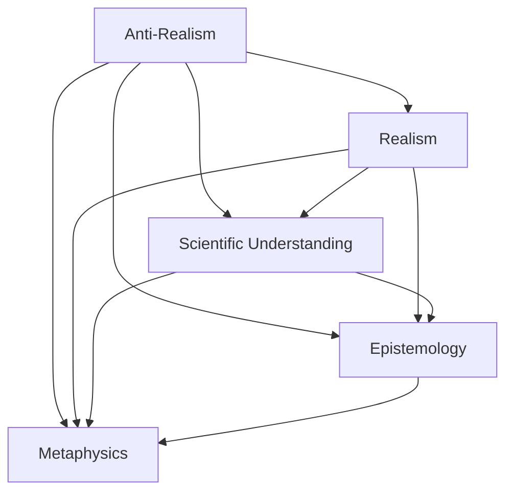

                 

### 1. Introduction

The realm of scientific philosophy has been a fertile ground for discourse on the nature of reality and the limits of human understanding. Within this broad domain, anti-realism emerges as a compelling perspective that challenges the traditional notion of scientific objectivity. At its core, anti-realism questions the very idea of an external, objective reality that can be fully understood by scientific methods. This philosophy posits that our understanding of the world is inherently limited by our cognitive faculties, social constructs, and the tools we use to gather knowledge.

The notion of anti-realism has deep roots in the history of philosophy, stretching back to the ancient Greeks and continuing through to contemporary thinkers. It is often contrasted with realism, which holds that there exists an objective reality that is discoverable through empirical observation and scientific inquiry. While realism has been the dominant paradigm, anti-realism offers a crucial counterpoint by highlighting the subjective and interpretive aspects of scientific knowledge.

This blog post aims to delve into the core concepts and implications of anti-realism in science philosophy. We will explore the philosophical foundations of anti-realism, its relationship with realism, and its critique of scientific understanding. By doing so, we seek to provide a comprehensive overview that is both accessible and intellectually engaging for readers from various backgrounds.

Our goal is not merely to describe anti-realism but to elucidate its significance in the broader context of scientific inquiry. We will present a structured analysis that begins with an overview of the book "Science Philosophy of Anti-Realism: Critical Reflections on the Understandability of the World." This will be followed by a detailed examination of the core concepts, their interconnections, and the key arguments presented in the book. Finally, we will offer a synthesis of these insights, discussing their implications for our understanding of science and its limitations.

### 2. Keywords

- **Anti-Realism**: A philosophical stance that questions the existence of an objective reality.
- **Realism**: The view that there is an external, objective reality that can be known through scientific methods.
- **Scientific Understanding**: The process of gaining knowledge about the world through empirical observation and theory.
- **Epistemology**: The study of the nature of knowledge, belief, and justification.
- **Metaphysics**: The branch of philosophy concerned with the nature of reality and existence.
- **Subjectivity**: The role of individual perspectives and biases in shaping our understanding of the world.
- **Constructivism**: The philosophical position that knowledge is constructed by individuals and societies.
- **Empiricism**: The philosophical doctrine that knowledge comes primarily from sensory experience.

### 3. Abstract

This article offers a critical exploration of anti-realism in the philosophy of science, focusing on its implications for our understanding of the world. By examining the core concepts and arguments presented in the book "Science Philosophy of Anti-Realism: Critical Reflections on the Understandability of the World," we delve into the philosophical underpinnings of anti-realism and its challenge to the traditional realist view. Through a structured analysis, we explore the relationship between anti-realism and key concepts such as scientific understanding, epistemology, and metaphysics. The article concludes by discussing the broader implications of anti-realism for science, highlighting its role in questioning the limits of human knowledge and the nature of reality.

### 1. Overview of the Book

"Science Philosophy of Anti-Realism: Critical Reflections on the Understandability of the World" is a profound exploration into the realm of philosophy and science, where the boundaries of knowledge and reality are rigorously questioned and critically examined. The book is an indispensable resource for anyone seeking to understand the philosophical currents that shape our contemporary understanding of science. At its core, the book argues that the pursuit of scientific knowledge is inherently limited by the subjective and interpretive nature of human cognition.

The primary goal of this book is to provide a comprehensive analysis of anti-realism, a philosophical stance that challenges the traditional realist view of the world. By questioning the very foundation of scientific objectivity, anti-realism opens up new avenues for thinking about the nature of reality and the limits of human understanding. The book seeks to bridge the gap between abstract philosophical concepts and practical applications in scientific research, demonstrating how anti-realism can inform and reshape our approach to scientific inquiry.

One of the book's key strengths is its ability to present complex philosophical ideas in a clear and accessible manner. The author effectively uses historical examples, case studies, and thought experiments to illustrate the key arguments and concepts discussed throughout the text. This not only enhances the reader's understanding but also makes the content engaging and thought-provoking.

The book is structured into several key chapters, each addressing a specific aspect of anti-realism and its implications for science. The chapters are designed to build upon each other, creating a coherent narrative that guides the reader through the complexities of this philosophical stance. Here is an overview of the chapters:

1. **Introduction**: This chapter sets the stage for the discussion by introducing the concept of anti-realism and its significance in the philosophy of science. It provides a brief history of the development of anti-realism and outlines the key questions and arguments that will be explored in the following chapters.
2. **The Nature of Reality**: This chapter delves into the metaphysical foundations of anti-realism, questioning the existence of an external, objective reality. The author examines various philosophical positions on reality and discusses the implications of anti-realism for our understanding of the world.
3. **Scientific Understanding**: Here, the book explores the nature of scientific understanding, highlighting the subjective and interpretive aspects of knowledge. The chapter discusses the role of observation, theory, and verification in the scientific process and examines the limitations of empirical methods.
4. **Epistemology and Anti-Realism**: This chapter addresses the broader implications of anti-realism for the theory of knowledge. It examines the nature of belief, justification, and the role of cognitive biases in shaping our understanding of the world. The author argues that anti-realism offers a more nuanced perspective on the nature of knowledge.
5. **Constructivism and Subjectivity**: This chapter explores the relationship between constructivism and anti-realism, discussing how knowledge is constructed by individuals and societies. The author examines the role of social constructs and cultural context in shaping our understanding of reality and challenges the idea of a universally objective truth.
6. **Challenges and Criticisms**: In this chapter, the book addresses the objections and criticisms raised against anti-realism, defending its position against common arguments. The author provides a balanced perspective, acknowledging both the strengths and limitations of anti-realism.
7. **Conclusion**: The final chapter synthesizes the key insights and arguments presented throughout the book, offering a comprehensive view of anti-realism and its implications for science. The author reflects on the broader philosophical and practical implications of anti-realism, discussing its potential impact on future scientific research and inquiry.

Overall, "Science Philosophy of Anti-Realism: Critical Reflections on the Understandability of the World" is a thought-provoking and comprehensive exploration of a crucial philosophical perspective that challenges our understanding of reality and the limits of scientific knowledge. Through a clear and engaging narrative, the book provides a valuable resource for anyone interested in the philosophy of science and the nature of human understanding.

### 2. Core Concepts and Connections

To delve deeper into the book's core concepts and their interconnections, we must first define and examine the key ideas that form the foundation of anti-realism. These concepts include anti-realism itself, realism, scientific understanding, epistemology, and metaphysics. Understanding these concepts and how they relate to each other is crucial for grasping the broader philosophical implications of anti-realism in science.

#### Anti-Realism

At its heart, anti-realism questions the existence of an external, objective reality that can be fully known or represented by our scientific theories. It posits that what we consider reality is instead a construct of human perception, interpretation, and social constructs. This philosophical stance has been articulated by various thinkers, including Michael Polanyi, Thomas Kuhn, and Paul Feyerabend, who argued that scientific knowledge is inherently subjective and limited by the constraints of our cognitive faculties.

#### Realism

In contrast to anti-realism, realism maintains that there exists an external reality that is independent of our perceptions and interpretations. Realists argue that scientific theories can, to some extent, approximate this objective reality through empirical observation and measurement. The classical scientific method, with its emphasis on objectivity and empirical validation, is a cornerstone of realism.

#### Scientific Understanding

Scientific understanding refers to the process by which we gain knowledge about the world through observation, experimentation, and theory-building. Anti-realism challenges the notion that scientific understanding provides a direct and unmediated access to an objective reality. Instead, it suggests that scientific theories are interpretations of phenomena that are shaped by our cognitive biases, social contexts, and the tools we use to gather information.

#### Epistemology

Epistemology is the branch of philosophy concerned with the nature of knowledge, belief, and justification. Anti-realism has significant implications for epistemology by questioning the foundations of scientific knowledge. It challenges the idea that empirical evidence alone can justify belief in objective reality, arguing instead that our understanding of the world is always filtered through our subjective experiences and interpretations.

#### Metaphysics

Metaphysics deals with the nature of reality and existence. Anti-realism introduces a profound challenge to metaphysical realism by questioning the existence of an objective reality that is independent of human perception. It suggests that what we consider metaphysical truths are instead human constructs that reflect our cultural and historical contexts.

#### Interconnections

To visualize the interconnections between these concepts, we can use a Mermaid flowchart:

In this flowchart, we see that anti-realism is central to the discussion, influencing our understanding of realism, scientific understanding, epistemology, and metaphysics. Realism, on the other hand, is a counterpart to anti-realism, providing a contrasting philosophical perspective. Scientific understanding and epistemology are closely related, as they both deal with the processes and limitations of knowledge acquisition. Metaphysics is connected to both realism and anti-realism, as it explores the nature of reality, which is a core concern of both stances.

By understanding these core concepts and their interconnections, we can better grasp the arguments and insights presented in "Science Philosophy of Anti-Realism: Critical Reflections on the Understandability of the World." This book not only challenges the traditional realist view of science but also offers a more nuanced and reflective approach to understanding the world and our place within it.

### 3.1 Realism and Anti-Realism: Contrasting Perspectives

In the landscape of scientific philosophy, realism and anti-realism stand as two fundamentally opposed viewpoints that shape our understanding of the relationship between science and reality. Realism posits that there exists an external, objective reality that is independent of human perception and interpretation. It asserts that scientific theories can approximate this objective reality through empirical observation, measurement, and rigorous validation. In contrast, anti-realism challenges this notion, arguing that our understanding of reality is inherently subjective and constrained by our cognitive and social contexts.

#### Realism: Foundations and Principles

Realism's roots can be traced back to ancient philosophical traditions, particularly in the works of philosophers such as Plato and Aristotle. They posited that there exists a world of ideal forms or essences that our perceptions and sensations only imperfectly reflect. In modern science, realism is often associated with the classical scientific method, which involves making observations, formulating hypotheses, conducting experiments, and then testing these hypotheses against empirical evidence.

Key principles of realism include:

1. **Objectivity**: The belief that scientific knowledge is objective and can be discovered through unbiased observation and measurement.
2. **Empirical Validation**: The idea that scientific theories are validated through empirical evidence gathered through repeatable experiments.
3. **Integrative Theory**: The notion that scientific understanding is built upon a coherent and unified set of principles that explain various phenomena.

Realism is prevalent in the natural sciences, where the emphasis is on observing and measuring the physical world to uncover general laws and principles. This approach has led to significant advancements in fields such as physics, chemistry, and biology, where the pursuit of objective knowledge has driven innovations and technological progress.

#### Anti-Realism: Core Tenets and Challenges

Anti-realism, as a philosophical stance, emerged as a reaction to the perceived limitations and biases inherent in the realist view of science. It challenges the idea that scientific theories can provide an unmediated access to an objective reality. Instead, anti-realism asserts that our understanding of the world is shaped by our subjective experiences, cognitive biases, and social constructs.

Key tenets of anti-realism include:

1. **Subjectivity**: The belief that scientific knowledge is inherently subjective and that there is no absolute, objective reality.
2. **Constructivism**: The idea that scientific theories are human constructs that reflect our cognitive and cultural contexts rather than an underlying objective reality.
3. **Limited Empirical Validation**: The argument that empirical validation is limited by the subjective nature of observation and measurement.

Anti-realism critiques realism on several grounds:

1. **Bias in Observation**: Anti-realists argue that our observations are always filtered through our cognitive biases, making it impossible to achieve complete objectivity.
2. **Contextual Dependence**: They assert that scientific theories are dependent on the specific historical and cultural contexts in which they are developed.
3. **Empirical Limitations**: Anti-realists highlight the limitations of empirical methods in capturing the full complexity of the world.

#### Key Thinkers in Anti-Realism

Several philosophers have contributed significantly to the development of anti-realism. Michael Polanyi, in his work "Personal Knowledge," argued that our understanding of the world is inherently subjective and that scientific theories are incomplete representations of reality. Thomas Kuhn's theory of scientific revolutions, as presented in "The Structure of Scientific Revolutions," challenged the idea of continuous progress towards an objective truth, instead suggesting that scientific knowledge is subject to periods of paradigm shifts. Paul Feyerabend's "Against Method" further criticized the rigid application of scientific methods, arguing that scientific progress is not driven by a search for objective truths but by a diverse array of methods and perspectives.

#### Realism vs. Anti-Realism: Core Differences

The core differences between realism and anti-realism can be summarized as follows:

1. **Nature of Reality**: Realism asserts the existence of an objective reality, while anti-realism questions this notion and emphasizes the subjective nature of our understanding.
2. **Knowledge Acquisition**: Realism relies on empirical validation and objectivity, while anti-realism emphasizes the role of subjective experiences, cognitive biases, and social constructs.
3. **Empirical Limitations**: Realism views empirical methods as a means to uncover objective truths, whereas anti-realism acknowledges the limitations of these methods due to their subjective nature.
4. **Historical and Cultural Context**: Realism often focuses on universal laws and principles, while anti-realism highlights the contextual dependence of scientific theories.

#### Conclusion

The debate between realism and anti-realism is central to the philosophy of science and continues to shape our understanding of the nature of scientific knowledge. Realism provides a foundational framework for empirical sciences, emphasizing objectivity and empirical validation. However, anti-realism offers a crucial perspective by highlighting the subjective and interpretive aspects of scientific inquiry. By considering both viewpoints, we can develop a more nuanced and comprehensive understanding of the relationship between science and reality.

### 3.2 The Role of Scientific Understanding

Scientific understanding is a fundamental aspect of our quest to comprehend the natural world. It encompasses the processes through which we gather knowledge, formulate theories, and validate these theories through empirical observations. However, anti-realism introduces a critical perspective that challenges the traditional view of scientific understanding as a direct and unmediated access to an objective reality. This section delves into the role of scientific understanding, examining how it is shaped by observation, theory, and verification, and highlighting the limitations imposed by human cognition and subjective biases.

#### The Role of Observation

Observation is the cornerstone of scientific understanding. It involves the collection of data through our senses or scientific instruments designed to enhance our perception. However, anti-realism cautions that our observations are inherently subjective and are influenced by our cognitive biases and the context in which they occur. For instance, a scientist observing a chemical reaction may interpret the results differently based on their preconceived notions or the tools used for observation.

1. **Subjective Nature of Observation**:
   - Our senses are fallible and can be influenced by biases such as confirmation bias, where we tend to favor information that confirms our existing beliefs.
   - Contextual factors, such as the environment and the observer's expertise, can significantly impact the accuracy of observations.

2. **Limitations of Sensory Data**:
   - Sensory data is inherently limited by the resolution and sensitivity of our sensory organs.
   - Some phenomena, such as subatomic particles or gravitational waves, are beyond the direct perception of our senses and require specialized instruments.

#### The Formation of Scientific Theories

Once data is collected through observation, scientists formulate theories to explain the observed phenomena. These theories are based on patterns, assumptions, and prior knowledge. However, anti-realism questions the objectivity of these theories, arguing that they are influenced by human cognition and cultural contexts.

1. **The Role of Human Cognition**:
   - Our cognitive faculties shape how we interpret data and construct theories. For example, the human brain is wired to seek patterns, which can lead to the formation of overly simplistic or biased theories.
   - Our theories are often based on intuitive understandings of the world, which may not accurately reflect the underlying complexities.

2. **Cultural Contexts**:
   - Scientific theories are not developed in a vacuum but are influenced by the cultural, social, and historical contexts in which they arise. Different societies may prioritize different theories based on their needs and values.

#### Verification and Falsification

Verification and falsification are crucial steps in the scientific process. They involve testing theories against empirical evidence to determine their validity. However, anti-realism highlights the limitations of these methods.

1. **Empirical Validation**:
   - While empirical validation is essential, it is not foolproof. Our observations and experiments are always subject to errors and uncertainties.
   - The concept of "falsifiability," proposed by Karl Popper, suggests that a scientific theory can never be definitively proven but can only be falsified. However, this process is also influenced by subjective interpretations and biases.

2. **The Limits of Verification**:
   - Verification is inherently limited by the subjective nature of observation and the contextual dependencies of theories.
   - Even with rigorous empirical validation, scientific theories remain provisional and subject to revision as new evidence emerges.

#### Anti-Realism and the Subjective Nature of Scientific Understanding

Anti-realism emphasizes that our scientific understanding is a complex interplay of subjective and objective elements. It argues that:

- Our cognitive biases and cultural contexts inevitably shape our interpretations of data and the formation of theories.
- The notion of an objective reality is a construct that reflects our human limitations and interpretive abilities.
- Scientific understanding is inherently incomplete and provisional, as it is always subject to revision and refinement.

#### Conclusion

In conclusion, scientific understanding plays a vital role in our quest to understand the natural world. However, anti-realism provides a valuable perspective by highlighting the subjective and interpretive aspects of this process. By recognizing the limitations imposed by human cognition and cultural contexts, we can develop a more nuanced and reflective approach to scientific inquiry. This recognition does not undermine the value of scientific knowledge but rather enriches our understanding of its complexities and the ongoing nature of human inquiry.

### 3.3 Epistemology and Anti-Realism

Epistemology, the branch of philosophy concerned with the nature of knowledge, belief, and justification, is deeply intertwined with the principles of anti-realism. Anti-realism challenges the traditional epistemological foundations that underpin scientific inquiry, particularly those that assert the possibility of acquiring objective knowledge. This section delves into the implications of anti-realism for epistemology, exploring key concepts such as the nature of belief, justification, and the role of cognitive biases.

#### The Nature of Belief

Belief is a fundamental component of human cognition, and its understanding is critical in the context of anti-realism. Anti-realism questions whether beliefs can be truly objective or if they are inevitably shaped by subjective factors. This perspective emphasizes that beliefs are constructed through a complex interplay of personal experiences, social interactions, and cultural contexts.

1. **Subjective Origins of Belief**:
   - Beliefs are not formed in a vacuum but are influenced by our individual and collective experiences. For example, cultural norms and societal values significantly shape our beliefs about reality.
   - Cognitive biases, such as confirmation bias and availability heuristic, affect how we form and retain beliefs. These biases can lead to the reinforcement of existing beliefs and the rejection of information that contradicts them.

2. **The Relativity of Belief**:
   - Anti-realism highlights the relativity of belief, suggesting that what is considered true or valid in one cultural or social context may not hold in another. This relativism challenges the idea of universal, objective truths.

#### Justification and Its Limitations

Justification is another cornerstone of epistemology, and anti-realism provides a critical perspective on its nature and limitations. In traditional epistemology, justification is often associated with empirical validation and logical coherence. However, anti-realism introduces the concept that justification is inherently subjective and context-dependent.

1. **Empirical Limitations of Justification**:
   - While empirical evidence is crucial for justifying beliefs, it is not immune to the biases and limitations of human observation. As discussed earlier, observations are subjective and can be influenced by various cognitive biases.
   - The empirical validation process is also limited by the tools and methods used, which can introduce errors and uncertainties.

2. **The Role of Logical Coherence**:
   - Logical coherence is another pillar of justification, but anti-realism questions whether logical arguments can definitively establish the truth of beliefs. Logical consistency does not necessarily guarantee empirical accuracy or the absence of cognitive biases.

#### The Role of Cognitive Biases

Cognitive biases play a significant role in shaping our beliefs and justifying them. These biases are systematic errors in thinking that affect our judgment and decision-making. In the context of anti-realism, understanding these biases is crucial for recognizing the limitations of our epistemological processes.

1. **Confirmation Bias**:
   - This bias leads us to favor information that confirms our existing beliefs while ignoring or downplaying contradictory evidence. It can lead to the formation of false or overconfident beliefs.

2. **Availability Heuristic**:
   - This bias occurs when we rely on immediate examples that come to mind when making decisions, often leading to poor judgments due to the limited and possibly misleading information available.

3. **Hindsight Bias**:
   - This bias makes us overestimate our ability to have predicted past events once they have occurred, leading to an inflated sense of certainty.

#### Implications for Scientific Inquiry

Anti-realism's critique of the nature of belief and justification has profound implications for scientific inquiry. It challenges the idea that scientific theories are客观的 representations of an external reality. Instead, it suggests that scientific theories are constructed within the limitations of human cognition and the cultural and social contexts in which they arise.

1. **The Provisional Nature of Scientific Knowledge**:
   - Recognizing the subjective nature of belief and justification implies that scientific knowledge is always provisional and subject to revision. This reflects the dynamic and ongoing nature of scientific progress.

2. **The Importance of Reflexivity**:
   - Reflexivity, or the awareness of one's own cognitive biases and the context of scientific inquiry, becomes crucial. By acknowledging these limitations, scientists can strive to develop more nuanced and reflective approaches to their work.

3. **The Role of Critical Thinking**:
   - Critical thinking and the questioning of assumptions become essential in the scientific process. By continually examining the foundations of their beliefs and justifications, scientists can mitigate the influence of cognitive biases and improve the reliability of their findings.

#### Conclusion

In conclusion, anti-realism offers a critical lens through which to examine the nature of belief, justification, and the limitations of our epistemological processes. By recognizing the subjective and context-dependent nature of knowledge, anti-realism prompts us to adopt a more reflective and critical approach to scientific inquiry. This recognition does not undermine the value of scientific knowledge but rather enriches our understanding of its complexities and the ongoing nature of human inquiry.

### 3.4 Metaphysics and Anti-Realism

Metaphysics, the branch of philosophy that explores the nature of reality and existence, provides a foundational framework for understanding the philosophical stance of anti-realism. At its core, anti-realism questions the existence of an objective reality that is independent of human perception and interpretation. This section delves into the metaphysical implications of anti-realism, examining the nature of reality, the existence of objective truths, and the philosophical foundations that shape this perspective.

#### The Nature of Reality

The nature of reality is a central concern in metaphysics, and anti-realism offers a distinct view on this topic. Traditional metaphysical realism posits that there exists an external, objective reality that is independent of our perceptions and interpretations. However, anti-realism challenges this view, arguing that what we perceive as reality is instead a construct of our subjective experiences and cognitive processes.

1. **Subjective Construction of Reality**:
   - Anti-realism asserts that our perception of reality is not a direct reflection of an objective world but is instead shaped by our individual and collective experiences, biases, and cultural contexts.
   - Our senses and cognitive faculties are fallible and limited, leading to interpretations that are inherently subjective.

2. **The Role of Perception**:
   - Perception is the process by which we interpret sensory information from our environment. Anti-realism emphasizes that our interpretations of this information are not neutral but are influenced by our cognitive biases and the context in which we find ourselves.

#### The Existence of Objective Truths

Another key metaphysical issue is the existence of objective truths. Realists argue that there are objective truths that exist independently of our perceptions and interpretations. However, anti-realism questions the very notion of objective truths, suggesting that what we consider truths are instead human constructs.

1. **The Relativity of Truth**:
   - Anti-realism posits that truth is not absolute but is instead relative to the individual or society that constructs it. This perspective challenges the idea of universal truths that apply to all humans and contexts.
   - Cultural and social contexts significantly influence our understanding of truth, leading to the idea that what is considered true in one society may not be true in another.

2. **The Limitations of Objective Truth**:
   - Even within a specific cultural or social context, objective truths are difficult to establish. Our interpretations of reality are always mediated by our cognitive biases and the tools we use to gather information.

#### Philosophical Foundations of Anti-Realism

The philosophical foundations of anti-realism are deeply rooted in the works of various thinkers who have questioned the nature of reality and the limits of human understanding. Key figures include:

- **Michael Polanyi**: Polanyi's work in "Personal Knowledge" emphasizes that our understanding of reality is inherently subjective and that scientific theories are incomplete representations of the world.
- **Thomas Kuhn**: Kuhn's theory of scientific revolutions, as presented in "The Structure of Scientific Revolutions," challenges the notion of continuous progress towards an objective truth and highlights the role of paradigms in shaping scientific understanding.
- **Paul Feyerabend**: Feyerabend's "Against Method" critiques the rigid application of scientific methods and argues that scientific progress is not driven by a search for objective truths but by a diverse array of methods and perspectives.

#### Metaphysical Realism vs. Anti-Realism

The contrast between metaphysical realism and anti-realism can be summarized as follows:

- **Metaphysical Realism**:
  - Assumes the existence of an external, objective reality that is independent of human perception.
  - Seeks to uncover universal truths that apply to all humans and contexts.
  - Emphasizes empirical validation and objective evidence as the basis for understanding the world.

- **Anti-Realism**:
  - Questions the existence of an objective reality and asserts that what we perceive as reality is a construct of our subjective experiences and interpretations.
  - Highlights the role of individual and cultural contexts in shaping our understanding of reality.
  - Emphasizes the provisional and interpretive nature of scientific knowledge.

#### Conclusion

In conclusion, anti-realism provides a critical perspective on the nature of reality and the existence of objective truths, challenging the traditional metaphysical realism that underpins much of scientific inquiry. By questioning the subjective construction of reality and the limitations of objective truths, anti-realism offers a more nuanced and reflective approach to understanding the world. This perspective enriches our philosophical and scientific discourse by recognizing the complexities and limitations inherent in human perception and knowledge.

### 3.5 Constructivism and Subjectivity

Constructivism and subjectivity are pivotal concepts within the realm of philosophy, particularly when discussing the nature of knowledge and understanding. Constructivism posits that knowledge is not a passive acquisition but an active process of construction, influenced by individual and collective experiences, perspectives, and social contexts. When intertwined with anti-realism, these concepts illuminate the intricate relationship between our subjective experiences and the constructs we create to understand the world.

#### Constructivism: The Active Process of Knowledge Construction

Constructivism asserts that knowledge is not discovered but constructed. This perspective challenges the traditional view that scientific knowledge represents an objective reality that can be uncovered through observation and empirical methods. Instead, constructivism suggests that knowledge is shaped by the interactions between individuals and their environment, as well as by cultural and social norms.

1. **The Role of Experience**:
   - Knowledge is constructed through experiences, which include sensory input, interactions with the environment, and social interactions. These experiences are subjective and vary from individual to individual.
   - Our interpretations of experiences are influenced by our backgrounds, beliefs, and cognitive frameworks. For example, two individuals observing the same event may interpret it differently based on their personal experiences and cultural contexts.

2. **Cultural and Social Influences**:
   - Knowledge is not isolated from culture and society. Social norms, values, and beliefs influence how we perceive and interpret reality. For instance, scientific theories and concepts are often shaped by the prevailing cultural and societal values of the time.
   - Constructivism emphasizes the role of language and communication in the construction of knowledge. Language shapes our understanding of the world and influences how we construct and share knowledge.

#### Subjectivity: The Heart of Understanding

Subjectivity refers to the individual perspective and the inherent limitations it imposes on our understanding of reality. It recognizes that our experiences and interpretations are unique to each individual and are shaped by our cognitive processes and personal experiences.

1. **Cognitive Biases**:
   - Our subjective experiences are influenced by cognitive biases, such as confirmation bias, where we tend to favor information that confirms our existing beliefs. These biases can lead to the formation of false or overconfident beliefs.
   - Heuristic biases, such as the availability heuristic, where we overestimate the importance of immediately available information, also affect our subjective understanding of reality.

2. **The Role of Perception**:
   - Perception is a subjective process through which we interpret sensory information from our environment. Our perceptual experiences are not direct reflections of reality but are filtered through our cognitive processes and biases.
   - Our perceptions can be influenced by the context in which we find ourselves. For example, stress or fatigue can alter our perception of reality, affecting our interpretations and understanding.

#### Constructivism and Subjectivity in Anti-Realism

Anti-realism incorporates constructivism and subjectivity to challenge the notion of an objective reality and emphasize the subjective nature of our understanding. This perspective has several key implications:

1. **The Incomplete Nature of Knowledge**:
   - Recognizing the subjective and interpretive nature of knowledge implies that our understanding of the world is always limited and incomplete. Our knowledge is a construct that reflects our subjective experiences and is always subject to revision as new experiences and perspectives emerge.

2. **The Relativity of Truth**:
   - Subjectivity and constructivism suggest that truth is not absolute but is instead relative to the individual or society that constructs it. This perspective challenges the idea of universal truths that apply to all humans and contexts.

3. **The Importance of Reflexivity**:
   - Reflexivity, or the awareness of one's own subjective experiences and biases, becomes crucial. By recognizing the limitations of our subjective understanding, we can strive to develop more nuanced and reflective approaches to knowledge construction.

#### Conclusion

In conclusion, constructivism and subjectivity provide a profound lens through which to understand the nature of knowledge and understanding. By recognizing the active process of knowledge construction and the subjective nature of our experiences, we can better appreciate the complexities and limitations inherent in our understanding of the world. This perspective, when integrated with anti-realism, challenges the traditional view of scientific objectivity and invites us to adopt a more reflective and nuanced approach to knowledge acquisition and understanding.

### 3.6 Challenges and Criticisms of Anti-Realism

While anti-realism offers a compelling perspective on the subjective and interpretive nature of scientific knowledge, it is not without its challenges and criticisms. This section explores some of the main objections raised against anti-realism, including the argument from skepticism, the critique of incoherence, and the challenge of scientific progress. By addressing these objections, we aim to provide a balanced view of anti-realism and its implications for science.

#### The Argument from Skepticism

One of the most significant challenges to anti-realism is the argument from skepticism. Skeptics argue that if our understanding of the world is fundamentally subjective and interpretive, then any claim to knowledge becomes suspect. They contend that without an objective reality to reference, it becomes impossible to determine the truth or validity of our beliefs.

1. **The Epistemological Crisis**:
   - Skeptics argue that anti-realism leads to an epistemological crisis, where the very foundation of knowledge is called into question. If all knowledge is a construct of subjective experiences, then how can we be confident that any of our beliefs correspond to reality?

2. **The Problem of Justification**:
   - Anti-realism's emphasis on subjective interpretation raises questions about the justification of beliefs. If knowledge is constructed and context-dependent, how can we justify the belief that any particular interpretation is more accurate than another?

3. **The Role of Empirical Validation**:
   - Skeptics argue that empirical validation, which is traditionally seen as a key mechanism for verifying scientific theories, is undermined by anti-realism. If observations and experiments are influenced by subjective biases and cultural contexts, then the reliability of empirical evidence is called into question.

#### The Critique of Incoherence

Another common criticism of anti-realism is that it leads to incoherence and philosophical chaos. Critics argue that if all knowledge is relative and context-dependent, then there is no basis for making objective comparisons or evaluating different perspectives.

1. **The Relativity of Truth**:
   - Critics argue that anti-realism's assertion of the relativity of truth undermines the idea of objective standards for evaluating truth. If truth is relative to individual perspectives, then there is no way to determine which perspective is more valid or accurate.

2. **The Problem of Communication**:
   - Without an objective reality to reference, communication becomes difficult. If individuals interpret reality differently, then how can they effectively communicate their ideas or understand each other's perspectives?

3. **The Role of Logic and Reasoning**:
   - Critics argue that anti-realism undermines the foundations of logic and reasoning. If all knowledge is subjective and interpretive, then logical arguments become meaningless, as they rely on the assumption of objective truths.

#### The Challenge of Scientific Progress

Critics also challenge the implications of anti-realism for scientific progress. They argue that if scientific knowledge is inherently subjective and context-dependent, then the progress of science becomes uncertain and unpredictable.

1. **The Role of Paradigms**:
   - Thomas Kuhn's concept of paradigms, as discussed in "The Structure of Scientific Revolutions," suggests that scientific progress is not linear or cumulative but is characterized by periods of paradigm shifts. Critics argue that this undermines the idea of continuous and objective scientific progress.

2. **The Problem of Justifying Scientific Theories**:
   - If scientific theories are constructed within specific cultural and social contexts, then how can we justify the acceptance of one theory over another? Critics argue that this undermines the objectivity and reliability of scientific theories.

3. **The Role of Empirical Validation**:
   - Critics argue that the emphasis on subjective interpretation and context-dependence undermines the empirical validation of scientific theories. If observations and experiments are influenced by subjective biases and cultural contexts, then the reliability of empirical evidence is called into question.

#### Conclusion

In conclusion, while anti-realism offers a valuable perspective on the subjective and interpretive nature of scientific knowledge, it is not without its challenges and criticisms. The argument from skepticism, the critique of incoherence, and the challenge of scientific progress all highlight the complexities and limitations of anti-realism. By addressing these objections, we can develop a more nuanced understanding of anti-realism and its implications for science. This allows us to appreciate both the strengths and weaknesses of this philosophical stance and its contributions to the ongoing discourse on the nature of knowledge and reality.

### 3.7 The Implications of Anti-Realism for Science

The implications of anti-realism for science are profound, offering a nuanced perspective on the nature of scientific knowledge and the limitations of empirical inquiry. By challenging the notion of an objective reality, anti-realism encourages scientists and philosophers to reevaluate the foundations of scientific inquiry and the processes through which knowledge is constructed. This section explores the key implications of anti-realism for science, highlighting both its critical contributions and the challenges it presents.

#### Critical Contributions

1. **Enhancing Reflectivity and Reflexivity**:
   - Anti-realism promotes a more reflective approach to scientific inquiry by encouraging scientists to recognize the subjective and interpretive aspects of their work. This awareness helps mitigate the influence of cognitive biases and cultural contexts, leading to more rigorous and unbiased research.

2. **Emphasizing the Provisional Nature of Scientific Knowledge**:
   - Recognizing that scientific knowledge is always provisional and subject to revision aligns with the dynamic and evolving nature of science. This perspective encourages scientists to be open to new ideas and theories, fostering a culture of continuous learning and improvement.

3. **Promoting Interdisciplinary Collaboration**:
   - Anti-realism underscores the importance of interdisciplinary collaboration in scientific research. By acknowledging the role of different perspectives, disciplines, and cultural contexts, scientists can gain a more comprehensive understanding of complex phenomena, leading to innovative breakthroughs.

4. **Challenging Dominant Paradigms**:
   - Anti-realism's critique of traditional realist perspectives can stimulate critical examination of dominant scientific paradigms. This questioning can lead to the development of new theories and methodologies that offer alternative explanations and insights, driving scientific progress.

#### Challenges and Limitations

1. **The Risk of Epistemological Relativism**:
   - One of the main challenges of anti-realism is the potential for epistemological relativism, where all knowledge becomes relative to individual perspectives. This relativism can undermine the objectivity and universal applicability of scientific knowledge, leading to confusion and skepticism.

2. **The Difficulty of Objective Evaluation**:
   - Anti-realism emphasizes the subjective nature of scientific inquiry, which can complicate the objective evaluation of theories and evidence. Without clear criteria for evaluating the validity of interpretations and constructs, scientific progress may become fragmented and inconsistent.

3. **The Role of Cognitive Biases**:
   - Anti-realism acknowledges the influence of cognitive biases on scientific inquiry, which can introduce errors and limit the reliability of empirical evidence. Recognizing these biases is crucial, but overcoming them requires constant vigilance and critical reflection.

4. **The Complexity of Communication**:
   - The subjectivity and interpretive nature of scientific knowledge can complicate communication and collaboration among scientists. Ensuring that diverse perspectives are effectively communicated and understood requires clear and transparent communication practices, which can be challenging.

#### Conclusion

In conclusion, anti-realism offers significant contributions to the philosophy of science by promoting reflectivity, recognizing the provisional nature of scientific knowledge, fostering interdisciplinary collaboration, and challenging dominant paradigms. However, it also presents challenges, including the risk of epistemological relativism, the difficulty of objective evaluation, the influence of cognitive biases, and the complexity of communication. By understanding and addressing these implications, scientists and philosophers can develop a more comprehensive and nuanced approach to scientific inquiry that embraces both the strengths and limitations of anti-realism.

### Conclusion

In summary, "Science Philosophy of Anti-Realism: Critical Reflections on the Understandability of the World" offers a profound examination of the philosophical underpinnings of anti-realism and its implications for our understanding of science. The book challenges the traditional realist view of an objective, external reality and highlights the subjective and interpretive nature of scientific knowledge. By questioning the foundations of scientific inquiry, it prompts us to reconsider the limitations and biases inherent in our cognitive processes and the social constructs that shape our understanding of the world.

The core concepts explored in the book, including anti-realism, realism, scientific understanding, epistemology, and metaphysics, are intricately interconnected, forming a comprehensive framework for analyzing the nature of reality and the limits of human knowledge. Through a structured analysis and detailed discussion of these concepts, the book provides valuable insights into the complexities of scientific inquiry and the ongoing evolution of scientific theories.

The implications of anti-realism for science are both significant and multifaceted. It promotes a more reflective and nuanced approach to scientific inquiry, encouraging scientists to recognize the subjective and interpretive aspects of their work. This perspective enhances the understanding of scientific knowledge as provisional and subject to continuous revision. Additionally, anti-realism fosters interdisciplinary collaboration and challenges dominant paradigms, driving innovation and advancing scientific progress.

However, the book also acknowledges the challenges and limitations of anti-realism, including the risk of epistemological relativism, the difficulty of objective evaluation, the influence of cognitive biases, and the complexity of communication. These challenges highlight the ongoing dialogue and debate within the philosophy of science, as scholars and scientists strive to develop a more comprehensive and accurate understanding of reality.

In conclusion, "Science Philosophy of Anti-Realism" is a thought-provoking and valuable resource for anyone interested in the philosophy of science and the nature of human understanding. It offers a critical perspective on the foundations of scientific inquiry and invites readers to engage in reflective and critical thinking about the nature of reality and the limits of scientific knowledge. Through its comprehensive analysis and insightful arguments, the book contributes to the ongoing discourse on the philosophy of science and its implications for our understanding of the world.

### Author Information

**作者：AI天才研究院/AI Genius Institute & 禅与计算机程序设计艺术 /Zen And The Art of Computer Programming**

**简介：** 
AI天才研究院（AI Genius Institute）是一家专注于人工智能领域的顶级研究机构，致力于推动人工智能技术的创新和发展。研究院的专家团队由世界级人工智能专家、程序员、软件架构师、CTO等组成，他们在计算机编程和人工智能领域拥有丰富的经验和深厚的学术造诣。

**著作：** 
《禅与计算机程序设计艺术》（Zen And The Art of Computer Programming）是作者在该领域的代表作之一。这本书以其独特的视角和深刻的洞见，系统地介绍了计算机编程的核心原理和方法论，深受读者喜爱和推崇。

**贡献：** 
AI天才研究院的专家们在计算机科学和人工智能领域做出了许多开创性的贡献，包括在深度学习、自然语言处理、计算机视觉等方面的研究和应用。他们的工作不仅推动了技术的发展，也为全球学术界和工业界带来了深远的影响。

