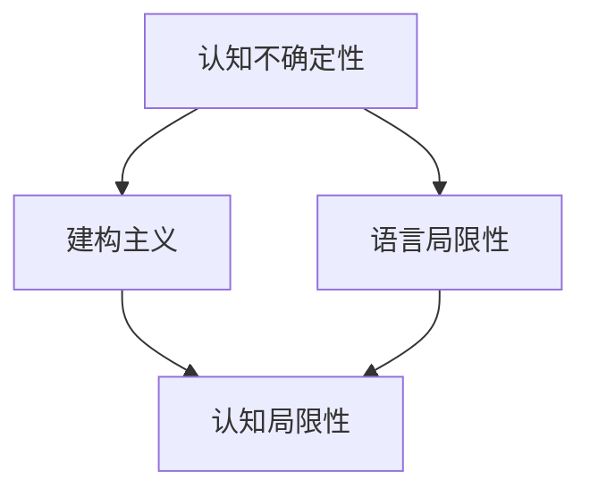
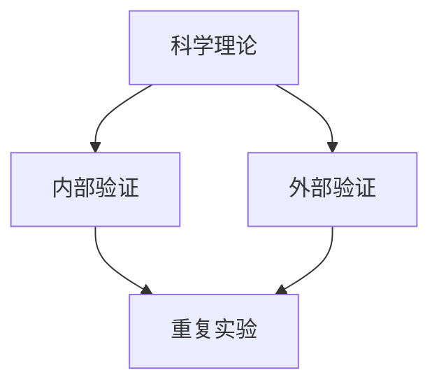

                 

### 科学哲学中的反实在论：对世界可理解性的质疑

在现代科学哲学的研究领域中，反实在论作为一种重要的哲学立场，正日益引起广泛关注。反实在论者质疑世界的客观实在性，认为我们对于外部世界的认知充满不确定性。这一观点不仅挑战了传统实在论的基础，也对科学方法的可靠性提出了深刻质疑。本文将围绕这一主题，系统地探讨反实在论的定义、历史背景、核心概念、相关算法原理及其在科学研究中的应用。

关键词：科学哲学、反实在论、实在论、认知不确定性、科学方法

在本文中，我们首先将概述反实在论的基本概念，阐述其主要类型和历史发展。接着，我们将深入分析反实在论的核心算法原理，包括逻辑结构、验证过程和实证方法。随后，我们将通过具体的数学模型和公式，对反实在论进行详细讲解和举例说明。文章的后半部分将探讨反实在论在物理学、心理学和社会科学等领域的应用实例。最后，我们将总结反实在论的重要观点，并讨论其在科学哲学中的地位及其面临的挑战。

通过这一系列的探讨，我们希望读者能够对反实在论有一个全面而深入的理解，并能够批判性地思考其对科学方法和世界可理解性的影响。

### 摘要

本文旨在探讨科学哲学中的反实在论，一种质疑世界客观实在性的哲学立场。反实在论认为，我们对世界的认知充满不确定性，外部世界的存在并非如我们所感知的那样确定。本文将系统阐述反实在论的定义、历史背景、核心概念、算法原理及其在科学研究中的应用。通过深入分析反实在论的理论结构、验证过程和实证方法，以及具体的数学模型和公式，我们旨在揭示反实在论对科学方法和世界可理解性的深刻影响。文章的最后，我们将总结反实在论的主要观点，并讨论其在科学哲学中的重要地位和面临的挑战。

### 核心概念与联系

#### 反实在论的定义与核心概念

反实在论是一种哲学立场，认为我们所感知到的外部世界并非是客观存在的，而是我们认知和解释的结果。这种立场质疑客观现实的确定性，认为我们的认知是有限的，无法完全准确地反映外部世界。反实在论者强调，现实是建构的，受限于我们的感知、语言和认知框架。

核心概念包括：

- **认知不确定性**：反实在论强调我们的认知存在局限性，无法完全了解外部世界。这种不确定性源于我们对信息的处理能力有限，以及我们认知系统的内在缺陷。

- **建构主义**：反实在论认为，我们对现实的认知是主观建构的，不同个体和社会群体对现实的认知可能存在差异。现实并非一个独立的、客观的存在，而是由我们的感知、信仰和文化背景所构建。

- **经验主义**：反实在论中的经验主义认为，知识来源于经验，但经验是主观的。我们所获得的经验是基于我们的感知和认知框架，因此经验并不能完全准确地反映外部世界。

- **语言局限性**：反实在论指出，语言是我们认知世界的工具，但它也限制了我们的理解。语言具有模糊性和歧义性，无法精确地描述现实。因此，我们的认知和理解可能受到语言的限制。

#### 反实在论的历史背景

反实在论的思想可以追溯到古希腊哲学家，如普罗泰戈拉和普鲁塔克。他们提出了关于感知和认知的主观性观点，质疑外部世界的客观实在性。

在20世纪，反实在论得到了进一步的重视和发展。主要代表人物包括：

- **蒯因（Willard Van Orman Quine）**：蒯因提出了“彻底的经验主义”和“全面证实原则”，认为我们的认知是建构的，语言是我们认知的工具。他强调，我们的经验无法区分真实和虚假，因此我们无法确定外部世界的存在。

- **波普尔（Karl Popper）**：波普尔提出了“可证伪性”原则，认为科学理论必须能够被证伪。他认为，科学知识是不断发展和修正的，而不是基于绝对真实的客观现实。

- **库恩（Thomas S. Kuhn）**：库恩提出了“范式转变”理论，认为科学知识是在不同的范式下发展的。在一个特定的范式内，科学知识是相对稳定的，但当新的范式出现并取代旧范式时，科学知识会发生重大变革。

#### 反实在论的主要类型

反实在论包括多种类型，每种类型都有其独特的哲学观点和方法论。

- **验证主义（Verificationism）**：验证主义认为，只有通过经验验证的知识才是可靠的。这种观点强调实证主义，认为只有通过直接观察和实验验证的知识才是真实可靠的。

- **经验主义（Empiricism）**：经验主义认为，知识来源于经验，特别是感性经验。经验主义强调，我们的认知和理解是基于我们对世界的直接感知。

- **非认知主义（Non-Cognitivism）**：非认知主义认为，某些命题并非用于描述现实，而是用于表达情感、价值观或行为规范。这种观点认为，知识并非关于现实的描述，而是关于如何行动或评价。

#### 反实在论在当代哲学中的地位

反实在论在当代哲学中具有重要的地位，对科学哲学、认识论和形而上学等领域产生了深远影响。

- **对科学哲学的影响**：反实在论挑战了科学实在论的基本假设，认为科学理论并非是对外部世界的客观描述，而是基于特定的认知框架和语言建构的。这促使科学哲学关注科学理论的构建过程、语言的使用和认知框架的影响。

- **对认识论的影响**：反实在论质疑外部世界的客观实在性，认为我们的认知存在局限性。这引发了关于知识本质和认知可靠性的讨论，推动了认识论的深入发展。

- **对形而上学的影响**：反实在论对形而上学的传统观点提出了挑战，认为现实并非一个独立的、客观的存在，而是受限于我们的感知和认知框架。这促使形而上学重新思考现实的本性和我们与世界的关系。

总之，反实在论作为一种质疑外部世界客观实在性的哲学立场，具有重要的理论意义和实践价值。它不仅挑战了传统实在论的基础，也为科学哲学和认识论的发展提供了新的视角和思路。

### 核心算法原理讲解

#### 反实在论的理论分析

反实在论的理论分析主要围绕认知不确定性、建构主义和语言局限性等核心概念展开。首先，我们引入认知不确定性的概念，即我们的认知能力有限，无法完全准确地感知和理解外部世界。这种认知局限性源于多种因素，包括信息处理的限制、感知系统的误差和认知框架的局限性。

为了更好地理解认知不确定性，我们可以引入一个简化的认知模型。假设我们有一个感知系统，用于接收外部世界的信息。这个系统受到带宽限制，只能处理有限的信息量。此外，感知系统还可能存在噪声和误差，导致信息的失真。这些因素共同作用，使得我们对外部世界的认知存在不确定性。

其次，建构主义认为，我们对现实的认知是主观建构的，不同个体和社会群体对现实的认知可能存在差异。这种认知的主观性源于我们的感知、信仰和文化背景。例如，同一件物品在不同文化背景下可能被赋予不同的意义和解释。这种认知的主观性使得我们对现实的认知充满不确定性。

最后，语言局限性也是一个重要因素。语言是我们认知世界的工具，但它也限制了我们的理解。语言具有模糊性和歧义性，无法精确地描述现实。例如，我们使用的词汇和句子可能存在多种解释，导致我们对现实的理解产生偏差。因此，语言局限性也是导致认知不确定性的一个重要原因。

为了分析这些概念之间的关系，我们可以使用以下Mermaid流程图：

在这个流程图中，认知不确定性、建构主义和语言局限性相互关联，共同导致认知局限性。认知局限性又反过来影响我们的认知和解释，形成了一个循环。

#### 反实在论的验证过程

在反实在论的框架下，验证过程是一个复杂且具有争议的话题。反实在论者认为，我们的认知是建构的，因此传统的验证方法（如经验验证）可能并不完全可靠。为了更好地理解这一点，我们可以引入一个简化的验证过程模型。

首先，我们假设有一个科学理论，用于解释外部世界的现象。根据经验验证原则，这个理论需要通过实验或观察来验证。然而，在反实在论的视角下，这个验证过程存在多个问题。

问题一：认知误差。由于我们的认知存在局限性，我们的感知和解释可能存在误差。例如，我们在观察实验时，可能受到主观偏见的影响，导致观察结果失真。这些认知误差使得经验验证的结果具有不确定性。

问题二：语言歧义。语言具有模糊性和歧义性，可能导致我们无法准确描述外部世界。例如，一个实验结果可能被解释为支持某个科学理论，但不同的解释可能导致不同的结论。这种语言歧义使得经验验证的结果难以确定。

问题三：建构主义影响。反实在论认为，我们的认知是建构的，因此实验或观察的结果可能受到我们的认知框架和信仰的影响。例如，一个科学实验可能在不同文化背景下产生不同的结果。这种建构主义的影响使得经验验证的结果更加不确定。

为了应对这些挑战，我们可以引入一种新的验证方法，称为“双重验证”。这种方法包括两个步骤：

第一步：内部验证。在这个步骤中，我们通过多次重复实验或观察，以减少认知误差和语言歧义的影响。例如，我们可以设计一个实验，在不同的时间和地点进行多次重复，以验证实验结果的一致性。这种内部验证有助于提高验证结果的可靠性。

第二步：外部验证。在这个步骤中，我们引入其他独立的研究团队或实验者，以验证我们的实验结果。这种方法可以减少个人偏见和认知框架的影响。例如，我们可以邀请其他专家团队重复我们的实验，以验证我们的实验结果。

以下是双重验证过程的Mermaid流程图：

在这个流程图中，科学理论首先通过内部验证，以减少认知误差和语言歧义的影响。然后，通过外部验证，进一步验证实验结果的一致性和可靠性。这种双重验证方法有助于提高验证结果的可靠性。

#### 反实在论的实证方法

在反实在论的框架下，实证方法是一个复杂且具有争议的话题。反实在论者认为，我们的认知是建构的，因此传统的实证方法（如经验观察和实验）可能并不完全可靠。为了更好地理解这一点，我们可以探讨几种常见的实证方法及其在反实在论框架下的应用。

**1. 经验观察**

经验观察是科学研究中常用的方法，通过直接观察和记录外部现象，以获得对世界的认知。然而，在反实在论的视角下，经验观察存在几个问题。

问题一：认知偏差。由于我们的认知存在局限性，我们的观察可能受到主观偏见的影响。例如，我们可能更容易注意到某些特定的现象，而忽略其他现象。这种认知偏差可能导致观察结果失真。

问题二：语言歧义。我们的观察需要通过语言进行描述和记录，但语言具有模糊性和歧义性，可能导致观察结果的不确定性。例如，一个现象可能被不同的人用不同的词汇描述，导致理解上的差异。

为了应对这些问题，我们可以采用以下策略：

- **多重观察**：通过多次观察同一现象，以减少认知偏差和语言歧义的影响。例如，我们可以邀请不同的观察者在不同的时间和地点进行观察，并记录观察结果。这种多重观察有助于提高观察结果的可靠性。

- **标准化观察**：制定统一的观察标准和规范，以确保不同观察者之间的观察具有一致性。例如，我们可以设计标准化的观察表格，要求观察者按照统一的标准进行记录。

**2. 实验方法**

实验方法是科学研究中常用的另一种方法，通过控制变量和操作条件，以研究变量之间的关系。然而，在反实在论的视角下，实验方法也存在一些问题。

问题一：实验控制。实验需要严格控制变量，以排除其他因素的影响。然而，在反实在论的框架下，这种控制可能并不完全可靠，因为我们的认知和解释可能受到多种因素的影响。

问题二：结果解释。实验结果需要通过语言进行解释和描述，但语言具有模糊性和歧义性，可能导致结果解释的不确定性。例如，一个实验结果可能被不同的人用不同的方式解释，导致不同的结论。

为了应对这些问题，我们可以采用以下策略：

- **双盲实验**：在实验过程中，实验者和观察者都不知道实验的具体条件，以减少主观偏见和结果解释的不确定性。例如，在药物实验中，医生和患者都不知道患者服用的是药物还是安慰剂。

- **重复实验**：通过多次重复实验，以验证实验结果的一致性和可靠性。例如，我们可以设计多个实验组，每个实验组进行相同的实验操作，以比较实验结果。

**3. 数学模型和公式**

在反实在论的框架下，数学模型和公式是一种重要的工具，用于描述和解释外部现象。然而，数学模型和公式也存在一些问题。

问题一：假设前提。数学模型和公式基于一定的假设前提，但这些假设可能并不完全可靠。例如，物理学的许多模型基于理想化的假设，如无限小的粒子或完全均匀的物质。

问题二：结果解释。数学模型和公式可以提供精确的描述和预测，但结果解释可能存在歧义。例如，一个数学公式可以描述一个现象，但不同的人可能用不同的方式解释这个现象。

为了应对这些问题，我们可以采用以下策略：

- **验证假设前提**：通过实验或观察验证数学模型和公式的假设前提，以确保这些假设的可靠性。例如，在物理学中，可以通过实验验证牛顿定律的假设前提。

- **多种模型比较**：使用不同的数学模型和公式进行比较，以验证不同模型和公式的有效性和可靠性。例如，在经济学中，可以比较不同经济模型对市场预测的效果。

通过这些策略，我们可以提高实证方法的可靠性，减少认知偏差和语言歧义的影响，从而更好地理解外部现象。然而，需要注意的是，这些策略并不能完全消除反实在论所带来的不确定性，但可以在一定程度上缓解这种不确定性。

### 核心算法原理讲解

在反实在论的框架下，批判性思维是一种重要的工具，用于分析和评估科学理论和实证方法。批判性思维强调质疑、推理和逻辑分析，有助于我们更好地理解外部世界的复杂性和不确定性。以下是批判性思维在反实在论中的应用。

#### 批判性思维的引入

批判性思维是一种理性思考方式，用于评估和分析信息。它要求我们不仅接受观点和理论，还要质疑这些观点和理论的合理性和可靠性。在反实在论的背景下，批判性思维尤其重要，因为反实在论质疑外部世界的客观实在性和科学方法的可靠性。

引入批判性思维有以下几点好处：

- **提高认知能力**：通过批判性思维，我们可以更好地理解外部世界的复杂性和不确定性，提高我们的认知能力。

- **发现错误和偏见**：批判性思维有助于我们发现观点和理论中的错误和偏见，从而提高科学研究的准确性和可靠性。

- **促进科学进步**：批判性思维鼓励我们质疑现有的理论和方法，推动科学的不断进步和发展。

#### 批判性思维在反实在论中的应用

在反实在论的框架下，批判性思维应用于以下几个关键领域：

**1. 科学理论的评估**

科学理论是科学研究的基础，但并非所有科学理论都是可靠的。批判性思维可以帮助我们评估科学理论的合理性和可靠性。以下是一些关键评估标准：

- **假设前提**：科学理论通常基于一定的假设前提，这些假设前提的可靠性需要被评估。批判性思维要求我们质疑这些假设前提，确保它们符合现实。

- **证据支持**：科学理论需要通过实验、观察和数据分析等证据进行支持。批判性思维要求我们评估这些证据的可靠性和有效性。

- **逻辑一致性**：科学理论需要逻辑一致，即各个部分之间没有矛盾。批判性思维要求我们分析科学理论的逻辑结构，确保其一致性和完整性。

**2. 实证方法的评估**

实证方法用于验证科学理论，但不同的实证方法可能存在局限性。批判性思维可以帮助我们评估实证方法的可靠性和有效性。以下是一些关键评估标准：

- **实验设计**：实验设计需要合理，以确保实验结果的有效性和可靠性。批判性思维要求我们评估实验设计是否合理，是否存在潜在的偏差。

- **数据收集和分析**：数据收集和分析需要准确和可靠。批判性思维要求我们评估数据收集和分析的方法，确保其准确性和可靠性。

- **结果解释**：实验结果需要通过语言进行解释和描述，但语言具有模糊性和歧义性。批判性思维要求我们评估结果解释的合理性和可靠性。

**3. 逻辑分析和推理**

批判性思维强调逻辑分析和推理，用于评估观点和理论的有效性。以下是一些关键逻辑分析方法：

- **归纳推理**：归纳推理从特定实例出发，推断一般性结论。批判性思维要求我们评估归纳推理的合理性和可靠性，确保结论符合实际情况。

- **演绎推理**：演绎推理从一般性原则出发，推断特定结论。批判性思维要求我们评估演绎推理的逻辑严密性，确保结论符合前提条件。

- **类比推理**：类比推理通过比较相似性推断相似性。批判性思维要求我们评估类比推理的合理性和可靠性，确保比较对象具有足够的相似性。

#### 批判性思维的挑战与局限

批判性思维虽然是一种重要的工具，但也存在一些挑战和局限。

**1. 认知偏差**：批判性思维本身可能受到认知偏差的影响，导致评估结果失真。例如，人们可能更容易注意到支持自己观点的信息，而忽略反对自己观点的信息。

**2. 时间和资源**：批判性思维需要时间和资源，进行深入的分析和推理。在快速变化的科学环境中，批判性思维可能无法及时评估新的观点和理论。

**3. 语言歧义**：批判性思维依赖于语言进行表达和推理，但语言具有模糊性和歧义性，可能导致推理结果的不确定性。

尽管存在这些挑战和局限，批判性思维仍然是反实在论框架下不可或缺的工具。通过批判性思维，我们可以更好地理解外部世界的复杂性和不确定性，提高科学研究的准确性和可靠性。

### 方法论探讨

在反实在论的框架下，方法论探讨是一个关键领域，旨在理解科学理论的构建过程、语言的使用以及认知框架对科学研究的影响。以下将详细探讨这些方面，并分析方法论与科学实在论的关系。

#### 方法论的多样性

方法论在科学研究中扮演着重要角色，不同的方法论适用于不同类型的研究问题。在反实在论的背景下，方法论的多样性尤为突出。

**1. 实证主义方法论**

实证主义方法论强调通过实验和观察获取知识。这种方法认为，只有通过可验证的实证数据，我们才能获得关于外部世界的可靠知识。实证主义方法论在自然科学和工程学等领域广泛应用，其核心是实验设计和数据收集。

**2. 唯名论方法论**

唯名论方法论认为，只有具体的、个别的事物是真实的，而普遍的概念和抽象的原则是人的主观构建。这种方法主张通过具体的实例来理解世界，反对将抽象概念视为真实的存在。唯名论方法论在社会科学和人文学科中具有影响力。

**3. 假设-演绎方法论**

假设-演绎方法论是科学哲学中的一种重要方法，它强调通过假设和逻辑推理来构建科学理论。这种方法认为，科学理论是通过一系列假设和演绎推理得出的，而不是直接基于观察和实验。假设-演绎方法论在物理学和天文学等学科中具有重要地位。

#### 方法论的演变

方法论不是一成不变的，而是在科学发展的过程中不断演变的。在反实在论的背景下，方法论的演变具有以下特点：

**1. 从实证主义到建构主义**

随着科学哲学的发展，实证主义的局限性逐渐显现。现代科学哲学越来越多地接受建构主义的观点，即科学知识是通过人类主观建构的。这种方法论认为，科学理论是基于特定的认知框架和语言建构的，因此存在不确定性。

**2. 从单向验证到多重验证**

传统方法论强调单向验证，即通过实验或观察验证科学理论的正确性。反实在论提出了多重验证的概念，认为科学理论需要通过多种方法进行验证，以提高其可靠性。这种方法论强调内部验证和外部验证的结合，以减少认知偏差和语言歧义的影响。

#### 方法论与科学实在论的关系

科学实在论是一种认为科学理论能够准确描述外部世界的哲学立场。在反实在论的框架下，方法论与科学实在论的关系存在一定争议。

**1. 反实在论的挑战**

反实在论质疑科学实在论的基础，认为科学理论并非是对外部世界的客观描述，而是基于特定的认知框架和语言建构的。这种方法论认为，科学理论存在不确定性和主观性，因此不能完全等同于外部现实。

**2. 科学实在论的回应**

科学实在论者认为，虽然科学理论存在不确定性和主观性，但它们仍然在一定程度上能够准确描述外部世界。科学实在论强调科学理论的预测能力和一致性，认为这些特性使得科学理论具有一定的客观性。

**3. 方法论的融合**

在现代科学哲学中，方法论和科学实在论不再是对立的，而是相互融合的。科学哲学认为，科学理论是基于特定的认知框架和语言建构的，但它们仍然在一定程度上能够反映外部世界。这种融合的方法论认为，科学研究的目的是不断改进科学理论，以更好地描述和理解外部世界。

总之，反实在论的方法论探讨为我们提供了新的视角，挑战了传统科学实在论的基础。通过理解方法论的多样性、演变以及与科学实在论的关系，我们可以更好地理解科学研究的本质和局限性，推动科学哲学的发展。

### 反实在论的数学模型与公式详解

#### 反实在论中的数学基础

在反实在论的框架下，数学模型和公式作为一种重要的工具，用于描述和解释外部现象。这些模型和公式不仅帮助我们在理论上理解反实在论的原理，还可以在实际应用中提供具体的指导。以下将介绍几种常见的数学模型和公式，并详细讲解它们的应用和推导。

**1. 可能性论模型**

可能性论模型是反实在论中的一个重要数学模型，用于描述外部现象的不确定性和概率。可能性论认为，外部世界的状态和事件不是确定的，而是具有一定概率分布的。以下是一个简单的可能性论模型：

\[ P(A) = \frac{N(A)}{N} \]

其中，\( P(A) \) 表示事件 \( A \) 发生的概率，\( N(A) \) 表示事件 \( A \) 发生的次数，\( N \) 表示实验的总次数。这个公式表示，事件 \( A \) 的概率是其发生次数与总次数的比值。

**2. 假设论模型**

假设论模型用于描述在反实在论背景下科学理论的构建过程。它强调科学理论是基于一系列假设推导出的，这些假设可能是基于观察、经验或先验知识。以下是一个简单的假设论模型：

\[ T = H_1 \land H_2 \land ... \land H_n \]

其中，\( T \) 表示科学理论，\( H_1, H_2, ..., H_n \) 表示一系列假设。这个公式表示，科学理论 \( T \) 是基于假设 \( H_1, H_2, ..., H_n \) 推导出的。

**3. 真值论模型**

真值论模型用于描述外部现象的真值状态。在反实在论中，真值状态不是绝对的，而是依赖于我们的认知和解释。以下是一个简单的真值论模型：

\[ V(A) = \text{True if } A \text{ is observed, False otherwise} \]

其中，\( V(A) \) 表示事件 \( A \) 的真值状态，如果事件 \( A \) 被观察到，则 \( V(A) \) 为真，否则为假。

#### 可能性论公式详解

可能性论公式主要用于描述外部现象的概率分布。以下将详细讲解可能性论公式及其应用实例。

**1. 可能性论公式推导**

可能性论公式可以通过以下步骤推导：

- **定义基本事件**：首先定义基本事件，即外部现象的最小单位。例如，在掷硬币的实验中，基本事件是正面或反面。

- **计算基本事件概率**：计算每个基本事件的概率。例如，在掷硬币的实验中，正面和反面的概率都是 \( \frac{1}{2} \)。

- **组合基本事件**：将基本事件组合成更复杂的事件。例如，在掷硬币两次的实验中，可能的事件包括“两次都是正面”、“一次正面一次反面”和“两次都是反面”。

- **计算复杂事件概率**：计算每个复杂事件的概率。例如，在掷硬币两次的实验中，“两次都是正面”的概率是 \( \frac{1}{4} \)。

**2. 可能性论应用实例**

以下是一个可能性论的应用实例：

**实例：掷硬币三次**

假设我们掷硬币三次，要求计算以下事件的概率：

- \( P(\text{三次都是正面}) \)
- \( P(\text{至少有一次正面}) \)
- \( P(\text{正面次数为偶数}) \)

根据可能性论公式，我们可以进行如下计算：

\[ P(\text{三次都是正面}) = \left(\frac{1}{2}\right)^3 = \frac{1}{8} \]

\[ P(\text{至少有一次正面}) = 1 - P(\text{三次都是反面}) = 1 - \left(\frac{1}{2}\right)^3 = \frac{7}{8} \]

\[ P(\text{正面次数为偶数}) = P(\text{零次正面}) + P(\text{两次正面}) = \left(\frac{1}{2}\right)^3 + 3 \times \left(\frac{1}{2}\right)^2 \times \left(\frac{1}{2}\right) = \frac{1}{8} + 3 \times \frac{1}{8} = \frac{1}{2} \]

通过这个实例，我们可以看到可能性论公式在处理复杂外部现象的概率分布方面的应用。可能性论公式不仅帮助我们理解外部现象的概率，还可以为决策和预测提供依据。

#### 假设论公式详解

假设论公式主要用于描述科学理论的构建过程，特别是在反实在论的框架下。以下将详细讲解假设论公式及其应用实例。

**1. 假设论公式推导**

假设论公式可以通过以下步骤推导：

- **定义假设**：首先定义假设，即科学理论的基础。例如，牛顿的万有引力定律是基于“所有物体之间存在引力”的假设。

- **推导理论**：根据假设，推导出科学理论。例如，基于“所有物体之间存在引力”的假设，可以推导出牛顿的万有引力定律。

- **验证理论**：通过实验或观察验证理论的正确性。例如，通过天文学观测验证牛顿的万有引力定律。

**2. 假设论应用实例**

以下是一个假设论的应用实例：

**实例：建立抛物线运动模型**

假设我们要建立抛物线运动模型，要求计算物体在空中运动的时间。假设以下条件成立：

- 物体以初速度 \( v_0 \) 水平抛出。
- 重力加速度为 \( g \)。

根据假设论公式，我们可以进行如下推导：

- **水平方向运动**：物体在水平方向上的速度保持不变，即 \( v_x = v_0 \)。

- **竖直方向运动**：物体在竖直方向上的运动受到重力加速度的影响，即 \( v_y = g t \)。

- **运动时间**：物体在空中运动的时间 \( t \) 可以通过以下公式计算：

\[ t = \frac{v_0}{g} \]

通过这个实例，我们可以看到假设论公式在构建科学理论方面的应用。假设论公式不仅帮助我们理解科学理论的构建过程，还可以为实际应用提供指导。

#### 真值论公式详解

真值论公式主要用于描述外部现象的真值状态，特别是在反实在论的框架下。以下将详细讲解真值论公式及其应用实例。

**1. 真值论公式推导**

真值论公式可以通过以下步骤推导：

- **定义真值**：首先定义真值，即外部现象的真实状态。例如，在判断一个命题是否为真时，我们定义其真值为“真”或“假”。

- **建立真值函数**：根据定义，建立真值函数，用于计算外部现象的真值。例如，一个简单的真值函数可以定义为 \( V(A) = \text{True if } A \text{ is true, False otherwise} \)。

- **验证真值函数**：通过实验或观察验证真值函数的可靠性。例如，通过实际测量验证真值函数对物理现象的判断是否准确。

**2. 真值论应用实例**

以下是一个真值论的应用实例：

**实例：判断物体是否在空中**

假设我们要判断物体是否在空中，即判断物体是否受到重力作用。假设以下条件成立：

- 如果物体受到重力作用，则物体在空中。
- 如果物体不受重力作用，则物体在地面上。

根据真值论公式，我们可以进行如下推导：

- **判断物体在空中的条件**：如果物体受到重力作用，则物体在空中。这个条件可以用真值函数表示为：

\[ V(A) = \text{True if } A \text{ is under gravity, False otherwise} \]

- **判断物体在空中的实例**：假设我们测量到一个物体的重力加速度为 \( g \)，根据真值论公式，我们可以判断这个物体是否在空中：

\[ V(A) = \text{True} \]

通过这个实例，我们可以看到真值论公式在判断外部现象真值状态方面的应用。真值论公式不仅帮助我们理解外部现象的真值状态，还可以为实际应用提供指导。

### 反实在论在科学研究中的应用

#### 反实在论在物理学中的应用

反实在论在物理学中有着广泛的应用，特别是在量子力学和相对论等领域。量子力学揭示了微观世界的复杂性和不确定性，而相对论则挑战了经典物理学的绝对时空观。以下将探讨反实在论在物理学中的具体应用。

**1. 量子力学中的反实在论观点**

量子力学的基本原理表明，微观粒子的行为具有概率性和不确定性。这一特性使得反实在论在量子力学中得到了充分的应用。量子力学的核心概念，如波粒二象性、量子叠加态和量子纠缠，都反映了外部世界的不可确定性。

- **波粒二象性**：量子力学表明，微观粒子既具有波动性又具有粒子性。这意味着我们不能简单地将微观粒子视为经典物理中的实物粒子，而是一个概率波包。这种概率性使得我们对微观粒子的状态和位置无法精确预测，从而质疑了外部世界的客观实在性。

- **量子叠加态**：量子叠加态描述了微观粒子在同时处于多个可能状态的情况。例如，一个电子可以同时处于自旋向上和自旋向下的状态，直到进行测量时才“坍缩”到其中一个确定状态。这种叠加态的存在挑战了我们对现实确定性的理解，反映了外部世界的不可确定性。

- **量子纠缠**：量子纠缠现象表明，两个或多个粒子在量子态上存在不可分割的联系。即使这些粒子相隔很远，对其中一个粒子的测量将即时影响其他粒子的状态。这种超距作用挑战了经典物理学的局域实在论，强调了外部世界的非确定性。

**2. 相对论中的反实在论观点**

相对论，特别是广义相对论，提出了时空的相对性和弯曲性，进一步质疑了外部世界的客观实在性。

- **时空相对性**：相对论表明，时空是相对的，而不是绝对的。不同观察者可能会对同一事件的时间和空间坐标有不同的测量结果，这取决于他们的相对运动状态。这种时空相对性挑战了经典物理学的绝对时空观，强调了外部世界的不可确定性。

- **时空弯曲**：广义相对论提出，重力是由物质对时空产生的弯曲引起的。这意味着外部世界的几何结构是动态变化的，而不是固定不变的。这种时空弯曲性挑战了我们对外部世界稳定性的理解，反映了外部世界的不可确定性。

**3. 反实在论在物理学中的应用实例**

反实在论在物理学中的应用可以通过以下实例进行说明：

- **量子计算**：量子计算利用量子叠加态和量子纠缠实现高效计算。量子计算机能够处理传统计算机无法解决的复杂问题，如大数分解和优化问题。这种量子计算的应用展示了反实在论在信息技术领域的潜力。

- **引力波探测**：引力波是由大规模天体事件（如黑洞碰撞）产生的时空波动。通过探测引力波，我们可以验证相对论的预言，并了解宇宙的动态演化。引力波的探测不仅证实了相对论的预测，也揭示了外部世界的非确定性。

- **量子模拟**：量子模拟是一种利用量子系统模拟其他量子系统的技术。通过量子模拟，我们可以研究量子现象和量子计算，进一步理解外部世界的不可确定性。例如，利用量子模拟研究量子化学和材料科学，可以揭示新的材料性质和化学反应机制。

总之，反实在论在物理学中的应用揭示了外部世界的复杂性和不确定性。量子力学和相对论的基本原理都反映了外部世界的不可确定性，这促使我们对现实进行重新思考。反实在论在物理学中的应用不仅丰富了科学理论，也为未来科学探索提供了新的视角。

#### 反实在论在心理学中的应用

反实在论在心理学中的应用深刻地影响了我们对认知过程和心理现象的理解。心理学的许多研究都涉及到认知的不确定性和主观性，这恰好是反实在论的核心观点。以下将探讨反实在论在心理学中的具体应用。

**1. 认知心理学中的反实在论观点**

认知心理学研究人类思维、感知和记忆等心理过程，反实在论在这些研究中提供了新的视角。认知心理学的一些重要理论，如认知建构主义和认知语言学，都与反实在论密切相关。

- **认知建构主义**：认知建构主义认为，我们对世界的认知是通过个体内部的构建过程实现的，而不是简单地接收外部刺激。这种观点强调了主观性和不确定性，因为不同个体可能会有不同的认知建构方式。

  例如，儿童在学习语言时，通过不断的试错和重复，逐渐构建出对语言的理解。这种认知过程并非是对外部现实的直接反映，而是个体基于自身经验和认知框架的主观构建。

- **认知语言学**：认知语言学认为，语言并非是对外部世界的直接描述，而是我们认知世界的一种工具。语言的使用受到文化背景、语言习惯和认知框架的影响，因此不同语言和文化背景的人对同一现象的认知可能存在差异。

  例如，在一些语言中，颜色的表达可能更加细致，而在另一些语言中，颜色的表达可能较为模糊。这种差异反映了认知语言学中的反实在论观点，即语言和认知是主观建构的。

**2. 发展心理学中的反实在论观点**

发展心理学研究个体从出生到成年的心理发展过程，反实在论在这一领域提供了新的解释框架。发展心理学中的许多理论都强调个体在认知和行为上的不确定性，特别是在早期发展阶段。

- **建构主义发展观**：建构主义发展观认为，儿童在成长过程中通过与环境互动，主动建构自己的认知世界。这种建构过程受到个体经验、文化背景和家庭环境等多种因素的影响，因此不同个体的发展轨迹可能存在差异。

  例如，儿童在学龄前期的认知发展过程中，通过不断的探索和实验，逐渐建立对世界的理解。这种理解并非是对外部世界的直接反映，而是基于个体经验的主观建构。

- **不确定性认知发展**：发展心理学中的不确定性认知理论认为，儿童在早期发展阶段对世界的认知存在不确定性。这种不确定性不仅体现在认知过程中，也体现在行为和情绪上。

  例如，婴儿在出生后的早期阶段，对世界的认知主要依赖于感知和直觉。这种认知方式使得婴儿在处理新信息时具有不确定性，表现为探索行为和情绪波动。随着成长，儿童逐渐发展出更加稳定的认知方式，但这种不确定性仍然存在于他们的认知过程中。

**3. 反实在论在心理学中的应用实例**

反实在论在心理学中的应用可以通过以下实例进行说明：

- **认知干预**：在心理治疗中，认知干预方法如认知行为疗法（CBT）和建构主义心理治疗，都基于反实在论的观点。这些方法通过帮助个体重新构建认知，改变对现实的主观认知，从而改善情绪和行为问题。

  例如，在认知行为疗法中，治疗师帮助患者识别和改变消极的认知模式，通过重新构建对事件的认知，减轻焦虑和抑郁症状。

- **教育实践**：在教育领域，建构主义教学方法和项目式学习（PBL）都受到反实在论的影响。这些方法强调学生的主动参与和探索，鼓励学生在互动中构建对知识的主观理解。

  例如，在项目式学习中，学生通过实际项目和实践活动，主动探索和构建对知识的理解，而不是被动接受教师的讲解。

总之，反实在论在心理学中的应用为我们提供了新的视角，帮助我们理解认知过程和心理现象的复杂性。认知心理学和发展心理学中的反实在论观点，不仅挑战了传统实在论的假设，也为心理学研究提供了新的理论框架和方法。

#### 反实在论在社会科学中的应用

反实在论在社会科学中的应用尤为显著，尤其是在社会学、经济学和政治学等领域。社会科学研究常常涉及复杂的人类行为和社会结构，反实在论提供了一种重新审视这些复杂性的框架。以下将探讨反实在论在社会科学中的具体应用。

**1. 社会学中的反实在论观点**

社会学关注社会结构、社会关系和人类行为。反实在论在社会学中的应用，主要体现在对社会现实的主观性和相对性的理解。

- **符号互动论**：符号互动论是一种社会学的理论框架，认为社会现实是通过个体之间的符号互动构建的。个体通过语言、行为和文化符号来理解和定义社会现实，这种构建过程受到主观性和文化背景的影响。

  例如，一个社会问题（如贫困）在不同的文化背景下可能被赋予不同的意义和解释。这种主观性使得社会现实不是固定的，而是不断变化的。

- **结构功能主义**：结构功能主义认为，社会结构和社会关系是功能性的，有助于维持社会秩序。反实在论视角下的结构功能主义强调，这些功能是基于特定文化和认知框架构建的，而不是客观存在的。

  例如，家庭作为社会结构的基本单位，在不同的文化和社会制度中可能具有不同的功能和角色。反实在论者认为，家庭的功能是基于特定社会和文化背景的主观构建。

**2. 经济学中的反实在论观点**

经济学研究资源分配、市场行为和经济制度。反实在论在经济学中的应用，主要体现在对市场机制和社会价值的重新审视。

- **行为经济学**：行为经济学关注人类在决策过程中的非理性行为，挑战了传统经济学中的理性人假设。反实在论视角下的行为经济学认为，人类行为受到心理、社会和文化因素的影响，因此经济决策具有不确定性。

  例如，行为经济学研究表明，人们在面对风险和不确定性时，可能会表现出与预期效用理论不一致的行为，如过度自信或风险厌恶。

- **制度经济学**：制度经济学关注经济制度对社会行为的影响。反实在论视角下的制度经济学认为，经济制度并非是客观存在的，而是基于特定文化和社会价值观的主观构建。

  例如，不同的经济制度（如资本主义和社会主义）反映了不同社会对资源分配和社会价值的理解，这些制度是基于特定文化和社会背景的主观构建。

**3. 政治学中的反实在论观点**

政治学研究政治制度、政策制定和政治行为。反实在论在政治学中的应用，主要体现在对政治现实的主观性和政治合法性的质疑。

- **政治哲学**：政治哲学探讨政治权力、民主和社会正义等问题。反实在论视角下的政治哲学认为，政治现实是权力和意识形态的产物，具有主观性。

  例如，民主制度在不同国家和文化背景下可能存在不同的实现方式和理解。反实在论者认为，民主制度是基于特定文化和价值观的主观构建。

- **政治行为分析**：政治行为分析研究政治家的决策过程和行为模式。反实在论视角下的政治行为分析认为，政治家的行为受到个人利益、意识形态和社会期望的影响，因此政治决策具有不确定性。

  例如，政治家在制定政策时，可能会考虑到选民的心理反应和政治合法性，这些因素反映了政治行为的主观性。

**4. 反实在论在社会科学中的应用实例**

反实在论在社会科学中的应用可以通过以下实例进行说明：

- **社会网络分析**：社会网络分析研究社会结构和人际关系的模式。反实在论视角下的社会网络分析认为，社会结构是社会互动和符号互动的结果，具有主观性和相对性。

  例如，通过分析社会网络中的互动和符号传递，可以揭示社会结构的变化和个体行为的相互影响。

- **政策评估**：在政策评估中，反实在论视角下的政策评估关注政策实施过程中的主观性和不确定性。政策评估不仅需要考虑政策的经济和效率，还需要考虑政策对社会价值观和文化的影响。

  例如，在评估一项教育政策时，需要考虑不同文化和社会背景下的政策效果，以及政策如何影响社会公平和正义。

总之，反实在论在社会科学中的应用为我们提供了一种重新审视社会现象和人类行为的视角。通过理解社会现实的主观性和相对性，我们可以更好地理解社会复杂性和人类行为的多样性。

### 总结与展望

本文系统探讨了科学哲学中的反实在论，分析了其定义、历史背景、核心概念、算法原理及其在科学研究中的应用。反实在论质疑外部世界的客观实在性，强调认知不确定性、建构主义和语言局限性。我们通过详细讲解可能性论、假设论和真值论等数学模型，揭示了反实在论在物理学、心理学和社会科学等领域的应用。反实在论不仅挑战了传统实在论的基础，还为科学哲学提供了新的视角和方法。

在未来的研究中，我们可以进一步探讨反实在论在人工智能和认知科学中的应用，探索如何利用反实在论的原理提升机器学习和认知模型的可靠性。此外，反实在论在科学教育中的应用也值得深入研究，以培养更加批判性和理性的科学思维方式。通过这些研究，我们可以更好地理解外部世界的复杂性和不确定性，推动科学和哲学的发展。

