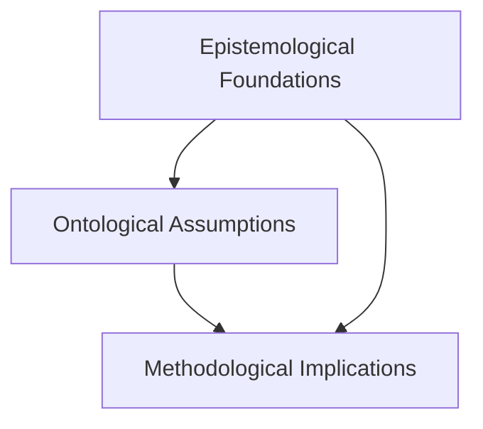

                 

### Chapter 1: Introduction to Constructivist Empiricism

#### 1.1 What is Constructivist Empiricism

Constructivist empiricism is an epistemological approach that posits that knowledge is constructed through the interplay between human experiences and the external environment. Unlike traditional empiricism, which asserts that knowledge comes solely from sensory experiences, constructivism emphasizes the active role of the individual in the process of constructing understanding. This approach gained prominence in the late 20th century as a response to the limitations of positivism and the increasing complexity of scientific inquiry.

**1.1.1 Historical Background**

The roots of constructivist empiricism can be traced back to the works of Enlightenment thinkers such as John Locke and George Berkeley, who argued that knowledge is built on perceptual experiences. However, the modern interpretation and development of this theory are largely attributed to the likes of Jean Piaget and Lev Vygotsky, who emphasized the role of social interaction and cultural context in the construction of knowledge. In the realm of scientific philosophy, Karl Popper and Thomas Kuhn are notable contributors who have influenced the development of constructivist empiricism.

**1.1.2 Key Philosophical Contributions**

- **Knowledge Construction**: Constructivist empiricism suggests that knowledge is not a passive accumulation of facts, but an active process of constructing and reconstructing mental models of reality. This is often depicted as a spiral of increasing complexity, where each iteration refines the understanding of the subject matter.

- **Subjectivity and Objectivity**: While traditional empiricism attempts to achieve objectivity by minimizing individual bias, constructivism acknowledges the role of subjectivity in the process of understanding. The distinction between subject and object blurs, as both are seen as interdependent in the construction of knowledge.

- **Contextual Dependence**: Constructivist empiricism emphasizes that knowledge is inherently contextual. The understanding of a concept can vary significantly depending on the cultural, social, and historical context in which it is situated.

**1.1.3 Relationship with Other Schools of Thought**

Constructivist empiricism shares some commonalities with other epistemological approaches, such as pragmatism and interpretivism, but also distinguishes itself through its emphasis on the active role of the individual in the construction of knowledge. While pragmatism focuses on the practical application of knowledge, constructivism is more concerned with the process of knowledge construction itself. Additionally, interpretivism emphasizes the importance of understanding human behavior and social phenomena through the lens of interpretation, which aligns closely with the constructivist perspective.

**1.2 Basic Concepts in Constructivist Empiricism**

**1.2.1 Epistemological Foundations**

- **Construction of Knowledge**: Constructivist empiricism posits that knowledge is a construct, shaped by the interplay between sensory experiences and cognitive processes. This construction is not a linear process but rather a dynamic and iterative one, where understanding evolves over time.

- **Cognitive Processes**: The cognitive processes involved in the construction of knowledge include perception, memory, reasoning, and problem-solving. These processes are influenced by individual experiences and cultural context.

**1.2.2 Ontological Assumptions**

- **Subject-Object Interdependence**: Constructivist empiricism assumes that the subject and object are interdependent, meaning that knowledge cannot be understood in isolation from the individual who constructs it. This interdependence challenges the traditional dualism of subject and object.

- **Contextual Determinism**: The theory assumes that knowledge is inherently contextual, meaning that the understanding of a concept is shaped by the cultural, social, and historical context in which it is situated.

**1.2.3 Methodological Implications**

- **Qualitative Research Methods**: Constructivist empiricism lends itself well to qualitative research methods, such as ethnography and narrative analysis, which emphasize the importance of context and individual experiences.

- **Reflective Practice**: The theory encourages reflective practice, where individuals engage in critical self-reflection to understand their own cognitive processes and biases.

**1.3 Mermaid Flowchart of Core Concepts and Relationships**

**1.4 The Role of Constructivist Empiricism in Science**

Constructivist empiricism has had a significant impact on the philosophy of science, challenging the traditional view of scientific knowledge as objective and value-neutral. By emphasizing the active role of the individual in the construction of knowledge, constructivist empiricism encourages scientists to be more reflective and critical of their own assumptions and methodologies. This approach has led to the development of new research methodologies, such as participant observation and case studies, which are more in line with the principles of constructivist empiricism.

### 1.4.1 Challenging Traditional Empiricism

One of the key contributions of constructivist empiricism is its challenge to the traditional empiricist view that knowledge is derived solely from sensory experiences. While sensory experiences are indeed an important source of knowledge, constructivism argues that they are insufficient on their own. The interpretation and understanding of sensory experiences require cognitive processes and cultural context, which traditional empiricism often overlooks.

### 1.4.2 Embracing Complexity

Constructivist empiricism is particularly suited to dealing with the complexity of modern scientific inquiry. Traditional methodologies often struggle to capture the intricate relationships and dynamics involved in complex systems. By emphasizing the active role of the individual in the construction of knowledge, constructivist empiricism provides a more flexible and adaptable approach to understanding complex phenomena.

### 1.4.3 Fostering Reflective Practice

The emphasis on reflective practice in constructivist empiricism encourages scientists to be more self-aware and critical of their own biases and assumptions. This fosters a culture of continuous learning and improvement, which is essential for advancing scientific knowledge.

In conclusion, constructivist empiricism offers a compelling alternative to traditional empiricism, providing a more nuanced and dynamic understanding of the process of scientific inquiry. Its emphasis on the active role of the individual, the contextual nature of knowledge, and the importance of reflective practice has had a significant impact on the philosophy of science and continues to shape the development of scientific methodologies. 

---

### 1.5 Conclusion

In this chapter, we have explored the fundamental concepts and historical background of constructivist empiricism. We have discussed its key philosophical contributions, including the construction of knowledge, the interdependence of subject and object, and the contextual dependence of understanding. Through a mermaid flowchart, we visualized the relationships between these core concepts. Furthermore, we have examined the role of constructivist empiricism in science, highlighting its challenges to traditional empiricism, its ability to embrace complexity, and its promotion of reflective practice. This foundation sets the stage for deeper exploration of constructivist empiricism in the subsequent chapters, where we will delve into its implications for scientific research and methodology.

