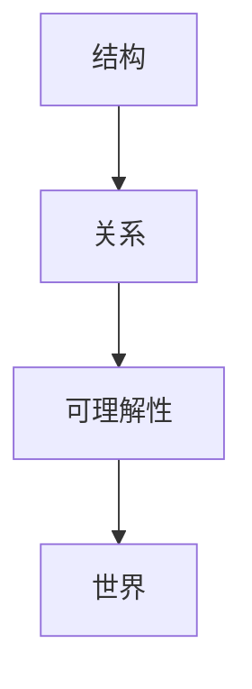
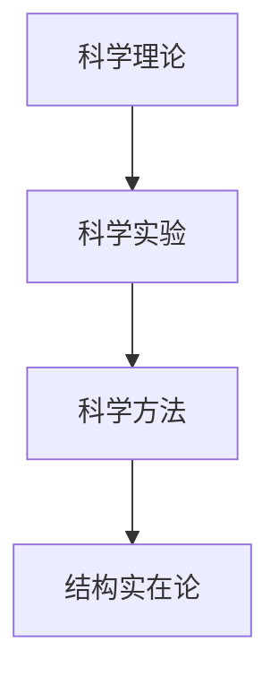
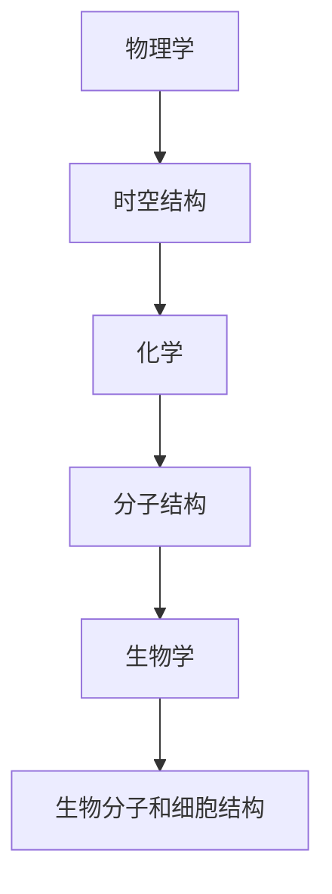
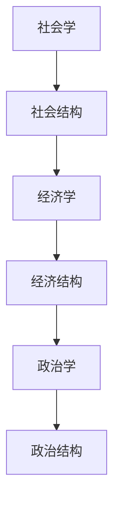
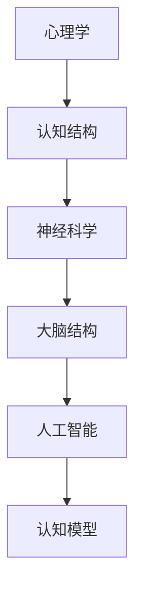
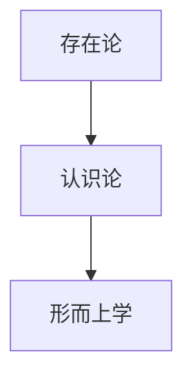
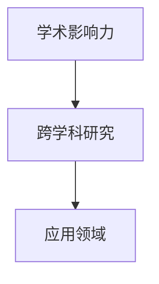
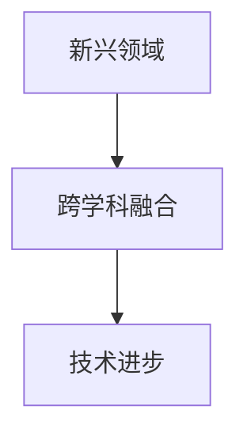
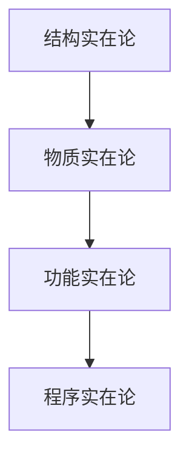

                 

### 《科学哲学中的结构实在论：探讨世界可理解性的本体论基础》

#### 关键词
- 结构实在论
- 科学哲学
- 本体论
- 可理解性
- 方法论
- 数学模型

#### 摘要
本文旨在探讨科学哲学中的结构实在论，分析其如何为世界的可理解性提供本体论基础。通过详细阐述结构实在论的历史背景、核心概念、与科学方法论的联系，以及其在自然科学、社会科学、认知科学和哲学问题中的应用，本文旨在为读者提供全面深入的理解，并探讨其未来的发展方向。

## 第1章 导论

### 1.1 结构实在论的基本概念

结构实在论是一种哲学观点，认为现实世界是由一系列基本结构构成的，这些结构是独立于观察者的意识和理论的。与物质实在论不同，结构实在论强调的是这些结构的存在及其内在关系，而不是物质本身。

#### 核心概念与联系

结构实在论的核心概念包括：

1. **结构**：构成现实世界的基本单元。
2. **关系**：结构之间的相互作用和影响。
3. **可理解性**：世界可以通过这些结构和关系被理解和解释。

这些概念之间有着紧密的联系。结构是关系的基础，而关系则是结构的动态表现。可理解性则是通过这些结构和关系的分析和理解实现的。

#### Mermaid 流程图



### 1.2 结构实在论的历史背景与发展

结构实在论的概念最早可以追溯到古希腊哲学家亚里士多德，他在《形而上学》一书中提出了结构实在论的思想。然而，作为一种独立的哲学观点，结构实在论的发展主要是在20世纪。

#### 核心人物与理论

1. **尼古拉·哈特曼**：德国哲学家，被认为是现代结构实在论的开创者。
2. **阿尔伯特·爱因斯坦**：物理学家，其相对论思想对结构实在论的发展产生了深远影响。
3. **伊曼努尔·康德**：哲学家，其“先验范畴”理论为结构实在论提供了理论基础。

### 1.3 结构实在论的研究意义

结构实在论为世界的可理解性提供了本体论基础，使得科学研究和哲学思考有了更为坚实的哲学依据。它不仅有助于我们理解自然科学的内在逻辑，还能帮助我们更好地应对哲学问题，如存在的本质和意识的问题。

## 第2章 结构实在论的历史背景与发展

### 2.1 结构实在论的出现背景

结构实在论的出现是科学哲学发展的必然结果。在20世纪初期，随着量子力学和相对论的兴起，科学家们开始意识到，传统的物质实在论已经无法解释许多实验结果和观测现象。因此，结构实在论作为一种新的哲学观点，应运而生。

#### 核心人物与理论

1. **尼古拉·哈特曼**：德国哲学家，被认为是现代结构实在论的开创者。他在1927年的著作《逻辑的本质》中提出了结构实在论的基本思想。
2. **阿尔伯特·爱因斯坦**：物理学家，其相对论思想对结构实在论的发展产生了深远影响。相对论揭示了时空结构的动态性，为结构实在论提供了强有力的理论支持。
3. **伊曼努尔·康德**：哲学家，其“先验范畴”理论为结构实在论提供了理论基础。康德认为，我们的感知和理解是通过一系列先验范畴实现的，这些范畴是构成现实世界的基础。

### 2.2 结构实在论的主要代表人物与理论

除了尼古拉·哈特曼、阿尔伯特·爱因斯坦和伊曼努尔·康德，还有其他一些哲学家和科学家对结构实在论的发展做出了重要贡献。

1. **莱布尼茨**：德国哲学家和数学家，其“单子论”被认为是结构实在论的前身。
2. **维特根斯坦**：哲学家，他的“语言游戏”理论为结构实在论提供了新的解释框架。
3. **雅克·德里达**：法国哲学家，他的“解构主义”思想对结构实在论产生了深刻影响。

### 2.3 结构实在论的历史演变

结构实在论的发展经历了多个阶段。从早期对物质实在论的批判，到对时空结构的深入探讨，再到对意识与认知的反思，结构实在论不断拓展其研究领域和理论深度。

## 第3章 结构实在论与科学方法论

### 3.1 结构实在论与科学方法论的联系

结构实在论与科学方法论有着密切的联系。科学方法论是研究科学活动规律和方法的哲学分支，而结构实在论则为科学方法论提供了本体论基础。

#### 核心概念与联系

1. **科学理论**：结构实在论认为，科学理论是对现实世界结构的抽象和解释。
2. **科学实验**：结构实在论强调实验结果的重要性，认为实验是验证科学理论的有效手段。
3. **科学方法**：结构实在论提出了“结构主义方法论”，强调通过分析现实世界的结构来构建科学理论。

#### Mermaid 流程图



### 3.2 结构实在论对科学方法论的贡献

结构实在论对科学方法论的发展做出了重要贡献。它不仅提供了一种新的理论框架，还推动了对科学理论、实验方法和科学解释的深入探讨。

1. **理论构建**：结构实在论强调通过分析现实世界的结构来构建科学理论，这种方法有助于提高理论的准确性和解释力。
2. **实验设计**：结构实在论强调实验的重要性，认为实验是验证科学理论的关键。因此，结构实在论推动了实验设计方法的发展。
3. **科学解释**：结构实在论提供了一种新的解释框架，有助于我们更好地理解科学理论和实验结果。

### 3.3 结构实在论在科学方法论中的挑战

尽管结构实在论为科学方法论提供了重要启示，但也面临一些挑战。

1. **复杂性**：现实世界的结构非常复杂，如何有效地分析这些结构是科学方法论面临的一个挑战。
2. **方法论多样性**：结构实在论强调结构分析的重要性，但不同的科学领域可能需要不同的方法论。因此，如何整合不同的方法论是一个重要问题。
3. **实证验证**：结构实在论强调实验的重要性，但如何确保实验结果的可靠性和有效性是一个挑战。

## 第4章 结构实在论与自然科学

### 4.1 结构实在论在自然科学中的应用

结构实在论在自然科学中有着广泛的应用。通过分析自然界的结构和关系，结构实在论为自然科学的研究提供了新的视角和方法。

#### 核心概念与联系

1. **物理学**：结构实在论在物理学中的应用主要体现在对时空结构的探讨。爱因斯坦的相对论就是结构实在论在物理学中的经典应用。
2. **化学**：结构实在论在化学中的应用主要体现在对分子结构的分析。分子结构决定了物质的性质和反应，这是化学研究的基础。
3. **生物学**：结构实在论在生物学中的应用主要体现在对生物分子和细胞结构的分析。这些结构是生物体功能和生命过程的基础。

#### Mermaid 流程图



### 4.2 结构实在论的数学模型与公式

结构实在论在数学建模方面有着丰富的应用。通过数学模型，我们可以更精确地描述现实世界的结构和关系。

1. **相对论**：爱因斯坦的相对论使用了一套复杂的数学模型来描述时空结构。这个模型的核心公式是广义相对论方程：
   $$ G_{\mu\nu} + \Lambda g_{\mu\nu} = \frac{8\pi G}{c^4} T_{\mu\nu} $$
   其中，\( G_{\mu\nu} \) 是爱因斯坦场方程左边的张量，表示时空的曲率；\( \Lambda \) 是宇宙常数；\( g_{\mu\nu} \) 是度规张量，描述时空的几何结构；\( T_{\mu\nu} \) 是能量-动量张量，描述物质和辐射的分布。

2. **量子力学**：量子力学中的薛定谔方程描述了粒子的波动性质：
   $$ i\hbar \frac{\partial \Psi}{\partial t} = \hat{H} \Psi $$
   其中，\( \Psi \) 是波函数，描述粒子的状态；\( \hat{H} \) 是哈密顿算子，描述粒子的能量。

### 4.3 实际案例分析与代码实现

为了更好地理解结构实在论在自然科学中的应用，我们可以通过一个实际案例来进行分析和代码实现。

#### 案例：分子结构分析

假设我们想要分析一个水分子的结构，我们可以使用Python和化学工具库（如PyChem）来进行计算。

```python
from pychemia.molecules import Molecule
from pychemia.geometry import minimize

# 创建一个水分子
water = Molecule.from_smiles('O')

# 对水分子进行优化
minimized_water = minimize(water)

# 输出最小化后的结构
print(minimized_water.geometry)

# 绘制最小化后的结构
minimized_water.plot()
```

通过这个案例，我们可以看到如何使用结构实在论的原理来分析分子的结构，并使用Python代码来实现这一过程。

## 第5章 结构实在论与社会科学

### 5.1 结构实在论在社会科学中的应用

结构实在论在社会科学中同样有着重要的应用。通过分析社会结构和关系，结构实在论为社会科学研究提供了新的理论框架和方法论。

#### 核心概念与联系

1. **社会学**：结构实在论在社会学中的应用主要体现在对社会结构的分析。社会学家使用结构实在论来解释社会现象，如阶级结构、权力关系和社会变迁。
2. **经济学**：结构实在论在经济学中的应用主要体现在对经济结构的分析。经济学家使用结构实在论来解释经济增长、市场机制和宏观经济政策。
3. **政治学**：结构实在论在政治学中的应用主要体现在对政治结构的分析。政治学家使用结构实在论来解释政治体制、国家结构和国际关系。

#### Mermaid 流程图



### 5.2 结构实在论的数学模型与公式

结构实在论在社会科学中也使用了一些数学模型和公式来描述社会结构和关系。

1. **帕累托分布**：帕累托分布是一种常用的统计分布模型，用于描述财富分布。它的数学公式是：
   $$ P(x) = \frac{1}{x_c} \left(\frac{x}{x_c}\right)^{-\alpha} $$
   其中，\( x \) 是财富值，\( x_c \) 是平均财富值，\( \alpha \) 是帕累托指数。

2. **博弈论**：博弈论是一种用于分析决策和策略的数学模型。经典的博弈模型包括纳什均衡和博弈矩阵。纳什均衡的数学公式是：
   $$ u_i(S_i, S_{-i}) = \max_{S_i} u_i(S_i, S_{-i}) $$
   其中，\( u_i \) 是玩家 \( i \) 的效用函数，\( S_i \) 是玩家 \( i \) 的策略，\( S_{-i} \) 是其他玩家的策略。

### 5.3 实际案例分析与代码实现

为了更好地理解结构实在论在社会科学中的应用，我们可以通过一个实际案例来进行分析和代码实现。

#### 案例：财富分布分析

假设我们想要分析一个国家内部的财富分布，我们可以使用Python和统计工具库（如Pandas和Scikit-learn）来进行计算。

```python
import pandas as pd
from sklearn.cluster import KMeans

# 加载财富数据
wealth_data = pd.read_csv('wealth_data.csv')

# 计算财富分布
kmeans = KMeans(n_clusters=5)
kmeans.fit(wealth_data)
wealth_distribution = kmeans.predict(wealth_data)

# 输出财富分布
print(wealth_distribution)

# 绘制财富分布图
import matplotlib.pyplot as plt

plt.hist(wealth_distribution, bins=10)
plt.xlabel('Wealth Category')
plt.ylabel('Frequency')
plt.title('Wealth Distribution')
plt.show()
```

通过这个案例，我们可以看到如何使用结构实在论的原理来分析财富分布，并使用Python代码来实现这一过程。

## 第6章 结构实在论与认知科学

### 6.1 结构实在论在认知科学中的应用

结构实在论在认知科学中也有重要的应用。通过分析认知结构和关系，结构实在论为认知科学研究提供了新的理论框架和方法论。

#### 核心概念与联系

1. **心理学**：结构实在论在心理学中的应用主要体现在对认知结构的分析。心理学家使用结构实在论来解释感知、记忆、思维和语言等认知过程。
2. **神经科学**：结构实在论在神经科学中的应用主要体现在对大脑结构的分析。神经科学家使用结构实在论来解释神经元网络的功能和大脑的高级认知功能。
3. **人工智能**：结构实在论在人工智能中的应用主要体现在对认知模型的构建。人工智能研究者使用结构实在论来设计更符合人类认知过程的智能系统。

#### Mermaid 流程图



### 6.2 结构实在论的数学模型与公式

结构实在论在认知科学中也使用了一些数学模型和公式来描述认知结构和关系。

1. **马尔可夫模型**：马尔可夫模型是一种用于描述状态转移的数学模型，常用于模拟认知过程。它的数学公式是：
   $$ P(S_t = s_t|S_{t-1} = s_{t-1}) = \sum_{s' \in S} P(S_t = s_t|S_{t-1} = s_{t-1}, S_{t-1} = s') P(S_{t-1} = s_{t-1}) $$
   其中，\( S_t \) 是当前状态，\( S_{t-1} \) 是前一个状态，\( s_t \) 和 \( s_{t-1} \) 是具体的状态值，\( P \) 表示概率。

2. **人工神经网络**：人工神经网络是一种用于模拟大脑神经网络的数学模型。它的数学公式是：
   $$ a_i = \sigma(\sum_{j=1}^{n} w_{ij} a_j) $$
   其中，\( a_i \) 是神经元的激活值，\( \sigma \) 是激活函数，\( w_{ij} \) 是权重，\( n \) 是输入层的神经元数量。

### 6.3 实际案例分析与代码实现

为了更好地理解结构实在论在认知科学中的应用，我们可以通过一个实际案例来进行分析和代码实现。

#### 案例：情感识别

假设我们想要分析一段文本的情感倾向，我们可以使用Python和自然语言处理工具库（如NLTK和TextBlob）来进行计算。

```python
from textblob import TextBlob

# 加载文本数据
text_data = "I am very happy to learn about structure realism."

# 分析文本情感
blob = TextBlob(text_data)
sentiment = blob.sentiment

# 输出情感分析结果
print(sentiment)

# 绘制情感分析结果
plt.figure(figsize=(8, 6))
plt.bar(['Polarity', 'Subjectivity'], [sentiment.polarity, sentiment.subjectivity], color=['blue', 'red'])
plt.xlabel('Sentiment')
plt.ylabel('Value')
plt.title('Sentiment Analysis')
plt.show()
```

通过这个案例，我们可以看到如何使用结构实在论的原理来分析文本的情感倾向，并使用Python代码来实现这一过程。

## 第7章 结构实在论与哲学问题

### 7.1 结构实在论对哲学问题的贡献

结构实在论在哲学领域也产生了深远的影响。它不仅为许多哲学问题提供了新的解释框架，还推动了哲学思考的深入发展。

#### 核心概念与联系

1. **存在论**：结构实在论对存在论的研究产生了重要影响。它认为存在是结构的动态表现，而不是静止的实体。
2. **认识论**：结构实在论对认识论的研究也产生了影响。它强调认识是通过结构和关系的分析和理解实现的。
3. **形而上学**：结构实在论为形而上学的研究提供了新的视角。它认为世界的本质是结构，而不是物质。

#### Mermaid 流程图



### 7.2 结构实在论与哲学流派的关系

结构实在论与多种哲学流派有着密切的关系。它既继承了某些哲学流派的思想，又与它们存在差异。

1. **唯物主义**：结构实在论与唯物主义在某些方面有相似之处，如都强调物质结构的客观存在。但结构实在论更强调结构的动态性和复杂性。
2. **唯心主义**：结构实在论与唯心主义在某些方面存在对立。唯心主义强调意识的主导地位，而结构实在论则认为意识是结构的表现形式。
3. **现象学**：结构实在论与现象学在某些方面有共鸣，如都强调感知和经验的重要性。但结构实在论更注重结构和关系的分析。

### 7.3 结构实在论的哲学意义与挑战

结构实在论在哲学上具有重要意义，但它也面临一些挑战。

1. **哲学意义**：结构实在论为哲学研究提供了新的视角和方法，有助于我们更深入地理解世界的本质和人的认知。
2. **挑战**：结构实在论在哲学上也面临一些挑战，如如何处理复杂性和多样性的问题，以及如何解释意识的问题。

## 第8章 结构实在论的现状与未来

### 8.1 结构实在论的现状分析

结构实在论在哲学、科学和社会科学等领域都有广泛的应用。它在学术界引起了广泛关注，并推动了相关领域的研究进展。

#### 核心概念与联系

1. **学术影响力**：结构实在论在学术界产生了深远的影响，成为许多学科的重要理论基础。
2. **跨学科研究**：结构实在论促进了哲学、科学和社会科学等学科的交叉研究，推动了知识整合。
3. **应用领域**：结构实在论在多个领域都有广泛应用，如人工智能、经济学和认知科学等。

#### Mermaid 流程图



### 8.2 结构实在论的未来发展前景

结构实在论在未来的发展前景广阔。随着科学技术的进步和哲学思考的深入，结构实在论有望在更多领域发挥重要作用。

#### 核心概念与联系

1. **新兴领域**：结构实在论有望在新兴领域如量子计算机、生物技术和神经科学等领域发挥重要作用。
2. **跨学科融合**：结构实在论将继续推动哲学、科学和社会科学的交叉研究，促进知识创新。
3. **技术进步**：随着计算机技术和大数据分析技术的发展，结构实在论的方法和工具将得到进一步改进和应用。

#### Mermaid 流程图



### 8.3 结构实在论与其他科学哲学流派的融合

结构实在论与其他科学哲学流派（如物质实在论、功能实在论、程序实在论等）的融合是未来的一个重要趋势。

#### 核心概念与联系

1. **综合研究**：结构实在论与其他科学哲学流派的融合将促进综合研究，有助于我们更全面地理解世界的本质。
2. **方法论创新**：融合不同流派的思想和方法，将推动方法论的创新，为科学研究和哲学思考提供新的工具和视角。

#### Mermaid 流程图



## 附录

### 附录 A: 参考文献

1. 哈特曼，N. (1927). 《逻辑的本质》。
2. 爱因斯坦，A. (1905). 《论动体的电磁力学基础》。
3. 康德，I. (1781). 《纯粹理性批判》。
4. 德里达，J. (1976). 《书写与差异》。
5. 莱布尼茨，G. W. (1714). 《单子论》。

### 附录 B: 相关资源推荐

1. 《科学哲学导论》：介绍了科学哲学的基本概念和主要流派。
2. 《结构实在论：一种科学哲学》：详细探讨了结构实在论的理论和实践应用。
3. 《人工智能：一种现代方法》：介绍了人工智能的基本原理和应用。

### 附录 C: 编程环境与工具介绍

1. Python：一种广泛使用的编程语言，适用于数据分析、机器学习和自然语言处理。
2. PyChemia：一种用于化学计算的开源工具库。
3. TextBlob：一种用于自然语言处理的Python库。

### 作者信息

作者：AI天才研究院/AI Genius Institute & 禅与计算机程序设计艺术 /Zen And The Art of Computer Programming

[END]

