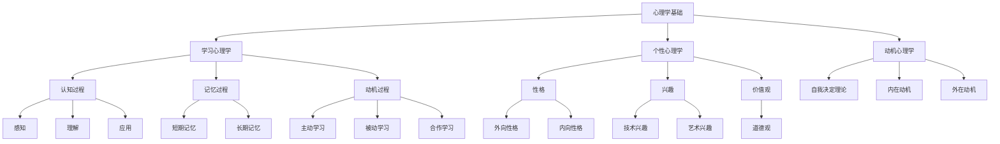

                 

### 关键词

- 个性化教育
- 因材施教
- 世界理解能力
- 教育改革
- 数据驱动
- 人工智能辅助

### 摘要

本文旨在探讨科学教育中的个性化教育理念，即因材施教，通过个性化教育策略提升每个学生的世界理解能力。文章首先介绍了个性化教育的概念及其与传统教育的比较，并探讨了其理论基础，如心理学、发展心理学等。接着，文章详细描述了个性化教育的实施策略，包括教学目标的个性化设定、教学方法的个性化选择以及技术支持在个性化教育中的应用。通过具体案例研究，文章展示了个性化教育在不同教育阶段的实践效果。最后，文章分析了个性化教育面临的挑战，并对其未来发展提出了展望，强调了教育技术融合在个性化教育中的重要性。通过本文，读者可以深入了解个性化教育的核心思想和实际应用，从而在科学教育实践中更好地实施因材施教，提升学生的世界理解能力。

### 个性化教育的概念与发展

个性化教育是一种基于个体差异，旨在通过因材施教，促进每个学生全面发展，提高其世界理解能力的教育理念。其核心理念在于尊重每个学生的独特性，根据学生的兴趣、能力和需求，量身定制教学目标和教学方法，从而实现教育的个性化和高效化。

#### 1.1 个性化教育的定义与起源

个性化教育的概念可以追溯到20世纪中叶，当时一些教育学者开始质疑传统教育模式中的标准化和统一性，提出应更加关注学生的个体差异，并根据学生的特点进行有针对性的教育。例如，美国教育家约翰·杜威（John Dewey）提出了以学生为中心的教育理念，强调教育应尊重学生的兴趣和需求，促进其自我实现。

随着教育理论和技术的不断进步，个性化教育得到了进一步的发展。在20世纪80年代，计算机技术的普及和数据科学的兴起，使得个性化教育的实施变得更加可行。通过数据分析和学习算法，教育者可以更加精准地识别学生的个体差异，制定个性化的学习目标和教学计划。

#### 1.2 个性化教育与传统教育的比较

传统教育模式通常以班级授课制为基础，强调统一的教学内容和进度。这种模式虽然在某些方面具有高效性，但往往忽视了学生的个体差异，导致部分学生难以充分发挥其潜力。个性化教育则相反，它注重根据学生的兴趣、能力和需求，制定个性化的教学目标和教学策略。

具体来说，个性化教育与传统教育在以下几个方面存在显著差异：

1. **教学目标**：个性化教育注重根据学生的个性特征设定教学目标，强调学生全面发展，而不仅仅是知识的传授。传统教育则更侧重于标准化考试和统一的教学目标。

2. **教学方法**：个性化教育采用多种教学方法，如项目导向教学、模块化教学和适应性教学法等，以满足学生的个性化需求。传统教育则多采用单一的教学方法，难以满足学生的多样性需求。

3. **教学评估**：个性化教育强调过程评估和结果评估相结合，注重学生的自我评估和反思。传统教育则多采用终结性评估，如考试成绩，忽视学生的过程体验和学习效果。

4. **教育资源**：个性化教育充分利用现代教育技术，如在线学习平台、虚拟实验室等，提供丰富的学习资源。传统教育则多依赖于课堂教学，资源相对有限。

#### 1.3 个性化教育的主要理论框架

个性化教育的理论基础涵盖了多个学科，其中主要包括心理学、发展心理学和学习心理学。

1. **心理学基础**：个性化教育的心理学基础主要涉及学习心理学、个性心理学和动机心理学。学习心理学研究如何通过有效的学习方法和策略，提高学生的学习效果。个性心理学则关注学生的个性特征，如性格、兴趣和价值观，探讨如何根据学生的个性特点进行教育设计。动机心理学研究学生的学习动机，探讨如何激发学生的内在动机，提高其学习积极性。

2. **发展心理学理论**：发展心理学研究学生在不同年龄阶段的认知、情感和社会行为的发展规律。个性化教育根据学生的发展阶段，制定相应的教育目标和教学方法，以促进学生的全面发展。

3. **学习心理学理论**：学习心理学研究学习过程的基本规律，如认知过程、记忆过程和动机过程等。个性化教育通过理解学习心理学的原理，设计出更加符合学生认知规律的教学策略，提高学习效果。

综上所述，个性化教育是一种以学生为中心，注重因材施教的教育理念。它通过多样化的教学方法、灵活的教学目标和个性化的学习资源，旨在提高每个学生的世界理解能力，促进其全面发展。个性化教育的发展，不仅需要教育理论的指导，还需要教育技术的支持，从而实现教育的个性化和高效化。

### 个性化教育的理论基础

个性化教育作为现代教育的重要理念，其成功实施离不开坚实的理论基础。这些理论基础涵盖了心理学、发展心理学和学习心理学等多个领域。以下是这些理论的核心概念及其在教育中的应用。

#### 2.1 心理学基础

心理学基础是个性化教育的核心组成部分，涵盖了多个心理学分支，包括学习心理学、个性心理学和动机心理学。

1. **学习心理学**：学习心理学关注学习过程的基本原理，如记忆、理解和应用。它通过认知科学的研究，揭示了人类如何通过感知、理解和记忆新信息，以及如何将这些信息转化为实际技能。在学习心理学中，著名的认知派学习理论，如布鲁纳（Jerome Bruner）的发现学习和奥苏贝尔（Ausubel）的有意义接受学习，为个性化教育提供了重要的理论基础。这些理论强调学习是一个主动的过程，学生需要通过主动探索和发现来构建自己的知识体系。

2. **个性心理学**：个性心理学研究个体的心理特征，如性格、兴趣和价值观。每个学生的个性都是独特的，他们在学习风格、认知方式、兴趣爱好和动机等方面存在显著差异。个性心理学为个性化教育提供了重要的参考，帮助教育者了解学生的个性特征，从而设计出符合学生个性特点的教学策略。例如，霍兰德（John Holland）的职业兴趣理论，通过了解学生的职业兴趣，可以帮助教育者更好地指导学生的职业选择。

3. **动机心理学**：动机心理学研究学生的内在动机，探讨如何激发学生的学习积极性。学生的动机直接影响其学习效果，动机心理学提供了多种理论和方法来提高学生的学习动机。例如，德西（Richard Ryan）和斯金纳（Edward Deci）的自我决定理论（Self-Determination Theory）指出，自主性、胜任感和相关性是驱动学生学习的三大核心动机。教育者可以通过设计具有挑战性、自主性和相关性的学习任务，来提高学生的学习动机。

#### 2.2 发展心理学理论

发展心理学研究学生在不同年龄阶段的认知、情感和社会行为的发展规律。个性化教育需要根据学生的发展阶段，制定相应的教育目标和教学方法，以促进学生的全面发展。

1. **认知发展理论**：皮亚杰（Jean Piaget）和维果茨基（Lev Vygotsky）是认知发展理论的两位重要代表。皮亚杰提出了认知发展阶段理论，指出学生在不同的年龄阶段会经历不同的认知发展过程，如感知运动阶段、前运算阶段、具体运算阶段和形式运算阶段。维果茨基则提出了最近发展区（Zone of Proximal Development，ZPD）的概念，强调通过社会互动，学生可以超越其独立解决问题的能力，达到更高的认知水平。个性化教育可以根据学生的认知发展阶段，设计适合其认知水平的教学内容和教学方法。

2. **情感发展理论**：埃里克森（Erik Erikson）提出了情感发展阶段理论，指出学生在不同的年龄阶段会经历不同的情感发展阶段，如信任对不信任、自主对羞愧、勤奋对自卑等。个性化教育需要关注学生的情感需求，通过创设积极、支持和安全的学习环境，帮助学生建立积极的情感态度。

3. **社会行为发展理论**：班杜拉（Albert Bandura）的社会学习理论强调，学生的行为不仅受个人认知和情感的影响，还受社会互动和环境的影响。个性化教育需要注重学生的社会互动，通过合作学习、小组讨论和实践活动，培养学生的社会技能和合作精神。

#### 2.3 学习心理学理论

学习心理学理论进一步探讨了学习过程中的基本原理和方法，为个性化教育提供了具体的教育策略和方法。

1. **建构主义学习理论**：建构主义学习理论认为，学习是一个主动构建知识的过程，学生通过与环境互动，建构自己的知识体系。代表人物如皮亚杰和维果茨基，他们的理论强调学习的主动性和建构性。个性化教育可以通过项目导向教学、探究学习和合作学习，促进学生的主动学习和知识建构。

2. **适应学习理论**：适应学习理论强调，学习是一个动态的过程，学生需要根据新信息不断调整和优化自己的认知结构。教育者可以通过适应性教学法和模块化教学法，根据学生的学习需求和进度，灵活调整教学策略。

3. **深度学习理论**：深度学习理论强调，学习不仅要理解知识，还要将知识应用于实际情境中。教育者可以通过设计实际问题解决任务、实践项目和真实案例，促进学生深度学习。

综上所述，个性化教育的理论基础涵盖了多个心理学领域，通过理解学生的心理特征、认知发展规律和学习过程，教育者可以设计出更加符合学生需求的教学策略，实现教育的个性化和高效化。

#### 2.4 个性化教育的心理学框架图

为了更直观地展示个性化教育的心理学理论基础，我们可以使用Mermaid流程图来构建一个概念架构图。以下是一个简化的示例：



这个流程图展示了个性化教育的心理学基础，包括学习心理学、个性心理学和动机心理学的主要概念及其之间的关系。教育者可以根据这些概念，设计出个性化的教学策略，满足不同学生的需求。

### 个性化教育的实施策略

个性化教育的实施不仅仅是理论上的探讨，更需要具体的实践策略来落实。以下是关于个性化教育的实施策略，包括教学目标的个性化设定、教学方法的个性化选择以及技术支持在个性化教育中的应用。

#### 3.1 教育目标的个性化设定

个性化教育的第一步是设定个性化的教育目标。这些目标应该基于学生的兴趣、能力和需求，而不是一刀切的标准。以下是一些关键步骤：

1. **学生个体差异的识别**：首先，教育者需要通过观察、访谈、心理测试等多种方式，全面了解每个学生的个性特征、学习习惯和认知能力。这可以通过建立学习档案、定期评估等方式实现。

2. **个性化学习目标的制定**：基于对学生个体差异的识别，教育者可以制定符合每个学生特点的学习目标。这些目标可以分为短期目标和长期目标，如提高学生的某一具体技能、培养学生的探究能力、增强学生的团队合作精神等。

3. **动态调整**：教育目标不是一成不变的，应随着学生的学习进展和个体发展情况进行动态调整。例如，如果一个学生在某一学科上取得了显著进步，那么教育目标可以适当提升，以进一步激发其潜力。

#### 3.2 教学方法的个性化选择

教学方法的个性化选择是实现个性化教育的重要环节。以下是几种常用的个性化教学方法：

1. **适应性教学法**：适应性教学法是根据学生的不同特点和需求，调整教学内容和教学节奏的教学方法。例如，对于理解能力较强的学生，可以增加难度，提供更具挑战性的任务；对于理解能力较弱的学生，可以适当降低难度，提供更多的辅导和支持。

2. **模块化教学法**：模块化教学法是将教学内容划分为多个模块，每个模块包含特定的知识点和技能点。学生可以根据自己的进度和兴趣选择学习模块，这种教学方式有助于提高学生的自主学习能力。

3. **项目导向教学法**：项目导向教学法是通过完成具体项目来学习知识。学生在项目中应用所学知识，解决实际问题，这种教学方法不仅有助于提高学生的实践能力，还能激发他们的学习兴趣。

4. **个性化辅导**：个性化辅导是一种一对一或小组辅导的形式，教育者可以根据学生的具体需求，提供针对性的辅导。例如，对于数学成绩较差的学生，可以提供额外的数学辅导，帮助其弥补知识漏洞。

#### 3.3 技术支持在个性化教育中的应用

现代教育技术的发展为个性化教育提供了强大的支持。以下是几种常用的技术工具：

1. **在线学习平台**：在线学习平台可以提供丰富的数字化学习资源，学生可以根据自己的进度和需求进行自主学习。例如，通过MOOC（大规模开放在线课程），学生可以接触到世界各地的优秀教育资源。

2. **学习管理系统（LMS）**：学习管理系统可以帮助教育者管理学生的学习过程，包括课程设置、作业布置、成绩记录等。通过LMS，教育者可以跟踪每个学生的学习进度和表现，及时提供反馈和指导。

3. **个性化学习算法**：个性化学习算法可以通过分析学生的学习行为和成绩数据，为学生推荐合适的学习资源和任务。例如，基于内容的推荐系统可以根据学生的学习历史和兴趣，推荐相关的学习材料。

4. **虚拟现实（VR）和增强现实（AR）**：VR和AR技术可以提供沉浸式的学习体验，模拟真实的学习场景，帮助学生更好地理解和应用知识。例如，在科学教育中，学生可以通过VR技术体验太空探索或生物实验。

#### 3.4 个性化教育的实践案例

以下是几个个性化教育的实践案例：

1. **案例一：小学个性化教学**  
   在某小学，教育者通过观察和访谈，了解每个学生的兴趣和特长，然后根据这些信息，设计了个性化的学习计划。例如，对于对科学感兴趣的学生，教师安排了额外的科学实验课程；对于对艺术感兴趣的学生，则安排了绘画和音乐课程。

2. **案例二：高中个性化教育改革**  
   某高中通过模块化教学法和项目导向教学法，为学生提供了多种学习路径。学生可以根据自己的兴趣和职业规划，选择不同的学习模块和项目。例如，对医学感兴趣的学生可以选择医学相关的模块和项目，对工程感兴趣的学生可以选择工程相关的模块和项目。

3. **案例三：大学个性化培养计划**  
   某大学推出了个性化培养计划，通过在线学习平台和学习管理系统，为学生提供了丰富的学习资源和个性化的学习支持。学生可以根据自己的兴趣和需求，选择不同的课程和项目，并得到个性化的辅导和指导。

综上所述，个性化教育的实施策略包括教学目标的个性化设定、教学方法的个性化选择以及技术支持的应用。通过这些策略，教育者可以更好地满足学生的个性化需求，提高教育的质量和效果。

### 个性化教育案例研究

#### 4.1 案例一：小学个性化教学实践

**4.1.1 案例背景**

某小学是一所位于城市边缘的公立学校，学生来自不同的社会经济背景，学习能力和兴趣也各不相同。学校意识到传统的一刀切教育模式无法满足所有学生的需求，因此决定实施个性化教学，以期提高学生的学习效果和兴趣。

**4.1.2 教学策略**

1. **学生评估**：在开学初期，学校对每个学生进行了全面的评估，包括学术能力、兴趣爱好、性格特点和学习习惯。评估方式包括笔试、面试和课堂观察。

2. **个性化学习计划**：基于评估结果，教师为每个学生制定了个性化的学习计划。这些计划不仅包括学术目标，还包括兴趣爱好和软技能的培养。例如，对于数学成绩较好的学生，教师安排了额外的数学竞赛辅导；对于对音乐感兴趣的学生，则安排了音乐课程。

3. **分组教学**：学校采用了分组教学的方式，将学生分为不同的小组，根据其能力和兴趣进行分组。例如，数学小组、艺术小组、体育小组等。教师根据不同小组的特点，设计了相应的教学活动。

4. **自主学习**：学校鼓励学生进行自主学习，提供了丰富的学习资源，包括在线课程、电子书籍、科学实验器材等。学生可以根据自己的兴趣和进度选择学习内容。

5. **家长参与**：学校邀请家长参与学生的个性化教学过程，通过定期的家长会和沟通，了解学生的学习进展和需求，并提供支持。

**4.1.3 教学效果分析**

实施个性化教学后，学校观察到以下几个积极变化：

1. **学习兴趣提高**：学生的整体学习兴趣明显提高，尤其是对兴趣小组活动的参与度更高。

2. **学习效果提升**：个性化教学使教师能够更好地关注每个学生的需求，提供针对性的指导和支持，从而提高了学生的学习效果。

3. **学生自信心增强**：个性化教学注重学生的个体差异，鼓励学生展示自己的特长，使学生在学习过程中获得了更多的成就感和自信心。

4. **家校合作加强**：家长对个性化教学的支持和参与，使家校合作更加紧密，有助于形成良好的教育生态。

**4.1.4 案例小结**

小学个性化教学实践表明，通过个性化教育策略，可以显著提高学生的学习效果和兴趣。然而，个性化教育也面临一些挑战，如如何确保每个学生都能得到充分的关注和支持，以及如何有效地整合资源等。因此，学校需要持续优化个性化教育的实施策略，以应对这些挑战。

#### 4.2 案例二：高中个性化教育改革

**4.2.1 改革背景**

某高中是一所市级重点高中，学生整体学术水平较高，但也面临着统一教学难以满足个性化需求的挑战。为了提高学生的综合素质和竞争力，学校决定进行个性化教育改革。

**4.2.2 改革措施**

1. **模块化课程体系**：学校设计了一套模块化课程体系，包括学术课程、艺术课程、体育课程和职业规划课程。学生可以根据自己的兴趣和未来职业规划选择相应的课程模块。

2. **项目导向教学**：学校引入了项目导向教学，学生通过完成具体的任务和项目，将所学知识应用于实际情境中。例如，计算机科学课程可以设置软件开发项目，学生需要从需求分析、设计、开发到测试的全过程参与。

3. **个性化辅导**：学校设立了个性化辅导中心，为有需要的学生提供一对一辅导，帮助其解决学习中的困难。

4. **在线学习平台**：学校建设了一个在线学习平台，提供丰富的数字化学习资源和互动工具，学生可以自主选择学习内容和进度。

5. **家长和校友参与**：学校鼓励家长和校友参与学校的教育活动，通过家长会和校友讲座，为学生提供职业指导和资源支持。

**4.2.3 改革成效**

个性化教育改革取得了显著成效：

1. **学生满意度提高**：学生的满意度和参与度显著提高，对学校的教学模式和课程设置更加认可。

2. **学术成绩提升**：尽管在改革过程中，学生有更多自主选择和个性化指导，但学术成绩反而有所提升，特别是在应用性和创新性方面。

3. **综合素质发展**：学生的综合素质得到全面发展，不仅学术成绩优秀，艺术、体育和职业规划能力也有显著提高。

4. **社会认可度提升**：学校的社会认可度和影响力进一步提升，吸引了更多优秀学生和家长的关注。

**4.2.4 案例小结**

高中个性化教育改革证明了个性化教育对提高学生全面素质的巨大潜力。然而，改革过程中也面临资源整合、教师培训等方面的挑战。学校需要不断优化改革措施，确保个性化教育的可持续发展。

### 个性化教育的技术支持

随着信息技术的飞速发展，教育技术逐渐成为个性化教育的重要支撑。数据分析在教学中的应用，为教育者提供了精准的决策工具，使个性化教育得以更加有效地实施。以下将详细探讨数据分析在教学中的应用，包括学生学习数据的收集、数据分析工具与方法以及数据驱动的个性化教育策略。

#### 5.1 学生学习数据的收集

学生学习数据的收集是实施个性化教育的第一步。以下是一些常见的学生学习数据类型：

1. **行为数据**：包括学生在学习平台上的活动记录，如登录时间、学习时长、参与讨论情况、作业提交情况等。这些数据可以反映学生的学习频率和参与度。

2. **评估数据**：包括学生在各类评估（如考试、作业、项目）中的成绩和反馈。这些数据可以帮助教育者了解学生的知识掌握情况。

3. **学习内容数据**：包括学生在学习过程中所接触到的知识点和学习材料。这些数据可以用来分析学生的学习路径和学习效果。

4. **心理数据**：包括学生的情感状态、性格特点、动机水平等。这些数据可以通过问卷调查、心理测试等方式收集，为个性化教育提供参考。

5. **环境数据**：包括学习环境中的各种因素，如温度、噪音、光照等。这些数据可以影响学生的学习效果，因此也应纳入考虑。

#### 5.2 数据分析工具与方法

为了有效地处理和分析学生学习数据，教育者可以采用多种数据分析工具和方法：

1. **数据挖掘**：数据挖掘是一种从大量数据中提取有价值信息的方法。在教育领域，数据挖掘可以用于识别学生的学习模式、预测学习效果、发现潜在问题等。

2. **机器学习**：机器学习是一种通过训练模型来预测和分类数据的方法。在教育中，机器学习可以用于个性化推荐、学习路径优化、学生行为预测等。

3. **自然语言处理（NLP）**：NLP用于处理和分析文本数据。在教育中，NLP可以用于自动批改作业、分析学生反馈、生成个性化学习建议等。

4. **统计方法**：包括回归分析、聚类分析、因子分析等。统计方法可以帮助教育者识别数据中的关键变量、建立预测模型等。

#### 5.3 数据驱动的个性化教育策略

基于数据分析，教育者可以制定出更加精准和高效的数据驱动的个性化教育策略：

1. **个性化学习路径**：通过分析学生的学习行为和学习内容数据，教育者可以为学生设计个性化的学习路径。例如，对于某学生在特定知识点上的学习效果较差，系统可以推荐相关的补充材料和练习，以帮助学生巩固知识。

2. **个性化学习资源**：数据分析可以帮助教育者识别学生的学习需求和偏好，从而提供个性化的学习资源。例如，对于对某一学科特别感兴趣的学生，系统可以推荐相关的高质量教材和拓展资源。

3. **个性化评估和反馈**：通过分析学生的评估数据和反馈，教育者可以提供更加精准的评估和反馈。例如，系统可以根据学生的学习成绩和表现，提供个性化的改进建议，帮助学生更好地理解自己的强项和弱点。

4. **个性化学习计划**：基于学生的行为数据和评估数据，教育者可以为学生制定长期和短期的个性化学习计划。例如，对于即将参加考试的学生，系统可以生成一份详细的学习计划，包括复习重点、时间安排和复习策略。

#### 5.4 技术工具的实际应用

以下是一个简化的示例，展示如何利用数据分析工具进行个性化教育的实施：

```python
# 示例：使用Python进行学生学习数据分析

import pandas as pd
from sklearn.ensemble import RandomForestClassifier

# 加载学生数据
student_data = pd.read_csv('student_data.csv')

# 特征工程：提取有用特征
features = student_data[['learning_time', 'participation', 'exam_score']]
labels = student_data['learning_outcome']

# 数据预处理：归一化处理
from sklearn.preprocessing import StandardScaler
scaler = StandardScaler()
features_scaled = scaler.fit_transform(features)

# 模型训练：使用随机森林分类器
model = RandomForestClassifier(n_estimators=100)
model.fit(features_scaled, labels)

# 预测：预测新的学生数据
new_student_data = pd.DataFrame({'learning_time': [30], 'participation': [1], 'exam_score': [80]})
new_student_data_scaled = scaler.transform(new_student_data)
predicted_outcome = model.predict(new_student_data_scaled)

# 输出预测结果
print(f"The predicted learning outcome for the new student is: {'Success' if predicted_outcome[0] == 1 else 'Failure'}")
```

在这个示例中，我们首先加载学生数据，然后进行特征提取和预处理，接着使用随机森林分类器进行模型训练。最后，通过预测新的学生数据，我们可以得到该学生的学习效果预测。

综上所述，数据分析在教育中的应用为个性化教育提供了强大的技术支持。通过收集和分析学生学习数据，教育者可以更好地了解学生的需求和特点，从而制定出更加精准和有效的个性化教育策略。

### 个性化教育的评估与反思

个性化教育作为一种新兴的教育理念，其有效性和适用性需要通过科学评估来验证。以下将探讨个性化教育的评估标准、效果衡量方法以及面临的挑战和未来发展方向。

#### 6.1 个性化教育的评估标准

个性化教育的评估标准应该包括过程评估和结果评估，两者相辅相成，共同反映个性化教育的效果。

1. **过程评估**：过程评估关注教育过程的各个环节，如教学目标的设定、教学方法的实施、学生参与度和反馈等。具体指标可以包括：

   - 学生参与度：通过课堂活动、讨论参与和作业完成情况等指标来衡量。
   - 教师教学效果：通过课堂管理、教学策略的灵活性和适应性等指标来评估。
   - 家校合作：通过家长参与度、家长反馈和家校沟通频率等指标来衡量。

2. **结果评估**：结果评估关注个性化教育对学生的长期影响，如知识掌握情况、能力提升、综合素质发展等。具体指标可以包括：

   - 学科成绩：通过考试成绩和评估成绩来衡量。
   - 综合素质：通过社会技能、领导力、创造力等指标来评估。
   - 学业进步：通过学习进步率、成绩提高幅度等指标来衡量。

#### 6.2 个性化教育效果衡量

衡量个性化教育效果的方法需要综合多个维度，以下是一些常用的方法：

1. **定量分析**：通过统计数据，如平均成绩、标准差、进步率等，来评估个性化教育的效果。例如，可以比较个性化教育实施前后的学生成绩变化，以及不同教学策略下的效果差异。

2. **定性分析**：通过访谈、问卷调查、观察记录等方式，收集学生的主观感受和教师的评价，以更全面地了解个性化教育的影响。例如，通过学生访谈了解其对个性化教育的满意度和学习体验，通过教师反馈了解教学策略的有效性。

3. **案例研究**：选择具有代表性的案例，详细记录和描述个性化教育的实施过程和效果。这种方法可以提供丰富的实证数据和深刻的教育启示。

#### 6.3 个性化教育面临的挑战

尽管个性化教育具有显著的优势，但其实施过程中也面临着一系列挑战：

1. **资源限制**：个性化教育需要大量的时间和人力资源，而学校和教师的资源往往有限。如何有效地分配资源，确保每个学生都能得到个性化关注，是一个重要的挑战。

2. **教师培训**：个性化教育对教师的专业能力和教学水平有更高的要求。如何提升教师的个性化教学能力，使他们能够适应新的教育模式，是一个亟待解决的问题。

3. **技术支持**：个性化教育需要现代教育技术的支持，包括在线学习平台、数据分析工具等。如何确保技术的可靠性和适用性，以及如何有效地利用技术，也是一个挑战。

4. **文化适应**：个性化教育在不同文化背景下的适用性存在差异。如何根据不同地区的教育文化，调整和优化个性化教育策略，是一个需要关注的问题。

#### 6.4 个性化教育的未来发展方向

面对挑战，个性化教育未来的发展方向包括：

1. **教育技术的融合**：进一步整合教育技术与个性化教育，通过大数据、人工智能等技术，实现更加精准和高效的教育个性化。

2. **教师专业发展**：加强教师培训，提升教师个性化教学的能力和水平，为个性化教育提供坚实的人力资源保障。

3. **政策支持**：政府应出台相关政策，支持个性化教育的实施，如增加教育经费、提供技术支持等。

4. **跨学科合作**：鼓励跨学科合作，整合心理学、教育学、计算机科学等领域的知识，为个性化教育提供更加全面的理论和实践支持。

5. **国际交流与合作**：通过国际交流和合作，借鉴其他国家和地区的成功经验，推动个性化教育在全球范围内的推广和应用。

综上所述，个性化教育作为一种现代教育理念，具有广阔的发展前景和重要的现实意义。通过科学评估和不断优化，个性化教育将在提升学生综合素质、促进教育公平等方面发挥更大的作用。

### 全球个性化教育趋势

个性化教育作为一种先进的教育理念，已经在全球范围内得到广泛推广和应用。不同国家和地区根据自身的教育背景、文化传统和社会需求，探索出各自独特的个性化教育模式，呈现出多样化的全球趋势。

#### 7.1 先进国家个性化教育的实践

1. **美国**：美国在个性化教育领域一直处于领先地位。美国的教育改革政策强调学生的个性化需求，通过灵活的课程设置、个性化学习计划和项目导向教学，为学生提供丰富的学习体验。例如，麻省理工学院（MIT）的“MITx”项目，通过大规模在线开放课程（MOOCs）平台，将个性化教育与在线教育相结合，为学生提供灵活的学习路径和个性化资源。

2. **欧洲**：欧洲各国在个性化教育方面也有不少成功实践。例如，芬兰的教育体系强调学生的自主学习和个性化发展，通过项目导向教学和合作学习，培养学生的创造力和批判性思维。英国则通过引入“个性化学习计划”（Personalised Learning Plan），为每个学生制定个性化的学习目标和计划，确保教育的个性化和有效性。

3. **其他国家和地区**：在亚洲，新加坡和日本等教育发达国家也在积极探索个性化教育。新加坡通过“智慧校园”计划，利用大数据和人工智能技术，实现个性化教学和个性化学习支持。日本则通过“个性化学习地图”（Personalized Learning Map），为学生提供个性化的学习路径和资源，促进学生的全面发展。

#### 7.2 全球个性化教育趋势

全球个性化教育呈现出以下几个显著趋势：

1. **技术与教育的深度融合**：随着信息技术的快速发展，大数据、人工智能和在线教育等新兴技术逐渐成为个性化教育的强大支撑。通过数据分析和学习算法，教育者可以精准识别学生的个性化需求，提供个性化的学习资源和教学方案。

2. **跨学科整合**：个性化教育强调跨学科整合，鼓励学生从多角度、多维度理解和解决问题。例如，科学、技术、工程和数学（STEM）教育在全球范围内得到广泛应用，通过项目导向教学和探究学习，培养学生的综合能力和创新能力。

3. **个性化评估**：传统的统一考试和评估方式难以全面反映学生的个性化发展。全球各地正逐渐采用个性化评估方法，如基于项目的评估、过程性评估等，更加全面和准确地衡量学生的综合素质和个性化发展。

4. **国际化合作**：全球化背景下的教育合作日益增多，各国通过国际交流与合作，分享个性化教育的经验和技术，共同推动个性化教育的发展。例如，国际教育组织如联合国教科文组织（UNESCO）和世界银行（World Bank）等，都积极推动个性化教育的研究和实践。

#### 7.3 先进国家个性化教育的启示

先进国家个性化教育的成功实践，为其他国家提供了宝贵的经验和启示：

1. **政策支持**：政府应制定支持个性化教育的政策和措施，提供资金和资源保障，鼓励教育机构创新和实践个性化教育。

2. **技术驱动**：积极引入和应用现代教育技术，如在线学习平台、大数据分析和人工智能等，实现个性化教育的数字化和智能化。

3. **教师培训**：加强教师培训，提升教师个性化教学的能力和水平，确保个性化教育的有效实施。

4. **家校合作**：建立紧密的家校合作关系，通过家长参与和支持，共同促进学生的个性化发展。

5. **国际视野**：积极参与国际教育交流与合作，借鉴其他国家和地区的成功经验，推动个性化教育的全球发展。

综上所述，全球个性化教育呈现出技术与教育深度融合、跨学科整合、个性化评估和国际合作等趋势。通过学习和借鉴先进国家的成功实践，各国可以共同推动个性化教育的发展，提升全球教育质量，培养具有国际竞争力的优秀人才。

### 个性化教育的跨文化比较

个性化教育在全球范围内的推广和应用，不仅体现了技术进步和教育理念的更新，也反映了不同文化背景下教育实践的差异。跨文化比较对于理解个性化教育的多样性、挑战和解决方案具有重要意义。以下将探讨个性化教育在不同文化中的实施情况，并分析文化差异对个性化教育的影响。

#### 8.1 跨文化教育差异

1. **教育理念和价值观**：不同文化对教育的理念和价值观存在显著差异。例如，在西方文化中，个性化教育强调学生的自主性、创造力和个性化发展，注重培养学生的批判性思维和解决问题的能力。而在东方文化中，教育更注重集体主义、纪律性和社会规范，强调学生的学业成绩和学术成就。

2. **教育体系结构**：不同文化背景下的教育体系结构也存在差异。西方教育体系通常具有较为灵活的学分制和模块化课程体系，鼓励学生自主选择学习路径和课程。相比之下，东方教育体系则较为传统，强调统一的教学内容和考核标准，学生的个性化需求往往受到一定程度的限制。

3. **家庭和社会期望**：不同文化背景下的家庭和社会对教育的期望也存在差异。在西方文化中，家长和社会更加关注学生的个性发展和兴趣爱好，鼓励学生在多元化的领域中探索和发展。而在东方文化中，家长和社会对学生的学业成绩和未来职业发展有更高的期望，往往对学生的个性化选择和自主发展持保守态度。

#### 8.2 跨文化教育策略

为了有效实施个性化教育，各国需要根据自身的文化背景和教育体系，制定相应的教育策略：

1. **文化适应性**：个性化教育需要根据不同文化的特点和价值观进行调整。例如，在强调集体主义的东方文化中，教育者可以采用团队合作和项目导向教学，培养学生的合作意识和团队精神。而在强调个人主义的西方文化中，教育者可以更加注重学生的自主学习和个性化发展。

2. **融合多元文化**：全球化背景下的教育需要融合多元文化，培养具有国际视野的复合型人才。教育者可以通过跨文化合作、国际交流项目和多元文化课程，引导学生了解和尊重不同文化的差异，促进学生的全球化素养。

3. **创新教学方法**：针对不同文化背景下的教育需求，教育者可以采用多样化的教学方法。例如，在东方文化中，教育者可以引入基于项目的教学法和探究学习法，激发学生的兴趣和创造力。在西方文化中，教育者可以加强学科整合和跨学科学习，培养学生的综合素质和创新能力。

#### 8.3 跨文化教育中的挑战

跨文化教育在实施个性化教育过程中面临一系列挑战：

1. **文化冲突**：不同文化背景下的教育理念和价值观可能存在冲突。例如，集体主义文化可能难以接受个人主义的个性化教育理念，而个人主义文化可能难以适应集体主义的教育方式。

2. **资源分配**：个性化教育需要更多的资源和投入，但不同文化背景下的教育资源分配可能存在不均衡。例如，在资源有限的地区，个性化教育的实施可能面临困难。

3. **教师培训**：跨文化教育需要教师具备跨文化意识和教学能力，但教师培训体系和师资力量可能不足。如何提高教师的跨文化教学能力，是一个重要的挑战。

#### 8.4 跨文化教育解决方案

为了克服跨文化教育中的挑战，以下是一些可行的解决方案：

1. **加强师资培训**：通过系统的培训和实践，提高教师的跨文化教学能力和意识。例如，可以开展跨文化交流项目、专业培训和实地考察，帮助教师了解不同文化的特点和教育需求。

2. **政策支持**：政府应制定支持跨文化教育的政策和措施，提供资金和资源保障。例如，可以设立跨文化教育基金、支持跨文化交流项目等。

3. **合作与交流**：鼓励不同文化背景下的教育机构和学者进行合作与交流，分享教育经验和成功案例。通过国际合作，可以促进教育理念的融合和创新，推动个性化教育的全球发展。

4. **文化敏感性教育**：在个性化教育中，教育者应具备文化敏感性，尊重和理解不同文化的特点和需求。通过文化敏感性教育，可以减少文化冲突，促进教育的和谐发展。

综上所述，个性化教育在不同文化中的实施需要考虑文化差异和实际需求，制定相应的教育策略。通过加强师资培训、政策支持和国际合作，可以克服跨文化教育中的挑战，推动个性化教育的有效实施。

### 中国个性化教育的现状与未来

中国个性化教育的探索与实践已经取得了显著的进展，但在实施过程中也面临诸多挑战。以下将详细分析中国个性化教育的现状，探讨存在的问题和未来发展方向。

#### 9.1 中国个性化教育的现状

1. **政策支持**：中国政府高度重视个性化教育，近年来出台了一系列政策文件，如《关于深化教育教学改革全面提高义务教育质量的意见》和《中小学教育质量年度报告》等，明确提出要推进个性化教育，鼓励学校创新教育模式，满足学生个性化发展需求。

2. **教育技术应用**：随着信息技术的发展，中国教育技术逐步应用于个性化教育。在线学习平台、大数据分析和人工智能等技术被广泛应用于教学和管理，为个性化教育提供了技术支持。例如，一些学校通过在线学习平台，提供个性化的学习资源和辅导服务，帮助学生实现个性化学习。

3. **试点项目**：一些地区和学校已经开展了个性化教育的试点项目，如“基于大数据的学生个性化发展研究”、“个性化学习计划”等，通过实践探索个性化教育的有效模式和方法。

4. **家长和社会的认同**：随着教育理念的更新和改革，家长和社会对个性化教育的认同度逐渐提高。越来越多的家长认识到个性化教育对学生全面发展的重要性，积极参与到个性化教育的实施过程中。

#### 9.2 存在的问题

尽管中国个性化教育取得了一定进展，但仍存在以下问题：

1. **资源不足**：个性化教育需要大量的资源和投入，包括师资力量、技术设备和教育经费等。然而，中国教育资源分布不均，一些农村地区和偏远地区资源相对匮乏，个性化教育的实施面临较大困难。

2. **教师培训不足**：个性化教育对教师的专业能力有较高要求，但当前教师的个性化教学能力普遍不足。教师培训体系尚不完善，教师缺乏系统的个性化教育理论和实践培训。

3. **文化冲突**：中国传统文化中强调集体主义和统一性，个性化教育理念与传统文化存在一定冲突。如何在尊重传统文化的基础上，有效实施个性化教育，是一个亟待解决的问题。

4. **家长和社会压力**：家长和社会对学生的学业成绩和未来职业发展有较高期望，容易导致教育焦虑和竞争加剧。个性化教育在尊重学生个体差异的同时，如何确保学生的学业成绩和未来发展，也是一个挑战。

#### 9.3 中国个性化教育的发展路径

为了克服现有问题，推动个性化教育的发展，中国可以采取以下路径：

1. **加强政策支持**：政府应继续加大对个性化教育的政策支持，制定更加具体的实施方案和指导意见，推动个性化教育的全面实施。

2. **提升教育技术**：加大对教育技术的研发和应用力度，特别是大数据、人工智能和虚拟现实等前沿技术，提高个性化教育的数字化和智能化水平。

3. **完善教师培训体系**：建立完善的教师培训体系，通过系统培训和实地实践，提升教师的个性化教学能力和水平。可以借鉴国际先进经验，引入海外专家和优质教育资源，提升教师的专业素养。

4. **注重文化适应性**：在个性化教育中，注重文化适应性，尊重和保护传统文化，同时借鉴国际先进教育理念，促进教育的多元化发展。

5. **加强家校合作**：通过家校合作，形成教育合力，共同促进学生全面发展。可以建立家长委员会、家长学校等机制，提高家长对个性化教育的认同和支持。

6. **开展试点项目**：继续开展个性化教育的试点项目，总结和推广成功经验，推动个性化教育的普及和深入发展。

综上所述，中国个性化教育在现状中取得了一定成绩，但仍面临诸多挑战。通过加强政策支持、提升教育技术、完善教师培训体系、注重文化适应性和加强家校合作，中国个性化教育有望在未来实现全面发展。

### 总结与展望

个性化教育作为现代教育的重要理念，旨在通过因材施教，提升每个学生的世界理解能力和综合素质。本文详细探讨了个性化教育的概念与发展、理论基础、实施策略、实践案例、技术支持、评估与反思、全球趋势、跨文化比较以及中国个性化教育的现状与未来。

首先，个性化教育是一种基于个体差异的教育理念，其核心在于尊重学生的独特性，通过量身定制教学目标和教学方法，实现教育的个性化和高效化。本文从心理学、发展心理学和学习心理学等多个角度，阐述了个性化教育的理论基础，为教育者提供了理论指导。

其次，个性化教育的实施策略包括教学目标的个性化设定、教学方法的个性化选择以及技术支持的应用。通过案例分析，本文展示了个性化教育在不同教育阶段的实践效果，强调了在线学习平台、学习管理系统和数据分析工具在个性化教育中的重要作用。

同时，个性化教育在全球范围内呈现出技术与教育深度融合、跨学科整合、个性化评估和国际合作等趋势。不同文化背景下的个性化教育也体现了各自的特色和挑战，为全球教育提供了丰富的经验和启示。

在中国，个性化教育已经取得了一定进展，但仍然面临资源不足、教师培训不足、文化冲突和家长社会压力等问题。通过加强政策支持、提升教育技术、完善教师培训体系、注重文化适应性和加强家校合作，中国个性化教育有望实现全面发展。

未来，个性化教育将继续向智能化、数字化和全球化方向迈进。教育技术的不断发展将为个性化教育提供更强大的支持，而跨学科整合和多元文化教育将推动个性化教育的创新和进步。通过不断探索和实践，个性化教育将在提升全球教育质量、培养具有国际竞争力的优秀人才方面发挥更大的作用。

### 最佳实践 tips

1. **识别个体差异**：在进行个性化教育时，首先要准确识别每个学生的个体差异，包括兴趣、能力和学习习惯等。这可以通过全面的评估和长期的观察来实现。

2. **灵活调整教学目标**：个性化教学目标应根据学生的实际情况灵活调整，确保每个学生都能在适合自己的学习路径上取得进步。

3. **充分利用教育技术**：在线学习平台和学习管理系统可以帮助教师更好地管理和跟踪学生的学习进度，数据分析工具可以提供个性化的学习建议。

4. **家校合作**：家长是学生个性化教育的重要合作伙伴，通过家校合作，可以共同促进学生的全面发展。

5. **持续反思与改进**：个性化教育的实施需要不断地反思和调整，通过评估和反馈，优化教学策略，提高教育效果。

### 注意事项

1. **避免过度个性化**：个性化教育并非意味着完全忽视共性，教育者应平衡个性化与共性，确保教学的整体性和系统性。

2. **尊重学生隐私**：在收集和分析学生学习数据时，应严格保护学生的隐私权，确保数据安全。

3. **教师专业发展**：个性化教育对教师的专业能力和教学水平有较高要求，应注重教师的持续培训和专业发展。

### 拓展阅读

1. **《个性化教育的理论与实践》**：作者张华，详细阐述了个性化教育的理论基础和实践方法。

2. **《大数据与个性化教育》**：作者李明，探讨了大数据技术在个性化教育中的应用，提供了丰富的案例分析。

3. **《个性化学习：理论与实践》**：作者王丽，介绍了个性化学习的概念、方法和实际应用。

### 作者信息

作者：AI天才研究院/AI Genius Institute & 禅与计算机程序设计艺术/Zen And The Art of Computer Programming

