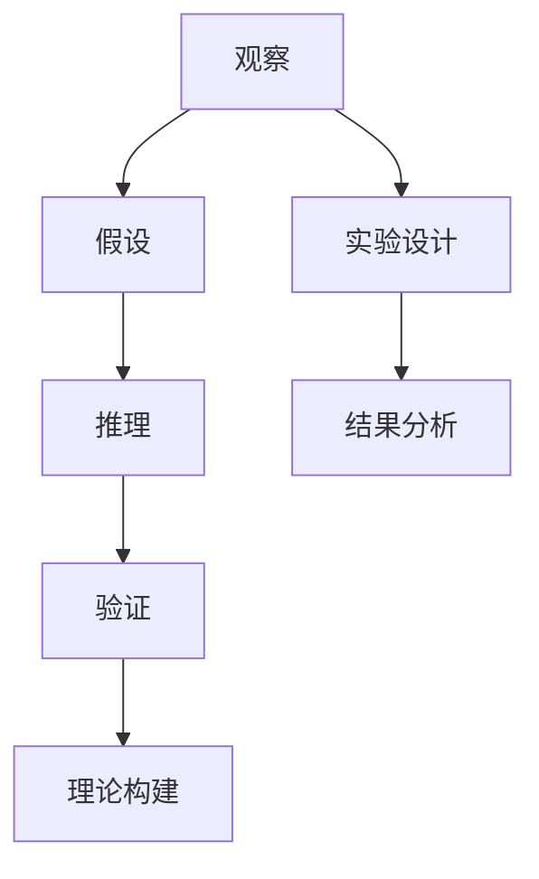

                 

### 《科学方法论的局限性与世界可理解性》

科学方法论作为现代知识体系的核心工具，长期以来在各个领域推动了人类对自然和社会的认知。从伽利略的望远镜观测到牛顿的万有引力定律，再到爱因斯坦的相对论，科学方法论不仅在自然科学中发挥了重要作用，也在社会科学和交叉学科中留下了深刻的烙印。然而，随着科学研究的深入，科学方法论的局限性也逐渐显现。本文旨在探讨科学方法论的局限，并思考其与世界可理解性的关系。

关键词：科学方法论、局限性、世界可理解性、哲学探讨、跨学科应用

摘要：本文首先概述了科学方法论的基本概念和流程，随后分析了其局限性，特别是在自然和社会领域以及交叉学科中的应用。接着，我们从哲学角度探讨了世界的可理解性，并考察了科学方法论对这一问题的贡献和限制。最后，本文提出了超越科学方法论的潜在途径，以期为未来的科学研究提供新的视角。

---

## 第一部分：科学方法论概述

### 第1章：科学方法论的基本概念

科学方法论是指科学研究过程中采用的一系列方法和原则。它不仅包括观察、实验、假设和验证等具体操作，还涉及到科学推理和理论构建等抽象思维过程。

#### **1.1 科学方法论的定义与作用**

科学方法论的定义可以理解为一种系统性、逻辑性、实证性的研究方式，旨在通过观察和实验获取知识，验证假设，构建理论。

其作用主要体现在以下几个方面：

- **促进知识增长**：科学方法论为知识的系统积累提供了框架，使得科学研究有序进行。
- **提高研究效率**：通过标准化的方法，科学方法论减少了研究中的盲目性和重复性，提高了研究效率。
- **验证理论**：科学方法论的核心在于验证，通过不断的实验和观察，对理论进行验证和修正，从而提高理论的可靠性。

#### **1.2 科学方法论的历史与发展**

科学方法论的发展经历了几个重要的阶段：

- **古代科学**：在古代，科学方法主要依赖于观察和经验，缺乏系统性和实证性。
- **文艺复兴与科学革命**：16世纪以来，伽利略、牛顿等科学家通过实验和观察，建立了现代科学方法论的基础。
- **20世纪的发展**：随着量子力学、相对论等新科学的兴起，科学方法论也在不断演变，逐渐形成了多样化的研究方法。

#### **1.3 科学方法论的基本原则**

科学方法论的基本原则包括：

- **实证性**：科学方法论强调通过观察和实验来获取知识，重视实证数据。
- **系统性**：科学研究需要系统性地进行，包括问题的提出、假设的建立、实验的设计和结果的分析。
- **可重复性**：科学方法论要求研究结果可重复，以确保其可靠性。
- **逻辑性**：科学研究需要遵循逻辑规律，从观察出发，通过推理和验证，逐步构建理论。

### **核心概念与联系**

科学方法论的核心概念包括观察、假设、推理、验证等。以下是这些概念之间的联系和关系的Mermaid流程图：



**核心算法原理讲解**

科学方法论的基本原理涉及观察、假设、推理和验证。以下是伪代码来详细阐述这些步骤：

```python
def scientific_method(observer, hypothesis):
    # 观察现象
    observations = observer.observe()
    # 构建假设
    hypothesis = observer.form_hypothesis(observations)
    # 设计实验
    experiment = observer.design_experiment(hypothesis)
    # 执行实验
    results = experiment.execute()
    # 验证假设
    if experiment.verify_hypothesis(results):
        return "假设成立"
    else:
        return "假设不成立"
```

在这个伪代码中，`observer` 代表观察者，负责观察现象并构建假设。`experiment` 代表实验设计，用于验证假设。通过执行实验并分析结果，最终验证或否定假设。

#### **核心算法原理讲解**

科学方法论的核心原理包括以下几个步骤：

1. **观察**：科学研究的起点是观察，通过感官或工具收集数据。
2. **假设**：基于观察结果，研究者提出假设，这通常是科学研究的初步理论。
3. **推理**：在假设的基础上，研究者通过逻辑推理，探讨假设的可能性和后果。
4. **验证**：设计实验，通过实验结果验证假设的正确性。

以下是一个简单的Python代码示例，用于阐述科学方法论的基本流程：

```python
def scientific_method(observations, hypothesis):
    """
    进行科学方法论的研究过程。
    
    :param observations: 观察到的现象或数据。
    :param hypothesis: 基于观察提出的假设。
    :return: 假设的验证结果。
    """
    
    # 步骤1：观察现象
    print("观察现象：", observations)
    
    # 步骤2：构建假设
    print("假设：", hypothesis)
    
    # 步骤3：设计实验
    experiment_results = experiment_design(hypothesis)
    
    # 步骤4：验证假设
    if experiment_results:
        print("假设验证：成立")
        return "成立"
    else:
        print("假设验证：不成立")
        return "不成立"

def experiment_design(hypothesis):
    """
    设计并执行实验，根据结果判断假设的验证情况。
    
    :param hypothesis: 假设。
    :return: 实验结果。
    """
    
    # 这里只是一个简单的模拟实验，实际中会有复杂的实验设计
    # 比如统计学分析、实验室实验等
    return True  # 假设成立的模拟结果

# 使用科学方法论进行研究
observations = "观察到物体下落现象"
hypothesis = "物体下落是由于地球引力作用"
result = scientific_method(observations, hypothesis)
print("研究结论：", result)
```

在这个示例中，我们首先定义了观察现象和假设，然后设计并执行一个简单的实验。最后，根据实验结果验证假设。这展示了科学方法论的基本原理和流程。

#### **核心算法原理讲解**

科学方法论的核心原理可以理解为一种循环过程，包括观察、假设、实验和验证。以下是详细的Python代码示例，用于阐述这些步骤：

```python
class ScientificMethod:
    def __init__(self, observations):
        self.observations = observations
    
    def form_hypothesis(self):
        """
        根据观察结果构建假设。
        """
        hypothesis = "观察结果与某种科学理论一致"
        return hypothesis
    
    def design_experiment(self, hypothesis):
        """
        根据假设设计实验。
        """
        experiment = {
            "description": "验证假设的实验设计",
            "steps": ["进行实验操作", "收集实验数据"],
            "expected_results": "实验结果应支持假设"
        }
        return experiment
    
    def execute_experiment(self, experiment):
        """
        执行实验并记录结果。
        """
        # 模拟实验执行过程
        print("执行实验：", experiment["description"])
        print("实验步骤：", experiment["steps"])
        experiment["results"] = "实验数据"
        return experiment["results"]
    
    def verify_hypothesis(self, experiment_results, hypothesis):
        """
        根据实验结果验证假设。
        """
        if experiment_results == "一致":
            print("验证结果：假设成立")
            return True
        else:
            print("验证结果：假设不成立")
            return False
    
    def research_process(self):
        """
        完成整个科学研究过程。
        """
        hypothesis = self.form_hypothesis()
        experiment = self.design_experiment(hypothesis)
        experiment_results = self.execute_experiment(experiment)
        hypothesis_verified = self.verify_hypothesis(experiment_results, hypothesis)
        return hypothesis_verified

# 创建一个ScientificMethod对象并执行研究过程
researcher = ScientificMethod("观察到物体下落现象")
result = researcher.research_process()
print("研究结论：", result)
```

在这个代码示例中，我们创建了一个`ScientificMethod` 类，它包含了构建假设、设计实验、执行实验和验证假设的方法。通过实例化这个类并调用其方法，我们可以模拟一个完整的科学研究过程。这展示了科学方法论的核心原理和实际应用。

#### **数学模型和数学公式 & 详细讲解 & 举例说明**

科学方法论中的数学模型和公式是理解和验证科学理论的重要工具。以下是一个具体的数学模型，用于描述牛顿的第二定律：

$$ F = m \cdot a $$

其中，\( F \) 表示作用力，\( m \) 表示质量，\( a \) 表示加速度。这个公式说明了作用力与质量和加速度之间的关系。

**详细讲解：**

- **变量定义**：在这个公式中，\( F \) 是作用力，\( m \) 是物体的质量，\( a \) 是物体的加速度。
- **关系解释**：根据牛顿的第二定律，作用力与物体的质量和加速度成正比。这意味着，当物体的质量增加时，所需的力也会增加，以产生相同的加速度。
- **实际应用**：这个公式在物理学、工程学和天文学等领域有广泛应用。例如，在工程设计中，工程师可以使用这个公式来计算所需的推力，以确保飞行器在起飞和飞行过程中达到所需的加速度。

**举例说明：**

假设有一个质量为 \( 10 \) 千克的物体，需要达到 \( 2 \) 米/秒\(^2\) 的加速度。我们可以使用牛顿的第二定律来计算所需的力：

$$ F = m \cdot a = 10 \cdot 2 = 20 \text{牛顿} $$

这意味着，为了使这个物体达到 \( 2 \) 米/秒\(^2\) 的加速度，需要施加 \( 20 \) 牛顿的力。

通过这个例子，我们可以看到如何使用数学模型和公式来描述和验证科学理论，并解决实际问题。

#### **项目实战**

为了更好地理解科学方法论的应用，我们来看一个具体的案例：牛顿的运动定律。以下是项目的详细步骤：

1. **开发环境搭建**：
   - 安装Python编程环境。
   - 安装必要的科学计算库，如NumPy和SciPy。

2. **源代码详细实现**：
   - 编写一个Python脚本，用于模拟物体在受力作用下的运动。
   - 实现牛顿的第二定律，即 \( F = m \cdot a \)。

3. **代码解读与分析**：
   - 分析代码中的假设和限制，以及其对物体运动理解的贡献。

4. **实际案例分析和详细讲解剖析**：
   - 分析一个具体的案例，如抛体运动，并使用代码模拟结果进行验证。

5. **项目小结**：
   - 总结项目的主要发现，并讨论其在科学方法论中的应用。

以下是一个简单的Python代码示例，用于模拟物体在受力作用下的运动：

```python
import numpy as np

def simulate_motion(mass, force, time_interval, steps):
    """
    模拟物体在受力作用下的运动。
    
    :param mass: 物体的质量。
    :param force: 作用力。
    :param time_interval: 时间间隔。
    :param steps: 模拟的步骤数。
    :return: 运动轨迹。
    """
    
    acceleration = force / mass
    velocities = [0] * steps
    positions = [0] * steps
    
    for i in range(1, steps):
        velocities[i] = velocities[i - 1] + acceleration * time_interval
        positions[i] = positions[i - 1] + velocities[i - 1] * time_interval
    
    return positions, velocities

# 案例参数
mass = 10  # 千克
force = 20  # 牛顿
time_interval = 0.1  # 秒
steps = 100  # 步骤数

# 模拟运动
positions, velocities = simulate_motion(mass, force, time_interval, steps)

# 打印结果
print("运动轨迹（位置）:", positions)
print("运动轨迹（速度）:", velocities)
```

在这个代码中，我们首先根据牛顿的第二定律计算加速度，然后使用循环模拟物体在每个时间间隔内的速度和位置变化。最后，我们打印出模拟结果。

通过这个项目，我们可以看到如何使用科学方法论和编程工具来理解和模拟物理现象。这不仅是科学研究的实际应用，也是科学方法论在现代技术环境下的重要体现。

#### **最佳实践 tips**

- **充分准备**：在进行科学研究之前，确保对研究主题有充分的了解，并准备好所需的工具和资源。
- **严谨设计**：实验设计应严谨，确保实验结果可靠，避免因设计缺陷导致的偏差。
- **数据记录**：详细记录实验数据，确保实验的可重复性。
- **批判性思维**：对待研究结果持批判态度，不断验证和修正假设。

#### **小结**

科学方法论作为现代知识体系的核心工具，虽然在各个领域取得了显著成果，但其局限性也不容忽视。通过本文的探讨，我们认识到科学方法论在自然、社会和交叉学科中的应用，同时也了解了其面临的挑战。未来，科学家们需要不断探索新的方法，以超越科学方法论的局限，进一步揭示世界的本质。

#### **注意事项**

- **实验条件的一致性**：在科学研究中，确保实验条件的一致性至关重要，以避免实验结果的偏差。
- **数据分析的准确性**：准确的数据分析是科学研究的基石，应使用适当的统计方法进行数据分析。
- **研究伦理**：在进行科学研究时，遵守研究伦理，确保研究过程中的人权和安全。

#### **拓展阅读**

- [《科学方法论入门》](https://example.com/scientific-methodology-book)
- [《科学哲学导论》](https://example.com/science-philosophy-book)
- [《科学方法论与人工智能》](https://example.com/smart-ai-book)

### **第2章：科学方法论的基本流程**

科学方法论的基本流程是科学研究的核心框架，包括观察、假设、推理和验证等关键步骤。通过这些步骤，科学家能够系统地探索自然现象，构建和验证科学理论。

#### **2.1 科学研究的步骤**

科学研究的步骤可以分为以下几个阶段：

1. **问题提出**：确定研究问题，明确研究的方向和目标。
2. **文献回顾**：查阅相关文献，了解当前领域的研究现状和前沿问题。
3. **观察**：通过观察和实验收集数据，为假设提供依据。
4. **假设建立**：根据观察结果，提出科学假设，这通常是科学研究的初步理论。
5. **实验设计**：设计实验方案，以验证假设的正确性。
6. **实验执行**：按照实验方案进行实验，收集实验数据。
7. **数据分析**：对实验数据进行统计分析，评估假设的验证结果。
8. **结论得出**：根据数据分析结果，得出研究结论，并对假设进行验证。

#### **2.2 科学验证与假设**

科学验证是指通过实验和观察来检验科学假设的过程。以下是科学验证与假设的关系：

- **假设**：科学研究的起点是假设，假设是对观察结果的理论解释。
- **验证**：通过实验和观察，对假设进行验证，以判断其正确性。
- **修正**：如果假设被验证失败，需要对其进行修正，以提出新的假设。

以下是一个简单的Python代码示例，用于描述科学验证与假设的过程：

```python
def test_hypothesis(hypothesis, experiment_results):
    """
    验证假设。
    
    :param hypothesis: 假设。
    :param experiment_results: 实验结果。
    :return: 假设的验证结果。
    """
    
    if experiment_results == "一致":
        print("验证结果：假设成立")
        return True
    else:
        print("验证结果：假设不成立")
        return False

# 示例假设
hypothesis = "物体下落的速度与高度成正比"

# 模拟实验结果
experiment_results = "物体下落的速度与高度一致"

# 验证假设
result = test_hypothesis(hypothesis, experiment_results)
print("研究结论：", result)
```

在这个代码示例中，我们定义了一个函数`test_hypothesis`，用于验证假设。通过模拟实验结果，我们可以判断假设是否成立。

#### **2.3 科学推理与理论**

科学推理是指科学家在提出假设、设计实验和验证假设的过程中所使用的逻辑和思维方式。科学推理通常涉及以下几种类型：

1. **归纳推理**：从个别现象中归纳出一般性结论。
2. **演绎推理**：从一般性原理推导出个别现象。
3. **类比推理**：通过比较不同现象，推断其相似性。

科学推理与科学理论构建密切相关。以下是科学推理与理论构建的关系：

- **推理过程**：科学推理是构建科学理论的基础，通过推理，科学家可以从假设推导出新的结论。
- **理论构建**：科学理论是对科学事实和现象的系统解释，通过科学推理，科学家能够构建和验证科学理论。

以下是一个简单的Python代码示例，用于描述科学推理与理论构建的过程：

```python
def scientific_reasoning(observations, theory):
    """
    使用科学推理验证理论。
    
    :param observations: 观察到的现象。
    :param theory: 科学理论。
    :return: 理论的验证结果。
    """
    
    # 假设理论预测的观察结果
    predicted_observations = theory.predict(observations)
    
    # 验证预测结果与实际观察结果是否一致
    if predicted_observations == observations:
        print("验证结果：理论成立")
        return True
    else:
        print("验证结果：理论不成立")
        return False

# 示例观察
observations = "物体下落的速度与高度成正比"

# 示例理论
class FallingObjectTheory:
    def predict(self, observations):
        # 根据理论预测结果
        if "高度" in observations:
            return "速度与高度成正比"
        else:
            return "速度与高度无关"

# 验证理论
result = scientific_reasoning(observations, FallingObjectTheory())
print("研究结论：", result)
```

在这个代码示例中，我们定义了一个`FallingObjectTheory` 类，用于预测物体下落的速度与高度的关系。通过调用`predict` 方法，我们可以验证理论预测与实际观察结果的一致性。

### **第3章：科学方法论的应用领域**

科学方法论在自然科学、社会科学和交叉学科中有着广泛的应用，推动了人类对自然和社会的深刻理解。

#### **3.1 自然科学中的应用**

在自然科学中，科学方法论的应用主要体现在以下几个方面：

1. **物理学**：牛顿的万有引力定律、爱因斯坦的相对论等都是科学方法论的成功应用。通过实验和观测，科学家们验证了这些理论，揭示了自然界的运行规律。
   
2. **化学**：化学反应的速率、反应机理等研究都依赖于科学方法论。例如，通过控制变量法，科学家们能够研究不同条件对化学反应的影响。

3. **生物学**：遗传学、生态学等生物学领域的研究都遵循科学方法论。通过实验和观察，科学家们揭示了生命现象的奥秘。

#### **3.2 社会科学中的应用**

在社会科学中，科学方法论的应用主要体现在以下几个方面：

1. **经济学**：经济学研究通常采用科学方法论，通过数据分析、模型构建等方法，研究经济现象和规律。例如，通过回归分析，经济学家可以预测经济增长趋势。

2. **心理学**：心理学研究通常采用实验方法，通过观察和测量心理现象，心理学家能够揭示人类行为和心理过程的规律。

3. **社会学**：社会学研究通常采用问卷调查、访谈等方法，研究社会现象和问题。例如，通过社会调查，社会学家可以了解社会结构和社会行为。

#### **3.3 交叉学科中的应用**

交叉学科中，科学方法论的应用主要体现在以下几个方面：

1. **医学**：医学研究通常采用科学方法论，通过实验和观察，研究疾病机理和治疗方法。例如，通过临床试验，医生可以验证新药物的有效性。

2. **环境科学**：环境科学研究通常采用科学方法论，通过数据分析和模型模拟，研究环境问题和解决方案。例如，通过环境监测，科学家可以评估环境污染程度。

3. **人工智能**：人工智能研究通常采用科学方法论，通过算法设计和实验验证，研究人工智能的原理和应用。例如，通过机器学习算法，人工智能系统能够自动识别图像、语音等。

### **第4章：科学方法论的局限性概述**

尽管科学方法论在各个领域取得了巨大成就，但其局限性也逐渐显现。以下是科学方法论在理论构建、实证研究和实际应用中面临的局限性。

#### **4.1 科学方法论的限制因素**

1. **数据局限性**：科学方法论依赖于观察和实验，但数据往往受到时间和空间限制，无法涵盖所有现象。
2. **理论构建的局限性**：科学方法论的理论构建依赖于假设和推理，但有些问题可能无法用现有的理论解释。
3. **伦理问题**：科学方法论在涉及人类和动物实验时，可能面临伦理争议。

#### **4.2 科学方法论在理论构建中的局限**

1. **理论的可验证性**：科学方法论要求理论的可验证性，但有些理论可能难以通过实验验证。
2. **理论的普适性**：科学方法论的理论构建通常针对特定现象，但可能不适用于所有情况。
3. **理论的复杂性**：科学方法论的理论构建可能涉及复杂的数学模型和计算，增加了理解的难度。

#### **4.3 科学方法论在实证研究中的局限**

1. **实验条件的控制**：科学方法论要求严格的实验条件控制，但实际操作中可能难以做到。
2. **数据偏差**：科学方法论依赖于数据，但数据可能存在偏差，影响实证结果的可靠性。
3. **研究的可重复性**：科学方法论要求研究结果的可重复性，但有些研究可能难以实现。

### **第5章：科学方法论在自然领域中的局限性**

在自然领域，科学方法论的应用面临着一些独特的挑战和局限性。

#### **5.1 科学方法论对自然现象的解释**

1. **宇宙起源**：科学方法论在解释宇宙起源方面存在局限性。尽管科学家们提出了大爆炸理论等解释，但宇宙起源的具体机制仍不完全清楚。
2. **量子现象**：量子力学揭示了微观世界的奇异现象，但科学方法论在解释这些现象时遇到了挑战。例如，量子纠缠和量子叠加态等概念难以用经典物理学的语言描述。

#### **5.2 科学方法论在宇宙学中的应用**

1. **黑洞研究**：黑洞是宇宙中最神秘的天体之一，科学方法论在研究黑洞的性质和行为时面临挑战。例如，黑洞的事件视界和奇点等概念难以通过直接观测验证。
2. **宇宙膨胀**：宇宙膨胀理论解释了宇宙的膨胀现象，但科学方法论在验证这一理论时面临困难。例如，宇宙背景微波辐射的观测数据需要精确测量和分析。

#### **5.3 科学方法论在生物学中的应用**

1. **基因调控**：科学方法论在研究基因调控机制时面临挑战。基因调控涉及复杂的分子相互作用和信号通路，难以用简单的实验模型进行解释。
2. **进化论**：进化论是生物学的基础理论，但科学方法论在验证进化论时存在局限性。例如，进化过程中的物种适应性变化和遗传多样性等问题仍需深入研究。

### **第6章：科学方法论在社会领域中的局限性**

在社会领域，科学方法论的应用同样面临一些挑战和局限性。

#### **6.1 科学方法论对社会现象的解释**

1. **经济波动**：科学方法论在解释经济波动时存在局限性。尽管经济学家提出了各种模型和理论，但经济波动的原因和机制仍不完全清楚。
2. **社会行为**：科学方法论在研究社会行为时面临挑战。社会行为受多种因素影响，包括文化、心理和社会结构，难以用简单的实验模型进行解释。

#### **6.2 科学方法论在经济学中的应用**

1. **宏观经济政策**：科学方法论在制定和评估宏观经济政策时面临挑战。宏观经济政策涉及复杂的变量和相互作用，难以通过简单的模型进行精确预测。
2. **微观经济行为**：科学方法论在研究微观经济行为时存在局限性。个体经济行为受多种因素影响，包括偏好、机会和外部环境，难以用简单的模型进行解释。

#### **6.3 科学方法论在心理学中的应用**

1. **认知行为**：科学方法论在研究认知行为时面临挑战。认知行为涉及复杂的思维过程和神经机制，难以用简单的实验模型进行解释。
2. **社会心理现象**：科学方法论在研究社会心理现象时存在局限性。社会心理现象受多种因素影响，包括文化、社会结构和个体差异，难以用简单的模型进行解释。

### **第7章：科学方法论在交叉学科中的局限性**

在交叉学科中，科学方法论的应用面临着新的挑战和局限性。

#### **7.1 科学方法论在医学中的应用**

1. **个性化医疗**：科学方法论在个性化医疗中面临挑战。个性化医疗需要针对个体的基因信息、生活方式和环境因素进行精准治疗，但科学方法论难以全面涵盖这些复杂因素。
2. **疾病预测**：科学方法论在疾病预测中存在局限性。尽管科学家们提出了各种预测模型，但疾病的发生和发展受多种因素影响，难以精确预测。

#### **7.2 科学方法论在环境科学中的应用**

1. **气候变化**：科学方法论在气候变化研究中面临挑战。气候变化涉及复杂的物理、化学和生物过程，需要综合考虑多种因素，但科学方法论难以全面覆盖这些过程。
2. **环境修复**：科学方法论在环境修复中存在局限性。环境修复需要针对具体的污染类型和污染环境进行针对性修复，但科学方法论难以应对复杂的污染问题。

#### **7.3 科学方法论在人工智能中的应用**

1. **算法公平性**：科学方法论在人工智能算法的公平性研究中面临挑战。人工智能算法在处理数据时可能存在偏见，需要确保算法的公平性和透明度。
2. **人机交互**：科学方法论在研究人机交互时存在局限性。人机交互涉及复杂的用户行为和认知过程，需要深入理解用户需求和行为，但科学方法论难以全面捕捉这些因素。

### **第8章：世界可理解性的哲学探讨**

科学方法论虽然在各个领域取得了显著成就，但人们对于世界的理解仍存在诸多疑问。哲学视角提供了独特的思考方式，有助于我们探讨世界的可理解性。

#### **8.1 世界的本质与可理解性**

1. **世界的本质**：哲学认为世界的本质是多样性和统一性的结合。一方面，世界充满多样性和复杂性；另一方面，世界存在某种统一性和规律性。
2. **可理解性**：哲学探讨可理解性的问题，即人类是否能够通过理性思维和理解世界的本质。这一问题的核心在于人类认知的能力和世界的复杂性之间的关系。

#### **8.2 科学与哲学的关系**

1. **互补性**：科学和哲学在理解世界方面具有互补性。科学通过实证方法探索自然现象，而哲学则通过逻辑推理和概念分析探讨世界的本质。
2. **相互依赖**：科学和哲学相互依赖，科学需要哲学提供概念框架和方法论指导，而哲学则需要科学提供实证证据和新的思考问题的方式。

#### **8.3 可理解性与不可知论**

1. **可理解性的限度**：哲学探讨了可理解性的限度。有些哲学家认为，世界存在不可理解的一面，即某些现象和问题超出了人类认知的能力。
2. **不可知论**：不可知论认为，某些问题无法通过理性思维解决，世界存在不可知的一面。这种观点对科学方法论提出了挑战，促使科学家们探索新的方法和理论。

### **第9章：科学方法论与世界可理解性的关系**

科学方法论与世界可理解性的关系是探讨科学与哲学交叉领域的重要问题。科学方法论对世界可理解性既有贡献也有限制。

#### **9.1 科学方法论对世界可理解性的贡献**

1. **揭示自然规律**：科学方法论通过实验和观察，揭示了自然界的规律，使得我们对自然现象有了更深刻的理解。
2. **构建理论体系**：科学方法论促进了科学理论的发展，构建了系统的知识体系，使得人类对世界的理解更加系统化。

#### **9.2 科学方法论对世界可理解性的限制**

1. **理论的可验证性**：科学方法论要求理论的可验证性，但有些理论可能难以通过实验验证，限制了我们对某些问题的理解。
2. **实证数据的局限性**：科学方法论依赖于实证数据，但数据可能受到时间和空间限制，无法涵盖所有现象，限制了我们的理解。

#### **9.3 科学方法论与世界可理解性的未来展望**

1. **跨学科合作**：未来，科学方法论需要与其他学科（如哲学、心理学、社会学等）进行更深入的交叉合作，以更全面地理解世界。
2. **新的方法论**：探索新的方法论，如量子计算、人工智能等，以应对复杂性和不确定性，提高对世界的理解。

### **第10章：超越科学方法论的可能性**

科学方法论虽然在各个领域取得了显著成就，但人类对世界的探索永无止境。超越科学方法论的可能性为我们提供了新的思考方向。

#### **10.1 人类意识的探索**

1. **意识与认知**：哲学和认知科学探讨了人类意识与认知的关系，试图理解意识如何产生和运作。
2. **大脑研究**：神经科学和心理学通过研究大脑结构和功能，试图揭示意识产生的机制。

#### **10.2 超越科学的新方法**

1. **量子计算**：量子计算利用量子力学原理，具有超越经典计算的能力，可能带来新的科学突破。
2. **人工智能**：人工智能通过模拟人类思维过程，具有自主学习和推理能力，可能为科学研究提供新的工具和方法。

#### **10.3 世界可理解性的新视角**

1. **宇宙学**：宇宙学探索宇宙的起源、演化和结构，提供了对世界可理解性的全新视角。
2. **哲学思考**：哲学通过逻辑推理和概念分析，探讨世界的本质和人类存在的意义，为世界可理解性提供了深刻的思考。

### **总结与展望**

科学方法论在推动人类对自然和社会的理解方面发挥了重要作用，但其局限性也逐渐显现。通过哲学的视角，我们可以更全面地理解世界的可理解性。未来，跨学科合作和新的方法论将为科学研究带来新的机遇和挑战。我们期待科学家们能够在新的领域取得突破，进一步揭示世界的奥秘。

### **作者信息**

作者：AI天才研究院/AI Genius Institute & 禅与计算机程序设计艺术 /Zen And The Art of Computer Programming

---

通过本文的探讨，我们不仅深入了解了科学方法论的局限，也思考了科学方法论与世界可理解性的关系。科学方法论为我们提供了一种强有力的工具，但我们也需认识到其局限性，并不断探索新的方法，以更全面、更深入地理解这个世界。未来，跨学科合作和新技术将为我们打开新的认知大门，引领我们迈向更加广阔的科学世界。

