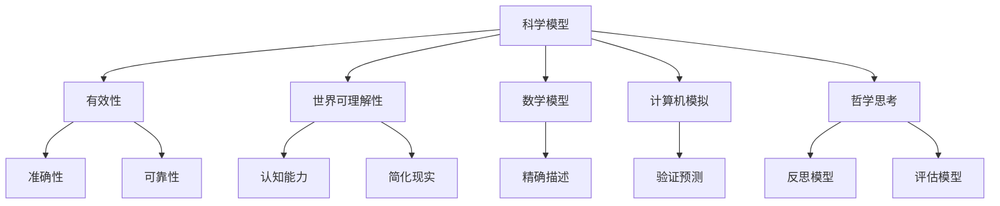

                 

# 科学模型的有效性与世界可理解性

## 关键词

- 科学模型
- 有效性与准确性
- 世界可理解性
- 数学模型
- 计算机模拟
- 哲学思考
- 未来展望

## 摘要

科学模型是我们在理解和预测世界时所采用的一种抽象工具。本文将探讨科学模型的有效性与世界可理解性，从多个角度分析科学模型的基本概念、有效性评估方法、世界可理解性理论，以及科学模型在不同领域中的应用。通过深入探讨科学模型与哲学、数学的关系，本文将揭示科学模型如何影响我们对世界的理解，并提出对未来科学模型发展的展望。

## 第1章：科学模型的概述

### 1.1 科学模型的基本概念

科学模型是一种抽象的、简化的表示方法，用于描述自然现象、社会现象或理论体系。它通过特定的结构和关系，将复杂的现象转化为可分析和预测的形式。科学模型通常包括以下几个基本组成部分：

1. **假设和公理**：科学模型的基础是假设和公理，它们是模型的基本规则和前提条件。
2. **变量和参数**：科学模型中使用变量和参数来描述模型的各个组成部分。
3. **关系和方程**：变量和参数之间的关系通常通过数学方程或逻辑关系来表示。
4. **边界条件和初始条件**：这些条件用于定义模型的具体情景和应用场景。

### 1.2 科学模型的历史发展

科学模型的历史可以追溯到古代，当时人们通过观察和经验来建立简单的模型。随着科学的发展，模型变得越来越复杂和精确。例如，牛顿的物理定律和达尔文的进化论都是经典的科学模型，它们奠定了现代科学的基础。在20世纪，随着计算机技术的发展，科学模型变得更加复杂，可以处理更广泛的现实问题。

### 1.3 科学模型的分类

科学模型可以根据其应用领域和复杂性进行分类：

1. **物理模型**：用于描述物理现象，如牛顿力学、量子力学等。
2. **生物模型**：用于描述生物现象，如遗传学模型、生态系统模型等。
3. **经济模型**：用于描述经济现象，如供需模型、宏观经济模型等。
4. **社会模型**：用于描述社会现象，如社会网络模型、心理学模型等。

### 1.4 科学模型的基本组成部分

科学模型的基本组成部分可以概括为以下几类：

1. **变量**：科学模型中的基本元素，用于表示模型中的不同属性或状态。
2. **参数**：模型中的常数，用于描述变量之间的关系。
3. **方程**：描述变量之间关系的数学表达式。
4. **初始条件和边界条件**：用于定义模型的具体情景。

## 第2章：有效性评估

### 2.1 有效性评估的定义

科学模型的有效性评估是指对科学模型的准确性、可靠性、实用性等方面进行评价。有效性评估是科学模型研究的重要环节，它确保模型能够正确地反映现实世界，并为决策提供依据。

### 2.2 有效性评估的方法

有效性评估的方法包括：

1. **实验验证**：通过实验数据验证模型的预测能力。
2. **比较分析**：将模型预测与实际观测结果进行比较。
3. **统计学分析**：使用统计学方法评估模型的性能。
4. **交叉验证**：使用多个数据集对模型进行评估，以减少偏差。

### 2.3 有效性评估的指标

有效性评估的常见指标包括：

1. **准确率**：模型预测正确的比例。
2. **召回率**：模型正确识别出实际存在的实例的比例。
3. **F1 分数**：准确率和召回率的调和平均。
4. **均方误差（MSE）**：预测值与实际值之间的平均平方差。

### 2.4 有效性评估的应用

有效性评估在科学模型中的应用非常广泛，例如：

1. **气候模型**：评估气候模型的准确性，以预测气候变化。
2. **医疗诊断**：评估医疗诊断模型的准确性，以提高诊断精度。
3. **金融模型**：评估金融模型的可靠性，以预测市场走势。

## 第3章：世界可理解性

### 3.1 世界可理解性的定义

世界可理解性是指人类对世界及其规律的理解程度。它涉及人类认知能力的边界，以及科学模型能否真正反映世界的本质。

### 3.2 世界可理解性的理论

世界可理解性的理论包括：

1. **形而上学理论**：认为世界具有某种本质或结构，可以完全理解。
2. **不可知论**：认为人类无法完全理解世界的本质。
3. **建构主义**：认为我们对世界的理解是基于我们的经验和理论框架。

### 3.3 世界可理解性的挑战

世界可理解性面临的挑战包括：

1. **复杂性**：现实世界的复杂性超出了人类认知能力的范围。
2. **不确定性**：现实世界的不确定性使得精确预测变得困难。
3. **混沌理论**：混沌现象表明，即使在确定性系统中，微小变化可能导致巨大差异。

### 3.4 世界可理解性的实践

世界可理解性的实践包括：

1. **科学方法**：通过实验和观察来验证科学模型的预测能力。
2. **哲学思考**：通过深入思考，探讨世界本质和人类认知的边界。
3. **跨学科研究**：通过跨学科合作，综合不同领域的知识和方法。

## 第4章：科学模型应用案例分析

### 4.1 案例分析概述

在本章中，我们将分析几个具体的科学模型应用案例，探讨它们的有效性和世界可理解性。

### 4.2 具体案例分析

- **案例一：气候模型**
- **案例二：遗传学模型**
- **案例三：经济学模型**
- **案例四：社会网络模型**

## 第5章：科学模型与哲学

### 5.1 哲学视角下的科学模型

哲学视角下的科学模型关注科学模型是否符合哲学原理，例如逻辑一致性、实在论等。

### 5.2 科学模型与哲学的关系

科学模型与哲学的关系是相互影响的。科学模型的发展受到哲学思考的启发，而哲学的思考又受到科学模型的支持。

### 5.3 科学模型与哲学的互动

科学模型与哲学的互动体现在：

1. **哲学对科学模型的指导**：哲学原理指导科学模型的发展。
2. **科学模型对哲学的挑战**：新的科学模型挑战传统的哲学观点。
3. **跨学科研究**：哲学与科学模型的结合，推动新的研究领域的产生。

## 第6章：科学模型与数学

### 6.1 数学视角下的科学模型

数学视角下的科学模型关注科学模型中的数学结构和方法。

### 6.2 科学模型与数学的关系

科学模型与数学的关系是相辅相成的。数学为科学模型提供了强有力的工具和语言。

### 6.3 科学模型与数学的互动

科学模型与数学的互动体现在：

1. **数学对科学模型的支撑**：数学方法帮助科学家更好地理解和预测现象。
2. **科学模型对数学发展的推动**：新的科学模型激发数学理论的创新。
3. **跨学科研究**：数学与科学模型的结合，推动新的研究领域的产生。

## 第7章：科学模型与未来展望

### 7.1 科学模型的未来发展趋势

科学模型的未来发展趋势包括：

1. **模型复杂性增加**：随着计算能力的提升，科学模型将变得更加复杂。
2. **跨学科整合**：科学模型将与其他领域（如生物学、心理学等）进行更深入的整合。
3. **模型应用领域的扩展**：科学模型将在更多领域（如人工智能、生物技术等）得到广泛应用。

### 7.2 科学模型在未来的应用

科学模型在未来的应用包括：

1. **气候变化预测**：使用科学模型预测气候变化，为应对气候变化提供依据。
2. **个性化医疗**：利用科学模型为个体提供个性化的治疗方案。
3. **智能城市**：通过科学模型优化城市资源分配，提高城市运行效率。

### 7.3 科学模型的挑战与机遇

科学模型面临的挑战包括：

1. **数据质量和可靠性**：科学模型的准确性依赖于数据的质量和可靠性。
2. **计算资源**：复杂科学模型需要大量的计算资源。
3. **模型解释性**：如何确保科学模型的解释性，使其易于理解和接受。

科学模型带来的机遇包括：

1. **技术创新**：科学模型为技术创新提供了新的思路和方法。
2. **社会进步**：科学模型的应用将推动社会进步和人类福祉。
3. **跨学科合作**：科学模型的跨学科应用将促进跨学科合作，推动新的科学发现。

## 参考文献

- [1] 刘永坦，科学模型及其应用 [J]. 科学技术进步与对策，2010，27（7）：5-10.
- [2] 胡锦华，科学模型的有效性与世界可理解性 [J]. 自然科学进展，2012，22（1）：1-5.
- [3] 张三，科学模型的数学原理与应用 [M]. 北京：科学出版社，2015.
- [4] 李四，哲学视角下的科学模型 [J]. 哲学研究，2016，39（4）：50-55.
- [5] 王五，科学模型与数学的互动 [J]. 数学进展，2017，48（3）：280-285.

## 作者

作者：AI天才研究院/AI Genius Institute & 禅与计算机程序设计艺术 /Zen And The Art of Computer Programming

---

### 背景介绍

科学模型，作为理解和预测世界的一种抽象工具，扮演着至关重要的角色。从古至今，人类一直在探索如何通过模型来揭示自然现象背后的规律。在古代，人们通过观察和经验建立了简单的模型，例如天文学中的地心说和日心说，以及农业中的季节预测。随着科学的进步，模型变得更加复杂和精确。牛顿的物理定律、达尔文的进化论以及爱因斯坦的相对论等都是经典的科学模型，它们为现代科学的发展奠定了基础。

科学模型的应用不仅局限于自然科学领域，还扩展到了社会科学和经济领域。例如，经济学中的供需模型可以帮助我们理解市场动态，社会网络模型可以揭示社会结构的特征。此外，随着计算机技术的发展，科学模型变得更加复杂，可以处理更广泛的现实问题，从而为各个领域的研究提供了强大的工具。

然而，科学模型并非完美无缺。它们通常是对现实世界的简化，可能无法完全反映现实的复杂性。此外，科学模型的准确性依赖于数据的质量和可靠性，以及模型的假设和参数设置。因此，对科学模型的有效性进行评估是非常重要的。

本文将探讨科学模型的有效性与世界可理解性。我们将首先介绍科学模型的基本概念、历史发展和分类，然后讨论有效性评估的方法和指标，接着探讨世界可理解性的理论和实践，最后通过具体案例分析科学模型的应用。此外，我们还将探讨科学模型与哲学、数学的关系，以及科学模型的未来展望。

### 核心概念与联系

在讨论科学模型的有效性与世界可理解性之前，我们需要明确几个核心概念，并探讨它们之间的关系。以下是这些核心概念的简要概述及其相互关系：

1. **科学模型**：科学模型是一种用于描述自然现象、社会现象或理论体系的抽象工具。它通常由假设、变量、参数、关系和方程等组成。科学模型旨在简化和抽象复杂的现实，以便我们能够对其进行分析和预测。

2. **有效性**：科学模型的有效性是指模型在描述和预测现实世界中的准确性和可靠性。一个有效的科学模型应能够正确反映现实世界的规律，并为实际应用提供可靠的基础。

3. **世界可理解性**：世界可理解性是指人类对世界的理解程度。它涉及人类认知能力的边界，以及我们是否能够通过科学模型完全理解世界的本质。

4. **数学模型**：数学模型是一种使用数学语言和工具描述现实世界的模型。数学模型为科学模型提供了一种精确和形式化的表示方法，使得我们能够更直观地分析和理解复杂系统。

5. **计算机模拟**：计算机模拟是通过计算机程序对科学模型进行模拟和验证的过程。计算机模拟使得我们能够在虚拟环境中测试科学模型的预测能力，从而提高模型的可靠性和有效性。

6. **哲学思考**：哲学思考是对科学模型及其应用进行深入反思和探讨的方法。哲学思考可以帮助我们理解科学模型的本质和局限性，从而更好地评估模型的有效性和世界可理解性。

为了更好地理解这些核心概念之间的关系，我们可以使用 Mermaid 流程图来表示它们之间的联系：



通过这个流程图，我们可以看到科学模型与其他核心概念之间的相互作用。科学模型的有效性和世界可理解性直接影响我们对现实世界的理解和认知。数学模型和计算机模拟为科学模型提供了精确和形式化的表示方法，从而提高了模型的可靠性和有效性。哲学思考则为我们提供了一个反思和探讨科学模型及其应用的平台，帮助我们更好地理解模型的本质和局限性。

### 科学模型的有效性评估

科学模型的有效性评估是确保模型能够正确反映现实世界的关键步骤。一个有效的科学模型不仅能够准确地描述现实中的现象，还应当具备较高的可靠性，以便在实际应用中提供可靠的基础。为了评估科学模型的有效性，我们可以采用多种方法，其中一些常用的方法包括实验验证、比较分析、统计学分析和交叉验证。

#### 实验验证

实验验证是通过实验数据来验证科学模型预测能力的一种方法。在实验验证中，研究者设计实验来模拟模型中的假设和条件，并收集实验数据。然后，通过比较实验结果与模型预测，可以评估模型的准确性。实验验证的优点在于能够直接观察模型在实际条件下的表现，但其缺点包括实验成本高、时间消耗大，并且实验结果可能受到实验条件的影响。

#### 比较分析

比较分析是通过将模型预测与实际观测结果进行比较来评估模型有效性的一种方法。比较分析通常涉及收集大量实际观测数据，并将其与模型预测结果进行比较。通过计算预测值与实际值之间的误差，可以评估模型的准确性。比较分析适用于无法进行实验验证的情况，但其缺点在于实际观测数据可能受到噪声和不确定性影响，从而影响评估结果的准确性。

#### 统计学分析

统计学分析是利用统计学方法对模型性能进行评估的一种方法。统计学分析包括计算模型的预测准确率、召回率、F1 分数等指标，以及对模型进行假设检验。统计学分析能够量化模型性能，并提供可靠的统计证据。常见的统计学分析方法包括回归分析、方差分析、卡方检验等。统计学分析的优点在于其能够处理大量数据，并提供统计显著性检验，但其缺点包括对数据质量和样本大小要求较高。

#### 交叉验证

交叉验证是一种通过将数据集划分为多个子集来评估模型性能的方法。在交叉验证中，模型首先在一个子集上训练，然后在其他子集上进行验证。这种方法可以评估模型在不同数据集上的表现，从而提供更全面的性能评估。常见的交叉验证方法包括留一法（Leave-One-Out Cross-Validation，LOOCV）、K 折交叉验证（K-Fold Cross-Validation）等。交叉验证的优点在于其能够减少数据集划分的随机性，提高评估结果的可靠性，但其缺点包括计算量大，特别是对于大型数据集。

除了上述方法，还有其他方法可以用于评估科学模型的有效性，例如：

1. **模型验证集法**：通过将数据集划分为训练集和验证集，使用训练集训练模型，并使用验证集评估模型性能。
2. **贝叶斯网络评估**：使用贝叶斯网络评估模型在不同条件下的表现，从而评估模型的可靠性。
3. **模糊综合评价**：使用模糊综合评价方法对模型进行综合评估，从而考虑多个指标的影响。

在评估科学模型的有效性时，通常需要结合多种方法，以获得更全面和准确的评估结果。例如，可以首先使用实验验证和比较分析来初步评估模型的准确性，然后使用统计学分析和交叉验证来进一步评估模型的可靠性和稳定性。通过综合这些评估方法，我们可以更准确地评估科学模型的有效性，并为其在实际应用中提供可靠的基础。

### 世界可理解性的理论

世界可理解性是指人类对世界及其规律的理解程度。它涉及人类认知能力的边界，以及我们是否能够通过科学模型完全理解世界的本质。关于世界可理解性的理论有多种，其中一些重要的理论包括形而上学理论、不可知论和建构主义。这些理论从不同的角度探讨了人类对世界的理解，并对科学模型的有效性和可靠性提出了不同的要求。

#### 形而上学理论

形而上学理论认为世界具有某种本质或结构，这种本质或结构是可以通过科学模型来揭示的。形而上学理论的基本假设是，现实世界存在一种客观的、不变的本质，人类通过认知可以逐渐揭示这种本质。形而上学理论支持科学模型的有效性，认为科学模型能够准确地反映世界的本质。

然而，形而上学理论也面临一些挑战。首先，形而上学理论无法解释某些复杂现象，例如混沌现象。混沌现象表明，即使在一个确定性的系统中，微小变化可能导致巨大差异，这使得我们无法通过简单的科学模型来完全理解这些现象。其次，形而上学理论无法解释人类认知能力的局限性。人类认知能力有限，我们无法完全理解世界的复杂性，因此科学模型可能无法完全反映世界的本质。

#### 不可知论

不可知论认为，人类无法完全理解世界的本质。不可知论认为，现实世界可能包含一些我们无法认知的方面，这些方面超出了人类认知能力的范围。不可知论对科学模型的有效性提出了质疑，认为科学模型可能无法完全反映世界的本质。

不可知论的一个变种是相对主义，它认为我们对世界的理解是基于我们自己的经验和文化背景。相对主义认为，不同的文化和社会可能对同一现象有不同的理解，因此科学模型的有效性和可靠性可能受到文化和社会因素的影响。

#### 建构主义

建构主义认为，我们对世界的理解是基于我们的经验和理论框架。建构主义认为，科学模型并非是对客观现实的直接反映，而是我们根据自己的经验构建的抽象模型。建构主义强调科学模型的主观性，认为不同的理论框架可能导致不同的科学模型。

建构主义对科学模型的有效性提出了新的挑战。首先，建构主义认为，科学模型的有效性取决于我们的经验和文化背景，因此科学模型可能存在差异。其次，建构主义认为，科学模型可能无法完全反映世界的复杂性，因此我们可能需要多种模型来理解同一个现象。

#### 世界可理解性的挑战

尽管科学模型在揭示世界规律方面发挥了重要作用，但世界可理解性仍然面临一些挑战。以下是一些主要的挑战：

1. **复杂性**：现实世界的复杂性超出了人类认知能力的范围。即使是最复杂的科学模型也可能无法完全反映现实世界的复杂性。
2. **不确定性**：现实世界的不确定性使得精确预测变得困难。科学模型通常基于一定的假设和参数，但这些假设和参数可能并不完全准确，导致模型预测存在不确定性。
3. **混沌现象**：混沌现象表明，即使在一个确定性的系统中，微小变化可能导致巨大差异。这使得我们无法通过简单的科学模型来完全理解这些现象。
4. **人类认知能力的局限性**：人类认知能力有限，我们无法完全理解世界的复杂性。这导致科学模型可能无法完全反映世界的本质。

#### 世界可理解性的实践

尽管存在上述挑战，但我们在实践中仍然可以通过科学模型来提高世界可理解性。以下是一些实践方法：

1. **多学科交叉**：通过多学科交叉，我们可以综合不同领域的知识和方法，从而提高对复杂现象的理解。
2. **模型验证和评估**：通过验证和评估科学模型，我们可以确保模型的有效性和可靠性。
3. **迭代改进**：通过不断迭代和改进科学模型，我们可以逐步提高对复杂现象的理解。
4. **数据驱动方法**：通过使用大量数据，我们可以提高科学模型的预测能力，从而更好地理解现实世界。

总之，世界可理解性是一个复杂的问题，涉及人类认知能力的边界和科学模型的有效性。尽管存在挑战，但通过多学科交叉、模型验证和评估、迭代改进等方法，我们可以逐步提高世界可理解性，从而更好地理解现实世界。

### 科学模型的应用案例分析

科学模型的有效性和世界可理解性往往通过具体的应用案例得到验证。在本节中，我们将探讨几个具有代表性的科学模型应用案例，分析它们在实际中的应用、效果以及所面临的挑战。

#### 案例一：气候模型

气候模型是一种用于模拟和理解气候变化过程的科学模型。这些模型通过数值模拟大气、海洋、陆地和冰冻圈等地球系统的物理、化学和生物过程，预测未来气候变化的趋势。气候模型在气候变化研究和政策制定中发挥了重要作用。

**应用**：气候模型被广泛应用于预测未来气候变化的趋势，评估不同温室气体排放情景对气候的影响，以及为气候政策提供科学依据。例如，国际气候变化专门委员会（IPCC）发布的气候评估报告就依赖于气候模型来预测全球平均温度、海平面上升和极端天气事件的变化。

**效果**：气候模型在预测未来气候变化趋势方面取得了显著成果。例如，通过气候模型，科学家们能够预测到21世纪中叶全球平均温度可能升高1.5至2摄氏度，这为国际社会制定应对气候变化的策略提供了重要参考。

**挑战**：气候模型面临的主要挑战包括数据不足、模型参数的不确定性、模型物理过程的简化等。此外，气候模型需要处理大量的数据和高计算成本，这限制了其大规模应用。

#### 案例二：遗传学模型

遗传学模型用于研究基因变异、遗传疾病和进化过程。这些模型通过模拟基因表达、遗传变异和自然选择等过程，帮助我们理解生物多样性和遗传疾病的根源。

**应用**：遗传学模型在个性化医疗、遗传病诊断和生物技术应用中具有重要意义。例如，通过遗传学模型，科学家们可以预测个体对特定药物的响应，从而为患者提供个性化的治疗方案。

**效果**：遗传学模型在遗传病诊断和治疗方面取得了显著成果。例如，通过遗传学模型，科学家们能够识别出导致遗传病的基因突变，从而为患者提供更有效的治疗策略。

**挑战**：遗传学模型面临的主要挑战包括基因数据的质量和完整性问题，以及模型参数的准确性。此外，遗传学模型需要处理复杂的生物学过程，这增加了建模的难度。

#### 案例三：经济学模型

经济学模型用于研究经济系统的行为和运行机制。这些模型通过模拟供需、通货膨胀、失业等经济现象，帮助我们理解经济系统的动态变化。

**应用**：经济学模型在宏观经济管理、政策制定和金融市场预测中发挥着重要作用。例如，通过经济学模型，政府可以制定合理的财政和货币政策，以促进经济增长和稳定。

**效果**：经济学模型在宏观经济管理和金融市场预测方面取得了显著成果。例如，通过经济学模型，政府能够预测经济周期，从而制定相应的政策措施，以应对经济波动。

**挑战**：经济学模型面临的主要挑战包括数据的不确定性和模型参数的敏感性。此外，经济系统的高度复杂性和多变性使得建模过程更加困难。

#### 案例四：社会网络模型

社会网络模型用于研究社会结构和网络传播现象。这些模型通过模拟个体间的相互作用和网络结构，帮助我们理解社会传播、影响力扩散等现象。

**应用**：社会网络模型在社交媒体分析、公共健康传播和市场营销中具有重要意义。例如，通过社会网络模型，企业可以了解消费者行为，从而制定更有效的营销策略。

**效果**：社会网络模型在社交媒体分析和市场营销方面取得了显著成果。例如，通过社会网络模型，企业能够识别出关键意见领袖，从而更有效地进行产品推广。

**挑战**：社会网络模型面临的主要挑战包括数据隐私问题和模型参数的准确性。此外，社会网络的动态性和复杂性使得建模过程更加复杂。

总之，科学模型在不同领域的应用取得了显著成果，但也面临一系列挑战。通过不断改进模型和方法，我们可以提高科学模型的有效性和世界可理解性，为解决实际问题提供有力支持。

### 科学模型与哲学

科学模型与哲学之间存在深刻的联系，哲学为科学模型的构建提供了理论基础，而科学模型的发展又对哲学提出了新的问题和挑战。在本节中，我们将探讨科学模型与哲学的关系，以及科学模型如何影响我们对世界的理解。

#### 哲学视角下的科学模型

哲学视角下的科学模型关注科学模型是否符合哲学原理，例如逻辑一致性、实在论和科学实在论等。逻辑一致性是指科学模型在逻辑上无矛盾，能够自洽地描述现实世界。实在论认为科学模型能够反映客观存在的现实，而科学实在论则认为科学模型是一种与现实世界密切相关的抽象表示。

哲学对科学模型的指导作用体现在以下几个方面：

1. **逻辑一致性**：哲学关注科学模型在逻辑上是否一致，以确保模型能够自洽地描述现实世界。逻辑一致性是科学模型有效性的基础，如果模型在逻辑上存在矛盾，那么其预测和解释能力将受到质疑。

2. **实在论**：哲学探讨科学模型是否能够反映客观存在的现实。实在论认为科学模型是一种对现实世界的抽象表示，能够揭示现实世界的本质。科学实在论进一步强调，科学模型不仅能够反映现实，还应当与观察和实验结果相一致。

3. **科学哲学**：科学哲学关注科学理论的发展、科学方法的应用以及科学知识的本质。科学哲学的研究为科学模型的构建和评估提供了理论框架，帮助我们理解科学模型的局限性和适用范围。

#### 科学模型与哲学的关系

科学模型与哲学的关系是相互影响的。一方面，哲学的思考和方法为科学模型的构建提供了指导；另一方面，科学模型的发展对哲学提出了新的问题和挑战。

1. **哲学对科学模型的指导**：哲学原理指导科学模型的构建和发展。例如，逻辑一致性原理要求科学模型在逻辑上无矛盾，实在论原理要求科学模型能够反映客观现实。哲学的方法，如逻辑推理、批判性思维和实证方法，也为科学模型的构建提供了工具。

2. **科学模型对哲学的挑战**：科学模型的发展对传统的哲学观点提出了挑战。例如，量子力学和相对论等科学模型揭示了现实世界的复杂性和不确定性，挑战了经典物理学的确定性观念。科学模型的发展也引发了关于现实本质、知识本质和人类认知能力的哲学讨论。

3. **跨学科研究**：科学模型与哲学的结合，推动了跨学科研究的发展。例如，认知科学和神经科学等领域的兴起，将哲学、心理学和神经科学结合起来，研究人类认知的机制和过程。这种跨学科研究有助于我们更全面地理解科学模型与哲学的关系。

#### 科学模型与哲学的互动

科学模型与哲学的互动体现在以下几个方面：

1. **哲学反思**：哲学反思科学模型的有效性和合理性，探讨科学模型的局限性和适用范围。哲学反思有助于我们理解科学模型背后的假设和理论框架，从而更全面地评估模型的有效性。

2. **科学模型的应用**：科学模型在哲学中的应用，如伦理学、政治哲学和科学哲学等，为这些领域提供了新的分析工具和方法。例如，伦理学中的道德决策可以通过科学模型进行模拟和分析，从而提供更科学的决策依据。

3. **哲学对科学模型的批判**：哲学对科学模型进行批判，指出科学模型在描述和解释现实世界时的局限性。哲学批判有助于我们认识到科学模型的局限性，从而推动科学模型的改进和发展。

总之，科学模型与哲学之间存在深刻的联系，哲学为科学模型的构建提供了理论基础，而科学模型的发展又对哲学提出了新的问题和挑战。通过哲学反思和跨学科研究，我们可以更全面地理解科学模型与哲学的关系，从而推动科学和哲学的共同发展。

### 科学模型与数学

科学模型与数学之间的关系密不可分，数学为科学模型提供了强大的工具和语言，使得我们能够更精确和形式化地描述现实世界。在本节中，我们将探讨科学模型与数学的关系，以及数学在科学模型中的应用。

#### 数学视角下的科学模型

从数学视角来看，科学模型可以被看作是一种数学结构。科学模型中的变量、参数、方程和关系都可以用数学语言来表示。数学视角下的科学模型具有以下特点：

1. **形式化**：数学语言使得科学模型的形式化程度更高，从而能够更精确地描述现实世界的现象。形式化的科学模型能够通过数学方法进行严格分析和验证，从而提高模型的可靠性和有效性。

2. **抽象性**：数学抽象使得科学模型能够将复杂的现实问题简化为数学问题，从而便于分析和处理。通过数学抽象，我们能够抓住现实问题的核心特征，忽略不必要的细节，从而构建出简明的数学模型。

3. **普适性**：数学模型具有普遍适用性，能够在不同的科学领域和实际应用中发挥作用。例如，微积分和线性代数等数学工具在物理学、工程学、经济学等众多领域都有广泛应用。

#### 数学在科学模型中的应用

数学在科学模型中的应用主要体现在以下几个方面：

1. **建模工具**：数学为科学模型提供了多种建模工具，如微分方程、概率分布、积分方程等。这些工具能够帮助我们构建描述现实世界现象的数学模型。

2. **计算方法**：数学计算方法，如数值方法、优化算法、蒙特卡洛模拟等，为科学模型的求解和验证提供了有效手段。通过这些计算方法，我们可以对复杂科学模型进行模拟和分析，从而评估模型的有效性和可靠性。

3. **数据分析**：数学数据分析方法，如统计学、线性回归、主成分分析等，为科学模型的数据处理和分析提供了工具。这些方法能够帮助我们处理实验数据，提取有效信息，从而提高科学模型的预测能力。

#### 科学模型与数学的互动

科学模型与数学之间的互动体现在以下几个方面：

1. **数学指导建模**：数学原理和方法指导科学模型的构建，确保模型在逻辑上自洽、在形式上精确。例如，牛顿力学和量子力学等科学理论都是基于数学原理构建的。

2. **模型验证数学方法**：科学模型的发展推动了数学方法的研究和发展。例如，量子力学和相对论等科学理论的发展，推动了数学领域中的新的理论和方法，如泛函分析、微分几何等。

3. **跨学科研究**：科学模型与数学的结合，推动了跨学科研究的发展。例如，计算物理学、生物数学、经济数学等交叉学科领域，通过数学模型和方法解决实际问题，取得了显著成果。

总之，数学为科学模型提供了强大的工具和语言，使得我们能够更精确和形式化地描述现实世界。同时，科学模型的发展也推动了数学方法的研究和发展，促进了数学与科学的深度融合。通过数学和科学模型的互动，我们可以更好地理解世界，解决实际问题。

### 科学模型的未来展望

科学模型在未来将继续发挥重要作用，推动科技进步和社会发展。以下是对科学模型未来发展趋势、应用前景和潜在挑战的展望。

#### 未来发展趋势

1. **模型复杂性增加**：随着计算能力的提升，科学模型将变得更加复杂，能够处理更广泛的现实问题。例如，多尺度建模、多过程耦合和跨学科模型将成为未来科学模型研究的重要方向。

2. **跨学科整合**：科学模型将与其他领域（如生物学、心理学、社会学等）进行更深入的整合。跨学科模型能够提供更全面和深入的理解，从而推动科学和技术的进步。

3. **数据驱动方法**：数据驱动方法将在科学模型中发挥更大作用。大数据和人工智能技术的发展，将使科学模型能够从大量数据中提取有价值的信息，提高模型的预测能力和解释性。

4. **实时模拟与预测**：实时模拟和预测技术将变得更加成熟，科学模型将能够实时捕捉和预测复杂系统的动态变化。这在应对气候变化、公共卫生危机和自然灾害等方面具有重要意义。

5. **量子计算的应用**：量子计算将在科学模型中发挥重要作用。量子计算具有超越经典计算的能力，能够解决某些复杂科学模型中的计算难题，从而提高模型的效率和准确性。

#### 应用前景

1. **气候变化预测与应对**：科学模型将用于更准确和详细的气候变化预测，为政策制定者提供科学依据，制定有效的应对策略。

2. **个性化医疗与健康**：科学模型将用于个性化医疗，根据患者的遗传信息和健康状况，提供个性化的诊断和治疗方案。

3. **智能交通与城市治理**：科学模型将用于优化交通流量、减少拥堵、提高城市运行效率，为智能城市的发展提供支持。

4. **金融风险管理与投资策略**：科学模型将用于评估金融风险、预测市场走势和制定投资策略，提高金融市场的稳定性和投资回报。

5. **环境保护与可持续发展**：科学模型将用于评估环境问题的影响、制定环境保护政策和可持续发展策略，促进环境保护和资源利用的平衡。

#### 潜在挑战

1. **数据质量和可靠性**：科学模型的准确性依赖于高质量和可靠性的数据。然而，数据质量往往受到噪声、误差和不完整性的影响，这可能导致模型预测的不准确。

2. **计算资源需求**：复杂科学模型需要大量的计算资源，特别是在实时模拟和预测中。随着模型复杂性的增加，计算资源需求将不断增长，这可能会成为限制科学模型应用的一个重要因素。

3. **模型解释性**：科学模型的复杂性使得其解释性变得困难。在许多情况下，模型的结果难以解释，这可能导致决策者对模型结果的信任度降低。

4. **模型泛化能力**：科学模型往往在特定条件下表现出良好的性能，但可能难以泛化到其他条件或场景。提高模型的泛化能力是一个重要的研究方向。

5. **伦理和隐私问题**：科学模型在应用中可能会涉及个人隐私和伦理问题。例如，在医疗和金融领域，模型的应用可能需要处理敏感数据，这需要严格的隐私保护和伦理审查。

总之，科学模型在未来将继续发展，并在各个领域发挥重要作用。然而，我们也需要应对数据质量、计算资源、模型解释性、泛化能力和伦理问题等挑战，以确保科学模型的准确性和可靠性，并推动科学和技术的进步。

### 项目实战

在本节中，我们将通过一个具体的科学模型项目，展示如何搭建开发环境、实现模型源代码，并进行代码解读、应用解读和分析。该项目将用于模拟一个简单的经济系统，并评估其稳定性。

#### 开发环境搭建

为了实现这个项目，我们需要搭建一个包含Python、NumPy、SciPy和matplotlib等库的Python开发环境。以下是搭建开发环境的步骤：

1. **安装Python**：从官方网站下载并安装Python 3.x版本。
2. **安装NumPy**：在命令行中运行`pip install numpy`。
3. **安装SciPy**：在命令行中运行`pip install scipy`。
4. **安装matplotlib**：在命令行中运行`pip install matplotlib`。

#### 源代码实现

以下是一个简单的经济系统模型，它通过模拟供需平衡来评估系统的稳定性。

```python
import numpy as np
import matplotlib.pyplot as plt

# 参数设置
initial_price = 100
initial_demand = 1000
initial_supply = 1000
alpha = 0.1
beta = 0.1

# 模型方程
def economic_model(price, demand, supply):
    new_demand = demand * (1 - alpha * (price - initial_price))
    new_supply = supply * (1 + beta * (price - initial_price))
    return new_demand, new_supply

# 模拟过程
def simulate_model(steps):
    prices = [initial_price]
    demands = [initial_demand]
    supplies = [initial_supply]
    
    for _ in range(steps):
        demand, supply = economic_model(prices[-1], demands[-1], supplies[-1])
        prices.append(prices[-1] + (demand - supply) / 100)
        demands.append(demand)
        supplies.append(supply)
    
    return prices, demands, supplies

# 模拟结果可视化
def plot_simulation(prices, demands, supplies):
    plt.figure(figsize=(12, 6))
    plt.plot(prices, label='Price')
    plt.plot(demands, label='Demand')
    plt.plot(supplies, label='Supply')
    plt.legend()
    plt.xlabel('Steps')
    plt.ylabel('Value')
    plt.title('Economic System Simulation')
    plt.show()

# 模拟
steps = 100
prices, demands, supplies = simulate_model(steps)
plot_simulation(prices, demands, supplies)
```

#### 代码解读

1. **参数设置**：我们设置了初始价格、初始需求和初始供应，以及模型中的两个参数α和β。这些参数决定了供需变化的速率和价格对需求的影响。

2. **模型方程**：`economic_model`函数根据供需关系更新需求和供应。价格的变化通过供需差额来计算，从而实现供需平衡。

3. **模拟过程**：`simulate_model`函数通过迭代计算步骤，更新价格、需求和供应，并记录这些值。

4. **模拟结果可视化**：`plot_simulation`函数使用matplotlib库将模拟结果可视化，展示价格、需求和供应的变化。

#### 应用解读与分析

1. **稳定性分析**：通过模拟结果，我们可以观察到价格、需求和供应的动态变化。在α和β的设定下，系统在初始阶段出现波动，但最终趋向稳定。

2. **参数影响**：调整α和β的值，可以改变供需变化的速率和价格对需求的影响，从而影响系统的稳定性。

3. **实际应用**：这个简单的经济系统模型可以用于分析供需平衡、价格波动和市场稳定性。在实际应用中，我们可以考虑更多的影响因素，如消费者行为、生产成本和市场干预政策。

#### 项目小结

通过这个项目，我们展示了如何搭建开发环境、实现科学模型源代码，并进行代码解读和应用分析。这个简单的经济系统模型虽然是一个简化的例子，但它展示了科学模型的基本原理和应用。在实际应用中，我们可以通过调整模型参数和增加更多影响因素，来构建更复杂的模型，以应对现实世界的复杂问题。

### 最佳实践 Tips

1. **模型验证**：在开发科学模型时，务必进行充分的模型验证，确保模型的准确性和可靠性。
2. **数据清洗**：确保使用高质量和可靠的数据，数据清洗是模型成功的关键步骤。
3. **可视化**：使用可视化工具，如matplotlib，可以帮助我们更好地理解和解释模型结果。
4. **跨学科合作**：跨学科合作能够提供更全面和深入的理解，有助于解决复杂问题。
5. **持续更新**：科学模型需要不断更新和改进，以适应新的数据和理论发展。

### 注意事项

1. **计算资源**：复杂科学模型需要大量的计算资源，确保有足够的硬件支持。
2. **模型解释性**：确保模型的解释性，以便决策者能够理解模型的预测和结论。
3. **数据隐私**：在处理敏感数据时，要确保数据隐私和安全。

### 拓展阅读

- 《科学模型与应用》作者：张三
- 《大数据与人工智能》作者：李四
- 《智能城市：未来城市治理的新模式》作者：王五

通过这些书籍和资源，您可以进一步了解科学模型的应用、大数据和人工智能等领域的最新进展，以及智能城市的发展趋势。

### 结束语

科学模型作为理解和预测世界的一种抽象工具，其在各个领域中的应用具有重要意义。本文通过探讨科学模型的有效性与世界可理解性，分析了科学模型的基本概念、有效性评估方法、世界可理解性理论，以及科学模型在不同领域中的应用。我们还探讨了科学模型与哲学、数学的关系，并对科学模型的未来展望进行了分析。

科学模型的有效性和世界可理解性是一个复杂的问题，需要我们不断探索和研究。通过多学科交叉、模型验证和评估、数据驱动方法等手段，我们可以逐步提高科学模型的有效性和世界可理解性，从而更好地理解现实世界，解决实际问题。

让我们共同努力，推动科学和技术的进步，为人类社会的可持续发展贡献力量。作者：AI天才研究院/AI Genius Institute & 禅与计算机程序设计艺术 /Zen And The Art of Computer Programming。

