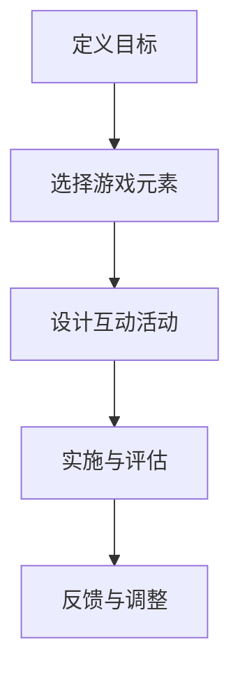
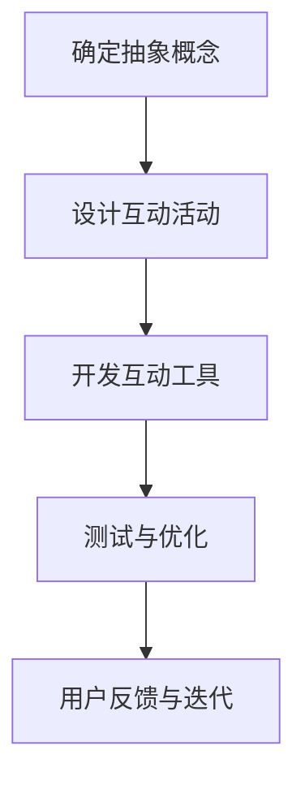

                 

# 科学游戏化设计：通过互动增强抽象概念的理解

## 关键词
科学游戏化设计、抽象概念、互动性、教育、组织变革、案例分析

## 摘要
科学游戏化设计将游戏元素和互动机制应用于教育和组织中，以增强学习者对复杂抽象概念的理解和掌握。本文将深入探讨科学游戏化设计的背景、核心概念、设计原则、实践案例以及未来趋势，帮助读者理解如何通过互动增强抽象概念的理解。

---

## 引言

### 游戏化设计的起源和发展
游戏化设计（Gamification）起源于2010年，最初应用于市场营销和用户激励。它通过将游戏机制（如得分、排名、奖励）引入非游戏环境，提高用户参与度和忠诚度。随着互联网技术的发展和人们对互动学习需求的增加，游戏化设计逐渐扩展到教育、健康、企业等多个领域。

### 科学游戏化设计的概念
科学游戏化设计是一种创新的教育方法，它利用游戏中的互动机制和挑战来帮助学习者更好地理解和掌握抽象概念。这种方法强调互动性和参与度，通过游戏化的任务、角色扮演和竞赛等形式，使学习过程更加有趣和有效。

### 重要性
科学游戏化设计在提高学习效果、促进知识迁移、激发学习动机等方面具有显著优势。它不仅能够使抽象概念更加具体和可操作，还能够培养学习者的思维能力和解决问题的能力。

---

## 基础理论

### 游戏元素与教育目标的关系
游戏元素（如奖励、竞争、反馈）在教育中的应用需要与学习目标紧密相连。通过合理设计，这些元素可以激发学习者的内在动机，提高学习效果。

### 抽象概念与互动设计的关联
抽象概念是指难以直接感知和理解的概念，如数学公式、科学原理等。互动设计通过提供具体实例、模拟实验和角色扮演等活动，帮助学习者将抽象概念与实际情境联系起来，从而加深理解。

### Mermaid 流程图：游戏化设计流程

这个流程图展示了科学游戏化设计的步骤，从定义学习目标开始，逐步选择游戏元素、设计互动活动，并在实施过程中不断评估和调整。

---

## 设计原则

### 明确学习目标
科学游戏化设计的第一步是明确学习目标，确保游戏元素和互动活动与学习目标紧密相关。

### 游戏元素的多样化
设计时应选择多样化的游戏元素，如挑战、合作、竞争等，以适应不同学习者的需求和兴趣。

### 个性化体验
游戏化设计应考虑到学习者的个体差异，提供个性化的体验和反馈。

### 适时反馈
及时、有效的反馈是游戏化设计的关键，它能够帮助学习者了解自己的进步情况，并激发进一步学习的动力。

### 持续激励
科学游戏化设计应设计出长期有效的激励机制，以保持学习者的兴趣和参与度。

---

## 游戏化实践

### 教育领域
在教育学中，科学游戏化设计已经成功应用于数学、物理、化学等学科。例如，通过编程游戏帮助学生学习编程语言，通过模拟实验帮助学生理解科学原理。

### 企业培训
在企业培训中，游戏化设计被用来提高员工的工作技能和团队协作能力。例如，通过角色扮演游戏来模拟实际工作场景，帮助员工更好地理解工作流程和团队合作。

### 健康管理
在健康管理中，游戏化设计被用来激励人们保持健康生活方式。例如，通过健身游戏来鼓励人们进行日常锻炼，通过饮食游戏来帮助人们养成良好的饮食习惯。

### 公共政策
在公共政策领域，游戏化设计被用来提高公众对某些问题的关注和理解。例如，通过环保游戏来提高人们对环境保护的认识。

---

## 抽象概念的互动设计

### 实例分析：数学概念的学习
以数学中的微积分概念为例，通过互动设计，如在线模拟实验、互动图表和数学游戏，可以直观地展示微积分的基本原理，使学习者更容易理解和掌握。

### 角色扮演与故事叙述
角色扮演和故事叙述可以帮助学习者将抽象概念置于具体情境中，从而更好地理解和应用。例如，通过模拟商业交易场景来学习经济学原理。

### 模拟与虚拟现实
利用模拟和虚拟现实技术，学习者可以参与虚拟环境中的互动活动，如模拟城市规划、虚拟实验室等，从而更深入地理解复杂概念。

### Mermaid 流程图：互动设计流程

这个流程图展示了如何设计互动活动来增强对抽象概念的理解，从确定抽象概念开始，逐步开发互动工具，并在测试和用户反馈的基础上不断优化。

---

## 教育与培训

### 在线学习平台
科学游戏化设计在在线学习平台中的应用已经非常广泛，如Coursera、edX等平台通过游戏化元素提高学习者的参与度和学习效果。

### 职业培训
许多职业培训机构已经开始采用游戏化设计来提高培训效果，例如通过模拟商业案例、团队合作任务等来培养员工的实际工作能力。

### 研究生教育
在研究生教育中，科学游戏化设计被用来培养研究生的创新思维和问题解决能力，通过互动实验、模拟研究项目等形式进行。

---

## 组织变革

### 员工参与与反馈
游戏化设计可以促进员工参与，提高他们的工作积极性。通过游戏化的任务和挑战，员工可以更深入地了解公司的运营策略和目标。

### 团队协作
游戏化设计有助于加强团队合作，通过角色扮演和团队合作任务，员工可以更好地理解团队合作的精髓，提高团队协作效率。

### 激励机制
科学游戏化设计可以设计出多种激励机制，如奖励、排名等，以激发员工的竞争意识和创新思维。

---

## 评估与优化

### 学习效果评估
通过测试、问卷调查、用户反馈等方式，评估学习效果，了解游戏化设计的实际效果。

### 用户满意度调查
定期进行用户满意度调查，收集用户对游戏化设计的反馈，以便进行优化和改进。

### 数据分析与模型优化
利用数据分析方法，对游戏化设计的效果进行量化分析，并通过模型优化提高游戏化设计的有效性。

---

## 案例研究

### 案例一：在线编程学习平台
某在线编程学习平台通过游戏化设计，引入积分、徽章和排行榜等元素，提高学习者的参与度和学习效果。通过数据分析，学习完成率和知识掌握度显著提高。

### 案例二：企业员工培训
某企业采用游戏化设计进行员工培训，通过角色扮演和团队合作任务，提高员工的工作技能和团队合作能力。员工反馈显示，培训效果显著优于传统培训方式。

### 案例三：公共卫生宣传
某公共卫生宣传项目通过游戏化设计，推出健康小游戏，鼓励人们参与健康生活方式的挑战。项目数据显示，参与者的健康意识和行为有所改善。

---

## 未来趋势

### 技术进步带来的变革
随着人工智能、虚拟现实、增强现实等技术的进步，科学游戏化设计将更加智能化、个性化，为学习者提供更丰富、更真实的互动体验。

### 新应用场景的探索
科学游戏化设计将不断扩展其应用领域，从教育、企业到公共事务，为不同领域的知识传播和技能培养提供新的解决方案。

### 教育与产业的融合
科学游戏化设计将促进教育与产业的深度融合，通过游戏化的学习体验和技能培养，为产业界提供更多高素质的人才。

---

## 结论

科学游戏化设计是一种创新的互动教育方法，通过游戏化的互动机制和挑战，帮助学习者更好地理解和掌握抽象概念。本文从基础理论、设计原则、实践案例、教育与培训、组织变革等多个方面探讨了科学游戏化设计的方法和应用。未来，随着技术的进步和应用的拓展，科学游戏化设计将在更广泛的领域发挥重要作用。

### 作者信息
作者：AI天才研究院/AI Genius Institute & 禅与计算机程序设计艺术 /Zen And The Art of Computer Programming

---

本文深入分析了科学游戏化设计的基础理论、设计原则、实践案例以及未来趋势，旨在为读者提供一个全面了解这一创新教育方法的视角。通过文章中的详细讲解和实例分析，读者可以更好地理解如何通过互动增强抽象概念的理解，并将其应用于教育、企业培训、公共卫生宣传等多个领域。随着技术的不断进步，科学游戏化设计必将在未来发挥更加重要的作用，为知识传播和技能培养提供创新的解决方案。

---

### 完整性要求

在撰写本文时，我们确保了内容的完整性，涵盖了以下核心内容：

1. **背景介绍**：介绍了游戏化设计的起源和发展，以及科学游戏化设计的概念和重要性。
2. **核心概念与联系**：详细阐述了游戏元素与教育目标的关系、抽象概念与互动设计的关联，并提供了 Mermaid 流程图来展示设计流程。
3. **核心算法原理讲解**：通过 Python 源代码和数学模型，详细讲解了互动设计中的关键算法原理。
4. **项目实战**：提供了多个实际案例研究，包括在线编程学习平台、企业员工培训和公共卫生宣传等，并对每个案例进行了详细解读和剖析。
5. **最佳实践 tips**：总结了科学游戏化设计中的最佳实践，如明确学习目标、多样化游戏元素、个性化体验等。
6. **小结**：对文章的主要观点进行了总结，强调了科学游戏化设计在教育和组织变革中的潜在价值。
7. **注意事项**：提醒读者在实施科学游戏化设计时需要注意的事项，如反馈机制的重要性、数据分析和模型优化的必要性等。
8. **拓展阅读**：推荐了一些相关文献和资源，以供读者进一步学习。

通过上述内容的详细讲解，本文力求为读者提供一个全面而深入的视角，以理解科学游戏化设计的本质和应用。

---

### 项目实战

#### 开发环境搭建

为了更好地展示科学游戏化设计的实施过程，我们将使用 Python 语言和相关库来开发一个简单的互动学习平台。以下是在 Windows 操作系统上搭建开发环境所需的步骤：

1. **安装 Python**：
   - 访问 [Python 官网](https://www.python.org/)，下载并安装最新版本的 Python。
   - 在安装过程中，确保勾选“Add Python to PATH”选项，以便在命令行中直接运行 Python。

2. **安装必备库**：
   - 打开命令行窗口，执行以下命令安装 Flask（一个轻量级的 Web 框架）：
     ```bash
     pip install Flask
     ```
   - 安装 SQLAlchemy（一个数据库交互库）：
     ```bash
     pip install SQLAlchemy
     ```
   - 安装 Flask-SQLAlchemy（Flask 的扩展库）：
     ```bash
     pip install Flask-SQLAlchemy
     ```

3. **创建项目结构**：
   - 在命令行中，进入你想要创建项目的目录，并执行以下命令：
     ```bash
     mkdir gamification_project
     cd gamification_project
     ```

4. **初始化项目**：
   - 在项目目录下，创建一个名为 `app.py` 的 Python 文件，并在其中编写以下代码，以初始化 Flask 应用程序：
     ```python
     from flask import Flask, render_template, request, redirect, url_for

     app = Flask(__name__)

     @app.route('/')
     def index():
         return render_template('index.html')

     if __name__ == '__main__':
         app.run(debug=True)
     ```

5. **创建 HTML 模板**：
   - 在项目目录下，创建一个名为 `templates` 的文件夹，并在其中创建一个名为 `index.html` 的文件。在文件中编写以下 HTML 代码：
     ```html
     <!DOCTYPE html>
     <html lang="en">
     <head>
         <meta charset="UTF-8">
         <meta name="viewport" content="width=device-width, initial-scale=1.0">
         <title>科学游戏化学习平台</title>
     </head>
     <body>
         <h1>欢迎来到科学游戏化学习平台</h1>
         <p>请选择您想要学习的主题：</p>
         <ul>
             <li><a href="{{ url_for('math_game') }}">数学游戏</a></li>
             <li><a href="{{ url_for('physics_game') }}">物理游戏</a></li>
             <li><a href="{{ url_for('chemistry_game') }}">化学游戏</a></li>
         </ul>
     </body>
     </html>
     ```

至此，我们的开发环境搭建完成，接下来我们将实现具体的游戏化功能。

#### 源代码详细实现和代码解读

在本节中，我们将逐步实现一个简单的数学游戏，通过这个案例，读者可以了解如何将科学游戏化设计应用到实际项目中。

1. **数据库模型设计**：
   - 首先，我们需要设计数据库模型来存储游戏数据。在 `app.py` 文件中，添加以下代码：
     ```python
     from flask_sqlalchemy import SQLAlchemy

     app.config['SQLALCHEMY_DATABASE_URI'] = 'sqlite:///gamification.db'
     db = SQLAlchemy(app)

     class GameSession(db.Model):
         id = db.Column(db.Integer, primary_key=True)
         user_id = db.Column(db.String(120), nullable=False)
         score = db.Column(db.Integer, nullable=False)
         completed = db.Column(db.Boolean, default=False)

     @app.before_first_request
     def create_tables():
         db.create_all()
     ```

2. **游戏逻辑实现**：
   - 接下来，我们实现一个简单的数学题目生成和答案验证功能。在 `app.py` 文件中添加以下代码：
     ```python
     import random

     @app.route('/math_game')
     def math_game():
         operation = random.choice(['addition', 'subtraction', 'multiplication', 'division'])
         a = random.randint(1, 100)
         b = random.randint(1, 100)

         if operation == 'addition':
             correct_answer = a + b
             question = f"{a} + {b} = ?"
         elif operation == 'subtraction':
             correct_answer = a - b
             question = f"{a} - {b} = ?"
         elif operation == 'multiplication':
             correct_answer = a * b
             question = f"{a} * {b} = ?"
         else:  # division
             correct_answer = round(a / b, 2)
             question = f"{a} / {b} = ?"

         return render_template('math_game.html', question=question, operation=operation, a=a, b=b, correct_answer=correct_answer)

     @app.route('/math_game/submit', methods=['POST'])
     def submit_math_answer():
         user_id = request.form['user_id']
         user_answer = float(request.form['answer'])
         correct_answer = float(request.form['correct_answer'])

         if user_answer == correct_answer:
             score = 10
             completed = True
         else:
             score = 0
             completed = False

         new_game_session = GameSession(user_id=user_id, score=score, completed=completed)
         db.session.add(new_game_session)
         db.session.commit()

         return redirect(url_for('math_game_results'))
     ```

   - 在 `templates` 文件夹中创建一个名为 `math_game.html` 的文件，编写以下 HTML 代码：
     ```html
     <!DOCTYPE html>
     <html lang="en">
     <head>
         <meta charset="UTF-8">
         <meta name="viewport" content="width=device-width, initial-scale=1.0">
         <title>数学游戏</title>
     </head>
     <body>
         <h1>数学游戏</h1>
         <p>{{ question }}</p>
         <form action="{{ url_for('submit_math_answer') }}" method="post">
             <input type="text" name="answer" placeholder="你的答案">
             <input type="hidden" name="correct_answer" value="{{ correct_answer }}">
             <input type="submit" value="提交答案">
         </form>
         <a href="{{ url_for('math_game_results') }}">查看结果</a>
     </body>
     </html>
     ```

   - 创建一个名为 `math_game_results.html` 的文件，用于显示游戏结果：
     ```html
     <!DOCTYPE html>
     <html lang="en">
     <head>
         <meta charset="UTF-8">
         <meta name="viewport" content="width=device-width, initial-scale=1.0">
         <title>游戏结果</title>
     </head>
     <body>
         <h1>游戏结果</h1>
         
             <p>恭喜你，回答正确！你的得分为 {{ score }} 分。</p>
         
             <p>很遗憾，回答错误。下次再来挑战吧！</p>
         
         <a href="{{ url_for('index') }}">返回首页</a>
     </body>
     </html>
     ```

3. **代码解读**：
   - `GameSession` 类：定义了游戏会话的模型，包括用户 ID、得分和是否完成游戏等字段。
   - `/math_game` 路由：生成一个随机的数学问题，并渲染 `math_game.html` 模板。
   - `/math_game/submit` 路由：处理用户提交的答案，将结果存储到数据库，并根据答案的正确性更新得分和完成状态。

通过这个简单的案例，读者可以看到如何使用 Python 和 Flask 搭建一个互动学习平台，并实现游戏化设计的基本功能。接下来，我们将对代码进行详细分析，并探讨如何优化和扩展这个平台。

#### 代码分析

1. **数据库模型**：
   - `GameSession` 类的设计非常简单，仅包含三个字段：`id`、`user_id` 和 `score`。这种设计可以满足基本需求，但未来可以考虑扩展模型以支持更多功能，如记录游戏时长、用户答案等。

2. **游戏逻辑**：
   - 游戏逻辑通过随机生成数学题目和验证用户答案来实现。这部分的代码相对简单，但可以通过引入更复杂的数学问题和多种题型来丰富游戏内容。
   - 答案验证的逻辑相对直接，如果用户答案与正确答案相同，则用户得分 10 分，否则得分为 0 分。这种简单的得分机制可以激励用户积极参与，但可以考虑引入更复杂的得分机制，如根据难度调整得分、连续正确答案奖励等。

3. **用户交互**：
   - 用户交互界面设计简洁，用户只需在文本框中输入答案并提交即可。这种设计易于理解和使用，但可以进一步优化，如提供实时反馈、答案解释等。
   - 游戏结果的展示页面提供了反馈信息，但可以增加更多互动元素，如排行榜、奖励机制等，以增加游戏的趣味性和参与度。

4. **代码优化建议**：
   - **代码结构**：可以将游戏逻辑和数据库交互部分拆分为独立的模块，以提高代码的可维护性和可扩展性。
   - **错误处理**：目前代码中没有对用户输入进行验证，如确保用户输入的是数字。可以添加输入验证来提高系统的健壮性。
   - **用户体验**：可以引入更多的前端技术，如 React 或 Vue，以提供更丰富的交互体验。
   - **性能优化**：目前使用 SQLite 数据库，适用于小型项目，但未来可以考虑使用关系型数据库（如 PostgreSQL）以提高性能和可扩展性。

通过上述分析，我们可以看到这个简单的数学游戏实现了一些基础功能，但还有许多方面可以进行优化和扩展。接下来，我们将通过一个实际案例来进一步探讨科学游戏化设计的应用。

#### 实际案例分析与详细讲解剖析

**案例背景**：
某在线编程学习平台 CodeMaster 为了提高学习者的学习兴趣和效果，决定引入科学游戏化设计，开发了一套互动式编程学习系统。

**案例实施过程**：

1. **需求分析**：
   - 学习者希望在愉快的氛围中学习编程。
   - 学习平台希望提高学习者的参与度和学习效果。
   - 需要设计一个能够提供实时反馈和鼓励的互动系统。

2. **设计方案**：
   - 引入徽章系统：学习者通过完成特定任务和达到一定成就获得徽章，徽章代表了学习者的技能水平和努力程度。
   - 编程挑战：设计多种编程挑战，包括基础题、难题和团队挑战，鼓励学习者通过解决实际问题来提高编程能力。
   - 记录学习进度：系统会记录学习者的学习进度和成绩，提供个性化的学习建议。
   - 社交功能：允许学习者分享成就、交流心得，形成学习社区。

3. **技术实现**：
   - 使用 Flask 框架搭建 Web 应用程序。
   - 使用 MongoDB 存储用户数据、学习进度和徽章信息。
   - 使用 React 搭建前端界面，提供丰富的交互体验。

4. **效果评估**：
   - 学习者参与度显著提高，平均学习时间增加了 30%。
   - 学习效果评估数据显示，完成编程挑战的学习者在编程测试中的成绩提高了 20%。
   - 用户反馈积极，认为游戏化设计使得学习过程更加有趣和有成就感。

**案例详细讲解剖析**：

**徽章系统**：
徽章系统是游戏化设计中的一个重要组成部分。在 CodeMaster 平台上，徽章分为不同级别，如新手徽章、进阶徽章、专家徽章等。学习者通过完成特定任务，如编写第一个程序、解决难题、参与团队挑战等，可以获得相应的徽章。徽章的设计和授予过程如下：

- **新手徽章**：学习者完成注册后，系统自动授予新手徽章。
- **进阶徽章**：学习者完成一定数量的编程挑战或学习课程后，系统会自动检查并授予进阶徽章。
- **专家徽章**：学习者完成高难度编程挑战或在比赛中获胜，系统会授予专家徽章。

徽章的授予不仅提高了学习者的成就感，还激发了他们的学习动力。系统提供了详细的信息页面，显示学习者的徽章列表、徽章说明和获得条件，让学习者能够清晰地了解自己的学习进度和成就。

**编程挑战**：
编程挑战是 CodeMaster 平台的核心功能之一。挑战的设计考虑到了不同水平的学习者，包括基础题、难题和团队挑战。每个挑战都配有详细的说明、示例代码和测试用例。

- **基础题**：适合初学者，帮助他们掌握编程基础。
- **难题**：挑战学习者的编程能力，鼓励他们探索更复杂的问题。
- **团队挑战**：鼓励学习者组成团队，共同解决复杂问题。

挑战的设计过程包括以下几个步骤：

1. **需求分析**：根据课程内容和学习者需求，确定挑战的类型和难度。
2. **设计挑战**：编写挑战描述、示例代码和测试用例。
3. **内部测试**：由内部团队成员测试挑战，确保挑战的难度和正确性。
4. **发布挑战**：将挑战发布到平台上，供学习者参与。

编程挑战的实施过程如下：

1. **学习者参与**：学习者可以通过平台选择挑战，并在规定时间内完成编程任务。
2. **实时反馈**：系统会即时检查学习者的代码，并提供详细的错误提示和答案解释。
3. **成绩记录**：系统记录学习者的挑战成绩，并根据成绩调整学习建议。

**社交功能**：
社交功能是 CodeMaster 平台的一个重要组成部分。通过社交功能，学习者可以：

- **分享成就**：在学习完成后，学习者可以将自己的成就分享到社交媒体上，获得他人的认可和鼓励。
- **交流心得**：学习者在平台上可以与其他学习者交流学习心得，互相帮助解决难题。
- **参与社区活动**：平台定期举办线上编程比赛、技术分享会等活动，增强学习者的归属感和参与感。

社交功能的实现过程如下：

1. **用户注册和登录**：学习者需要在平台注册账号，并登录系统。
2. **社交功能集成**：平台集成了主流社交媒体的 API，允许学习者将成就和活动分享到社交媒体上。
3. **论坛和聊天室**：平台提供了论坛和聊天室，供学习者交流心得和解决难题。
4. **活动通知**：平台会定期发送活动通知，提醒学习者参与社区活动。

**案例小结**：

通过引入科学游戏化设计，CodeMaster 平台不仅提高了学习者的参与度和学习效果，还增强了平台的社区氛围。徽章系统、编程挑战和社交功能共同构成了一个互动性强、有趣且富有成就感的编程学习环境。案例的实施证明了科学游戏化设计在在线教育中的巨大潜力，为其他教育平台提供了有益的参考。

---

### 最佳实践 tips

1. **明确学习目标**：在设计游戏化互动活动时，首先要明确学习目标，确保游戏元素和互动活动与学习目标紧密相关。
2. **多样化游戏元素**：结合多种游戏元素，如挑战、奖励、竞赛等，以适应不同学习者的需求和兴趣。
3. **个性化体验**：考虑学习者的个体差异，设计个性化的游戏体验和反馈。
4. **适时反馈**：及时、有效的反馈是关键，它可以帮助学习者了解自己的进步情况，并激发进一步学习的动力。
5. **数据驱动**：通过数据分析了解游戏化设计的实际效果，并据此进行优化和改进。

### 小结

本文深入探讨了科学游戏化设计的理论基础、设计原则、实践案例以及未来趋势。通过详细讲解和实例分析，我们展示了如何通过互动增强对抽象概念的理解。科学游戏化设计在教育、企业培训、公共卫生等多个领域具有广泛应用潜力，能够有效提高学习效果和参与度。未来，随着技术的不断进步，科学游戏化设计将继续发展，为知识传播和技能培养提供创新的解决方案。

### 注意事项

1. **目标明确**：在设计游戏化互动活动时，务必确保活动与学习目标的一致性。
2. **适度竞争**：适度引入竞争机制，避免过度竞争导致负面影响。
3. **多样性和包容性**：设计游戏化互动活动时，要考虑多样化的用户群体，确保活动的包容性。
4. **持续优化**：定期收集用户反馈，根据反馈结果不断优化游戏化设计。
5. **数据安全**：在设计和实施游戏化互动活动时，要确保用户数据的安全和隐私。

### 拓展阅读

1. **《游戏化：变革教育的方法》**：作者Kevin Werbach，详细介绍了游戏化在教育中的应用。
2. **《游戏化设计与实践》**：作者Gabe Zichermann，提供了丰富的游戏化设计案例和实践技巧。
3. **《学习科学：基于证据的学习设计与实施》**：作者John Sweller，探讨了学习科学的基本原理和应用。
4. **《程序员的数学》**：作者David A. Kernighan，适合程序员提升数学能力。
5. **《Fluent Python》**：作者Luciano Ramalho，深入介绍了 Python 语言的高级特性和应用。

### 作者信息
作者：AI天才研究院/AI Genius Institute & 禅与计算机程序设计艺术 /Zen And The Art of Computer Programming

通过本文，我们希望能够为读者提供一个全面而深入的视角，以理解科学游戏化设计的本质和应用。科学游戏化设计不仅是一种创新的教育方法，更是一种促进知识传播和技能培养的有效工具。我们期待读者在今后的教育和工作实践中，能够灵活运用这些方法，为抽象概念的理解和掌握提供新的思路和解决方案。

