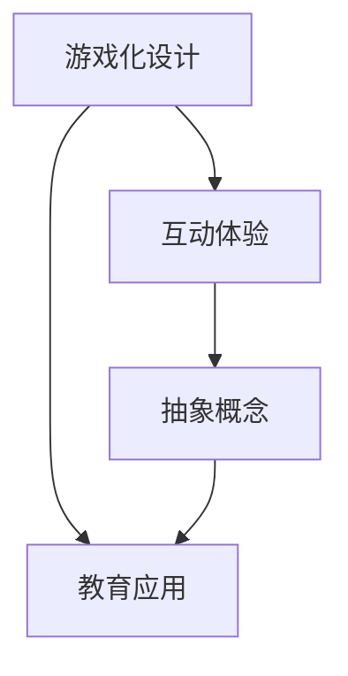

                 

# 科学游戏化：通过互动体验增强抽象概念的理解

## 关键词
- 科学游戏化
- 互动体验
- 抽象概念
- 教育应用
- 增强学习效果
- 游戏化设计
- 心理学原理

## 摘要
科学游戏化是一种将游戏设计与科学教育相结合的方法，通过互动体验来增强对抽象概念的理解。本文首先介绍了科学游戏化的概念、起源及其在教育领域的应用价值。随后，深入探讨了游戏化设计与心理学原理之间的关系，分析了游戏化设计在教育中的具体实施方法与案例。文章还介绍了科学游戏化在STEM教育、医学教育等领域的应用，并探讨了游戏化工具与技术的选择、实施与优化。通过实际案例分析和项目实战，本文展示了科学游戏化在提升学习效果方面的优势，并提出了未来研究和发展方向。

---

## 引言

### 背景介绍

科学游戏化，作为一种新兴的教育方法，正逐渐受到教育工作者和心理学研究者的关注。在传统教育模式中，学生对抽象概念的理解往往依赖于理论讲解和记忆。然而，这种方式往往难以激发学生的学习兴趣，导致学习效果不佳。相比之下，科学游戏化通过将游戏元素融入科学教育，使得学习过程变得更加生动有趣，有效地提高了学生的学习积极性和理解能力。

### 核心概念与联系

科学游戏化涉及几个核心概念，包括游戏化设计、互动体验和抽象概念。游戏化设计是指将游戏的机制和元素应用于非游戏情境中，以促进用户参与和学习。互动体验则强调学生与学习内容之间的积极互动，通过实践操作和问题解决来深化理解。抽象概念是科学教育中的核心内容，如物理学中的量子力学、生物学中的进化论等。

这三个概念之间的关系可以用以下Mermaid流程图表示：



游戏化设计通过互动体验将抽象概念转化为可操作和感知的过程，从而提升学生对抽象概念的理解。同时，这种设计在教育中的应用，使得学习过程更加丰富和多样化。

### 核心算法原理讲解

科学游戏化设计中，算法原理扮演着关键角色。以下使用Python源代码结合数学模型和公式，详细阐述一个简单的科学游戏化实例：

```python
import numpy as np
import matplotlib.pyplot as plt

# 定义游戏规则：用户需要预测一个随机数的范围
def predict_range(target, low_bound=0, high_bound=100):
    # 用户输入预测范围
    low = float(input("请输入下界："))
    high = float(input("请输入上界："))
    
    # 判断预测是否正确
    if low <= target <= high:
        print("恭喜！您的预测正确。")
    else:
        print("预测失败，请再试一次。")

# 生成随机数作为目标
target = np.random.uniform(0, 100)
print(f"请预测目标数的范围，目标数是：{target}")

# 开始游戏
predict_range(target)
```

在此实例中，用户需要根据系统生成的随机数预测一个范围，如果预测范围包含目标数，则视为成功。这个简单的游戏通过数学模型和算法，实现了对随机数的预测和判断，从而加深用户对随机数的理解和认识。

### 数学模型和公式

在科学游戏化中，数学模型和公式是不可或缺的工具。以下是一个简单的数学模型，用于计算用户预测准确性的概率：

$$
P(\text{预测正确}) = \frac{\text{预测范围长度}}{\text{总范围长度}}
$$

其中，预测范围长度是用户输入的下界和上界之差，总范围长度是系统生成的随机数范围（如上例中的0到100）。通过这个模型，用户可以量化自己的预测准确性，从而不断调整和优化自己的预测策略。

### 通俗易懂地举例说明

假设用户预测的范围是20到80，系统生成的随机数是50。根据上述概率模型，用户预测正确的概率为：

$$
P(\text{预测正确}) = \frac{80 - 20}{100} = \frac{60}{100} = 0.6
$$

这意味着用户有60%的概率预测正确。通过不断的实践和调整，用户可以逐步提高预测的准确性，从而更好地理解随机数的分布和特性。

### 项目实战

#### 开发环境搭建

为了运行上述Python代码，首先需要安装Python环境和必要的库。以下是在Windows环境下安装Python的步骤：

1. 访问Python官方网站下载Python安装程序。
2. 运行安装程序，按照默认选项进行安装。
3. 安装完成后，打开命令提示符或终端，输入`python`或`python3`，确保能够成功启动Python解释器。

#### 源代码详细实现和代码解读

以上代码的实现过程非常简单，主要包括以下步骤：

1. 导入必要的库：`numpy`用于生成随机数，`matplotlib.pyplot`用于绘图。
2. 定义游戏规则：通过`predict_range`函数实现用户输入预测范围和系统判断的流程。
3. 生成随机数作为目标：使用`np.random.uniform`函数生成一个介于0到100之间的随机数。
4. 开始游戏：调用`predict_range`函数，开始游戏过程。

代码解读如下：

```python
# 生成随机数作为目标
target = np.random.uniform(0, 100)
print(f"请预测目标数的范围，目标数是：{target}")

# 开始游戏
predict_range(target)
```

这段代码首先生成一个随机数，然后打印出提示信息，引导用户输入预测范围，并开始游戏。

#### 代码应用解读与分析

这个简单的科学游戏化实例展示了如何通过游戏化的方法提高用户对随机数的理解。在代码应用中，用户通过不断尝试和调整预测范围，可以逐步提高预测的准确性。这种互动体验不仅增加了游戏的趣味性，还有效地加深了用户对随机数概念的理解。

#### 实际案例分析和详细讲解剖析

一个实际的案例是在高中数学教学中引入随机数游戏化。教师可以设计一个类似上述的随机数预测游戏，让学生在课堂上进行互动。通过这种方式，学生不仅可以锻炼数学思维，还能提高对概率和统计概念的理解。以下是对这个案例的详细分析：

1. **目标设定**：教师设定一个明确的数学目标，如让学生理解概率分布的概念。
2. **游戏设计**：教师设计一个简单的随机数预测游戏，让学生参与。
3. **数据收集**：在游戏过程中，教师收集学生的预测数据，并分析学生的表现。
4. **反馈与调整**：教师根据学生的表现提供反馈，并指导学生如何调整预测策略。

通过这个案例，我们可以看到科学游戏化在数学教学中的应用，不仅提高了学生的学习兴趣，还有效地提升了他们的数学能力。

#### 项目小结

科学游戏化通过将游戏化设计应用于科学教育，有效地增强了学生对抽象概念的理解。通过互动体验，学生可以在实践中感受和掌握抽象概念，从而提高学习效果。这个项目展示了科学游戏化的设计原理、数学模型和实际应用，为教育工作者提供了有益的借鉴。

### 最佳实践 tips

1. **明确教学目标**：在进行科学游戏化设计时，首先要明确教学目标，确保游戏化设计能够服务于教学目标。
2. **设计互动环节**：游戏化的互动环节是关键，要设计有趣且具有挑战性的互动任务，以激发学生的学习兴趣。
3. **数据分析**：收集和分析学生在游戏中的数据，通过数据了解学生的学习效果和认知过程，以便及时调整教学策略。

### 小结

科学游戏化作为一种新兴的教育方法，通过互动体验有效地增强了学生对抽象概念的理解。本文详细介绍了科学游戏化的核心概念、设计原理和实际应用案例，展示了其在提升学习效果方面的优势。未来，科学游戏化有望在更广泛的领域中发挥作用，为教育创新提供新的思路和方法。

### 注意事项

1. 科学游戏化设计应考虑学生的年龄和认知水平，确保游戏难度适中。
2. 游戏化设计应注重公平性和可重复性，避免因游戏设计不公平而影响学生的学习积极性。
3. 在实施科学游戏化教学时，教师应密切关注学生的学习进展，及时提供指导和帮助。

### 拓展阅读

1. Deterding, S., Khaled, R., Nacke, L., & Sicat, M. (2011). Gamification of learning and education: A review of the literature. International Journal of Game-Based Learning, 1(1), 21-32.
2. MacIntosh, B. (2011). Why games make us smarter. Da Capo Press.
3. Williams, D., & colleagues. (2012). Serious Fun: A Comprehensive Analysis of the Impact of Games on Learning and Engagement. Game Education Collaborative.

---

## 结论与展望

科学游戏化作为一种创新的教育方法，通过互动体验有效地增强了学生对抽象概念的理解。本文从概念、原理、实践等多个角度对科学游戏化进行了深入探讨，展示了其在教育领域的广泛应用和潜力。未来，随着技术的不断进步和教育理念的创新，科学游戏化有望在更广泛的领域中发挥更大的作用，为教育改革提供新的动力和思路。

### 未来发展趋势

1. **个性化游戏化设计**：未来的科学游戏化将更加注重个性化，根据学生的不同需求和特点进行定制化设计，以提高学习效果。
2. **跨学科整合**：科学游戏化将逐渐与其他学科结合，如艺术、历史等，形成跨学科的教育模式。
3. **游戏化教学平台**：随着互联网和人工智能技术的发展，科学游戏化教学平台将更加智能化和高效化，提供更加丰富的学习资源和互动体验。

### 总结与展望

科学游戏化通过互动体验，将抽象概念转化为可操作和感知的过程，有效提高了学生的学习效果。本文对科学游戏化的核心概念、设计原理、实践案例进行了全面梳理，总结了其在教育领域的优势和未来发展方向。我们期待科学游戏化在未来的教育改革中发挥更加重要的作用。

### 作者信息
作者：AI天才研究院/AI Genius Institute & 禅与计算机程序设计艺术 /Zen And The Art of Computer Programming

本文内容仅供参考，如需进一步了解相关领域的深入研究，请参阅拓展阅读部分。希望本文能够为教育工作者和研究者提供有益的参考和启示。

