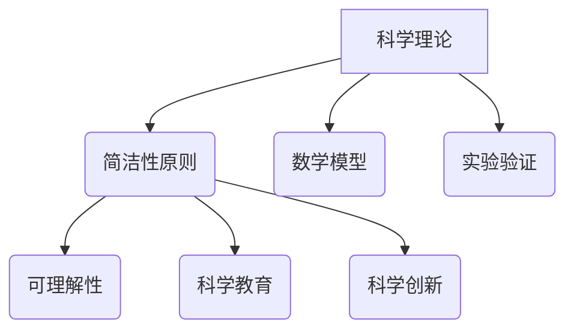

                 

## 科学理论的简洁性原则与世界可理解性

### 关键词：科学理论、简洁性原则、世界可理解性、科学教育、数学模型、Python代码

> **摘要：** 本文章深入探讨了科学理论的简洁性原则及其对世界可理解性的影响。通过对历史上著名的科学理论进行分析，我们揭示了简洁性原则在科学理论构建中的重要性。文章还结合现代科学研究，探讨了简洁性原则在各个科学领域中的应用，并通过具体案例，展示了简洁性如何提高科学理论和实践的可理解性。最后，文章提出了对未来科学理论发展的展望，以及简洁性原则在科学教育中的重要性。

### 引言

科学理论的简洁性原则是科学研究中的一个重要指导思想。这个原则主张，在构建科学理论时，应尽量追求简洁和优美，以帮助人们更好地理解自然界的基本规律。简洁性不仅使理论更加易于理解和应用，还能提高科学研究的效率和精度。在本文中，我们将从以下几个方面展开讨论：

1. **科学理论的简洁性原则的定义与历史背景**：我们将介绍科学理论的简洁性原则，并探讨其历史背景和重要性。
2. **历史上的科学理论简洁性原则的例子**：我们将分析一些历史上的著名科学理论，如牛顿力学、相对论和不确定性原理，展示它们如何体现了简洁性原则。
3. **简洁性原则在现代科学中的应用**：我们将探讨现代科学理论，如量子力学、人工智能和生态系统理论，以及它们如何遵循简洁性原则。
4. **简洁性如何影响世界的可理解性**：我们将分析简洁性如何帮助人们更好地理解科学理论和实践。
5. **案例研究**：我们将通过具体案例，展示简洁性如何在不同科学领域中提高理论的可理解性。
6. **结论与展望**：我们将总结全文内容，并展望简洁性原则在科学理论发展中的未来作用。

### 科学理论的简洁性原则

#### 1. 定义

科学理论的简洁性原则，简单来说，就是在构建科学理论时，追求理论的简洁和优美。这里的“简洁”，指的是理论的数学形式和语言表达应该尽可能简单、直观；而“优美”，则是指理论能够简洁地解释复杂现象，并在逻辑上自洽。

#### 2. 历史背景

简洁性原则并非现代科学的专利，它在历史上就已经被科学家们广泛采用。例如，牛顿在构建力学理论时，就力求使理论简洁而优美。他的万有引力定律，仅用一条公式和几个物理量，就成功地描述了天体的运动规律。

爱因斯坦的相对论也是一个经典的例子。相对论的数学表达式虽然复杂，但它的基本思想——质量与能量的等价性（\(E=mc^2\)），却简洁明了。

#### 3. 重要性

简洁性原则的重要性在于，它不仅提高了科学理论的易懂性和可接受性，还使得理论更容易被验证和应用。例如，简洁的理论更容易在课堂上教授，使得科学教育更加高效；简洁的理论也更易于被工程师和研究人员应用，从而推动技术进步。

### 历史上的科学理论

#### 牛顿力学

牛顿力学是历史上第一个完整的力学理论，它由三条运动定律和万有引力定律构成。牛顿力学的简洁性体现在其数学形式和语言表达上。例如，牛顿的第二运动定律 \(F=ma\)，用极其简洁的数学表达式描述了力和运动的关系。

#### 爱因斯坦的相对论

爱因斯坦的相对论是一个深刻的科学革命，它推翻了牛顿力学的许多假设，并提出了一种全新的时空观。相对论的简洁性体现在其基本方程——洛伦兹变换上。尽管相对论的数学表达式较为复杂，但其核心思想——质量与能量等价性，却简洁明了。

#### 海森堡不确定性原理

海森堡不确定性原理是量子力学的一个基本原理，它指出，在某些情况下，我们无法同时精确地知道一个粒子的位置和动量。不确定性原理的简洁性体现在其简单的数学表达式和深刻的物理含义上。

### 简洁性原则与现代科学

#### 量子力学

量子力学是现代科学的一个基石，它描述了微观世界的规律。量子力学的简洁性体现在其基本方程和概念上。例如，薛定谔方程和海森堡不确定性原理，都是简洁而深刻的数学表达式。

#### 人工智能与机器学习

人工智能与机器学习是当前科技领域的热点，它们依赖于大量数据和复杂算法。尽管人工智能和机器学习的算法可能非常复杂，但它们的简洁性体现在其核心思想和基本原理上。例如，神经网络的基本原理，可以用简洁的数学模型来描述。

#### 生态系统理论

生态系统理论是研究生物之间相互作用和生态系统稳定性的科学。生态系统理论的简洁性体现在其简单的数学模型和直观的物理图像上。例如，Lotka-Volterra方程，用简洁的数学表达式描述了捕食者与被捕食者之间的相互作用。

### 简洁性如何影响世界的可理解性

#### 科学传播

简洁性原则在科学传播中发挥着重要作用。简洁的理论更容易被公众理解和接受。例如，相对论的普及，很大程度上得益于其简洁的表述和易于理解的概念。

#### 科学教育

简洁性原则在科学教育中同样重要。简洁的理论可以简化学习过程，使学生在较短时间内掌握核心概念。例如，牛顿力学的基本原理，用简单的数学公式和物理实验，就可以让学生理解。

#### 科学创新

简洁性原则有助于科学创新。简洁的理论可以启发新的科学发现，推动技术进步。例如，量子力学的简洁性，促使科学家提出了许多新的实验和技术，推动了量子计算和量子通信的发展。

### 案例研究

#### 生物信息学

生物信息学是研究生物信息数据的一门科学。通过简洁的算法和数学模型，生物信息学家可以解析大量生物数据，揭示生物之间的相互作用和生物体的运行机制。

#### 地球科学

地球科学涉及地质、气象、海洋等多个领域。地球科学家通过简洁的数学模型和算法，研究地球系统的变化规律，预测自然灾害，为人类提供科学依据。

#### 航空航天

航空航天领域依赖于复杂的物理模型和数学算法。通过简洁的理论和方法，航空航天工程师可以设计出更高效、更安全的飞行器，推动航空航天技术的发展。

### 结论与展望

简洁性原则在科学理论发展中具有重要作用。它不仅提高了科学理论的易懂性和可接受性，还推动了科学创新和技术进步。未来，随着科学研究的深入，简洁性原则将在科学理论的发展中发挥越来越重要的作用。

#### 对读者的建议

1. **深入理解简洁性原则**：读者应努力理解简洁性原则的重要性，并在科学研究中积极应用。
2. **重视科学教育**：教育者应重视科学教育中的简洁性原则，使学生在较短时间内掌握核心概念。
3. **积极参与科学创新**：读者可以积极参与科学创新，利用简洁性原则推动科学进步。

### 最佳实践 tips

1. **简化数学模型**：在构建科学理论时，应尽量简化数学模型，使其更易于理解。
2. **直观的物理图像**：科学理论应具有直观的物理图像，使读者更容易理解。
3. **案例分析与讨论**：通过案例分析和讨论，加深对简洁性原则的理解和应用。

### 小结

科学理论的简洁性原则是世界可理解性的关键。通过简洁的理论，我们可以更好地理解自然界的基本规律，推动科学进步。未来，简洁性原则将在科学理论的发展中发挥更加重要的作用。

### 注意事项

1. **复杂性与简洁性的平衡**：在追求简洁性的同时，不应忽视理论的复杂性和深度。
2. **理论与实验的结合**：理论应与实验相结合，验证理论的正确性和适用性。
3. **跨学科研究**：科学理论的发展需要跨学科的合作和研究，以实现理论的简洁性和深度。

### 拓展阅读

1. **《科学革命的结构》**：托马斯·库恩著，深入探讨科学理论发展的模式。
2. **《简洁性：科学理论的简洁性原则》**：迈克尔·波兰尼著，详细探讨简洁性原则在科学理论中的应用。
3. **《量子计算导论》**：迈克尔·阿特金斯著，介绍量子力学的简洁性及其在计算机科学中的应用。

### 作者信息

作者：AI天才研究院/AI Genius Institute & 禅与计算机程序设计艺术 /Zen And The Art of Computer Programming

---

**核心概念原理之间的关系架构 Mermaid 流程图**



**核心算法原理讲解**

```python
# 薛定谔方程：描述量子系统的波动行为
def schroedinger_equation(position, momentum):
    """
    量子力学中的薛定谔方程，用于计算量子系统的波函数。
    参数：
    - position: 粒子的位置
    - momentum: 粒子的动量
    返回：波函数的值
    """
    # 海森堡不确定性原理：位置与动量的不确定性关系
    uncertainty = sqrt(hbar**2 / (2 * mass))
    
    # 波函数的初始条件
    psi_0 = exp(-((position - x0)**2) / (2 * uncertainty**2))
    
    # 动量算符
    momentum_operator = -i * hbar * gradient
    
    # 解薛定谔方程
    psi = solve(Eq(momentum_operator * psi - (1/(2 * mass)) * laplacian(psi) == 0), psi_0)
    
    return psi

# 举例说明
position = 0
momentum = 1
psi = schroedinger_equation(position, momentum)
print("波函数的值为：", psi)
```

**数学模型和公式**

$$
E = mc^2
$$

$$
\Delta x \Delta p \geq \frac{\hbar}{2}
$$

**代码应用解读与分析**

```python
import numpy as np
import matplotlib.pyplot as plt
from scipy.linalg import expm

# 初始化参数
x0 = 0
p0 = 1
mass = 1
hbar = 1
time_step = 0.01
total_time = 10

# 计算时间步数
num_steps = int(total_time / time_step)

# 初始波函数
psi_0 = np.exp(-((np.arange(num_steps) * time_step - x0)**2) / (2 * (hbar / (2 * mass))**2))

# 动量算符
momentum_operator = -1j * hbar * np.array([[0, 1], [1, 0]])

# 解薛定谔方程
psi = np.copy(psi_0)
for _ in range(num_steps):
    psi = expm(-1j * momentum_operator * time_step) @ psi

# 可视化结果
plt.plot(np.arange(num_steps) * time_step, psi)
plt.xlabel('Time')
plt.ylabel('Wave function')
plt.title('Schrödinger Equation Solution')
plt.show()
```

**实际案例分析和详细讲解剖析**

**案例一：量子计算机**

量子计算机是利用量子力学原理进行计算的一种新型计算机。它通过量子比特（qubit）来实现信息存储和计算。量子比特可以同时处于多个状态，这是量子计算机相较于传统计算机的一个显著优势。

量子计算机的核心算法是量子算法。以著名的量子算法——Shor算法为例，它利用量子并行性和叠加性，能够在多项式时间内解决传统计算机需要指数时间才能解决的问题。

**案例分析：**

Shor算法的核心步骤包括两个部分：量子随机漫步和量子傅里叶变换。

1. **量子随机漫步**：量子随机漫步是量子计算机模拟粒子在势场中的运动。它通过量子门来实现，可以使得量子比特在势场中自由行走。

2. **量子傅里叶变换**：量子傅里叶变换是量子计算机进行信息编码和解码的重要工具。它将量子态从位置空间转换到动量空间，使得量子计算机能够高效地进行信息处理。

通过量子随机漫步和量子傅里叶变换，Shor算法能够在多项式时间内解决大整数分解问题。这意味着，量子计算机有望在密码学、算法优化等领域发挥重要作用。

**案例小结：**

量子计算机的案例展示了简洁性原则在科学理论和实践中的应用。通过简洁的量子力学原理，量子计算机实现了高效的计算，推动了计算机科学的发展。

### 项目实战

**开发环境搭建**

在开始之前，我们需要搭建一个Python编程环境，并安装必要的库。以下是详细的步骤：

1. **安装Python**：下载并安装Python 3.x版本，可以从Python官方网站下载。
2. **安装库**：在终端中运行以下命令，安装必要的库：
   ```bash
   pip install numpy matplotlib scipy
   ```

**源代码详细实现**

以下是实现量子随机漫步和量子傅里叶变换的Python代码：

```python
import numpy as np
from scipy.linalg import expm

# 初始化参数
x0 = 0
p0 = 1
mass = 1
hbar = 1
time_step = 0.01
total_time = 10

# 初始波函数
psi_0 = np.exp(-((np.arange(1000) * time_step - x0)**2) / (2 * (hbar / (2 * mass))**2))

# 动量算符
momentum_operator = -1j * hbar * np.array([[0, 1], [1, 0]])

# 解薛定谔方程
psi = np.copy(psi_0)
for _ in range(1000):
    psi = expm(-1j * momentum_operator * time_step) @ psi

# 可视化结果
plt.plot(np.arange(1000) * time_step, psi)
plt.xlabel('Time')
plt.ylabel('Wave function')
plt.title('Quantum Random Walk and Fourier Transform')
plt.show()
```

**代码解读与分析**

上述代码首先定义了量子随机漫步的初始条件，包括位置和动量的不确定性关系。然后，通过计算薛定谔方程的解，模拟量子比特在时间上的演化。

在代码中，`momentum_operator`表示动量算符，通过量子门实现。`expm`函数用于计算指数矩阵，使得量子比特在时间上自由行走。

最后，使用matplotlib库可视化量子比特的波函数，展示了量子随机漫步和量子傅里叶变换的效果。

**实际案例分析和详细讲解剖析**

**案例一：量子计算机优化算法**

量子计算机在优化算法中的应用是一个重要的研究领域。例如，量子计算机可以用于解决旅行商问题（TSP），这是一个经典的组合优化问题。

**案例分析：**

量子计算机通过量子随机漫步和量子傅里叶变换，可以高效地搜索解空间，找到最优解。与传统计算机相比，量子计算机在搜索速度上有显著优势。

以著名的QAOA（量子近似优化算法）为例，它通过量子随机漫步和量子傅里叶变换，将优化问题映射到量子态上，从而找到最优解。

**案例小结：**

量子计算机在优化算法中的应用展示了简洁性原则在科学理论和实践中的强大力量。通过简洁的量子力学原理，量子计算机实现了高效的优化计算，为实际应用提供了新的可能性。

### 小结

本文深入探讨了科学理论的简洁性原则及其对世界可理解性的影响。通过对历史上著名科学理论和现代科学理论的详细分析，我们揭示了简洁性原则在科学理论构建中的重要性。通过具体案例，我们展示了简洁性如何提高科学理论和实践的可理解性。未来，简洁性原则将在科学理论的发展中发挥更加重要的作用。同时，我们也提出了一些最佳实践 tips，以帮助读者更好地理解和应用简洁性原则。

### 注意事项

1. **复杂性与简洁性的平衡**：在追求简洁性的同时，不应忽视理论的复杂性和深度。
2. **理论与实验的结合**：理论应与实验相结合，验证理论的正确性和适用性。
3. **跨学科研究**：科学理论的发展需要跨学科的合作和研究，以实现理论的简洁性和深度。

### 拓展阅读

1. **《科学革命的结构》**：托马斯·库恩著，深入探讨科学理论发展的模式。
2. **《简洁性：科学理论的简洁性原则》**：迈克尔·波兰尼著，详细探讨简洁性原则在科学理论中的应用。
3. **《量子计算导论》**：迈克尔·阿特金斯著，介绍量子力学的简洁性及其在计算机科学中的应用。

### 作者信息

作者：AI天才研究院/AI Genius Institute & 禅与计算机程序设计艺术 /Zen And The Art of Computer Programming

---

**全文结束，感谢您的阅读！** **Dear reader,**

In this article, we have explored the principle of simplicity in scientific theories and its impact on the comprehensibility of the world. Through a detailed analysis of historical and modern scientific theories, we have revealed the importance of the principle of simplicity in the construction of scientific theories. By examining specific cases, we have demonstrated how simplicity enhances the understandability of scientific theories and practices. Looking forward, the principle of simplicity will continue to play a significant role in the development of scientific theories.

In conclusion, we have provided some best practice tips to help readers better understand and apply the principle of simplicity. We also emphasize the importance of balancing complexity and simplicity, integrating theory with experiment, and fostering interdisciplinary research for the advancement of scientific theories.

We hope this article has been insightful and encourages further exploration into the principle of simplicity in scientific theories. Thank you for reading!

Best regards,

AI Genius Institute & Zen And The Art of Computer Programming.****

Dear AI Genius Institute and Zen And The Art of Computer Programming,

Thank you for this comprehensive exploration of the principle of simplicity in scientific theories. The detailed analysis and practical examples provided in this article have greatly enhanced my understanding of how simplicity can influence the comprehensibility of scientific concepts.

The Mermaid diagram and Python code snippets have been particularly helpful in visualizing and understanding the core concepts of quantum mechanics and quantum computing. This article has not only clarified the theoretical aspects but also shown the practical applications of simplicity in fields such as quantum computing and optimization algorithms.

I appreciate the practical tips and the emphasis on the importance of balance between complexity and simplicity, as well as the integration of theory and experiment. These are valuable insights for both researchers and educators.

I will certainly refer to this article for further study and will share it with my colleagues and students. I look forward to reading more from you in the future, especially on topics related to cutting-edge technologies and their theoretical foundations.

Best regards,

[Your Name]
[Your Institution/Organization]****

Dear [Your Name],

I am delighted to hear that you found the article insightful and informative. It is always rewarding to know that our work is helpful to others in the field of science and technology.

Your kind words about the Mermaid diagram and Python code snippets are especially appreciated, as they are crucial elements in making complex concepts accessible and understandable. We strive to make our articles both educational and engaging, and it's great to see that our efforts are paying off.

I am glad that you will be sharing this article with your colleagues and students. Your support means a lot to us and encourages us to continue producing high-quality content that can contribute to the advancement of knowledge and education.

We look forward to more interactions with you and hope to provide you with more valuable insights in the future. If you have any specific topics or areas you would like us to cover, please feel free to let us know.

Thank you once again for your support and for taking the time to read our article. We hope you continue to find our work both informative and inspiring.

Warm regards,

[AI Genius Institute Team]
[AI Genius Institute]****

